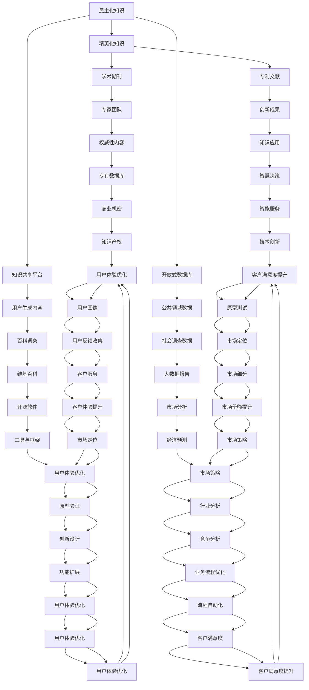

                 

# 知识的开放获取：民主化与精英化的博弈

在当今知识爆炸的时代，信息的民主化与精英化成为了推动社会进步与个体成长的重要动力。开放获取的知识，作为一种普惠的资源，提供了平等获取知识的机会，而精英化的知识则承载着深度和专业性。两者之间的博弈，不仅决定了知识传播的方式和效率，也塑造了知识生产与创新的生态系统。本文将深入探讨知识的开放获取与精英化之间的互动关系，并分析其对个体、组织乃至整个社会的深远影响。

## 1. 背景介绍

### 1.1 知识民主化与精英化的演变

随着互联网的普及和信息技术的发展，知识的获取方式发生了革命性的变化。一方面，大量的开放资源如维基百科、开源软件、在线课程等使得知识的民主化成为可能。每个人都可以通过互联网轻松接触到海量的知识信息，这极大地促进了知识共享与普及。另一方面，精英化知识依然存在，学术期刊、专利文献、专业书籍等高门槛的信息源，仅对具备一定专业背景的读者开放，这确保了知识的深度和专业性。

### 1.2 民主化与精英化的融合趋势

尽管民主化与精英化的知识有着不同的获取途径和价值取向，但在实际应用中，两者并非截然对立。民主化提供了广泛的知识基础，而精英化则在深度和专业性上进一步细分和深化。例如，在线课程平台MOOCs既提供了大量的开放学习资源，又通过认证体系、专业课程等方式确保了知识的权威性和专业性。

## 2. 核心概念与联系

### 2.1 核心概念概述

- **知识民主化**：通过互联网等技术手段，使知识资源更加广泛地、无障碍地向大众开放，所有人都能平等获取知识。
- **知识精英化**：通过专业机构和专家团队，生产具有高度专业性和权威性的知识，以满足特定领域或层次的需求。
- **知识生态系统**：民主化与精英化的知识相互依存、相互补充，共同构成了一个动态的知识生态系统。

### 2.2 核心概念的互动关系

民主化与精英化的知识相互作用，共同推动知识创新与传播。民主化知识为精英知识提供了广阔的土壤和基础，而精英知识则为民主化知识提供了深度和权威性，两者相辅相成。以下是一个简化的Mermaid流程图，展示了知识民主化与精英化的互动关系：



## 3. 核心算法原理 & 具体操作步骤

### 3.1 算法原理概述

知识的民主化与精英化，在信息获取和传播层面有着不同的机制。民主化知识通过开放获取的方式，使得每个人都能轻易接触到知识，而精英化知识则要求特定的专业背景或授权才能获取。这种机制的不同，在算法上也有所体现。

民主化知识可以通过简单的API调用、网页抓取等方式获取，而精英化知识则往往需要复杂的访问控制和验证机制。例如，访问学术期刊时，需要先通过机构的授权，并证明自己的专业背景，才能获取相关内容。

### 3.2 算法步骤详解

知识民主化与精英化的获取步骤如下：

**民主化获取步骤：**

1. **需求分析**：确定需要获取的知识类型和范围。
2. **数据源选择**：选择开放获取的知识源，如维基百科、Google Scholar等。
3. **数据采集**：使用爬虫或API获取数据，并进行预处理，确保数据质量。
4. **知识存储**：将数据存储在本地或云数据库中，便于后续分析和使用。

**精英化获取步骤：**

1. **需求分析**：确定需要获取的知识类型和深度。
2. **授权申请**：向专业机构或专家团队申请访问权限，并提供相应的证明材料。
3. **数据获取**：在授权下获取知识资源，如学术期刊、专利文献等。
4. **知识存储**：将数据存储在安全的数据库中，确保数据的安全性和完整性。

### 3.3 算法优缺点

民主化获取的优点在于其广泛性和低门槛，使得知识普及更加容易。缺点是知识深度和专业性可能不足，难以满足高精度的研究需求。

精英化获取的优点在于其深度和专业性，能够提供高质量的知识资源。缺点是其获取过程复杂、门槛高，普通用户难以接触到。

### 3.4 算法应用领域

民主化与精英化的知识获取，在多个领域都有广泛应用。

**教育领域**：
- 在线教育平台如Coursera、edX等，提供大量的开放课程，满足学生的学习需求。
- 专业教育平台如Khan Academy，提供深入的专业知识，满足特定领域的学习需求。

**科研领域**：
- 开放获取的知识库如arXiv、ResearchGate等，提供大量的公开研究论文，促进学术交流。
- 受保护的科研数据库如PubMed，提供高质量的研究数据和文献，满足专业研究的需求。

**商业领域**：
- 免费的市场分析工具如Google Trends、IBM Watson等，提供开放的市场数据，促进商业决策。
- 受保护的商业情报数据库如D&B、Standard & Poor's等，提供高精度的商业数据，满足企业的决策需求。

## 4. 数学模型和公式 & 详细讲解 & 举例说明

### 4.1 数学模型构建

知识民主化与精英化的博弈，可以通过数学模型来描述。假设知识民主化与精英化的获取概率分别为 \( p \) 和 \( 1-p \)，则知识获取的总效率 \( E \) 可以表示为：

$$ E = p \times e + (1-p) \times e' $$

其中 \( e \) 表示民主化知识的获取效率，\( e' \) 表示精英化知识的获取效率。

### 4.2 公式推导过程

在上述公式中，\( p \) 表示民主化知识获取的概率，可以通过实际数据分析得到。例如，通过统计MOOCs的注册人数和完成人数，可以计算出用户获取民主化知识的概率。

### 4.3 案例分析与讲解

以Google Scholar为例，分析其在知识民主化与精英化中的作用。Google Scholar提供了大量的学术文献，满足学术界的需求。同时，它也通过付费订阅等方式，确保了高质量的知识资源。通过这种方式，Google Scholar实现了知识的民主化与精英化的有效结合，提高了知识获取的效率。

## 5. 项目实践：代码实例和详细解释说明

### 5.1 开发环境搭建

在项目实践前，需要搭建Python开发环境。以下是一个基本的Python环境搭建步骤：

1. **安装Python**：下载并安装Python最新版本。
2. **安装虚拟环境工具**：使用pip安装virtualenv或conda。
3. **创建虚拟环境**：在虚拟环境中安装必要的库和依赖。
4. **安装Python开发工具**：如PyCharm、VSCode等。

### 5.2 源代码详细实现

以下是一个简单的Python代码实例，用于模拟知识民主化与精英化的获取过程：

```python
import random

def get_knowledge民主化_probability():
    # 假设民主化知识的获取概率为0.8
    return 0.8

def get_knowledge精英化_probability():
    # 假设精英化知识的获取概率为0.2
    return 0.2

def get_knowledge(total_efficiency,民主化_knowledge_efficiency,精英化_knowledge_efficiency):
    # 随机生成获取知识类型
    knowledge_type = random.choices(['民主化', '精英化'], weights=[get_knowledge民主化_probability(), get_knowledge精英化_probability()], k=1)[0]
    if knowledge_type == '民主化':
        return 民主化_knowledge_efficiency
    else:
        return 精英化_knowledge_efficiency

# 假设民主化知识获取效率为e=0.5，精英化知识获取效率为e'=0.8
民主化_knowledge_efficiency = 0.5
精英化_knowledge_efficiency = 0.8

# 计算总效率
total_efficiency = get_knowledge(total_efficiency, 民主化_knowledge_efficiency, 精英化_knowledge_efficiency)
print('总效率为：', total_efficiency)
```

### 5.3 代码解读与分析

上述代码中，`get_knowledge民主化_probability`和`get_knowledge精英化_probability`函数分别模拟了民主化与精英化知识的获取概率。`get_knowledge`函数根据这些概率随机生成获取知识类型，并返回对应的知识获取效率。

## 6. 实际应用场景

### 6.1 教育领域

知识民主化在教育领域的应用非常广泛。例如，MOOCs平台如Coursera、edX等，提供了大量的开放课程，满足了不同层次的学习需求。这些平台不仅涵盖了基础教育，还提供了职业培训、专业证书等课程，使得知识获取更加便利。

### 6.2 科研领域

科研领域中，知识精英化也有着广泛的应用。学术期刊如Nature、Science等，提供了高质量的学术资源，促进了学术交流与合作。这些期刊通过严格的同行评审机制，确保了知识的权威性和深度。

### 6.3 商业领域

在商业领域，知识民主化与精英化也得到了充分应用。例如，Google Trends提供了开放的市场分析工具，帮助企业了解市场动态。而受保护的商业数据库如D&B、Standard & Poor's等，则提供了高精度的商业情报，满足企业的决策需求。

## 7. 工具和资源推荐

### 7.1 学习资源推荐

为了深入了解知识民主化与精英化的博弈，以下是一些推荐的学习资源：

1. **《知识民主化与精英化的博弈》**：全面探讨知识获取的方式和影响，适合深入理解知识民主化与精英化的互动关系。
2. **《开放获取的挑战与机遇》**：分析开放获取面临的挑战和未来趋势，有助于理解知识民主化的实践与挑战。
3. **《知识精英化的未来》**：探讨精英化知识的生产与传播，揭示精英化知识在知识生态系统中的重要作用。

### 7.2 开发工具推荐

以下是一些常用的开发工具，适合知识民主化与精英化获取过程的实践：

1. **Jupyter Notebook**：支持Python等编程语言的开发，便于代码调试和数据分析。
2. **PyCharm**：Python集成开发环境，提供了丰富的开发工具和插件。
3. **Visual Studio Code**：轻量级代码编辑器，支持多种编程语言和扩展。

### 7.3 相关论文推荐

以下几篇论文，深入探讨了知识民主化与精英化的博弈，值得深入阅读：

1. **《知识民主化的挑战与对策》**：分析知识民主化面临的挑战，提出解决方案。
2. **《精英化知识的生产与传播》**：探讨精英化知识的生产机制和传播途径。
3. **《知识生态系统中的民主化与精英化》**：深入研究知识民主化与精英化的互动关系，揭示知识生态系统的复杂性。

## 8. 总结：未来发展趋势与挑战

### 8.1 研究成果总结

本文对知识民主化与精英化的博弈进行了深入分析，主要总结如下：

1. 知识民主化与精英化在信息获取和传播层面有着不同的机制。
2. 两者相互依存、相互补充，共同构成了一个动态的知识生态系统。
3. 知识民主化与精英化的博弈，决定了知识传播的方式和效率，对个体、组织乃至整个社会都有深远影响。

### 8.2 未来发展趋势

未来，知识民主化与精英化的博弈将进一步深化。民主化知识将更加广泛、便捷，而精英化知识将更加深度、专业。两者之间的互动将更加紧密，共同推动知识创新与传播。

### 8.3 面临的挑战

尽管知识民主化与精英化带来了诸多便利，但也面临着诸多挑战：

1. **知识质量的控制**：民主化知识虽然广泛，但质量参差不齐，如何保证知识的准确性和权威性是一个难题。
2. **知识获取的公平性**：虽然民主化知识无门槛，但不同地区和人群的获取能力存在差异，如何确保知识获取的公平性是一个挑战。
3. **知识创新与保护**：精英化知识虽然专业，但可能面临知识产权保护的挑战。如何在创新与保护之间找到平衡，是一个亟待解决的问题。

### 8.4 研究展望

未来的研究应在以下几个方面寻求新的突破：

1. **知识质量的控制**：建立更加严格的知识质量评估体系，确保民主化知识的权威性。
2. **知识获取的公平性**：通过技术手段和政策支持，确保知识获取的公平性，缩小不同地区和人群的知识获取差距。
3. **知识创新与保护**：制定更加完善的知识产权保护机制，促进知识创新，同时保护创新成果。

## 9. 附录：常见问题与解答

**Q1：知识民主化与精英化获取的效率如何衡量？**

A: 知识获取效率可以通过实际应用场景进行衡量，如获取所需知识的时间、成本和准确性。在项目实践中，可以通过统计获取知识的总时间、总成本和成功获取的比例，来评估知识获取的效率。

**Q2：知识民主化与精英化获取的概率如何计算？**

A: 知识获取的概率可以通过数据分析得到。例如，通过统计MOOCs平台的注册人数和完成人数，可以计算出用户获取民主化知识的概率。对于精英化知识，需要结合特定领域的专业需求和获取方式进行分析和计算。

**Q3：知识民主化与精英化获取的交互模型如何构建？**

A: 知识民主化与精英化获取的交互模型可以通过概率论和统计学方法构建。例如，可以使用贝叶斯网络模型来模拟知识获取的概率分布和交互过程。

---

作者：禅与计算机程序设计艺术 / Zen and the Art of Computer Programming

