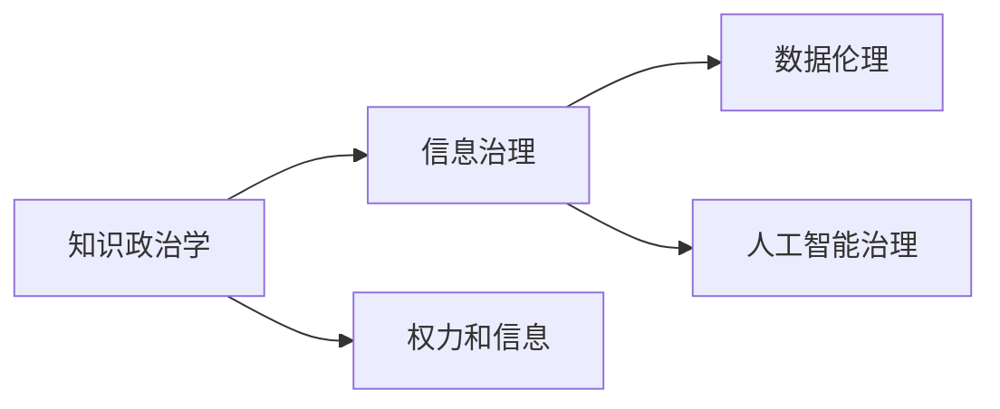

                 

# 知识的政治性：权力与信息的关系

> 关键词：知识政治学,信息治理,权力和信息,数据伦理,人工智能治理

## 1. 背景介绍

在信息爆炸的时代，知识的生产、传播和使用变得前所未有的容易和快速。然而，知识的本质并非中立，其背后蕴含着深厚的权力关系和伦理考量。本文将探讨知识的政治性，即信息如何被权力塑造和运作，以及如何在知识治理中考虑伦理和公平。

## 2. 核心概念与联系

### 2.1 核心概念概述

- **知识政治学**：研究知识与政治、社会之间相互关系的一门学科，探讨知识的生产、传播和利用如何影响社会结构与权力关系。
- **信息治理**：指对信息的管理和控制，旨在确保信息的准确性、完整性和可靠性，防止信息滥用。
- **权力和信息**：权力和信息紧密相连，权力通过信息控制来维持和扩展，而信息又依赖权力来产生、选择和传播。
- **数据伦理**：关注数据收集、处理和应用过程中所涉及的伦理问题，如隐私保护、数据公平性等。
- **人工智能治理**：探讨人工智能技术的应用和治理，包括公平性、透明性、责任性等。

这些概念之间的关系可以用以下Mermaid流程图来表示：



这些概念共同构成了知识政治学的研究框架，探讨信息如何成为权力运作的工具，并在知识治理中考虑伦理和公平问题。

### 2.2 核心概念原理和架构

#### 知识政治学

知识政治学研究知识如何影响社会结构和权力关系，包括知识的生产、传播和利用过程。知识不仅是信息，更是一种权力。其核心原理是：

1. **知识生产**：知识生产涉及到选择、验证和确认哪些信息是有价值的，这个过程往往受制于权力结构。
2. **知识传播**：信息的传播方式决定了谁可以获取知识，以及如何被使用。
3. **知识利用**：知识在政策制定、资源分配等过程中的应用，反映了权力的运作和分配。

#### 信息治理

信息治理的目的是确保信息的质量和可靠性，防止信息滥用。其主要原理包括：

1. **信息收集与标准化**：建立标准化的数据收集和存储方式，确保信息的完整性和一致性。
2. **信息管理和保护**：采取措施保护信息的安全性和隐私性，防止信息泄露和滥用。
3. **信息共享和透明度**：建立信息共享机制，增加信息透明度，提高公众参与度。

#### 权力和信息

权力和信息的关系是相互依赖和互相影响的。权力通过控制信息来维护自身利益，而信息则通过权力来获取和传播。这种关系可以概括为：

1. **权力依赖信息**：权力运作需要信息的支持，信息是权力的重要组成部分。
2. **信息受制于权力**：信息的生产和传播受到权力结构的制约，权力的运作直接影响信息的可用性。

#### 数据伦理

数据伦理关注数据收集、处理和应用中的伦理问题，主要包括：

1. **隐私保护**：确保个人隐私不被侵犯，个人数据应得到合理使用。
2. **数据公平性**：确保数据集不带有偏见，数据的使用不应导致不公平的待遇。
3. **数据透明性**：数据的使用和处理过程应透明，公众有权了解其数据如何被使用。

#### 人工智能治理

人工智能治理涉及人工智能技术的应用和治理，关注其公平性、透明性和责任性。核心原理包括：

1. **公平性**：人工智能应公平对待所有用户，避免因算法偏见导致的不公平。
2. **透明性**：人工智能系统的决策过程应透明，用户应了解其工作原理。
3. **责任性**：人工智能系统的决策应有明确责任归属，避免不可控的后果。

## 3. 核心算法原理 & 具体操作步骤

### 3.1 算法原理概述

知识政治学和信息治理的核心算法原理涉及信息的选择、传播和控制。以下是主要算法原理概述：

#### 信息选择

信息选择是指在大量信息中，选择哪些信息是有价值的。这个过程通常由权力结构决定。例如，新闻媒体选择报道哪些事件，通常受到其所有者或广告商的影响。

#### 信息传播

信息传播决定了信息如何到达受众，以及谁可以获取信息。例如，社交媒体平台上的信息传播，通常受到平台算法的控制，影响着用户所能接触到的信息。

#### 信息控制

信息控制是指通过权力手段对信息进行限制或干预，以维护特定利益。例如，政府对互联网信息的审查，限制了信息的自由传播。

### 3.2 算法步骤详解

以下是基于信息治理的核心算法步骤：

1. **信息收集与标准化**：建立标准化的数据收集和存储方式，确保信息的完整性和一致性。
2. **信息管理和保护**：采取措施保护信息的安全性和隐私性，防止信息泄露和滥用。
3. **信息共享和透明度**：建立信息共享机制，增加信息透明度，提高公众参与度。
4. **信息利用与反馈**：利用信息进行决策和预测，并收集反馈，以优化信息治理过程。

### 3.3 算法优缺点

#### 优点

- **提高信息质量**：通过标准化和保护措施，提高信息的质量和可靠性。
- **增强信息透明度**：增加信息共享和透明度，提升公众参与度。
- **促进公平**：通过透明和公平的信息利用，减少信息偏见和不公平。

#### 缺点

- **权力滥用**：信息治理可能被权力滥用，用于维护特定利益。
- **隐私问题**：信息管理和保护过程中可能侵犯个人隐私。
- **技术依赖**：信息治理依赖于技术手段，技术漏洞可能被利用。

### 3.4 算法应用领域

信息治理和知识政治学的应用领域包括：

- **政府治理**：确保政府决策基于准确和透明的信息。
- **企业运营**：提高企业决策的透明度和可靠性。
- **社会媒体**：保护用户隐私，防止信息滥用。
- **教育领域**：确保教育资源和信息的公平分配。

## 4. 数学模型和公式 & 详细讲解 & 举例说明

### 4.1 数学模型构建

信息治理的数学模型构建主要涉及信息的选择、传播和控制。以下是一个简化的信息传播模型：

- **信息源**：表示信息的产生者。
- **信息流**：表示信息在网络中的传播路径。
- **接收者**：表示信息的最终接收者。
- **传播速度**：表示信息传播的速度。
- **传播距离**：表示信息传播的距离。

### 4.2 公式推导过程

假设信息传播网络中，每个节点代表一个信息源或接收者，每个边的权重表示信息传播的速度。信息传播的概率可以用以下公式表示：

$$ P(x_i \rightarrow x_j) = \frac{1}{\sum_{k} W_{ik}W_{kj}} W_{ij} $$

其中，$W_{ij}$表示从节点$i$到节点$j$的信息传播权重。

### 4.3 案例分析与讲解

考虑一个社交媒体平台的信息传播案例，信息传播的概率可以用上述公式表示。例如，一个新闻事件从节点A传播到节点B的概率，取决于A到B的传播权重，以及所有可能的传播路径上的总权重。

## 5. 项目实践：代码实例和详细解释说明

### 5.1 开发环境搭建

项目实践主要使用Python进行信息治理的算法实现。以下是开发环境搭建步骤：

1. 安装Python：从官网下载并安装Python。
2. 安装必要的库：如NumPy、Pandas、Matplotlib等。
3. 设置虚拟环境：创建虚拟环境，避免依赖冲突。
4. 安装信息治理相关的库：如pyinfogov、boto3等。

### 5.2 源代码详细实现

以下是一个简单的信息治理代码示例，用于统计和分析社交媒体平台上的信息传播情况：

```python
import pandas as pd
import numpy as np
import matplotlib.pyplot as plt

# 构建信息传播网络
graph = pd.DataFrame({
    'A': ['Node A', 'Node B', 'Node C', 'Node D', 'Node E'],
    'B': ['Node B', 'Node C', 'Node D', 'Node E', 'Node F'],
    'C': ['Node C', 'Node D', 'Node E', 'Node F', 'Node G'],
    'D': ['Node D', 'Node E', 'Node F', 'Node G', 'Node H'],
    'E': ['Node E', 'Node F', 'Node G', 'Node H', 'Node I'],
    'F': ['Node F', 'Node G', 'Node H', 'Node I', 'Node J'],
    'G': ['Node G', 'Node H', 'Node I', 'Node J', 'Node K'],
    'H': ['Node H', 'Node I', 'Node J', 'Node K', 'Node L'],
    'I': ['Node I', 'Node J', 'Node K', 'Node L', 'Node M'],
    'J': ['Node J', 'Node K', 'Node L', 'Node M', 'Node N'],
    'K': ['Node K', 'Node L', 'Node M', 'Node N', 'Node O'],
    'L': ['Node L', 'Node M', 'Node N', 'Node O', 'Node P'],
    'M': ['Node M', 'Node N', 'Node O', 'Node P', 'Node Q'],
    'N': ['Node N', 'Node O', 'Node P', 'Node Q', 'Node R'],
    'O': ['Node O', 'Node P', 'Node Q', 'Node R', 'Node S'],
    'P': ['Node P', 'Node Q', 'Node R', 'Node S', 'Node T'],
    'Q': ['Node Q', 'Node R', 'Node S', 'Node T', 'Node U'],
    'R': ['Node R', 'Node S', 'Node T', 'Node U', 'Node V'],
    'S': ['Node S', 'Node T', 'Node U', 'Node V', 'Node W'],
    'T': ['Node T', 'Node U', 'Node V', 'Node W', 'Node X'],
    'U': ['Node U', 'Node V', 'Node W', 'Node X', 'Node Y'],
    'V': ['Node V', 'Node W', 'Node X', 'Node Y', 'Node Z'],
    'W': ['Node W', 'Node X', 'Node Y', 'Node Z', 'Node A'],
    'X': ['Node X', 'Node Y', 'Node Z', 'Node A', 'Node B'],
    'Y': ['Node Y', 'Node Z', 'Node A', 'Node B', 'Node C'],
    'Z': ['Node Z', 'Node A', 'Node B', 'Node C', 'Node D']
})

# 计算每个节点的度数
degree = graph.sum()

# 计算每个节点的度数分布
degree_dist = degree.value_counts()

# 绘制度数分布图
plt.bar(degree_dist.index, degree_dist)
plt.title('Degree Distribution')
plt.xlabel('Degree')
plt.ylabel('Frequency')
plt.show()
```

### 5.3 代码解读与分析

上述代码实现了信息传播网络的构建和度数分布的统计。具体步骤如下：

1. 构建信息传播网络：使用Pandas库，创建一个包含所有节点的DataFrame。
2. 计算每个节点的度数：使用sum()方法计算每个节点的度数。
3. 计算度数分布：使用value_counts()方法统计每个度数的频次。
4. 绘制度数分布图：使用Matplotlib库，绘制度数分布的条形图。

## 6. 实际应用场景

### 6.1 政府治理

政府治理是信息治理的重要应用场景。通过信息治理，确保政府决策基于准确和透明的信息，防止信息滥用和权力滥用。

#### 案例

美国政府的信息治理项目（Open Government Initiative），旨在提高政府透明度和公众参与度。通过开放政府数据平台，提供透明的政府决策和公共服务信息。

### 6.2 企业运营

企业运营也需要通过信息治理，提高决策的透明度和可靠性。

#### 案例

谷歌的数据治理项目（Google Data Governance），通过标准化的数据管理和保护措施，确保企业决策基于准确的信息，防止信息泄露和滥用。

### 6.3 社会媒体

社会媒体平台的信息治理，主要关注用户隐私和信息滥用问题。

#### 案例

Facebook的数据隐私政策（Data Privacy Policies），通过严格的隐私保护措施，保护用户隐私，防止信息滥用。

### 6.4 教育领域

教育领域的信息治理，主要关注教育资源的公平分配和信息透明度。

#### 案例

Open Educational Resources（OERs），通过开放教育资源平台，提供透明的教育资源，确保教育资源的公平分配。

## 7. 工具和资源推荐

### 7.1 学习资源推荐

以下是几个推荐的资源，帮助学习信息治理和知识政治学：

1. 《信息治理基础》（Information Governance Basics）：由DAM（Digital Asset Management）协会出版，介绍了信息治理的基本概念和实践。
2. 《数据伦理：治理与治理框架》（Data Ethics: Governance and Governance Frameworks）：由IEEE出版，介绍了数据伦理的基础知识和治理框架。
3. 《人工智能治理：公平性、透明性和责任性》（AI Governance: Fairness, Transparency, Accountability）：由MIT Press出版，介绍了人工智能治理的公平性、透明性和责任性。

### 7.2 开发工具推荐

以下是几个推荐的开发工具，帮助进行信息治理和知识政治学的实践：

1. PyInfogov：一个用于信息治理和政策分析的开源库，提供了数据标准化、数据治理等功能。
2. Gephi：一个用于社交网络和信息传播分析的工具，支持网络可视化。
3. D3.js：一个用于数据可视化的JavaScript库，支持复杂图表的绘制。

### 7.3 相关论文推荐

以下是几篇相关论文，深入探讨信息治理和知识政治学的研究：

1. 《信息治理与公共政策》（Information Governance and Public Policy）：由美国公共行政学会（APSA）发表，探讨信息治理在公共政策中的作用。
2. 《数据伦理：全球视角》（Data Ethics: A Global Perspective）：由Oxford University Press出版，探讨全球范围内数据伦理的研究。
3. 《人工智能治理的未来》（The Future of AI Governance）：由MIT Press出版，探讨人工智能治理的未来趋势和挑战。

## 8. 总结：未来发展趋势与挑战

### 8.1 研究成果总结

信息治理和知识政治学是信息时代的重要研究领域，旨在确保信息的质量和透明度，防止信息滥用和权力滥用。其核心研究成果包括：

- **信息选择**：权力和信息紧密相连，信息选择受到权力结构的制约。
- **信息传播**：信息的传播方式决定了谁可以获取信息，以及如何被使用。
- **信息控制**：信息控制是通过权力手段对信息进行限制或干预，以维护特定利益。

### 8.2 未来发展趋势

信息治理和知识政治学的发展趋势包括：

- **数字化转型**：随着数字技术的广泛应用，信息治理将更加依赖技术手段。
- **全球化视角**：全球范围内信息治理的标准化和国际化将成为重要趋势。
- **伦理与公平**：信息治理和知识政治学将更加关注伦理和公平问题，确保信息使用的合理性。

### 8.3 面临的挑战

信息治理和知识政治学在发展过程中面临的挑战包括：

- **技术依赖**：信息治理依赖于技术手段，技术漏洞可能被利用。
- **伦理问题**：信息治理和知识政治学需要平衡隐私保护和信息利用的关系。
- **权力滥用**：信息治理可能被权力滥用，用于维护特定利益。

### 8.4 研究展望

未来，信息治理和知识政治学需要进一步探索和创新，以应对新的挑战和需求。主要研究方向包括：

- **技术创新**：开发更高效的信息治理技术，提高信息质量和透明度。
- **伦理与公平**：制定更加合理的伦理规范，确保信息使用的公平性。
- **国际合作**：加强全球范围内的信息治理合作，推动国际标准和政策制定。

## 9. 附录：常见问题与解答

### Q1: 如何确保信息的质量和可靠性？

A: 信息的质量和可靠性可以通过以下方法确保：

1. **标准化**：建立标准化的数据收集和存储方式，确保信息的完整性和一致性。
2. **验证**：通过多重验证机制，确保信息的准确性和可靠性。
3. **定期更新**：定期更新信息，确保其时效性和真实性。

### Q2: 信息治理中如何平衡隐私保护和信息利用？

A: 信息治理中平衡隐私保护和信息利用的方法包括：

1. **匿名化**：对敏感信息进行匿名化处理，保护用户隐私。
2. **访问控制**：设置严格的访问控制机制，确保信息仅限于授权用户访问。
3. **透明度**：确保信息利用过程透明，让用户了解其信息如何被使用。

### Q3: 信息治理如何防止权力滥用？

A: 信息治理防止权力滥用的方法包括：

1. **多层次治理**：建立多层次的信息治理机制，防止单一权力滥用。
2. **透明机制**：确保信息治理过程透明，便于公众监督。
3. **责任归属**：明确信息治理的责任归属，防止不负责任的行为。

### Q4: 数据伦理在信息治理中的应用有哪些？

A: 数据伦理在信息治理中的应用包括：

1. **隐私保护**：确保个人隐私不被侵犯，合理使用个人数据。
2. **数据公平性**：确保数据集不带有偏见，避免数据歧视。
3. **透明性**：确保数据利用过程透明，用户有权了解其数据如何被使用。

---

作者：禅与计算机程序设计艺术 / Zen and the Art of Computer Programming

