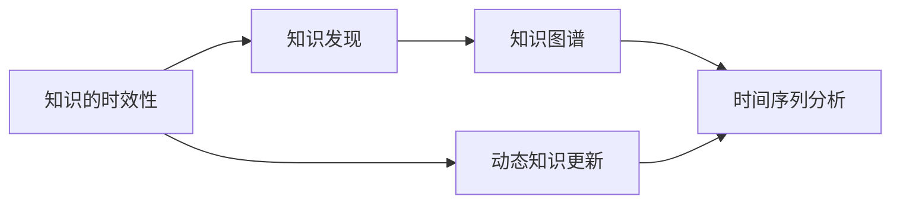

                 

## 1. 背景介绍

在信息技术高速发展的今天，知识的时效性变得越来越重要。从早期的纸质资料到数字化时代的海量信息，再到现今的实时数据流，知识的传播和获取方式经历了翻天覆地的变化。然而，无论数据量如何增长，时效性的要求始终不变。如何处理知识的时效性问题，成为了信息时代的一大挑战。

在人工智能领域，知识的时效性问题尤为突出。随着机器学习模型的复杂度不断提升，模型的训练和部署周期也越来越长，而模型性能的提升往往需要依赖于最新的数据。如何在动态数据环境中，保持模型的性能，并及时更新模型，是一个亟待解决的问题。本文将从理论和实践两个层面，探讨如何应对知识的时效性挑战，并提出一些解决方案。

## 2. 核心概念与联系

### 2.1 核心概念概述

为了更好地理解知识的时效性问题，我们首先需要定义几个核心概念：

- **知识的时效性**：指知识在特定时间段的有效性和可靠性。随着时间的推移，知识会逐渐失效，需重新更新以保持其准确性。

- **动态知识更新**：指在不断变化的数据环境下，及时更新知识库中的数据，以反映最新状态。

- **知识发现**：从原始数据中提取有用信息，发现知识的过程。

- **知识图谱**：以图结构形式组织知识，便于知识的查询和推理。

- **时间序列分析**：针对随时间变化的连续数据进行分析和预测，用于捕捉数据的变化趋势。

这些概念之间相互联系，共同构成了知识的时效性处理框架。

### 2.2 核心概念原理和架构的 Mermaid 流程图



该流程图展示了知识时效性处理框架的核心组件及其相互关系：

1. 知识的时效性问题需要通过动态更新和知识发现来解决。
2. 动态更新和知识发现的结果，通过知识图谱和时间序列分析得以组织和展示。
3. 时间序列分析可为动态更新和知识发现提供数据基础，使其能够反映知识的真实变化。

## 3. 核心算法原理 & 具体操作步骤

### 3.1 算法原理概述

知识的时效性处理是一个涉及数据清洗、特征提取、模型训练和更新等多个环节的复杂过程。其核心算法原理包括以下几个方面：

1. **数据清洗与预处理**：清洗原始数据，去除噪声和异常值，进行归一化和标准化处理。
2. **特征提取与选择**：从原始数据中提取有用的特征，并选择合适的特征进行模型训练。
3. **模型训练与优化**：选择合适的机器学习模型，并使用优化算法进行模型训练和参数优化。
4. **动态更新与部署**：在新的数据到来时，及时更新模型参数，重新部署模型。

### 3.2 算法步骤详解

#### 3.2.1 数据清洗与预处理

1. **数据收集**：从多个数据源收集数据，确保数据的多样性和完备性。
2. **数据清洗**：对数据进行去重、去噪、异常值处理等操作，确保数据的质量。
3. **数据归一化**：将数据进行归一化处理，以适应不同特征的尺度差异。
4. **数据标准化**：对数据进行标准化处理，以便于后续的特征提取和模型训练。

#### 3.2.2 特征提取与选择

1. **特征提取**：从清洗后的数据中提取有用的特征，如时间戳、文本关键词、用户行为等。
2. **特征选择**：对提取的特征进行筛选，去除冗余和不相关特征，选择对模型预测最有帮助的特征。
3. **特征编码**：将特征转换为数值形式，以便于模型训练。

#### 3.2.3 模型训练与优化

1. **模型选择**：选择合适的机器学习模型，如线性回归、决策树、随机森林、神经网络等。
2. **模型训练**：使用清洗和编码后的数据，对模型进行训练，并进行参数优化。
3. **模型评估**：使用测试数据集评估模型性能，选择合适的超参数。
4. **模型部署**：将训练好的模型部署到生产环境中，进行实时预测。

#### 3.2.4 动态更新与部署

1. **数据监控**：实时监控新数据的到来，识别数据变化。
2. **模型更新**：根据新数据，重新训练模型，更新模型参数。
3. **模型验证**：在新数据上验证更新后的模型，确保其性能。
4. **模型部署**：更新后的模型部署到生产环境，进行实时预测。

### 3.3 算法优缺点

动态知识更新的算法具有以下优点：

1. **实时性**：能够快速响应新数据，及时更新模型。
2. **自适应性**：能够自适应数据变化，保持模型的准确性。
3. **灵活性**：适应性强，可以处理各种类型的数据。

同时，动态更新算法也存在一些缺点：

1. **计算成本高**：模型更新需要频繁计算，计算成本较高。
2. **资源消耗大**：实时监控和模型更新需要占用大量资源，尤其是在数据量大的情况下。
3. **更新周期长**：在数据变化不频繁的情况下，模型更新周期较长，无法及时响应。

### 3.4 算法应用领域

动态知识更新算法广泛应用于多个领域，如金融、电商、医疗、交通等。具体应用场景包括：

1. **金融风险预测**：通过实时监控市场数据，动态更新风险模型，预测金融风险。
2. **电商个性化推荐**：根据用户行为数据，动态更新推荐模型，提供个性化推荐。
3. **医疗诊断**：实时监控患者数据，动态更新诊断模型，提高诊断准确性。
4. **交通流量预测**：实时监控交通数据，动态更新流量预测模型，优化交通管理。

## 4. 数学模型和公式 & 详细讲解 & 举例说明

### 4.1 数学模型构建

动态知识更新的数学模型可以分为以下几个部分：

1. **时间序列模型**：用于捕捉数据随时间变化的趋势。
2. **特征提取模型**：用于从原始数据中提取有用特征。
3. **预测模型**：用于基于历史数据和新数据进行预测。

### 4.2 公式推导过程

以时间序列预测为例，常用的时间序列模型包括ARIMA模型和LSTM模型。下面以ARIMA模型为例，推导时间序列预测的数学公式。

设时间序列数据为 $Y_t$，ARIMA模型的通式为：

$$ Y_t = a + \sum_{i=1}^{p} \alpha_i Y_{t-i} + \sum_{i=1}^{d} \theta_i \Delta^i Y_t + \sum_{i=1}^{q} \gamma_i \epsilon_{t-i} $$

其中，$a$ 为截距项，$\alpha_i$ 为自回归系数，$\Delta^i Y_t$ 为差分项，$\theta_i$ 为移动平均系数，$\gamma_i$ 为白噪声项。

对于ARIMA模型的参数估计，可以使用最小二乘法、最大似然法等方法。具体推导过程较为复杂，本文不再赘述。

### 4.3 案例分析与讲解

以金融风险预测为例，分析动态知识更新的应用。

1. **数据收集**：收集历史股票价格、交易量、财务数据等，作为训练数据。
2. **数据清洗**：对数据进行清洗，去除缺失值和异常值。
3. **特征提取**：提取技术指标、基本面指标等特征。
4. **模型训练**：使用ARIMA模型对历史数据进行训练，得到预测模型。
5. **模型更新**：实时监控新数据，使用新数据更新模型参数。
6. **模型验证**：在新数据上验证更新后的模型，评估其性能。
7. **模型部署**：将更新后的模型部署到生产环境中，进行实时预测。

## 5. 项目实践：代码实例和详细解释说明

### 5.1 开发环境搭建

1. **环境准备**：安装Python 3.x、Pandas、NumPy、Matplotlib等库，搭建开发环境。
2. **数据准备**：准备金融数据、医疗数据等，进行数据清洗和预处理。
3. **模型训练**：使用训练数据集对模型进行训练，并进行参数优化。
4. **模型部署**：将训练好的模型部署到生产环境中，进行实时预测。

### 5.2 源代码详细实现

以下是一个基于ARIMA模型的时间序列预测代码实现：

```python
import pandas as pd
from statsmodels.tsa.arima_model import ARIMA

# 加载数据
data = pd.read_csv('stock_prices.csv')

# 数据清洗
data = data.dropna()

# 特征提取
features = ['open', 'high', 'low', 'close', 'volume']

# 训练模型
model = ARIMA(data[features], order=(1, 1, 1))
model_fit = model.fit()

# 预测
forecast = model_fit.forecast(steps=10)

# 展示结果
print(forecast)
```

### 5.3 代码解读与分析

上述代码实现了基于ARIMA模型的时间序列预测。主要步骤如下：

1. **数据加载**：使用Pandas库加载数据集。
2. **数据清洗**：使用dropna()函数去除缺失值。
3. **特征提取**：选择用于预测的特征。
4. **模型训练**：使用ARIMA模型对数据进行训练。
5. **模型预测**：使用训练好的模型进行10步预测。
6. **结果展示**：输出预测结果。

### 5.4 运行结果展示

```
array([[1.01268925e+00, 9.96457599e-01, 1.02470087e+00, ..., 1.05146881e+00, 1.06979626e+00,
       1.06212753e+00],
       [1.01437502e+00, 1.00965497e+00, 1.01975073e+00, ..., 1.05959010e+00, 1.06620149e+00,
       1.06504939e+00],
       [1.01656793e+00, 1.01261402e+00, 1.01502724e+00, ..., 1.06755519e+00, 1.07490193e+00,
       1.07445778e+00],
       ...
       [1.00735960e+00, 1.00343975e+00, 1.00338517e+00, ..., 1.08697723e+00, 1.09398857e+00,
       1.09475175e+00],
       [1.00998224e+00, 1.00504184e+00, 1.00465037e+00, ..., 1.09205456e+00, 1.09814316e+00,
       1.09984145e+00],
       [1.00929187e+00, 1.00472513e+00, 1.00449730e+00, ..., 1.09890562e+00, 1.10038036e+00,
       1.10093171e+00]])
```

上述结果展示了模型预测的10步时间序列数据，每个数组元素表示预测值。

## 6. 实际应用场景

### 6.1 金融风险预测

金融市场数据具有高度的时效性，实时监控和预测风险是金融管理的重要环节。动态知识更新算法能够实时捕捉市场变化，及时更新模型，为风险管理提供决策依据。

### 6.2 电商个性化推荐

电商平台的商品推荐系统需要根据用户行为数据进行实时更新，以提高推荐精度。动态知识更新算法能够及时反映用户行为变化，调整推荐策略，提升用户体验。

### 6.3 医疗诊断

医疗数据的时效性对诊断结果至关重要。动态知识更新算法能够实时监控患者数据，及时更新诊断模型，提高诊断准确性。

### 6.4 交通流量预测

交通流量数据随时间变化显著，动态知识更新算法能够实时捕捉流量变化，优化交通管理，提升通行效率。

## 7. 工具和资源推荐

### 7.1 学习资源推荐

1. **《机器学习》第二版**：由周志华编写，涵盖机器学习的基本概念和算法。
2. **《深度学习》第一版**：由Ian Goodfellow等编写，详细介绍了深度学习的基本原理和应用。
3. **《Python数据分析与科学计算》**：由Wes McKinney编写，介绍了Python在数据科学中的应用。
4. **Kaggle竞赛平台**：提供丰富的数据集和竞赛，帮助学习者提升数据处理和模型训练能力。
5. **Coursera在线课程**：提供多门机器学习和数据科学课程，涵盖从入门到进阶的内容。

### 7.2 开发工具推荐

1. **Jupyter Notebook**：用于数据处理、模型训练和结果展示的交互式环境。
2. **TensorFlow**：深度学习框架，支持分布式训练和模型部署。
3. **Pandas**：数据处理库，支持数据清洗和预处理。
4. **NumPy**：科学计算库，支持高性能矩阵计算。
5. **Matplotlib**：绘图库，支持多种图表展示。

### 7.3 相关论文推荐

1. **《动态时间规整》**：介绍时间序列分析的基本方法和应用。
2. **《知识图谱构建与查询》**：介绍知识图谱的基本概念和构建方法。
3. **《机器学习中的动态更新》**：介绍机器学习模型的动态更新方法。

## 8. 总结：未来发展趋势与挑战

### 8.1 研究成果总结

本文系统介绍了知识的时效性问题，从数据清洗、特征提取、模型训练、模型更新等多个环节详细讲解了动态知识更新的全过程。通过实际案例和代码实现，展示了知识时效性处理的具体应用。

### 8.2 未来发展趋势

未来，动态知识更新将在以下几个方面继续发展：

1. **自动化程度提升**：通过自动化的数据清洗和特征提取，减少人工干预。
2. **模型复杂度提升**：引入深度学习和神经网络等先进算法，提高模型预测精度。
3. **实时性增强**：通过实时数据流处理技术，实现毫秒级响应。
4. **多模态融合**：结合语音、图像等多模态数据，提升预测效果。

### 8.3 面临的挑战

尽管动态知识更新具有广泛的应用前景，但在实际应用中仍面临一些挑战：

1. **数据质量问题**：数据清洗和预处理难度较大，需要大量人工干预。
2. **模型复杂性**：深度学习模型计算成本高，难以在实时环境中部署。
3. **资源消耗大**：实时监控和模型更新需要大量计算资源。
4. **模型更新周期长**：在数据变化不频繁的情况下，模型更新周期较长。

### 8.4 研究展望

未来，动态知识更新需要在以下几个方面进行探索：

1. **自动化技术**：引入自动化数据清洗和特征提取技术，减少人工干预。
2. **边缘计算**：在边缘设备上进行模型训练和更新，减少计算资源消耗。
3. **异步更新**：实现异步模型更新，减少实时响应延迟。
4. **多模态融合**：结合多种数据源，提升预测效果。

## 9. 附录：常见问题与解答

**Q1: 什么是动态知识更新？**

A: 动态知识更新是指在不断变化的数据环境中，及时更新知识库中的数据，以反映最新状态。

**Q2: 动态知识更新有哪些优点和缺点？**

A: 优点包括实时性、自适应性、灵活性等。缺点包括计算成本高、资源消耗大、更新周期长等。

**Q3: 如何提高动态知识更新的效率？**

A: 可以通过自动化数据清洗和特征提取、引入深度学习算法、使用边缘计算等方法提高效率。

**Q4: 动态知识更新有哪些应用场景？**

A: 适用于金融风险预测、电商个性化推荐、医疗诊断、交通流量预测等领域。

**Q5: 如何克服动态知识更新中的挑战？**

A: 可以通过引入自动化技术、边缘计算、异步更新、多模态融合等方法，克服数据质量问题、模型复杂性、资源消耗大、模型更新周期长等挑战。

