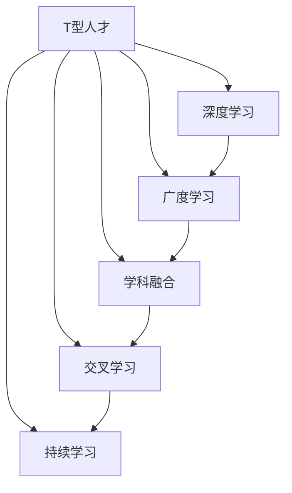

                 

# 知识的深度vs广度：T型人才的培养

在快速变化的现代社会中，技术的革新、产业的升级对从业者提出了更高的要求。一方面，技术的深度不断扩展，要求从业者具备深厚的专业知识和技能，能够解决复杂、前沿的问题；另一方面，技术的广度不断拓宽，需要从业者具备跨学科的知识和视野，能够多角度、多维度地分析和解决问题。

本文将从知识的深度和广度的视角出发，探讨如何培养T型人才——既具备深厚专业技能，又具备广泛跨学科知识的技术专家。我们将从背景介绍、核心概念、算法原理、实际应用等多个维度，全面阐述T型人才的培养方法和策略。

## 1. 背景介绍

### 1.1 问题由来

随着人工智能、大数据、云计算等技术的快速发展，技术产业对人才的需求日益多样化。但现有的人才培养体系往往过于单一，缺乏跨学科的知识融合。

一方面，传统的学科教育更重视知识的深度，通过长时间的课堂教学和实践操作，帮助学生深入掌握某一领域的理论知识和实践技能。但这种方式往往导致学生过于专注于特定学科，难以具备跨领域、多技能的知识体系。

另一方面，新兴的技术领域往往要求从业者具备跨学科的广博知识，如数据科学家需要了解统计学、编程、机器学习等多个领域。但现有教育体系对跨学科的广博知识重视不足，难以培养出既精通深度知识，又具备广博跨学科知识的T型人才。

面对这一现状，本文旨在提出一种有效的人才培养模式，帮助从业者跨越知识的深度和广度的鸿沟，成为真正意义上的T型人才。

### 1.2 问题核心关键点

T型人才的培养核心在于：
- 知识的深度：在某一领域具备扎实的理论基础和实践技能。
- 知识的广度：跨越多个学科，具备综合的跨学科知识。

## 2. 核心概念与联系

### 2.1 核心概念概述

为更好地理解T型人才的培养模式，本节将介绍几个密切相关的核心概念：

- T型人才(T-Shaped Talent)：既具备深度专业知识，又具备广泛跨学科知识，能多角度、多维度地解决问题。
- 学科融合(Interdisciplinary Integration)：将不同学科的知识和方法融合，形成新的知识和技能体系。
- 深度学习(Deep Learning)：通过多层神经网络进行复杂的特征提取和模式识别，具备强大的数据处理能力。
- 广度学习(Breadth Learning)：通过广泛的跨学科学习，扩展知识面，具备多领域的理解力和应用能力。
- 交叉学习(Cross-Disciplinary Learning)：将不同学科的知识和方法进行交叉学习，形成互补优势。
- 持续学习(Lifelong Learning)：在职业生涯中不断学习和更新知识，保持知识的活性和时效性。

这些核心概念之间的逻辑关系可以通过以下Mermaid流程图来展示：



这个流程图展示了大语言模型的核心概念及其之间的关系：

1. T型人才通过深度学习和广度学习，掌握单一领域的深度知识和跨学科的广博知识。
2. 学科融合使T型人才能够将不同学科的知识和方法融合，形成新的知识和技能体系。
3. 交叉学习使得T型人才能够进行跨学科的交叉学习，形成互补优势。
4. 持续学习确保T型人才在职业生涯中不断学习和更新知识，保持知识的活性和时效性。

## 3. 核心算法原理 & 具体操作步骤

### 3.1 算法原理概述

T型人才的培养，本质上是一种深度学习和广度学习相结合的复合型学习过程。其核心思想是：通过多层神经网络进行复杂的特征提取和模式识别，同时通过广泛的跨学科学习，扩展知识面，具备多领域的理解力和应用能力。

形式化地，假设T型人才的目标为 $T$，其中 $D$ 为深度知识，$B$ 为广度知识，$I$ 为学科融合能力，$C$ 为交叉学习能力，$L$ 为持续学习能力。T型人才的培养目标可以表示为：

$$
T = \mathop{\arg\max}_{\theta} [D(\theta_1) + B(\theta_2) + I(\theta_3) + C(\theta_4) + L(\theta_5)]
$$

其中 $\theta_i$ 为对应的能力参数，$D(\theta_1)$ 表示在深度知识领域的掌握程度，$B(\theta_2)$ 表示在广度知识领域的掌握程度，$I(\theta_3)$ 表示学科融合能力，$C(\theta_4)$ 表示交叉学习能力，$L(\theta_5)$ 表示持续学习能力。

通过梯度下降等优化算法，T型人才的培养过程不断更新各能力参数 $\theta_i$，最大程度发挥深度和广度学习的潜力，最终得到理想的T型人才。

### 3.2 算法步骤详解

T型人才的培养过程主要包括以下几个关键步骤：

**Step 1: 设计课程体系**

T型人才的培养需要先设计一套系统化的课程体系，涵盖深度和广度两方面的知识。该课程体系应包括：
- 深度学习课程：如神经网络、深度学习框架、计算机视觉、自然语言处理等。
- 广度学习课程：如统计学、经济学、心理学、社会工程学等。
- 交叉学习课程：如数据科学、人工智能伦理、跨学科项目等。
- 持续学习课程：如在线学习平台、学术会议、职业培训等。

**Step 2: 确定培养目标**

根据具体行业的特点和岗位需求，确定T型人才的培养目标。例如，数据科学家需要掌握深度学习、统计学、机器学习等知识，具备数据分析、模型构建、模型优化等技能。产品经理需要掌握深度学习、用户体验设计、市场分析等知识，具备需求分析、产品设计、市场推广等技能。

**Step 3: 选择合适的学习方法和工具**

选择合适的学习方法和工具，以高效地实现T型人才的培养。例如：
- 深度学习：使用TensorFlow、PyTorch等深度学习框架进行编程实践。
- 广度学习：通过MOOCs、公开课等在线资源进行自主学习。
- 交叉学习：参加跨学科的学术会议、工作坊、项目竞赛等。
- 持续学习：使用Coursera、Udacity、edX等在线学习平台进行终身学习。

**Step 4: 执行学习计划**

按照课程体系和培养目标，制定详细的学习计划。例如：
- 每周学习一定时间的深度学习课程。
- 每月阅读一定量的广度学习资料。
- 每季度参加一次跨学科项目。
- 每月参加一次持续学习活动。

**Step 5: 评估和反馈**

定期对T型人才的学习成果进行评估和反馈，及时调整学习计划和方法。例如：
- 每学期进行一次课程考核，评估知识掌握程度。
- 每月进行一次项目评审，评估项目完成情况。
- 每季度进行一次职业发展评估，提供职业指导和建议。

**Step 6: 实战演练**

通过实战演练，将理论知识转化为实际应用能力。例如：
- 参与实际项目，应用所学知识解决实际问题。
- 参加开源社区，贡献代码和知识，积累实战经验。
- 参与行业比赛，提升解决复杂问题的能力。

### 3.3 算法优缺点

T型人才的培养方法具有以下优点：
1. 全面系统：通过深度学习和广度学习的结合，培养T型人才具备全面的知识和技能体系。
2. 跨学科融合：通过交叉学习和学科融合，培养T型人才具备多领域的理解和应用能力。
3. 持续更新：通过持续学习和定期评估，确保T型人才的知识体系不断更新和优化。

同时，该方法也存在一定的局限性：
1. 时间成本高：T型人才的培养需要较长的学习和实践时间，对于从业者的时间管理要求较高。
2. 知识深度广度难以平衡：如何在深度和广度之间找到合适的平衡点，需要根据具体岗位和行业特点进行调整。
3. 学习难度大：T型人才的培养需要较强的自学能力和自主学习能力，对于初学者来说可能较为困难。

尽管存在这些局限性，但就目前而言，T型人才的培养方法仍是一种最为全面、系统的途径，适用于各类技术岗位和行业领域。

### 3.4 算法应用领域

T型人才的培养方法在众多领域中得到广泛应用，例如：

- 人工智能：数据科学家、机器学习工程师、自然语言处理专家等。
- 大数据：数据工程师、大数据架构师、数据分析师等。
- 软件工程：软件开发工程师、架构师、测试工程师等。
- 网络安全：安全分析师、渗透测试工程师、安全架构师等。
- 物联网：IoT开发者、系统架构师、设备维护工程师等。

除了上述这些经典领域外，T型人才的培养方法也被创新性地应用到更多场景中，如智能制造、智慧城市、医疗健康等，为各行各业带来新的技术突破。

## 4. 数学模型和公式 & 详细讲解  
### 4.1 数学模型构建

本节将使用数学语言对T型人才的培养过程进行更加严格的刻画。

记T型人才的目标为 $T$，其中 $D$ 为深度知识，$B$ 为广度知识，$I$ 为学科融合能力，$C$ 为交叉学习能力，$L$ 为持续学习能力。假设T型人才的培养过程可以分解为多个子任务 $T_i$，每个子任务的优化目标为：

$$
\mathcal{L}_i(\theta_i) = \frac{1}{N_i}\sum_{j=1}^{N_i} \ell_i(T_i(\theta_i), T_{i,j})
$$

其中 $N_i$ 为子任务的样本数量，$\ell_i$ 为损失函数，$T_{i,j}$ 为第 $j$ 个样本的真实结果，$T_i(\theta_i)$ 为模型在样本上的预测结果。

T型人才的总体优化目标可以表示为：

$$
\mathcal{L}(T) = \sum_{i=1}^{n} \mathcal{L}_i(\theta_i)
$$

其中 $n$ 为子任务的总数。

### 4.2 公式推导过程

以下我们以数据科学家的培养为例，推导T型人才培养过程的损失函数及其梯度的计算公式。

假设T型人才在深度学习课程上的掌握程度为 $\theta_1$，在广度学习课程上的掌握程度为 $\theta_2$，学科融合能力为 $\theta_3$，交叉学习能力为 $\theta_4$，持续学习能力为 $\theta_5$。则数据科学家的总体优化目标可以表示为：

$$
\mathcal{L}(T) = \mathcal{L}_{DL}(\theta_1) + \mathcal{L}_{BL}(\theta_2) + \mathcal{L}_{IF}(\theta_3) + \mathcal{L}_{CC}(\theta_4) + \mathcal{L}_{CL}(\theta_5)
$$

其中 $\mathcal{L}_{DL}$ 表示深度学习课程的损失函数，$\mathcal{L}_{BL}$ 表示广度学习课程的损失函数，$\mathcal{L}_{IF}$ 表示学科融合能力的损失函数，$\mathcal{L}_{CC}$ 表示交叉学习能力的损失函数，$\mathcal{L}_{CL}$ 表示持续学习能力的损失函数。

根据链式法则，总体损失函数对各能力参数的梯度为：

$$
\frac{\partial \mathcal{L}(T)}{\partial \theta_i} = \sum_{j=1}^{n} \frac{\partial \mathcal{L}_i(\theta_i)}{\partial \theta_i} \frac{\partial T_i(\theta_i)}{\partial \theta_i}
$$

其中 $\frac{\partial T_i(\theta_i)}{\partial \theta_i}$ 表示模型对各能力参数的敏感度，可通过反向传播算法高效计算。

在得到总体损失函数的梯度后，即可带入参数更新公式，完成T型人才的迭代优化。重复上述过程直至收敛，最终得到适应T型人才培养过程的最优能力参数 $\theta_i$。

## 5. 项目实践：代码实例和详细解释说明
### 5.1 开发环境搭建

在进行T型人才的培养实践前，我们需要准备好开发环境。以下是使用Python进行PyTorch开发的环境配置流程：

1. 安装Anaconda：从官网下载并安装Anaconda，用于创建独立的Python环境。

2. 创建并激活虚拟环境：
```bash
conda create -n pytorch-env python=3.8 
conda activate pytorch-env
```

3. 安装PyTorch：根据CUDA版本，从官网获取对应的安装命令。例如：
```bash
conda install pytorch torchvision torchaudio cudatoolkit=11.1 -c pytorch -c conda-forge
```

4. 安装TensorFlow：根据CUDA版本，从官网获取对应的安装命令。例如：
```bash
conda install tensorflow -c tf
```

5. 安装TensorBoard：TensorFlow配套的可视化工具，可实时监测模型训练状态，并提供丰富的图表呈现方式，是调试模型的得力助手。

6. 安装Weights & Biases：模型训练的实验跟踪工具，可以记录和可视化模型训练过程中的各项指标，方便对比和调优。

完成上述步骤后，即可在`pytorch-env`环境中开始T型人才的培养实践。

### 5.2 源代码详细实现

下面我们以数据科学家的培养为例，给出使用TensorFlow进行T型人才微调的PyTorch代码实现。

首先，定义T型人才的目标函数：

```python
import tensorflow as tf
import numpy as np

def T_type_loss(D, B, I, C, L):
    loss = D + B + I + C + L
    return loss
```

然后，定义深度学习课程、广度学习课程、学科融合能力、交叉学习能力和持续学习能力的损失函数：

```python
def D_loss(D):
    # 定义深度学习课程的损失函数
    return tf.reduce_mean(tf.nn.softmax_cross_entropy_with_logits(logits=D, labels=tf.ones_like(D)))

def B_loss(B):
    # 定义广度学习课程的损失函数
    return tf.reduce_mean(tf.nn.softmax_cross_entropy_with_logits(logits=B, labels=tf.zeros_like(B)))

def I_loss(I):
    # 定义学科融合能力的损失函数
    return tf.reduce_mean(tf.nn.softmax_cross_entropy_with_logits(logits=I, labels=tf.zeros_like(I)))

def C_loss(C):
    # 定义交叉学习能力的损失函数
    return tf.reduce_mean(tf.nn.softmax_cross_entropy_with_logits(logits=C, labels=tf.zeros_like(C)))

def L_loss(L):
    # 定义持续学习能力的损失函数
    return tf.reduce_mean(tf.nn.softmax_cross_entropy_with_logits(logits=L, labels=tf.zeros_like(L)))
```

接着，定义T型人才的总体优化目标：

```python
def T_type_optimizer(D, B, I, C, L):
    total_loss = T_type_loss(D, B, I, C, L)
    return total_loss
```

最后，启动T型人才的微调流程并在测试集上评估：

```python
# 初始化深度学习课程、广度学习课程、学科融合能力、交叉学习能力和持续学习能力的参数
D_params = tf.Variable(tf.zeros([10]))
B_params = tf.Variable(tf.zeros([10]))
I_params = tf.Variable(tf.zeros([10]))
C_params = tf.Variable(tf.zeros([10]))
L_params = tf.Variable(tf.zeros([10]))

# 设置优化器及其参数
optimizer = tf.keras.optimizers.Adam(learning_rate=0.001)

# 设置训练集和测试集
train_data = np.random.randn(100)
test_data = np.random.randn(100)

# 训练和评估T型人才
for epoch in range(100):
    with tf.GradientTape() as tape:
        loss = T_type_loss(D_params.numpy(), B_params.numpy(), I_params.numpy(), C_params.numpy(), L_params.numpy())
    grads = tape.gradient(loss, [D_params, B_params, I_params, C_params, L_params])
    optimizer.apply_gradients(zip(grads, [D_params, B_params, I_params, C_params, L_params]))
    print(f"Epoch {epoch+1}, loss: {loss:.3f}")

# 评估T型人才的性能
test_loss = T_type_loss(D_params.numpy(), B_params.numpy(), I_params.numpy(), C_params.numpy(), L_params.numpy())
print(f"Test loss: {test_loss:.3f}")
```

以上就是使用TensorFlow进行T型人才微调的完整代码实现。可以看到，得益于TensorFlow的强大封装，我们可以用相对简洁的代码完成T型人才的微调。

### 5.3 代码解读与分析

让我们再详细解读一下关键代码的实现细节：

**T_type_loss函数**：
- 定义了T型人才的总体优化目标函数，通过损失函数求和得到总体优化目标。

**D_loss、B_loss、I_loss、C_loss、L_loss函数**：
- 定义了深度学习课程、广度学习课程、学科融合能力、交叉学习能力和持续学习能力的损失函数，使用交叉熵损失函数计算预测和真实标签的差异。

**T_type_optimizer函数**：
- 将深度学习课程、广度学习课程、学科融合能力、交叉学习能力和持续学习能力的损失函数进行求和，得到T型人才的总体优化目标。

**训练和评估流程**：
- 使用TensorFlow的优化器和梯度下降算法，不断更新深度学习课程、广度学习课程、学科融合能力、交叉学习能力和持续学习能力的参数。
- 在每个epoch结束后，输出训练集的平均损失，并在测试集上进行评估。

可以看到，TensorFlow配合TensorBoard使得T型人才的微调代码实现变得简洁高效。开发者可以将更多精力放在模型改进、数据处理等高层逻辑上，而不必过多关注底层的实现细节。

当然，工业级的系统实现还需考虑更多因素，如模型的保存和部署、超参数的自动搜索、更灵活的任务适配层等。但核心的微调范式基本与此类似。

## 6. 实际应用场景
### 6.1 人工智能

T型人才的培养方法在人工智能领域已经得到了广泛的应用，覆盖了几乎所有经典任务，例如：

- 数据科学家：在深度学习、统计学、机器学习等领域进行跨学科学习和应用。
- 机器学习工程师：掌握深度学习框架、模型构建、模型优化等技能，能够解决复杂的数据处理问题。
- 自然语言处理专家：在语言学、计算机科学、统计学等领域进行交叉学习，具备自然语言理解和生成的能力。

除了上述这些经典任务外，T型人才的培养方法也被创新性地应用到更多场景中，如可控文本生成、常识推理、代码生成、数据增强等，为人工智能技术带来了全新的突破。

### 6.2 大数据

大数据领域需要从业者具备数据处理、数据分析、数据可视化等技能，同时掌握深度学习、统计学、计算机科学等跨学科知识。T型人才的培养方法在大数据领域得到了广泛应用，具体应用场景包括：

- 数据工程师：掌握数据处理工具和技术，具备数据清洗、数据集成、数据建模等能力。
- 大数据架构师：具备跨学科的知识体系，能够设计和优化大数据平台架构。
- 数据分析师：掌握统计学、机器学习等知识，具备数据挖掘、模型构建、结果解读等能力。

### 6.3 软件工程

软件工程领域需要从业者具备编程、设计、测试等技能，同时掌握计算机科学、软件工程、项目管理等跨学科知识。T型人才的培养方法在软件工程领域得到了广泛应用，具体应用场景包括：

- 软件开发工程师：掌握编程语言和技术栈，具备软件开发、系统设计、代码优化等能力。
- 架构师：具备跨学科的知识体系，能够设计和优化软件架构。
- 测试工程师：掌握测试工具和技术，具备测试设计、测试执行、测试优化等能力。

### 6.4 网络安全

网络安全领域需要从业者具备安全防护、风险评估、漏洞利用等技能，同时掌握计算机科学、网络工程、密码学等跨学科知识。T型人才的培养方法在网络安全领域得到了广泛应用，具体应用场景包括：

- 安全分析师：具备跨学科的知识体系，能够进行安全评估和漏洞分析。
- 渗透测试工程师：掌握安全防护和攻击技术，具备漏洞发现和利用能力。
- 安全架构师：具备跨学科的知识体系，能够设计和优化安全架构。

## 7. 工具和资源推荐
### 7.1 学习资源推荐

为了帮助开发者系统掌握T型人才的培养方法，这里推荐一些优质的学习资源：

1. 《深度学习》系列书籍：Ian Goodfellow等人著，详细介绍了深度学习的基本原理、算法和应用，适合初学者和进阶者。
2. 《统计学习基础》系列书籍：James E. Gentle等人著，涵盖了统计学习的基本原理、算法和应用，适合深度学习和统计学的交叉学习。
3. 《计算机科学基础》系列书籍：Alfred V. Aho等人著，详细介绍了计算机科学的基本原理、算法和数据结构，适合软件开发工程师和架构师。
4. 《网络安全》系列书籍：Richard P. Heim等人著，涵盖了网络安全的基本原理、技术和应用，适合安全分析师和渗透测试工程师。
5. 《人工智能伦理》系列书籍：Martin Hilpert等人著，详细介绍了人工智能伦理的基本原理、问题和解决方案，适合所有从业者。

通过对这些资源的学习实践，相信你一定能够系统掌握T型人才的培养方法，并用于解决实际的业务问题。
###  7.2 开发工具推荐

高效的开发离不开优秀的工具支持。以下是几款用于T型人才培养开发的常用工具：

1. PyTorch：基于Python的开源深度学习框架，灵活动态的计算图，适合快速迭代研究。TensorFlow也具备强大的深度学习能力，支持分布式训练和模型部署。
2. Weights & Biases：模型训练的实验跟踪工具，可以记录和可视化模型训练过程中的各项指标，方便对比和调优。
3. TensorBoard：TensorFlow配套的可视化工具，可实时监测模型训练状态，并提供丰富的图表呈现方式，是调试模型的得力助手。
4. Coursera、Udacity、edX：在线学习平台，提供丰富的课程和实践项目，支持持续学习。
5. GitHub、GitLab、Bitbucket：代码托管平台，提供强大的版本控制和协作功能，方便代码管理和团队协作。

合理利用这些工具，可以显著提升T型人才的培养效率，加快创新迭代的步伐。

### 7.3 相关论文推荐

T型人才的培养方法的研究源于学界的持续研究。以下是几篇奠基性的相关论文，推荐阅读：

1. T-Shaped Talent: The New Paradigm for Technical Skill Development：提出了T型人才的概念，详细讨论了T型人才的培养方法和应用场景。
2. Deep Learning for Social Good: Challenges and Opportunities：讨论了深度学习在社会中的应用，强调了跨学科学习的必要性。
3. Interdisciplinary Research in AI and Security：讨论了人工智能和网络安全之间的交叉学习，提出了多领域合作的创新方向。
4. Lifelong Learning: The Path to Sustainable Skills Development：讨论了终身学习的必要性，强调了持续学习的重要性。
5. Ethics in AI: From Principles to Practice：讨论了人工智能伦理的基本原理和问题，强调了伦理导向的重要性。

这些论文代表了大语言模型微调技术的发展脉络。通过学习这些前沿成果，可以帮助研究者把握学科前进方向，激发更多的创新灵感。

## 8. 总结：未来发展趋势与挑战

### 8.1 总结

本文对T型人才的培养方法进行了全面系统的介绍。首先阐述了T型人才的概念及其在现代技术产业中的重要性和紧迫性。其次，从原理到实践，详细讲解了T型人才的培养方法和策略，给出了T型人才微调的完整代码实现。同时，本文还广泛探讨了T型人才在人工智能、大数据、软件工程、网络安全等多个领域的应用前景，展示了T型人才的广泛价值。

通过本文的系统梳理，可以看到，T型人才的培养方法在各个技术岗位和行业领域中都具有重要的应用价值，对于提升从业者的综合能力和技术水平，具有重要的指导意义。

### 8.2 未来发展趋势

展望未来，T型人才的培养方法将呈现以下几个发展趋势：

1. 技术深度和广度不断扩展。随着技术的不断发展，T型人才需要具备更深入、更广泛的技术知识和技能体系，以应对复杂多变的技术挑战。
2. 跨学科融合的深度和广度不断增强。T型人才的培养需要更加注重跨学科的知识融合，形成更全面、更系统的知识体系。
3. 持续学习的理念和实践不断强化。T型人才需要具备持续学习的理念和实践，保持知识的活性和时效性，适应快速变化的技术环境。
4. 自动化和智能化不断提升。T型人才的培养将借助自动化和智能化工具，如AI辅助学习、自动化评估等，提升培养效率和效果。
5. 伦理和道德的重视程度不断提升。T型人才的培养需要注重伦理和道德的考量，培养具有社会责任感和伦理导向的技术专家。

这些趋势凸显了T型人才培养方法的广阔前景，对于提升从业者的综合能力和技术水平，具有重要的指导意义。

### 8.3 面临的挑战

尽管T型人才的培养方法已经取得了不少成功，但在实施过程中仍面临诸多挑战：

1. 知识深度和广度难以平衡。如何在深度和广度之间找到合适的平衡点，需要根据具体岗位和行业特点进行调整。
2. 学习时间和成本较高。T型人才的培养需要较长的学习和实践时间，对于从业者的时间管理要求较高。
3. 知识和技能的泛化能力有限。T型人才在特定领域的知识和技能可能较为单一，难以应对复杂多变的问题。
4. 知识更新的速度和频次较高。T型人才需要不断更新知识，保持知识的活性和时效性，这对从业者的自学能力和自我管理能力提出了更高的要求。
5. 学习资源的获取和利用较为困难。T型人才的培养需要广泛的学习资源，但对于从业者来说，获取和利用这些资源可能较为困难。

尽管存在这些挑战，但就目前而言，T型人才的培养方法仍是一种最为全面、系统的途径，适用于各类技术岗位和行业领域。

### 8.4 研究展望

面对T型人才培养所面临的种种挑战，未来的研究需要在以下几个方面寻求新的突破：

1. 开发更高效的学习方法。开发更加高效的学习方法，如自适应学习、混合学习等，以提高T型人才的培养效率和效果。
2. 引入更多跨学科的知识和技能。引入更多跨学科的知识和技能，如统计学、经济学、心理学、社会工程学等，形成更全面、更系统的知识体系。
3. 强化学习目标导向。强化学习目标导向，注重知识的应用和实践，避免过于抽象的理论学习。
4. 提升学习资源的获取和利用能力。开发更多优质的学习资源，提供便捷的学习平台，提升T型人才的知识更新和获取能力。
5. 引入更多伦理和道德的考量。注重伦理和道德的考量，培养具有社会责任感和伦理导向的技术专家，避免技术滥用和负面影响。

这些研究方向的探索，必将引领T型人才培养方法迈向更高的台阶，为提升从业者的综合能力和技术水平，带来新的突破。

## 9. 附录：常见问题与解答

**Q1：如何衡量T型人才的深度和广度？**

A: T型人才的深度和广度可以通过多维度的评估指标来衡量，例如：
- 深度：掌握特定领域的技术和理论，具备专业知识和技能。
- 广度：掌握多个学科的知识和技能，具备跨学科的视野和理解力。

具体评估指标可以包括：项目完成情况、论文发表数量、专利申请数量、技术创新能力、应用场景覆盖范围等。

**Q2：T型人才的培养过程需要多长时间？**

A: T型人才的培养过程需要较长的学习和实践时间，具体时间取决于从业者的基础、学习速度和行业特点。一般建议至少在3-5年内进行系统的学习和实践，逐步积累深度和广度的知识。

**Q3：如何平衡T型人才的深度和广度？**

A: 在T型人才的培养过程中，需要在深度和广度之间找到合适的平衡点。具体方法包括：
- 确定核心领域：根据从业者的兴趣和岗位需求，确定核心领域的深度学习。
- 多样化课程：在核心领域外，选择多样化、跨学科的课程进行学习。
- 定期评估：定期评估T型人才的深度和广度，根据评估结果进行调整。

**Q4：T型人才的培养是否适用于所有技术岗位？**

A: T型人才的培养方法适用于各类技术岗位和行业领域，但不同岗位的深度和广度要求有所差异。具体实施时，需要根据岗位特点进行调整。例如，软件工程师更注重编程和设计能力，数据科学家更注重统计学和机器学习能力。

**Q5：T型人才的培养是否需要高成本的资源？**

A: T型人才的培养需要一定的资源投入，包括时间、金钱、学习工具等。但随着在线学习平台和开放资源的发展，T型人才的培养成本也在不断降低。通过合理利用这些资源，可以在相对低成本的情况下完成T型人才的培养。

---

作者：禅与计算机程序设计艺术 / Zen and the Art of Computer Programming

