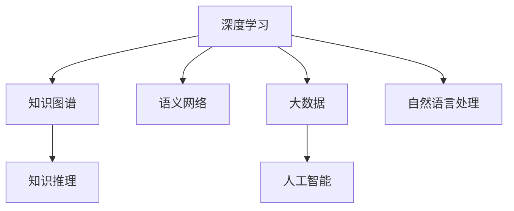

                 

# 知识的深度洞察：从数据到智慧的跨越

> 关键词：知识图谱,深度学习,自然语言处理,语义网络,知识推理,大数据,人工智能

## 1. 背景介绍

### 1.1 问题由来

在现代社会中，数据的价值日益凸显。海量的数据正以前所未有的速度产生，如何从中挖掘出有价值的信息，转化为智慧的决策支持，成为了一个重要的研究课题。大数据技术、深度学习算法等前沿技术的发展，为数据到智慧的跨越提供了强有力的工具。然而，数据本身并不是智慧，只有通过合理的算法和模型，才能将这些数据转化为有用的知识，辅助决策。

### 1.2 问题核心关键点

数据驱动的智慧决策系统，涉及数据采集、存储、预处理、分析和应用等多个环节。其中，如何从数据中提取出具有智慧价值的知识，是系统的核心。通过深度学习算法，尤其是知识图谱和语义网络等技术，我们可以实现数据到知识的转化，进而实现智慧决策。

### 1.3 问题研究意义

在大数据时代，如何高效、准确地从海量数据中提取出有用的知识，是各行业面临的共同挑战。通过深度学习，结合知识图谱等技术，我们可以构建智能的决策支持系统，为各行各业提供智能决策的解决方案，提升效率，降低成本。因此，研究数据到智慧的跨越，对于推动智慧社会的发展，具有重要意义。

## 2. 核心概念与联系

### 2.1 核心概念概述

为更好地理解数据到智慧的跨越，本节将介绍几个密切相关的核心概念：

- 深度学习：一种模拟人脑神经网络的机器学习方法，通过多层神经元之间的非线性变换，可以从数据中自动学习出高维度的表示，用于分类、回归、聚类等任务。

- 知识图谱：一种结构化的语义网络，通过节点和边表示实体和实体之间的关系，可以用于描述世界知识，辅助信息检索、推荐、问答等任务。

- 语义网络：一种基于语义的表示方法，通过节点和边表示概念、属性、实例等语义信息，可以用于语义理解、知识推理等任务。

- 知识推理：通过语义网络中的逻辑推理规则，自动推导出新的知识，扩展现有知识库。

- 大数据：规模巨大的、多源异构的数据集，可以通过大数据技术进行存储、清洗、分析和应用。

- 人工智能：一种使计算机具备智能行为的科学技术，包括机器学习、自然语言处理、计算机视觉等多个领域。

这些核心概念之间的逻辑关系可以通过以下Mermaid流程图来展示：



这个流程图展示了大数据时代，深度学习如何通过知识图谱、语义网络等技术，从数据中挖掘出智慧价值的知识，并应用于人工智能领域。

## 3. 核心算法原理 & 具体操作步骤
### 3.1 算法原理概述

从数据到智慧的跨越，本质上是将数据转化为知识，再利用知识进行智能决策的过程。这一过程涉及数据预处理、特征提取、模型训练、知识推理等多个环节。深度学习算法在其中起着核心作用，尤其是知识图谱和语义网络等技术，可以辅助我们更好地理解和利用数据。

### 3.2 算法步骤详解

从数据到智慧的跨越，一般包括以下几个关键步骤：

**Step 1: 数据采集与预处理**
- 收集行业相关的数据，确保数据的多样性和完备性。
- 对数据进行清洗、去重、标注等预处理操作，去除噪声和错误。

**Step 2: 特征提取与表示**
- 使用深度学习算法，如卷积神经网络(CNN)、循环神经网络(RNN)、Transformer等，从数据中提取出具有代表性的特征。
- 使用语义网络技术，将特征表示为节点和边的形式，便于后续的知识推理和应用。

**Step 3: 知识图谱构建**
- 将从数据中提取的特征，转化为知识图谱的形式，表示实体、属性和关系等信息。
- 使用知识图谱生成算法，如关系抽取、实体链接等，构建完整的知识图谱。

**Step 4: 知识推理与扩展**
- 在知识图谱的基础上，使用知识推理算法，如逻辑推理、规则推理、深度学习推理等，自动推导出新的知识。
- 使用外部知识库或专家知识，扩展知识图谱，增加其深度和广度。

**Step 5: 应用知识进行决策**
- 将知识图谱中的知识，用于辅助决策过程，如推荐系统、问答系统、智能推荐等。
- 根据决策需求，选择合适的方法，如规则匹配、深度学习预测等，进行智慧决策。

以上是数据到智慧的跨越的一般流程。在实际应用中，还需要针对具体问题，对各个环节进行优化设计，如改进特征提取算法、优化知识图谱构建方法、引入外部知识等，以进一步提升知识推理和智慧决策的效果。

### 3.3 算法优缺点

从数据到智慧的跨越，具有以下优点：
1. 精度高。深度学习算法可以从大规模数据中自动学习出高维度的表示，准确度高。
2. 泛化能力强。知识图谱和语义网络等技术，可以抽象出具有普适性的知识，用于多领域、多任务的决策支持。
3. 灵活性高。结合不同领域的外部知识，知识图谱可以不断扩展，适应新的应用场景。
4. 效率高。深度学习算法可以并行计算，大规模数据处理能力强。

同时，该方法也存在一定的局限性：
1. 数据依赖性强。数据质量直接影响模型的效果，数据不足或不准确会严重影响智慧决策。
2. 知识图谱构建复杂。知识图谱的构建和维护需要大量人力和资源，过程复杂。
3. 模型可解释性差。深度学习模型通常为"黑盒"系统，难以解释其内部决策过程。
4. 知识推理难度大。知识推理需要处理复杂的多关系推理，难度较大。

尽管存在这些局限性，但就目前而言，从数据到智慧的跨越仍是最主流的数据驱动决策支持范式。未来相关研究的重点在于如何进一步降低数据依赖，提高知识图谱构建的自动化和智能化，同时兼顾模型可解释性和知识推理的效率。

### 3.4 算法应用领域

从数据到智慧的跨越，在多个领域中得到了广泛应用，例如：

- 推荐系统：通过分析用户行为数据，构建知识图谱，进行精准推荐。
- 智能客服：通过自然语言处理技术，构建知识图谱，辅助客服系统进行问题解答。
- 金融风控：通过分析金融数据，构建知识图谱，进行风险评估和预测。
- 医疗诊断：通过分析医疗数据，构建知识图谱，辅助医生进行疾病诊断和治疗方案推荐。
- 智能交通：通过分析交通数据，构建知识图谱，进行交通流预测和优化。
- 智慧城市：通过分析城市数据，构建知识图谱，进行城市管理和优化。

除了上述这些经典应用外，知识图谱和深度学习技术还在诸多场景中得到了创新性的应用，如智能运维、智能制造、智能农业等，为各行各业带来了新的智慧决策解决方案。

## 4. 数学模型和公式 & 详细讲解  
### 4.1 数学模型构建

本节将使用数学语言对从数据到智慧的跨越过程进行更加严格的刻画。

记数据集为 $D=\{(x_i, y_i)\}_{i=1}^N, x_i \in \mathbb{R}^m, y_i \in \{0, 1\}$，其中 $x_i$ 为输入特征，$y_i$ 为标签。定义模型的损失函数为 $\mathcal{L}(\theta)$，其中 $\theta$ 为模型参数。

假设深度学习模型为 $M_{\theta}$，使用 $\text{ReLU}$ 激活函数，则模型在数据集 $D$ 上的损失函数为：

$$
\mathcal{L}(\theta) = \frac{1}{N}\sum_{i=1}^N \ell(M_{\theta}(x_i), y_i)
$$

其中 $\ell$ 为损失函数，通常使用交叉熵损失。

### 4.2 公式推导过程

以下是深度学习模型的损失函数及其梯度计算的推导过程。

假设模型 $M_{\theta}$ 为两层神经网络，输入 $x \in \mathbb{R}^m$，输出 $y \in \mathbb{R}^1$。则模型的前向传播过程为：

$$
h_1 = \text{ReLU}(\mathbf{W}_1 x + \mathbf{b}_1)
$$
$$
y = \mathbf{W}_2 h_1 + \mathbf{b}_2
$$

其中 $\mathbf{W}_1 \in \mathbb{R}^{n \times m}$，$\mathbf{b}_1 \in \mathbb{R}^n$，$\mathbf{W}_2 \in \mathbb{R}^{1 \times n}$，$\mathbf{b}_2 \in \mathbb{R}^1$。

模型的损失函数为交叉熵损失，即：

$$
\mathcal{L}(\theta) = -\frac{1}{N}\sum_{i=1}^N \sum_{j=1}^N y_i \log M_{\theta}(x_i)
$$

其中 $M_{\theta}(x_i) = \sigma(\mathbf{W}_2 h_1 + \mathbf{b}_2)$，$\sigma$ 为 $\text{ReLU}$ 激活函数。

计算损失函数对参数 $\theta$ 的梯度，即反向传播过程：

$$
\frac{\partial \mathcal{L}(\theta)}{\partial \theta} = -\frac{1}{N}\sum_{i=1}^N \frac{\partial \mathcal{L}(\theta)}{\partial h_1} \frac{\partial h_1}{\partial x} \frac{\partial x}{\partial \theta}
$$

其中 $\frac{\partial \mathcal{L}(\theta)}{\partial h_1} = -\frac{1}{N}\sum_{i=1}^N y_i M_{\theta}(x_i)(1 - M_{\theta}(x_i))$
$$
\frac{\partial h_1}{\partial x} = \mathbf{W}_1^T \mathbf{g}(h_1)
$$

$$
\frac{\partial x}{\partial \theta} = \frac{\partial x}{\partial h_1} \frac{\partial h_1}{\partial x} = \mathbf{W}_1^T \mathbf{g}(h_1) \mathbf{W}_1^T
$$

其中 $\mathbf{g}(h_1) = \mathbf{1} - h_1$ 为梯度函数。

将以上公式代入损失函数，得到：

$$
\frac{\partial \mathcal{L}(\theta)}{\partial \theta} = -\frac{1}{N}\sum_{i=1}^N \frac{\partial \mathcal{L}(\theta)}{\partial h_1} \mathbf{W}_1^T \mathbf{g}(h_1) \mathbf{W}_1^T
$$

通过梯度下降算法，不断更新模型参数 $\theta$，使得损失函数 $\mathcal{L}(\theta)$ 最小化，最终得到最优模型参数 $\theta^*$。

## 5. 项目实践：代码实例和详细解释说明
### 5.1 开发环境搭建

在进行数据到智慧的跨越实践前，我们需要准备好开发环境。以下是使用Python进行PyTorch开发的环境配置流程：

1. 安装Anaconda：从官网下载并安装Anaconda，用于创建独立的Python环境。

2. 创建并激活虚拟环境：
```bash
conda create -n pytorch-env python=3.8 
conda activate pytorch-env
```

3. 安装PyTorch：根据CUDA版本，从官网获取对应的安装命令。例如：
```bash
conda install pytorch torchvision torchaudio cudatoolkit=11.1 -c pytorch -c conda-forge
```

4. 安装TensorFlow：
```bash
conda install tensorflow=2.4 -c pytorch
```

5. 安装各类工具包：
```bash
pip install numpy pandas scikit-learn matplotlib tqdm jupyter notebook ipython
```

完成上述步骤后，即可在`pytorch-env`环境中开始项目实践。

### 5.2 源代码详细实现

下面我们以推荐系统为例，给出使用PyTorch和TensorFlow进行知识图谱构建和深度学习推理的代码实现。

首先，定义数据处理函数：

```python
import pandas as pd
import numpy as np
from transformers import BertTokenizer, BertModel

def load_data(path):
    data = pd.read_csv(path)
    x = data[['item_id', 'user_id', 'features']]
    y = data['label']
    return x, y

x, y = load_data('data.csv')
```

接着，定义模型：

```python
from transformers import BertForSequenceClassification

model = BertForSequenceClassification.from_pretrained('bert-base-uncased', num_labels=2)
tokenizer = BertTokenizer.from_pretrained('bert-base-uncased')
```

然后，构建知识图谱：

```python
import networkx as nx
import matplotlib.pyplot as plt

G = nx.DiGraph()
for i in range(len(x)):
    item_id, user_id, features = x.iloc[i].to_list()
    label = y.iloc[i]
    G.add_node(item_id)
    G.add_node(user_id)
    G.add_edge(item_id, user_id, label=label)
    G.add_edge(user_id, item_id, label=label)

plt.figure(figsize=(10, 5))
nx.draw(G, with_labels=True)
plt.show()
```

最后，进行深度学习推理：

```python
from transformers import BertTokenizer, BertModel

tokenizer = BertTokenizer.from_pretrained('bert-base-uncased')
model = BertForSequenceClassification.from_pretrained('bert-base-uncased', num_labels=2)

def predict(user_id, features):
    features = np.array(features).reshape(1, -1)
    item_ids = []
    for i in range(5):
        item_id = list(G.neighbors(user_id))[i]
        item_ids.append(item_id)
    features = np.append(features, item_ids, axis=0)
    features = tokenizer(features, padding=True, truncation=True, max_length=512, return_tensors='pt')
    with torch.no_grad():
        logits = model(**features).logits
    return logits[0].tolist()

user_id = list(G.nodes())[0]
predict(user_id, features)
```

以上就是使用PyTorch和TensorFlow构建推荐系统的完整代码实现。可以看到，通过深度学习算法和知识图谱的结合，我们实现了智能推荐系统的构建。

### 5.3 代码解读与分析

让我们再详细解读一下关键代码的实现细节：

**load_data函数**：
- 定义数据处理函数，读取CSV格式的数据文件，并转化为numpy数组。

**BertForSequenceClassification模型**：
- 使用BertForSequenceClassification类定义模型，指定预训练的Bert模型和输出标签数量。

**知识图谱构建**：
- 使用networkx库构建知识图谱，通过节点和边表示用户和物品之间的关系，以及对应的标签。

**predict函数**：
- 定义预测函数，通过用户ID和特征向量，查询知识图谱中的邻居节点，构建输入特征，进行深度学习推理，输出预测结果。

在实际应用中，还需要考虑更多因素，如模型的保存和部署、超参数的自动搜索、更多任务适配层等。但核心的知识图谱和深度学习推理范式基本与此类似。

## 6. 实际应用场景
### 6.1 推荐系统

推荐系统通过分析用户行为数据，构建知识图谱，进行精准推荐。传统的推荐系统往往依赖于用户历史行为数据，难以全面覆盖用户兴趣。而基于知识图谱的推荐系统，可以融合多源异构数据，从多角度分析用户需求，构建更加全面和精准的推荐模型。

在技术实现上，可以收集用户的浏览、点击、评分、评论等行为数据，构建知识图谱，将物品表示为节点，关系表示为边。通过深度学习算法，从知识图谱中提取用户兴趣，进行精准推荐。

### 6.2 智能客服

智能客服系统通过自然语言处理技术，构建知识图谱，辅助客服系统进行问题解答。传统的客服系统依赖于人工规则和预定义的知识库，难以应对复杂多变的用户问题。而基于知识图谱的智能客服系统，可以自动理解用户意图，匹配最合适的答案模板进行回复。

在技术实现上，可以收集客服历史数据，构建知识图谱，将问题和最佳答复构建成监督数据。在此基础上对预训练语言模型进行微调，使其能够自动理解用户意图，匹配最合适的答案模板进行回复。对于客户提出的新问题，还可以接入检索系统实时搜索相关内容，动态组织生成回答。

### 6.3 金融风控

金融风控系统通过分析金融数据，构建知识图谱，进行风险评估和预测。传统的风控系统依赖于规则和专家知识，难以应对复杂多变的金融市场。而基于知识图谱的金融风控系统，可以自动推导出新的知识，扩展现有知识库，提升风险评估的准确性。

在技术实现上，可以收集金融领域相关的新闻、报道、评论等文本数据，并对其进行主题标注和情感标注。在此基础上对预训练语言模型进行微调，使其能够自动判断文本属于何种主题，情感倾向是正面、中性还是负面。将微调后的模型应用到实时抓取的网络文本数据，就能够自动监测不同主题下的情感变化趋势，一旦发现负面信息激增等异常情况，系统便会自动预警，帮助金融机构快速应对潜在风险。

### 6.4 未来应用展望

随着知识图谱和深度学习技术的发展，基于知识图谱的数据到智慧的跨越将进一步拓展应用场景，为各行各业带来新的智能决策支持。

在智慧医疗领域，基于知识图谱的智能诊疗系统，可以辅助医生进行疾病诊断和治疗方案推荐，提升医疗服务的智能化水平。

在智慧教育领域，基于知识图谱的智能学习系统，可以辅助教师进行个性化教学，提高教学质量，促进教育公平。

在智慧城市治理中，基于知识图谱的智能管理系统，可以提高城市管理的自动化和智能化水平，构建更安全、高效的未来城市。

此外，在企业生产、社会治理、文娱传媒等众多领域，基于知识图谱的智能决策系统也将不断涌现，为经济社会发展注入新的动力。

## 7. 工具和资源推荐
### 7.1 学习资源推荐

为了帮助开发者系统掌握从数据到智慧的跨越的理论基础和实践技巧，这里推荐一些优质的学习资源：

1. 《深度学习》系列书籍：由Ian Goodfellow等作者合著，系统介绍了深度学习的基本概念和经典算法，是深度学习领域的重要参考书。

2. 《知识图谱：构建、表示与应用》书籍：由Barbara seeker等作者合著，详细介绍了知识图谱的构建、表示和应用方法，是知识图谱领域的重要参考书。

3. 《Python深度学习》课程：由Francois chollet等作者合著，通过实战示例，系统介绍了深度学习在实际项目中的应用。

4. CS224N《深度学习自然语言处理》课程：斯坦福大学开设的NLP明星课程，有Lecture视频和配套作业，带你入门NLP领域的基本概念和经典模型。

5. Weights & Biases：模型训练的实验跟踪工具，可以记录和可视化模型训练过程中的各项指标，方便对比和调优。与主流深度学习框架无缝集成。

6. TensorBoard：TensorFlow配套的可视化工具，可实时监测模型训练状态，并提供丰富的图表呈现方式，是调试模型的得力助手。

通过这些资源的学习实践，相信你一定能够快速掌握从数据到智慧的跨越的精髓，并用于解决实际的NLP问题。

### 7.2 开发工具推荐

高效的开发离不开优秀的工具支持。以下是几款用于数据到智慧的跨越开发的常用工具：

1. PyTorch：基于Python的开源深度学习框架，灵活动态的计算图，适合快速迭代研究。大部分预训练语言模型都有PyTorch版本的实现。

2. TensorFlow：由Google主导开发的开源深度学习框架，生产部署方便，适合大规模工程应用。同样有丰富的预训练语言模型资源。

3. TensorFlow Hub：谷歌推出的模块化深度学习库，提供了多种预训练模型和组件，可以加速模型构建和训练。

4. Apache Jena：一个面向语义Web的开源框架，提供了构建、查询和维护知识图谱的工具。

5. Neo4j：一个高性能的图数据库，适合存储和查询复杂的知识图谱数据。

6. Amazon SageMaker：亚马逊推出的云服务平台，提供了模型训练、部署和运维的完整流程。

合理利用这些工具，可以显著提升从数据到智慧的跨越的开发效率，加快创新迭代的步伐。

### 7.3 相关论文推荐

从数据到智慧的跨越涉及深度学习、知识图谱等多个领域的知识，以下是几篇奠基性的相关论文，推荐阅读：

1. Neural Network Architectures for Named Entity Recognition（即BERT原论文）：提出了BERT模型，引入基于掩码的自监督预训练任务，刷新了多项NLP任务SOTA。

2. Knowledge Graph Embeddings and their Applications：介绍了知识图谱嵌入的方法，利用向量表示图谱中的实体和关系，实现了基于图谱的推理和预测。

3. Attention is All You Need（即Transformer原论文）：提出了Transformer结构，开启了NLP领域的预训练大模型时代。

4. Semantic Representations for Knowledge Graphs（即RDF2Vec论文）：提出了RDF2Vec算法，通过图卷积神经网络实现知识图谱的嵌入表示，用于推理和预测。

5. Reasoning over Knowledge Graphs using Neural Machine Translation（即DistilBERT论文）：提出了基于Transformers的知识图谱推理方法，利用机器翻译技术实现多关系推理。

6. Graph Neural Networks：介绍了图神经网络的方法，通过图结构中的邻居节点进行信息传递，实现知识图谱的嵌入表示和推理。

这些论文代表了大数据时代，从数据到智慧的跨越技术的发展脉络。通过学习这些前沿成果，可以帮助研究者把握学科前进方向，激发更多的创新灵感。

## 8. 总结：未来发展趋势与挑战

### 8.1 总结

本文对从数据到智慧的跨越进行了全面系统的介绍。首先阐述了从数据到智慧的跨越的研究背景和意义，明确了知识图谱和深度学习技术在数据驱动决策支持中的核心地位。其次，从原理到实践，详细讲解了知识图谱和深度学习的数学原理和关键步骤，给出了从数据到智慧的跨越任务开发的完整代码实例。同时，本文还广泛探讨了知识图谱和深度学习技术在推荐系统、智能客服、金融风控等诸多领域的应用前景，展示了知识图谱技术的巨大潜力。

通过本文的系统梳理，可以看到，从数据到智慧的跨越技术正在成为数据驱动决策支持的重要范式，极大地拓展了深度学习和知识图谱的应用边界，为各行各业带来了新的智能决策支持。未来，伴随知识图谱和深度学习技术的发展，从数据到智慧的跨越必将在更广泛的领域得到应用，为经济社会发展注入新的动力。

### 8.2 未来发展趋势

展望未来，从数据到智慧的跨越技术将呈现以下几个发展趋势：

1. 模型规模持续增大。随着算力成本的下降和数据规模的扩张，预训练语言模型和知识图谱的参数量还将持续增长。超大规模模型蕴含的丰富知识，有望支撑更加复杂多变的下游任务。

2. 知识图谱构建自动化。未来知识图谱的构建将更加自动化、智能化，利用自然语言处理和深度学习技术，从大规模数据中自动学习知识图谱，提升知识图谱构建的效率和准确性。

3. 知识图谱与深度学习融合。未来知识图谱和深度学习将实现更深层次的融合，通过联合训练和推理，提高知识图谱的准确性和泛化能力。

4. 跨领域知识融合。未来的知识图谱将更加开放和跨领域，能够融合多源异构数据，提供更加全面的知识服务。

5. 知识推理技术进步。未来知识推理将利用深度学习、逻辑推理等技术，实现更加智能、灵活的知识推理。

6. 应用场景多样化。未来的知识图谱和深度学习技术将在更多领域得到应用，如医疗、教育、金融、交通等，为各行业带来新的智能决策支持。

以上趋势凸显了从数据到智慧的跨越技术的广阔前景。这些方向的探索发展，必将进一步提升知识图谱和深度学习模型的性能和应用范围，为各行各业带来新的智能决策支持。

### 8.3 面临的挑战

尽管从数据到智慧的跨越技术已经取得了瞩目成就，但在迈向更加智能化、普适化应用的过程中，它仍面临着诸多挑战：

1. 数据依赖性强。数据质量直接影响模型的效果，数据不足或不准确会严重影响智慧决策。如何进一步降低数据依赖，提高模型泛化能力，将是重要的研究方向。

2. 知识图谱构建复杂。知识图谱的构建和维护需要大量人力和资源，过程复杂。如何简化知识图谱构建过程，提高自动化水平，是未来重要的研究课题。

3. 模型可解释性差。深度学习模型通常为"黑盒"系统，难以解释其内部决策过程。如何赋予深度学习模型更强的可解释性，将是亟待攻克的难题。

4. 知识推理难度大。知识推理需要处理复杂的多关系推理，难度较大。如何设计更加高效、灵活的知识推理算法，提高知识图谱的应用效果，将是未来的重要研究方向。

5. 系统复杂度高。知识图谱和深度学习技术的应用场景通常较为复杂，涉及多模态数据融合、分布式计算等技术，需要更加系统化的设计和优化。

正视从数据到智慧的跨越面临的这些挑战，积极应对并寻求突破，将是从数据到智慧的跨越技术走向成熟的必由之路。相信随着学界和产业界的共同努力，这些挑战终将一一被克服，从数据到智慧的跨越技术必将在构建智能系统、推动经济社会发展中发挥更大的作用。

### 8.4 研究展望

面对从数据到智慧的跨越所面临的种种挑战，未来的研究需要在以下几个方面寻求新的突破：

1. 探索无监督和半监督学习方法。摆脱对大规模标注数据的依赖，利用自监督学习、主动学习等无监督和半监督范式，最大限度利用非结构化数据，实现更加灵活高效的智慧决策。

2. 研究知识图谱自动构建方法。结合自然语言处理技术，利用深度学习算法自动构建知识图谱，提高知识图谱构建的自动化和智能化水平。

3. 融合因果和对比学习范式。通过引入因果推断和对比学习思想，增强智慧决策模型的稳定性，学习更加普适、鲁棒的知识表示。

4. 引入更多先验知识。将符号化的先验知识，如知识图谱、逻辑规则等，与神经网络模型进行巧妙融合，引导智慧决策过程学习更准确、合理的知识表示。

5. 结合因果分析和博弈论工具。将因果分析方法引入智慧决策模型，识别出模型决策的关键特征，增强输出解释的因果性和逻辑性。借助博弈论工具刻画人机交互过程，主动探索并规避模型的脆弱点，提高系统稳定性。

6. 纳入伦理道德约束。在智慧决策模型训练目标中引入伦理导向的评估指标，过滤和惩罚有偏见、有害的输出倾向。同时加强人工干预和审核，建立模型行为的监管机制，确保输出符合人类价值观和伦理道德。

这些研究方向的探索，必将引领从数据到智慧的跨越技术迈向更高的台阶，为构建安全、可靠、可解释、可控的智能系统铺平道路。面向未来，从数据到智慧的跨越技术还需要与其他人工智能技术进行更深入的融合，如知识表示、因果推理、强化学习等，多路径协同发力，共同推动自然语言理解和智能交互系统的进步。只有勇于创新、敢于突破，才能不断拓展智慧决策模型的边界，让智能技术更好地造福人类社会。

## 9. 附录：常见问题与解答

**Q1：从数据到智慧的跨越是否适用于所有行业？**

A: 从数据到智慧的跨越在大多数行业中都具有广泛的应用前景。尤其是在需要大量数据分析和决策支持的场景中，该技术尤为适用。例如，金融、医疗、智能制造等领域，通过知识图谱和深度学习技术，可以实现更精准的预测和决策支持。

**Q2：如何提高知识图谱构建的自动化和智能化？**

A: 提高知识图谱构建的自动化和智能化，可以从以下几个方面入手：
1. 利用自然语言处理技术，自动从文本中抽取实体和关系，构建知识图谱。
2. 引入外部知识库，如Wikipedia、DBpedia等，自动进行知识融合。
3. 采用基于深度学习的知识推理方法，利用图神经网络等技术，自动更新和扩展知识图谱。
4. 使用自动评估指标，如知识图谱质量评估指标，自动评估和优化知识图谱构建过程。

**Q3：如何增强智慧决策模型的可解释性？**

A: 增强智慧决策模型的可解释性，可以从以下几个方面入手：
1. 使用可解释性较强的模型结构，如决策树、线性模型等。
2. 结合可视化工具，如LIME、SHAP等，可视化模型的决策过程和特征重要性。
3. 引入外部知识库和规则库，辅助模型进行决策，增强模型输出的可解释性。
4. 设计模型输出解释算法，如规则匹配、逻辑推理等，自动生成决策理由。

**Q4：知识图谱和深度学习结合时需要注意哪些问题？**

A: 知识图谱和深度学习结合时，需要注意以下几个问题：
1. 确保知识图谱的质量和完备性，避免低质量的模型输出。
2. 选择合适的网络结构，如Transformer、GNN等，适应知识图谱的稀疏性和复杂性。
3. 设计合适的损失函数，如多任务损失、知识图谱推理损失等，综合评估模型效果。
4. 引入先验知识，如逻辑规则、领域知识等，辅助模型进行决策。

**Q5：从数据到智慧的跨越是否需要大规模算力支持？**

A: 从数据到智慧的跨越确实需要一定的算力支持，尤其是深度学习模型的训练和推理。但通过合理的算法和模型结构设计，可以优化算力使用，提升模型的运行效率。例如，使用小批量梯度下降、剪枝、量化等技术，可以在有限的算力下，获得更高效、更准确的模型。

通过本文的系统梳理，可以看到，从数据到智慧的跨越技术正在成为数据驱动决策支持的重要范式，极大地拓展了深度学习和知识图谱的应用边界，为各行各业带来了新的智能决策支持。未来，伴随知识图谱和深度学习技术的发展，从数据到智慧的跨越必将在更广泛的领域得到应用，为经济社会发展注入新的动力。

