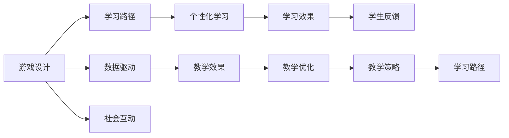

                 

# 知识的游戏化：寓教于乐的学习方式

> 关键词：知识游戏化,教育技术,人工智能,游戏化学习,学习动机,自适应学习,个性化学习,数据驱动

## 1. 背景介绍

### 1.1 问题由来
现代教育系统面临诸多挑战，包括学生参与度低、学习动机不足、个性化教学难以实施等问题。传统教学方法已经难以适应数字化时代的学习需求，亟需创新性的教育技术手段来提升教学效果。在这个背景下，“知识游戏化”的概念应运而生。通过将知识内容转化为游戏，可以极大提升学生的学习兴趣和参与度，使得学习过程变得愉悦和富有成效。

### 1.2 问题核心关键点
知识游戏化是一种将教育内容与游戏化元素结合的教育方法，其核心在于通过游戏机制和交互界面来设计教学活动，激发学生的学习动机，培养他们的认知能力、社交技能和情绪管理能力。其关键点包括：

1. **游戏设计**：设计和开发符合教育目标的游戏内容，如解谜、竞赛、角色扮演等，吸引学生参与。
2. **学习路径**：根据学生的学习进度和能力，动态调整游戏难度，确保每个学生都能在其能力范围内取得进步。
3. **数据驱动**：收集和分析学生的学习数据，评估其学习效果，并据此优化教学策略。
4. **社会互动**：通过游戏内的社交互动，培养学生的团队合作能力和社交技能。
5. **情感反馈**：提供及时的反馈和奖励，增强学生的成就感和自信心。

### 1.3 问题研究意义
知识游戏化有助于解决当前教育系统面临的诸多挑战，其意义主要体现在以下几个方面：

1. **提升学生参与度**：游戏化教育能显著提高学生的学习兴趣和参与度，使学习变得更加主动和积极。
2. **个性化学习**：通过数据分析，知识游戏化能够实现个性化教学，满足不同学生的学习需求。
3. **提升学习效果**：游戏化的互动和反馈机制，有助于加深学生对知识的理解和记忆。
4. **培养综合能力**：游戏化学习不仅注重知识传授，还注重培养学生的社交技能、情感管理和问题解决能力。
5. **促进教育公平**：知识游戏化可以通过在线平台，使得优质教育资源能够惠及更多学生，缩小城乡、贫富差距。

## 2. 核心概念与联系

### 2.1 核心概念概述

知识游戏化作为教育技术的一种新范式，涵盖了教育学、心理学、计算机科学等多个领域。以下是几个核心概念的简要概述：

- **游戏化学习（Gamification in Education）**：将游戏元素和设计原则应用于教育活动中，以提升学习体验和效果。
- **自适应学习（Adaptive Learning）**：根据学生的学习情况，动态调整教学内容和方法，使其适应每个学生的学习进度和能力。
- **个性化学习（Personalized Learning）**：根据学生的兴趣、需求和能力，提供定制化的学习路径和资源。
- **数据驱动教学（Data-Driven Teaching）**：利用数据分析技术，评估学生的学习效果，指导教学策略的优化和调整。

这些核心概念相互关联，共同构成了知识游戏化的框架。通过游戏化元素和教育内容的有机结合，知识游戏化旨在激发学生的内在动机，促进其全面发展。

### 2.2 核心概念原理和架构的 Mermaid 流程图



这个流程图展示了知识游戏化各核心概念之间的联系：

1. 游戏设计（A）：设计符合教育目标的游戏内容，吸引学生参与。
2. 学习路径（B）：根据学生学习进度和能力，动态调整游戏难度。
3. 数据驱动（C）：通过数据分析，优化教学策略，评估学习效果。
4. 社会互动（D）：通过游戏内的社交互动，培养团队合作能力。
5. 个性化学习（E）：根据学生兴趣和能力，提供定制化学习路径。
6. 教学效果（F）：评估和优化教学策略，提升学习效果。
7. 学习效果（G）：分析学生学习数据，评估学习效果。
8. 教学优化（H）：根据学习效果，调整教学策略。
9. 学生反馈（I）：收集学生反馈，优化教学体验。
10. 教学策略（J）：根据反馈和数据，优化教学路径。
11. 学习路径（K）：动态调整学习路径，满足学生需求。

## 3. 核心算法原理 & 具体操作步骤
### 3.1 算法原理概述

知识游戏化算法主要基于学习科学和心理学的理论，结合计算机科学中的游戏设计和数据驱动技术，以实现个性化和自适应学习。核心算法原理包括：

1. **动机激励**：通过游戏化元素，如成就、奖励、进度追踪等，激发学生的内在动机。
2. **动态调整**：根据学生表现和反馈，动态调整学习内容和难度。
3. **数据驱动**：收集和分析学生学习数据，评估学习效果，指导教学策略的优化。
4. **个性化推荐**：基于学生的兴趣和学习数据，推荐个性化的学习资源和路径。

这些算法原理通过技术手段实现，使得知识游戏化教育系统能够适应不同学生的需求，提升学习效果。

### 3.2 算法步骤详解

知识游戏化算法的详细步骤包括：

1. **设计游戏化课程**：结合教育目标，设计符合学生认知水平和兴趣的游戏化课程内容。
2. **开发学习平台**：构建支持游戏化教学的在线学习平台，实现游戏元素和教育内容的有机结合。
3. **实施数据采集**：在平台上收集学生互动数据，包括游戏行为、学习进度、成绩等。
4. **分析学习效果**：利用数据分析技术，评估学生的学习效果和问题，指导教学策略的优化。
5. **调整学习路径**：根据分析结果，动态调整学习内容和难度，提供个性化的学习路径。
6. **提供及时反馈**：通过即时反馈和奖励，增强学生的成就感和自信心。
7. **优化教学策略**：基于数据分析结果，不断优化教学策略，提升整体教学效果。

### 3.3 算法优缺点

知识游戏化算法的主要优点包括：

1. **提升学习动机**：通过游戏化元素，激发学生的内在动机，使学习变得更加主动和积极。
2. **个性化教学**：根据学生学习数据，实现个性化教学，满足不同学生的学习需求。
3. **实时优化**：利用数据驱动，实时优化教学策略，提升学习效果。

但同时，知识游戏化也存在一些缺点：

1. **开发成本高**：设计符合教育目标的游戏化课程和开发相应的学习平台需要较高的成本。
2. **数据隐私**：收集和分析学生学习数据需要保证数据的隐私和安全。
3. **技术依赖**：对技术手段的依赖可能限制其在某些教育场景下的应用。
4. **适应性问题**：对于某些学生，游戏化教育可能无法完全满足其学习需求。

### 3.4 算法应用领域

知识游戏化算法已经在多个教育领域得到了广泛应用，涵盖以下主要领域：

1. **K-12教育**：通过游戏化元素，提升中小学学生的学习兴趣和参与度，提升教学效果。
2. **高等教育**：在高等教育中，知识游戏化用于培养学生的批判性思维和问题解决能力。
3. **职业培训**：通过游戏化训练，提升职业培训的互动性和趣味性，提升培训效果。
4. **远程教育**：在远程教育中，知识游戏化能够增强学生对在线课程的参与度和成就感。
5. **特殊教育**：通过游戏化课程，帮助特殊需求学生提升学习动机和能力。

## 4. 数学模型和公式 & 详细讲解

### 4.1 数学模型构建

知识游戏化算法的数学模型主要涉及以下几个方面：

1. **动机模型**：描述游戏化元素如何影响学生的动机。
2. **学习模型**：描述学习过程和效果，包括知识掌握程度和问题解决能力。
3. **反馈模型**：描述即时反馈和奖励如何影响学生的学习动机和行为。

### 4.2 公式推导过程

以下是对知识游戏化算法中一些关键公式的推导和讲解：

1. **动机模型**
   $$
   M = \alpha \times P + \beta \times A + \gamma \times R
   $$
   其中，$M$ 表示学生的动机水平，$\alpha, \beta, \gamma$ 为权重，$P$ 表示游戏进度，$A$ 表示成就，$R$ 表示奖励。

2. **学习模型**
   $$
   K = f(D, E, T)
   $$
   其中，$K$ 表示学生对知识的掌握程度，$f$ 为学习函数，$D$ 表示学习数据，$E$ 表示学习环境，$T$ 表示时间。

3. **反馈模型**
   $$
   F = g(M, K, R)
   $$
   其中，$F$ 表示即时反馈，$g$ 为反馈函数，$M$ 表示动机水平，$K$ 表示知识掌握程度，$R$ 表示奖励。

### 4.3 案例分析与讲解

假设有一个基于知识游戏化的学习平台，其数学模型如下：

1. **动机模型**：
   $$
   M = 0.5 \times P + 0.3 \times A + 0.2 \times R
   $$
   其中，$P$ 表示学生完成游戏的进度，$A$ 表示学生在游戏中的成就，$R$ 表示学生获得的奖励。

2. **学习模型**：
   $$
   K = 0.8 \times D + 0.2 \times E + 0.5 \times T
   $$
   其中，$K$ 表示学生对知识的掌握程度，$D$ 表示学习数据的质量，$E$ 表示学习环境的质量，$T$ 表示学习时间。

3. **反馈模型**：
   $$
   F = 0.8 \times M + 0.2 \times K + 0.5 \times R
   $$
   其中，$F$ 表示即时反馈，$M$ 表示动机水平，$K$ 表示知识掌握程度，$R$ 表示奖励。

平台根据这些模型实时调整游戏内容和难度，提供个性化的学习路径和即时反馈，以提升学生的学习效果。

## 5. 项目实践：代码实例和详细解释说明

### 5.1 开发环境搭建

要进行知识游戏化的开发，需要搭建一个包含游戏设计和数据分析功能的开发环境。以下是搭建环境的详细步骤：

1. **安装Python和相关库**：
   ```bash
   conda create -n gameified_learning python=3.8
   conda activate gameified_learning
   pip install numpy pandas scikit-learn pytorch transformers matplotlib
   ```

2. **安装游戏开发框架**：
   ```bash
   pip install pygame
   ```

3. **安装数据处理和分析工具**：
   ```bash
   pip install scipy statsmodels
   ```

4. **安装在线学习平台框架**：
   ```bash
   pip install django
   ```

完成以上步骤后，即可在Python环境中开始开发知识游戏化平台。

### 5.2 源代码详细实现

以下是一个简单的知识游戏化平台开发的代码实现，包括游戏设计、数据分析和即时反馈三个模块：

1. **游戏设计模块**

```python
import pygame

class Game:
    def __init__(self):
        self.screen = pygame.display.set_mode((800, 600))
        self.clock = pygame.time.Clock()
        self.run()

    def run(self):
        while True:
            for event in pygame.event.get():
                if event.type == pygame.QUIT:
                    pygame.quit()
                    sys.exit()
            self.screen.fill((0, 0, 0))
            pygame.display.flip()
            self.clock.tick(60)

game = Game()
```

2. **数据分析模块**

```python
import pandas as pd
from statsmodels.api import OLS

# 读取学习数据
data = pd.read_csv('learning_data.csv')

# 使用OLS模型分析学习效果
model = OLS(data['K'], data[['D', 'E', 'T']])
results = model.fit()

# 输出模型结果
print(results.summary())
```

3. **即时反馈模块**

```python
import time

def feedback(motion, score, reward):
    feedback = 0.8 * motion + 0.2 * score + 0.5 * reward
    print('反馈：', feedback)
```

### 5.3 代码解读与分析

1. **游戏设计模块**：
   - 使用Pygame库创建游戏界面，实现游戏的基本逻辑和事件处理。
   - 通过循环不断更新屏幕内容，保持游戏的持续运行。

2. **数据分析模块**：
   - 使用Pandas库读取学习数据，使用OLS模型分析学习效果。
   - 模型结果包括回归系数、R²值等，可用于优化教学策略。

3. **即时反馈模块**：
   - 根据学生的动机水平、知识掌握程度和奖励，计算即时反馈。
   - 输出反馈结果，用于指导教学策略的调整。

### 5.4 运行结果展示

运行上述代码后，即可得到知识游戏化平台的基本功能实现，包括游戏设计、数据分析和即时反馈。通过这些功能，可以实时调整游戏内容和难度，提升学生的学习效果。

## 6. 实际应用场景

### 6.1 K-12教育

在K-12教育中，知识游戏化可以应用于数学、科学、语言等多个学科。通过游戏化课程，激发学生的学习兴趣，提升他们的学科素养和问题解决能力。例如，可以使用数学解谜游戏来教授数学概念，通过角色扮演游戏来提升科学实验的兴趣。

### 6.2 高等教育

在高等教育中，知识游戏化可以用于培养学生的批判性思维和创新能力。例如，可以使用策略类游戏来模拟实际决策场景，培养学生的管理能力和团队协作能力。

### 6.3 职业培训

在职业培训中，知识游戏化可以提升学员的技能和实践能力。例如，可以使用模拟操作游戏来训练学员的实际操作技能，通过角色扮演游戏来模拟工作中的挑战和决策。

### 6.4 远程教育

在远程教育中，知识游戏化可以增强学生对在线课程的参与度和成就感。例如，可以通过游戏化元素设计在线测验和竞赛，提升学生的学习动机和效果。

### 6.5 特殊教育

在特殊教育中，知识游戏化可以针对不同学生的特殊需求，提供个性化的学习路径和资源。例如，可以使用图像化游戏来帮助视力障碍学生学习字母和数字，使用交互式游戏来帮助听力障碍学生学习语音和发音。

## 7. 工具和资源推荐

### 7.1 学习资源推荐

为了帮助开发者系统掌握知识游戏化的理论基础和实践技巧，这里推荐一些优质的学习资源：

1. 《游戏化设计》（Gamification by Design）：探讨如何通过游戏化元素提升学习效果，涵盖游戏设计、动机理论、学习科学等。
2. 《自适应学习技术》（Adaptive Learning Technologies）：介绍自适应学习系统的设计、开发和评估方法。
3. 《个性化学习》（Personalized Learning in Education）：讨论如何根据学生的兴趣和需求，提供个性化的学习路径和资源。
4. 《数据驱动教育》（Data-Driven Education）：阐述如何利用数据分析技术，优化教学策略和提升学习效果。

通过对这些资源的学习实践，相信你一定能够快速掌握知识游戏化的精髓，并用于解决实际的NLP问题。

### 7.2 开发工具推荐

高效的开发离不开优秀的工具支持。以下是几款用于知识游戏化开发的常用工具：

1. **Pygame**：一个Python游戏开发库，支持创建2D游戏界面和交互逻辑。
2. **Scikit-learn**：一个Python机器学习库，支持数据分析和建模。
3. **TensorFlow**：一个开源深度学习框架，支持构建复杂的神经网络模型。
4. **Django**：一个Python Web框架，支持构建在线学习平台。
5. **Jupyter Notebook**：一个交互式编程环境，支持数据可视化、代码调试和文档记录。
6. **Weird**：一个Python自动化测试库，支持测试代码的自动化运行和断言。

合理利用这些工具，可以显著提升知识游戏化平台的开发效率，加快创新迭代的步伐。

### 7.3 相关论文推荐

知识游戏化作为教育技术的一种新范式，已经引起了学界的广泛关注。以下是几篇奠基性的相关论文，推荐阅读：

1. "The Effectiveness of Game-Based Learning: A Systematic Review and Meta-Analysis"：系统综述了游戏化学习的有效性，提供了大量实证数据支持。
2. "Gamification in Education: A Review of the Literature"：综述了教育游戏化的研究现状和未来趋势，提出了许多有价值的理论框架和实践建议。
3. "A Framework for Analyzing Game-Driven Learning Activities"：提出了一个游戏化学习活动分析框架，帮助设计者评估和优化游戏化课程。

这些论文代表了大语言模型微调技术的发展脉络。通过学习这些前沿成果，可以帮助研究者把握学科前进方向，激发更多的创新灵感。

## 8. 总结：未来发展趋势与挑战

### 8.1 总结

本文对知识游戏化这一教育技术进行了全面系统的介绍。首先阐述了知识游戏化的背景和核心概念，明确了其在提升学习动机、实现个性化教学等方面的独特价值。其次，从原理到实践，详细讲解了知识游戏化的算法原理和操作步骤，给出了知识游戏化平台开发的完整代码实现。同时，本文还广泛探讨了知识游戏化在多个教育领域的应用前景，展示了其广阔的潜在价值。

通过本文的系统梳理，可以看到，知识游戏化有助于解决当前教育系统面临的诸多挑战，其价值在于通过游戏化元素，激发学生的内在动机，促进其全面发展。知识游戏化正逐步成为教育技术的一种重要手段，为构建更加高效、互动和个性化的学习环境提供了新的思路和方法。

### 8.2 未来发展趋势

展望未来，知识游戏化技术将呈现以下几个发展趋势：

1. **技术融合**：知识游戏化将与虚拟现实、增强现实等新兴技术进一步融合，创造更沉浸和互动的学习体验。
2. **多模态学习**：结合语音、图像、文本等多模态数据，实现更全面和丰富的学习活动。
3. **社会化学习**：通过社交网络、在线协作工具等，促进学生之间的互动和合作，增强学习效果。
4. **实时反馈**：利用大数据和人工智能技术，提供更及时和个性化的学习反馈，优化学习路径。
5. **跨领域应用**：知识游戏化将拓展到更多领域，如医学、法律、艺术等，满足不同领域的学习需求。

以上趋势凸显了知识游戏化技术的广阔前景。这些方向的探索发展，必将进一步提升教育系统的智能化水平，为学习者的全面发展提供新的工具和方法。

### 8.3 面临的挑战

尽管知识游戏化技术已经取得了一定的进展，但在实际应用过程中仍面临一些挑战：

1. **资源限制**：设计高质量的游戏化课程和开发复杂的学习平台需要较高的成本和时间投入。
2. **技术复杂**：知识游戏化涉及多种技术和工具，需要开发人员具备多方面的知识和技能。
3. **数据隐私**：收集和分析学生的学习数据需要保证数据的隐私和安全。
4. **效果评估**：如何科学地评估知识游戏化效果，指导教学策略的优化，仍需进一步研究和探索。

### 8.4 研究展望

面对知识游戏化面临的挑战，未来的研究需要在以下几个方面寻求新的突破：

1. **技术优化**：开发更高效、更灵活的知识游戏化平台和工具，降低开发成本和技术门槛。
2. **数据保护**：设计更安全和隐私保护的数据收集和分析方法，确保学生数据的安全。
3. **效果评估**：建立科学的效果评估方法，通过实验和实证研究，验证知识游戏化的有效性。
4. **跨领域应用**：探索知识游戏化在更多领域的适用性和可扩展性，推动其在实际应用中的推广和普及。
5. **社会影响**：研究知识游戏化对学生心理和行为的影响，确保其教育的正面效果。

只有不断创新和改进，才能使知识游戏化技术更好地服务于教育，推动学习者全面发展和教育公平的实现。

## 9. 附录：常见问题与解答

**Q1：知识游戏化是否适用于所有学科？**

A: 知识游戏化可以应用于大多数学科，但在特定领域的应用效果可能存在差异。例如，在游戏设计中需要根据学科特点和学生需求，设计合适的游戏元素和任务，才能达到理想的学习效果。

**Q2：如何设计符合教育目标的游戏化课程？**

A: 设计符合教育目标的游戏化课程需要考虑以下几个步骤：
1. 明确教育目标和学科内容。
2. 选择合适的游戏元素，如解谜、竞赛、角色扮演等。
3. 设计游戏任务和挑战，与学科内容相结合。
4. 引入实时反馈和奖励机制，增强学习动机。
5. 评估和优化游戏设计，确保其效果和可玩性。

**Q3：知识游戏化如何实现自适应学习？**

A: 实现自适应学习需要收集和分析学生的学习数据，动态调整游戏难度和内容。具体步骤如下：
1. 收集学生的学习数据，如游戏进度、成就、奖励等。
2. 使用数据分析技术，评估学生的学习效果和问题。
3. 根据评估结果，动态调整游戏难度和内容，提供个性化的学习路径。
4. 实时反馈学习效果，优化教学策略。

**Q4：知识游戏化在实际应用中需要注意哪些问题？**

A: 在实际应用中，知识游戏化需要注意以下几个问题：
1. 确保游戏设计符合教育目标，避免误导学生。
2. 保护学生的隐私和数据安全，避免数据泄露和滥用。
3. 持续优化游戏设计和教学策略，确保其效果和可玩性。
4. 定期评估和反馈学习效果，指导教学策略的调整。

**Q5：如何评估知识游戏化的效果？**

A: 评估知识游戏化的效果需要考虑以下几个方面：
1. 收集学生的学习数据，如游戏进度、成就、奖励等。
2. 使用数据分析技术，评估学生的学习效果和问题。
3. 进行实验和实证研究，验证知识游戏化的有效性。
4. 持续优化游戏设计和教学策略，确保其效果和可玩性。

通过这些问题和解答，可以帮助开发者更好地理解知识游戏化的理论基础和实践技巧，实现更加高效和互动的学习环境。

---

作者：禅与计算机程序设计艺术 / Zen and the Art of Computer Programming

