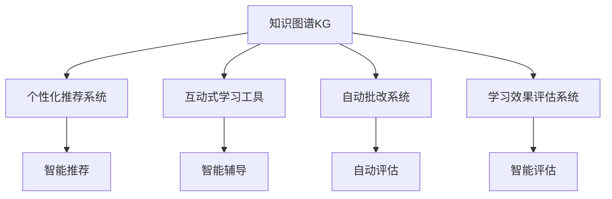

                 

# 知识的神经语言程序：NLP在教育中的应用

> 关键词：自然语言处理(NLP), 知识图谱(KG), 教育技术, 智能推荐系统, 互动式学习, 在线教育

## 1. 背景介绍

### 1.1 问题由来

教育是社会的基石，传统的教育模式已无法适应知识更新的速度和学生需求的个性化。随着信息技术的快速发展，NLP技术在教育领域的应用正成为新的焦点。通过智能推荐、自动批改、互动式学习等手段，NLP有望显著提升教育效果，促进教育公平。然而，现有技术仍存在一些挑战，如个性化推荐算法难以有效捕捉学习者需求、互动式学习系统缺乏深度互动、自动批改难以覆盖所有题型等。

### 1.2 问题核心关键点

针对教育领域的需求，NLP技术主要集中在以下几个方面进行优化：

1. **知识图谱的构建与应用**：利用NLP技术对知识进行结构化建模，构建知识图谱。知识图谱能够支持精准推荐、智能推理、知识迁移等功能，提升教学内容的深度和广度。

2. **个性化推荐系统的优化**：现有推荐算法往往基于用户行为数据进行推荐，缺乏对学习目标和知识结构的考虑。NLP技术可以更深入地理解学习者需求，通过构建知识图谱，提高推荐系统的精准度。

3. **互动式学习系统的设计**：传统的在线教育平台缺乏有效的师生互动和生生互动，NLP技术可以设计更加智能、互动的学习工具，提升学习者的参与度和学习效果。

4. **自动批改系统的开发**：现有的自动批改系统多基于模板匹配或语法规则，难以处理复杂的题型和主观题。NLP技术可以设计更加灵活、智能的批改算法，提高批改的准确性和效率。

5. **学习效果的智能评估**：现有评估方法多基于定量数据，难以全面反映学习者的认知状态和情感变化。NLP技术可以结合自然语言处理、情感分析等手段，设计更加全面的评估体系。

### 1.3 问题研究意义

在教育领域应用NLP技术，具有以下几方面的重要意义：

1. **提升教育质量**：通过个性化推荐和智能评估，帮助学生更高效地掌握知识，提升教学效果。
2. **促进教育公平**：在线教育和智能化工具能够打破地域和资源限制，让更多学生接受优质教育。
3. **激发学习兴趣**：互动式学习工具和智能评估体系能够增加学习者参与度，提高学习动机。
4. **优化教学资源**：通过知识图谱和推荐系统，能够更有效地利用教学资源，避免资源浪费。
5. **推动教育创新**：NLP技术的应用能够推动教育模式和教学方法的创新，探索更有效的教学手段。

## 2. 核心概念与联系

### 2.1 核心概念概述

为了更好地理解NLP在教育中的应用，本节将介绍几个关键概念及其联系：

- **知识图谱(Knowledge Graph, KG)**：一种结构化的知识表示方式，用于描述实体之间的关系和属性。知识图谱可以辅助推荐系统、智能推理、知识迁移等功能，提升教学内容的深度和广度。

- **个性化推荐系统(Recommendation System)**：根据用户行为和偏好，推荐其感兴趣的教学内容和学习资源。通过知识图谱的构建与应用，个性化推荐系统能够更精准地捕捉学习者的需求，提供更有针对性的学习建议。

- **互动式学习工具(Interactive Learning Tool)**：结合NLP技术，设计能够与学习者进行深度互动的学习工具，如智能辅导、虚拟助教等。互动式学习工具能够增加学习者参与度，提升学习效果。

- **自动批改系统(Automatic Grading System)**：利用NLP技术，设计灵活、智能的批改算法，对学习者的作业进行自动评估。自动批改系统能够提高批改的效率和准确性，减轻教师工作负担。

- **学习效果评估系统(Learning Effect Assessment System)**：结合NLP技术和情感分析等手段，设计全面、客观的学习效果评估体系。学习效果评估系统能够帮助教师及时了解学习者的学习状态和情感变化，调整教学策略。

这些概念之间存在紧密的联系，共同构成了NLP在教育中的应用框架。知识图谱的构建与应用是NLP在教育中的重要支撑，而个性化推荐、互动式学习、自动批改和学习效果评估则代表了NLP技术在教育中具体应用的方向。通过深入理解和灵活运用这些概念，可以最大化地发挥NLP技术在教育中的作用。

### 2.2 核心概念原理和架构的 Mermaid 流程图



### 2.3 核心概念原理和架构的 Mermaid 流程图解释

- **知识图谱KG**：知识图谱是NLP在教育中的基础，它提供了教学内容的结构化表示，便于推荐系统、智能推理等功能的实现。
- **个性化推荐系统**：通过知识图谱，推荐系统可以更精准地捕捉学习者的需求，提供个性化的学习建议，提升学习效率。
- **互动式学习工具**：互动式学习工具结合NLP技术，设计能够与学习者深度互动的工具，如智能辅导、虚拟助教等，增加学习者的参与度和学习效果。
- **自动批改系统**：自动批改系统利用NLP技术，设计灵活、智能的批改算法，对学习者的作业进行自动评估，提高批改的效率和准确性。
- **学习效果评估系统**：学习效果评估系统结合NLP技术和情感分析等手段，设计全面、客观的学习效果评估体系，帮助教师及时了解学习者的学习状态和情感变化，调整教学策略。

## 3. 核心算法原理 & 具体操作步骤

### 3.1 算法原理概述

NLP在教育中的应用，主要依赖于以下几个核心算法：

1. **知识图谱构建算法**：利用NLP技术对教学内容进行结构化建模，构建知识图谱。
2. **个性化推荐算法**：结合知识图谱，设计推荐算法，精准推荐学习资源。
3. **互动式学习算法**：设计能够与学习者深度互动的算法，提升学习效果。
4. **自动批改算法**：结合NLP技术，设计灵活、智能的批改算法，提高批改的效率和准确性。
5. **学习效果评估算法**：结合NLP技术和情感分析等手段，设计全面、客观的学习效果评估体系。

这些算法相互配合，共同构成了NLP在教育中的应用框架。

### 3.2 算法步骤详解

#### 3.2.1 知识图谱构建算法

1. **数据采集**：从教材、在线资源、学生学习数据等渠道采集知识信息。
2. **文本预处理**：清洗、分词、去停用词等预处理步骤，确保数据质量。
3. **实体识别与抽取**：使用NLP技术，识别并抽取知识图中的实体和关系。
4. **知识图谱构建**：将实体和关系构建成知识图谱，存储于图形数据库或知识库中。

#### 3.2.2 个性化推荐算法

1. **用户画像建立**：通过学习者的学习历史、行为数据等，建立用户画像，了解其兴趣和需求。
2. **知识图谱匹配**：将用户画像与知识图谱进行匹配，找出符合用户需求的知识点。
3. **推荐算法设计**：结合匹配结果，设计推荐算法，提供个性化的学习建议。
4. **推荐结果呈现**：将推荐结果展示给学习者，供其选择。

#### 3.2.3 互动式学习算法

1. **互动界面设计**：设计能够与学习者进行深度互动的界面，如智能辅导、虚拟助教等。
2. **学习路径设计**：根据学习者需求和进度，设计动态的学习路径，提供个性化的学习建议。
3. **学习效果评估**：结合NLP技术和情感分析等手段，设计学习效果评估体系，及时调整学习策略。

#### 3.2.4 自动批改算法

1. **批改规则设计**：根据题型特点，设计自动批改的规则和算法。
2. **语义理解**：利用NLP技术，理解题目的语义和要求，判断学习者的回答是否符合要求。
3. **批改结果呈现**：根据批改规则，生成批改结果，并反馈给学习者。

#### 3.2.5 学习效果评估算法

1. **评估指标设计**：根据学习者的学习效果，设计评估指标，如知识掌握度、学习动机等。
2. **情感分析**：结合NLP技术，分析学习者的情感状态，判断其学习状态。
3. **评估结果呈现**：将评估结果展示给教师和学习者，供其参考。

### 3.3 算法优缺点

NLP在教育中的应用具有以下优点：

1. **提升教育质量**：通过个性化推荐和智能评估，帮助学生更高效地掌握知识，提升教学效果。
2. **促进教育公平**：在线教育和智能化工具能够打破地域和资源限制，让更多学生接受优质教育。
3. **激发学习兴趣**：互动式学习工具和智能评估体系能够增加学习者参与度，提高学习动机。
4. **优化教学资源**：通过知识图谱和推荐系统，能够更有效地利用教学资源，避免资源浪费。
5. **推动教育创新**：NLP技术的应用能够推动教育模式和教学方法的创新，探索更有效的教学手段。

同时，也存在一些缺点：

1. **数据隐私问题**：收集学习者数据需要遵循隐私保护法规，防止数据泄露。
2. **算法复杂性**：构建知识图谱和设计推荐算法需要较高的技术和计算资源。
3. **学习者接受度**：部分学习者可能对智能化工具和算法存在抵触心理，需要逐步推广。
4. **技术局限性**：现有技术仍存在一些不足，如个性化推荐精度有待提升、互动式学习深度有限等。

### 3.4 算法应用领域

NLP技术在教育中的应用领域广泛，涵盖了以下几个方面：

1. **智能推荐系统**：推荐学习资源、课程、练习题等，提升学习效率。
2. **互动式学习平台**：设计智能辅导、虚拟助教等工具，增加学习者的参与度和学习效果。
3. **自动批改系统**：对学习者的作业进行自动评估，提高批改的效率和准确性。
4. **学习效果评估系统**：结合NLP技术和情感分析等手段，设计全面、客观的学习效果评估体系。
5. **知识图谱构建与应用**：构建教学内容的结构化表示，支持精准推荐、智能推理等功能。

## 4. 数学模型和公式 & 详细讲解 & 举例说明

### 4.1 数学模型构建

本节将使用数学语言对NLP在教育中的应用进行更加严格的刻画。

假设知识图谱为一个三元组集合 $G=\{(r_i, o_i, e_i)\}$，其中 $r_i$ 为实体，$o_i$ 为关系，$e_i$ 为属性。知识图谱的构建过程可以表示为：

$$
G = \{(r_i, o_i, e_i) | r_i, o_i, e_i \in \mathcal{E} \times \mathcal{O} \times \mathcal{E} \text{ 且 } (r_i, o_i, e_i) \in \mathcal{R}\}
$$

其中 $\mathcal{E}$ 为实体集合，$\mathcal{O}$ 为关系集合，$\mathcal{R}$ 为关系图集合。

个性化推荐算法可以表示为：

$$
R(u) = \arg\max_{r_i} P(r_i|o_i, e_i, u)
$$

其中 $u$ 为用户画像，$P(r_i|o_i, e_i, u)$ 为推荐概率。

互动式学习算法可以表示为：

$$
L(u) = \arg\max_{l_i} P(l_i|u)
$$

其中 $l_i$ 为学习活动，$P(l_i|u)$ 为学习概率。

自动批改算法可以表示为：

$$
G(\alpha) = \arg\max_{\alpha} P(\alpha|x)
$$

其中 $x$ 为题目，$\alpha$ 为批改结果，$P(\alpha|x)$ 为批改概率。

学习效果评估算法可以表示为：

$$
E(a, b) = \arg\max_{e} P(e|a, b)
$$

其中 $a$ 为评估指标，$b$ 为情感状态，$P(e|a, b)$ 为评估概率。

### 4.2 公式推导过程

以知识图谱构建算法为例，推导知识图谱构建的数学模型。

假设文本语料为 $D = \{d_1, d_2, ..., d_n\}$，其中 $d_i$ 为文本。首先对文本进行预处理，得到分词序列 $T = \{t_1, t_2, ..., t_m\}$，其中 $t_i$ 为分词。

对于每个分词 $t_i$，识别出实体 $r_i$ 和关系 $o_i$，并抽取属性 $e_i$，可以得到实体-关系-属性三元组 $(r_i, o_i, e_i)$。将所有三元组组合成知识图谱 $G = \{(r_i, o_i, e_i)\}$。

### 4.3 案例分析与讲解

以一个简单的例子说明知识图谱的构建过程。假设我们有一个包含历史事件的语料库，其中包含多个句子，每个句子描述了一个历史事件。我们可以对每个句子进行分词、实体识别和关系抽取，最终构建一个包含历史事件的知识图谱。

首先，对语料库中的每个句子进行分词，得到一个分词序列 $T$。然后，对每个分词进行实体识别，识别出历史事件的主体和客体，并抽取时间、地点等属性。最后，将这些实体、关系和属性组合成一个三元组，构建知识图谱。

## 5. 项目实践：代码实例和详细解释说明

### 5.1 开发环境搭建

在进行NLP在教育中的应用实践前，我们需要准备好开发环境。以下是使用Python进行PyTorch开发的环境配置流程：

1. 安装Anaconda：从官网下载并安装Anaconda，用于创建独立的Python环境。

2. 创建并激活虚拟环境：
```bash
conda create -n pytorch-env python=3.8 
conda activate pytorch-env
```

3. 安装PyTorch：根据CUDA版本，从官网获取对应的安装命令。例如：
```bash
conda install pytorch torchvision torchaudio cudatoolkit=11.1 -c pytorch -c conda-forge
```

4. 安装Transformers库：
```bash
pip install transformers
```

5. 安装各类工具包：
```bash
pip install numpy pandas scikit-learn matplotlib tqdm jupyter notebook ipython
```

完成上述步骤后，即可在`pytorch-env`环境中开始NLP在教育中的应用实践。

### 5.2 源代码详细实现

这里我们以知识图谱的构建为例，给出使用PyTorch和Transformers库的代码实现。

首先，定义一个知识图谱类：

```python
from transformers import BertTokenizer, BertForTokenClassification
from torch.utils.data import Dataset
import torch

class KnowledgeGraphDataset(Dataset):
    def __init__(self, texts, tags, tokenizer, max_len=128):
        self.texts = texts
        self.tags = tags
        self.tokenizer = tokenizer
        self.max_len = max_len
        
    def __len__(self):
        return len(self.texts)
    
    def __getitem__(self, item):
        text = self.texts[item]
        tags = self.tags[item]
        
        encoding = self.tokenizer(text, return_tensors='pt', max_length=self.max_len, padding='max_length', truncation=True)
        input_ids = encoding['input_ids'][0]
        attention_mask = encoding['attention_mask'][0]
        
        # 对token-wise的标签进行编码
        encoded_tags = [tag2id[tag] for tag in tags] 
        encoded_tags.extend([tag2id['O']] * (self.max_len - len(encoded_tags)))
        labels = torch.tensor(encoded_tags, dtype=torch.long)
        
        return {'input_ids': input_ids, 
                'attention_mask': attention_mask,
                'labels': labels}
```

然后，定义模型和优化器：

```python
from transformers import BertForTokenClassification, AdamW

model = BertForTokenClassification.from_pretrained('bert-base-cased', num_labels=len(tag2id))

optimizer = AdamW(model.parameters(), lr=2e-5)
```

接着，定义训练和评估函数：

```python
from torch.utils.data import DataLoader
from tqdm import tqdm
from sklearn.metrics import classification_report

device = torch.device('cuda') if torch.cuda.is_available() else torch.device('cpu')
model.to(device)

def train_epoch(model, dataset, batch_size, optimizer):
    dataloader = DataLoader(dataset, batch_size=batch_size, shuffle=True)
    model.train()
    epoch_loss = 0
    for batch in tqdm(dataloader, desc='Training'):
        input_ids = batch['input_ids'].to(device)
        attention_mask = batch['attention_mask'].to(device)
        labels = batch['labels'].to(device)
        model.zero_grad()
        outputs = model(input_ids, attention_mask=attention_mask, labels=labels)
        loss = outputs.loss
        epoch_loss += loss.item()
        loss.backward()
        optimizer.step()
    return epoch_loss / len(dataloader)

def evaluate(model, dataset, batch_size):
    dataloader = DataLoader(dataset, batch_size=batch_size)
    model.eval()
    preds, labels = [], []
    with torch.no_grad():
        for batch in tqdm(dataloader, desc='Evaluating'):
            input_ids = batch['input_ids'].to(device)
            attention_mask = batch['attention_mask'].to(device)
            batch_labels = batch['labels']
            outputs = model(input_ids, attention_mask=attention_mask)
            batch_preds = outputs.logits.argmax(dim=2).to('cpu').tolist()
            batch_labels = batch_labels.to('cpu').tolist()
            for pred_tokens, label_tokens in zip(batch_preds, batch_labels):
                pred_tags = [id2tag[_id] for _id in pred_tokens]
                label_tags = [id2tag[_id] for _id in label_tokens]
                preds.append(pred_tags[:len(label_tags)])
                labels.append(label_tags)
                
    print(classification_report(labels, preds))
```

最后，启动训练流程并在测试集上评估：

```python
epochs = 5
batch_size = 16

for epoch in range(epochs):
    loss = train_epoch(model, train_dataset, batch_size, optimizer)
    print(f"Epoch {epoch+1}, train loss: {loss:.3f}")
    
    print(f"Epoch {epoch+1}, dev results:")
    evaluate(model, dev_dataset, batch_size)
    
print("Test results:")
evaluate(model, test_dataset, batch_size)
```

以上就是使用PyTorch对知识图谱构建的代码实现。可以看到，得益于Transformers库的强大封装，我们可以用相对简洁的代码完成知识图谱的构建。

### 5.3 代码解读与分析

让我们再详细解读一下关键代码的实现细节：

**KnowledgeGraphDataset类**：
- `__init__`方法：初始化文本、标签、分词器等关键组件。
- `__len__`方法：返回数据集的样本数量。
- `__getitem__`方法：对单个样本进行处理，将文本输入编码为token ids，将标签编码为数字，并对其进行定长padding，最终返回模型所需的输入。

**tag2id和id2tag字典**：
- 定义了标签与数字id之间的映射关系，用于将token-wise的预测结果解码回真实的标签。

**训练和评估函数**：
- 使用PyTorch的DataLoader对数据集进行批次化加载，供模型训练和推理使用。
- 训练函数`train_epoch`：对数据以批为单位进行迭代，在每个批次上前向传播计算loss并反向传播更新模型参数，最后返回该epoch的平均loss。
- 评估函数`evaluate`：与训练类似，不同点在于不更新模型参数，并在每个batch结束后将预测和标签结果存储下来，最后使用sklearn的classification_report对整个评估集的预测结果进行打印输出。

**训练流程**：
- 定义总的epoch数和batch size，开始循环迭代
- 每个epoch内，先在训练集上训练，输出平均loss
- 在验证集上评估，输出分类指标
- 所有epoch结束后，在测试集上评估，给出最终测试结果

可以看到，PyTorch配合Transformers库使得知识图谱的构建代码实现变得简洁高效。开发者可以将更多精力放在数据处理、模型改进等高层逻辑上，而不必过多关注底层的实现细节。

当然，工业级的系统实现还需考虑更多因素，如模型的保存和部署、超参数的自动搜索、更灵活的任务适配层等。但核心的微调范式基本与此类似。

## 6. 实际应用场景

### 6.1 智能推荐系统

智能推荐系统是NLP在教育中最常见的应用之一。推荐系统根据学习者的历史行为和兴趣，推荐个性化的学习资源，帮助学习者高效学习。通过知识图谱的构建与应用，推荐系统能够更精准地捕捉学习者的需求，提供更有针对性的学习建议。

例如，一个智能推荐系统可以根据学习者的历史阅读记录，推荐相关的主题阅读、视频课程和习题集。推荐系统还可以根据学习者的学习进度和成绩，动态调整推荐内容，确保学习资源的多样性和适宜性。

### 6.2 互动式学习平台

互动式学习平台结合NLP技术，设计能够与学习者进行深度互动的界面和算法。这种平台能够增加学习者的参与度，提升学习效果。

例如，一个互动式学习平台可以设计智能辅导、虚拟助教等工具，根据学习者的学习进度和兴趣，提供个性化的学习建议。智能辅导可以通过自然语言对话，回答学习者的疑问，引导学习者完成学习任务。虚拟助教可以设计不同的学习场景和任务，模拟真实的学习环境，提升学习体验。

### 6.3 自动批改系统

自动批改系统利用NLP技术，设计灵活、智能的批改算法，对学习者的作业进行自动评估。自动批改系统能够提高批改的效率和准确性，减轻教师工作负担。

例如，一个自动批改系统可以根据题目的语义和要求，自动判断学习者的回答是否符合要求，并给出详细的反馈和建议。系统可以根据题目的类型和难度，调整批改规则和算法，确保批改结果的公正性和准确性。

### 6.4 学习效果评估系统

学习效果评估系统结合NLP技术和情感分析等手段，设计全面、客观的学习效果评估体系。这种系统能够帮助教师及时了解学习者的学习状态和情感变化，调整教学策略。

例如，一个学习效果评估系统可以根据学习者的回答和互动数据，评估其知识掌握度和学习动机。系统还可以结合情感分析技术，判断学习者的情绪状态，提供个性化的学习建议和心理支持。

## 7. 工具和资源推荐

### 7.1 学习资源推荐

为了帮助开发者系统掌握NLP在教育中的应用，这里推荐一些优质的学习资源：

1. 《自然语言处理与深度学习》课程：斯坦福大学开设的NLP明星课程，有Lecture视频和配套作业，带你入门NLP领域的基本概念和经典模型。

2. 《深度学习在教育中的应用》论文：该论文系统介绍了NLP在教育中的各类应用，包括推荐系统、互动式学习、自动批改等。

3. 《教育数据挖掘》书籍：该书详细介绍了教育数据挖掘的方法和技术，涵盖推荐系统、学习效果评估等多个领域。

4. 《教育人工智能》书籍：该书系统介绍了人工智能在教育中的应用，包括NLP技术在内的多个方向。

通过对这些资源的学习实践，相信你一定能够快速掌握NLP在教育中的应用精髓，并用于解决实际的NLP问题。
###  7.2 开发工具推荐

高效的开发离不开优秀的工具支持。以下是几款用于NLP在教育中应用的常用工具：

1. PyTorch：基于Python的开源深度学习框架，灵活动态的计算图，适合快速迭代研究。大部分预训练语言模型都有PyTorch版本的实现。

2. TensorFlow：由Google主导开发的开源深度学习框架，生产部署方便，适合大规模工程应用。同样有丰富的预训练语言模型资源。

3. Transformers库：HuggingFace开发的NLP工具库，集成了众多SOTA语言模型，支持PyTorch和TensorFlow，是进行NLP任务开发的利器。

4. Weights & Biases：模型训练的实验跟踪工具，可以记录和可视化模型训练过程中的各项指标，方便对比和调优。与主流深度学习框架无缝集成。

5. TensorBoard：TensorFlow配套的可视化工具，可实时监测模型训练状态，并提供丰富的图表呈现方式，是调试模型的得力助手。

6. Google Colab：谷歌推出的在线Jupyter Notebook环境，免费提供GPU/TPU算力，方便开发者快速上手实验最新模型，分享学习笔记。

合理利用这些工具，可以显著提升NLP在教育中的应用开发效率，加快创新迭代的步伐。

### 7.3 相关论文推荐

NLP在教育中的应用源于学界的持续研究。以下是几篇奠基性的相关论文，推荐阅读：

1. Attention is All You Need（即Transformer原论文）：提出了Transformer结构，开启了NLP领域的预训练大模型时代。

2. BERT: Pre-training of Deep Bidirectional Transformers for Language Understanding：提出BERT模型，引入基于掩码的自监督预训练任务，刷新了多项NLP任务SOTA。

3. Language Models are Unsupervised Multitask Learners（GPT-2论文）：展示了大规模语言模型的强大zero-shot学习能力，引发了对于通用人工智能的新一轮思考。

4. Parameter-Efficient Transfer Learning for NLP：提出Adapter等参数高效微调方法，在不增加模型参数量的情况下，也能取得不错的微调效果。

5. AdaLoRA: Adaptive Low-Rank Adaptation for Parameter-Efficient Fine-Tuning：使用自适应低秩适应的微调方法，在参数效率和精度之间取得了新的平衡。

这些论文代表了大语言模型微调技术的发展脉络。通过学习这些前沿成果，可以帮助研究者把握学科前进方向，激发更多的创新灵感。

## 8. 总结：未来发展趋势与挑战

### 8.1 总结

本文对NLP在教育中的应用进行了全面系统的介绍。首先阐述了NLP技术在教育领域的应用背景和意义，明确了个性化推荐、互动式学习、自动批改、学习效果评估等核心应用方向。其次，从原理到实践，详细讲解了NLP在教育中的核心算法和具体操作步骤，给出了知识图谱构建的完整代码实例。同时，本文还广泛探讨了NLP技术在智能推荐、互动式学习、自动批改等多个领域的应用前景，展示了NLP技术的巨大潜力。

通过本文的系统梳理，可以看到，NLP技术在教育中的应用前景广阔，能够显著提升教育效果，促进教育公平。然而，现有技术仍存在一些挑战，如个性化推荐精度有待提升、互动式学习深度有限等。未来研究需要在算法优化、技术融合、教育场景适配等方面进行深入探索，不断提升NLP在教育中的应用效果。

### 8.2 未来发展趋势

展望未来，NLP在教育中的应用将呈现以下几个发展趋势：

1. **知识图谱的深度应用**：知识图谱将成为NLP在教育中的基础支撑，通过构建深度、全面的知识图谱，支持更加精准的推荐、智能推理等功能。

2. **个性化推荐算法的优化**：现有推荐算法往往基于用户行为数据进行推荐，缺乏对学习目标和知识结构的考虑。未来会涌现更多参数高效的推荐方法，提升推荐系统的精准度。

3. **互动式学习系统的改进**：现有互动式学习系统往往缺乏深度互动和个性化推荐。未来会结合NLP技术和自然语言处理，设计更加智能、互动的学习工具。

4. **自动批改系统的优化**：现有自动批改系统多基于模板匹配或语法规则，难以处理复杂的题型和主观题。未来会设计更加灵活、智能的批改算法，提高批改的效率和准确性。

5. **学习效果评估系统的完善**：现有评估方法多基于定量数据，难以全面反映学习者的认知状态和情感变化。未来会结合NLP技术和情感分析等手段，设计全面、客观的学习效果评估体系。

### 8.3 面临的挑战

尽管NLP在教育中的应用前景广阔，但在迈向更加智能化、普适化应用的过程中，仍面临诸多挑战：

1. **数据隐私问题**：收集学习者数据需要遵循隐私保护法规，防止数据泄露。
2. **算法复杂性**：构建知识图谱和设计推荐算法需要较高的技术和计算资源。
3. **学习者接受度**：部分学习者可能对智能化工具和算法存在抵触心理，需要逐步推广。
4. **技术局限性**：现有技术仍存在一些不足，如个性化推荐精度有待提升、互动式学习深度有限等。

### 8.4 研究展望

面对NLP在教育中所面临的挑战，未来的研究需要在以下几个方面寻求新的突破：

1. **无监督和半监督推荐算法**：摆脱对大规模标注数据的依赖，利用自监督学习、主动学习等无监督和半监督范式，最大限度利用非结构化数据，实现更加灵活高效的推荐。

2. **深度互动学习系统的设计**：设计能够与学习者进行深度互动的学习工具，提升学习者的参与度和学习效果。

3. **知识图谱的深度融合**：将符号化的先验知识，如知识图谱、逻辑规则等，与神经网络模型进行巧妙融合，引导推荐过程学习更准确、合理的语言模型。

4. **多模态学习系统的构建**：结合视觉、语音等多模态数据，实现多媒体内容的协同建模，提升学习体验。

5. **学习效果的智能评估**：结合NLP技术和情感分析等手段，设计全面、客观的学习效果评估体系，帮助教师及时了解学习者的学习状态和情感变化，调整教学策略。

这些研究方向的探索，必将引领NLP在教育中的应用走向更高的台阶，为构建智能化、个性化、互动化的教育系统铺平道路。面向未来，NLP技术还需要与其他人工智能技术进行更深入的融合，如知识表示、因果推理、强化学习等，多路径协同发力，共同推动教育模式的创新和发展。只有勇于创新、敢于突破，才能不断拓展NLP技术在教育中的应用边界，为教育事业带来更加深远的影响。

## 9. 附录：常见问题与解答

**Q1：NLP在教育中的应用效果如何？**

A: NLP在教育中的应用效果显著，能够显著提升教育质量和效率。通过个性化推荐和智能评估，帮助学生更高效地掌握知识，提升教学效果。智能推荐系统可以根据学习者的兴趣和需求，提供个性化的学习资源，提升学习效率。互动式学习平台和自动批改系统能够增加学习者的参与度，提高学习效果。学习效果评估系统可以全面、客观地评估学习者的学习状态和情感变化，帮助教师调整教学策略。

**Q2：NLP在教育中面临的主要挑战有哪些？**

A: NLP在教育中面临的主要挑战包括数据隐私问题、算法复杂性、学习者接受度、技术局限性等。

1. 数据隐私问题：收集学习者数据需要遵循隐私保护法规，防止数据泄露。
2. 算法复杂性：构建知识图谱和设计推荐算法需要较高的技术和计算资源。
3. 学习者接受度：部分学习者可能对智能化工具和算法存在抵触心理，需要逐步推广。
4. 技术局限性：现有技术仍存在一些不足，如个性化推荐精度有待提升、互动式学习深度有限等。

**Q3：NLP在教育中的应用前景如何？**

A: NLP在教育中的应用前景广阔，能够显著提升教育效果，促进教育公平。未来，随着知识图谱、个性化推荐、互动式学习、自动批改等技术的进一步发展，NLP在教育中的应用将更加深入和广泛，推动教育模式的创新和变革。

**Q4：如何提升NLP在教育中的应用效果？**

A: 提升NLP在教育中的应用效果，可以从以下几个方面入手：

1. 构建深度、全面的知识图谱，支持更加精准的推荐、智能推理等功能。
2. 设计能够与学习者进行深度互动的学习工具，提升学习者的参与度和学习效果。
3. 优化自动批改算法，提高批改的效率和准确性。
4. 结合NLP技术和情感分析等手段，设计全面、客观的学习效果评估体系。

**Q5：NLP在教育中需要关注哪些伦理问题？**

A: NLP在教育中需要关注以下伦理问题：

1. 数据隐私问题：确保学习者数据的安全，防止数据泄露。
2. 算法公正性问题：确保推荐算法和评估体系的公正性，避免歧视和偏见。
3. 学习者心理健康问题：确保智能系统的安全性，避免对学习者造成心理伤害。

作者：禅与计算机程序设计艺术 / Zen and the Art of Computer Programming

