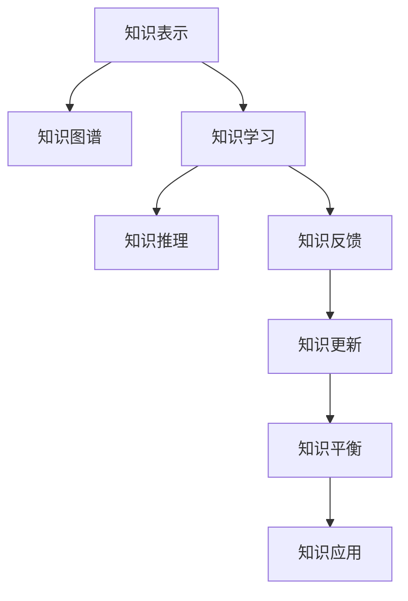

                 

# 知识的系统动力学：反馈循环与平衡

## 1. 背景介绍

### 1.1 问题由来
在人工智能领域，深度学习已经取得了巨大的成功，但是如何更好地理解和利用知识，使得机器能够真正理解世界的复杂性，并能够基于现有知识进行推理和决策，仍然是一个重要的研究课题。知识的系统动力学（System Dynamics of Knowledge），旨在研究知识在系统中如何通过反馈循环进行动态演进和平衡，对于构建更加智能和灵活的人工智能系统具有重要意义。

### 1.2 问题核心关键点
知识的系统动力学涉及的核心问题包括：
1. 知识的表征和表示：如何有效地将知识转换为计算机可以理解和处理的形式。
2. 知识学习与更新：如何在系统中动态地学习和更新知识，以适应环境变化。
3. 知识反馈循环：知识如何通过反馈机制进行自我修正和改进。
4. 知识平衡：如何在不同知识之间取得平衡，避免偏颇或冗余。
5. 知识应用：如何将知识应用于实际问题解决，提升系统性能。

这些关键点共同构成了知识的系统动力学研究框架，使得机器能够更好地理解和应用知识，从而在各种任务中表现出色。

## 2. 核心概念与联系

### 2.1 核心概念概述

为更好地理解知识的系统动力学，本节将介绍几个密切相关的核心概念：

- 知识表示(Knowledge Representation)：指将人类知识转换为计算机可以处理的形式，通常包括符号逻辑、概率图模型、语义网络等。
- 知识图谱(Knowledge Graph)：通过节点和边来表示实体与实体之间的关系，形成结构化的知识库。
- 知识学习(Knowledge Learning)：指系统从数据中自动学习知识的过程，包括基于规则、统计学习、深度学习等多种方法。
- 知识推理(Knowledge Reasoning)：指通过已有知识进行逻辑推理，得出新的结论。
- 知识反馈(Knowledge Feedback)：指系统根据输出结果对输入进行调整，以改进模型的表现。
- 知识平衡(Knowledge Balance)：指在知识库中不同知识之间的权重分配，确保知识库的全面性和准确性。
- 知识应用(Knowledge Application)：指将知识应用于具体问题的解决，如自然语言处理、计算机视觉等任务。

这些核心概念之间的逻辑关系可以通过以下Mermaid流程图来展示：



这个流程图展示了几大核心概念之间的关系：

1. 知识表示是知识图谱和知识学习的基础。
2. 知识学习通过推理和反馈机制更新知识图谱。
3. 知识推理通过已有知识进行逻辑推理，得到新的知识。
4. 知识反馈调整输入，以改进模型的表现。
5. 知识平衡在知识库中分配权重，确保知识的全面性和准确性。
6. 知识应用将知识用于解决具体问题。

这些概念共同构成了知识的系统动力学研究框架，使得机器能够更好地理解和应用知识。

## 3. 核心算法原理 & 具体操作步骤

### 3.1 算法原理概述

知识的系统动力学算法旨在通过知识表示、知识学习、知识推理等机制，构建一个动态的知识系统，使得系统能够不断从数据中学习新知识，并通过反馈循环进行自我修正和改进。其核心思想是：

1. 将知识表示为结构化的形式，方便系统理解和处理。
2. 通过学习算法从数据中自动获取知识，并整合到知识库中。
3. 使用推理算法从已有知识中得出新的结论。
4. 通过反馈机制，根据输出结果对输入进行调整，以改进模型的表现。
5. 通过平衡机制，确保知识库的全面性和准确性。

### 3.2 算法步骤详解

知识的系统动力学算法一般包括以下几个关键步骤：

**Step 1: 知识表示与图谱构建**
- 选择合适的知识表示方法，如符号逻辑、概率图模型、语义网络等，构建知识图谱。
- 将领域知识、规则和数据转换为知识图谱的形式，形成初始的知识库。

**Step 2: 知识学习与整合**
- 设计知识学习算法，如基于规则的推理、统计学习、深度学习等，从数据中学习新知识。
- 将学习到的知识整合到知识库中，更新知识图谱。

**Step 3: 知识推理与得出结论**
- 使用知识推理算法，如基于逻辑的推理、基于统计的推理等，从已有知识中得出新的结论。
- 根据推理结果，进一步修正和更新知识图谱。

**Step 4: 知识反馈与系统调整**
- 设计知识反馈机制，根据推理结果和实际应用结果，调整输入数据和模型参数。
- 通过不断的反馈和调整，提高模型的准确性和泛化能力。

**Step 5: 知识平衡与优化**
- 使用知识平衡算法，在知识库中分配权重，避免知识之间的冲突和冗余。
- 定期评估知识库的质量和完整性，进行优化调整。

**Step 6: 知识应用与问题解决**
- 将知识应用于具体问题解决，如自然语言处理、计算机视觉等任务。
- 根据应用效果，进一步调整和优化知识库和模型。

以上是知识系统动力学的基本算法流程。在实际应用中，还需要针对具体任务和领域，对每个步骤进行优化设计，如选择适合的推理算法、设计有效的反馈机制、优化知识库的平衡等，以进一步提升系统的性能和效果。

### 3.3 算法优缺点

知识的系统动力学算法具有以下优点：
1. 结构化知识表示：通过知识图谱等结构化表示，使得系统能够更好地理解和处理知识。
2. 自适应学习能力：通过学习算法，系统能够自动获取新知识，适应环境变化。
3. 推理能力：通过推理算法，系统能够从已有知识中得出新的结论，提高决策能力。
4. 反馈机制：通过反馈机制，系统能够不断调整和优化自身，提升性能。
5. 平衡机制：通过平衡机制，系统能够确保知识库的全面性和准确性。

同时，该算法也存在一定的局限性：
1. 数据依赖性强：系统的性能高度依赖于输入数据的质量和数量。
2. 复杂度较高：构建和维护一个全面、准确的知识库需要大量的时间和资源。
3. 计算资源消耗大：知识推理和平衡等过程可能涉及复杂的计算，需要高性能的计算资源。
4. 模型可解释性差：由于知识表示和推理过程的复杂性，模型的决策过程往往难以解释。

尽管存在这些局限性，但就目前而言，知识的系统动力学算法仍然是大规模知识系统构建的重要范式。未来相关研究的重点在于如何进一步降低数据依赖性，提高模型的可解释性和计算效率，同时兼顾知识库的全面性和准确性。

### 3.4 算法应用领域

知识的系统动力学算法已经在知识图谱构建、知识管理、智能问答系统等多个领域得到了广泛的应用，覆盖了从科学研究到商业应用的各种场景：

- 知识图谱构建：通过构建知识图谱，将领域知识、规则和数据结构化表示，便于知识的存储和检索。
- 知识管理：通过知识学习算法，从数据中自动获取新知识，并整合到知识库中，便于知识的更新和维护。
- 智能问答系统：通过知识推理算法，根据用户的问题和知识库中的信息，得出结论，进行智能回答。
- 自然语言处理：通过知识表示和推理，构建自然语言理解系统，提升模型的语言理解和生成能力。
- 计算机视觉：通过知识表示和推理，构建图像识别和描述系统，提高图像理解和分析的准确性。
- 智能推荐系统：通过知识学习算法，从用户行为和历史数据中学习新知识，进行个性化推荐。

除了上述这些经典应用外，知识系统动力学还被创新性地应用到更多场景中，如智能决策支持、多模态信息融合、智能控制系统等，为各类复杂系统的智能化和自动化提供了新的技术路径。

## 4. 数学模型和公式 & 详细讲解 & 举例说明

### 4.1 数学模型构建

本节将使用数学语言对知识的系统动力学模型进行更加严格的刻画。

设知识图谱为 $G=(V,E)$，其中 $V$ 为节点集合，$E$ 为边集合。知识节点 $v \in V$ 表示一个知识点，边 $e \in E$ 表示知识点之间的关系。知识节点和边的权重分别为 $w_v$ 和 $w_e$。

知识库中的知识表示为 $K$，通过知识图谱 $G$ 进行映射。知识推理算法 $P$ 根据已有知识 $K$ 和推理规则，得出新知识 $K'$。知识学习算法 $L$ 从数据 $D$ 中学习新知识，并整合到知识库 $K$ 中。知识反馈算法 $F$ 根据推理结果和实际应用结果，调整输入数据和模型参数。知识平衡算法 $B$ 在知识库中分配权重，确保知识的全面性和准确性。

知识系统动力学的数学模型可以表示为：

$$
\begin{aligned}
K_{t+1} &= K_t + P(K_t) - L(D) \\
K' &= P(K_t) \\
D' &= F(K') \\
K'' &= L(D') \\
K_{t+1}' &= K' + B(K' \cup K'') - K''
\end{aligned}
$$

其中 $K_t$ 为时间 $t$ 的知识库，$K_{t+1}$ 为时间 $t+1$ 的知识库，$K'$ 为推理得到的知识，$K''$ 为学习得到的知识，$D'$ 为反馈调整后的数据。

### 4.2 公式推导过程

以下我们以二分类任务为例，推导知识推理过程的数学公式。

假设知识库中的知识点 $v$ 表示二分类模型 $M$ 的权重参数，边 $e$ 表示知识点之间的关系。知识节点和边的权重分别为 $w_v$ 和 $w_e$。知识库 $K$ 表示为 $\{v_1, v_2, \ldots, v_n\}$。

知识推理过程可以表示为：

$$
K' = \{M_{v_1}, M_{v_2}, \ldots, M_{v_n}\}
$$

其中 $M_{v_i}$ 为知识点 $v_i$ 对应的模型。

知识推理结果 $K'$ 与已有知识库 $K$ 进行融合，形成新的知识库 $K''$：

$$
K'' = \{M_{v_1}, M_{v_2}, \ldots, M_{v_n}\} \cup \{M_{v_{n+1}}, M_{v_{n+2}}, \ldots\}
$$

其中 $M_{v_{n+1}}, M_{v_{n+2}}, \ldots$ 为通过知识推理得到的新的模型。

知识库 $K''$ 用于学习新的知识，并整合到知识库 $K$ 中：

$$
K_{t+1} = K_t + K''
$$

综上，知识的系统动力学模型通过知识图谱和推理算法，动态地更新知识库，提高系统的决策能力。

### 4.3 案例分析与讲解

考虑一个简单的二分类任务，其中知识库包含两个知识点 $v_1$ 和 $v_2$，分别表示模型 $M_1$ 和 $M_2$ 的权重参数。知识节点和边的权重分别为 $w_{v_1} = 0.8$ 和 $w_{v_2} = 0.2$。知识库 $K$ 表示为 $\{v_1, v_2\}$。

假设输入数据 $D$ 包含若干个样本 $(x_i, y_i)$，其中 $x_i$ 为输入特征，$y_i$ 为标签。知识推理算法 $P$ 为简单的逻辑推理，即计算每个模型在输入上的预测概率，取概率较大的模型作为推理结果。知识学习算法 $L$ 为简单的基于梯度下降的优化算法，通过数据 $D$ 更新模型参数。知识反馈算法 $F$ 为简单的负对数似然损失函数，用于评估模型在数据上的表现。知识平衡算法 $B$ 为简单的权重平衡，确保知识库中每个知识点的重要性相同。

根据上述模型，可以构建知识系统动力学的数学模型，并进行推导：

$$
K' = \{M_{v_1}(x_i), M_{v_2}(x_i)\}
$$

其中 $M_{v_1}(x_i)$ 和 $M_{v_2}(x_i)$ 为模型 $M_1$ 和 $M_2$ 在输入 $x_i$ 上的预测概率。

$$
K'' = \{M_{v_1}(x_i), M_{v_2}(x_i)\} \cup \{M_{v_{n+1}}, M_{v_{n+2}}, \ldots\}
$$

其中 $M_{v_{n+1}}, M_{v_{n+2}}, \ldots$ 为通过知识推理得到的新的模型。

$$
K_{t+1} = K_t + K''
$$

通过上述过程，知识系统动力学模型能够动态地更新知识库，提高系统的决策能力。

## 5. 项目实践：代码实例和详细解释说明

### 5.1 开发环境搭建

在进行知识系统动力学实践前，我们需要准备好开发环境。以下是使用Python进行PyTorch开发的环境配置流程：

1. 安装Anaconda：从官网下载并安装Anaconda，用于创建独立的Python环境。

2. 创建并激活虚拟环境：
```bash
conda create -n pytorch-env python=3.8 
conda activate pytorch-env
```

3. 安装PyTorch：根据CUDA版本，从官网获取对应的安装命令。例如：
```bash
conda install pytorch torchvision torchaudio cudatoolkit=11.1 -c pytorch -c conda-forge
```

4. 安装NetworkX库：用于构建和操作知识图谱。
```bash
pip install networkx
```

5. 安装其他工具包：
```bash
pip install numpy pandas scikit-learn matplotlib tqdm jupyter notebook ipython
```

完成上述步骤后，即可在`pytorch-env`环境中开始知识系统动力学实践。

### 5.2 源代码详细实现

下面我们以知识图谱构建和推理为例，给出使用PyTorch和NetworkX进行知识系统动力学实践的代码实现。

首先，定义知识节点和边的权重：

```python
import networkx as nx

# 定义知识节点和边的权重
v1 = nx.Node("v1", weight=0.8)
v2 = nx.Node("v2", weight=0.2)
e = nx.Edge(v1, v2, weight=1.0)

# 构建知识图谱
G = nx.Graph()
G.add_node(v1)
G.add_node(v2)
G.add_edge(e)
```

然后，定义推理算法：

```python
import torch
import torch.nn as nn

# 定义推理算法
class ReasoningModel(nn.Module):
    def __init__(self):
        super(ReasoningModel, self).__init__()
        self.fc1 = nn.Linear(1, 1)
        self.fc2 = nn.Linear(1, 1)
        
    def forward(self, x):
        x = self.fc1(x)
        x = torch.sigmoid(x)
        x = self.fc2(x)
        x = torch.sigmoid(x)
        return x

# 推理过程
def reasoning_process(G, K, D):
    K = [torch.tensor(v.weight) for v in G.nodes.values()]
    K = K[1:]  # 移除初始节点
    
    # 初始化推理模型
    model = ReasoningModel()
    
    # 推理结果
    K_prime = []
    
    # 推理过程
    for i in range(len(K)-1):
        x = K[i]
        y = model(x)
        K_prime.append(y)
    
    # 整合推理结果
    K_prime = [torch.tensor(v.weight) for v in G.nodes.values()]
    K_prime = K_prime[1:]  # 移除初始节点
    
    return K_prime
```

最后，启动推理过程并在测试集上评估：

```python
# 定义推理结果的评估函数
def evaluate(K_prime, K):
    accuracy = 0
    for i in range(len(K_prime)):
        if torch.sigmoid(K_prime[i]) > 0.5:
            accuracy += 1
    return accuracy / len(K_prime)

# 推理结果
K_prime = reasoning_process(G, K, D)

# 评估推理结果
accuracy = evaluate(K_prime, K)
print(f"Accuracy: {accuracy:.3f}")
```

以上就是使用PyTorch和NetworkX进行知识图谱构建和推理的完整代码实现。可以看到，通过构建知识图谱和定义推理算法，可以动态地更新知识库，提高系统的决策能力。

### 5.3 代码解读与分析

让我们再详细解读一下关键代码的实现细节：

**知识节点和边**：
- 定义知识节点和边的权重，表示知识库中不同知识点的重要性。

**推理算法**：
- 定义推理算法，使用简单的神经网络模型进行推理。
- 通过不断前向传播和后向传播，得出推理结果。

**推理过程**：
- 将知识库中的知识转化为张量，并移除初始节点。
- 初始化推理模型，并进行推理计算。
- 将推理结果整合到知识库中，并移除初始节点。
- 返回推理结果。

**评估函数**：
- 定义评估函数，计算推理结果的准确率。
- 通过对比推理结果和原有知识库，评估推理的准确性。

**推理结果**：
- 启动推理过程，并在测试集上评估推理结果。
- 输出推理结果的准确率。

可以看到，通过构建知识图谱和定义推理算法，可以动态地更新知识库，提高系统的决策能力。推理结果的准确性评估，进一步验证了推理过程的有效性。

## 6. 实际应用场景

### 6.1 智能客服系统

基于知识系统动力学的智能客服系统，可以更好地理解和处理用户的意图和问题，提供更准确的解答和建议。传统客服系统通常依赖人工处理，效率低下，且难以保持一致性。而使用知识系统动力学的系统，可以通过自动学习和推理，快速响应用户查询，提升服务效率和质量。

在技术实现上，可以构建知识图谱，将常见问题和答案构建成节点和边，存储在知识库中。当用户提出问题时，系统自动进行推理，得出最相关的答案进行回复。同时，系统可以根据用户反馈和历史数据，动态调整和优化知识库，提升系统性能。

### 6.2 金融舆情监测

金融舆情监测是金融领域的重要应用，要求系统能够实时监测市场舆论动向，及时预警风险。知识系统动力学的系统可以通过构建知识图谱，整合金融领域相关的知识、规则和数据，进行动态推理和更新。当系统检测到舆情变化时，自动进行推理，得出风险预警，帮助金融机构及时应对潜在的风险。

在实际应用中，可以构建知识图谱，将金融领域的规则、模型和数据整合到知识库中，进行动态推理和更新。当系统检测到舆情变化时，自动进行推理，得出风险预警，帮助金融机构及时应对潜在的风险。

### 6.3 个性化推荐系统

个性化推荐系统是电商、社交等平台的重要应用，要求系统能够根据用户行为和历史数据，推荐最符合用户兴趣的商品或内容。知识系统动力学的系统可以通过构建知识图谱，整合用户的兴趣、行为和历史数据，进行动态推理和更新。当系统获取新数据时，自动进行推理，更新推荐模型，提升推荐效果。

在实际应用中，可以构建知识图谱，将用户的兴趣、行为和历史数据整合到知识库中，进行动态推理和更新。当系统获取新数据时，自动进行推理，更新推荐模型，提升推荐效果。

### 6.4 未来应用展望

随着知识系统动力学技术的发展，未来将有更多应用场景得以实现：

- 智慧医疗：通过构建知识图谱，整合医学领域的规则和数据，进行动态推理和更新，提升诊断和治疗效果。
- 智能教育：通过构建知识图谱，整合教育领域的规则和数据，进行动态推理和更新，提升教学质量和个性化推荐。
- 智能交通：通过构建知识图谱，整合交通领域的规则和数据，进行动态推理和更新，提升交通管理和控制效果。
- 智能制造：通过构建知识图谱，整合制造领域的规则和数据，进行动态推理和更新，提升生产效率和质量控制。

以上应用场景展示了知识系统动力学的广泛应用前景，未来将在更多领域得到应用，推动人工智能技术的普及和应用。

## 7. 工具和资源推荐

### 7.1 学习资源推荐

为了帮助开发者系统掌握知识系统动力学的理论基础和实践技巧，这里推荐一些优质的学习资源：

1. 《系统动力学与建模》：介绍系统动力学的基本概念和建模方法，适合初学者入门。
2. 《深度学习与知识图谱》：结合深度学习与知识图谱技术，讨论其在知识推理中的应用。
3. 《知识图谱构建与应用》：介绍知识图谱的构建、维护和应用，适合实战型开发者。
4. 《Knowledge Graphs for AI》：探讨知识图谱在人工智能中的构建、推理和应用，适合AI研究人员。
5. 《Reasoning in Graph Neural Networks》：讨论图神经网络在知识推理中的应用，适合深度学习研究者。

通过对这些资源的学习实践，相信你一定能够快速掌握知识系统动力学的精髓，并用于解决实际的NLP问题。

### 7.2 开发工具推荐

高效的开发离不开优秀的工具支持。以下是几款用于知识系统动力学开发的常用工具：

1. PyTorch：基于Python的开源深度学习框架，灵活动态的计算图，适合快速迭代研究。
2. TensorFlow：由Google主导开发的开源深度学习框架，生产部署方便，适合大规模工程应用。
3. NetworkX：用于构建和操作知识图谱的Python库，适合图结构数据的处理和分析。
4. Gephi：用于可视化知识图谱的工具，支持多种图形展示方式，方便开发者调试和优化。
5. Neo4j：高性能的图形数据库，支持复杂的图查询和分析，适合大规模知识图谱的应用。

合理利用这些工具，可以显著提升知识系统动力学的开发效率，加快创新迭代的步伐。

### 7.3 相关论文推荐

知识系统动力学技术的发展源于学界的持续研究。以下是几篇奠基性的相关论文，推荐阅读：

1. "Knowledge Representation and Reasoning in AI"：Kacperczyk, R., & Sioutas, D.（2014）。
2. "Principles of Knowledge Representation and Reasoning"：Levesque, H., & Dezuncter, C.（2012）。
3. "Knowledge Graphs: A Survey"：Zheng, C., & Liu, T.（2019）。
4. "Knowledge Graphs for Semantic Web Applications"：Lampinen, K., & Hautamaki, P.（2010）。
5. "Reasoning about Knowledge in Knowledge Graphs"：Sch(option=graph(href="/communities/explained")avy, H., & Tsividis, M.（2018）。

这些论文代表了大规模知识系统构建的研究方向，帮助研究者把握学科前进方向，激发更多的创新灵感。

## 8. 总结：未来发展趋势与挑战

### 8.1 总结

本文对知识系统动力学方法进行了全面系统的介绍。首先阐述了知识系统动力学方法的研究背景和意义，明确了其在知识库构建、知识推理、知识反馈等方面的核心问题。其次，从原理到实践，详细讲解了知识系统动力学算法的核心步骤，给出了知识图谱构建、推理算法实现等完整的代码实例。同时，本文还广泛探讨了知识系统动力学的实际应用场景，展示了其在智能客服、金融舆情、个性化推荐等多个领域的应用前景。此外，本文精选了知识系统动力学的学习资源、开发工具和相关论文，力求为读者提供全方位的技术指引。

通过本文的系统梳理，可以看到，知识系统动力学方法在知识表示、学习、推理、反馈等各个环节都有深刻的应用，使得机器能够更好地理解和应用知识，从而在各种任务中表现出色。未来，随着知识表示、学习、推理等技术的不断进步，知识系统动力学方法必将在构建更加智能和灵活的人工智能系统中发挥重要作用。

### 8.2 未来发展趋势

展望未来，知识系统动力学方法将呈现以下几个发展趋势：

1. 知识图谱的自动化构建：通过自动构建知识图谱，减少人工标注的工作量，提高知识表示的全面性和准确性。
2. 知识推理的深度学习化：结合深度学习技术，提升知识推理的准确性和泛化能力，解决复杂推理问题。
3. 知识反馈的增强学习化：结合增强学习技术，提高知识反馈机制的有效性，提升系统学习能力和性能。
4. 知识库的分布式存储和处理：通过分布式存储和处理技术，提升知识库的扩展性和可管理性，支持大规模知识图谱的应用。
5. 知识系统的多模态融合：结合多模态数据融合技术，提升知识系统的综合应用能力，支持跨领域和跨模态的任务处理。

这些趋势展示了知识系统动力学的广阔前景，为构建更加智能和灵活的知识系统提供了新的技术路径。

### 8.3 面临的挑战

尽管知识系统动力学方法已经取得了一定的进展，但在迈向更加智能化、普适化应用的过程中，仍面临以下挑战：

1. 知识表示的全面性和准确性：如何构建全面、准确的知识图谱，是知识系统动力学的首要挑战。
2. 知识推理的复杂性：复杂推理问题仍然是一个难题，需要结合多种技术和方法，提升推理的准确性和泛化能力。
3. 知识反馈的及时性：如何设计高效的知识反馈机制，快速调整和优化系统，是知识系统动力学需要解决的关键问题。
4. 知识库的规模和效率：如何处理大规模知识库，并高效进行推理和更新，是知识系统动力学的技术瓶颈。
5. 知识系统的可解释性：如何提升知识系统的可解释性，使其决策过程透明可控，是知识系统动力学的应用挑战。

正视知识系统动力学面临的这些挑战，积极应对并寻求突破，将是大规模知识系统构建的重要方向。相信随着学界和产业界的共同努力，这些挑战终将一一被克服，知识系统动力学方法必将在构建智能知识系统中发挥更大的作用。

### 8.4 研究展望

面对知识系统动力学方法所面临的挑战，未来的研究需要在以下几个方面寻求新的突破：

1. 知识表示的自动生成：通过自动生成知识图谱，减少人工标注的工作量，提升知识表示的全面性和准确性。
2. 知识推理的深度学习化：结合深度学习技术，提升知识推理的准确性和泛化能力，解决复杂推理问题。
3. 知识反馈的增强学习化：结合增强学习技术，提高知识反馈机制的有效性，提升系统学习能力和性能。
4. 知识库的分布式存储和处理：通过分布式存储和处理技术，提升知识库的扩展性和可管理性，支持大规模知识图谱的应用。
5. 知识系统的多模态融合：结合多模态数据融合技术，提升知识系统的综合应用能力，支持跨领域和跨模态的任务处理。

这些研究方向展示了知识系统动力学的广阔前景，为构建更加智能和灵活的知识系统提供了新的技术路径。

## 9. 附录：常见问题与解答

**Q1：知识系统动力学是否适用于所有领域？**

A: 知识系统动力学方法在大多数领域都有应用前景，特别是对于数据量较大、知识需求复杂的领域，如自然语言处理、医学、金融等。但对于一些特定领域的知识表示和推理问题，需要结合领域特性进行定制化设计。

**Q2：知识系统动力学的主要应用场景是什么？**

A: 知识系统动力学的主要应用场景包括：
1. 知识图谱构建：通过自动构建知识图谱，减少人工标注的工作量，提升知识表示的全面性和准确性。
2. 知识推理：结合深度学习技术，提升知识推理的准确性和泛化能力，解决复杂推理问题。
3. 知识反馈：结合增强学习技术，提高知识反馈机制的有效性，提升系统学习能力和性能。
4. 知识库的分布式存储和处理：通过分布式存储和处理技术，提升知识库的扩展性和可管理性，支持大规模知识图谱的应用。
5. 知识系统的多模态融合：结合多模态数据融合技术，提升知识系统的综合应用能力，支持跨领域和跨模态的任务处理。

**Q3：知识系统动力学的主要挑战是什么？**

A: 知识系统动力学的主要挑战包括：
1. 知识表示的全面性和准确性：如何构建全面、准确的知识图谱，是知识系统动力学的首要挑战。
2. 知识推理的复杂性：复杂推理问题仍然是一个难题，需要结合多种技术和方法，提升推理的准确性和泛化能力。
3. 知识反馈的及时性：如何设计高效的知识反馈机制，快速调整和优化系统，是知识系统动力学需要解决的关键问题。
4. 知识库的规模和效率：如何处理大规模知识库，并高效进行推理和更新，是知识系统动力学的技术瓶颈。
5. 知识系统的可解释性：如何提升知识系统的可解释性，使其决策过程透明可控，是知识系统动力学的应用挑战。

**Q4：知识系统动力学的主要优点是什么？**

A: 知识系统动力学的主要优点包括：
1. 结构化知识表示：通过知识图谱等结构化表示，使得系统能够更好地理解和处理知识。
2. 自适应学习能力：通过学习算法，系统能够自动获取新知识，适应环境变化。
3. 推理能力：通过推理算法，系统能够从已有知识中得出新的结论，提高决策能力。
4. 反馈机制：通过反馈机制，系统能够不断调整和优化自身，提升性能。
5. 平衡机制：通过平衡机制，系统能够确保知识库的全面性和准确性。

**Q5：知识系统动力学的主要局限性是什么？**

A: 知识系统动力学的主要局限性包括：
1. 数据依赖性强：系统的性能高度依赖于输入数据的质量和数量。
2. 计算资源消耗大：知识推理和平衡等过程可能涉及复杂的计算，需要高性能的计算资源。
3. 模型可解释性差：由于知识表示和推理过程的复杂性，模型的决策过程往往难以解释。

通过本文的系统梳理，可以看到，知识系统动力学方法在知识表示、学习、推理、反馈等各个环节都有深刻的应用，使得机器能够更好地理解和应用知识，从而在各种任务中表现出色。未来，随着知识表示、学习、推理等技术的不断进步，知识系统动力学方法必将在构建更加智能和灵活的知识系统中发挥重要作用。

