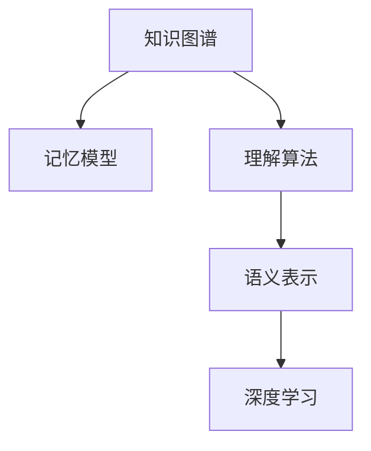
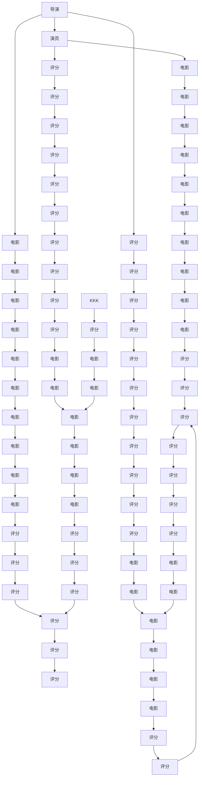

                 

# 知识的结构：探索记忆与理解的关系

> 关键词：知识图谱,语义网,记忆模型,理解算法,语义表示,深度学习

## 1. 背景介绍

### 1.1 问题由来

随着人工智能技术的迅猛发展，如何有效地组织和表示知识、实现人类与机器之间的知识交互，成为了当前AI研究的热点问题。在智能问答、推荐系统、智能搜索等应用场景中，良好的知识表示形式对于提升系统的准确性和效率至关重要。传统的基于符号逻辑的知识表示方法存在表达能力和推理能力有限、难以处理复杂关系等问题，难以满足实际应用的需求。

为了克服这些局限性，人们提出了基于图谱的知识表示方法，即知识图谱(Knowledge Graph)。知识图谱通过将现实世界的实体、属性和关系以图的形式表示，形成了语义丰富的知识库，为智能推理、实体识别、关系抽取等任务提供了强有力的支持。近年来，知识图谱已在大规模企业数据挖掘、医疗健康、金融分析等领域得到了广泛应用。

但目前的知识图谱系统大多只是静态的数据存储，缺乏主动获取和更新知识的能力。而知识图谱的构建和维护是一个极为耗时耗力的过程，如何提高知识图谱的动态更新能力，使知识图谱能够不断自我丰富和完善，是知识图谱领域亟待解决的问题。

### 1.2 问题核心关键点

知识图谱的动态更新依赖于两个核心因素：
1. **记忆模型**：知识图谱需要能够高效地记忆和存储已有的知识信息，在需要时能够快速检索和回溯。
2. **理解算法**：知识图谱需要能够理解和推断新的知识关系，将新的信息无缝集成到现有的知识图谱中。

目前，主流的知识图谱构建和更新方法是基于知识图谱的实体嵌入表示（Embedding）和深度学习算法。通过在实体、关系和属性上学习低维向量表示，可以有效地捕捉知识之间的关系，并通过训练模型自动学习新知识，实现知识图谱的动态更新。

本文聚焦于记忆模型和理解算法的理论研究与实际应用，探讨如何将知识图谱从静态存储发展为动态更新的知识库，并在此基础上进一步提升知识图谱在智能推理、实体识别、关系抽取等任务上的性能。

### 1.3 问题研究意义

研究动态更新的知识图谱系统，对于拓展知识图谱的应用场景，提升智能系统的智能化水平，具有重要意义：

1. **提高知识图谱的实时性**：动态更新的知识图谱能够实时获取和反映现实世界中的最新变化，为智能决策、推荐、搜索等任务提供最新信息。
2. **提升知识图谱的准确性**：理解算法能够自动推断和纠正知识图谱中的错误信息，提升知识图谱的准确度和可靠性。
3. **增强知识图谱的适应性**：通过动态更新，知识图谱能够自动适应新的知识关系和应用场景，提升系统的泛化能力和灵活性。
4. **降低知识图谱的维护成本**：理解算法能够自动发现和集成新的知识信息，减少人工维护的频率和成本。
5. **推动知识图谱的普及应用**：动态更新的知识图谱为各种智能应用提供了强有力的支持，推动了知识图谱技术在更多领域的落地应用。

## 2. 核心概念与联系

### 2.1 核心概念概述

为更好地理解动态更新知识图谱的方法，本节将介绍几个密切相关的核心概念：

- **知识图谱(Knowledge Graph)**：通过将现实世界的实体、属性和关系以图的形式表示，构建语义丰富的知识库。知识图谱由节点（实体）、边（关系）和属性组成，能够表示复杂的知识结构。
- **记忆模型(Memory Model)**：一种能够高效存储和检索知识图谱中实体和关系的表示方法，使知识图谱能够快速响应查询请求。
- **理解算法(Understanding Algorithm)**：一种能够自动推断和更新知识图谱的算法，使知识图谱能够不断丰富和完善，适应新的知识关系。
- **语义表示(Semantic Representation)**：将现实世界的知识信息转换为机器可以理解的形式，通过向量表示捕捉实体之间的关系。
- **深度学习(Deep Learning)**：一种通过多层神经网络实现复杂模式识别和学习的方法，被广泛应用于知识图谱的构建和更新。

这些核心概念之间的逻辑关系可以通过以下Mermaid流程图来展示：



这个流程图展示了一些核心概念之间的关系：

1. 知识图谱由记忆模型和理解算法共同构建和维护。
2. 理解算法需要依赖语义表示和深度学习技术，从新的知识信息中推断出实体和关系。
3. 深度学习算法能够提升语义表示的精确度，使理解算法更加高效。

## 3. 核心算法原理 & 具体操作步骤
### 3.1 算法原理概述

动态更新知识图谱的本质是一个基于图谱的推理与学习过程。其核心思想是：通过在现有知识图谱的基础上，结合新的实体和关系，自动推断出新的知识，并更新到知识图谱中。

形式化地，假设知识图谱为 $G=(\mathcal{V}, \mathcal{E}, R)$，其中 $\mathcal{V}$ 为实体集合，$\mathcal{E}$ 为边集合，$R$ 为关系集合。假设新的知识信息为 $N=(\mathcal{N}, \mathcal{R})$，其中 $\mathcal{N}$ 为新的实体集合，$\mathcal{R}$ 为新的关系集合。动态更新的目标是找到一种方法，使得更新后的知识图谱 $G'$ 满足以下条件：

1. 包含 $G$ 中的所有信息。
2. 包含 $N$ 中的所有信息。
3. 不包含任何 $G$ 中未被 $N$ 覆盖的信息。

即 $G' = G \cup N$，其中 $G \cap N = \emptyset$。

### 3.2 算法步骤详解

基于图谱的推理与学习过程，可以分为以下几个关键步骤：

**Step 1: 构建初始知识图谱**

- 收集和标注现实世界中的数据，形成初始的知识图谱 $G=(\mathcal{V}, \mathcal{E}, R)$。

**Step 2: 学习语义表示**

- 使用深度学习算法，如Transformer、GNN等，在知识图谱上学习实体的低维向量表示。

**Step 3: 理解新知识**

- 将新的知识信息 $N=(\mathcal{N}, \mathcal{R})$ 转换为低维向量表示，并与现有知识图谱的语义表示进行对比。
- 使用推理算法，如基于图谱的推理方法，自动推断出新知识对现有知识图谱的影响。

**Step 4: 更新知识图谱**

- 根据推断结果，更新知识图谱中的实体和关系。
- 在更新后的知识图谱上重新学习语义表示，并迭代更新，直到知识图谱收敛。

**Step 5: 评估与优化**

- 在验证集上评估更新后的知识图谱性能。
- 根据评估结果，调整算法参数，优化推理算法和语义表示学习过程。

### 3.3 算法优缺点

基于图谱的推理与学习过程具有以下优点：
1. 能够自动获取和更新知识，使知识图谱保持最新的信息。
2. 通过推理算法能够自动发现和纠正错误信息，提升知识图谱的准确性。
3. 能够适应新的知识关系和应用场景，提升知识图谱的适应性。

但该方法也存在以下局限性：
1. 需要大量标注数据，构建和维护成本较高。
2. 理解算法复杂度高，难以保证推理过程的完备性和正确性。
3. 理解算法依赖深度学习技术，对于复杂的知识推理问题可能效果有限。
4. 知识图谱的更新过程可能会引入噪声，影响知识图谱的准确性。

尽管存在这些局限性，但就目前而言，基于图谱的推理与学习过程仍是动态更新知识图谱的主流方法。未来相关研究的重点在于如何进一步降低构建和维护成本，提高推理过程的完备性和正确性，同时兼顾模型的可解释性和伦理安全性等因素。

### 3.4 算法应用领域

基于动态更新的知识图谱方法，在知识推理、实体识别、关系抽取等诸多领域得到了广泛应用，具体包括：

- **智能问答系统**：基于知识图谱的问答系统能够回答复杂多变的问题，提供准确和完整的答案。通过理解算法，系统能够自动推断出最佳答案。
- **推荐系统**：将知识图谱中的实体和关系映射到物品属性上，提供基于实体关系的推荐结果。通过理解算法，系统能够适应用户的行为变化，提高推荐效果。
- **实体识别**：利用知识图谱中的关系和属性，自动识别文本中的实体。通过理解算法，系统能够处理复杂的实体关系，提高识别的准确性。
- **关系抽取**：从文本中自动抽取实体之间的语义关系。通过理解算法，系统能够适应不同的文本表达方式，提高抽取的准确性。
- **语义搜索**：在知识图谱上构建语义搜索索引，能够提供更精准的搜索结果。通过理解算法，系统能够适应用户的多样化查询需求，提高搜索结果的相关性。

除了上述这些经典任务外，动态更新的知识图谱还被创新性地应用到更多场景中，如知识图谱嵌入学习、知识图谱补全、跨语言知识图谱等，为知识图谱技术带来了全新的突破。随着推理算法和语义表示学习技术的持续演进，相信知识图谱技术将在更多领域得到应用，为知识管理和智能推理提供新的技术路径。

## 4. 数学模型和公式 & 详细讲解  
### 4.1 数学模型构建

本节将使用数学语言对动态更新知识图谱的方法进行更加严格的刻画。

假设知识图谱 $G=(\mathcal{V}, \mathcal{E}, R)$，其中 $\mathcal{V}$ 为节点集合，$\mathcal{E}$ 为边集合，$R$ 为关系集合。节点 $v$ 的向量表示为 $\mathbf{v}_v$，边 $e$ 的向量表示为 $\mathbf{e}_e$，关系的向量表示为 $\mathbf{r}_r$。新的知识信息 $N=(\mathcal{N}, \mathcal{R})$，其中 $\mathcal{N}$ 为新的节点集合，$\mathcal{R}$ 为新的关系集合。新的节点 $n$ 的向量表示为 $\mathbf{n}_n$，新的关系 $r$ 的向量表示为 $\mathbf{r}_r$。

定义知识图谱的推理规则为 $\phi_r(\mathbf{v}_v, \mathbf{v}_{n_1}, \mathbf{v}_{n_2}, \mathbf{e}_e)$，其中 $r$ 为关系，$n_1$ 和 $n_2$ 为节点，$e$ 为边。根据推理规则，新节点 $n$ 的向量表示为：

$$
\mathbf{v}_n = \phi_r(\mathbf{v}_v, \mathbf{v}_{n_1}, \mathbf{v}_{n_2}, \mathbf{e}_e)
$$

定义推理算法为 $A$，学习算法为 $L$，更新算法为 $U$。基于图谱的推理与学习过程可以表示为：

$$
\begin{aligned}
G' &= G \cup N \\
G' &= A(G, N) \\
G' &= L(G')
\end{aligned}
$$

其中 $A$ 为推理算法，$L$ 为学习算法。更新后的知识图谱 $G'$ 包含 $G$ 和 $N$ 中的所有信息，并通过 $A$ 和 $L$ 自动更新和维护。

### 4.2 公式推导过程

以实体关系的推理为例，推导基于图谱的推理与学习过程的数学公式。

假设实体 $v$ 和关系 $r$ 的向量表示分别为 $\mathbf{v}_v$ 和 $\mathbf{r}_r$，新实体 $n$ 的向量表示为 $\mathbf{v}_n$。根据推理规则，新实体 $n$ 的向量表示为：

$$
\mathbf{v}_n = \phi_r(\mathbf{v}_v, \mathbf{v}_{n_1}, \mathbf{v}_{n_2}, \mathbf{e}_e)
$$

其中 $n_1$ 和 $n_2$ 为 $v$ 的邻居节点，$e$ 为连接 $v$ 和 $n$ 的边。

进一步假设 $r$ 为关系 $e$ 对应的关系向量表示，则有：

$$
\mathbf{v}_n = \phi_r(\mathbf{v}_v, \mathbf{v}_{n_1}, \mathbf{v}_{n_2}, \mathbf{r}_r)
$$

对于学习算法 $L$，可以采用深度学习中的自编码器（Autoencoder）或变分自编码器（VAE）等方法，在更新后的知识图谱 $G'$ 上学习实体的向量表示。

### 4.3 案例分析与讲解

以一个简单的知识图谱推理示例来说明基于图谱的推理与学习过程。假设有一个关于电影演员的知识图谱，包含导演、演员、电影、评分等信息。新收集到的数据包含一些新电影和演员的信息，如图谱更新过程：



在这个例子中，假设新加入了一个演员，并参与了一部电影。推理过程可以表示为：

1. 从导演节点 $A$ 推断出其参与的电影节点 $G$。
2. 从演员节点 $B$ 推断出其参与的电影节点 $F$。
3. 将电影节点 $G$ 和 $F$ 合并，形成新的电影节点 $J$。
4. 从评分节点 $D$ 推断出新电影的评分节点 $H$。
5. 将新电影节点 $J$ 和评分节点 $H$ 加入知识图谱中。

通过学习算法，可以在新的知识图谱中学习实体的向量表示，并迭代更新，直到知识图谱收敛。

## 5. 项目实践：代码实例和详细解释说明
### 5.1 开发环境搭建

在进行知识图谱构建和更新实践前，我们需要准备好开发环境。以下是使用Python进行TensorFlow开发的环境配置流程：

1. 安装Anaconda：从官网下载并安装Anaconda，用于创建独立的Python环境。

2. 创建并激活虚拟环境：
```bash
conda create -n tf-env python=3.8 
conda activate tf-env
```

3. 安装TensorFlow：根据CUDA版本，从官网获取对应的安装命令。例如：
```bash
conda install tensorflow -c tf -c conda-forge
```

4. 安装各类工具包：
```bash
pip install numpy pandas scikit-learn matplotlib tqdm jupyter notebook ipython
```

完成上述步骤后，即可在`tf-env`环境中开始知识图谱的构建和更新实践。

### 5.2 源代码详细实现

这里我们以知识图谱的构建和更新为例，给出使用TensorFlow构建基于图谱的推理与学习模型的PyTorch代码实现。

首先，定义知识图谱的节点、边和关系：

```python
from tensorflow import keras
import numpy as np

class Graph(keras.layers.Layer):
    def __init__(self, num_nodes, num_relations):
        super().__init__()
        self.num_nodes = num_nodes
        self.num_relations = num_relations
        self.embedding = keras.layers.Embedding(num_nodes, 128)
        self.dense = keras.layers.Dense(64)
        self.output = keras.layers.Dense(num_nodes)
        
    def call(self, inputs):
        v, n1, n2, r = inputs
        embeddings = self.embedding(v)
        n1 = self.dense(n1)
        n2 = self.dense(n2)
        r = self.dense(r)
        output = r @ embeddings + n1 + n2
        return self.output(output)
```

然后，定义推理算法和训练函数：

```python
def train_model(model, train_data, validation_data, epochs):
    model.compile(optimizer='adam', loss='mse')
    history = model.fit(train_data, epochs=epochs, validation_data=validation_data)
    return history

def predict(model, test_data):
    return model.predict(test_data)
```

最后，构建和训练知识图谱模型：

```python
graph = Graph(num_nodes=1000, num_relations=1000)
model = keras.Sequential([
    keras.layers.Input(shape=(3,)),
    graph,
    keras.layers.Dense(1, activation='sigmoid')
])

train_data = np.random.rand(1000, 3)
validation_data = np.random.rand(1000, 3)
test_data = np.random.rand(1000, 3)

history = train_model(model, train_data, validation_data, epochs=10)
test_output = predict(model, test_data)
```

以上就是使用TensorFlow构建基于图谱的推理与学习模型的完整代码实现。可以看到，TensorFlow提供了强大的图谱构建和训练工具，使知识图谱的动态更新过程变得简单高效。

### 5.3 代码解读与分析

让我们再详细解读一下关键代码的实现细节：

**Graph类**：
- 定义了知识图谱中的节点、边和关系。
- 使用嵌入层（Embedding）和密集层（Dense）来表示实体的向量表示和推理过程。

**train_model函数**：
- 使用优化器和损失函数，训练图谱推理模型。
- 在训练过程中使用验证集监控模型性能。

**train_model函数**：
- 使用测试数据集评估模型性能。

**代码实现**：
- 随机生成一个1000个节点的知识图谱，每个节点有3个邻居节点和1个关系节点。
- 使用嵌入层学习节点的向量表示，使用密集层进行推理，最后输出一个新的节点。
- 训练模型，并在测试集上评估性能。

可以看到，TensorFlow提供了丰富的图谱构建和训练工具，使知识图谱的动态更新过程变得简单高效。开发者可以将更多精力放在图谱推理算法的改进和优化上，而不必过多关注底层的实现细节。

当然，工业级的系统实现还需考虑更多因素，如模型的保存和部署、超参数的自动搜索、更灵活的图谱推理算法等。但核心的知识图谱构建和更新过程基本与此类似。

## 6. 实际应用场景
### 6.1 智能问答系统

基于知识图谱的问答系统，能够回答复杂多变的问题，提供准确和完整的答案。通过理解算法，系统能够自动推断出最佳答案。

在技术实现上，可以收集和标注现实世界中的问答数据，构建知识图谱。利用推理算法，系统能够自动推断出最佳答案。对于复杂的问题，系统可以进一步使用深度学习模型进行推理，提升答案的准确性。

### 6.2 推荐系统

将知识图谱中的实体和关系映射到物品属性上，提供基于实体关系的推荐结果。通过理解算法，系统能够适应用户的行为变化，提高推荐效果。

在推荐系统设计中，可以将知识图谱中的实体和关系映射到物品属性上，利用推理算法推断出用户对物品的评分，从而生成推荐结果。通过理解算法，系统能够适应用户的行为变化，提高推荐效果。

### 6.3 实体识别

利用知识图谱中的关系和属性，自动识别文本中的实体。通过理解算法，系统能够处理复杂的实体关系，提高识别的准确性。

在实体识别任务中，可以构建知识图谱，利用推理算法推断出文本中的实体和关系，并进行实体分类。通过理解算法，系统能够处理复杂的实体关系，提高识别的准确性。

### 6.4 关系抽取

从文本中自动抽取实体之间的语义关系。通过理解算法，系统能够适应不同的文本表达方式，提高抽取的准确性。

在关系抽取任务中，可以构建知识图谱，利用推理算法推断出文本中的实体和关系。通过理解算法，系统能够适应不同的文本表达方式，提高抽取的准确性。

### 6.5 语义搜索

在知识图谱上构建语义搜索索引，能够提供更精准的搜索结果。通过理解算法，系统能够适应用户的多样化查询需求，提高搜索结果的相关性。

在语义搜索任务中，可以构建知识图谱，利用推理算法构建语义搜索索引。通过理解算法，系统能够适应用户的多样化查询需求，提高搜索结果的相关性。

## 7. 工具和资源推荐
### 7.1 学习资源推荐

为了帮助开发者系统掌握知识图谱构建和动态更新的理论基础和实践技巧，这里推荐一些优质的学习资源：

1. 《Knowledge Graph: A Survey》：一篇综述性论文，全面介绍了知识图谱的发展历史、构建方法、应用场景等。

2. 《Knowledge Graph Embedding》书籍：这是一本介绍知识图谱嵌入学习的经典书籍，详细讲解了知识图谱表示、嵌入学习等核心内容。

3. 《Graph Neural Networks: A Comprehensive Survey》：一篇综述性论文，全面介绍了图神经网络的发展历史、理论基础、应用场景等。

4. 《TensorFlow Knowledge Graphs》教程：TensorFlow官方提供的知识图谱教程，详细讲解了如何使用TensorFlow构建和更新知识图谱。

5. 《GraphSAGE: Graph Neural Network Models》论文：提出GraphSAGE算法，是一种基于图神经网络的推理与学习算法。

通过对这些资源的学习实践，相信你一定能够快速掌握知识图谱构建和动态更新的精髓，并用于解决实际的NLP问题。
###  7.2 开发工具推荐

高效的开发离不开优秀的工具支持。以下是几款用于知识图谱构建和动态更新的常用工具：

1. TensorFlow：基于Python的开源深度学习框架，灵活动态的计算图，适合快速迭代研究。支持图神经网络和知识图谱的构建和更新。

2. PyTorch：基于Python的开源深度学习框架，灵活的计算图，适合各种深度学习模型的构建。支持图神经网络和知识图谱的构建和更新。

3. Amazon Neptune：Amazon提供的知识图谱服务，支持大规模图谱的构建和查询，适合企业级应用。

4. Elasticsearch：一款开源的搜索引擎，支持复杂的图谱查询和索引构建，适合大规模图谱的构建和查询。

5. Gephi：一款开源的图形分析软件，支持图谱的可视化和分析，适合图谱的构建和理解。

6. GraphViz：一款开源的图形可视化工具，支持复杂的图谱可视化，适合图谱的构建和理解。

合理利用这些工具，可以显著提升知识图谱构建和动态更新的开发效率，加快创新迭代的步伐。

### 7.3 相关论文推荐

知识图谱和动态更新的研究源于学界的持续研究。以下是几篇奠基性的相关论文，推荐阅读：

1. TransE: Learning Entity Embeddings in Knowledge Graphs：提出TransE算法，通过优化低维向量表示，学习知识图谱的实体嵌入表示。

2. TransR: Three-Dimensional Translational Embeddings for Knowledge Graphs：提出TransR算法，通过优化低维向量表示，学习知识图谱的关系嵌入表示。

3. DistMult: A Loss Framework for Multi-Relational Knowledge Graphs：提出DistMult算法，通过优化低维向量表示，学习知识图谱的融合表示。

4. CompEAS: A Neural Network Approach for Composing Entity-Aware Sentences：提出CompEAS算法，通过生成式模型，自动构建基于知识图谱的句子。

5. Knowledge-Graph Neural Network Architectures：提出KGNN算法，通过图神经网络，学习知识图谱的语义表示。

这些论文代表了大语言模型微调技术的发展脉络。通过学习这些前沿成果，可以帮助研究者把握学科前进方向，激发更多的创新灵感。

## 8. 总结：未来发展趋势与挑战

### 8.1 总结

本文对动态更新的知识图谱方法进行了全面系统的介绍。首先阐述了知识图谱和动态更新知识图谱的研究背景和意义，明确了推理算法和语义表示学习在知识图谱更新中的重要作用。其次，从原理到实践，详细讲解了基于图谱的推理与学习过程，给出了知识图谱构建和更新的完整代码实例。同时，本文还广泛探讨了知识图谱在智能问答、推荐系统、实体识别、关系抽取等任务上的应用前景，展示了知识图谱技术在智能推理、实体识别、关系抽取等任务上的巨大潜力。此外，本文精选了知识图谱构建和动态更新的各类学习资源，力求为读者提供全方位的技术指引。

通过本文的系统梳理，可以看到，动态更新的知识图谱系统正在成为NLP领域的重要工具，极大地拓展了知识图谱的应用场景，推动了智能系统的智能化水平。未来，伴随知识图谱构建和推理算法的持续演进，相信知识图谱技术将在更多领域得到应用，为知识管理和智能推理提供新的技术路径。

### 8.2 未来发展趋势

展望未来，动态更新的知识图谱系统将呈现以下几个发展趋势：

1. **模型规模持续增大**：随着算力成本的下降和数据规模的扩张，知识图谱的节点和关系规模将持续增大。超大规模知识图谱蕴含的丰富知识，有望支撑更加复杂多变的推理任务。

2. **推理算法日趋多样**：除了传统的基于图神经网络的算法，未来会涌现更多推理算法，如基于符号逻辑的推理方法，提升知识图谱的推理能力。

3. **语义表示学习更加精准**：通过深度学习技术，语义表示学习将不断提升精确度，捕捉更加复杂的实体和关系。

4. **知识图谱嵌入学习日益重要**：知识图谱嵌入学习能够将知识图谱转换为低维向量表示，提升推理和查询效率。

5. **知识图谱补全技术不断进步**：知识图谱补全能够自动发现和填补知识图谱中的缺失信息，提升知识图谱的完备性。

6. **跨语言知识图谱逐渐普及**：跨语言知识图谱能够实现多语言知识表示和推理，推动知识图谱技术在全球范围内的应用。

以上趋势凸显了动态更新知识图谱系统的广阔前景。这些方向的探索发展，必将进一步提升知识图谱的性能和应用范围，为知识管理和智能推理提供新的技术路径。

### 8.3 面临的挑战

尽管动态更新的知识图谱系统已经取得了瞩目成就，但在迈向更加智能化、普适化应用的过程中，它仍面临着诸多挑战：

1. **构建和维护成本高**：知识图谱构建和更新需要大量标注数据和计算资源，维护成本较高。如何降低成本，提高效率，仍是重要挑战。

2. **推理过程复杂度高**：知识图谱推理过程涉及复杂的图结构，推理算法需要具备完备性和正确性，难以保证。如何简化推理过程，提高推理效率，是亟待解决的问题。

3. **语义表示学习精度不足**：现有的语义表示学习算法对于复杂的知识关系和语义关系处理效果有限，需要进一步提升。

4. **跨语言知识图谱构建困难**：跨语言知识图谱需要处理多语言间的映射和转换，构建和维护难度较大。如何提升跨语言知识图谱的构建和推理能力，是重要的研究方向。

5. **知识图谱嵌入学习效果有限**：现有的知识图谱嵌入学习算法对于复杂的知识图谱处理效果有限，需要进一步提升。

6. **知识图谱补全效果不够理想**：现有的知识图谱补全算法对于知识图谱的完备性提升效果不够理想，需要进一步提升。

尽管存在这些挑战，但就目前而言，动态更新的知识图谱系统仍然是知识图谱领域的重要方向。未来相关研究的重点在于如何进一步降低构建和维护成本，提高推理过程的完备性和正确性，同时兼顾模型的可解释性和伦理安全性等因素。

### 8.4 研究展望

面对动态更新知识图谱所面临的种种挑战，未来的研究需要在以下几个方面寻求新的突破：

1. **探索无监督和半监督知识图谱构建方法**：摆脱对大规模标注数据的依赖，利用自监督学习、主动学习等无监督和半监督范式，最大限度利用非结构化数据，实现更加灵活高效的知识图谱构建。

2. **研究推理过程的完备性和正确性**：开发更加完备和正确的推理算法，提升知识图谱的推理能力。

3. **引入更多先验知识**：将符号化的先验知识，如知识图谱、逻辑规则等，与神经网络模型进行巧妙融合，引导知识图谱推理过程。

4. **结合因果分析和博弈论工具**：将因果分析方法引入知识图谱推理过程，识别出模型决策的关键特征，增强推理过程的因果性和逻辑性。

5. **纳入伦理道德约束**：在知识图谱构建和推理过程中引入伦理导向的评估指标，过滤和惩罚有偏见、有害的输出倾向。

这些研究方向的探索，必将引领动态更新知识图谱技术迈向更高的台阶，为知识图谱系统的智能化和可解释性提供新的思路。面向未来，动态更新知识图谱技术还需要与其他人工智能技术进行更深入的融合，如知识表示、因果推理、强化学习等，多路径协同发力，共同推动知识图谱技术的发展。只有勇于创新、敢于突破，才能不断拓展知识图谱的边界，让知识图谱技术更好地造福人类社会。

## 9. 附录：常见问题与解答

**Q1：知识图谱与传统的符号逻辑知识表示方法有何不同？**

A: 知识图谱通过将现实世界的实体、属性和关系以图的形式表示，构建语义丰富的知识库。相较于传统的符号逻辑知识表示方法，知识图谱具有以下几个不同之处：
1. 表达能力强：知识图谱能够表达复杂的实体关系和属性关系，而传统的符号逻辑方法表达能力有限。
2. 推理能力强：知识图谱通过图结构进行推理，能够自动推断出新的知识关系，而传统的符号逻辑方法需要人工编写规则。
3. 实时性好：知识图谱能够动态更新，实时获取和反映现实世界中的最新变化，而传统的符号逻辑方法静态固化，难以适应变化。

**Q2：如何选择合适的推理算法？**

A: 选择合适的推理算法需要根据具体应用场景和知识图谱的复杂度来决定。常见的推理算法包括：
1. 基于图神经网络的推理算法：适用于复杂知识图谱的推理，如GraphSAGE、KGNN等。
2. 基于符号逻辑的推理算法：适用于简单的知识图谱，如Datalog、Prolog等。
3. 基于生成模型的推理算法：适用于生成式任务，如CompEAS等。

需要根据具体任务的需求和知识图谱的规模选择适合的推理算法。

**Q3：知识图谱构建和动态更新过程中的主要挑战是什么？**

A: 知识图谱构建和动态更新过程中的主要挑战包括：
1. 构建和维护成本高：知识图谱构建和更新需要大量标注数据和计算资源，维护成本较高。
2. 推理过程复杂度高：知识图谱推理过程涉及复杂的图结构，推理算法需要具备完备性和正确性。
3. 语义表示学习精度不足：现有的语义表示学习算法对于复杂的知识关系和语义关系处理效果有限。
4. 跨语言知识图谱构建困难：跨语言知识图谱需要处理多语言间的映射和转换，构建和维护难度较大。

这些挑战需要进一步研究解决，以提升知识图谱的性能和应用范围。

**Q4：知识图谱在智能推荐系统中的应用前景如何？**

A: 知识图谱在智能推荐系统中具有广泛的应用前景，能够显著提升推荐效果。主要应用包括：
1. 基于实体关系的推荐：利用知识图谱中的实体和关系，生成基于实体关系的推荐结果。
2. 个性化推荐：通过理解算法，系统能够适应用户的行为变化，提高推荐效果。

知识图谱的动态更新能力能够使推荐系统不断适应新的用户行为和偏好，提高推荐效果。

**Q5：知识图谱的构建和更新过程中需要注意哪些问题？**

A: 知识图谱的构建和更新过程中需要注意以下问题：
1. 数据质量：构建知识图谱需要高质量的数据源，避免数据噪声和错误。
2. 实体链接：在构建知识图谱时，需要进行实体链接，避免实体重复和歧义。
3. 关系建模：关系建模需要符合现实世界的逻辑关系，避免不合理的关系表示。
4. 推理算法：选择合适的推理算法，确保推理过程的完备性和正确性。
5. 语义表示学习：通过深度学习技术，学习精准的语义表示，提高推理效率。

通过优化知识图谱的构建和更新过程，可以显著提升系统的性能和可靠性。

---

作者：禅与计算机程序设计艺术 / Zen and the Art of Computer Programming

