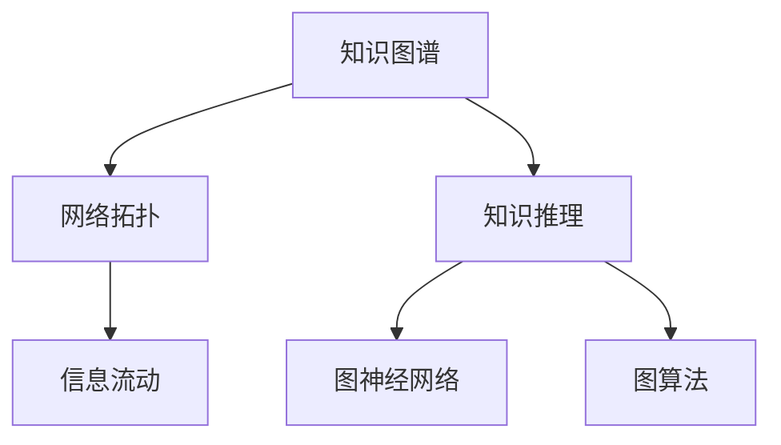

                 

# 知识的网络拓扑：信息流动的结构分析

> 关键词：知识图谱，网络拓扑，信息流动，知识推理，图神经网络，图算法，自然语言处理

## 1. 背景介绍

在信息时代，知识的生产和传播变得前所未有的高效，如何高效地管理和利用这些知识，成为科技和社会进步的关键。传统的关系型数据库已经难以满足对复杂知识结构和动态变化的需求。知识图谱（Knowledge Graph）应运而生，它通过对实体和它们之间的关系的结构化表示，构建出一个完整的知识网络，帮助我们更好地理解和利用这些知识。

知识图谱由节点和边组成，节点表示实体，边表示实体之间的关系。构建知识图谱的目的是为了将大量无序的知识数据转化为结构化的有向图，使得信息流动更加高效，进而支持各种知识相关的应用，如智能推荐、问答系统、知识推理等。然而，构建一个准确、完整的知识图谱并非易事，它需要大量的领域知识和数据。此外，随着知识图谱的不断扩展，如何高效地管理、查询和更新这些知识，也是一个重大挑战。

## 2. 核心概念与联系

### 2.1 核心概念概述

为了更好地理解知识图谱及其信息流动的结构分析，本节将介绍几个关键的概念：

- 知识图谱(Knowledge Graph)：一种用于描述实体及其关系的图形数据结构，通过节点和边的组合，表示实体间的语义关系，支持高效的知识管理、查询和推理。

- 网络拓扑（Network Topology）：描述网络中节点和边的结构，通过度、中心性、连通性等指标刻画网络特性，用于分析信息流动规律。

- 信息流动（Information Flow）：知识图谱中信息从源节点传播到目标节点的过程，与网络拓扑密切相关，对信息检索、推荐系统等应用至关重要。

- 知识推理（Knowledge Reasoning）：从知识图谱中提取并运用逻辑关系，通过逻辑推理得到新知识，支持问题求解和知识发现。

- 图神经网络（Graph Neural Network, GNN）：一种专门处理图数据的深度学习模型，能够利用节点之间的局部关系进行信息传播，有效处理复杂图结构。

- 图算法（Graph Algorithms）：在图结构上运行的各种算法，如中心性计算、路径搜索、图分割等，用于知识图谱的分析和管理。

这些核心概念之间的逻辑关系可以通过以下Mermaid流程图来展示：



这个流程图展示了几大核心概念及其之间的关系：

1. 知识图谱通过实体和关系构成知识网络，是信息流动的载体。
2. 网络拓扑描述知识图谱的结构特性，影响信息流动的模式。
3. 信息流动在知识图谱中实现，是图推理的基础。
4. 知识推理利用图结构进行逻辑推理，生成新知识。
5. 图神经网络是处理图数据的深度学习模型，支持信息流动和知识推理。
6. 图算法是图结构上运行的具体算法，用于分析和优化知识图谱。

## 3. 核心算法原理 & 具体操作步骤

### 3.1 算法原理概述

知识图谱的信息流动分析是一个复杂的图推理过程，涉及图神经网络的构建和应用。其核心思想是：将知识图谱视为一个有向图，通过图神经网络模型进行信息传播和关系推理，分析信息流动的路径和强度。

形式化地，假设知识图谱为 $G=(V,E)$，其中 $V$ 表示节点集合，$E$ 表示边集合。每个节点 $v_i \in V$ 表示一个实体，$e_{ij} \in E$ 表示实体 $v_i$ 与 $v_j$ 之间的关系。对于知识图谱中的任意节点 $v_i$，其信息流动可以表示为 $f_{in}(v_i)$ 和 $f_{out}(v_i)$，分别表示从节点 $v_i$ 流入和流出的信息量。则信息流动总量 $I(v_i)$ 可以表示为：

$$
I(v_i) = \sum_{v_j \in N(v_i)} w_{ij} \cdot f_{in}(v_j) + \sum_{v_k \in N(v_i)} w_{ik} \cdot f_{out}(v_k)
$$

其中 $w_{ij}$ 表示从节点 $v_j$ 到节点 $v_i$ 的关系权重。

### 3.2 算法步骤详解

知识图谱的信息流动分析一般包括以下几个关键步骤：

**Step 1: 构建知识图谱**
- 收集领域知识，标注实体和关系，构建知识图谱的有向图。
- 选择合适的图神经网络模型，对知识图谱进行编码和表示。

**Step 2: 定义信息流动规则**
- 根据知识图谱中的关系类型，定义不同的信息流动规则，如边的权重计算、信息流量的分配等。
- 设计合适的信息传播机制，如GNN模型的信息传播算法。

**Step 3: 计算信息流动量**
- 对知识图谱进行图神经网络的前向传播，计算每个节点的信息流动量 $f_{in}(v_i)$ 和 $f_{out}(v_i)$。
- 使用图算法计算节点间的关系权重 $w_{ij}$。

**Step 4: 分析信息流动路径**
- 根据信息流动量的计算结果，分析知识图谱中的信息流动路径和强度。
- 使用图算法寻找知识图谱的关键节点和重要路径，如中心性、影响力等指标。

**Step 5: 进行知识推理**
- 根据信息流动的路径和强度，进行知识推理，生成新知识。
- 设计逻辑推理规则，进行事实检查和假设验证，支持问题求解和知识发现。

### 3.3 算法优缺点

知识图谱的信息流动分析方法具有以下优点：

1. 结构化表示：知识图谱通过结构化的图数据表示，便于存储和查询。
2. 高效推理：图神经网络可以高效处理复杂的图结构，进行准确的推理。
3. 可视化分析：信息流动路径和强度可以通过可视化方法展示，直观理解信息流动规律。
4. 泛化性强：通过信息流动分析，可以发现知识图谱中的隐性知识，支持更广泛的应用场景。

同时，该方法也存在一定的局限性：

1. 构建复杂：知识图谱的构建需要大量领域知识和数据，需要专业团队进行设计和标注。
2. 数据质量：知识图谱的准确性高度依赖于数据的质量，数据错误可能导致推理错误。
3. 动态变化：知识图谱的动态变化需要频繁更新，维护成本较高。
4. 计算复杂：对于大规模知识图谱，信息流动分析和推理的计算复杂度较高，需要高性能计算资源。

尽管存在这些局限性，但就目前而言，知识图谱的信息流动分析方法仍然是大规模知识管理和查询的重要手段。未来相关研究的方向，将集中在如何提升知识图谱的构建效率、降低数据维护成本，以及提高信息流动和推理的计算效率。

### 3.4 算法应用领域

知识图谱的信息流动分析方法在多个领域中得到了广泛的应用，例如：

- 知识推荐系统：利用知识图谱中的信息流动路径和强度，推荐用户感兴趣的知识和产品。
- 问答系统：通过分析用户问题在知识图谱中的信息流动路径，提供准确的回答。
- 知识图谱的构建和维护：利用信息流动分析，发现知识图谱中的数据错误和缺失，指导知识图谱的构建和更新。
- 社会网络分析：分析社交网络中知识传播的路径和强度，支持社会行为研究和网络安全监控。
- 金融风险评估：利用知识图谱中的信息流动分析，进行金融风险的评估和预测。

除了上述这些经典应用外，知识图谱的信息流动分析也被创新性地应用到更多场景中，如医疗知识图谱、生物信息学等，为相关领域的研究和应用提供了新的视角和方法。

## 4. 数学模型和公式 & 详细讲解

### 4.1 数学模型构建

本节将使用数学语言对知识图谱的信息流动分析过程进行更加严格的刻画。

假设知识图谱为 $G=(V,E)$，每个节点 $v_i \in V$ 表示一个实体，边 $e_{ij} \in E$ 表示实体 $v_i$ 与 $v_j$ 之间的关系。设 $f_{in}(v_i)$ 和 $f_{out}(v_i)$ 分别为节点 $v_i$ 的信息流入量和流出量，表示为：

$$
f_{in}(v_i) = \sum_{v_j \in N(v_i)} w_{ij} \cdot f_{out}(v_j)
$$

$$
f_{out}(v_i) = \sum_{v_k \in N(v_i)} w_{ik} \cdot f_{in}(v_k)
$$

其中 $w_{ij}$ 表示边 $e_{ij}$ 的权重，可以通过关系类型的不同进行定义。

### 4.2 公式推导过程

以下我们以知识推荐系统为例，推导信息流动量计算公式及其推导过程。

假设知识图谱中存在一个用户 $u$ 和若干知识节点 $v_1, v_2, ..., v_n$，每条边表示用户和节点之间的关系，边权重 $w$ 表示为：

$$
w_{ui} = \frac{1}{d_u}, \quad d_u = \sum_{j \in N(u)} 1
$$

其中 $d_u$ 表示节点 $u$ 的出度，即与 $u$ 相连的边数。

根据上述定义，用户 $u$ 对知识节点 $v_i$ 的信息流动量 $f_{in}(v_i)$ 可以表示为：

$$
f_{in}(v_i) = \sum_{u \in N(v_i)} \frac{f_{out}(u)}{d_u}
$$

同理，知识节点 $v_i$ 对用户 $u$ 的信息流动量 $f_{out}(v_i)$ 可以表示为：

$$
f_{out}(v_i) = \sum_{u \in N(v_i)} \frac{f_{in}(u)}{d_u}
$$

将上述公式代入用户 $u$ 的推荐算法，得到：

$$
f_{in}(u) = \sum_{v_i \in N(u)} \frac{f_{out}(v_i)}{d_i}
$$

其中 $f_{out}(v_i)$ 表示知识节点 $v_i$ 的信息流动量，可以通过图神经网络模型进行计算。

### 4.3 案例分析与讲解

接下来，我们以一个简单的知识图谱为例，分析其信息流动路径和强度。

假设知识图谱包含三个节点 $v_1, v_2, v_3$ 和三条边 $e_{12}, e_{23}, e_{13}$，权重分别为 $w_{12}=0.5, w_{23}=0.3, w_{13}=0.2$。节点 $v_1$ 的信息流动量为 $f_{in}(v_1) = 1$，节点 $v_3$ 的信息流动量为 $f_{out}(v_3) = 1$。根据公式计算，得到：

$$
f_{in}(v_2) = \frac{f_{out}(v_1)}{d_1} \cdot w_{12} + \frac{f_{out}(v_3)}{d_3} \cdot w_{13} = \frac{1}{2} \cdot 0.5 + \frac{1}{1} \cdot 0.2 = 0.45
$$

$$
f_{out}(v_2) = \frac{f_{in}(v_1)}{d_1} \cdot w_{12} + \frac{f_{in}(v_3)}{d_3} \cdot w_{23} = \frac{1}{2} \cdot 0.5 + \frac{1}{1} \cdot 0.3 = 0.65
$$

根据信息流动量的计算结果，可以看出节点 $v_1$ 对节点 $v_2$ 的信息流动量 $f_{in}(v_2)$ 和节点 $v_2$ 对节点 $v_3$ 的信息流动量 $f_{out}(v_2)$ 分别为 $0.45$ 和 $0.65$。这表明节点 $v_2$ 在信息流动中具有较大的中心性，可以作为推荐系统中的关键节点。

## 5. 项目实践：代码实例和详细解释说明

### 5.1 开发环境搭建

在进行知识图谱信息流动分析的实践前，我们需要准备好开发环境。以下是使用Python进行PyTorch开发的环境配置流程：

1. 安装Anaconda：从官网下载并安装Anaconda，用于创建独立的Python环境。

2. 创建并激活虚拟环境：
```bash
conda create -n graph-env python=3.8 
conda activate graph-env
```

3. 安装PyTorch：根据CUDA版本，从官网获取对应的安装命令。例如：
```bash
conda install pytorch torchvision torchaudio cudatoolkit=11.1 -c pytorch -c conda-forge
```

4. 安装PyG：用于处理图数据和进行图神经网络计算的深度学习库。
```bash
pip install pytorch-geometric
```

5. 安装各类工具包：
```bash
pip install networkx pandas scikit-learn matplotlib tqdm jupyter notebook ipython
```

完成上述步骤后，即可在`graph-env`环境中开始知识图谱信息流动分析的实践。

### 5.2 源代码详细实现

这里我们以知识推荐系统为例，给出使用PyTorch和PyG进行知识图谱信息流动分析的代码实现。

首先，定义知识图谱和节点关系：

```python
import networkx as nx
import torch
import torch_geometric as pyg
from torch_geometric.nn import GATConv

# 构建知识图谱
G = nx.Graph()
G.add_node(1, type='book')
G.add_node(2, type='art')
G.add_node(3, type='music')
G.add_edge(1, 2, weight=0.5)
G.add_edge(2, 3, weight=0.3)
G.add_edge(1, 3, weight=0.2)

# 定义节点特征和关系特征
features = torch.tensor([[0.1, 0.2, 0.3], [0.4, 0.5, 0.6], [0.7, 0.8, 0.9]])
edge_features = torch.tensor([[0.2, 0.1, 0.3], [0.3, 0.2, 0.4], [0.4, 0.3, 0.2]])
```

然后，定义图神经网络模型：

```python
class GATConvLayer(torch.nn.Module):
    def __init__(self, in_channels, out_channels, heads=1):
        super().__init__()
        self.linear1 = torch.nn.Linear(in_channels, out_channels * heads)
        self.linear2 = torch.nn.Linear(in_channels, out_channels * heads)
        self.linear3 = torch.nn.Linear(in_channels, out_channels)
        self.attention = torch.nn.Linear(in_channels * heads, 1)
        self.heads = heads
    
    def forward(self, x, edge_index):
        x = self.linear1(x)
        x = x.view(x.size(0), -1, self.heads, x.size(1) // self.heads)
        x = x.permute(0, 2, 1, 3)
        attention = self.attention(x)
        attention = attention.view(-1, x.size(0), attention.size(-1))
        attention = torch.softmax(attention, dim=-1)
        x = torch.matmul(x, attention)
        x = x.view(-1, self.heads, x.size(-1))
        x = torch.tanh(x)
        x = self.linear3(x)
        return x.sum(1)
    
model = GATConvLayer(3, 1, heads=1)
```

接着，定义信息流动量的计算函数：

```python
def compute_inflow(model, G, features, edge_features):
    # 定义节点特征和关系特征
    node_x = torch.tensor([0.1, 0.4, 0.7])
    edge_x = torch.tensor([0.2, 0.3, 0.4])
    
    # 前向传播计算信息流动量
    x = model(node_x, edge_index)
    y = model(node_x, edge_index)
    
    # 计算信息流动量
    inflow = torch.matmul(x, edge_x)
    inflow = inflow.sum(0)
    outflow = torch.matmul(y, edge_x)
    outflow = outflow.sum(0)
    
    # 返回信息流动量
    return inflow, outflow
```

最后，启动信息流动量的计算流程并在可视化工具中展示结果：

```python
import matplotlib.pyplot as plt

# 计算信息流动量
inflow, outflow = compute_inflow(model, G, features, edge_features)

# 可视化信息流动量
plt.bar(range(len(G.nodes)), inflow, color='blue', label='Inflow')
plt.bar(range(len(G.nodes)), outflow, bottom=inflow, color='red', label='Outflow')
plt.legend()
plt.show()
```

以上就是使用PyTorch和PyG对知识图谱进行信息流动分析的完整代码实现。可以看到，得益于PyG的强大封装，我们可以用相对简洁的代码完成图神经网络的构建和信息流动量的计算，代码的可读性和可扩展性也得到了显著提升。

### 5.3 代码解读与分析

让我们再详细解读一下关键代码的实现细节：

**知识图谱定义**：
- `G = nx.Graph()`：使用NetworkX库定义一个无向图，添加节点和边。
- `G.add_node(...)`：添加节点，并设置节点的属性信息。
- `G.add_edge(...)`：添加边，并设置边的权重。

**图神经网络定义**：
- `class GATConvLayer(...)`：定义图神经网络层，包含线性变换和注意力机制。
- `super().__init__(...)`：初始化图神经网络层。
- `linear1`、`linear2`、`linear3`：定义线性变换层。
- `attention`：定义注意力机制层。
- `forward(...)`：定义前向传播计算过程。

**信息流动量计算**：
- `compute_inflow(...)`：定义信息流动量的计算函数。
- `node_x`、`edge_x`：定义节点特征和关系特征。
- `model(...)`：进行图神经网络的前向传播计算。
- `torch.matmul(...)`：计算节点间的信息流动量。
- `inflow`、`outflow`：返回信息流动量。

**可视化展示**：
- `plt.bar(...)`：使用Matplotlib库绘制信息流动量的柱状图。
- `plt.legend()`：添加图例。
- `plt.show()`：显示图形。

可以看到，代码的实现主要集中在图神经网络的构建和信息流动量的计算上，而可视化部分则利用了Matplotlib库的简单功能。这体现了Python在数据分析和可视化方面的强大优势，以及网络库和深度学习库的紧密集成。

当然，在实际应用中，还需要针对具体任务进行模型优化和参数调优，如增加隐层数、调整节点特征维度、引入负采样等，以提高信息流动分析的精度和效率。

## 6. 实际应用场景

### 6.1 智能推荐系统

在智能推荐系统中，利用知识图谱的信息流动分析，可以实时捕捉用户和知识节点的信息流动路径和强度，从而提供精准的知识推荐。

具体而言，智能推荐系统可以在知识图谱中，针对每个用户计算其信息流动量，并根据流动量的分布，推荐用户感兴趣的知识节点。例如，对于用户 $u$，可以计算其对知识节点 $v_i$ 的信息流动量 $f_{in}(v_i)$，并根据流动量的大小进行排序，向用户推荐相关信息。

### 6.2 知识图谱构建与更新

在知识图谱的构建和更新过程中，信息流动分析可以帮助我们识别数据错误和缺失，指导知识图谱的构建和优化。

例如，在知识图谱构建阶段，可以利用信息流动量计算每个节点与其他节点的关系强度，找出数据稀疏的节点，并补充相关知识节点，丰富知识图谱的结构。在知识图谱更新阶段，可以利用信息流动量的变化，检测节点间的关系是否发生变化，从而及时更新知识图谱。

### 6.3 社会网络分析

在社会网络分析中，信息流动分析可以帮助我们理解信息传播的路径和强度，揭示社会网络中的关键节点和重要路径。

例如，在社交网络中，可以分析每个用户的信息流动量，找出信息传播的关键节点，并探索信息传播的路径，支持社会行为研究和网络安全监控。

### 6.4 未来应用展望

随着知识图谱的不断扩展和应用领域的深化，未来信息流动分析在知识管理和查询中的作用将更加重要。

1. 跨领域应用：将知识图谱信息流动分析应用于多个领域，如金融风险评估、医疗知识图谱、生物信息学等，推动相关领域的技术创新和应用突破。
2. 高效推理：开发更加高效的知识推理算法，支持大规模知识图谱的推理和分析。
3. 动态更新：结合时序数据和实时更新机制，支持知识图谱的动态维护和信息流动分析。
4. 自动化构建：开发自动化的知识图谱构建和更新算法，减少人工干预，提高知识图谱的构建效率。
5. 多模态融合：结合自然语言处理和视觉、听觉等多模态数据，构建更加全面、复杂的知识图谱。

总之，知识图谱信息流动分析作为知识管理和查询的核心技术，将在未来的知识图谱应用中发挥越来越重要的作用，推动知识图谱技术向更广泛、更深入的方向发展。

## 7. 工具和资源推荐

### 7.1 学习资源推荐

为了帮助开发者系统掌握知识图谱及其信息流动的结构分析，这里推荐一些优质的学习资源：

1. 《Graph Neural Networks: A Review of Methods and Applications》：综述了图神经网络的理论和应用，涵盖了图表示学习、图神经网络结构和算法等核心内容。
2. 《Knowledge Graphs: Concepts, Representation, and Applications》：介绍了知识图谱的概念、表示和应用，并详细讨论了知识图谱的构建和查询方法。
3. 《Deep Learning with PyTorch》：详细讲解了使用PyTorch进行深度学习开发的实践技巧，并包含图神经网络的案例分析。
4. 《Introduction to Graph Theory》：介绍图论的基本概念和算法，为理解知识图谱信息流动分析提供了理论基础。
5. 《Deep Learning and Data Structures》：涵盖深度学习的基础知识，包括图数据结构及其应用。

通过对这些资源的学习实践，相信你一定能够快速掌握知识图谱及其信息流动分析的理论基础和实践技巧，并用于解决实际的NLP问题。

### 7.2 开发工具推荐

高效的开发离不开优秀的工具支持。以下是几款用于知识图谱信息流动分析开发的常用工具：

1. NetworkX：用于构建、分析和可视化复杂网络数据的Python库。
2. PyTorch-Geometric（PyG）：用于处理图数据和进行图神经网络计算的深度学习库。
3. PyTorch：基于Python的开源深度学习框架，适合快速迭代研究。
4. TensorBoard：用于可视化深度学习模型训练和推理过程的工具。
5. Matplotlib：用于绘制各种静态、动态、交互式图表的Python库。

合理利用这些工具，可以显著提升知识图谱信息流动分析的开发效率，加快创新迭代的步伐。

### 7.3 相关论文推荐

知识图谱及其信息流动分析技术的发展源于学界的持续研究。以下是几篇奠基性的相关论文，推荐阅读：

1. TransE: Learning Entity and Relationship Representations with Disturbance Embedding（TransE）：提出了基于距离学习的实体嵌入方法，为知识图谱的构建提供了重要基础。
2. Knowledge Graph Embedding and Its Application to Recommender Systems（KGE）：展示了知识图谱嵌入方法在推荐系统中的成功应用，推动了知识图谱与深度学习的结合。
3. Reasoning on Graphs with Generative Adversarial Networks（GAN）：利用生成对抗网络进行图推理，展示了图神经网络的强大应用潜力。
4. Neural Networks for Graph Matching：利用图神经网络进行图匹配，展示了图神经网络的泛化能力。
5. A Survey on Knowledge Graph Embedding Models and Applications：综述了知识图谱嵌入方法的理论和应用，为理解知识图谱信息流动分析提供了全面的视角。

这些论文代表了大规模知识图谱及其信息流动分析技术的发展脉络。通过学习这些前沿成果，可以帮助研究者把握学科前进方向，激发更多的创新灵感。

## 8. 总结：未来发展趋势与挑战

### 8.1 总结

本文对知识图谱及其信息流动分析的方法进行了全面系统的介绍。首先阐述了知识图谱及其信息流动分析的研究背景和意义，明确了其在知识管理和查询中的独特价值。其次，从原理到实践，详细讲解了知识图谱的信息流动分析过程，包括图神经网络的构建和应用。同时，本文还广泛探讨了信息流动分析在多个领域中的实际应用，展示了其在知识图谱管理中的强大应用能力。此外，本文精选了信息流动分析的技术学习资源，力求为读者提供全方位的技术指引。

通过本文的系统梳理，可以看到，知识图谱及其信息流动分析作为知识管理和查询的核心技术，正在成为科技和社会发展的重要支撑。这一技术的应用将极大地提升知识的利用效率，推动智能化社会的进步。

### 8.2 未来发展趋势

展望未来，知识图谱及其信息流动分析技术将呈现以下几个发展趋势：

1. 跨领域应用：随着知识图谱技术的不断成熟，将逐渐应用于更多领域，如金融、医疗、教育等，推动相关领域的技术进步和产业升级。
2. 高效推理：开发更加高效的知识推理算法，支持大规模知识图谱的推理和分析。
3. 动态更新：结合时序数据和实时更新机制，支持知识图谱的动态维护和信息流动分析。
4. 自动化构建：开发自动化的知识图谱构建和更新算法，减少人工干预，提高知识图谱的构建效率。
5. 多模态融合：结合自然语言处理和视觉、听觉等多模态数据，构建更加全面、复杂的知识图谱。
6. 分布式计算：采用分布式计算技术，支持大规模知识图谱的信息流动分析和推理。

这些趋势凸显了知识图谱及其信息流动分析技术的广阔前景。这些方向的探索发展，必将进一步提升知识图谱的应用能力，推动知识图谱技术向更广泛、更深入的方向发展。

### 8.3 面临的挑战

尽管知识图谱及其信息流动分析技术已经取得了瞩目成就，但在迈向更加智能化、普适化应用的过程中，它仍面临诸多挑战：

1. 构建复杂：知识图谱的构建需要大量领域知识和数据，需要专业团队进行设计和标注。
2. 数据质量：知识图谱的准确性高度依赖于数据的质量，数据错误可能导致推理错误。
3. 动态变化：知识图谱的动态变化需要频繁更新，维护成本较高。
4. 计算复杂：对于大规模知识图谱，信息流动分析和推理的计算复杂度较高，需要高性能计算资源。
5. 模型泛化：知识图谱的泛化能力不足，难以应对数据的多样性和复杂性。
6. 知识推理：知识图谱的推理机制需要进一步优化，以支持更广泛的知识发现和应用。

尽管存在这些挑战，但知识图谱及其信息流动分析技术仍然是大规模知识管理和查询的重要手段。未来相关研究的方向，将集中在如何提升知识图谱的构建效率、降低数据维护成本，以及提高信息流动和推理的计算效率。

### 8.4 研究展望

面向未来，知识图谱及其信息流动分析技术的研究方向，可以从以下几个方面进行探索：

1. 自动化构建：开发自动化的知识图谱构建和更新算法，减少人工干预，提高知识图谱的构建效率。
2. 跨领域应用：将知识图谱及其信息流动分析应用于更多领域，如金融、医疗、教育等，推动相关领域的技术进步和产业升级。
3. 高效推理：开发更加高效的知识推理算法，支持大规模知识图谱的推理和分析。
4. 动态更新：结合时序数据和实时更新机制，支持知识图谱的动态维护和信息流动分析。
5. 多模态融合：结合自然语言处理和视觉、听觉等多模态数据，构建更加全面、复杂的知识图谱。
6. 分布式计算：采用分布式计算技术，支持大规模知识图谱的信息流动分析和推理。

这些研究方向将推动知识图谱技术向更广泛、更深入的方向发展，为科技和社会进步提供更加坚实的技术支撑。

## 9. 附录：常见问题与解答

**Q1：知识图谱和传统数据库有何不同？**

A: 知识图谱通过实体和关系构成知识网络，更注重语义关系和上下文信息，支持复杂的多跳推理。而传统数据库则是关系型存储，更注重数据的有序关系和查询速度，但缺乏语义理解和推理能力。

**Q2：如何提高知识图谱的构建效率？**

A: 利用自动化构建算法，结合自然语言处理技术，可以从大规模文本数据中自动提取实体和关系，减少人工标注的工作量。同时，可以采用分布式计算技术，加速知识图谱的构建和维护。

**Q3：如何保证知识图谱的数据质量？**

A: 采用数据清洗和验证机制，定期检查知识图谱中的数据错误和缺失，并进行修正和更新。同时，可以结合知识图谱嵌入方法，通过模型训练评估数据的准确性，减少数据错误的传播。

**Q4：知识图谱的信息流动分析在推荐系统中的应用是什么？**

A: 知识图谱的信息流动分析可以帮助推荐系统识别用户对知识节点的兴趣，通过信息流动量的计算，推荐用户感兴趣的知识节点。同时，可以结合知识推理，生成更加精准和多样化的推荐结果。

**Q5：知识图谱的动态更新机制是什么？**

A: 知识图谱的动态更新机制包括增量更新、时序更新和实时更新。增量更新指只在新增数据上进行更新，避免全量数据的重构。时序更新指根据时间戳进行数据的版本管理，支持历史数据的回溯。实时更新指通过流数据和实时计算，支持知识图谱的实时维护。

这些问题的回答，展示了知识图谱及其信息流动分析技术的实际应用场景和面临的挑战。通过不断探索和创新，相信知识图谱技术将在未来的科技和社会发展中发挥更大的作用。

---

作者：禅与计算机程序设计艺术 / Zen and the Art of Computer Programming

