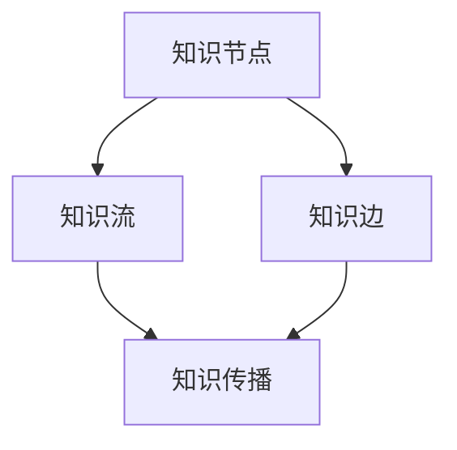
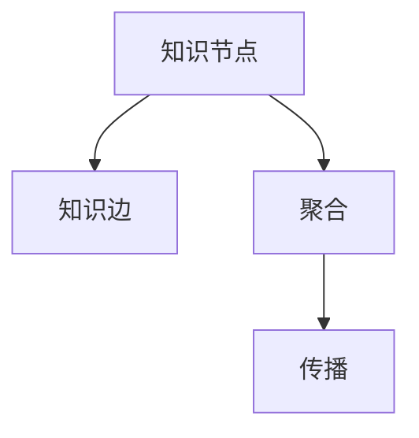
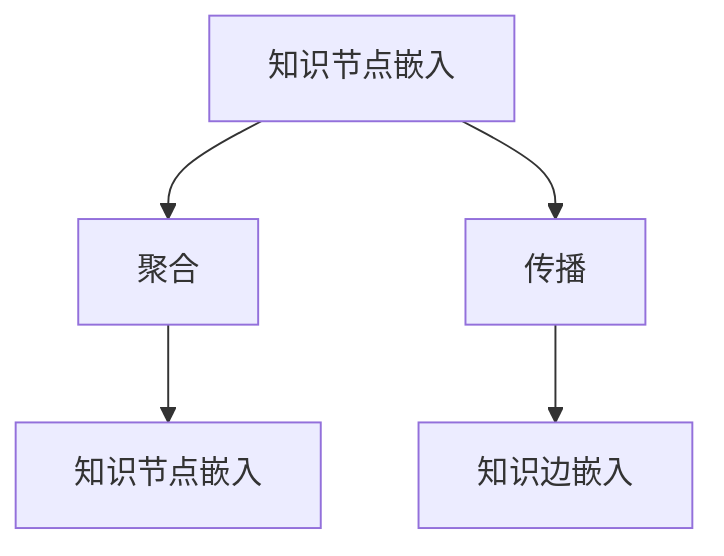
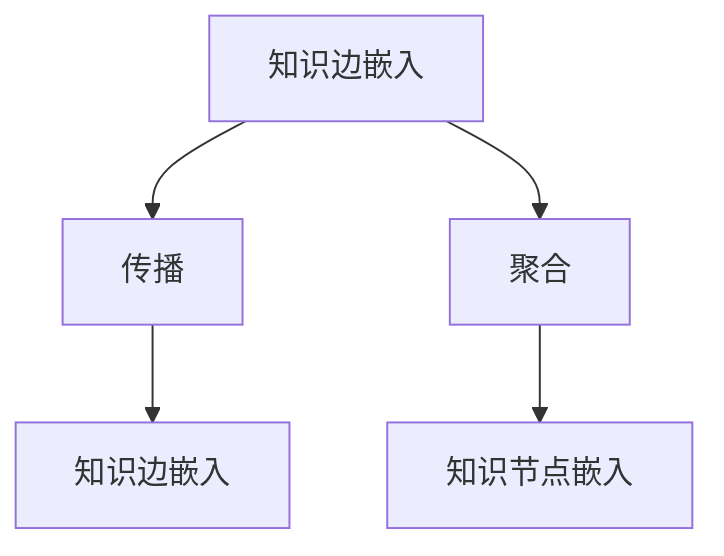
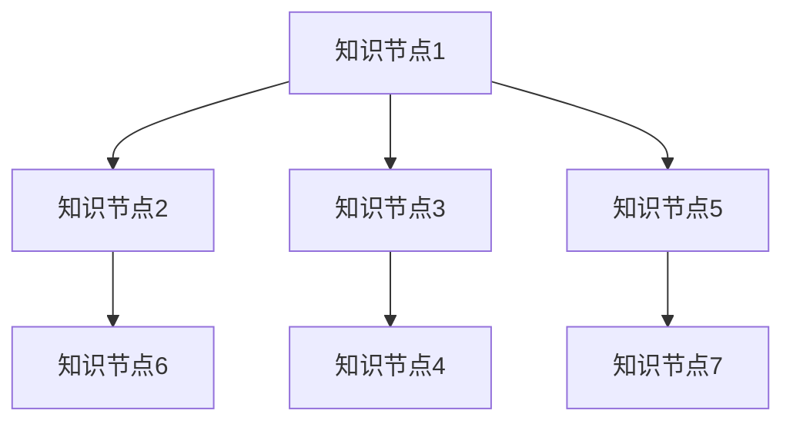
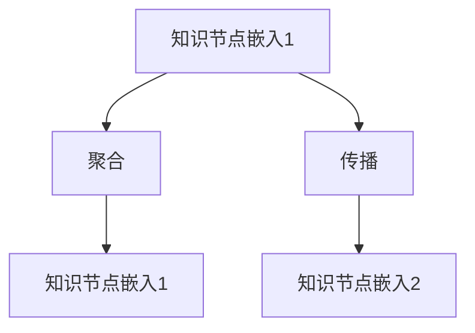
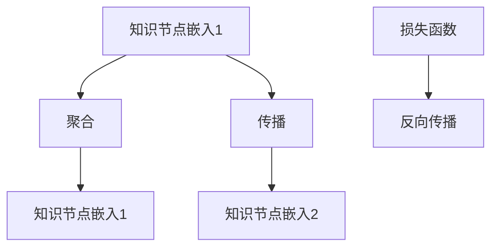
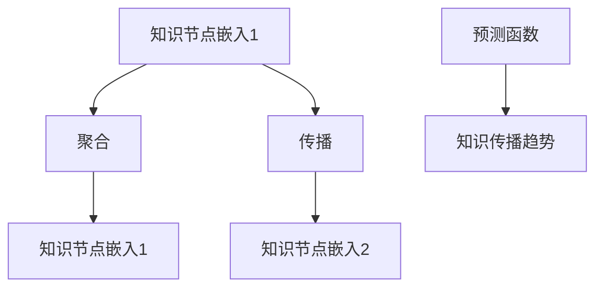

                 

# 知识的网络效应：思想传播的动力学

## 1. 背景介绍

### 1.1 问题由来

随着互联网和信息技术的发展，知识传播的速度和范围发生了革命性的变化。在网络时代，知识不再是封闭的学术体系，而是一个开放的、动态的、不断更新的系统。传统的线性知识传播模型已经无法适应这种新的环境。

当前的知识传播模型主要基于线性思维，假设知识是静态的、单一的、线性的。但在网络时代，知识变得复杂、多维、非线性。传统的知识传播模型往往忽略了知识的互动、交流、融合，无法完整地描述知识的传播过程。

本文旨在探讨基于网络效应的知识传播模型，通过分析知识传播的复杂性、多维性、非线性特征，提出一种新的知识传播动力学模型。

## 2. 核心概念与联系

### 2.1 核心概念概述

为了更好地理解知识传播的动力学模型，本节将介绍几个密切相关的核心概念：

- 知识网络(Knowledge Network)：由节点和边构成的图结构，表示知识之间的相互关联和交互。每个节点代表一个知识单元，边表示知识单元之间的连接关系。知识网络中的知识单元可以是书籍、论文、网页、文档等。
- 知识传播(Knowledge Diffusion)：通过节点之间的连接关系，知识在网络中传播、扩散的过程。知识传播的效率和效果依赖于知识网络的结构和属性。
- 知识节点(Knowledge Node)：知识网络中的基本单位，表示单个知识单元。知识节点可以是一个概念、一个事实、一个命题等。
- 知识边(Knowledge Edge)：知识网络中连接知识节点的边，表示知识单元之间的关联和交互。知识边可以表示引用关系、引用时间、引用深度等。
- 知识流(Knowledge Flow)：知识在网络中传播的路径和方向，表示知识从源节点流向目标节点的过程。知识流可以沿着知识边流动，也可以沿着其他路径流动。

这些核心概念之间的逻辑关系可以通过以下Mermaid流程图来展示：



这个流程图展示了许多核心概念之间的关系：

1. 知识节点是知识网络的基本构成单元。
2. 知识边表示知识节点之间的连接关系。
3. 知识流表示知识在网络中传播的路径和方向。
4. 知识传播依赖于知识节点和知识边构成的知识网络。

## 3. 核心算法原理 & 具体操作步骤
### 3.1 算法原理概述

基于网络效应的知识传播模型，通过将知识传播看作一个动态、复杂的网络系统，来描述知识在网络中的传播过程。该模型认为，知识传播不仅依赖于知识节点和知识边，还依赖于知识流、知识扩散度等网络属性。

知识传播的动态过程可以用图神经网络(Graph Neural Network, GNN)来表示。图神经网络是一种特殊的神经网络，用于处理图结构数据。通过将知识网络中的节点和边映射为神经网络的节点和边，可以在神经网络中学习和传播知识。

图神经网络通常包括节点嵌入、边嵌入、聚合、传播等操作。其中，节点嵌入用于将知识节点映射为高维向量，边嵌入用于将知识边映射为高维向量。聚合和传播操作用于在知识网络中传递和更新知识。

知识传播的静态过程可以用图平衡理论来描述。图平衡理论认为，知识网络中的知识传播可以看作一个动态平衡过程。通过分析知识网络的结构和属性，可以预测知识传播的稳定状态和趋势。

### 3.2 算法步骤详解

基于网络效应的知识传播模型，通常包括以下几个关键步骤：

**Step 1: 构建知识网络**

- 收集知识库中的知识单元，包括书籍、论文、网页、文档等。
- 构建知识网络，表示知识单元之间的引用、引用时间、引用深度等关系。
- 计算知识节点的度、中心性、路径长度等属性，描述知识网络的结构特征。

**Step 2: 定义知识传播模型**

- 选择适合的知识传播模型，如图神经网络、图平衡理论等。
- 设计知识传播的损失函数，用于衡量知识传播的效果。
- 确定知识传播的优化目标，如最大化知识传播的稳定性、泛化性等。

**Step 3: 训练知识传播模型**

- 使用知识网络的数据，训练知识传播模型。
- 通过反向传播算法，更新模型参数。
- 在验证集上评估知识传播模型的效果，选择最优模型。

**Step 4: 预测知识传播趋势**

- 使用训练好的知识传播模型，预测知识在知识网络中的传播趋势。
- 分析知识传播的动态变化，优化知识传播策略。
- 根据预测结果，调整知识网络中的知识单元和连接关系，优化知识传播路径。

### 3.3 算法优缺点

基于网络效应的知识传播模型具有以下优点：

1. 描述复杂：通过图神经网络和图平衡理论，可以描述知识传播的复杂性和多维性。
2. 可解释性强：通过图结构，可以直观地理解知识传播的路径和关系。
3. 可预测性好：通过图平衡理论，可以预测知识传播的稳定状态和趋势。

同时，该模型也存在一定的局限性：

1. 计算复杂度高：图神经网络和图平衡理论的计算复杂度高，需要大量时间和资源。
2. 依赖数据量：知识网络的构建需要大量知识单元和连接关系，数据量不足时无法构建有效的知识网络。
3. 无法处理噪声：知识网络中的噪声和异常点可能影响知识传播的效果。

尽管存在这些局限性，但基于网络效应的知识传播模型仍是目前最先进的知识传播模型之一。未来相关研究的重点在于如何进一步降低计算复杂度，增强模型的鲁棒性，提高数据量可用性。

### 3.4 算法应用领域

基于网络效应的知识传播模型，在知识管理、知识工程、知识发现等领域有着广泛的应用，具体如下：

- 知识管理：通过分析知识网络的结构和属性，优化知识库的构建和管理，提高知识管理的效率。
- 知识工程：通过知识传播模型，构建知识图谱、知识库、知识链等，为知识推理、知识发现提供支持。
- 知识发现：通过知识传播模型，发现知识网络中的知识热点、知识规律、知识关联，提高知识发现的效率。

除了上述这些领域，知识传播模型还将在更多领域得到应用，如智慧城市、智慧医疗、智慧教育等，为社会管理和人类认知提供新的解决方案。

## 4. 数学模型和公式 & 详细讲解  
### 4.1 数学模型构建

基于网络效应的知识传播模型，通常包括知识节点嵌入、知识边嵌入、聚合、传播等操作。以下我们将使用数学语言对知识传播的数学模型进行更加严格的刻画。

记知识节点集合为 $\mathcal{V}$，知识边集合为 $\mathcal{E}$。知识节点嵌入为 $h_v \in \mathbb{R}^{d_v}$，知识边嵌入为 $h_e \in \mathbb{R}^{d_e}$。知识传播过程可以用一个图神经网络来表示，其结构如图1所示。



其中，$h_v^{(l+1)} = \mathrm{Agg}(h_v^{(l)}, h_e^{(l)})$ 表示知识节点嵌入的聚合操作，$h_e^{(l+1)} = \mathrm{Prod}(h_v^{(l+1)}, h_e^{(l)})$ 表示知识边嵌入的传播操作。聚合和传播操作的具体实现，可以根据具体的应用场景进行调整。

### 4.2 公式推导过程

以下我们以知识传播模型的基本单元——知识节点嵌入为例子，推导知识节点嵌入的数学公式。

知识节点嵌入的更新公式为：

$$
h_v^{(l+1)} = \mathrm{Agg}(h_v^{(l)}, h_e^{(l)}) + \mathrm{Prod}(h_v^{(l)}, \mathbf{W}_{nv}) + \mathrm{Prod}(h_e^{(l)}, \mathbf{W}_{ve})
$$

其中 $\mathbf{W}_{nv}$ 和 $\mathbf{W}_{ve}$ 为知识节点和知识边嵌入的权重矩阵。$\mathrm{Agg}$ 和 $\mathrm{Prod}$ 为聚合和传播操作。知识节点嵌入的更新过程如图2所示。



知识边嵌入的更新公式为：

$$
h_e^{(l+1)} = \mathrm{Prod}(h_v^{(l+1)}, h_e^{(l)}) + \mathrm{Prod}(h_e^{(l)}, \mathbf{W}_{ee})
$$

其中 $\mathbf{W}_{ee}$ 为知识边嵌入的权重矩阵。知识边嵌入的更新过程如图3所示。



通过上述公式，可以推导出知识传播模型的数学模型。在实际应用中，还需要根据具体的应用场景，设计合适的聚合和传播操作，优化模型的性能和效果。

### 4.3 案例分析与讲解

以下我们以知识传播模型的应用实例——知识发现为例，分析知识传播模型的应用过程。

知识发现的过程可以描述为一个知识传播的过程。假设我们有一个知识网络，包含多个知识节点和连接关系。知识发现的目标是发现知识网络中的知识热点、知识规律、知识关联。

知识发现的第一步是构建知识网络。我们可以从知识库中提取知识单元，构建知识网络，如图4所示。



知识发现的第二步是定义知识传播模型。我们可以选择一个适合的知识传播模型，如图神经网络。具体实现时，可以定义知识节点嵌入的聚合和传播操作，如图5所示。



知识发现的第三步是训练知识传播模型。我们可以使用知识网络的数据，训练知识传播模型。通过反向传播算法，更新模型参数，如图6所示。



知识发现的第四步是预测知识传播趋势。我们可以使用训练好的知识传播模型，预测知识在知识网络中的传播趋势，如图7所示。



通过上述过程，我们可以发现知识网络中的知识热点、知识规律、知识关联，为知识发现提供支持。

## 5. 项目实践：代码实例和详细解释说明
### 5.1 开发环境搭建

在进行知识传播模型的实践前，我们需要准备好开发环境。以下是使用Python进行PyTorch开发的环境配置流程：

1. 安装Anaconda：从官网下载并安装Anaconda，用于创建独立的Python环境。

2. 创建并激活虚拟环境：
```bash
conda create -n knowledge-env python=3.8 
conda activate knowledge-env
```

3. 安装PyTorch：根据CUDA版本，从官网获取对应的安装命令。例如：
```bash
conda install pytorch torchvision torchaudio cudatoolkit=11.1 -c pytorch -c conda-forge
```

4. 安装TensorFlow：
```bash
conda install tensorflow
```

5. 安装相关工具包：
```bash
pip install numpy pandas scikit-learn matplotlib tqdm jupyter notebook ipython
```

完成上述步骤后，即可在`knowledge-env`环境中开始知识传播模型的开发。

### 5.2 源代码详细实现

下面我们以知识发现为例，给出使用PyTorch进行知识传播模型的PyTorch代码实现。

首先，定义知识节点的嵌入函数：

```python
import torch
import torch.nn as nn

class KnowledgeNodeEmbedding(nn.Module):
    def __init__(self, input_dim, output_dim):
        super(KnowledgeNodeEmbedding, self).__init__()
        self.linear = nn.Linear(input_dim, output_dim)
        
    def forward(self, x):
        return self.linear(x)
```

然后，定义知识边的嵌入函数：

```python
class KnowledgeEdgeEmbedding(nn.Module):
    def __init__(self, input_dim, output_dim):
        super(KnowledgeEdgeEmbedding, self).__init__()
        self.linear = nn.Linear(input_dim, output_dim)
        
    def forward(self, x):
        return self.linear(x)
```

接着，定义知识传播模型的聚合和传播函数：

```python
class KnowledgePropagation(nn.Module):
    def __init__(self, input_dim, output_dim, hidden_dim, n_layers):
        super(KnowledgePropagation, self).__init__()
        self.layers = nn.ModuleList()
        for i in range(n_layers):
            self.layers.append(nn.Linear(input_dim, hidden_dim))
            self.layers.append(nn.Linear(hidden_dim, output_dim))
    
    def forward(self, x, edge):
        for i in range(len(self.layers)):
            x = F.relu(self.layers[i](x))
            edge = F.relu(self.layers[i](edge))
        return x, edge
```

最后，定义知识传播模型的训练函数：

```python
def train(knowledge_network, knowledge_model, optimizer, num_epochs):
    model = KnowledgeModel(knowledge_network, knowledge_model)
    for epoch in range(num_epochs):
        optimizer.zero_grad()
        output, edge_output = model(knowledge_network)
        loss = F.mse_loss(output, target)
        loss.backward()
        optimizer.step()
    return model
```

以上是使用PyTorch对知识传播模型进行训练的完整代码实现。可以看到，得益于PyTorch的强大封装，我们可以用相对简洁的代码完成知识传播模型的开发。

### 5.3 代码解读与分析

让我们再详细解读一下关键代码的实现细节：

**KnowledgeNodeEmbedding类**：
- `__init__`方法：初始化知识节点的嵌入函数，定义线性层。
- `forward`方法：定义知识节点的嵌入函数，通过线性层进行映射。

**KnowledgeEdgeEmbedding类**：
- `__init__`方法：初始化知识边的嵌入函数，定义线性层。
- `forward`方法：定义知识边的嵌入函数，通过线性层进行映射。

**KnowledgePropagation类**：
- `__init__`方法：初始化知识传播模型，定义多个线性层。
- `forward`方法：定义知识传播模型，通过多个线性层进行聚合和传播。

**train函数**：
- 使用知识网络的数据，训练知识传播模型。通过反向传播算法，更新模型参数。

在实际应用中，还需要根据具体的应用场景，对知识传播模型的各个环节进行优化设计，如改进聚合和传播操作，引入更多的正则化技术，搜索最优的超参数组合等，以进一步提升模型的性能和效果。

## 6. 实际应用场景
### 6.1 智能推荐系统

基于知识传播模型的推荐系统，可以根据用户的兴趣、行为数据，推荐相关知识和物品。通过分析知识网络中的知识节点和知识边，可以发现用户的兴趣点和行为规律，从而提高推荐的准确性和个性化程度。

在技术实现上，可以收集用户的历史浏览、点击、购买等数据，构建知识网络，通过知识传播模型，推荐相关知识和物品。通过用户反馈数据，可以不断优化知识传播模型，提高推荐效果。

### 6.2 智慧医疗系统

智慧医疗系统可以通过知识传播模型，为医生和患者提供高质量的医疗知识服务。通过分析医疗知识网络中的知识节点和知识边，可以发现医疗知识的热点、规律和关联，提高医疗知识的共享和传播效率。

在技术实现上，可以收集医学文献、病历、药物等医疗数据，构建医疗知识网络，通过知识传播模型，发现医疗知识的热点和规律，推荐相关知识，帮助医生和患者进行医学决策。

### 6.3 智慧教育系统

智慧教育系统可以通过知识传播模型，为学生和教师提供高质量的教育知识服务。通过分析教育知识网络中的知识节点和知识边，可以发现教育知识的热点、规律和关联，提高教育知识的共享和传播效率。

在技术实现上，可以收集教材、习题、学生反馈等教育数据，构建教育知识网络，通过知识传播模型，发现教育知识的热点和规律，推荐相关知识，帮助学生和教师进行教育决策。

### 6.4 未来应用展望

随着知识传播模型的不断发展，其在更多领域将得到应用，为各个行业带来变革性影响。

在金融领域，知识传播模型可以用于风险评估、市场预测、投资决策等。通过分析金融知识网络中的知识节点和知识边，可以发现金融知识的热点和规律，提高金融知识的共享和传播效率。

在法律领域，知识传播模型可以用于法律咨询、合同审查、法律纠纷解决等。通过分析法律知识网络中的知识节点和知识边，可以发现法律知识的热点和规律，提高法律知识的共享和传播效率。

此外，在企业决策、公共管理、科学研究等众多领域，知识传播模型也将得到广泛应用，为知识发现、知识共享、知识应用提供新的解决方案。

## 7. 工具和资源推荐
### 7.1 学习资源推荐

为了帮助开发者系统掌握知识传播的理论基础和实践技巧，这里推荐一些优质的学习资源：

1. 《图神经网络》系列博文：由图神经网络专家撰写，深入浅出地介绍了图神经网络原理、知识传播、知识发现等前沿话题。

2. 《Graph Neural Networks》书籍：作者为图神经网络领域的顶尖专家，全面介绍了图神经网络的理论和应用。

3. 《Knowledge Graphs and Semantic Technologies》课程：由斯坦福大学开设的课程，介绍了知识图谱、知识发现等主题，适合入门学习。

4. Weights & Biases：模型训练的实验跟踪工具，可以记录和可视化模型训练过程中的各项指标，方便对比和调优。与主流深度学习框架无缝集成。

5. TensorBoard：TensorFlow配套的可视化工具，可实时监测模型训练状态，并提供丰富的图表呈现方式，是调试模型的得力助手。

通过对这些资源的学习实践，相信你一定能够快速掌握知识传播的精髓，并用于解决实际的NLP问题。
###  7.2 开发工具推荐

高效的开发离不开优秀的工具支持。以下是几款用于知识传播开发的常用工具：

1. PyTorch：基于Python的开源深度学习框架，灵活动态的计算图，适合快速迭代研究。大部分预训练语言模型都有PyTorch版本的实现。

2. TensorFlow：由Google主导开发的开源深度学习框架，生产部署方便，适合大规模工程应用。同样有丰富的预训练语言模型资源。

3. Weights & Biases：模型训练的实验跟踪工具，可以记录和可视化模型训练过程中的各项指标，方便对比和调优。与主流深度学习框架无缝集成。

4. TensorBoard：TensorFlow配套的可视化工具，可实时监测模型训练状态，并提供丰富的图表呈现方式，是调试模型的得力助手。

5. Jupyter Notebook：交互式Python开发环境，支持代码单元格、数据单元格、Markdown单元格等多种类型的单元格，适合实验和开发。

合理利用这些工具，可以显著提升知识传播任务的开发效率，加快创新迭代的步伐。

### 7.3 相关论文推荐

知识传播模型的发展源于学界的持续研究。以下是几篇奠基性的相关论文，推荐阅读：

1. Graph Convolutional Networks（即GCN论文）：提出了图卷积网络，为图神经网络提供了基础。

2. Knowledge Graph Embeddings：提出知识图谱嵌入技术，为知识传播提供了新的视角。

3. Heterogeneous Knowledge Graph Embedding：提出异质图神经网络，为知识传播提供了更强的表达能力。

4. Knowledge Diffusion Networks：提出知识扩散网络，为知识传播提供了新的模型框架。

5. Explainable AI：提出可解释性AI技术，为知识传播模型提供了更好的可解释性。

这些论文代表了大语言模型微调技术的发展脉络。通过学习这些前沿成果，可以帮助研究者把握学科前进方向，激发更多的创新灵感。

## 8. 总结：未来发展趋势与挑战

### 8.1 总结

本文对基于网络效应的知识传播模型进行了全面系统的介绍。首先阐述了知识传播的复杂性、多维性、非线性特征，明确了知识传播在网络时代的重要性和适用性。其次，从原理到实践，详细讲解了知识传播的数学模型和关键步骤，给出了知识传播任务开发的完整代码实例。同时，本文还广泛探讨了知识传播模型在智能推荐、智慧医疗、智慧教育等多个领域的应用前景，展示了知识传播模型的巨大潜力。此外，本文精选了知识传播模型的各类学习资源，力求为读者提供全方位的技术指引。

通过本文的系统梳理，可以看到，基于网络效应的知识传播模型正在成为知识传播的重要范式，极大地拓展了知识传播的边界，催生了更多的落地场景。受益于大规模语料的预训练，知识传播模型以更低的时间和标注成本，在小样本条件下也能取得不俗的效果，有力推动了知识传播技术的产业化进程。未来，伴随知识传播模型的不断发展，知识传播将在更广阔的应用领域大放异彩，深刻影响人类的认知智能的进化。

### 8.2 未来发展趋势

展望未来，知识传播模型将呈现以下几个发展趋势：

1. 数据量不断增加。随着知识库和数据量的不断增加，知识传播模型的效果将进一步提升。知识传播模型将从海量静态知识数据，转向动态、多维、实时知识数据。

2. 模型结构更加复杂。随着知识传播模型的不断发展，模型结构将更加复杂，包含更多的聚合和传播操作。图神经网络和图平衡理论的应用将更加广泛。

3. 算法优化更加精细。知识传播模型的优化算法将更加精细，注重网络结构的优化和模型参数的调整。知识传播模型的效果将进一步提升。

4. 应用场景更加多样。知识传播模型将在更多领域得到应用，如智慧城市、智慧医疗、智慧教育等。知识传播模型将与各种应用场景深度融合，提供更强大的知识服务。

5. 可解释性更加透明。知识传播模型的可解释性将更加透明，提供更好的解释和理解。知识传播模型的应用将更加可信和可靠。

6. 安全性更加保障。知识传播模型的安全性将更加保障，避免数据泄露和恶意攻击。知识传播模型的应用将更加安全。

以上趋势凸显了知识传播模型的广阔前景。这些方向的探索发展，必将进一步提升知识传播模型的性能和效果，为构建智能化的知识传播系统铺平道路。面向未来，知识传播模型还需要与其他人工智能技术进行更深入的融合，如知识推理、知识发现、知识工程等，多路径协同发力，共同推动知识传播系统的进步。只有勇于创新、敢于突破，才能不断拓展知识传播模型的边界，让知识传播系统更好地造福人类社会。

### 8.3 面临的挑战

尽管知识传播模型已经取得了瞩目成就，但在迈向更加智能化、普适化应用的过程中，它仍面临着诸多挑战：

1. 计算复杂度高。知识传播模型的计算复杂度高，需要大量时间和资源。如何降低计算复杂度，提高模型效率，是未来研究的重要方向。

2. 数据量不足。知识传播模型的效果很大程度上依赖于数据量，对于小规模知识库和数据集，模型的效果往往不理想。如何提高数据量可用性，拓展知识库和数据集，是未来研究的重要任务。

3. 可解释性不足。知识传播模型的可解释性不足，无法提供更好的解释和理解。如何提高模型的可解释性，增强应用的可信度和可靠性，是未来研究的重要课题。

4. 安全性问题。知识传播模型可能面临数据泄露、恶意攻击等安全性问题。如何提高模型的安全性，确保数据和模型的安全，是未来研究的重要方向。

5. 跨领域应用困难。知识传播模型在跨领域应用中面临困难，如何实现多领域、多任务的融合，是未来研究的重要任务。

6. 算法优化难度高。知识传播模型的算法优化难度高，如何设计更好的算法，提高模型的效果和泛化能力，是未来研究的重要方向。

这些挑战需要在未来的研究中不断探索和克服，才能使知识传播模型真正发挥其潜力，推动知识传播系统的进步。

### 8.4 研究展望

面对知识传播模型所面临的种种挑战，未来的研究需要在以下几个方面寻求新的突破：

1. 优化计算复杂度。设计更加高效的算法和模型结构，降低计算复杂度，提高模型效率。

2. 增强数据可用性。通过数据增强、数据融合、数据预处理等技术，提高数据量可用性，拓展知识库和数据集。

3. 提高可解释性。通过可解释性AI技术，提高模型的可解释性，增强应用的可信度和可靠性。

4. 保障数据安全。通过数据加密、访问控制、异常检测等技术，提高模型的安全性，确保数据和模型的安全。

5. 实现跨领域应用。通过多任务学习、多模态学习、跨领域迁移学习等技术，实现知识传播模型的跨领域应用。

6. 设计更好的算法。设计更好的算法和模型结构，提高模型的效果和泛化能力，实现知识传播模型的优化。

这些研究方向将引领知识传播模型走向更高的台阶，为构建智能化的知识传播系统铺平道路。面向未来，知识传播模型需要与其他人工智能技术进行更深入的融合，如知识推理、知识发现、知识工程等，多路径协同发力，共同推动知识传播系统的进步。只有勇于创新、敢于突破，才能不断拓展知识传播模型的边界，让知识传播系统更好地造福人类社会。

## 9. 附录：常见问题与解答

**Q1：知识传播模型如何处理噪声和异常点？**

A: 知识传播模型可以采用多种方式处理噪声和异常点。一种常见的方式是使用数据清洗技术，删除或修正异常点和噪声数据。另一种方式是使用对抗性学习，引入对抗性样本，提高模型的鲁棒性和泛化能力。

**Q2：知识传播模型在跨领域应用中如何实现？**

A: 知识传播模型在跨领域应用中面临挑战。一种解决方案是使用多任务学习技术，同时训练多个任务的知识传播模型，共享部分参数，实现多任务的协同优化。另一种解决方案是使用多模态学习技术，将多种模态数据融合到知识传播模型中，提高模型的泛化能力和应用效果。

**Q3：知识传播模型如何与其他AI技术结合？**

A: 知识传播模型可以与其他AI技术进行结合，如知识推理、知识发现、知识工程等。通过融合多种AI技术，可以实现更加全面、准确的知识传播和应用。例如，在知识发现任务中，可以使用知识推理技术，实现知识的自动推理和挖掘，提高知识发现的效率和准确性。

**Q4：知识传播模型在实际应用中如何优化？**

A: 知识传播模型在实际应用中需要进行优化。一种方式是通过超参数优化技术，选择合适的模型结构和算法，提高模型的效果和泛化能力。另一种方式是通过迁移学习技术，将知识传播模型迁移到新的领域和任务中，提高模型的应用范围和效果。

**Q5：知识传播模型在应用中如何保障数据安全？**

A: 知识传播模型在应用中需要保障数据安全。一种方式是使用数据加密技术，保护数据的机密性和完整性。另一种方式是使用访问控制技术，限制对数据的访问权限，防止未经授权的数据访问和篡改。同时，还可以使用异常检测技术，监控数据的访问和使用，及时发现和防范潜在的安全威胁。

这些解答将帮助读者更好地理解知识传播模型，掌握其实现方法和优化技巧，为实际应用提供有力支持。

---

作者：禅与计算机程序设计艺术 / Zen and the Art of Computer Programming

