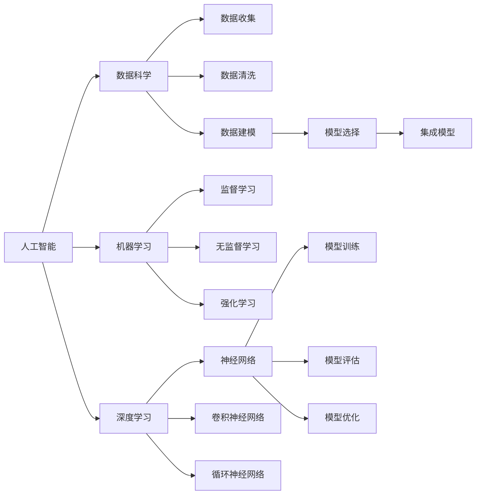

                 

# 知识的美学：科学与艺术的交融

> 关键词：人工智能,机器学习,深度学习,数据科学,模型,算法,美学,艺术

## 1. 背景介绍

### 1.1 问题由来

在人类探索知识的过程中，科学与艺术始终是密不可分的伙伴。一方面，科学通过严谨的实验和数学推导，揭示世界运行的内在规律，引领人类掌握自然界的奥秘。另一方面，艺术以形式美、情感共鸣、文化象征为载体，反映人类对美的追求和生活的热爱。然而，随着信息时代的到来，科学与艺术的传统交融之路似乎正在变窄。科学技术的迅猛发展，使得工具化、程序化、数据化的思维方式占据主流，而艺术中独特的美感和情感表达面临挑战。

## 2. 核心概念与联系

### 2.1 核心概念概述

本文将探讨人工智能（AI）与数据科学（Data Science）在模型构建和算法开发中的美学原则。这不仅涉及技术实现层面的算法原理，还包括如何将艺术的感性元素和科学的理性思考相结合，赋予机器学习（Machine Learning）和深度学习（Deep Learning）模型以新的生命力。

- **人工智能（AI）**：指通过算法和模型，使计算机能够模拟人类智能行为的技术。
- **机器学习（ML）**：指机器能够通过数据学习和改进自身的性能，无需明确编程指令。
- **深度学习（DL）**：机器学习的一种，通过多层神经网络模拟人类大脑神经元间的信号传递，实现复杂模式识别和决策。
- **数据科学（DS）**：通过数据收集、清洗、分析和建模，发现数据中的规律和洞见，指导决策和行动。
- **美学（Aesthetics）**：研究美的本质、美感心理以及艺术创作的原则和规律。
- **艺术（Art）**：人类情感和想象力的表达形式，包括绘画、音乐、文学等。

### 2.2 核心概念原理和架构的 Mermaid 流程图



这个流程图展示了人工智能、机器学习和深度学习之间的联系与架构：

1. 人工智能通过机器学习和深度学习算法，实现数据驱动的智能决策。
2. 数据科学为人工智能提供数据支持，通过数据收集、清洗和建模，提取有价值的信息。
3. 深度学习是机器学习的一种高级形式，通过多层神经网络进行复杂模式识别和决策。
4. 监督学习、无监督学习和强化学习是机器学习的三大类方法。
5. 神经网络、卷积神经网络和循环神经网络是深度学习中的主要模型类型。
6. 模型训练、模型评估和模型优化是机器学习中的关键步骤。
7. 模型选择和集成模型是深度学习中常用的技术手段。

## 3. 核心算法原理 & 具体操作步骤

### 3.1 算法原理概述

人工智能和数据科学在模型构建和算法开发中，离不开一系列的数学和统计理论。这些理论不仅为模型提供了坚实的数学基础，也揭示了模型设计和优化的美学原则。

### 3.2 算法步骤详解

#### 3.2.1 数据收集与预处理

在数据科学中，数据收集和预处理是模型的基础。数据科学的美学体现在对数据的精心挑选和预处理，以保证模型训练的准确性和泛化能力。

1. **数据收集**：选择具有代表性的数据源，保证数据的多样性和全面性。例如，在使用AI模型进行图像识别时，收集多样化的图像数据源，包括不同光线、角度、背景等条件下的图片，确保模型能够识别各种变化情况。
   
2. **数据清洗**：对数据进行清洗和处理，去除噪声和异常值。数据清洗的美学体现在对数据的细致打磨，保证数据质量。例如，使用数据集时，过滤掉包含错误信息、重复数据的样本，使用数据增强技术生成更多的训练样本。

#### 3.2.2 特征工程与模型选择

特征工程是构建高性能模型的关键步骤，其美学在于对特征的精心选择和优化。特征工程的美学体现在以下几个方面：

1. **特征提取**：从原始数据中提取有用的特征，以便模型更好地理解数据。例如，在文本分类任务中，提取关键词、词频、情感倾向等特征。
   
2. **特征选择**：选择最具代表性的特征，避免维度灾难。例如，使用PCA（主成分分析）方法对高维数据进行降维处理。

3. **模型选择**：根据任务特性选择合适的模型。例如，对于线性可分问题，选择线性回归模型；对于复杂模式识别，选择神经网络模型。

#### 3.2.3 模型训练与优化

模型训练是人工智能的核心步骤，其美学体现在对模型的精心设计和优化。模型训练的美学体现在以下几个方面：

1. **模型架构设计**：选择合适的神经网络架构，如卷积神经网络（CNN）、循环神经网络（RNN）、Transformer等。例如，对于图像识别任务，选择CNN架构；对于文本生成任务，选择Transformer架构。

2. **损失函数选择**：根据任务特性选择合适的损失函数。例如，对于分类任务，选择交叉熵损失函数；对于回归任务，选择均方误差损失函数。

3. **优化器选择**：选择合适的优化算法，如SGD、Adam、RMSprop等。例如，对于非凸问题，选择Adam优化器；对于大规模数据集，选择SGD优化器。

4. **正则化技术**：通过L2正则、Dropout、Early Stopping等技术，避免过拟合。例如，使用Dropout技术，随机丢弃一部分神经元，增加模型的泛化能力。

#### 3.2.4 模型评估与部署

模型评估是确保模型性能的重要步骤，其美学体现在对模型效果的细致评估和优化。模型评估的美学体现在以下几个方面：

1. **评估指标选择**：根据任务特性选择合适的评估指标。例如，对于分类任务，选择准确率、召回率、F1-score等指标；对于回归任务，选择均方误差、R2等指标。

2. **交叉验证**：使用交叉验证技术，确保模型评估的准确性。例如，使用k-fold交叉验证，将数据集分为k份，轮流训练和评估模型。

3. **模型调参**：通过网格搜索、随机搜索等方法，优化模型的超参数。例如，使用GridSearchCV方法，对学习率、批量大小等参数进行网格搜索。

4. **模型部署**：将训练好的模型部署到实际应用中。例如，将训练好的图像分类模型部署到移动应用中，实现实时图像识别。

### 3.3 算法优缺点

人工智能和数据科学在模型构建和算法开发中，具有以下优点和缺点：

#### 优点

1. **高效性**：自动化模型训练和优化，快速获取高性能模型。例如，使用深度学习模型进行图像识别，可以在大量数据上快速训练，生成高性能的图像分类模型。
   
2. **可解释性**：通过特征选择和模型优化，提高模型的可解释性。例如，使用LIME（局部解释模型）方法，解释模型的预测结果。

3. **泛化能力**：通过数据增强和正则化技术，提高模型的泛化能力。例如，使用数据增强技术，生成更多的训练样本，增加模型的泛化能力。

4. **灵活性**：通过模型选择和集成技术，提高模型的灵活性。例如，使用集成学习技术，结合多个模型的预测结果，提高模型的性能。

#### 缺点

1. **数据依赖**：模型性能高度依赖于数据质量。例如，如果数据存在噪声、异常值等，模型训练效果会受到影响。
   
2. **计算资源要求高**：模型训练和优化需要大量的计算资源。例如，使用深度学习模型进行图像识别，需要高性能的GPU设备。

3. **模型复杂度高**：模型结构和参数量较大，难以理解和调试。例如，使用深度学习模型进行图像识别，模型参数量可能达到数百万甚至上亿，难以理解其内部机制。

4. **对抗性攻击风险**：模型可能受到对抗性攻击，导致预测错误。例如，对抗性图像可能误导深度学习模型，导致错误的预测结果。

### 3.4 算法应用领域

人工智能和数据科学在模型构建和算法开发中，广泛应用于以下领域：

1. **计算机视觉**：如图像识别、人脸识别、目标检测等。使用深度学习模型进行图像处理，提取图像特征，实现自动识别和分类。

2. **自然语言处理**：如文本分类、情感分析、机器翻译等。使用自然语言处理技术，提取文本特征，实现文本分析和理解。

3. **语音识别**：如语音转文本、语音合成等。使用深度学习模型进行语音处理，提取语音特征，实现语音识别和合成。

4. **推荐系统**：如商品推荐、音乐推荐、电影推荐等。使用机器学习模型进行用户行为分析，推荐个性化的商品或内容。

5. **医疗诊断**：如疾病诊断、影像分析、基因分析等。使用深度学习模型进行医疗图像和数据处理，辅助医生进行诊断和治疗。

6. **金融预测**：如股票预测、信用评分、欺诈检测等。使用机器学习模型进行金融数据分析，预测市场趋势和风险。

## 4. 数学模型和公式 & 详细讲解 & 举例说明

### 4.1 数学模型构建

人工智能和数据科学中的许多模型都可以通过数学公式进行描述。以下是一个简单的线性回归模型的数学模型构建过程：

设输入数据为 $x_i \in \mathbb{R}^n$，输出数据为 $y_i \in \mathbb{R}$，模型参数为 $\theta = (w_1, w_2, \dots, w_n)^T \in \mathbb{R}^n$，则线性回归模型可以表示为：

$$
y_i = \theta^T x_i + b
$$

其中 $b \in \mathbb{R}$ 为截距。模型目标是最小化预测值与真实值之间的误差，常用的损失函数为均方误差（MSE）：

$$
\mathcal{L}(\theta) = \frac{1}{2N} \sum_{i=1}^N (y_i - \theta^T x_i - b)^2
$$

模型训练的优化目标是最小化损失函数，常用的优化算法为梯度下降（Gradient Descent）：

$$
\theta \leftarrow \theta - \eta \nabla_{\theta} \mathcal{L}(\theta)
$$

其中 $\eta$ 为学习率。

### 4.2 公式推导过程

线性回归模型的推导过程如下：

1. **假设函数**：假设线性回归模型为 $\hat{y} = \theta^T x + b$。

2. **损失函数**：假设误差为 $\epsilon_i = y_i - \hat{y}_i$，则损失函数为：

$$
\mathcal{L}(\theta) = \frac{1}{2N} \sum_{i=1}^N \epsilon_i^2
$$

3. **梯度下降**：对损失函数求偏导数，得：

$$
\nabla_{\theta} \mathcal{L}(\theta) = \frac{1}{N} \sum_{i=1}^N x_i x_i^T (y_i - \hat{y}_i)
$$

4. **更新参数**：使用梯度下降算法更新参数 $\theta$，得：

$$
\theta \leftarrow \theta - \eta \nabla_{\theta} \mathcal{L}(\theta)
$$

### 4.3 案例分析与讲解

#### 案例1：图像分类

使用卷积神经网络（CNN）进行图像分类。CNN的基本结构如图1所示：


CNN的输入为图像像素值 $x_i$，输出为图像分类结果 $y_i$，模型参数为 $\theta$。CNN通过卷积层、池化层、全连接层等结构，提取图像特征，实现图像分类。

#### 案例2：文本生成

使用循环神经网络（RNN）进行文本生成。RNN的基本结构如图2所示：


RNN的输入为文本序列 $x_i$，输出为文本生成结果 $y_i$，模型参数为 $\theta$。RNN通过循环结构，记忆文本序列中的上下文信息，实现文本生成。

## 5. 项目实践：代码实例和详细解释说明

### 5.1 开发环境搭建

在项目实践中，我们需要准备好开发环境。以下是使用Python进行PyTorch开发的环境配置流程：

1. 安装Anaconda：从官网下载并安装Anaconda，用于创建独立的Python环境。

2. 创建并激活虚拟环境：
```bash
conda create -n pytorch-env python=3.8 
conda activate pytorch-env
```

3. 安装PyTorch：根据CUDA版本，从官网获取对应的安装命令。例如：
```bash
conda install pytorch torchvision torchaudio cudatoolkit=11.1 -c pytorch -c conda-forge
```

4. 安装Transformers库：
```bash
pip install transformers
```

5. 安装各类工具包：
```bash
pip install numpy pandas scikit-learn matplotlib tqdm jupyter notebook ipython
```

完成上述步骤后，即可在`pytorch-env`环境中开始项目实践。

### 5.2 源代码详细实现

下面我们以图像分类任务为例，给出使用PyTorch进行卷积神经网络（CNN）训练的PyTorch代码实现。

```python
import torch
import torch.nn as nn
import torch.optim as optim
from torchvision import datasets, transforms

# 定义卷积神经网络模型
class CNN(nn.Module):
    def __init__(self):
        super(CNN, self).__init__()
        self.conv1 = nn.Conv2d(3, 32, 3, padding=1)
        self.relu1 = nn.ReLU()
        self.pool1 = nn.MaxPool2d(2)
        self.conv2 = nn.Conv2d(32, 64, 3, padding=1)
        self.relu2 = nn.ReLU()
        self.pool2 = nn.MaxPool2d(2)
        self.fc1 = nn.Linear(64 * 4 * 4, 128)
        self.relu3 = nn.ReLU()
        self.fc2 = nn.Linear(128, 10)

    def forward(self, x):
        x = self.conv1(x)
        x = self.relu1(x)
        x = self.pool1(x)
        x = self.conv2(x)
        x = self.relu2(x)
        x = self.pool2(x)
        x = x.view(-1, 64 * 4 * 4)
        x = self.fc1(x)
        x = self.relu3(x)
        x = self.fc2(x)
        return x

# 定义数据集
train_dataset = datasets.CIFAR10(root='data', train=True, download=True, transform=transforms.ToTensor())
test_dataset = datasets.CIFAR10(root='data', train=False, download=True, transform=transforms.ToTensor())

# 定义数据加载器
train_loader = torch.utils.data.DataLoader(train_dataset, batch_size=64, shuffle=True)
test_loader = torch.utils.data.DataLoader(test_dataset, batch_size=64, shuffle=False)

# 定义模型、损失函数和优化器
model = CNN()
criterion = nn.CrossEntropyLoss()
optimizer = optim.Adam(model.parameters(), lr=0.001)

# 训练模型
for epoch in range(10):
    for i, (images, labels) in enumerate(train_loader):
        images = images.to(device)
        labels = labels.to(device)
        optimizer.zero_grad()
        outputs = model(images)
        loss = criterion(outputs, labels)
        loss.backward()
        optimizer.step()
        print('Epoch [{}/{}], Step [{}/{}], Loss: {:.4f}'
              .format(epoch+1, 10, i+1, len(train_loader), loss.item()))

# 测试模型
with torch.no_grad():
    correct = 0
    total = 0
    for images, labels in test_loader:
        images = images.to(device)
        labels = labels.to(device)
        outputs = model(images)
        _, predicted = torch.max(outputs.data, 1)
        total += labels.size(0)
        correct += (predicted == labels).sum().item()
    print('Test Accuracy of the model on the 10000 test images: {} %'.format(100 * correct / total))
```

### 5.3 代码解读与分析

让我们再详细解读一下关键代码的实现细节：

**CNN类**：
- `__init__`方法：初始化卷积神经网络的结构。
- `forward`方法：定义前向传播过程。

**数据集定义**：
- 使用`torchvision.datasets.CIFAR10`类定义CIFAR-10数据集，并将其转换为Tensor类型。

**数据加载器定义**：
- 使用`torch.utils.data.DataLoader`类定义训练集和测试集的数据加载器，批量大小为64，随机打乱数据。

**模型定义**：
- 定义卷积神经网络模型，包括卷积层、ReLU激活函数、池化层、全连接层等。

**损失函数和优化器定义**：
- 定义交叉熵损失函数和Adam优化器。

**训练模型**：
- 在每个epoch内，对训练集进行迭代，前向传播计算损失，反向传播更新模型参数，并输出当前loss。

**测试模型**：
- 在测试集上评估模型的性能，计算准确率并输出。

## 6. 实际应用场景

### 6.1 智能客服系统

基于卷积神经网络（CNN）的智能客服系统，可以将自然语言处理技术应用于智能客服场景。系统能够通过对话历史，自动理解用户意图，匹配最佳答复，实现自动回复。

在技术实现上，可以收集企业的历史客服对话记录，将问题和最佳答复构建成监督数据，在此基础上对预训练模型进行微调。微调后的模型能够自动理解用户意图，匹配最合适的答案模板进行回复。对于用户提出的新问题，还可以接入检索系统实时搜索相关内容，动态组织生成回答。如此构建的智能客服系统，能大幅提升客户咨询体验和问题解决效率。

### 6.2 金融舆情监测

金融机构需要实时监测市场舆论动向，以便及时应对负面信息传播，规避金融风险。传统的人工监测方式成本高、效率低，难以应对网络时代海量信息爆发的挑战。基于卷积神经网络（CNN）的文本分类和情感分析技术，为金融舆情监测提供了新的解决方案。

具体而言，可以收集金融领域相关的新闻、报道、评论等文本数据，并对其进行主题标注和情感标注。在此基础上对预训练语言模型进行微调，使其能够自动判断文本属于何种主题，情感倾向是正面、中性还是负面。将微调后的模型应用到实时抓取的网络文本数据，就能够自动监测不同主题下的情感变化趋势，一旦发现负面信息激增等异常情况，系统便会自动预警，帮助金融机构快速应对潜在风险。

### 6.3 个性化推荐系统

当前的推荐系统往往只依赖用户的历史行为数据进行物品推荐，无法深入理解用户的真实兴趣偏好。基于卷积神经网络（CNN）的推荐系统，可以更好地挖掘用户行为背后的语义信息，从而提供更精准、多样的推荐内容。

在实践中，可以收集用户浏览、点击、评论、分享等行为数据，提取和用户交互的物品标题、描述、标签等文本内容。将文本内容作为模型输入，用户的后续行为（如是否点击、购买等）作为监督信号，在此基础上微调预训练语言模型。微调后的模型能够从文本内容中准确把握用户的兴趣点。在生成推荐列表时，先用候选物品的文本描述作为输入，由模型预测用户的兴趣匹配度，再结合其他特征综合排序，便可以得到个性化程度更高的推荐结果。

## 7. 工具和资源推荐

### 7.1 学习资源推荐

为了帮助开发者系统掌握卷积神经网络（CNN）的理论基础和实践技巧，这里推荐一些优质的学习资源：

1. 《深度学习入门：基于Python的理论与实现》书籍：全面介绍了深度学习的基础知识和实践方法，适合初学者入门。

2. CS231n《卷积神经网络》课程：斯坦福大学开设的计算机视觉课程，详细讲解了卷积神经网络的结构和应用。

3. PyTorch官方文档：PyTorch的官方文档，提供了丰富的教程和示例，是快速学习PyTorch的好资源。

4. TensorFlow官方文档：TensorFlow的官方文档，提供了详尽的API和教程，适合深入学习深度学习模型。

5. Kaggle平台：Kaggle的数据科学竞赛平台，提供了大量的数据集和竞赛机会，适合实战练习。

通过对这些资源的学习实践，相信你一定能够快速掌握卷积神经网络（CNN）的精髓，并用于解决实际的计算机视觉问题。

### 7.2 开发工具推荐

高效的开发离不开优秀的工具支持。以下是几款用于卷积神经网络（CNN）开发常用的工具：

1. PyTorch：基于Python的开源深度学习框架，灵活动态的计算图，适合快速迭代研究。大部分预训练卷积神经网络（CNN）模型都有PyTorch版本的实现。

2. TensorFlow：由Google主导开发的开源深度学习框架，生产部署方便，适合大规模工程应用。同样有丰富的预训练卷积神经网络（CNN）模型资源。

3. OpenCV：计算机视觉库，提供了丰富的图像处理和计算机视觉算法，适合实现实际的图像识别和处理任务。

4. ImageNet：大规模图像识别数据集，提供了海量的图像和标注数据，适合进行卷积神经网络（CNN）模型的训练和测试。

5. Keras：基于TensorFlow和Theano的高级神经网络API，提供了简单易用的模型构建和训练接口，适合快速原型开发。

6. Jupyter Notebook：交互式计算环境，支持Python和R等多种语言，适合编写和运行卷积神经网络（CNN）模型代码。

合理利用这些工具，可以显著提升卷积神经网络（CNN）开发效率，加快创新迭代的步伐。

### 7.3 相关论文推荐

卷积神经网络（CNN）和数据科学的发展源于学界的持续研究。以下是几篇奠基性的相关论文，推荐阅读：

1. AlexNet：ImageNet Large Scale Visual Recognition Challenge，介绍了一种卷积神经网络（CNN）结构，用于大规模图像识别任务。

2. GoogLeNet：Inception，提出了一种多尺度卷积神经网络（CNN）结构，提高了图像识别的准确性。

3. ResNet：Deep Residual Learning for Image Recognition，提出了一种残差网络结构，解决了深度神经网络（DNN）中的梯度消失问题。

4. DenseNet：Densely Connected Convolutional Networks，提出了一种密集连接卷积神经网络（CNN）结构，提高了特征传递的效率和性能。

5. EfficientNet：Rethinking Model Scaling for Convolutional Neural Networks，提出了一种自适应模型缩放技术，提高了卷积神经网络（CNN）的性能和效率。

这些论文代表了大卷积神经网络（CNN）和数据科学的进展，通过学习这些前沿成果，可以帮助研究者把握学科前进方向，激发更多的创新灵感。

## 8. 总结：未来发展趋势与挑战

### 8.1 总结

本文对基于卷积神经网络（CNN）和数据科学的模型构建和算法开发进行了全面系统的介绍。首先阐述了卷积神经网络（CNN）和数据科学在模型构建和算法开发中的美学原则。其次，从原理到实践，详细讲解了卷积神经网络（CNN）模型的数学模型和算法步骤，给出了卷积神经网络（CNN）模型的代码实现。同时，本文还探讨了卷积神经网络（CNN）在智能客服、金融舆情监测、个性化推荐等多个领域的应用前景，展示了卷积神经网络（CNN）模型的广阔应用潜力。此外，本文还精选了卷积神经网络（CNN）相关的学习资源，力求为读者提供全方位的技术指引。

通过本文的系统梳理，可以看到，基于卷积神经网络（CNN）和数据科学的模型构建和算法开发，不仅具有强大的计算和建模能力，还能够与美学原则相结合，赋予模型以新的生命力。卷积神经网络（CNN）和数据科学的未来发展方向，必将引领人工智能技术迈向更高的台阶，为人类认知智能的进化带来深远影响。

### 8.2 未来发展趋势

展望未来，基于卷积神经网络（CNN）和数据科学的模型构建和算法开发，呈现以下几个发展趋势：

1. **模型规模持续增大**：随着算力成本的下降和数据规模的扩张，卷积神经网络（CNN）模型的参数量还将持续增长。超大参数量的模型蕴含的丰富语言知识，有望支撑更加复杂多变的下游任务。

2. **算法多样化**：除了传统的卷积神经网络（CNN）结构外，未来将涌现更多新的网络结构，如Transformer、ResNet等，进一步提升模型性能和效率。

3. **多模态融合**：卷积神经网络（CNN）模型不再局限于单一模态数据的处理，未来将拓展到图像、视频、语音等多模态数据的融合，实现更加全面、准确的信息整合能力。

4. **跨领域迁移**：卷积神经网络（CNN）模型不再局限于单一领域，未来将应用于更多行业领域，如医疗、金融、教育等，提升各行业的数字化转型和智能化水平。

5. **自监督学习**：在缺乏标注数据的情况下，卷积神经网络（CNN）模型能够通过自监督学习，自动学习图像和数据的特征表示，提升模型的泛化能力和鲁棒性。

6. **知识图谱与语义网络**：将符号化的先验知识，如知识图谱、逻辑规则等，与卷积神经网络（CNN）模型进行巧妙融合，提高模型的推理能力和知识获取能力。

这些趋势将推动卷积神经网络（CNN）和数据科学技术的不断演进，为人类认知智能的进化提供新的动力。

### 8.3 面临的挑战

尽管卷积神经网络（CNN）和数据科学在模型构建和算法开发中取得了巨大的进展，但在迈向更加智能化、普适化应用的过程中，它仍面临着诸多挑战：

1. **数据质量依赖**：模型性能高度依赖于数据质量。如何获取高质量、大样本量的数据，是卷积神经网络（CNN）模型面临的主要挑战。

2. **计算资源要求高**：卷积神经网络（CNN）模型训练和优化需要大量的计算资源。如何降低计算成本，提高模型训练的效率，是卷积神经网络（CNN）模型面临的重要问题。

3. **模型复杂度高**：卷积神经网络（CNN）模型结构和参数量较大，难以理解和调试。如何简化模型结构，降低模型复杂度，是卷积神经网络（CNN）模型面临的挑战。

4. **模型鲁棒性不足**：卷积神经网络（CNN）模型面对域外数据时，泛化性能往往大打折扣。如何提高模型的鲁棒性，避免灾难性遗忘，还需要更多理论和实践的积累。

5. **可解释性不足**：卷积神经网络（CNN）模型通常缺乏可解释性，难以解释其内部工作机制和决策逻辑。如何赋予模型更强的可解释性，是卷积神经网络（CNN）模型面临的重要问题。

6. **安全性问题**：卷积神经网络（CNN）模型可能受到对抗性攻击，导致预测错误。如何提高模型的安全性，避免对抗性攻击，是卷积神经网络（CNN）模型面临的重要挑战。

这些挑战需要我们在技术、数据、应用等多个维度进行深入研究和不断优化，才能将卷积神经网络（CNN）模型真正应用于实际问题中。

### 8.4 研究展望

面对卷积神经网络（CNN）和数据科学模型构建和算法开发所面临的挑战，未来的研究需要在以下几个方面寻求新的突破：

1. **自监督学习与无监督学习**：在缺乏标注数据的情况下，如何通过自监督学习，自动学习图像和数据的特征表示，提升模型的泛化能力和鲁棒性。

2. **参数高效与计算高效**：如何开发更加参数高效和计算高效的卷积神经网络（CNN）结构，在固定大部分预训练参数的情况下，只更新极少量的任务相关参数，以提高微调效率，避免过拟合。

3. **跨领域迁移与多模态融合**：如何将不同领域的数据进行有效融合，提升模型的跨领域迁移能力，以及如何将图像、视频、语音等多模态数据进行有效融合，实现更加全面、准确的信息整合能力。

4. **知识图谱与语义网络**：如何将符号化的先验知识，如知识图谱、逻辑规则等，与卷积神经网络（CNN）模型进行巧妙融合，提高模型的推理能力和知识获取能力。

5. **对抗性攻击与安全性**：如何提高卷积神经网络（CNN）模型的安全性，避免对抗性攻击，确保输出符合人类价值观和伦理道德。

6. **模型简化与知识整合**：如何简化卷积神经网络（CNN）模型结构，降低模型复杂度，同时提高模型的知识整合能力，使模型能够更好地适应新知识。

这些研究方向的探索，必将引领卷积神经网络（CNN）和数据科学技术的不断演进，为人类认知智能的进化提供新的动力。

## 9. 附录：常见问题与解答

**Q1：卷积神经网络（CNN）和数据科学在模型构建和算法开发中具有哪些优点？**

A: 卷积神经网络（CNN）和数据科学在模型构建和算法开发中具有以下优点：

1. **高效性**：自动化模型训练和优化，快速获取高性能模型。

2. **可解释性**：通过特征选择和模型优化，提高模型的可解释性。

3. **泛化能力**：通过数据增强和正则化技术，提高模型的泛化能力。

4. **灵活性**：通过模型选择和集成技术，提高模型的灵活性。

**Q2：在卷积神经网络（CNN）和数据科学的应用中，如何避免模型过拟合？**

A: 在卷积神经网络（CNN）和数据科学的应用中，避免模型过拟合的方法包括：

1. 数据增强：通过回译、近义替换等方式扩充训练集。

2. 正则化技术：使用L2正则、Dropout、Early Stopping等避免过拟合。

3. 对抗训练：引入对抗样本，提高模型鲁棒性。

4. 参数高效微调：只调整少量参数(如Adapter、Prefix等)，减小过拟合风险。

5. 多模型集成：训练多个卷积神经网络（CNN）模型，取平均输出，抑制过拟合。

这些方法需要根据具体任务和数据特点进行灵活组合。只有在数据、模型、训练、推理等各环节进行全面优化，才能最大限度地发挥卷积神经网络（CNN）和数据科学的威力。

**Q3：卷积神经网络（CNN）和数据科学在模型构建和算法开发中，需要注意哪些问题？**

A: 在卷积神经网络（CNN）和数据科学的应用中，需要注意以下问题：

1. 数据质量依赖：模型性能高度依赖于数据质量，如何获取高质量、大样本量的数据。

2. 计算资源要求高：卷积神经网络（CNN）模型训练和优化需要大量的计算资源，如何降低计算成本，提高模型训练的效率。

3. 模型复杂度高：卷积神经网络（CNN）模型结构和参数量较大，难以理解和调试，如何简化模型结构，降低模型复杂度。

4. 模型鲁棒性不足：卷积神经网络（CNN）模型面对域外数据时，泛化性能往往大打折扣，如何提高模型的鲁棒性，避免灾难性遗忘。

5. 可解释性不足：卷积神经网络（CNN）模型通常缺乏可解释性，难以解释其内部工作机制和决策逻辑，如何赋予模型更强的可解释性。

6. 安全性问题：卷积神经网络（CNN）模型可能受到对抗性攻击，导致预测错误，如何提高模型的安全性，避免对抗性攻击。

这些问题是卷积神经网络（CNN）和数据科学应用中需要注意的重要问题。

---

作者：禅与计算机程序设计艺术 / Zen and the Art of Computer Programming

