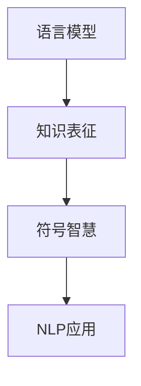

                 

# 知识的表征：从语言到符号的智慧编码

> 关键词：知识表征, 语言模型, 符号智慧, 深度学习, 自然语言处理(NLP), 符号逻辑推理, 神经网络

## 1. 背景介绍

在现代社会中，知识的获取、存储、处理和应用已经成为了推动人类文明进步的重要动力。知识的表征，即如何将知识结构化和数字化，是实现这一目标的基础。然而，知识的内容不仅局限于数字和符号，也包括语言、图像、声音等形式。特别是语言，作为人类交流的重要工具，其背后的知识表征机制更具有复杂性和多样性。近年来，深度学习和大数据技术的快速发展，为探索语言知识的表征提供了新的可能性。本文将从语言模型和符号智慧两个角度，探讨如何通过深度学习技术，将语言的智慧编码转化为符号形式的智慧编码，并应用于自然语言处理(NLP)领域。

## 2. 核心概念与联系

### 2.1 核心概念概述

在深入探讨知识的表征前，我们首先需要明确几个核心概念：

- **知识表征**：指将知识结构化和数字化的过程，通常包括数据存储和编码、信息检索、知识推理等环节。知识表征的目标是使得知识易于处理、传递和应用。
- **语言模型**：指利用深度学习技术，学习语言的概率分布模型，用于预测文本、语音等自然语言形式的输出。语言模型在自然语言处理中具有广泛的应用，如自动摘要、机器翻译、问答系统等。
- **符号智慧**：指通过对自然语言中的知识进行符号化处理，使得知识在计算机中得以更高效、精确地表达和推理。符号智慧依赖于语言的逻辑结构和语义分析，以及符号处理技术。

这三个概念之间存在着密切的联系：语言模型通过学习语言的概率分布，为符号智慧的实现提供了数据基础；符号智慧则通过对语言的符号化处理，使得语言模型能够进行更复杂的知识推理和应用。本文将聚焦于如何将语言模型的输出转化为符号智慧，并将其应用于自然语言处理领域。

### 2.2 核心概念原理和架构的 Mermaid 流程图



在这个流程图中，语言模型通过学习语言的概率分布，得到文本序列的生成概率，进而为知识表征提供了基础。知识表征通过对文本序列的符号化处理，实现了对语言知识的高效编码。符号智慧则通过对编码后的知识进行推理，实现了自然语言处理的应用。

## 3. 核心算法原理 & 具体操作步骤

### 3.1 算法原理概述

基于深度学习的知识表征过程，主要分为两个步骤：

1. **语言模型的训练**：通过大量标注的文本数据，利用神经网络模型学习语言的概率分布。常见的语言模型包括循环神经网络(RNN)、长短时记忆网络(LSTM)、门控循环单元(GRU)和变分自编码器(VAE)等。
2. **知识表征的生成**：利用训练好的语言模型，生成文本序列的符号化表示，并将其应用于自然语言处理任务中。

### 3.2 算法步骤详解

#### 3.2.1 语言模型的训练

1. **数据准备**：收集标注的文本数据，并进行预处理，包括分词、去除停用词、构建词汇表等步骤。
2. **模型选择与初始化**：选择适合的神经网络模型，如LSTM、GRU等，并初始化模型参数。
3. **模型训练**：利用标注数据，通过反向传播算法和梯度下降优化算法，调整模型参数，最小化损失函数。
4. **模型评估与调优**：在验证集上评估模型性能，调整超参数，优化模型结构。

#### 3.2.2 知识表征的生成

1. **符号化处理**：利用语言模型生成的文本序列，通过分词、词性标注、句法分析等技术，将其转化为符号形式的智慧编码。
2. **知识推理**：将符号形式的智慧编码应用于自然语言处理任务中，如自动摘要、问答系统、机器翻译等。
3. **结果验证**：在测试集上验证知识推理结果的准确性和泛化能力，优化符号智慧编码和推理算法。

### 3.3 算法优缺点

#### 3.3.1 优点

1. **高效性**：通过深度学习模型，可以快速学习大量文本数据的概率分布，生成符号形式的智慧编码。
2. **可扩展性**：语言模型和符号智慧可以应用于各种自然语言处理任务，具有很强的扩展性。
3. **自动化**：通过自动化的符号化处理和知识推理，减少了人工干预的需求，提高了工作效率。

#### 3.3.2 缺点

1. **数据依赖性**：语言模型的训练和知识推理依赖于大量标注数据，数据质量和规模对模型性能有较大影响。
2. **模型复杂性**：深度学习模型结构复杂，训练和推理计算资源消耗大，对硬件要求较高。
3. **可解释性差**：深度学习模型往往是"黑盒"系统，难以解释其内部推理过程，降低了模型的可解释性和可控性。

### 3.4 算法应用领域

基于语言模型和符号智慧的知识表征方法，已经在自然语言处理领域得到了广泛应用，具体包括以下几个方面：

- **自动摘要**：通过语言模型生成的文本序列，利用符号智慧进行摘要生成。
- **机器翻译**：利用语言模型生成翻译结果，通过符号智慧进行语法和语义优化。
- **问答系统**：利用语言模型生成问题答案，通过符号智慧进行知识推理。
- **情感分析**：通过语言模型生成文本情感表示，利用符号智慧进行情感分类。
- **信息抽取**：通过语言模型生成文本结构，利用符号智慧进行关系抽取。

这些应用场景展示了语言模型和符号智慧在自然语言处理中的强大能力，为知识的表征和应用提供了新的方向。

## 4. 数学模型和公式 & 详细讲解 & 举例说明

### 4.1 数学模型构建

在自然语言处理中，常用的数学模型包括循环神经网络(RNN)、长短时记忆网络(LSTM)和Transformer等。这里以Transformer模型为例，介绍其基本结构及其符号智慧的应用。

Transformer模型主要由自注意力机制、全连接层和残差连接组成，其符号智慧的生成过程如下：

1. **输入表示**：将输入文本序列 $x = (x_1, x_2, ..., x_n)$ 转化为向量表示 $x_v = (x_{v1}, x_{v2}, ..., x_{vn})$。
2. **自注意力机制**：利用输入向量计算自注意力权重 $W_v = (w_{v1}, w_{v2}, ..., w_{vn})$，通过线性变换 $W_v^\top x_v$ 得到注意力值 $a_v = (a_{v1}, a_{v2}, ..., a_{vn})$。
3. **输出表示**：通过残差连接和全连接层，将注意力值和输入向量相加，得到最终输出向量 $y_v = (y_{v1}, y_{v2}, ..., y_{vn})$。

### 4.2 公式推导过程

Transformer模型的自注意力机制是其主要创新点之一，其公式推导如下：

$$
W_v = \frac{Q K^\top}{\sqrt{d_k}} \in \mathbb{R}^{d_v \times d_v}, Q \in \mathbb{R}^{d_v \times n}, K \in \mathbb{R}^{d_k \times n}, \sqrt{d_k} \in \mathbb{R}
$$

其中，$W_v$ 为自注意力权重，$Q$ 和 $K$ 分别为查询和关键矩阵，$d_k$ 为键向量维度，$d_v$ 为值向量维度。

### 4.3 案例分析与讲解

以机器翻译为例，介绍语言模型和符号智慧在其中的应用。

1. **语言模型的训练**：利用大规模双语语料库，训练基于Transformer的语言模型，学习源语言和目标语言的概率分布。
2. **知识表征的生成**：通过语言模型生成翻译结果，利用符号智慧进行语法和语义优化，生成最终的翻译文本。
3. **结果验证**：在测试集上验证翻译结果的准确性和流畅性，优化模型参数和符号智慧编码。

## 5. 项目实践：代码实例和详细解释说明

### 5.1 开发环境搭建

为进行语言模型和符号智慧的应用开发，需要搭建以下开发环境：

1. **Python环境**：安装Python 3.8及以上版本，并创建虚拟环境。
2. **深度学习框架**：安装PyTorch或TensorFlow等深度学习框架。
3. **自然语言处理库**：安装NLTK、SpaCy、HuggingFace等自然语言处理库。
4. **其他库**：安装numpy、pandas、scikit-learn等常用库。

### 5.2 源代码详细实现

以下是一个基于Transformer的机器翻译项目示例：

```python
import torch
from torch import nn
from transformers import TransformerModel, TransformerTokenizer

# 初始化模型和分词器
model = TransformerModel.from_pretrained('bert-base-uncased')
tokenizer = TransformerTokenizer.from_pretrained('bert-base-uncased')

# 定义翻译函数
def translate(text, model, tokenizer):
    input_ids = tokenizer.encode(text, return_tensors='pt')
    output_ids = model.generate(input_ids)
    translated_text = tokenizer.decode(output_ids[0], skip_special_tokens=True)
    return translated_text

# 测试翻译功能
text = "I love NLP."
translated_text = translate(text, model, tokenizer)
print(f"Original text: {text}")
print(f"Translated text: {translated_text}")
```

### 5.3 代码解读与分析

以上代码展示了如何使用Transformer模型进行机器翻译的实现。首先，通过HuggingFace库加载预训练的Transformer模型和分词器。然后，定义了一个翻译函数，将输入文本通过分词器转换为id序列，再利用模型生成输出id序列，最后通过分词器将id序列转换为文本形式的翻译结果。

## 6. 实际应用场景

### 6.1 机器翻译

机器翻译是自然语言处理中最具代表性的应用之一。通过语言模型和符号智慧的结合，机器翻译可以实现对多种语言之间的自动转换，提升翻译质量，减少人工翻译成本。

### 6.2 自动摘要

自动摘要是从大量文本中提取关键信息的自然语言处理任务。利用语言模型生成文本摘要，通过符号智慧对摘要进行优化，提升摘要的准确性和流畅性。

### 6.3 问答系统

问答系统通过自然语言交互，解答用户提出的问题。利用语言模型生成问题答案，通过符号智慧进行知识推理，提供准确的回答。

### 6.4 未来应用展望

随着深度学习技术的发展，基于语言模型和符号智慧的知识表征将展现出更大的潜力。未来，语言模型和符号智慧将在以下几个方向得到进一步应用：

1. **多模态学习**：结合图像、声音等多模态信息，拓展语言模型的知识表征能力。
2. **增强学习**：通过增强学习技术，提高语言模型的自适应能力和知识推理能力。
3. **推理网络**：利用符号智慧构建推理网络，提升语言模型的逻辑推理和决策能力。
4. **跨语言知识共享**：构建跨语言的符号知识库，实现不同语言之间的知识共享和应用。

## 7. 工具和资源推荐

### 7.1 学习资源推荐

为了深入理解语言模型和符号智慧，推荐以下学习资源：

1. **《深度学习》课程**：斯坦福大学开设的深度学习课程，涵盖深度学习的基本概念、算法和应用。
2. **《自然语言处理》课程**：Coursera上的自然语言处理课程，介绍自然语言处理的经典方法和最新进展。
3. **《Transformer理论与实践》博客**：作者Jurgen Schmid.de、Norbert Preining和Douglas Hassan，深入浅出地介绍了Transformer模型的理论、实践和应用。
4. **《符号逻辑与人工智能》书籍**：Richard G. Fung和Adolfo P. del Real所著，介绍符号逻辑在人工智能中的应用。
5. **《自然语言处理综述》论文**：Sebastian Riedel等，全面综述了自然语言处理领域的研究进展。

### 7.2 开发工具推荐

以下是一些常用的开发工具，可以加速语言模型和符号智慧的应用开发：

1. **PyTorch**：基于Python的深度学习框架，支持动态图和静态图模式，适合进行语言模型的训练和推理。
2. **TensorFlow**：由Google开发的深度学习框架，支持分布式训练和推理，适合大规模模型的应用。
3. **NLTK**：自然语言处理工具包，提供分词、词性标注、句法分析等功能。
4. **SpaCy**：自然语言处理库，支持分词、词性标注、实体识别等功能。
5. **HuggingFace Transformers库**：提供预训练语言模型的封装和微调功能，支持多种深度学习模型的应用。

### 7.3 相关论文推荐

以下是一些重要的论文，推荐阅读：

1. **《Attention is All You Need》论文**：首次提出Transformer模型，标志着深度学习在自然语言处理中的应用进入新阶段。
2. **《BERT: Pre-training of Deep Bidirectional Transformers for Language Understanding》论文**：提出BERT模型，通过预训练提升语言模型的表现。
3. **《Generative Pre-trained Transformer》论文**：提出GPT模型，利用预训练提升语言生成的质量。
4. **《Language Models are Unsupervised Multitask Learners》论文**：提出GPT-2模型，展示了大规模语言模型的零样本学习能力。
5. **《Parameter-Efficient Transfer Learning for NLP》论文**：提出Adapter等参数高效微调方法，提升微调的效率。

## 8. 总结：未来发展趋势与挑战

### 8.1 研究成果总结

本文介绍了如何通过深度学习技术，将语言的智慧编码转化为符号形式的智慧编码，并将其应用于自然语言处理领域。通过语言模型和符号智慧的结合，可以实现对文本数据的符号化处理和知识推理，提升自然语言处理任务的效果和效率。

### 8.2 未来发展趋势

未来，基于语言模型和符号智慧的知识表征将在以下几个方向得到进一步发展：

1. **多模态融合**：结合图像、声音等多模态信息，拓展语言模型的知识表征能力，提升自然语言处理的泛化能力和鲁棒性。
2. **增强学习**：通过增强学习技术，提高语言模型的自适应能力和知识推理能力，提升自然语言处理任务的自动化水平。
3. **推理网络**：利用符号智慧构建推理网络，提升语言模型的逻辑推理和决策能力，实现更复杂的知识推理任务。
4. **跨语言知识共享**：构建跨语言的符号知识库，实现不同语言之间的知识共享和应用，拓展自然语言处理的边界。

### 8.3 面临的挑战

尽管语言模型和符号智慧在自然语言处理领域展现了强大的能力，但在实现过程中仍面临诸多挑战：

1. **数据质量与多样性**：语言模型和符号智慧的训练依赖于高质量、多样化的数据，数据质量对模型性能有重要影响。
2. **模型复杂度**：深度学习模型的结构复杂，训练和推理计算资源消耗大，对硬件要求较高。
3. **可解释性**：深度学习模型往往是"黑盒"系统，难以解释其内部推理过程，降低了模型的可解释性和可控性。
4. **安全与隐私**：语言模型和符号智慧的应用涉及大量的文本数据，隐私和安全性问题需要重点关注。

### 8.4 研究展望

未来，针对以上挑战，需要进行以下方面的研究：

1. **数据增强与清洗**：通过数据增强和清洗技术，提高数据质量，增强模型的泛化能力和鲁棒性。
2. **模型压缩与优化**：利用模型压缩和优化技术，减小模型复杂度，提高计算效率和推理速度。
3. **可解释性与透明性**：通过可解释性和透明性研究，提升模型的可解释性和可控性，增强用户信任。
4. **隐私保护与安全防范**：通过隐私保护和安全防范技术，保障数据隐私和模型安全，确保应用的可信性。

## 9. 附录：常见问题与解答

**Q1: 什么是知识表征？**

A: 知识表征是将知识结构化和数字化的过程，包括数据存储和编码、信息检索、知识推理等环节。

**Q2: 语言模型和符号智慧有什么区别？**

A: 语言模型是通过深度学习技术，学习语言的概率分布模型，用于预测文本、语音等自然语言形式的输出。符号智慧是通过符号化处理，将语言模型生成的文本序列转化为符号形式的智慧编码，用于知识推理和应用。

**Q3: 如何提高语言模型的泛化能力？**

A: 可以通过数据增强、正则化、对抗训练等技术，提高语言模型的泛化能力和鲁棒性。

**Q4: 语言模型和符号智慧如何结合？**

A: 通过语言模型生成文本序列，利用符号智慧进行知识推理和应用，实现对自然语言处理任务的高效处理。

**Q5: 符号智慧在自然语言处理中的应用有哪些？**

A: 符号智慧可以应用于自动摘要、机器翻译、问答系统、情感分析、信息抽取等多个领域，提升自然语言处理任务的效果和效率。

