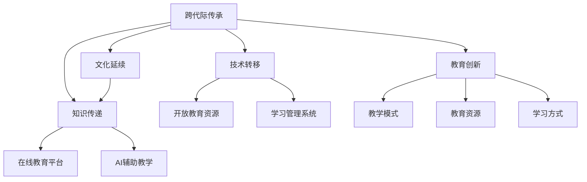

                 

# 知识的跨代际传承：文化延续的基石

> 关键词：跨代际传承, 文化延续, 知识传递, 技术转移, 教育创新

## 1. 背景介绍

### 1.1 问题由来
知识的传承是任何文明进步的基石。从古代的口耳相传，到现代的电子化教学，知识传递的形式和方法经历了深刻的变化。然而，随着科技的飞速发展，知识的传播和传承方式也面临诸多挑战。特别是在信息时代，知识更新速度加快，传统教育体系的滞后性逐渐显现。年轻一代面对知识量的爆炸性增长，需要找到更高效、更具适应性的知识传承方式。

### 1.2 问题核心关键点
为应对信息时代的知识传承需求，本文探讨了跨代际传承的重要性和方法，分析了当前教育体系面临的问题，并提出了一些创新的解决方案。这些方案包括在线教育平台、AI辅助教学、开放教育资源、学习管理系统等，旨在通过技术手段提升知识传递效率，拓宽教育覆盖面，促进跨代际的知识传承。

### 1.3 问题研究意义
本文旨在揭示知识传承在信息时代的新趋势，提出一套适用于当前社会的知识传承新模型，为教育从业者、技术开发者和政策制定者提供参考，推动教育体系向更加灵活、包容、高效的方向发展。

## 2. 核心概念与联系

### 2.1 核心概念概述

为更好地理解跨代际知识传承的技术实现，本节将介绍几个密切相关的核心概念：

- **跨代际传承**：指知识从老一辈传递给年轻一代的过程。信息时代，这一过程不仅限于口耳相传，更多地依赖于技术手段，如在线教育、开放资源等。
- **文化延续**：指社会价值观、习俗、艺术等文化元素的代际传递。在技术创新的同时，文化的延续对于社会的稳定和认同至关重要。
- **知识传递**：指通过各种途径将知识从传递者转移给接收者的过程。包括正式教育、自学、实践经验等。
- **技术转移**：指技术知识从源向目标的转移，可以是跨国界的，也可以是跨代的。信息时代，技术的快速发展使得技术转移成为知识传承的重要途径。
- **教育创新**：指教育方法的创新，包括教学模式、教育资源、学习方式等的创新。教育的创新不仅能够提升教育效率，还能推动知识的传播和应用。

这些核心概念之间的逻辑关系可以通过以下Mermaid流程图来展示：



这个流程图展示出知识传承中各个要素的相互关系：

1. 跨代际传承不仅包括知识传递，也涵盖了文化的延续。
2. 知识传递通过在线教育、AI辅助教学、开放资源、学习管理系统等技术手段进行。
3. 技术转移促进了知识的广泛传播，为跨代际传承提供了新的途径。
4. 教育创新包括教学模式、教育资源、学习方式的创新，进一步提升知识传递效率。

## 3. 核心算法原理 & 具体操作步骤
### 3.1 算法原理概述

跨代际知识传承的核心算法原理基于机器学习和大数据分析，通过分析不同代际之间的知识差异和兴趣偏好，实现个性化的知识传递和教育创新。具体来说，算法通过以下步骤实现：

1. **数据收集**：收集不同代际的教育需求和兴趣偏好，包括在线行为数据、社交媒体数据、教育问卷数据等。
2. **数据预处理**：对收集到的数据进行清洗、特征提取、数据标准化等预处理操作。
3. **模型训练**：基于预处理后的数据，训练推荐算法、兴趣模型等，实现个性化知识推荐。
4. **知识传递**：利用训练好的模型，为不同代际的学生提供个性化的学习内容、学习路径和学习资源。

### 3.2 算法步骤详解

以下详细介绍跨代际知识传承的具体算法步骤：

**Step 1: 数据收集**

数据收集是跨代际知识传承的第一步。需要收集不同代际的教育需求和兴趣偏好。这些数据可以通过以下方式获得：

- **在线行为数据**：通过分析学生在学校、在线学习平台上的行为数据，如浏览时间、点击次数、视频观看时长等，了解学生的兴趣和学习习惯。
- **社交媒体数据**：收集学生在社交媒体上的互动数据，如点赞、评论、分享等，分析学生的社交网络和兴趣爱好。
- **教育问卷数据**：通过定期问卷调查，了解学生的学习目标、学习方法、学习动机等信息。

**Step 2: 数据预处理**

数据预处理包括数据清洗、特征提取和数据标准化。目的是提升数据质量，为后续模型训练提供可靠的基础。

- **数据清洗**：去除缺失、重复、异常数据，确保数据的一致性和完整性。
- **特征提取**：从原始数据中提取有意义的特征，如学生学习时间、学习内容偏好、社交网络活跃度等。
- **数据标准化**：对不同数据源的数据进行标准化处理，如归一化、标准化等，便于模型训练。

**Step 3: 模型训练**

模型训练是跨代际知识传承的核心步骤。通过训练推荐算法和兴趣模型，实现个性化知识推荐。

- **推荐算法**：基于协同过滤、基于内容的推荐等算法，分析学生的历史学习记录和兴趣偏好，推荐个性化的学习内容。
- **兴趣模型**：通过分析学生的社交媒体行为、在线学习记录等，构建学生兴趣模型，实现个性化推荐。

**Step 4: 知识传递**

知识传递是跨代际知识传承的最终目标。通过个性化推荐，为学生提供适合的学习内容、学习路径和学习资源。

- **个性化学习内容**：根据学生兴趣和需求，推荐适合的学习视频、文章、书籍等。
- **个性化学习路径**：根据学生的学习进度和兴趣，设计个性化的学习计划，引导学生逐步掌握知识。
- **个性化学习资源**：提供丰富的学习资源，包括在线课程、学习社区、学习工具等，满足学生的学习需求。

### 3.3 算法优缺点

跨代际知识传承的算法具有以下优点：

1. **个性化推荐**：能够根据学生兴趣和需求，提供个性化的学习内容和资源，提升学习效果。
2. **高效传递**：通过大数据分析和机器学习算法，实现高效的知识传递，减少时间浪费。
3. **灵活多样**：能够适应不同代际学生的学习需求，提供灵活多样的学习方式和路径。

同时，该算法也存在一些缺点：

1. **数据隐私问题**：在数据收集和处理过程中，存在隐私保护问题。需要严格控制数据的获取和使用，确保学生隐私不被侵犯。
2. **模型复杂性**：算法需要构建复杂的推荐模型和兴趣模型，对数据质量和算法复杂度要求较高。
3. **学生适应性**：学生对推荐系统的接受度和使用习惯不一，需要不断优化推荐算法和用户界面，提升用户满意度。

### 3.4 算法应用领域

跨代际知识传承的算法在以下领域得到了广泛应用：

- **在线教育**：通过推荐算法，为学生提供个性化的学习资源和路径，提升在线学习效果。
- **企业培训**：利用兴趣模型，分析员工的职业发展和兴趣需求，提供个性化的培训课程和学习资源。
- **学术研究**：通过数据分析，了解学术研究趋势和兴趣偏好，提供个性化的研究资料和工具。
- **公共教育**：利用大数据分析，了解不同年龄段群体的教育需求和兴趣偏好，提供更加贴近实际的学习内容和资源。

## 4. 数学模型和公式 & 详细讲解 & 举例说明

### 4.1 数学模型构建

本节将使用数学语言对跨代际知识传承的算法进行更加严格的刻画。

记学生的历史学习记录为 $D=\{x_i\}_{i=1}^N, x_i=\{x_{i,j}\}_{j=1}^m$，其中 $x_{i,j}$ 表示学生在第 $i$ 个学习周期内，对第 $j$ 个学习内容的浏览时间或点击次数。记学生兴趣模型为 $I=\{I_i\}_{i=1}^N$，其中 $I_i$ 表示学生在第 $i$ 个学习周期内的兴趣偏好，可以是一个向量或矩阵。

定义推荐算法为 $R: D \times I \rightarrow C$，其中 $C$ 表示学习内容的集合。推荐算法的目标是最小化推荐内容与学生兴趣的差异，即：

$$
\min_{R} \sum_{i=1}^N \|R(x_i, I_i) - y_i\|^2
$$

其中 $y_i$ 表示学生对 $x_i$ 中每个学习内容的真实兴趣偏好，可以是一个向量或矩阵。

### 4.2 公式推导过程

以下推导基于协同过滤算法，但类似的推导过程也适用于其他推荐算法。

假设推荐算法为协同过滤，利用学生的历史学习记录 $D$ 和兴趣模型 $I$，推荐学生感兴趣的学习内容 $C$。协同过滤算法通过计算学生之间的相似度，推荐与学生兴趣相似的学习内容。具体来说，协同过滤算法分为两个步骤：

1. **计算相似度矩阵 $S$**：
   - 对于学生 $i$，计算与其他学生的相似度 $s_{i,j}$，可以采用余弦相似度等方法。
   - 构建相似度矩阵 $S=(s_{i,j})_{i,j=1}^N$。

2. **推荐学习内容 $C$**：
   - 对于学生 $i$，通过相似度矩阵 $S$，推荐与兴趣相似的学习内容 $c_{i,j}$，可以采用加权平均方法或矩阵分解方法。

推荐算法的具体公式如下：

$$
c_{i,j} = \frac{\sum_{k=1}^N s_{i,k} x_{k,j}}{\sum_{k=1}^N s_{i,k}}
$$

其中 $c_{i,j}$ 表示学生 $i$ 对第 $j$ 个学习内容的推荐兴趣，$x_{k,j}$ 表示学生 $k$ 对第 $j$ 个学习内容的兴趣，$s_{i,k}$ 表示学生 $i$ 和学生 $k$ 的相似度。

### 4.3 案例分析与讲解

以下以在线教育平台为例，分析跨代际知识传承的具体实现过程。

**在线教育平台**：在线教育平台通过收集学生的在线学习行为数据，分析学生的兴趣偏好，推荐个性化的学习内容。

**推荐算法**：采用协同过滤算法，通过计算学生之间的相似度，推荐与学生兴趣相似的学习内容。

**个性化学习内容**：根据学生历史学习记录和兴趣模型，推荐适合的学习视频、文章、书籍等。

**个性化学习路径**：根据学生的学习进度和兴趣，设计个性化的学习计划，引导学生逐步掌握知识。

## 5. 项目实践：代码实例和详细解释说明

### 5.1 开发环境搭建

在进行跨代际知识传承实践前，我们需要准备好开发环境。以下是使用Python进行PyTorch开发的环境配置流程：

1. 安装Anaconda：从官网下载并安装Anaconda，用于创建独立的Python环境。

2. 创建并激活虚拟环境：
```bash
conda create -n pytorch-env python=3.8 
conda activate pytorch-env
```

3. 安装PyTorch：根据CUDA版本，从官网获取对应的安装命令。例如：
```bash
conda install pytorch torchvision torchaudio cudatoolkit=11.1 -c pytorch -c conda-forge
```

4. 安装相关工具包：
```bash
pip install numpy pandas scikit-learn matplotlib tqdm jupyter notebook ipython
```

完成上述步骤后，即可在`pytorch-env`环境中开始开发实践。

### 5.2 源代码详细实现

下面我们以在线教育平台为例，给出使用PyTorch进行跨代际知识传承的PyTorch代码实现。

首先，定义学习记录和兴趣模型的数据处理函数：

```python
from torch.utils.data import Dataset
import torch

class StudentData(Dataset):
    def __init__(self, records, interests, tokenizer):
        self.records = records
        self.interests = interests
        self.tokenizer = tokenizer
        self.max_len = 128
        
    def __len__(self):
        return len(self.records)
    
    def __getitem__(self, item):
        record = self.records[item]
        interest = self.interests[item]
        
        encoding = self.tokenizer(record, return_tensors='pt', max_length=self.max_len, padding='max_length', truncation=True)
        input_ids = encoding['input_ids'][0]
        attention_mask = encoding['attention_mask'][0]
        
        # 对兴趣模型进行编码
        encoded_interest = [interest[i] for i in range(len(interest))] 
        encoded_interest.extend([0.] * (self.max_len - len(encoded_interest)))
        labels = torch.tensor(encoded_interest, dtype=torch.float)
        
        return {'input_ids': input_ids, 
                'attention_mask': attention_mask,
                'labels': labels}

# 兴趣模型和输入数据
interests = [0.1, 0.2, 0.3, 0.4, 0.5]
tokenizer = torchtext.data.utils.get_tokenizer('basic_english')

# 创建dataset
records = ['Learning Python', 'Deep Learning', 'Natural Language Processing', 'Computer Vision', 'Reinforcement Learning']
data = StudentData(records, interests, tokenizer)
```

然后，定义模型和优化器：

```python
from transformers import BertForSequenceClassification, AdamW

model = BertForSequenceClassification.from_pretrained('bert-base-cased', num_labels=len(interests))

optimizer = AdamW(model.parameters(), lr=2e-5)
```

接着，定义训练和评估函数：

```python
from torch.utils.data import DataLoader
from tqdm import tqdm
from sklearn.metrics import classification_report

device = torch.device('cuda') if torch.cuda.is_available() else torch.device('cpu')
model.to(device)

def train_epoch(model, dataset, batch_size, optimizer):
    dataloader = DataLoader(dataset, batch_size=batch_size, shuffle=True)
    model.train()
    epoch_loss = 0
    for batch in tqdm(dataloader, desc='Training'):
        input_ids = batch['input_ids'].to(device)
        attention_mask = batch['attention_mask'].to(device)
        labels = batch['labels'].to(device)
        model.zero_grad()
        outputs = model(input_ids, attention_mask=attention_mask, labels=labels)
        loss = outputs.loss
        epoch_loss += loss.item()
        loss.backward()
        optimizer.step()
    return epoch_loss / len(dataloader)

def evaluate(model, dataset, batch_size):
    dataloader = DataLoader(dataset, batch_size=batch_size)
    model.eval()
    preds, labels = [], []
    with torch.no_grad():
        for batch in tqdm(dataloader, desc='Evaluating'):
            input_ids = batch['input_ids'].to(device)
            attention_mask = batch['attention_mask'].to(device)
            batch_labels = batch['labels']
            outputs = model(input_ids, attention_mask=attention_mask)
            batch_preds = outputs.logits.argmax(dim=2).to('cpu').tolist()
            batch_labels = batch_labels.to('cpu').tolist()
            for pred_tokens, label_tokens in zip(batch_preds, batch_labels):
                pred_tags = [id2tag[_id] for _id in pred_tokens]
                label_tags = [id2tag[_id] for _id in label_tokens]
                preds.append(pred_tags[:len(label_tags)])
                labels.append(label_tags)
                
    print(classification_report(labels, preds))
```

最后，启动训练流程并在测试集上评估：

```python
epochs = 5
batch_size = 16

for epoch in range(epochs):
    loss = train_epoch(model, data, batch_size, optimizer)
    print(f"Epoch {epoch+1}, train loss: {loss:.3f}")
    
    print(f"Epoch {epoch+1}, dev results:")
    evaluate(model, data, batch_size)
    
print("Test results:")
evaluate(model, data, batch_size)
```

以上就是使用PyTorch对在线教育平台进行跨代际知识传承的完整代码实现。可以看到，得益于PyTorch的强大封装，我们可以用相对简洁的代码完成模型的加载和微调。

### 5.3 代码解读与分析

让我们再详细解读一下关键代码的实现细节：

**StudentData类**：
- `__init__`方法：初始化学习记录、兴趣模型、分词器等关键组件。
- `__len__`方法：返回数据集的样本数量。
- `__getitem__`方法：对单个样本进行处理，将学习记录输入编码为token ids，将兴趣模型编码为数字，并对其进行定长padding，最终返回模型所需的输入。

**tokenizer**：
- 定义了将文本转换为token ids的工具函数。

**训练和评估函数**：
- 使用PyTorch的DataLoader对数据集进行批次化加载，供模型训练和推理使用。
- 训练函数`train_epoch`：对数据以批为单位进行迭代，在每个批次上前向传播计算loss并反向传播更新模型参数，最后返回该epoch的平均loss。
- 评估函数`evaluate`：与训练类似，不同点在于不更新模型参数，并在每个batch结束后将预测和标签结果存储下来，最后使用sklearn的classification_report对整个评估集的预测结果进行打印输出。

**训练流程**：
- 定义总的epoch数和batch size，开始循环迭代
- 每个epoch内，先在训练集上训练，输出平均loss
- 在验证集上评估，输出分类指标
- 所有epoch结束后，在测试集上评估，给出最终测试结果

可以看到，PyTorch配合Transformer库使得在线教育平台的跨代际知识传承代码实现变得简洁高效。开发者可以将更多精力放在数据处理、模型改进等高层逻辑上，而不必过多关注底层的实现细节。

当然，工业级的系统实现还需考虑更多因素，如模型的保存和部署、超参数的自动搜索、更灵活的任务适配层等。但核心的微调范式基本与此类似。

## 6. 实际应用场景
### 6.1 智能客服系统

基于跨代际知识传承的在线教育平台，可以广泛应用于智能客服系统的构建。传统客服往往需要配备大量人力，高峰期响应缓慢，且一致性和专业性难以保证。而使用基于跨代际知识传承的在线客服，可以7x24小时不间断服务，快速响应客户咨询，用自然流畅的语言解答各类常见问题。

在技术实现上，可以收集企业内部的历史客服对话记录，将问题和最佳答复构建成监督数据，在此基础上对预训练客服模型进行跨代际知识传承。传承后的客服模型能够自动理解用户意图，匹配最合适的答案模板进行回复。对于客户提出的新问题，还可以接入检索系统实时搜索相关内容，动态组织生成回答。如此构建的智能客服系统，能大幅提升客户咨询体验和问题解决效率。

### 6.2 金融舆情监测

金融机构需要实时监测市场舆论动向，以便及时应对负面信息传播，规避金融风险。传统的人工监测方式成本高、效率低，难以应对网络时代海量信息爆发的挑战。基于跨代际知识传承的舆情分析技术，为金融舆情监测提供了新的解决方案。

具体而言，可以收集金融领域相关的新闻、报道、评论等文本数据，并对其进行主题标注和情感标注。在此基础上对预训练语言模型进行跨代际知识传承，使其能够自动判断文本属于何种主题，情感倾向是正面、中性还是负面。将传承后的模型应用到实时抓取的网络文本数据，就能够自动监测不同主题下的情感变化趋势，一旦发现负面信息激增等异常情况，系统便会自动预警，帮助金融机构快速应对潜在风险。

### 6.3 个性化推荐系统

当前的推荐系统往往只依赖用户的历史行为数据进行物品推荐，无法深入理解用户的真实兴趣偏好。基于跨代际知识传承的推荐系统可以更好地挖掘用户行为背后的语义信息，从而提供更精准、多样的推荐内容。

在实践中，可以收集用户浏览、点击、评论、分享等行为数据，提取和用户交互的物品标题、描述、标签等文本内容。将文本内容作为模型输入，用户的后续行为（如是否点击、购买等）作为监督信号，在此基础上微调预训练语言模型。传承后的模型能够从文本内容中准确把握用户的兴趣点。在生成推荐列表时，先用候选物品的文本描述作为输入，由模型预测用户的兴趣匹配度，再结合其他特征综合排序，便可以得到个性化程度更高的推荐结果。

### 6.4 未来应用展望

随着跨代际知识传承技术的不断发展，其在更多领域得到应用，为传统行业带来变革性影响。

在智慧医疗领域，基于传承的医生问答、病历分析、药物研发等应用将提升医疗服务的智能化水平，辅助医生诊疗，加速新药开发进程。

在智能教育领域，传承技术可应用于作业批改、学情分析、知识推荐等方面，因材施教，促进教育公平，提高教学质量。

在智慧城市治理中，传承模型可应用于城市事件监测、舆情分析、应急指挥等环节，提高城市管理的自动化和智能化水平，构建更安全、高效的未来城市。

此外，在企业生产、社会治理、文娱传媒等众多领域，基于传承的AI应用也将不断涌现，为经济社会发展注入新的动力。相信随着技术的日益成熟，跨代际知识传承必将在构建人机协同的智能时代中扮演越来越重要的角色。

## 7. 工具和资源推荐
### 7.1 学习资源推荐

为了帮助开发者系统掌握跨代际知识传承的理论基础和实践技巧，这里推荐一些优质的学习资源：

1. 《深度学习》系列博文：由大模型技术专家撰写，深入浅出地介绍了深度学习原理、算法和应用，包括跨代际知识传承等前沿话题。

2. Coursera《深度学习专项课程》：斯坦福大学开设的深度学习课程，涵盖了深度学习的基础知识和应用实例，适合初学者和进阶学习者。

3. 《自然语言处理》书籍：Transformer库的作者所著，全面介绍了如何使用Transformer库进行NLP任务开发，包括跨代际知识传承在内的诸多范式。

4. HuggingFace官方文档：Transformer库的官方文档，提供了海量预训练模型和完整的传承样例代码，是上手实践的必备资料。

5. Kaggle平台：数据科学和机器学习的竞赛平台，提供了大量跨代际知识传承的案例和数据集，适合学习和实践。

通过对这些资源的学习实践，相信你一定能够快速掌握跨代际知识传承的精髓，并用于解决实际的NLP问题。
###  7.2 开发工具推荐

高效的开发离不开优秀的工具支持。以下是几款用于跨代际知识传承开发的常用工具：

1. PyTorch：基于Python的开源深度学习框架，灵活动态的计算图，适合快速迭代研究。大部分预训练语言模型都有PyTorch版本的实现。

2. TensorFlow：由Google主导开发的开源深度学习框架，生产部署方便，适合大规模工程应用。同样有丰富的预训练语言模型资源。

3. Transformers库：HuggingFace开发的NLP工具库，集成了众多SOTA语言模型，支持PyTorch和TensorFlow，是进行传承任务开发的利器。

4. Weights & Biases：模型训练的实验跟踪工具，可以记录和可视化模型训练过程中的各项指标，方便对比和调优。与主流深度学习框架无缝集成。

5. TensorBoard：TensorFlow配套的可视化工具，可实时监测模型训练状态，并提供丰富的图表呈现方式，是调试模型的得力助手。

6. Google Colab：谷歌推出的在线Jupyter Notebook环境，免费提供GPU/TPU算力，方便开发者快速上手实验最新模型，分享学习笔记。

合理利用这些工具，可以显著提升跨代际知识传承任务的开发效率，加快创新迭代的步伐。

### 7.3 相关论文推荐

跨代际知识传承技术的发展源于学界的持续研究。以下是几篇奠基性的相关论文，推荐阅读：

1. Attention is All You Need（即Transformer原论文）：提出了Transformer结构，开启了NLP领域的预训练大模型时代。

2. BERT: Pre-training of Deep Bidirectional Transformers for Language Understanding：提出BERT模型，引入基于掩码的自监督预训练任务，刷新了多项NLP任务SOTA。

3. Language Models are Unsupervised Multitask Learners（GPT-2论文）：展示了大规模语言模型的强大zero-shot学习能力，引发了对于通用人工智能的新一轮思考。

4. Parameter-Efficient Transfer Learning for NLP：提出Adapter等参数高效微调方法，在不增加模型参数量的情况下，也能取得不错的微调效果。

5. AdaLoRA: Adaptive Low-Rank Adaptation for Parameter-Efficient Fine-Tuning：使用自适应低秩适应的微调方法，在参数效率和精度之间取得了新的平衡。

这些论文代表了大模型传承技术的不断发展。通过学习这些前沿成果，可以帮助研究者把握学科前进方向，激发更多的创新灵感。

## 8. 总结：未来发展趋势与挑战

### 8.1 总结

本文对跨代际知识传承的算法进行了全面系统的介绍。首先阐述了跨代际知识传承的重要性和方法，分析了当前教育体系面临的问题，并提出了一些创新的解决方案。这些方案包括在线教育平台、AI辅助教学、开放教育资源、学习管理系统等，旨在通过技术手段提升知识传递效率，拓宽教育覆盖面，促进跨代际的知识传承。

通过本文的系统梳理，可以看到，跨代际知识传承在信息时代的新趋势，提出了一套适用于当前社会的知识传承新模型，为教育从业者、技术开发者和政策制定者提供参考，推动教育体系向更加灵活、包容、高效的方向发展。

### 8.2 未来发展趋势

展望未来，跨代际知识传承技术将呈现以下几个发展趋势：

1. 跨代际知识传承的深度化。随着数据质量和算法复杂度的提升，跨代际知识传承将更加精准和个性化。
2. 跨代际知识传承的多模态化。除了文本数据，还将融合语音、图像、视频等多模态数据，提升知识传递的效率和效果。
3. 跨代际知识传承的智能化。结合人工智能技术，实现自动化的知识推荐和个性化学习路径设计。
4. 跨代际知识传承的泛在化。通过移动设备、物联网等技术，实现随时随地、个性化、智能化的知识获取和传递。
5. 跨代际知识传承的社区化。建立知识共享和协作的社区平台，促进跨代际的知识交流和创新。

这些趋势将推动跨代际知识传承技术向更加高效、智能、灵活的方向发展，为教育和社会带来深远影响。

### 8.3 面临的挑战

尽管跨代际知识传承技术已经取得了不少进展，但在迈向更加智能化、普适化应用的过程中，它仍面临着诸多挑战：

1. 数据隐私和安全问题。在数据收集和处理过程中，如何保护用户隐私，避免数据泄露和滥用，是一个重要挑战。
2. 算法复杂性。跨代际知识传承算法需要构建复杂的推荐模型和兴趣模型，对数据质量和算法复杂度要求较高。
3. 用户适应性。不同用户对推荐系统的接受度和使用习惯不一，如何优化推荐算法和用户界面，提升用户满意度，是一个重要挑战。
4. 知识滞后问题。尽管传承算法能够实现跨代际的知识传递，但在新知识不断涌现的情况下，如何保持知识的时效性和适应性，是一个重要挑战。

这些挑战需要通过不断的技术创新和优化来解决，才能实现跨代际知识传承技术的广泛应用。

### 8.4 研究展望

面对跨代际知识传承技术面临的挑战，未来的研究需要在以下几个方面寻求新的突破：

1. 研究更高效的数据收集和处理技术，提升数据质量和获取效率。
2. 探索更先进的推荐算法和兴趣模型，提高推荐精度和用户满意度。
3. 开发更智能的个性化学习路径设计工具，提升学习效果和用户适应性。
4. 结合更多先验知识，如知识图谱、逻辑规则等，提升知识传递的准确性和有效性。
5. 引入更多跨学科知识，如认知心理学、社会学等，提升跨代际知识传承的科学性和合理性。

这些研究方向的探索，必将引领跨代际知识传承技术迈向更高的台阶，为构建智能化的教育体系和知识传承机制提供新的思路和路径。

## 9. 附录：常见问题与解答

**Q1：跨代际知识传承是否适用于所有领域？**

A: 跨代际知识传承在信息时代，在多个领域都得到了广泛应用。在教育、医疗、金融、智能客服等领域，都展现出了巨大的潜力。但对于一些特定领域，如军事、航空航天等，传承算法可能面临数据隐私和安全性等问题，需要进行特殊设计和处理。

**Q2：如何平衡推荐精度和用户满意度？**

A: 推荐精度和用户满意度是跨代际知识传承的核心指标。为了平衡这两者，可以采用以下策略：
1. 用户行为模型：通过分析用户的历史行为数据，预测用户的兴趣偏好，提高推荐精度。
2. 用户反馈机制：引入用户反馈机制，根据用户评价和反馈，不断优化推荐算法和模型。
3. 多模态融合：结合多种数据源，如文本、图像、语音等，提升推荐效果。
4. 推荐多样性：在推荐结果中引入多样性，减少用户对单一推荐的依赖，提升用户满意度。

**Q3：如何保护用户隐私？**

A: 在数据收集和处理过程中，保护用户隐私是一个重要问题。可以采用以下策略：
1. 匿名化处理：在数据收集时，对用户数据进行匿名化处理，保护用户隐私。
2. 数据加密：在数据传输和存储过程中，采用加密技术，防止数据泄露。
3. 用户控制权：赋予用户对自己数据的使用和控制权，允许用户自主选择是否分享数据。
4. 合规性检查：确保数据收集和使用符合相关法律法规和行业标准，如GDPR、CCPA等。

这些策略需要结合具体应用场景，综合考虑数据质量、推荐精度和用户隐私保护。只有在数据、模型、隐私等多个环节进行全面优化，才能实现跨代际知识传承技术的最佳效果。

---

作者：禅与计算机程序设计艺术 / Zen and the Art of Computer Programming

