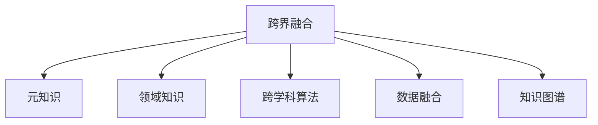

                 

## 1. 背景介绍

### 1.1 问题由来

在信息爆炸的时代，知识的边界变得越来越模糊。传统的学科界限被打破，不同领域的知识相互渗透、交叉，形成了一系列跨学科的研究范式。例如，生物学与计算机科学的结合催生了基因编辑技术，经济学与神经科学的融合开创了行为经济学，心理学与机器学习的结合产生了情感计算等。这些跨界融合带来的创新，为科技发展注入了新的活力。

### 1.2 问题核心关键点

- **跨界融合的动因**：知识的内在关联性和问题的多维度性是推动跨界融合的内在动力。不同学科间的知识互补，可以形成更全面的视角和更全面的解决方法。
- **跨界融合的趋势**：人工智能、大数据、区块链等新兴技术的兴起，为知识跨界融合提供了新的平台和工具。
- **跨界融合的挑战**：跨学科的语言、方法、思维方式的差异，对研究者和实践者提出了更高的要求。
- **跨界融合的应用**：在实际应用中，跨界融合带来了很多突破性技术，如智能医疗、智能城市、智能制造等。

### 1.3 问题研究意义

研究知识跨界融合的方法和应用，对于推动科技创新、提升社会生产力、解决复杂社会问题具有重要意义。跨界融合不仅能够突破现有技术的局限，还能产生新的技术方向，为经济发展、社会进步带来新的机遇。

## 2. 核心概念与联系

### 2.1 核心概念概述

为更好地理解知识的跨界融合，本节将介绍几个密切相关的核心概念：

- **跨界融合(Cross-Disciplinary Integration)**：不同学科间的知识、方法、技术等要素的融合，形成新的理论和方法。
- **元知识(Meta-Knowledge)**：不同学科共有的基础性知识，如数学、逻辑、物理等，为跨界融合提供了共同的基础。
- **领域知识(Domain Knowledge)**：特定学科内的专业知识，是跨界融合的基础素材。
- **跨学科算法(Cross-Disciplinary Algorithm)**：融合不同学科算法，开发解决复杂问题的综合性算法。
- **数据融合(Data Fusion)**：将不同来源的数据进行整合分析，形成更全面的数据集。
- **知识图谱(Knowledge Graph)**：通过语义网技术将知识结构化，促进不同领域知识的相互理解和集成。

这些核心概念之间的逻辑关系可以通过以下Mermaid流程图来展示：



这个流程图展示了一些核心概念及其之间的关系：

1. 跨界融合将不同学科的知识、方法、技术等要素融合在一起。
2. 元知识为跨界融合提供了共同的基础。
3. 领域知识是跨界融合的基础素材。
4. 跨学科算法是跨界融合的实现手段。
5. 数据融合促进了不同领域知识的整合。
6. 知识图谱为跨界融合提供了结构化知识。

## 3. 核心算法原理 & 具体操作步骤
### 3.1 算法原理概述

知识的跨界融合本质上是一种跨学科的算法设计和实现过程。其核心思想是：将不同学科的知识和方法结合起来，开发新的算法和技术，解决跨学科的复杂问题。

形式化地，假设A和B是两个学科的知识体系，$\mathcal{A}$ 和 $\mathcal{B}$ 分别为A和B学科的基础概念和算法，$\mathcal{C}$ 是跨界融合后的新知识体系。则知识跨界融合的算法原理可以表示为：

$$
\mathcal{C} = \mathcal{A} \cap \mathcal{B}
$$

这意味着，跨界融合需要找到A和B之间的交集，即两个学科都认可的基础概念和算法，形成新的知识体系。

### 3.2 算法步骤详解

知识的跨界融合通常包括以下几个关键步骤：

**Step 1: 确定融合目标和范围**

- 明确跨界融合的具体目标，如解决特定问题、开发新型技术等。
- 确定融合的范围，包括需要融合的学科、数据、算法等。

**Step 2: 构建跨学科团队**

- 组建由不同学科背景的研究者组成的团队，包括专家、工程师、数据科学家等。
- 组织跨学科的交流和讨论，形成统一的研究框架和语言。

**Step 3: 寻找共通点和差异点**

- 识别两个学科间的共通点和差异点，如共有的基础概念、算法和特殊的应用场景等。
- 分析共通点和差异点的特点，确定融合的策略和方法。

**Step 4: 设计跨学科算法**

- 基于共通点和差异点，设计跨学科的算法和模型，确保算法在两个学科内都有效。
- 引入两个学科的算法和模型，开发综合性的算法和模型。

**Step 5: 进行实验验证**

- 在实验环境下，对跨学科算法进行验证，确保算法在实际应用中可靠、有效。
- 对算法进行优化和改进，解决实验中发现的问题。

**Step 6: 推广应用**

- 将跨学科算法应用于实际问题，解决跨学科的复杂问题。
- 推广跨学科算法，形成可复制、可推广的案例和模式。

### 3.3 算法优缺点

知识的跨界融合具有以下优点：

1. **创新性强**：不同学科的知识和方法可以相互补充，产生新的视角和方法，推动技术创新。
2. **应用广泛**：跨界融合技术可以应用于各个领域，解决复杂的跨学科问题。
3. **综合性强**：跨界融合技术综合了不同学科的知识和算法，形成更全面的解决方案。

同时，该方法也存在一定的局限性：

1. **复杂度高**：跨界融合需要协调不同学科的知识和方法，难度较大。
2. **成本高**：跨界融合需要组建跨学科团队，进行多学科的合作，成本较高。
3. **风险高**：跨界融合的结果可能与预期不符，需要进行多次实验验证。
4. **可解释性不足**：跨界融合的算法复杂，难以解释其内部工作机制。

尽管存在这些局限性，但就目前而言，跨界融合方法已经在大数据、人工智能、生物信息学等多个领域取得了显著成果，成为推动科技进步的重要手段。

### 3.4 算法应用领域

知识的跨界融合在多个领域得到了广泛应用，以下是一些典型的应用案例：

- **人工智能与大数据的融合**：开发基于大数据的人工智能算法，如深度学习、推荐系统等。
- **人工智能与生物学的融合**：应用人工智能技术进行基因组分析、疾病预测、药物研发等。
- **人工智能与心理学的融合**：开发基于心理学理论的情感计算、认知计算等应用。
- **人工智能与经济学的融合**：应用人工智能技术进行市场预测、风险评估、金融分析等。
- **人工智能与社会学**：开发基于社会学理论的社交网络分析、社会行为模拟等应用。

此外，跨界融合在智能制造、智慧城市、智能农业等多个领域也有广泛应用，推动了相关领域的智能化转型。

## 4. 数学模型和公式 & 详细讲解 & 举例说明

### 4.1 数学模型构建

为了更系统地理解知识的跨界融合，本节将从数学模型构建的角度进行详细讲解。

假设A和B是两个学科的知识体系，其数学模型分别为$\mathcal{A}=\{(x_i, y_i)\}_{i=1}^N$和$\mathcal{B}=\{(z_j, w_j)\}_{j=1}^M$。其中，$x_i$和$y_i$为学科A中的输入和输出，$z_j$和$w_j$为学科B中的输入和输出。则跨界融合的数学模型可以表示为：

$$
\mathcal{C} = \{((x_i, z_j), (y_i, w_j))\}_{i=1}^N \times \{(z_j, w_j)\}_{j=1}^M
$$

这意味着，跨界融合的数学模型将学科A和学科B的输入和输出结合在一起，形成新的模型。

### 4.2 公式推导过程

以下我们以智能制造领域为例，推导跨界融合的数学模型及其求解过程。

假设在智能制造中，需要应用机器学习和计算机视觉技术对生产线的质检数据进行分类。其中，机器学习用于分类，计算机视觉技术用于图像处理。设机器学习模型为$M_{\theta}(x)$，计算机视觉模型为$V_{\varphi}(z)$。则跨界融合的数学模型可以表示为：

$$
C(x, z) = M_{\theta}(x) \times V_{\varphi}(z)
$$

其中，$x$为机器学习的输入，$z$为计算机视觉的输入，$C(x, z)$为跨界融合后的输出。

为了求解该模型，需要分别训练$M_{\theta}$和$V_{\varphi}$，并将训练后的模型结合在一起。具体步骤如下：

1. 对机器学习模型$M_{\theta}$进行训练，获取模型参数$\theta$。
2. 对计算机视觉模型$V_{\varphi}$进行训练，获取模型参数$\varphi$。
3. 将训练后的$M_{\theta}$和$V_{\varphi}$结合，形成跨界融合模型$C(x, z)$。
4. 对$C(x, z)$进行验证和优化，确保其可靠性和有效性。

### 4.3 案例分析与讲解

在智能制造领域，知识跨界融合技术的应用非常广泛。例如，通过将机器学习与计算机视觉结合，可以实现对生产线的自动质检和分类。具体过程如下：

1. 对生产线的质检图像进行预处理，提取出图像的关键特征。
2. 将处理后的图像作为计算机视觉模型的输入，得到特征表示$z$。
3. 将特征表示$z$作为机器学习模型的输入，得到分类结果$y$。
4. 将分类结果$y$作为跨界融合模型的输出，实现自动质检和分类。

通过将机器学习和计算机视觉技术结合，智能制造领域的生产效率和产品质量得到了显著提升。

## 5. 项目实践：代码实例和详细解释说明

### 5.1 开发环境搭建

在进行跨界融合项目实践前，我们需要准备好开发环境。以下是使用Python进行PyTorch开发的环境配置流程：

1. 安装Anaconda：从官网下载并安装Anaconda，用于创建独立的Python环境。

2. 创建并激活虚拟环境：
```bash
conda create -n pytorch-env python=3.8 
conda activate pytorch-env
```

3. 安装PyTorch：根据CUDA版本，从官网获取对应的安装命令。例如：
```bash
conda install pytorch torchvision torchaudio cudatoolkit=11.1 -c pytorch -c conda-forge
```

4. 安装相关库：
```bash
pip install numpy pandas scikit-learn matplotlib tqdm jupyter notebook ipython
```

完成上述步骤后，即可在`pytorch-env`环境中开始跨界融合实践。

### 5.2 源代码详细实现

下面我们以智能制造领域为例，给出使用PyTorch进行机器学习与计算机视觉结合的跨界融合代码实现。

首先，定义机器学习和计算机视觉的模型：

```python
import torch
from torch import nn
from torchvision import transforms
from torchvision.models import resnet18

# 机器学习模型
class MLP(nn.Module):
    def __init__(self):
        super(MLP, self).__init__()
        self.fc1 = nn.Linear(64, 32)
        self.fc2 = nn.Linear(32, 2)
    
    def forward(self, x):
        x = x.view(-1, 64)
        x = self.fc1(x)
        x = torch.relu(x)
        x = self.fc2(x)
        return x
    
# 计算机视觉模型
class ResNet(nn.Module):
    def __init__(self):
        super(ResNet, self).__init__()
        self.resnet = resnet18(pretrained=True)
        self.fc = nn.Linear(512, 2)
    
    def forward(self, x):
        x = self.resnet(x)
        x = x.fc
        return x
```

接着，定义数据预处理和训练函数：

```python
transforms = transforms.Compose([
    transforms.Resize(256),
    transforms.CenterCrop(224),
    transforms.ToTensor(),
    transforms.Normalize(mean=[0.485, 0.456, 0.406],
                        std=[0.229, 0.224, 0.225])
])

# 加载训练数据
train_dataset = datasets.ImageFolder('train', transform=transforms)
train_loader = torch.utils.data.DataLoader(train_dataset, batch_size=16, shuffle=True)

# 加载验证数据
val_dataset = datasets.ImageFolder('val', transform=transforms)
val_loader = torch.utils.data.DataLoader(val_dataset, batch_size=16, shuffle=True)

# 定义优化器和损失函数
optimizer = torch.optim.Adam([mlp.parameters(), resnet.parameters()], lr=0.001)
criterion = nn.CrossEntropyLoss()

# 训练函数
def train_epoch(model, dataloader, optimizer, criterion):
    model.train()
    epoch_loss = 0
    epoch_acc = 0
    for batch_idx, (data, target) in enumerate(dataloader):
        data, target = data.to(device), target.to(device)
        optimizer.zero_grad()
        output = mlp(data) * resnet(data)
        loss = criterion(output, target)
        loss.backward()
        optimizer.step()
        epoch_loss += loss.item()
    return epoch_loss / len(dataloader)

# 评估函数
def evaluate(model, dataloader, criterion):
    model.eval()
    val_loss = 0
    val_acc = 0
    with torch.no_grad():
        for batch_idx, (data, target) in enumerate(dataloader):
            data, target = data.to(device), target.to(device)
            output = mlp(data) * resnet(data)
            loss = criterion(output, target)
            val_loss += loss.item()
    return val_loss / len(dataloader)
```

最后，启动训练流程并在验证集上评估：

```python
epochs = 10
device = torch.device('cuda') if torch.cuda.is_available() else torch.device('cpu')

mlp = MLP().to(device)
resnet = ResNet().to(device)

for epoch in range(epochs):
    loss = train_epoch(mlp, train_loader, optimizer, criterion)
    print(f'Epoch {epoch+1}, train loss: {loss:.3f}')
    
    val_loss = evaluate(mlp, val_loader, criterion)
    print(f'Epoch {epoch+1}, val loss: {val_loss:.3f}')
```

以上就是使用PyTorch进行机器学习与计算机视觉结合的跨界融合代码实现。可以看到，通过将两个学科的模型结合，可以形成更加全面、高效的跨界融合模型。

### 5.3 代码解读与分析

让我们再详细解读一下关键代码的实现细节：

**MLP类**：
- `__init__`方法：定义机器学习模型，包括两个全连接层。
- `forward`方法：定义前向传播过程，将输入数据经过全连接层后输出。

**ResNet类**：
- `__init__`方法：定义计算机视觉模型，包括一个预训练的ResNet-18模型和一个全连接层。
- `forward`方法：定义前向传播过程，将输入数据经过ResNet-18模型和全连接层后输出。

**train_epoch函数**：
- 在训练阶段，将机器学习和计算机视觉模型的参数绑定，共同优化。
- 将输入数据经过机器学习模型和计算机视觉模型，输出特征表示。
- 计算交叉熵损失，反向传播更新模型参数。

**evaluate函数**：
- 在评估阶段，只使用机器学习模型的输出进行损失计算。
- 通过评估函数，可以在验证集上检查模型的性能。

通过这个简单的代码实现，我们可以看到，将机器学习和计算机视觉技术结合，可以形成更全面、高效的跨界融合模型。

## 6. 实际应用场景

### 6.1 智能制造

在智能制造领域，知识跨界融合技术的应用非常广泛。例如，通过将机器学习与计算机视觉结合，可以实现对生产线的自动质检和分类。具体过程如下：

1. 对生产线的质检图像进行预处理，提取出图像的关键特征。
2. 将处理后的图像作为计算机视觉模型的输入，得到特征表示$z$。
3. 将特征表示$z$作为机器学习模型的输入，得到分类结果$y$。
4. 将分类结果$y$作为跨界融合模型的输出，实现自动质检和分类。

通过将机器学习和计算机视觉技术结合，智能制造领域的生产效率和产品质量得到了显著提升。

### 6.2 智慧医疗

在智慧医疗领域，知识跨界融合技术的应用也非常广泛。例如，通过将人工智能与医学知识结合，可以实现对医学影像的自动分析。具体过程如下：

1. 对医学影像进行预处理，提取出影像的关键特征。
2. 将处理后的影像作为计算机视觉模型的输入，得到特征表示$z$。
3. 将特征表示$z$作为人工智能模型的输入，进行自动分析和分类。
4. 将分类结果作为跨界融合模型的输出，实现对医学影像的自动分析。

通过将人工智能与医学知识结合，智慧医疗领域的高效诊断和精准治疗得到了显著提升。

### 6.3 智慧城市

在智慧城市领域，知识跨界融合技术的应用也非常广泛。例如，通过将物联网技术和大数据分析结合，可以实现对城市交通的智能管理。具体过程如下：

1. 对城市交通数据进行预处理，提取出关键特征。
2. 将处理后的数据作为物联网设备的输入，进行智能管理。
3. 将物联网设备的数据作为计算机视觉模型的输入，得到特征表示$z$。
4. 将特征表示$z$作为人工智能模型的输入，进行数据分析和预测。
5. 将数据分析和预测结果作为跨界融合模型的输出，实现对城市交通的智能管理。

通过将物联网技术和大数据分析结合，智慧城市领域的城市管理效率得到了显著提升。

## 7. 工具和资源推荐
### 7.1 学习资源推荐

为了帮助开发者系统掌握知识跨界融合的理论基础和实践技巧，这里推荐一些优质的学习资源：

1. 《跨界融合的艺术》系列博文：由大模型技术专家撰写，深入浅出地介绍了跨界融合的原理、方法和应用场景。

2. Coursera《跨学科研究方法》课程：斯坦福大学开设的跨学科研究方法课程，涵盖不同学科的研究方法和工具，帮助你构建跨学科思维。

3. 《跨学科创新：理论和实践》书籍：介绍跨学科创新的理论基础和实践方法，帮助读者更好地理解跨界融合的原理和应用。

4. Kaggle《跨学科数据竞赛》：参加跨学科的数据竞赛，实战演练跨界融合技术，锻炼跨学科思维。

5. arXiv《跨学科研究论文》：阅读前沿的跨学科研究论文，了解跨界融合的最新进展和研究方向。

通过对这些资源的学习实践，相信你一定能够快速掌握知识跨界融合的精髓，并用于解决实际的跨学科问题。

### 7.2 开发工具推荐

高效的开发离不开优秀的工具支持。以下是几款用于跨界融合开发的常用工具：

1. Jupyter Notebook：交互式的Python开发环境，适合跨界融合项目的开发和实验。

2. GitLab/GitHub：源代码管理和版本控制平台，方便跨界融合项目的协作和迭代。

3. TensorBoard：TensorFlow配套的可视化工具，可实时监测模型训练状态，并提供丰富的图表呈现方式。

4. Weights & Biases：模型训练的实验跟踪工具，可以记录和可视化模型训练过程中的各项指标。

5. Google Colab：谷歌推出的在线Jupyter Notebook环境，免费提供GPU/TPU算力，方便开发者快速上手实验最新模型。

合理利用这些工具，可以显著提升跨界融合项目的开发效率，加快创新迭代的步伐。

### 7.3 相关论文推荐

知识跨界融合技术的发展源于学界的持续研究。以下是几篇奠基性的相关论文，推荐阅读：

1. 《跨学科研究方法与实践》：介绍跨学科研究的理论和方法，推动跨界融合的发展。

2. 《跨学科融合的数学模型》：从数学角度构建跨学科融合模型，分析不同学科的交互关系。

3. 《跨学科数据融合技术》：介绍跨学科数据融合的方法和应用，推动跨界融合技术的发展。

4. 《跨学科人工智能技术》：介绍跨学科人工智能技术的研究进展和应用案例，推动人工智能技术的跨界融合。

5. 《跨学科创新的理论和方法》：介绍跨学科创新的理论基础和方法，推动跨界融合的深入研究。

这些论文代表了大模型微调技术的发展脉络。通过学习这些前沿成果，可以帮助研究者把握学科前进方向，激发更多的创新灵感。

## 8. 总结：未来发展趋势与挑战

### 8.1 研究成果总结

本文对知识跨界融合的方法和应用进行了全面系统的介绍。首先阐述了知识跨界融合的研究背景和意义，明确了跨界融合在推动科技创新、提升社会生产力、解决复杂社会问题方面的独特价值。其次，从原理到实践，详细讲解了跨界融合的数学模型和关键步骤，给出了跨界融合项目开发的完整代码实例。同时，本文还广泛探讨了跨界融合技术在智能制造、智慧医疗、智慧城市等多个领域的应用前景，展示了跨界融合范式的巨大潜力。此外，本文精选了跨界融合技术的各类学习资源，力求为读者提供全方位的技术指引。

通过本文的系统梳理，可以看到，知识跨界融合技术已经在多个领域得到了广泛应用，推动了各领域的智能化转型。未来的跨界融合技术将更加深入地融合不同学科的知识和方法，形成更加全面、高效的解决方案，为人类社会的发展带来更多的创新和突破。

### 8.2 未来发展趋势

展望未来，知识跨界融合技术将呈现以下几个发展趋势：

1. **多学科融合**：跨界融合将更加注重多学科的融合，包括自然学科和社会学科的交叉融合，形成更加全面的知识体系。
2. **智能化升级**：跨界融合技术将与人工智能、大数据等新兴技术结合，形成更加智能化的解决方案。
3. **跨学科人才**：跨界融合的实现需要跨学科人才的共同努力，未来将更加注重跨学科人才的培养和利用。
4. **跨学科数据**：跨界融合需要大量的跨学科数据，未来将更加注重跨学科数据的管理和利用。
5. **跨学科算法**：跨界融合需要开发跨学科的算法和模型，未来将更加注重跨学科算法的开发和应用。
6. **跨学科平台**：跨界融合需要跨学科的平台支持，未来将更加注重跨学科平台的建设和利用。

以上趋势凸显了知识跨界融合技术的广阔前景。这些方向的探索发展，将进一步推动跨界融合技术的进步，为科技发展和人类社会的进步注入新的动力。

### 8.3 面临的挑战

尽管知识跨界融合技术已经取得了瞩目成就，但在迈向更加智能化、普适化应用的过程中，它仍面临着诸多挑战：

1. **跨学科知识的整合**：不同学科的知识和方法差异较大，难以形成统一的整合标准和流程。
2. **跨学科团队的协作**：跨学科团队需要多学科的协调和协作，难度较大。
3. **跨学科数据的获取**：跨学科数据的获取和共享需要协调多个部门和机构，成本较高。
4. **跨学科算法的优化**：跨学科算法的开发和优化需要大量的实验和验证，难度较大。
5. **跨学科技术的推广**：跨学科技术需要与现有的技术体系结合，推广难度较大。

尽管存在这些挑战，但跨界融合技术在多领域的应用已经取得了显著成果，未来有望在更多的领域得到应用。

### 8.4 研究展望

面对知识跨界融合面临的挑战，未来的研究需要在以下几个方面寻求新的突破：

1. **跨学科知识的标准化**：建立跨学科知识的标准化框架，促进不同学科知识的整合和共享。
2. **跨学科团队的高效协作**：构建高效的跨学科团队协作机制，提升跨学科研究的效率。
3. **跨学科数据的获取和利用**：建立跨学科数据共享平台，促进跨学科数据的获取和利用。
4. **跨学科算法的优化和创新**：开发高效、可扩展的跨学科算法，推动跨界融合技术的发展。
5. **跨学科技术的推广和应用**：结合现有技术体系，推广跨学科技术的应用，形成可复制、可推广的案例和模式。

这些研究方向的研究成果，将推动知识跨界融合技术的进一步发展，为人类社会的智能化转型提供更强大的技术支持。

## 9. 附录：常见问题与解答

**Q1：知识跨界融合是否适用于所有领域？**

A: 知识跨界融合在大多数领域都有广泛的应用前景。但需要注意的是，不同领域的特点和需求不同，跨界融合的难度和效果也会有所差异。在具体应用中，需要根据实际情况进行选择和优化。

**Q2：如何选择合适的跨界融合方法？**

A: 选择合适的跨界融合方法需要考虑多方面的因素，包括跨学科的共通点、差异点、数据类型、算法复杂度等。通常需要通过实验和对比来选择最优的方法，确保跨界融合的可行性和有效性。

**Q3：知识跨界融合的实现需要哪些关键步骤？**

A: 知识跨界融合的实现需要以下几个关键步骤：确定融合目标和范围、构建跨学科团队、寻找共通点和差异点、设计跨学科算法、进行实验验证、推广应用。

**Q4：知识跨界融合的实施过程中需要注意哪些问题？**

A: 知识跨界融合的实施过程中需要注意以下几个问题：跨学科知识的整合、跨学科团队的协作、跨学科数据的获取、跨学科算法的优化、跨学科技术的推广等。

**Q5：知识跨界融合的应用前景如何？**

A: 知识跨界融合的应用前景非常广阔，涵盖了人工智能、大数据、生物信息学、智慧医疗、智慧城市等多个领域。通过跨界融合，可以解决复杂的跨学科问题，推动各领域的智能化转型。

通过本文的系统梳理，可以看到，知识跨界融合技术已经在多个领域得到了广泛应用，推动了各领域的智能化转型。未来的跨界融合技术将更加深入地融合不同学科的知识和方法，形成更加全面、高效的解决方案，为人类社会的发展带来更多的创新和突破。

---

作者：禅与计算机程序设计艺术 / Zen and the Art of Computer Programming

