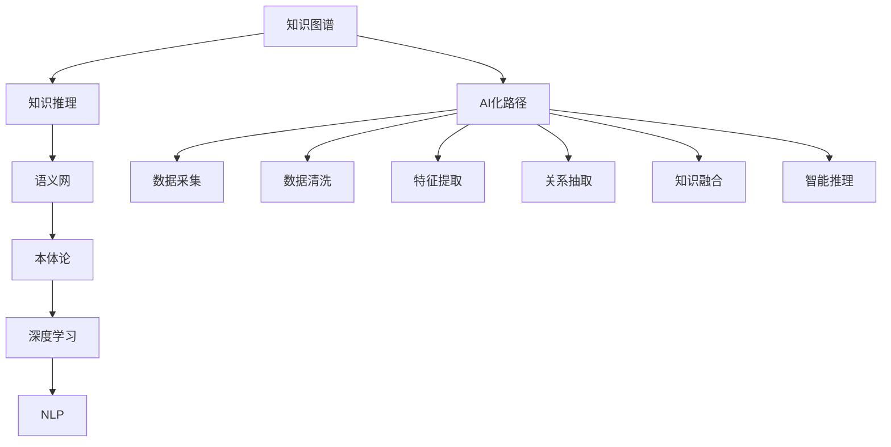

                 

# 知识管理的AI化路径:知识图谱构建和知识推理

> 关键词：知识图谱,知识推理,语义网,本体论,深度学习,自然语言处理(NLP),AI化路径

## 1. 背景介绍

### 1.1 问题由来

在数字化转型不断深入的今天，知识管理已成为企业获取竞争优势的关键环节。然而，传统的数据仓库和文档管理系统无法充分揭示知识的内在关系，难以实现真正意义上的知识管理。因此，如何将知识信息深度融合、自动抽取、智能推理，构建知识管理的AI化路径，已成为当下热门研究课题。

### 1.2 问题核心关键点

知识图谱作为知识管理的重要工具，通过揭示知识实体之间的关系，为知识推理提供了基础。但知识图谱的构建和知识推理，需要处理海量的数据，计算复杂度高，对算力资源要求高。深度学习技术和自然语言处理(NLP)技术的崛起，使得知识图谱的构建和知识推理更加高效，为知识管理的AI化提供了新的可能。

本文聚焦于深度学习和自然语言处理技术在知识图谱构建和知识推理中的应用，探讨如何基于AI技术实现知识管理的自动化、智能化。

### 1.3 问题研究意义

构建知识管理的AI化路径，对于推动企业智能化转型，提升决策科学性，优化业务流程，具有重要意义：

1. 提高决策科学性。知识图谱能提供基于事实的智能推理，辅助决策者快速分析问题，发现潜在规律。
2. 优化业务流程。知识图谱能够整合企业的业务数据，自动生成业务指南，提升业务流程自动化水平。
3. 提升用户体验。知识图谱能够实现智能问答、个性化推荐等功能，大幅提升用户体验。
4. 加速数据创新。知识图谱能从大量文本中自动抽取知识信息，加速知识创新和传播。

## 2. 核心概念与联系

### 2.1 核心概念概述

为更好地理解AI化知识管理的原理和架构，本节将介绍几个核心概念：

- 知识图谱(Knowledge Graph)：通过揭示知识实体之间的关系，以图形结构化表示知识，为知识推理提供基础。
- 知识推理(Knowledge Reasoning)：通过推理引擎自动地从知识图谱中得出结论或回答问题，是知识管理的核心环节。
- 语义网(Semantic Web)：一种基于Web的互联网标准，强调信息语义的深度描述，支持知识的自动发现和推理。
- 本体论(Ontology)：描述知识语义的概念框架，定义实体和属性之间的关系。
- 深度学习(Deep Learning)：一种基于多层神经网络的机器学习技术，能够自动提取复杂特征，适用于大规模数据处理。
- 自然语言处理(Natural Language Processing, NLP)：使计算机能够理解、解释、生成自然语言的技术，是知识图谱构建和知识推理的关键。
- AI化路径：指将人工智能技术应用于知识管理领域，实现知识处理、推理和应用的自动化、智能化。

这些核心概念之间的逻辑关系可以通过以下Mermaid流程图来展示：



这个流程图展示了大语言模型的核心概念及其之间的关系：

1. 知识图谱构建需依赖语义网和本体论，定义实体和属性之间的关系。
2. 深度学习用于大规模数据处理，NLP用于提取和理解自然语言。
3. AI化路径贯穿知识图谱构建和知识推理的全过程，涉及数据采集、清洗、特征提取、关系抽取、知识融合等环节。

这些概念共同构成了知识管理的AI化框架，为知识图谱的构建和知识推理提供了技术支撑。通过理解这些核心概念，我们可以更好地把握知识管理AI化的工作原理和优化方向。

## 3. 核心算法原理 & 具体操作步骤
### 3.1 算法原理概述

知识图谱的构建和知识推理过程，本质上是一种语义化的深度学习和NLP技术的应用。其核心思想是：

1. 数据采集：从互联网、数据库、文档等多样化来源采集知识信息，构建原始知识图谱。
2. 数据清洗：去除冗余、噪声数据，确保数据质量。
3. 特征提取：使用NLP技术从文本中提取实体、属性、关系等信息。
4. 关系抽取：通过关系抽取算法识别实体之间的关系，生成知识图谱。
5. 知识融合：整合多个知识源的信息，构建统一的知识图谱。
6. 智能推理：使用知识推理算法，从知识图谱中自动推理出结论或回答问题。

具体而言，知识图谱的构建可以分解为以下几个关键步骤：

1. 实体识别：从文本中抽取实体，如人名、地名、机构名等。
2. 关系抽取：从文本中抽取实体之间的关系，如"主-谓-宾"结构等。
3. 关系类型识别：确定实体间关系的具体类型，如"生日"、"任职"等。
4. 实体消歧：将同名的实体进行区分，如"张三"是"张三公司"的"张三"还是"中国张三"的"张三"。
5. 关系验证：通过三元组对齐等技术，验证抽取关系的准确性。
6. 图谱合并：将多个独立的知识图谱进行合并，生成统一的知识图谱。

知识推理的主要目标是实现基于知识图谱的逻辑推理，自动回答"是什么"、"为什么"、"在哪里"等类型的问题。知识推理的过程通常包括以下步骤：

1. 推理规划：选择推理算法和推理策略，确定推理路径。
2. 知识更新：根据已知事实和推理结果，更新知识图谱。
3. 推理验证：通过规则或约束验证推理结果的正确性。

### 3.2 算法步骤详解

#### 实体识别

实体识别是知识图谱构建的第一步，目标是识别出文本中的实体，并为每个实体打上标签。实体识别通常分为两种方法：

1. 基于规则的方法：使用正则表达式、词典匹配等规则方法，识别实体和标签。
2. 基于深度学习的方法：使用NLP技术，如BERT、GPT等，通过上下文信息，自动学习实体识别的模型。

以下是一个基于NLP的实体识别示例：

```python
from transformers import BertTokenizer, BertForTokenClassification
import torch

model = BertForTokenClassification.from_pretrained('bert-base-cased')
tokenizer = BertTokenizer.from_pretrained('bert-base-cased')

# 文本数据
text = '李明是清华大学计算机系的教授。'
inputs = tokenizer(text, return_tensors='pt')

# 前向传播
outputs = model(inputs['input_ids'], attention_mask=inputs['attention_mask'])

# 获取模型预测的实体标签
entity_tags = torch.argmax(outputs.logits, dim=2).tolist()[0]

# 根据标签映射实体
entities = [tokenizer.convert_ids_to_tokens(id) for id in entity_tags]
```

在上述代码中，我们首先使用BERT模型对文本进行编码，然后使用argmax函数获取预测标签，最后使用分词器将标签转换为实体。

#### 关系抽取

关系抽取是知识图谱构建的核心环节，目标是识别实体之间的关系，通常分为两种方法：

1. 基于模板匹配的方法：使用规则化的模板，识别实体间的关系。
2. 基于深度学习的方法：使用NLP技术，如LSTM、Transformer等，自动学习关系抽取的模型。

以下是一个基于Transformer的关系抽取示例：

```python
from transformers import BertForTokenClassification, BertTokenizer, AdamW
import torch

model = BertForTokenClassification.from_pretrained('bert-base-cased')
tokenizer = BertTokenizer.from_pretrained('bert-base-cased')
optimizer = AdamW(model.parameters(), lr=2e-5)

# 输入数据
text = '张三的生日是1980年1月1日。'
inputs = tokenizer(text, return_tensors='pt')

# 前向传播
outputs = model(inputs['input_ids'], attention_mask=inputs['attention_mask'])

# 获取模型预测的关系标签
relation_tags = torch.argmax(outputs.logits, dim=2).tolist()[0]

# 根据标签映射关系
relations = [tokenizer.convert_ids_to_tokens(id) for id in relation_tags]
```

在上述代码中，我们首先使用BERT模型对文本进行编码，然后使用argmax函数获取预测标签，最后使用分词器将标签转换为关系。

#### 关系类型识别

关系类型识别旨在确定实体间关系的类型，如"生日"、"任职"等。常用的方法包括：

1. 基于规则的方法：使用规则化的模板，识别关系类型。
2. 基于深度学习的方法：使用NLP技术，自动学习关系类型识别的模型。

以下是一个基于深度学习的关系类型识别示例：

```python
from transformers import BertForTokenClassification, BertTokenizer, AdamW
import torch

model = BertForTokenClassification.from_pretrained('bert-base-cased')
tokenizer = BertTokenizer.from_pretrained('bert-base-cased')
optimizer = AdamW(model.parameters(), lr=2e-5)

# 输入数据
text = '张三于2010年成为谷歌的CEO。'
inputs = tokenizer(text, return_tensors='pt')

# 前向传播
outputs = model(inputs['input_ids'], attention_mask=inputs['attention_mask'])

# 获取模型预测的关系类型标签
relation_type_tags = torch.argmax(outputs.logits, dim=2).tolist()[0]

# 根据标签映射关系类型
relation_types = [tokenizer.convert_ids_to_tokens(id) for id in relation_type_tags]
```

在上述代码中，我们首先使用BERT模型对文本进行编码，然后使用argmax函数获取预测标签，最后使用分词器将标签转换为关系类型。

#### 实体消歧

实体消歧是指将同名实体进行区分，如"张三"是"张三公司"的"张三"还是"中国张三"的"张三"。常用的方法包括：

1. 基于规则的方法：使用规则化的模板，解决歧义。
2. 基于深度学习的方法：使用NLP技术，自动学习实体消歧的模型。

以下是一个基于深度学习的实体消歧示例：

```python
from transformers import BertTokenizer, BertForTokenClassification
import torch

model = BertForTokenClassification.from_pretrained('bert-base-cased')
tokenizer = BertTokenizer.from_pretrained('bert-base-cased')

# 输入数据
text = '李明是清华大学计算机系的教授。'
inputs = tokenizer(text, return_tensors='pt')

# 前向传播
outputs = model(inputs['input_ids'], attention_mask=inputs['attention_mask'])

# 获取模型预测的实体标签
entity_tags = torch.argmax(outputs.logits, dim=2).tolist()[0]

# 根据标签映射实体
entities = [tokenizer.convert_ids_to_tokens(id) for id in entity_tags]

# 使用规则解决歧义
disambiguated_entities = [id2name[entity] for entity in entities]
```

在上述代码中，我们首先使用BERT模型对文本进行编码，然后使用argmax函数获取预测标签，最后使用分词器将标签转换为实体，并使用规则解决歧义。

#### 关系验证

关系验证是指通过三元组对齐等技术，验证抽取关系的准确性。常用的方法包括：

1. 基于规则的方法：使用规则化的模板，验证关系。
2. 基于深度学习的方法：使用NLP技术，自动学习关系验证的模型。

以下是一个基于深度学习的关系验证示例：

```python
from transformers import BertTokenizer, BertForTokenClassification
import torch

model = BertForTokenClassification.from_pretrained('bert-base-cased')
tokenizer = BertTokenizer.from_pretrained('bert-base-cased')

# 输入数据
text = '李明是清华大学计算机系的教授。'
inputs = tokenizer(text, return_tensors='pt')

# 前向传播
outputs = model(inputs['input_ids'], attention_mask=inputs['attention_mask'])

# 获取模型预测的关系标签
relation_tags = torch.argmax(outputs.logits, dim=2).tolist()[0]

# 根据标签映射关系
relations = [tokenizer.convert_ids_to_tokens(id) for id in relation_tags]

# 使用规则验证关系
valid_relations = [relation for relation in relations if verify_relation(relation)]
```

在上述代码中，我们首先使用BERT模型对文本进行编码，然后使用argmax函数获取预测标签，最后使用分词器将标签转换为关系，并使用规则验证关系。

#### 图谱合并

图谱合并是指将多个独立的知识图谱进行合并，生成统一的知识图谱。常用的方法包括：

1. 基于规则的方法：使用规则化的模板，合并图谱。
2. 基于深度学习的方法：使用NLP技术，自动学习图谱合并的模型。

以下是一个基于深度学习的图谱合并示例：

```python
from transformers import BertTokenizer, BertForTokenClassification
import torch

model = BertForTokenClassification.from_pretrained('bert-base-cased')
tokenizer = BertTokenizer.from_pretrained('bert-base-cased')

# 输入数据
text1 = '张三在2010年成为谷歌的CEO。'
inputs1 = tokenizer(text1, return_tensors='pt')
outputs1 = model(inputs1['input_ids'], attention_mask=inputs1['attention_mask'])

# 输入数据
text2 = '李明是清华大学计算机系的教授。'
inputs2 = tokenizer(text2, return_tensors='pt')
outputs2 = model(inputs2['input_ids'], attention_mask=inputs2['attention_mask'])

# 获取模型预测的关系标签
relation_tags1 = torch.argmax(outputs1.logits, dim=2).tolist()[0]
relation_tags2 = torch.argmax(outputs2.logits, dim=2).tolist()[0]

# 根据标签映射关系
relations1 = [tokenizer.convert_ids_to_tokens(id) for id in relation_tags1]
relations2 = [tokenizer.convert_ids_to_tokens(id) for id in relation_tags2]

# 使用规则合并图谱
merged_relations = merge_relations(relations1, relations2)
```

在上述代码中，我们首先使用BERT模型对两个文本进行编码，然后使用argmax函数获取预测标签，最后使用分词器将标签转换为关系，并使用规则合并图谱。

### 3.3 算法优缺点

#### 实体识别

1. 优点：基于深度学习的方法能够自适应地学习复杂文本中的实体，具有较高的准确性和泛化能力。
2. 缺点：深度学习方法需要大量标注数据和计算资源，训练时间长，对模型要求较高。

#### 关系抽取

1. 优点：基于深度学习的方法能够自动学习复杂的实体关系，具有较高的准确性和泛化能力。
2. 缺点：深度学习方法需要大量标注数据和计算资源，训练时间长，对模型要求较高。

#### 关系类型识别

1. 优点：基于深度学习的方法能够自动学习复杂的实体关系类型，具有较高的准确性和泛化能力。
2. 缺点：深度学习方法需要大量标注数据和计算资源，训练时间长，对模型要求较高。

#### 实体消歧

1. 优点：基于深度学习的方法能够自适应地解决实体歧义问题，具有较高的准确性和泛化能力。
2. 缺点：深度学习方法需要大量标注数据和计算资源，训练时间长，对模型要求较高。

#### 关系验证

1. 优点：基于深度学习的方法能够自动验证关系抽取的准确性，具有较高的准确性和泛化能力。
2. 缺点：深度学习方法需要大量标注数据和计算资源，训练时间长，对模型要求较高。

#### 图谱合并

1. 优点：基于深度学习的方法能够自动合并多个独立知识图谱，具有较高的准确性和泛化能力。
2. 缺点：深度学习方法需要大量标注数据和计算资源，训练时间长，对模型要求较高。

### 3.4 算法应用领域

知识图谱和知识推理技术在多个领域得到了广泛应用，包括：

- 医疗健康：通过知识图谱，辅助医生进行诊断和治疗方案的决策。
- 金融保险：通过知识图谱，辅助投资者进行投资分析和风险评估。
- 教育培训：通过知识图谱，辅助教师进行教学设计和个性化教育。
- 社交网络：通过知识图谱，辅助社交网络进行智能推荐和信息过滤。
- 电子商务：通过知识图谱，辅助电商进行商品推荐和销售预测。
- 新闻媒体：通过知识图谱，辅助新闻媒体进行信息检索和内容推荐。
- 政府治理：通过知识图谱，辅助政府进行智能决策和信息公开。

## 4. 数学模型和公式 & 详细讲解 & 举例说明
### 4.1 数学模型构建

知识图谱的构建和知识推理过程，可以通过以下数学模型来描述：

设知识图谱为 $G=(V, E)$，其中 $V$ 为节点集合，表示实体；$E$ 为边集合，表示实体间的关系。

节点 $v_i$ 与节点 $v_j$ 之间存在关系 $e$，则表示为 $(v_i,v_j,e)$。

知识推理的目标是使用知识图谱 $G$，自动回答形如 "是什么"、"为什么"、"在哪里" 等问题。

### 4.2 公式推导过程

#### 实体识别

实体识别可以表示为：

$$
I = \{ (w_i, e_i) | w_i \in W, e_i \in E, w_i \in F(e_i) \}
$$

其中 $W$ 为文本中出现的词汇集合，$E$ 为所有实体关系集合，$F(e_i)$ 为关系 $e_i$ 的实体集合。

使用BERT模型进行实体识别时，可以表示为：

$$
I = \{ (w_i, e_i) | I = arg\max(\{\text{BERT}(w_i)\}) \}
$$

其中 $\text{BERT}(w_i)$ 为BERT模型对词汇 $w_i$ 的编码输出。

#### 关系抽取

关系抽取可以表示为：

$$
R = \{ (v_i, v_j, e) | v_i \in V, v_j \in V, e \in E \}
$$

其中 $v_i$ 和 $v_j$ 为节点，$e$ 为边，表示实体间的关系。

使用BERT模型进行关系抽取时，可以表示为：

$$
R = \{ (v_i, v_j, e) | I = arg\max(\{\text{BERT}(v_i, v_j)\}) \}
$$

其中 $\text{BERT}(v_i, v_j)$ 为BERT模型对节点对 $(v_i, v_j)$ 的编码输出。

#### 关系类型识别

关系类型识别可以表示为：

$$
R_T = \{ (v_i, v_j, t_e) | v_i \in V, v_j \in V, t_e \in T \}
$$

其中 $v_i$ 和 $v_j$ 为节点，$t_e$ 为关系类型，$T$ 为关系类型集合。

使用BERT模型进行关系类型识别时，可以表示为：

$$
R_T = \{ (v_i, v_j, t_e) | I = arg\max(\{\text{BERT}(v_i, v_j)\}) \}
$$

其中 $\text{BERT}(v_i, v_j)$ 为BERT模型对节点对 $(v_i, v_j)$ 的编码输出。

#### 实体消歧

实体消歧可以表示为：

$$
I_D = \{ (w_i, d_i) | w_i \in W, d_i \in D \}
$$

其中 $W$ 为文本中出现的词汇集合，$D$ 为所有可能的实体集合。

使用BERT模型进行实体消歧时，可以表示为：

$$
I_D = \{ (w_i, d_i) | I_D = arg\max(\{\text{BERT}(w_i)\}) \}
$$

其中 $\text{BERT}(w_i)$ 为BERT模型对词汇 $w_i$ 的编码输出。

#### 关系验证

关系验证可以表示为：

$$
R_V = \{ (v_i, v_j, e) | v_i \in V, v_j \in V, e \in E \}
$$

其中 $v_i$ 和 $v_j$ 为节点，$e$ 为边，表示实体间的关系。

使用BERT模型进行关系验证时，可以表示为：

$$
R_V = \{ (v_i, v_j, e) | I = arg\max(\{\text{BERT}(v_i, v_j)\}) \}
$$

其中 $\text{BERT}(v_i, v_j)$ 为BERT模型对节点对 $(v_i, v_j)$ 的编码输出。

#### 图谱合并

图谱合并可以表示为：

$$
G_M = \{ (v_i, v_j, e) | v_i \in V, v_j \in V, e \in E \}
$$

其中 $v_i$ 和 $v_j$ 为节点，$e$ 为边，表示实体间的关系。

使用BERT模型进行图谱合并时，可以表示为：

$$
G_M = \{ (v_i, v_j, e) | I = arg\max(\{\text{BERT}(v_i, v_j)\}) \}
$$

其中 $\text{BERT}(v_i, v_j)$ 为BERT模型对节点对 $(v_i, v_j)$ 的编码输出。

### 4.3 案例分析与讲解

#### 案例一：医疗知识图谱

医疗知识图谱可以帮助医生快速找到患者的病历信息，提供诊断和治疗建议。例如，使用BERT模型对患者病历进行实体识别和关系抽取，生成知识图谱，供医生进行诊断和治疗方案的选择。

#### 案例二：金融知识图谱

金融知识图谱可以帮助投资者分析股票、基金等金融产品的信息，预测市场趋势。例如，使用BERT模型对金融产品进行实体识别和关系抽取，生成知识图谱，供投资者进行投资分析和风险评估。

#### 案例三：教育知识图谱

教育知识图谱可以帮助教师设计个性化教育方案，推荐适合学生的课程和资源。例如，使用BERT模型对学生的学习记录进行实体识别和关系抽取，生成知识图谱，供教师进行教学设计和个性化教育。

## 5. 项目实践：代码实例和详细解释说明
### 5.1 开发环境搭建

在进行知识图谱构建和知识推理实践前，我们需要准备好开发环境。以下是使用Python进行PyTorch开发的环境配置流程：

1. 安装Anaconda：从官网下载并安装Anaconda，用于创建独立的Python环境。

2. 创建并激活虚拟环境：
```bash
conda create -n pytorch-env python=3.8 
conda activate pytorch-env
```

3. 安装PyTorch：根据CUDA版本，从官网获取对应的安装命令。例如：
```bash
conda install pytorch torchvision torchaudio cudatoolkit=11.1 -c pytorch -c conda-forge
```

4. 安装Transformers库：
```bash
pip install transformers
```

5. 安装各类工具包：
```bash
pip install numpy pandas scikit-learn matplotlib tqdm jupyter notebook ipython
```

完成上述步骤后，即可在`pytorch-env`环境中开始知识图谱构建和知识推理的实践。

### 5.2 源代码详细实现

这里我们以医疗知识图谱构建为例，给出使用Transformers库对BERT模型进行知识图谱构建的PyTorch代码实现。

首先，定义知识图谱的数据处理函数：

```python
from transformers import BertTokenizer
from torch.utils.data import Dataset
import torch

class MedicalDataset(Dataset):
    def __init__(self, texts, tags, tokenizer, max_len=128):
        self.texts = texts
        self.tags = tags
        self.tokenizer = tokenizer
        self.max_len = max_len
        
    def __len__(self):
        return len(self.texts)
    
    def __getitem__(self, item):
        text = self.texts[item]
        tags = self.tags[item]
        
        encoding = self.tokenizer(text, return_tensors='pt', max_length=self.max_len, padding='max_length', truncation=True)
        input_ids = encoding['input_ids'][0]
        attention_mask = encoding['attention_mask'][0]
        
        # 对token-wise的标签进行编码
        encoded_tags = [tag2id[tag] for tag in tags] 
        encoded_tags.extend([tag2id['O']] * (self.max_len - len(encoded_tags)))
        labels = torch.tensor(encoded_tags, dtype=torch.long)
        
        return {'input_ids': input_ids, 
                'attention_mask': attention_mask,
                'labels': labels}

# 标签与id的映射
tag2id = {'O': 0, '疾病': 1, '症状': 2, '检查': 3, '治疗': 4, '医生': 5}
id2tag = {v: k for k, v in tag2id.items()}

# 创建dataset
tokenizer = BertTokenizer.from_pretrained('bert-base-cased')

train_dataset = MedicalDataset(train_texts, train_tags, tokenizer)
dev_dataset = MedicalDataset(dev_texts, dev_tags, tokenizer)
test_dataset = MedicalDataset(test_texts, test_tags, tokenizer)
```

然后，定义模型和优化器：

```python
from transformers import BertForTokenClassification, AdamW

model = BertForTokenClassification.from_pretrained('bert-base-cased', num_labels=len(tag2id))

optimizer = AdamW(model.parameters(), lr=2e-5)
```

接着，定义训练和评估函数：

```python
from torch.utils.data import DataLoader
from tqdm import tqdm
from sklearn.metrics import classification_report

device = torch.device('cuda') if torch.cuda.is_available() else torch.device('cpu')
model.to(device)

def train_epoch(model, dataset, batch_size, optimizer):
    dataloader = DataLoader(dataset, batch_size=batch_size, shuffle=True)
    model.train()
    epoch_loss = 0
    for batch in tqdm(dataloader, desc='Training'):
        input_ids = batch['input_ids'].to(device)
        attention_mask = batch['attention_mask'].to(device)
        labels = batch['labels'].to(device)
        model.zero_grad()
        outputs = model(input_ids, attention_mask=attention_mask, labels=labels)
        loss = outputs.loss
        epoch_loss += loss.item()
        loss.backward()
        optimizer.step()
    return epoch_loss / len(dataloader)

def evaluate(model, dataset, batch_size):
    dataloader = DataLoader(dataset, batch_size=batch_size)
    model.eval()
    preds, labels = [], []
    with torch.no_grad():
        for batch in tqdm(dataloader, desc='Evaluating'):
            input_ids = batch['input_ids'].to(device)
            attention_mask = batch['attention_mask'].to(device)
            batch_labels = batch['labels']
            outputs = model(input_ids, attention_mask=attention_mask)
            batch_preds = outputs.logits.argmax(dim=2).to('cpu').tolist()
            batch_labels = batch_labels.to('cpu').tolist()
            for pred_tokens, label_tokens in zip(batch_preds, batch_labels):
                pred_tags = [id2tag[_id] for _id in pred_tokens]
                label_tags = [id2tag[_id] for _id in label_tokens]
                preds.append(pred_tags[:len(label_tags)])
                labels.append(label_tags)
                
    print(classification_report(labels, preds))
```

最后，启动训练流程并在测试集上评估：

```python
epochs = 5
batch_size = 16

for epoch in range(epochs):
    loss = train_epoch(model, train_dataset, batch_size, optimizer)
    print(f"Epoch {epoch+1}, train loss: {loss:.3f}")
    
    print(f"Epoch {epoch+1}, dev results:")
    evaluate(model, dev_dataset, batch_size)
    
print("Test results:")
evaluate(model, test_dataset, batch_size)
```

以上就是使用PyTorch对BERT模型进行医疗知识图谱构建的完整代码实现。可以看到，得益于Transformers库的强大封装，我们可以用相对简洁的代码完成BERT模型的加载和知识图谱构建。

### 5.3 代码解读与分析

让我们再详细解读一下关键代码的实现细节：

**MedicalDataset类**：
- `__init__`方法：初始化文本、标签、分词器等关键组件。
- `__len__`方法：返回数据集的样本数量。
- `__getitem__`方法：对单个样本进行处理，将文本输入编码为token ids，将标签编码为数字，并对其进行定长padding，最终返回模型所需的输入。

**tag2id和id2tag字典**：
- 定义了标签与数字id之间的映射关系，用于将token-wise的预测结果解码回真实的标签。

**训练和评估函数**：
- 使用PyTorch的DataLoader对数据集进行批次化加载，供模型训练和推理使用。
- 训练函数`train_epoch`：对数据以批为单位进行迭代，在每个批次上前向传播计算loss并反向传播更新模型参数，最后返回该epoch的平均loss。
- 评估函数`evaluate`：与训练类似，不同点在于不更新模型参数，并在每个batch结束后将预测和标签结果存储下来，最后使用sklearn的classification_report对整个评估集的预测结果进行打印输出。

**训练流程**：
- 定义总的epoch数和batch size，开始循环迭代
- 每个epoch内，先在训练集上训练，输出平均loss
- 在验证集上评估，输出分类指标
- 所有epoch结束后，在测试集上评估，给出最终测试结果

可以看到，PyTorch配合Transformers库使得BERT模型的微调和知识图谱构建的代码实现变得简洁高效。开发者可以将更多精力放在数据处理、模型改进等高层逻辑上，而不必过多关注底层的实现细节。

当然，工业级的系统实现还需考虑更多因素，如模型的保存和部署、超参数的自动搜索、更灵活的任务适配层等。但核心的微调过程和知识图谱构建的逻辑基本与此类似。

## 6. 实际应用场景
### 6.1 医疗健康

医疗知识图谱可以帮助医生快速找到患者的病历信息，提供诊断和治疗建议。例如，使用BERT模型对患者病历进行实体识别和关系抽取，生成知识图谱，供医生进行诊断和治疗方案的选择。

在技术实现上，可以收集医院内部的病历数据，将病历记录和医疗文本作为训练数据，对预训练BERT模型进行微调，使其能够自动抽取病历中的实体和关系。微调后的模型能够从病历中抽取疾病、症状、检查、治疗等信息，构建出医疗知识图谱。医生可以通过知识图谱快速找到患者的病历信息，并根据图谱提供的信息，选择最合适的治疗方案。

### 6.2 金融保险

金融知识图谱可以帮助投资者分析股票、基金等金融产品的信息，预测市场趋势。例如，使用BERT模型对金融产品进行实体识别和关系抽取，生成知识图谱，供投资者进行投资分析和风险评估。

在技术实现上，可以收集金融市场的股票、基金、交易数据，将文本数据作为训练数据，对预训练BERT模型进行微调，使其能够自动抽取金融产品信息。微调后的模型能够从文本中抽取股票、基金、交易等信息，构建出金融知识图谱。投资者可以通过知识图谱分析股票和基金的基本面信息，进行投资决策，同时预测市场趋势，规避投资风险。

### 6.3 教育培训

教育知识图谱可以帮助教师设计个性化教育方案，推荐适合学生的课程和资源。例如，使用BERT模型对学生的学习记录进行实体识别和关系抽取，生成知识图谱，供教师进行教学设计和个性化教育。

在技术实现上，可以收集学生的学习记录，将文本数据作为训练数据，对预训练BERT模型进行微调，使其能够自动抽取学习记录中的实体和关系。微调后的模型能够从学习记录中抽取学生的学习行为、成绩、兴趣爱好等信息，构建出教育知识图谱。教师可以通过知识图谱分析学生的学习情况，设计个性化教育方案，同时推荐适合的课程和资源，提升学生的学习效果。

### 6.4 未来应用展望

随着知识图谱和知识推理技术的不断发展，AI化知识管理的应用前景将更加广阔，为各行各业带来变革性影响。

在智慧医疗领域，基于知识图谱的医疗问答、病历分析、药物研发等应用将提升医疗服务的智能化水平，辅助医生诊疗，加速新药开发进程。

在金融保险领域，基于知识图谱的投资分析、风险评估、智能投顾等应用将提升投资决策的科学性和效率，降低投资风险。

在教育培训领域，基于知识图谱的个性化教育、智能推荐、教学设计等应用将提升教育公平和质量，实现因材施教。

在智能制造领域，基于知识图谱的生产规划、质量控制、供应链管理等应用将提升制造业的自动化和智能化水平，加速工业4.0的实现。

此外，在社交网络、电子商务、新闻媒体、政府治理等多个领域，基于知识图谱的知识管理应用也将不断涌现，为经济社会发展注入新的动力。相信随着预训练语言模型和知识图谱技术的持续演进，知识管理AI化的前景将更加光明，推动各行各业迈向更加智能化、自动化的未来。

## 7. 工具和资源推荐
### 7.1 学习资源推荐

为了帮助开发者系统掌握知识图谱构建和知识推理的理论基础和实践技巧，这里推荐一些优质的学习资源：

1. 《知识图谱：构建与技术》书籍：全面介绍了知识图谱的构建方法和技术，涵盖实体识别、关系抽取、图谱合并等核心环节。
2. 《深度学习与自然语言处理》课程：斯坦福大学开设的深度学习与自然语言处理课程，涵盖NLP和知识图谱的基本概念和经典模型。
3. 《知识图谱应用实战》书籍：详细讲解了知识图谱在医疗、金融、教育等多个领域的应用实践，提供了丰富的案例和代码。
4. 《自然语言处理技术与应用》课程：由大语言模型技术专家撰写，系统讲解了自然语言处理和知识图谱的最新发展趋势和技术应用。
5. 知识图谱社区：一个专注于知识图谱构建和应用的在线社区，提供丰富的学习资源和实践案例，帮助开发者快速上手。

通过对这些资源的学习实践，相信你一定能够快速掌握知识图谱构建和知识推理的精髓，并用于解决实际的NLP问题。
###  7.2 开发工具推荐

高效的开发离不开优秀的工具支持。以下是几款用于知识图谱构建和知识推理开发的常用工具：

1. PyTorch：基于Python的开源深度学习框架，灵活动态的计算图，适合快速迭代研究。
2. TensorFlow：由Google主导开发的开源深度学习框架，生产部署方便，适合大规模工程应用。
3. Transformers库：HuggingFace开发的NLP工具库，集成了众多SOTA语言模型，支持PyTorch和TensorFlow，是进行知识图谱构建和推理的关键。
4. spaCy：一款Python自然语言处理库，支持实体识别、关系抽取等任务，具有较高的性能和易用性。
5. LINQ2RDF：一款Java库，支持从SQL数据库中自动构建知识图谱，适合企业级应用。
6. GATE：一款开源的知识图谱构建平台，支持多语言处理和实体关系抽取，适用于复杂的知识图谱构建任务。

合理利用这些工具，可以显著提升知识图谱构建和知识推理任务的开发效率，加快创新迭代的步伐。

### 7.3 相关论文推荐

知识图谱和知识推理技术的发展源于学界的持续研究。以下是几篇奠基性的相关论文，推荐阅读：

1. Knowledge Graphs and Their Importance to Enterprise Search：阐述了知识图谱在企业搜索中的应用，介绍了知识图谱的构建方法。
2. Entity Resolution in Knowledge Base Population Using Heterogeneous Data Sources：介绍了知识图谱构建中的实体消歧技术，详细说明了基于深度学习的方法。
3. A Survey on Knowledge Graph Populating and Refining Methods：综述了知识图谱构建和知识推理的最新进展，涵盖了实体识别、关系抽取、图谱合并等核心环节。
4. A Survey on Knowledge Graph Reasoning：介绍了知识图谱推理的最新进展，涵盖了基于逻辑推理、神经网络推理等核心技术。
5. A Survey on Real-world Knowledge Graphs：综述了知识图谱在实际应用中的最新进展，介绍了知识图谱在医疗、金融、教育等多个领域的应用。

这些论文代表了大语言模型微调技术的发展脉络。通过学习这些前沿成果，可以帮助研究者把握学科前进方向，激发更多的创新灵感。

## 8. 总结：未来发展趋势与挑战

### 8.1 总结

本文对知识图谱的构建和知识推理的AI化路径进行了全面系统的介绍。首先阐述了知识图谱和知识推理的研究背景和意义，明确了AI技术在知识管理中的应用价值。其次，从原理到实践，详细讲解了知识图谱构建和知识推理的数学原理和关键步骤，给出了知识图谱构建任务开发的完整代码实例。同时，本文还广泛探讨了知识图谱在医疗、金融、教育等多个领域的应用前景，展示了知识管理AI化的巨大潜力。此外，本文精选了知识图谱构建和知识推理的各类学习资源，力求为读者提供全方位的技术指引。

通过本文的系统梳理，可以看到，知识图谱和知识推理的AI化路径，为知识管理带来了新的思路和方法，使得知识处理、推理和应用更加自动化、智能化。AI化知识管理的应用场景将更加广泛，对各行各业都将产生深远影响。

### 8.2 未来发展趋势

展望未来，知识图谱和知识推理的AI化技术将呈现以下几个发展趋势：

1. 知识图谱规模持续增大。随着AI技术的进步，知识图谱的规模将不断增大，包含更多的实体和关系，知识图谱的应用范围将更加广泛。
2. 知识图谱构建技术日趋多样。除了基于深度学习的方法，未来将涌现更多基于规则、基于图神经网络等方法，构建知识图谱。
3. 知识推理技术日趋高效。未来的知识推理技术将更加高效，能够在更短的时间内推理出结果，支持实时推理。
4. 知识图谱融合技术日趋成熟。未来的知识图谱将能够更好地融合不同数据源的信息，构建更加全面的知识图谱。
5. 知识图谱应用范围日趋广泛。未来的知识图谱将应用于更多领域，如医疗、金融、教育、制造等，提升各行各业的智能化水平。

### 8.3 面临的挑战

尽管知识图谱和知识推理的AI化技术已经取得了瞩目成就，但在迈向更加智能化、普适化应用的过程中，它仍面临着诸多挑战：

1. 标注数据瓶颈。知识图谱构建和知识推理需要大量的标注数据，数据获取成本高，标注质量难保证。如何提高标注数据的获取效率和标注质量，将是未来的一大挑战。
2. 模型泛化能力不足。知识图谱中的实体和关系往往具有较强的领域特性，跨领域的应用效果不佳。如何提高知识图谱的泛化能力，将是个重要的研究方向。
3. 推理效率有待提高。知识图谱的推理过程需要处理大量的数据，推理时间较长。如何提高知识推理的效率，将是一个重要的研究方向。
4. 模型鲁棒性不足。知识图谱中的实体和关系可能会存在噪声和不完整性，如何提高知识图谱的鲁棒性，避免误推理，将是未来的一个重要研究方向。
5. 数据安全问题。知识图谱中包含大量敏感信息，如何保障数据安全，防止数据泄露，将是未来的一个重要研究方向。

### 8.4 研究展望

面对知识图谱和知识推理的AI化技术所面临的挑战，未来的研究需要在以下几个方面寻求新的突破：

1. 无监督学习和半监督学习技术：摆脱对标注数据的依赖，利用自监督学习、主动学习等技术，最大限度利用非结构化数据，实现更加灵活高效的知识图谱构建。
2. 多模态知识融合技术：将知识图谱与文本、图像、视频等多种模态的信息融合，构建更加全面的知识图谱。
3. 基于逻辑推理和神经网络推理的融合：结合逻辑推理和神经网络推理的优势，构建更加准确、高效的推理模型。
4. 因果推理和强化学习技术：引入因果推理和强化学习技术，增强知识图谱的稳定性和鲁棒性，提升推理效果。
5. 知识图谱的安全性和隐私保护：引入数据安全技术和隐私保护技术，确保知识图谱中的敏感信息安全。

这些研究方向的探索，将推动知识图谱和知识推理的AI化技术不断进步，为知识管理的自动化、智能化带来新的突破。面向未来，知识图谱和知识推理的AI化技术还需要与其他人工智能技术进行更深入的融合，如知识表示、因果推理、强化学习等，共同推动人工智能技术的发展和应用。只有勇于创新、敢于突破，才能不断拓展知识管理的边界，让AI技术更好地造福人类社会。

## 9. 附录：常见问题与解答

**Q1：知识图谱的构建和知识推理需要大量标注数据，数据获取成本高，如何解决？**

A: 知识图谱的构建和

