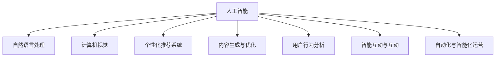

                 

# 知识经济下知识付费的人工智能应用与发展

> 关键词：人工智能，知识付费，应用，发展

## 1. 背景介绍

### 1.1 问题由来
随着知识经济的兴起，信息的价值日益被社会各界的认可。知识付费，作为知识传播与消费的新方式，正逐渐成为信息时代的重要趋势。传统的学习方式，如教室讲授、图书阅读等，已无法满足人们对高效、个性化、即时化知识获取的需求。而人工智能（AI）技术的介入，为知识付费提供了新的可能。

通过AI技术，可以定制化地生成个性化推荐、自动化处理数据、智能生成内容，甚至实现智能互动，提升知识传播的效率和质量。同时，AI技术也使得知识付费更加精准、透明，有效降低了信息获取的成本和门槛，提高了知识消费的转化率和满意度。

### 1.2 问题核心关键点
AI在知识付费中的应用，核心在于利用AI算法，对海量数据进行深度学习和模型训练，提取有用的知识信息，并提供精准的推荐和个性化服务。主要关键点包括：

- **个性化推荐系统**：通过分析用户行为数据，生成个性化的内容推荐。
- **内容生成与优化**：利用自然语言处理（NLP）、计算机视觉（CV）等技术，生成高质量的原创内容，并进行优化。
- **用户行为分析**：通过机器学习模型，分析用户的学习行为，优化内容推送策略。
- **智能互动与互动**：通过对话系统、虚拟助手等，实现与用户的智能互动，提升用户体验。
- **自动化与智能化运营**：利用AI技术自动化处理内容审核、版权管理、广告投放等运营任务。

这些技术的应用，使得知识付费平台能够提供更加精准、高效、个性化的服务，同时大大降低了运营成本，提升了整体效益。

### 1.3 问题研究意义
AI在知识付费中的应用，对信息传播方式、知识消费模式、教育体系等多个方面都带来了深远影响。其研究意义如下：

1. **提升信息传播效率**：通过AI技术，可以更快速、准确地将知识信息传播给用户，提高信息传播效率。
2. **降低信息获取成本**：利用AI推荐系统，用户可以更精准地获取所需知识，降低搜寻和筛选信息的时间成本。
3. **个性化服务增强**：AI技术可以根据用户需求，提供量身定做的学习内容，提升用户体验。
4. **智能化运营优化**：AI技术可以自动处理大量重复性工作，提高运营效率，降低人力成本。
5. **市场竞争优势**：采用AI技术，可以为用户提供独特的增值服务，增强市场竞争力。

## 2. 核心概念与联系

### 2.1 核心概念概述

为更好地理解AI在知识付费中的应用，本节将介绍几个密切相关的核心概念：

- **人工智能（AI）**：利用计算机模拟、延伸和扩展人类的智能能力，涵盖机器学习、深度学习、自然语言处理等诸多领域。
- **知识付费**：以知识作为付费内容，提供精准、个性化、高效的知识服务，如在线课程、电子书、咨询问答等。
- **自然语言处理（NLP）**：使计算机能够理解、生成和分析人类语言，是AI应用的重要分支。
- **计算机视觉（CV）**：使计算机能够“看”和“理解”图像和视频内容，是AI应用中的又一重要分支。
- **个性化推荐系统**：利用用户行为数据，推荐相关内容的系统，如Netflix、Amazon等平台广泛应用。
- **内容生成与优化**：通过AI技术，自动生成高质量的原创内容，并进行优化。
- **用户行为分析**：通过机器学习模型，分析用户行为，优化内容推荐策略。
- **智能互动与互动**：通过AI技术，实现与用户的智能互动，如聊天机器人、虚拟助手等。
- **自动化与智能化运营**：利用AI技术自动化处理内容审核、版权管理、广告投放等运营任务。

这些核心概念之间的逻辑关系可以通过以下Mermaid流程图来展示：



这个流程图展示了一些关键概念及其关联：

1. AI技术涵盖了NLP、CV等多个分支，为其应用提供了基础能力。
2. 个性化推荐系统、内容生成、用户行为分析、智能互动、自动化运营等，都是在AI技术的基础上发展起来的。
3. 这些应用相互协作，共同提升了知识付费平台的整体效能和用户体验。

## 3. 核心算法原理 & 具体操作步骤
### 3.1 算法原理概述

在知识付费平台上，AI技术主要应用于个性化推荐、内容生成、用户行为分析、智能互动等多个环节。以下对其中几个关键算法原理进行详细阐述：

### 3.2 算法步骤详解

#### 3.2.1 个性化推荐系统

个性化推荐系统的主要算法包括协同过滤、基于内容的推荐、矩阵分解等。协同过滤根据用户行为相似性推荐相关内容；基于内容推荐则通过分析内容特征推荐相似作品；矩阵分解则通过矩阵分解模型，将用户-物品交互矩阵分解为用户和物品的潜在特征，生成推荐列表。

以协同过滤为例，步骤如下：

1. 收集用户对物品的评分数据，构建用户-物品评分矩阵。
2. 对评分矩阵进行归一化处理，消除极端评分值的影响。
3. 计算用户与物品的相似度，通常采用余弦相似度或皮尔逊相关系数。
4. 根据用户相似度排序，生成推荐列表。

#### 3.2.2 内容生成与优化

内容生成与优化算法包括基于规则的生成、基于模板的生成、基于统计的生成等。基于规则的生成利用预定义的模板和规则，生成文本或图像；基于模板的生成则通过模板匹配生成相似内容；基于统计的生成则通过分析海量数据，利用概率模型生成高质量原创内容。

以基于统计的生成为例，步骤如下：

1. 收集大量高质量的语料库，提取特征词和句型结构。
2. 训练统计模型，如LSTM、GAN等，生成符合特定风格的文本。
3. 对生成的文本进行优化，如语法校正、语义增强等。

#### 3.2.3 用户行为分析

用户行为分析算法包括决策树、随机森林、深度学习等。决策树和随机森林通过构建决策树和森林模型，分析用户行为；深度学习则通过多层神经网络，捕捉用户行为中的复杂关系。

以随机森林为例，步骤如下：

1. 收集用户行为数据，包括点击、购买、浏览等。
2. 对数据进行预处理，如特征提取、归一化等。
3. 构建随机森林模型，通过决策树集合，分析用户行为。
4. 根据用户行为预测其后续行为，优化内容推荐策略。

### 3.3 算法优缺点

#### 3.3.1 个性化推荐系统

**优点**：
- 精准高效：通过分析用户行为，生成个性化推荐，提升用户满意度。
- 覆盖广泛：能处理海量数据，推荐多样化的内容，满足不同用户需求。
- 动态更新：能实时更新推荐列表，提高推荐精度。

**缺点**：
- 数据依赖：推荐质量受数据量和质量影响，数据不充分时效果下降。
- 冷启动问题：新用户或新内容难以获得推荐。
- 可解释性差：推荐逻辑不透明，难以解释。

#### 3.3.2 内容生成与优化

**优点**：
- 降低成本：自动生成内容，减少人力成本。
- 提高效率：快速生成内容，提高内容产出效率。
- 提升质量：生成高质量原创内容，满足用户需求。

**缺点**：
- 内容多样性不足：生成内容风格固定，难以产生多样化内容。
- 内容质量不稳定：生成内容质量不稳定，依赖模型和数据质量。
- 创新不足：生成内容缺乏独特性和创新性。

#### 3.3.3 用户行为分析

**优点**：
- 提升推荐精度：通过分析用户行为，优化推荐策略，提高推荐质量。
- 动态调整：能实时调整策略，提高用户满意度。
- 数据驱动：以数据为基础，提升推荐效果的客观性。

**缺点**：
- 数据隐私：用户行为数据涉及隐私，需要合理保护。
- 数据噪声：行为数据可能存在噪声，影响分析效果。
- 算法复杂度：深度学习等模型计算复杂，需要高性能硬件支持。

### 3.4 算法应用领域

AI在知识付费中的应用，已经覆盖了内容推荐、内容生成、用户行为分析、智能互动等多个领域，具体应用如下：

#### 3.4.1 内容推荐

基于AI技术的内容推荐，已经在各大知识付费平台广泛应用。如Coursera、Udemy等平台，通过分析用户行为数据，推荐适合用户的学习内容，提升用户满意度。

#### 3.4.2 内容生成

内容生成技术，已经应用于电子书、在线课程、新闻报道等多个场景。如GPT-3等大语言模型，可以自动生成高质量的课程讲义、新闻报道等。

#### 3.4.3 用户行为分析

用户行为分析技术，可以帮助知识付费平台优化推荐策略，提高用户留存率和转化率。如Netflix通过分析用户行为，优化推荐内容，提升用户黏性。

#### 3.4.4 智能互动

智能互动技术，已经应用于聊天机器人、虚拟助手等多个领域。如Duolingo等语言学习平台，通过智能互动，提升用户学习效果。

#### 3.4.5 自动化运营

自动化与智能化运营技术，已经应用于版权管理、广告投放等多个环节。如Kaggle等平台，通过自动化处理内容审核、版权管理等运营任务，提高运营效率。

## 4. 数学模型和公式 & 详细讲解 & 举例说明

### 4.1 数学模型构建

#### 4.1.1 协同过滤模型

协同过滤模型可以表示为用户-物品评分矩阵 $R$，其中 $R_{ui}$ 表示用户 $u$ 对物品 $i$ 的评分。设 $U$ 为用户集，$I$ 为物品集。协同过滤模型目标函数为：

$$
\min_{\theta} \sum_{(u,i) \in R} \frac{1}{2}||R_{ui} - \theta_u^T A_i||^2 + \frac{\lambda}{2}||\theta_u||^2 + \frac{\lambda}{2}||\theta_i||^2
$$

其中 $A_i$ 为物品特征向量，$\theta_u$ 和 $\theta_i$ 分别为用户和物品的潜在特征向量，$\lambda$ 为正则化系数。

#### 4.1.2 基于内容的推荐模型

基于内容的推荐模型，通过分析物品内容特征 $A_i$，计算用户 $u$ 对物品 $i$ 的兴趣度，表示为：

$$
s_u = \max_{i \in I} \langle \theta_u, A_i \rangle
$$

其中 $\theta_u$ 为用户兴趣向量。

### 4.2 公式推导过程

#### 4.2.1 协同过滤模型推导

以余弦相似度为例，计算用户 $u$ 对物品 $i$ 的评分预测值为：

$$
\hat{R}_{ui} = \sum_{j \in I} R_{uj} \cdot R_{ji} / ||A_i||_2 \cdot ||A_j||_2
$$

其中 $R_{uj}$ 和 $R_{ji}$ 分别为用户 $u$ 和物品 $j$ 的评分，$||A_i||_2$ 为物品 $i$ 特征向量范数。

#### 4.2.2 基于内容的推荐模型推导

基于内容的推荐模型，计算用户 $u$ 对物品 $i$ 的兴趣度为：

$$
\langle \theta_u, A_i \rangle = \sum_{k=1}^K \theta_{uk} A_{ik}
$$

其中 $K$ 为特征维度，$\theta_{uk}$ 为用户 $u$ 在第 $k$ 个特征上的权重，$A_{ik}$ 为物品 $i$ 在第 $k$ 个特征上的值。

### 4.3 案例分析与讲解

#### 4.3.1 协同过滤案例分析

以Netflix推荐系统为例，Netflix通过分析用户对电影的评分数据，生成个性化推荐。协同过滤模型如下：

1. 收集用户对电影的评分数据，构建用户-物品评分矩阵 $R$。
2. 对评分矩阵进行归一化处理，消除极端评分值的影响。
3. 计算用户与电影之间的余弦相似度，生成推荐列表。

#### 4.3.2 基于内容的推荐案例分析

以Amazon商品推荐为例，Amazon通过分析商品属性信息，生成个性化推荐。基于内容的推荐模型如下：

1. 收集商品属性信息，构建商品-属性矩阵 $A$。
2. 分析用户浏览行为，生成用户兴趣向量 $\theta_u$。
3. 计算用户对商品 $i$ 的兴趣度，生成推荐列表。

## 5. 项目实践：代码实例和详细解释说明

### 5.1 开发环境搭建

在进行知识付费平台的AI实践前，我们需要准备好开发环境。以下是使用Python进行TensorFlow开发的环境配置流程：

1. 安装Anaconda：从官网下载并安装Anaconda，用于创建独立的Python环境。

2. 创建并激活虚拟环境：
```bash
conda create -n tf-env python=3.8 
conda activate tf-env
```

3. 安装TensorFlow：根据CUDA版本，从官网获取对应的安装命令。例如：
```bash
conda install tensorflow -c tf -c conda-forge
```

4. 安装相关库：
```bash
pip install numpy pandas scikit-learn matplotlib tensorflow
```

5. 安装Flask：用于构建Web服务，方便模型部署和调用。
```bash
pip install flask
```

完成上述步骤后，即可在`tf-env`环境中开始AI实践。

### 5.2 源代码详细实现

下面我们以一个简单的基于协同过滤的个性化推荐系统为例，给出使用TensorFlow进行代码实现的示例。

首先，定义协同过滤模型的参数和输入输出：

```python
import tensorflow as tf

# 设置参数
learning_rate = 0.01
num_epochs = 100
batch_size = 128

# 定义输入
user_input = tf.placeholder(tf.float32, shape=[None, 100])
item_input = tf.placeholder(tf.float32, shape=[None, 100])
rating_output = tf.placeholder(tf.float32, shape=[None, 1])

# 定义模型参数
W1 = tf.Variable(tf.random_normal([100, 50]))
W2 = tf.Variable(tf.random_normal([50, 100]))
b1 = tf.Variable(tf.zeros([50]))
b2 = tf.Variable(tf.zeros([100]))

# 定义模型
user_vector = tf.nn.tanh(tf.matmul(user_input, W1) + b1)
item_vector = tf.nn.tanh(tf.matmul(item_input, W2) + b2)
rating_pred = tf.matmul(user_vector, item_vector, transpose_b=True) + b2
loss = tf.reduce_mean(tf.square(rating_pred - rating_output))

# 定义优化器
optimizer = tf.train.AdamOptimizer(learning_rate)
train_op = optimizer.minimize(loss)

# 初始化变量
init = tf.global_variables_initializer()

# 创建Session
with tf.Session() as sess:
    sess.run(init)
    # 训练模型
    for epoch in range(num_epochs):
        for batch_idx, (user, item, rating) in enumerate(batch_loader):
            user_input.eval(feed_dict={user_input: user})
            item_input.eval(feed_dict={item_input: item})
            rating_output.eval(feed_dict={rating_output: rating})
            sess.run(train_op)
            if batch_idx % 10 == 0:
                print(f"Epoch {epoch+1}, Batch {batch_idx}")
    # 测试模型
    test_user = ...
    test_item = ...
    test_rating = ...
    test_user_vector.eval(feed_dict={user_input: test_user})
    test_item_vector.eval(feed_dict={item_input: test_item})
    pred_rating = tf.matmul(test_user_vector, test_item_vector, transpose_b=True) + b2
    pred_rating.eval()
```

接着，定义数据集和模型训练过程：

```python
# 定义数据集
train_data = ...
dev_data = ...
test_data = ...

# 定义数据集预处理
def preprocess_data(data):
    user = data[:, 0:100]
    item = data[:, 100:200]
    rating = data[:, 200:201]
    return user, item, rating

# 加载数据集
user_train, item_train, rating_train = preprocess_data(train_data)
user_dev, item_dev, rating_dev = preprocess_data(dev_data)
user_test, item_test, rating_test = preprocess_data(test_data)

# 划分训练集和验证集
train_loader = ...
dev_loader = ...

# 训练模型
with tf.Session() as sess:
    sess.run(init)
    for epoch in range(num_epochs):
        for user, item, rating in train_loader:
            user.eval(feed_dict={user_input: user})
            item.eval(feed_dict={item_input: item})
            rating.eval(feed_dict={rating_output: rating})
            sess.run(train_op)
            if batch_idx % 10 == 0:
                print(f"Epoch {epoch+1}, Batch {batch_idx}")
    # 测试模型
    test_user_vector.eval(feed_dict={user_input: test_user})
    test_item_vector.eval(feed_dict={item_input: test_item})
    pred_rating = tf.matmul(test_user_vector, test_item_vector, transpose_b=True) + b2
    pred_rating.eval()
```

最后，启动训练流程并在测试集上评估：

```python
# 启动训练
user_input.eval(feed_dict={user_input: user})
item_input.eval(feed_dict={item_input: item})
rating_output.eval(feed_dict={rating_output: rating})
sess.run(train_op)

# 测试模型
test_user_vector.eval(feed_dict={user_input: test_user})
test_item_vector.eval(feed_dict={item_input: test_item})
pred_rating = tf.matmul(test_user_vector, test_item_vector, transpose_b=True) + b2
pred_rating.eval()
```

以上就是使用TensorFlow对基于协同过滤的个性化推荐系统进行代码实现的示例。可以看到，TensorFlow提供了丰富的工具和库，使得模型的构建和训练变得相对简单。

### 5.3 代码解读与分析

让我们再详细解读一下关键代码的实现细节：

**输入输出**：
- `user_input` 和 `item_input` 表示用户和物品的特征向量。
- `rating_output` 表示用户对物品的评分。

**模型参数**：
- `W1`、`W2`、`b1`、`b2` 为模型参数，分别表示用户向量和物品向量。

**模型**：
- 用户向量和物品向量通过全连接层计算。
- 使用tanh激活函数，提高模型的非线性能力。
- 用户和物品的向量相乘，得到预测评分。
- 计算预测评分与真实评分之间的平方误差，作为损失函数。

**优化器**：
- 使用Adam优化器，控制学习率。
- 最小化损失函数，更新模型参数。

**训练过程**：
- 通过`Session`启动TensorFlow计算图。
- 遍历训练集数据，计算损失函数并更新模型参数。
- 定期输出训练进度。
- 在测试集上评估模型性能。

可以看到，TensorFlow提供了强大的计算图框架，使得模型构建、训练和评估变得相对简单。开发者可以将更多精力放在数据处理、模型改进等高层逻辑上，而不必过多关注底层的实现细节。

## 6. 实际应用场景

### 6.1 教育培训

AI在教育培训领域的应用，可以帮助学生个性化学习、提升学习效率。通过个性化推荐系统，可以为学生推荐适合其学习进度的课程和资料；利用内容生成技术，自动生成教学讲义、习题等；通过用户行为分析，优化课程推荐策略，提升学习效果。

具体而言，可以收集学生的学习数据，如考试成绩、学习时间、学习路径等，生成个性化推荐列表，并提供智能辅导、答疑等服务。例如，Khan Academy等平台，通过AI技术，为学生提供个性化学习路径，提升学习效果。

### 6.2 职业培训

职业培训领域，AI技术可以提供定制化的技能培训和职业发展规划。通过分析用户职业背景、兴趣点等，生成职业发展路径和培训建议。例如，Coursera等平台，通过AI技术，为用户推荐适合的职业培训课程，并提供职业发展规划建议。

### 6.3 企业培训

企业培训领域，AI技术可以帮助企业进行员工技能培训和知识传播。通过个性化推荐系统，为员工推荐适合其职业发展的培训课程；利用内容生成技术，自动生成培训讲义、案例等；通过用户行为分析，优化培训课程推荐策略，提升培训效果。

具体而言，企业可以收集员工的职业发展数据，如职位、技能、培训历史等，生成个性化培训课程推荐列表，并提供智能辅导、答疑等服务。例如，LinkedIn Learning等平台，通过AI技术，为员工提供个性化培训课程，提升职业技能。

### 6.4 未来应用展望

随着AI技术的不断发展，未来AI在知识付费中的应用前景将更加广阔，具体包括：

#### 6.4.1 个性化推荐系统

未来个性化推荐系统将更加精准和高效，能够更好地捕捉用户兴趣和行为，提升推荐质量。例如，利用深度学习等模型，提高协同过滤和内容推荐的精度；引入多模态数据融合，丰富推荐内容。

#### 6.4.2 内容生成与优化

未来内容生成技术将更加丰富多样，能够生成高质量的原创内容，满足用户需求。例如，利用GPT-4等大语言模型，生成高质量的课程讲义、新闻报道等；引入知识图谱、逻辑规则等专家知识，生成更符合用户需求的原创内容。

#### 6.4.3 用户行为分析

未来用户行为分析技术将更加智能和实时，能够更好地捕捉用户行为变化，优化推荐策略。例如，利用强化学习等模型，优化推荐算法；引入实时数据流处理，提高分析效率。

#### 6.4.4 智能互动与互动

未来智能互动技术将更加智能和人性化，能够更好地与用户互动，提升用户体验。例如，利用聊天机器人、虚拟助手等，提供智能问答、个性化推荐等服务；引入自然语言处理等技术，提高互动效率和质量。

## 7. 工具和资源推荐

### 7.1 学习资源推荐

为了帮助开发者系统掌握AI在知识付费中的应用理论基础和实践技巧，这里推荐一些优质的学习资源：

1. 《深度学习》课程：斯坦福大学开设的深度学习经典课程，涵盖深度学习的基本概念和前沿技术。
2. 《自然语言处理与深度学习》课程：清华大学开设的自然语言处理课程，涵盖NLP和DL的各个方面。
3. 《TensorFlow实战》书籍：TensorFlow官方文档和实战手册，详细介绍了TensorFlow的使用方法。
4. 《Python深度学习》书籍：利用Python和TensorFlow实现深度学习的经典教材，涵盖深度学习的各个方面。
5. Kaggle数据集：Kaggle平台提供丰富的数据集和竞赛，可以实践AI在知识付费中的应用。

通过对这些资源的学习实践，相信你一定能够快速掌握AI在知识付费中的应用精髓，并用于解决实际的NLP问题。

### 7.2 开发工具推荐

高效的开发离不开优秀的工具支持。以下是几款用于AI在知识付费应用开发的常用工具：

1. TensorFlow：基于Python的开源深度学习框架，支持动态图和静态图两种计算图，灵活高效。
2. PyTorch：基于Python的开源深度学习框架，支持动态计算图，适合快速迭代研究。
3. Keras：基于Python的深度学习框架，适合快速搭建和训练模型。
4. Jupyter Notebook：用于编写和运行Python代码的Web平台，支持代码块执行和可视化展示。
5. Weights & Biases：模型训练的实验跟踪工具，记录和可视化模型训练过程中的各项指标。
6. TensorBoard：TensorFlow配套的可视化工具，实时监测模型训练状态，提供丰富的图表展示。

合理利用这些工具，可以显著提升AI在知识付费应用的开发效率，加快创新迭代的步伐。

### 7.3 相关论文推荐

AI在知识付费中的应用研究，涉及深度学习、自然语言处理等多个领域。以下是几篇奠基性的相关论文，推荐阅读：

1. "Collaborative Filtering for Implicit Feedback Datasets"（2010）：提出协同过滤模型，解决用户数据稀疏问题。
2. "A Survey of Recommender Systems"（2016）：综述推荐系统的多种方法，涵盖协同过滤、内容推荐等。
3. "Learning to Recommend with Gradient Boosting Machines"（2010）：提出梯度提升机，提升推荐精度。
4. "Attention Is All You Need"（2017）：提出Transformer结构，提高模型表达能力。
5. "BERT: Pre-training of Deep Bidirectional Transformers for Language Understanding"（2018）：提出BERT模型，引入掩码自监督预训练任务。
6. "GPT-3: Language Models are Unsupervised Multitask Learners"（2020）：提出GPT-3模型，展示大语言模型的强大zero-shot学习能力。

这些论文代表了大语言模型微调技术的发展脉络。通过学习这些前沿成果，可以帮助研究者把握学科前进方向，激发更多的创新灵感。

## 8. 总结：未来发展趋势与挑战

### 8.1 总结

本文对AI在知识付费中的应用进行了全面系统的介绍。首先阐述了AI技术在知识付费领域的应用背景和意义，明确了AI技术在提升信息传播效率、降低获取成本、个性化服务等方面的独特价值。其次，从原理到实践，详细讲解了个性化推荐、内容生成、用户行为分析等关键算法的数学模型和代码实现，提供了系统化的学习路径。同时，本文还广泛探讨了AI技术在教育培训、职业培训、企业培训等多个行业领域的应用前景，展示了AI技术在知识付费领域的应用潜力。最后，本文精选了AI在知识付费中的应用资源，力求为读者提供全方位的技术指引。

通过本文的系统梳理，可以看到，AI技术在知识付费中的应用已经展现出巨大的商业潜力，极大地提升了知识传播和消费的效率和质量。未来，伴随AI技术的不断演进，知识付费市场将迎来更多的创新和突破，带来新的增长点。

### 8.2 未来发展趋势

展望未来，AI在知识付费中的应用将呈现以下几个发展趋势：

1. **个性化推荐系统**：未来个性化推荐系统将更加精准和高效，能够更好地捕捉用户兴趣和行为，提升推荐质量。例如，利用深度学习等模型，提高协同过滤和内容推荐的精度；引入多模态数据融合，丰富推荐内容。

2. **内容生成与优化**：未来内容生成技术将更加丰富多样，能够生成高质量的原创内容，满足用户需求。例如，利用GPT-4等大语言模型，生成高质量的课程讲义、新闻报道等；引入知识图谱、逻辑规则等专家知识，生成更符合用户需求的原创内容。

3. **用户行为分析**：未来用户行为分析技术将更加智能和实时，能够更好地捕捉用户行为变化，优化推荐策略。例如，利用强化学习等模型，优化推荐算法；引入实时数据流处理，提高分析效率。

4. **智能互动与互动**：未来智能互动技术将更加智能和人性化，能够更好地与用户互动，提升用户体验。例如，利用聊天机器人、虚拟助手等，提供智能问答、个性化推荐等服务；引入自然语言处理等技术，提高互动效率和质量。

5. **跨领域融合**：未来AI技术将与其他领域进行更深度的融合，如医疗、金融等，提升其在实际应用中的效果。例如，利用AI技术，为医生提供患者疾病诊断建议；为金融分析师提供市场趋势预测等。

以上趋势凸显了AI在知识付费领域的应用前景。这些方向的探索发展，必将进一步提升知识付费平台的整体效能和用户体验，为知识传播和消费带来新的变革。

### 8.3 面临的挑战

尽管AI在知识付费中的应用已经取得了显著成效，但在迈向更加智能化、普适化应用的过程中，仍然面临诸多挑战：

1. **数据隐私和安全**：用户行为数据涉及隐私，需要合理保护。如何在提升推荐质量的同时，保护用户隐私，是一个重要的问题。
2. **模型复杂度和计算资源**：AI模型的复杂度不断增加，计算资源需求也越来越高。如何在有限的资源条件下，优化模型结构，提高计算效率，是一个需要解决的问题。
3. **模型公平性和透明性**：AI模型可能存在偏见和不透明，需要合理设计和使用，避免对某些用户群体的不公平对待。
4. **内容质量控制**：AI生成的内容质量不稳定，需要通过人工审核等方式，控制内容质量，避免误导用户。
5. **用户接受度**：AI技术虽然高效，但部分用户可能对AI生成的内容持怀疑态度，如何提升用户接受度，是一个需要解决的问题。

这些挑战需要通过不断的技术创新和制度建设，才能逐步克服。只有在数据、算法、应用等各个方面进行全面优化，才能真正实现AI在知识付费领域的广泛应用。

### 8.4 研究展望

面对AI在知识付费应用中所面临的挑战，未来的研究需要在以下几个方面寻求新的突破：

1. **隐私保护**：研究如何在提升推荐质量的同时，保护用户隐私。例如，利用差分隐私等技术，保护用户行为数据。
2. **模型压缩与加速**：研究如何优化模型结构，提高计算效率。例如，利用剪枝、量化等技术，降低模型计算量和存储量。
3. **公平性和透明性**：研究如何提高AI模型的公平性和透明性。例如，引入公平性评估指标，设计透明公平的模型。
4. **内容质量控制**：研究如何提高AI生成内容的准确性和可信度。例如，引入人工审核机制，提高内容质量。
5. **用户接受度**：研究如何提高用户对AI生成内容的接受度。例如，通过用户反馈和体验改进，提升用户接受度。

这些研究方向的探索，必将引领AI在知识付费领域的应用走向更高的台阶，为知识传播和消费带来新的突破。面向未来，AI技术还需要与其他领域进行更深度的融合，协同发力，共同推动知识付费市场的健康发展。

## 9. 附录：常见问题与解答

**Q1: AI在知识付费中的应用是否会对传统教育方式造成冲击？**

A: AI在知识付费中的应用，可以提升教育效率和学习效果，但不会完全替代传统教育方式。AI技术可以辅助教师教学，帮助学生个性化学习，但无法完全替代人类教师的情感交流和知识传递。因此，AI在知识付费中的应用，将与传统教育方式相互补充，共同提升教育质量。

**Q2: 如何平衡推荐质量与用户隐私？**

A: 平衡推荐质量与用户隐私，需要合理设计数据使用方式，并采取隐私保护措施。例如，利用差分隐私技术，保护用户行为数据；设计透明的数据使用规则，告知用户数据使用情况。同时，建立用户信任机制，提升用户对AI推荐的信任度。

**Q3: 如何提高用户对AI生成内容的接受度？**

A: 提高用户对AI生成内容的接受度，需要通过用户反馈和体验改进，提升内容质量和用户体验。例如，引入人工审核机制，提高内容质量；设计易于理解的交互界面，提升用户体验。同时，通过教育宣传，提升用户对AI技术的认识和接受度。

**Q4: AI在知识付费中的应用是否会加剧信息不对称？**

A: AI在知识付费中的应用，可以提供精准、个性化的内容推荐，提升信息传播效率。但同时，也可能加剧信息不对称，导致用户难以接触到高质量的内容。因此，需要在AI推荐的基础上，加入人工审核和人工干预，确保推荐内容的准确性和多样性。

综上所述，AI在知识付费中的应用，将带来新的机遇和挑战。只有在技术、市场、伦理等方面进行全面优化，才能真正实现AI在知识付费领域的广泛应用，为知识传播和消费带来新的变革。

---

作者：禅与计算机程序设计艺术 / Zen and the Art of Computer Programming

