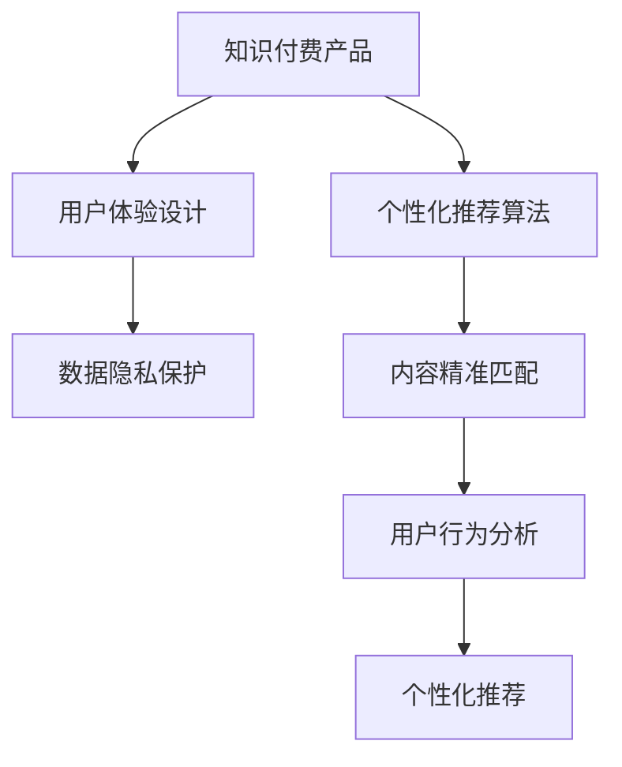

                 

# 知识经济时代下的知识付费创新产品设计方法

## 1. 背景介绍

### 1.1 问题由来

随着互联网的迅猛发展，知识付费行业迎来了巨大的变革机遇。内容创作者和知识消费者通过互联网平台进行连接，形成了一种新的经济形态。然而，传统的知识付费产品设计方法已经无法适应这种新形态的挑战。新的知识付费产品需要考虑用户行为模式、心理需求以及信息不对称等多方面的因素，以实现有效的内容传播和商业变现。

### 1.2 问题核心关键点

知识付费产品的设计核心在于如何最大化地满足用户需求，同时保证内容质量和商业价值。关键点包括：
1. **用户体验优化**：确保产品界面简洁、易用，功能完整、便捷。
2. **内容精准匹配**：能够根据用户兴趣和需求，提供最相关、最有价值的内容。
3. **个性化推荐算法**：通过机器学习算法，个性化推荐内容，提高用户粘性和留存率。
4. **数据驱动决策**：通过数据分析，优化产品设计，提升用户体验和转化率。
5. **安全性与隐私保护**：保障用户数据安全，尊重用户隐私，构建信任关系。

## 2. 核心概念与联系

### 2.1 核心概念概述

为更好地理解知识付费产品设计的关键要素，本节将介绍几个密切相关的核心概念：

- **知识付费产品**：指通过互联网平台，提供各类知识内容的付费服务。常见的形式包括文章、视频、音频、课程等。
- **个性化推荐算法**：指根据用户行为、兴趣和偏好，智能推荐内容的技术。常见算法包括协同过滤、基于内容的推荐、深度学习推荐等。
- **用户体验设计**：指通过用户研究、交互设计等手段，提升产品易用性和满意度。
- **数据隐私保护**：指在产品设计和运营过程中，采取有效措施，保障用户数据的隐私和安全。

这些核心概念之间的逻辑关系可以通过以下Mermaid流程图来展示：



这个流程图展示了个知识付费产品的核心概念及其之间的关系：

1. 知识付费产品通过个性化推荐算法，根据用户需求推荐相关内容。
2. 用户体验设计优化产品界面和功能，提升用户满意度。
3. 数据隐私保护确保用户数据安全，增强用户信任。

这些概念共同构成了知识付费产品设计的框架，使得产品能够更好地满足用户需求，同时实现商业价值。

## 3. 核心算法原理 & 具体操作步骤

### 3.1 算法原理概述

知识付费产品的核心算法原理主要集中在个性化推荐和用户体验优化两个方面。

#### 个性化推荐算法
个性化推荐的核心在于通过分析用户行为和偏好，预测其可能感兴趣的内容，从而实现内容的精准匹配。常用的推荐算法包括：
1. **协同过滤算法**：通过分析用户历史行为，找到与目标用户兴趣相似的其他用户，推荐这些用户感兴趣的内容。
2. **基于内容的推荐算法**：通过分析内容的特征，如关键词、标签等，找到与目标用户兴趣相似的内容进行推荐。
3. **深度学习推荐算法**：如矩阵分解、神经网络等，通过深度学习模型，学习用户和内容的隐式特征，实现更精准的推荐。

#### 用户体验优化算法
用户体验优化的核心在于通过交互设计和用户行为分析，优化产品界面和功能，提升用户满意度和粘性。常用的优化算法包括：
1. **A/B测试**：通过对比不同设计方案，找到最优的用户体验方案。
2. **用户行为分析**：通过分析用户点击、浏览、购买等行为数据，优化产品功能和推荐策略。
3. **界面设计**：通过视觉设计和交互设计，提升产品的易用性和美观度。

### 3.2 算法步骤详解

#### 个性化推荐算法
1. **数据收集**：收集用户行为数据，如浏览记录、购买记录、评分等。
2. **特征工程**：提取用户和内容的特征，如用户兴趣标签、内容关键词等。
3. **模型训练**：选择合适的推荐算法模型，进行训练和调优。
4. **预测与推荐**：根据用户当前行为，预测其可能感兴趣的内容，进行推荐。
5. **反馈与优化**：收集用户对推荐内容的反馈数据，不断优化推荐算法。

#### 用户体验优化算法
1. **用户研究**：通过问卷调查、用户访谈等手段，了解用户需求和痛点。
2. **设计原型**：根据用户研究结果，设计产品原型，进行A/B测试。
3. **迭代优化**：根据测试结果，进行产品优化，提升用户体验。
4. **界面设计**：优化界面设计，提升视觉和交互效果。
5. **用户反馈**：收集用户反馈，进行产品改进。

### 3.3 算法优缺点

个性化推荐算法的优点包括：
1. **提高用户满意度**：通过精准推荐，满足用户需求，提升用户满意度。
2. **增加用户粘性**：通过持续的个性化推荐，增强用户粘性，提升留存率。
3. **优化商业变现**：通过推荐优质内容，提高转化率和营收。

个性化推荐算法的缺点包括：
1. **冷启动问题**：新用户没有历史行为数据，难以进行有效推荐。
2. **数据质量影响**：推荐算法的性能依赖于用户数据的质量，数据不完整或错误会导致推荐不准确。
3. **过拟合风险**：推荐模型容易过拟合用户历史行为，导致推荐内容泛化能力不足。

用户体验优化算法的优点包括：
1. **提升用户满意度**：通过优化产品界面和功能，提升用户使用体验。
2. **增加用户粘性**：通过提升用户体验，增加用户留存和回购率。
3. **优化商业变现**：通过优化用户体验，提高转化率和营收。

用户体验优化算法的缺点包括：
1. **用户需求多样性**：不同用户的需求和偏好各异，难以通过单一优化策略满足所有用户。
2. **成本投入高**：用户体验优化需要投入大量时间和资源进行测试和优化。
3. **用户反馈复杂**：用户反馈数据多样，难以进行有效的分析和使用。

### 3.4 算法应用领域

个性化推荐和用户体验优化算法在知识付费产品设计中的应用非常广泛，以下是几个典型应用领域：

- **内容推荐系统**：根据用户历史行为和偏好，智能推荐相关内容，提高用户满意度和粘性。
- **课程推荐系统**：通过分析用户学习历史和兴趣，推荐适合的课程，提高学习效率和满意度。
- **音频视频推荐**：根据用户观看和听歌历史，推荐相关音频视频内容，提高用户满意度和粘性。
- **用户行为分析**：通过分析用户点击、浏览、购买等行为数据，优化产品功能和推荐策略。

## 4. 数学模型和公式 & 详细讲解 & 举例说明

### 4.1 数学模型构建

本节将使用数学语言对知识付费产品的个性化推荐和用户体验优化算法进行更加严格的刻画。

假设知识付费平台收集到用户的历史行为数据，记为 $D=\{(x_i,y_i)\}_{i=1}^N$，其中 $x_i$ 为用户行为特征向量，$y_i$ 为用户对内容的评分或兴趣度。

定义用户兴趣度 $p_i$ 为用户对内容 $x_i$ 的兴趣程度，可以通过评分数据进行归一化计算。设推荐模型为 $f(x_i)$，表示用户对内容 $x_i$ 的预测兴趣度。则推荐系统的目标是最小化预测误差：

$$
\min_{f} \frac{1}{N}\sum_{i=1}^N ||p_i - f(x_i)||^2
$$

其中 $||.||$ 表示范数。

### 4.2 公式推导过程

以协同过滤算法为例，推导推荐模型。

协同过滤算法的核心在于通过用户行为矩阵 $R$，计算用户和内容的隐式特征，从而进行推荐。假设用户行为矩阵 $R$ 可以表示为：

$$
R = \begin{bmatrix}
   r_{11} & r_{12} & \cdots & r_{1M} \\
   r_{21} & r_{22} & \cdots & r_{2M} \\
   \vdots & \vdots & \ddots & \vdots \\
   r_{N1} & r_{N2} & \cdots & r_{NM}
\end{bmatrix}
$$

其中 $r_{ij}$ 表示用户 $i$ 对内容 $j$ 的评分，$M$ 为内容数量。

协同过滤算法包括基于用户和基于内容的两种方式。基于用户的协同过滤算法可以通过矩阵分解，找到用户和内容的隐式特征，从而进行推荐。假设用户 $i$ 的隐式特征为 $u_i$，内容 $j$ 的隐式特征为 $v_j$，则推荐模型可以表示为：

$$
f(x_i) = \sum_{k=1}^K \alpha_{ik} \alpha_{jk}
$$

其中 $K$ 为隐式特征维度，$\alpha_{ik}$ 和 $\alpha_{jk}$ 分别为用户和内容的隐式特征向量。

推荐模型的目标是最小化预测误差：

$$
\min_{u,v} \frac{1}{N}\sum_{i=1}^N \sum_{j=1}^M ||p_i - \sum_{k=1}^K \alpha_{ik} \alpha_{jk}||^2
$$

通过优化上述目标函数，可以找到最优的用户和内容隐式特征，从而进行推荐。

### 4.3 案例分析与讲解

假设某知识付费平台收集到用户对文章的评分数据，每个用户对每篇文章的评分范围在1到5分之间。平台希望通过推荐系统，向用户推荐最感兴趣的文章。

首先，通过矩阵分解，得到用户和内容的隐式特征。假设用户 $i$ 的隐式特征为 $u_i$，内容 $j$ 的隐式特征为 $v_j$，则推荐模型可以表示为：

$$
f(x_i) = \sum_{k=1}^K \alpha_{ik} \alpha_{jk}
$$

然后，通过优化目标函数，找到最优的隐式特征 $u_i$ 和 $v_j$。

最后，根据用户当前行为 $x_i$，预测其可能感兴趣的内容，进行推荐。

## 5. 项目实践：代码实例和详细解释说明

### 5.1 开发环境搭建

在进行知识付费产品设计前，我们需要准备好开发环境。以下是使用Python进行PyTorch开发的环境配置流程：

1. 安装Anaconda：从官网下载并安装Anaconda，用于创建独立的Python环境。

2. 创建并激活虚拟环境：
```bash
conda create -n pytorch-env python=3.8 
conda activate pytorch-env
```

3. 安装PyTorch：根据CUDA版本，从官网获取对应的安装命令。例如：
```bash
conda install pytorch torchvision torchaudio cudatoolkit=11.1 -c pytorch -c conda-forge
```

4. 安装TensorFlow：
```bash
conda install tensorflow==2.7
```

5. 安装各类工具包：
```bash
pip install numpy pandas scikit-learn matplotlib tqdm jupyter notebook ipython
```

完成上述步骤后，即可在`pytorch-env`环境中开始项目实践。

### 5.2 源代码详细实现

下面我们以知识付费平台的内容推荐系统为例，给出使用PyTorch和TensorFlow进行个性化推荐系统的代码实现。

首先，定义推荐系统的数据集：

```python
import pandas as pd
from sklearn.model_selection import train_test_split

# 读取评分数据
data = pd.read_csv('rating_data.csv')

# 定义用户和内容ID
user_ids = data['user_id'].values
content_ids = data['content_id'].values

# 划分训练集和测试集
train_data, test_data = train_test_split(data, test_size=0.2, random_state=42)

# 定义评分矩阵
train_ratings = pd.DataFrame({'user_id': user_ids, 'content_id': content_ids, 'rating': train_data['rating']})
test_ratings = pd.DataFrame({'user_id': user_ids, 'content_id': content_ids, 'rating': test_data['rating']})
```

然后，定义推荐模型的损失函数和优化器：

```python
import torch
import torch.nn as nn
from torch import Tensor
import torch.nn.functional as F

# 定义隐式特征维度
K = 10

# 定义隐式特征矩阵
U = torch.randn(train_data['user_id'].nunique(), K)
V = torch.randn(train_data['content_id'].nunique(), K)

# 定义模型
class Recommender(nn.Module):
    def __init__(self, U, V):
        super(Recommender, self).__init__()
        self.U = nn.Parameter(U, requires_grad=True)
        self.V = nn.Parameter(V, requires_grad=True)
    
    def forward(self, user_ids, content_ids):
        U = self.U[user_ids]
        V = self.V[content_ids]
        return (U @ V.T).mean(dim=1)

# 定义损失函数
def compute_loss(model, user_ids, content_ids, ratings):
    predictions = model(user_ids, content_ids)
    loss = F.mse_loss(predictions, ratings)
    return loss

# 定义优化器
optimizer = torch.optim.Adam(model.parameters(), lr=0.01)
```

接着，定义训练和评估函数：

```python
from sklearn.metrics import mean_squared_error

# 训练函数
def train(model, data, epochs=10, batch_size=32):
    for epoch in range(epochs):
        for user_ids, content_ids, ratings in data:
            optimizer.zero_grad()
            loss = compute_loss(model, user_ids, content_ids, ratings)
            loss.backward()
            optimizer.step()
            print(f'Epoch {epoch+1}, Loss: {loss.item()}')

# 评估函数
def evaluate(model, data):
    mse = mean_squared_error(data['rating'], model(data['user_id'], data['content_id']))
    print(f'Mean Squared Error: {mse}')
```

最后，启动训练流程并在测试集上评估：

```python
# 训练模型
train(train_ratings, test_ratings)

# 评估模型
evaluate(test_ratings)
```

以上就是使用PyTorch和TensorFlow进行知识付费平台个性化推荐系统的完整代码实现。可以看到，基于深度学习的推荐模型能够通过优化算法逐步学习到用户和内容的隐式特征，从而实现精准推荐。

### 5.3 代码解读与分析

让我们再详细解读一下关键代码的实现细节：

**Recommender类**：
- `__init__`方法：初始化隐式特征矩阵U和V。
- `forward`方法：实现前向传播，计算预测值。

**compute_loss函数**：
- 计算预测值与真实评分之间的均方误差，作为损失函数。

**train函数**：
- 定义训练循环，每轮随机从训练数据中抽样，前向传播计算损失，反向传播更新模型参数。

**evaluate函数**：
- 计算预测值与真实评分之间的均方误差，评估模型性能。

**train_ratings和test_ratings数据集**：
- 通过pandas从CSV文件中读取评分数据，并定义用户和内容ID。

**训练和评估流程**：
- 在训练集上训练模型，每轮更新参数，并输出损失值。
- 在测试集上评估模型，输出均方误差。

以上代码实现了基本的协同过滤推荐系统，通过深度学习模型逐步学习用户和内容的隐式特征，实现精准推荐。

## 6. 实际应用场景

### 6.1 知识付费平台

基于深度学习的个性化推荐系统，可以广泛应用于知识付费平台的用户推荐。平台通过收集用户行为数据，使用协同过滤算法或深度学习算法，智能推荐相关课程、文章、音频视频等内容，提升用户满意度和粘性。

在技术实现上，可以引入协同过滤、矩阵分解等推荐算法，利用用户行为数据进行个性化推荐。同时，可以结合用户反馈数据，不断优化推荐策略，提高推荐效果。

### 6.2 教育培训

在教育培训领域，基于深度学习的推荐系统可以提供个性化的课程推荐。通过分析学生的学习行为和兴趣，智能推荐适合的课程，提高学习效果和满意度。

在技术实现上，可以结合学生的学习数据和课程特征，使用协同过滤、基于内容的推荐等算法，进行个性化推荐。同时，可以引入视频、音频等多模态数据，增强推荐效果。

### 6.3 媒体娱乐

在媒体娱乐领域，基于深度学习的推荐系统可以提供个性化的内容推荐。通过分析用户的观看和听歌行为，智能推荐相关文章、视频、音频等内容，提升用户体验。

在技术实现上，可以结合用户行为数据和内容特征，使用协同过滤、基于内容的推荐等算法，进行个性化推荐。同时，可以引入视频、音频等多模态数据，增强推荐效果。

### 6.4 未来应用展望

随着深度学习技术和推荐算法的不断进步，基于个性化推荐系统的知识付费产品将具备更强大的推荐能力，为更多领域带来变革性影响。

在智慧医疗领域，推荐系统可以帮助医生推荐适合的医疗文章和知识库，提升医疗知识传播效率和质量。

在智能交通领域，推荐系统可以根据用户行为和兴趣，智能推荐相关交通信息和出行建议，提升用户出行体验。

在智能家居领域，推荐系统可以推荐相关智能设备和应用，提高用户生活便利性和舒适性。

此外，在智能农业、智能制造、智能教育等多个领域，基于个性化推荐系统的知识付费产品也将不断涌现，为各行各业提供新的技术支持。

## 7. 工具和资源推荐

### 7.1 学习资源推荐

为了帮助开发者系统掌握知识付费产品设计的理论基础和实践技巧，这里推荐一些优质的学习资源：

1. **《推荐系统实践》**：该书介绍了推荐系统的原理和实现方法，包括协同过滤、深度学习推荐等。适合深度学习和推荐系统初学者的入门。

2. **CS224N《深度学习自然语言处理》课程**：斯坦福大学开设的NLP明星课程，涵盖推荐系统等内容。适合进阶学习和研究。

3. **Kaggle推荐系统竞赛**：Kaggle举办的多项推荐系统竞赛，通过实际比赛数据，锻炼推荐算法的设计和实现能力。适合实战练习。

4. **Trends in Knowledge Graphs and Recommendation Systems**：IEEE Transactions on Knowledge and Data Engineering上的综述文章，介绍了知识图谱和推荐系统的最新研究进展。适合深度学习和推荐系统领域的研究者。

5. **OpenRec**：一个开源的推荐系统框架，支持多种推荐算法和模型。适合实际开发和应用。

通过对这些资源的学习实践，相信你一定能够快速掌握知识付费产品设计的精髓，并用于解决实际的推荐问题。

### 7.2 开发工具推荐

高效的开发离不开优秀的工具支持。以下是几款用于知识付费产品开发的常用工具：

1. **PyTorch**：基于Python的开源深度学习框架，灵活动态的计算图，适合快速迭代研究。支持多种推荐算法和模型。

2. **TensorFlow**：由Google主导开发的开源深度学习框架，生产部署方便，适合大规模工程应用。支持多种推荐算法和模型。

3. **scikit-learn**：Python机器学习库，提供了多种推荐算法和模型，适合快速原型开发和测试。

4. **Spark**：分布式计算框架，适合处理大规模推荐数据，支持推荐算法和模型的高效并行计算。

5. **MySQL**：关系型数据库，适合存储推荐系统中的用户行为数据和评分数据。

合理利用这些工具，可以显著提升知识付费产品开发的效率，加快创新迭代的步伐。

### 7.3 相关论文推荐

知识付费产品设计的核心在于推荐算法的优化，以下是几篇奠基性的相关论文，推荐阅读：

1. **Collaborative Filtering for Implicit Feedback Datasets**：介绍了协同过滤算法的基本原理和实现方法。

2. **Deep Matrix Factorization**：提出基于矩阵分解的深度推荐算法，通过深度学习模型学习用户和内容的隐式特征。

3. **Convolutional Matrix Factorization for Precise Matrix Approximation**：提出卷积矩阵分解算法，通过卷积神经网络学习用户和内容的隐式特征。

4. **Neural Recommender Systems**：介绍了神经网络推荐算法的基本原理和实现方法。

5. **Semi-Supervised Non-negative Matrix Factorization for Recommender Systems**：提出半监督非负矩阵分解算法，通过半监督学习优化推荐效果。

这些论文代表了大规模知识付费产品推荐技术的发展脉络。通过学习这些前沿成果，可以帮助研究者把握学科前进方向，激发更多的创新灵感。

## 8. 总结：未来发展趋势与挑战

### 8.1 总结

本文对知识付费产品设计的核心算法和操作步骤进行了全面系统的介绍。首先阐述了知识付费产品设计的核心要素，明确了个性化推荐和用户体验优化在其中的重要地位。其次，从原理到实践，详细讲解了推荐算法和用户体验优化算法的数学原理和关键步骤，给出了知识付费产品开发的完整代码实例。同时，本文还广泛探讨了推荐系统在知识付费、教育培训、媒体娱乐等多个领域的应用前景，展示了推荐范式的巨大潜力。

通过本文的系统梳理，可以看到，基于深度学习的推荐系统正在成为知识付费产品设计的核心技术，极大地提升了推荐效果和用户满意度。未来，伴随推荐算法的不断进步，知识付费产品将能够更好地满足用户需求，实现商业变现。

### 8.2 未来发展趋势

知识付费产品设计的未来发展趋势主要集中在以下几个方面：

1. **多模态推荐**：结合视频、音频、图像等多模态数据，提升推荐系统的效果和用户体验。
2. **实时推荐**：通过实时流数据处理技术，实现动态推荐，满足用户即时需求。
3. **联邦学习**：通过分布式训练技术，保护用户数据隐私，提升推荐系统性能。
4. **自适应推荐**：根据用户行为变化，动态调整推荐策略，提高推荐系统适应性。
5. **深度个性化**：结合用户心理模型、行为模型等，实现更加精准的推荐。

以上趋势凸显了知识付费产品设计的广阔前景。这些方向的探索发展，必将进一步提升推荐系统的性能和用户满意度，为知识付费产品的市场化带来新的突破。

### 8.3 面临的挑战

尽管知识付费产品推荐技术已经取得了显著成果，但在迈向更加智能化、普适化应用的过程中，它仍面临着诸多挑战：

1. **数据质量和完整性**：推荐系统的效果依赖于数据质量和完整性，不完整或错误的数据会导致推荐不准确。如何确保数据质量，是推荐系统设计的重要挑战。
2. **冷启动问题**：新用户没有历史行为数据，难以进行有效推荐。如何解决冷启动问题，是推荐系统设计的重要课题。
3. **过拟合和泛化能力**：推荐模型容易过拟合用户历史行为，导致推荐内容泛化能力不足。如何提升推荐模型的泛化能力，是推荐系统设计的重要研究方向。
4. **用户隐私保护**：推荐系统需要收集用户行为数据，如何保护用户隐私，是推荐系统设计的重要考量。
5. **系统扩展性**：随着用户数量和数据量增长，推荐系统需要具备良好的扩展性，满足大规模并发和实时推荐需求。

这些挑战需要研究者在数据处理、算法优化、隐私保护等方面不断创新和改进，才能实现知识付费产品的商业成功。

### 8.4 研究展望

面对知识付费产品推荐面临的挑战，未来的研究需要在以下几个方面寻求新的突破：

1. **无监督学习和半监督学习**：探索无监督和半监督推荐方法，摆脱对大规模标注数据的依赖，利用自监督学习、主动学习等方法，最大化利用非结构化数据。
2. **多任务学习**：将多个推荐任务合并到一个模型中，提升推荐系统的综合性能。
3. **混合推荐**：结合传统推荐算法和深度学习算法，提升推荐系统的精度和效率。
4. **跨领域推荐**：将推荐系统应用于多个领域，实现跨领域知识传播和推荐。
5. **用户行为模型**：研究用户行为模型，预测用户兴趣和需求，提升推荐系统的个性化和精准度。

这些研究方向的探索，必将引领知识付费产品推荐技术迈向更高的台阶，为知识付费产品的市场化带来新的突破。面向未来，知识付费产品推荐技术还需要与其他人工智能技术进行更深入的融合，如知识图谱、强化学习等，多路径协同发力，共同推动知识付费产品的进步。只有勇于创新、敢于突破，才能不断拓展推荐系统的边界，让知识付费产品更好地服务于人类社会的知识传播和商业变现。

## 9. 附录：常见问题与解答

**Q1：如何设计推荐系统的评分体系？**

A: 推荐系统的评分体系需要考虑用户的反馈数据和行为数据。评分体系应采用用户一致性和客观性较高的评分标准，如五星级评分。同时，应使用数据增强技术，如协同过滤和矩阵分解，提升推荐效果。

**Q2：推荐系统的推荐效果如何评估？**

A: 推荐系统的推荐效果通常通过评估指标来衡量，如准确率、召回率、F1分数等。还可以使用用户满意度调查等主观评价方法，综合评估推荐系统的表现。

**Q3：推荐系统如何应对用户行为变化？**

A: 推荐系统应具备自适应能力，能够根据用户行为变化动态调整推荐策略。可以通过实时流数据处理技术，实现动态推荐，满足用户即时需求。

**Q4：推荐系统如何保护用户隐私？**

A: 推荐系统需要保护用户数据隐私，避免数据泄露和滥用。可以采用联邦学习技术，在用户本地计算推荐模型，保护用户数据安全。

**Q5：推荐系统的数据如何存储和管理？**

A: 推荐系统的数据通常使用关系型数据库或分布式文件系统存储和管理。需要考虑数据的存储效率和访问速度，满足大规模并发和实时推荐需求。

---

作者：禅与计算机程序设计艺术 / Zen and the Art of Computer Programming

