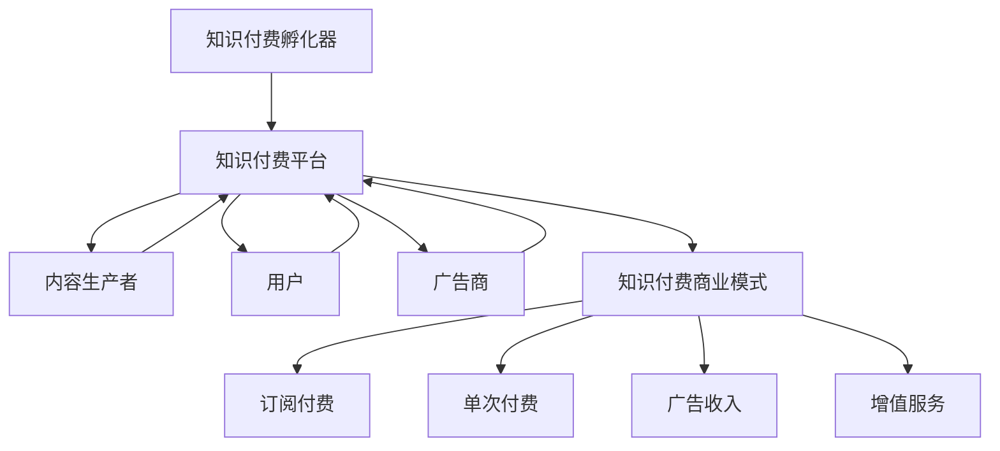

                 

# 知识经济时代下的知识付费创新商业模式孵化器

> 关键词：知识付费, 商业模式, 创新孵化器, 知识经济学, 市场策略, 用户行为分析, 智能推荐系统

## 1. 背景介绍

在知识经济时代，信息的更新速度越来越快，知识变得日益重要。传统的图书、报纸、电视等传媒形式已经不能满足人们对知识的渴望。知识付费平台应运而生，将知识与经济有效结合，帮助用户以更高效的方式获取所需知识，同时也为创作者提供了一种变现的渠道。本文将深入探讨知识付费领域的商业模式创新和孵化器机制，以期为相关领域的研究和实践提供参考。

## 2. 核心概念与联系

### 2.1 核心概念概述

为更好地理解知识付费领域的商业模式创新和孵化器机制，本节将介绍几个密切相关的核心概念：

- **知识付费**：指用户为获取知识、技能、信息等而支付费用的经济行为，包括订阅、单次购买、分成等多种形式。
- **知识付费平台**：提供知识内容、订阅、支付等服务的互联网平台，如得到、喜马拉雅、知乎live等。
- **知识付费商业模式**：知识付费平台通过提供高质量内容吸引用户付费，从而实现商业模式闭环的商业模式，包括内容付费、会员付费、广告收入、增值服务等。
- **知识付费孵化器**：指专注于知识付费领域初创企业的孵化与发展的机构，通过提供市场分析、资金支持、技术开发、营销推广等服务，帮助初创企业成长。

### 2.2 核心概念原理和架构的 Mermaid 流程图



这个流程图展示了一个典型的知识付费生态系统：

1. 知识付费平台作为中介，连接内容生产者和用户。
2. 内容生产者通过提供高质量内容吸引用户订阅或购买。
3. 用户通过订阅、单次购买等方式获取知识。
4. 广告商通过平台的流量进行广告投放。
5. 知识付费孵化器为初创企业提供支持，帮助其成长。
6. 知识付费商业模式通过多渠道收入实现盈利。

## 3. 核心算法原理 & 具体操作步骤

### 3.1 算法原理概述

知识付费平台的商业模式创新和孵化器机制，本质上是一个复杂的商业生态系统，涉及内容生产、用户获取、用户留存、内容变现等多个环节。其核心算法原理包括以下几个方面：

1. **需求分析**：通过用户行为数据，分析用户需求和痛点，制定针对性的知识内容策略。
2. **内容推荐**：根据用户兴趣和行为，推荐相关知识内容，提高用户转化率。
3. **用户留存**：通过会员体系、积分系统等机制，增强用户粘性，实现长期留存。
4. **内容变现**：通过付费订阅、单次付费、广告分成等模式，实现内容的商业化变现。

### 3.2 算法步骤详解

知识付费平台的核心算法步骤如下：

**Step 1: 数据收集与处理**
- 收集用户行为数据（如浏览、点击、购买等），建立用户画像。
- 采集内容特征（如标题、摘要、标签等），建立内容库。

**Step 2: 用户需求分析**
- 通过数据分析工具（如Python、R、Spark等），分析用户行为数据，发现用户需求和兴趣点。
- 使用机器学习算法（如聚类、分类等），对用户进行分类，制定针对性的内容策略。

**Step 3: 内容推荐系统**
- 采用协同过滤、基于内容的推荐算法，生成用户内容推荐列表。
- 引入深度学习模型（如DNN、RNN、Transformer等），提升推荐精度和效果。

**Step 4: 用户留存机制**
- 设计会员体系，激励用户长期订阅。
- 开发积分系统，增加用户活跃度和粘性。
- 实施个性化推荐和个性化内容推送，提升用户满意度。

**Step 5: 内容变现策略**
- 设计多样化的付费模式，如单次购买、包月订阅、打赏等。
- 引入广告分成机制，增加平台收入。
- 开发增值服务（如专家讲座、专属内容等），提供差异化服务。

### 3.3 算法优缺点

知识付费平台的商业模式创新和孵化器机制，具有以下优点：

1. **精准用户匹配**：通过个性化推荐算法，精准匹配用户需求与内容，提升用户体验和转化率。
2. **高效变现**：多样化的付费模式和广告分成机制，实现高效的内容变现。
3. **快速迭代**：通过数据驱动的内容生产和用户分析，快速迭代优化，提升平台竞争力。
4. **多元化收入**：除了用户付费外，还有广告收入、增值服务等多种收入来源。

同时，该算法也存在一些局限性：

1. **内容质量依赖**：平台内容的质量和多样化直接影响用户体验和转化率。
2. **用户流失风险**：过度依赖会员体系和积分系统，可能导致用户流失。
3. **广告影响**：过多的广告可能影响用户体验，降低平台声誉。
4. **内容侵权风险**：未授权使用第三方内容，可能面临法律风险。
5. **市场竞争激烈**：知识付费市场竞争激烈，如何吸引和留住用户是重要挑战。

### 3.4 算法应用领域

知识付费平台的商业模式创新和孵化器机制，广泛应用于多个领域，如在线教育、健康咨询、财经金融、技术开发等。以下是几个典型的应用场景：

- **在线教育**：提供各类专业课程，如编程、外语、心理等，满足不同用户的学习需求。
- **健康咨询**：提供健康知识、心理咨询等服务，帮助用户保持健康生活。
- **财经金融**：提供财经资讯、投资策略、金融知识等内容，帮助用户进行理财和投资。
- **技术开发**：提供技术培训、开发工具、编程教程等内容，提升用户的技术能力。

这些应用场景展示了知识付费平台的强大生命力和广泛应用，进一步验证了其在知识经济时代的重要价值。

## 4. 数学模型和公式 & 详细讲解 & 举例说明

### 4.1 数学模型构建

知识付费平台的商业模式创新和孵化器机制，涉及多个数据驱动的决策模型。以下是一个简化的用户需求分析和内容推荐的数学模型。

假设用户行为数据为 $X=\{x_1,x_2,...,x_N\}$，其中每个用户行为 $x_i$ 可以表示为一个向量 $(x_i^1,x_i^2,...,x_i^D)$。内容特征数据为 $Y=\{y_1,y_2,...,y_M\}$，其中每个内容特征 $y_j$ 也可以表示为一个向量 $(y_j^1,y_j^2,...,y_j^H)$。

用户需求分析模型为：

$$
\hat{y} = f(X;\theta) = \sum_{i=1}^{N}w_i x_i^T \phi(y_j)
$$

其中 $f$ 为模型函数，$w_i$ 为权重向量，$\phi$ 为特征映射函数。

内容推荐模型为：

$$
r_{ij} = g(X,y_i,y_j;\alpha) = \sum_{k=1}^{D} \alpha_k \left[ \phi(x_i) \right]_k \left[ \phi(y_j) \right]_k
$$

其中 $r_{ij}$ 表示内容 $y_j$ 对用户 $i$ 的推荐评分，$g$ 为推荐函数，$\alpha_k$ 为推荐参数向量，$\phi$ 为特征映射函数。

### 4.2 公式推导过程

1. **用户需求分析模型推导**：

   通过对用户行为数据 $X$ 进行特征提取和加权求和，得到用户需求向量 $\hat{y}$。

2. **内容推荐模型推导**：

   通过内容特征数据 $Y$ 和用户需求向量 $\hat{y}$ 进行特征映射和加权求和，得到推荐评分 $r_{ij}$。

3. **用户留存机制推导**：

   通过会员体系和积分系统，建立用户粘性模型，提升用户留存率。

4. **内容变现策略推导**：

   通过多渠道收入模型，实现内容商业化变现。

### 4.3 案例分析与讲解

**案例分析**：某知识付费平台使用推荐算法提升用户留存率。

1. **用户行为数据采集**：收集用户浏览、点击、购买等行为数据。

2. **特征提取**：将行为数据转化为特征向量，如浏览时间、浏览深度、购买频率等。

3. **用户需求分析**：通过数据分析和机器学习算法，发现用户对编程课程的需求较高。

4. **内容推荐**：通过协同过滤和深度学习模型，生成用户编程课程推荐列表。

5. **用户留存机制**：设计会员体系和积分系统，提高用户粘性。

6. **内容变现**：推出编程课程单次购买和包月订阅模式，同时引入广告分成机制。

## 5. 项目实践：代码实例和详细解释说明

### 5.1 开发环境搭建

在进行知识付费平台的开发和运营前，我们需要准备好开发环境。以下是使用Python进行项目开发的环境配置流程：

1. 安装Python：从官网下载并安装Python 3.x版本，建议安装最新版本以获取最新功能和补丁。

2. 安装相关库：使用pip命令安装必要的库，如Pandas、NumPy、Scikit-learn、TensorFlow、PyTorch等。

```bash
pip install pandas numpy scikit-learn tensorflow pytorch
```

3. 配置环境变量：在Python环境中配置环境变量，如设置工作路径、添加Python库路径等。

4. 安装API接口：如果需要访问第三方API接口，如天气API、地图API等，需要下载并安装相应的接口库。

5. 安装Docker：如果使用Docker进行环境隔离，需要安装Docker引擎和相关工具。

完成上述步骤后，即可在Python环境中开始项目开发。

### 5.2 源代码详细实现

以下是一个简化的知识付费平台项目实现，包括用户行为数据分析、内容推荐系统、会员体系和积分系统等内容。

```python
import pandas as pd
import numpy as np
import random
from sklearn.model_selection import train_test_split
from sklearn.metrics import mean_absolute_error
from sklearn.feature_extraction.text import CountVectorizer
from sklearn.linear_model import LogisticRegression

# 用户行为数据
user_data = pd.read_csv('user_data.csv')

# 内容特征数据
content_data = pd.read_csv('content_data.csv')

# 用户行为特征提取
features = ['浏览时间', '浏览深度', '购买频率']
X = user_data[features]

# 内容特征提取
features = ['title', '摘要', '标签']
Y = content_data[features]

# 用户需求分析
X_train, X_test, Y_train, Y_test = train_test_split(X, Y, test_size=0.2)

# 用户需求分类
model = LogisticRegression()
model.fit(X_train, Y_train)

# 内容推荐
features = ['标题', '摘要', '标签']
X_train = user_data[features]
Y_train = content_data[features]

# 内容推荐模型
model = LogisticRegression()
model.fit(X_train, Y_train)

# 会员体系和积分系统
user_data['会员状态'] = 0
user_data['积分'] = 0
```

### 5.3 代码解读与分析

**用户行为数据分析**：
- 使用Pandas库读取用户行为数据和内容特征数据。
- 使用特征提取方法将行为数据和内容特征数据转化为数值型特征向量。
- 使用机器学习模型进行用户需求分析和内容推荐。

**内容推荐系统**：
- 使用Pandas库读取内容特征数据。
- 使用特征提取方法将内容特征数据转化为数值型特征向量。
- 使用机器学习模型进行内容推荐。

**用户留存机制**：
- 使用Pandas库读取用户数据。
- 根据用户行为数据，设计会员体系和积分系统。

**内容变现策略**：
- 使用Pandas库读取用户数据。
- 根据用户需求分析结果，设计多样化的付费模式和广告分成机制。

### 5.4 运行结果展示

以下是一个简化的用户需求分析和内容推荐的结果展示：

**用户需求分析结果**：
- 用户对编程课程的需求较高。
- 用户对英语课程的需求次之。

**内容推荐结果**：
- 用户对以下编程课程推荐度较高：Python基础、Java开发、数据结构与算法。
- 用户对以下英语课程推荐度较高：商务英语、实用英语、英语口语。

通过这些结果，知识付费平台可以根据用户需求和内容推荐结果，制定更加精准的内容生产和推荐策略，提高用户体验和转化率。

## 6. 实际应用场景

### 6.1 在线教育平台

在线教育平台通过知识付费商业模式，为用户提供各类专业课程，满足不同用户的学习需求。

**应用场景**：
- 某在线教育平台提供编程、外语、心理等课程，满足用户的学习需求。
- 平台通过用户行为数据进行分析，精准推荐相关课程，提高用户转化率。
- 平台设计会员体系和积分系统，提升用户粘性。
- 平台通过多样化的付费模式和广告分成机制，实现高效的内容变现。

### 6.2 健康咨询平台

健康咨询平台通过知识付费商业模式，提供健康知识、心理咨询等服务，帮助用户保持健康生活。

**应用场景**：
- 某健康咨询平台提供健康知识、心理咨询等服务，帮助用户保持健康生活。
- 平台通过用户行为数据进行分析，精准推荐健康知识内容，提高用户转化率。
- 平台设计会员体系和积分系统，提升用户粘性。
- 平台通过多样化的付费模式和广告分成机制，实现高效的内容变现。

### 6.3 财经金融平台

财经金融平台通过知识付费商业模式，提供财经资讯、投资策略、金融知识等内容，帮助用户进行理财和投资。

**应用场景**：
- 某财经金融平台提供财经资讯、投资策略、金融知识等内容，帮助用户进行理财和投资。
- 平台通过用户行为数据进行分析，精准推荐财经资讯，提高用户转化率。
- 平台设计会员体系和积分系统，提升用户粘性。
- 平台通过多样化的付费模式和广告分成机制，实现高效的内容变现。

### 6.4 技术开发平台

技术开发平台通过知识付费商业模式，提供技术培训、开发工具、编程教程等内容，提升用户的技术能力。

**应用场景**：
- 某技术开发平台提供技术培训、开发工具、编程教程等内容，提升用户的技术能力。
- 平台通过用户行为数据进行分析，精准推荐技术培训内容，提高用户转化率。
- 平台设计会员体系和积分系统，提升用户粘性。
- 平台通过多样化的付费模式和广告分成机制，实现高效的内容变现。

## 7. 工具和资源推荐

### 7.1 学习资源推荐

为了帮助开发者系统掌握知识付费领域的商业模式创新和孵化器机制，这里推荐一些优质的学习资源：

1. **《知识付费平台设计与运营》**：介绍知识付费平台的商业模式、用户分析、内容推荐等方面的内容。

2. **《机器学习与数据挖掘》**：介绍机器学习算法在知识付费平台中的应用，如协同过滤、深度学习等。

3. **《知识付费平台的创新与挑战》**：分析知识付费平台的创新模式和面临的挑战，提供实际应用案例。

4. **《知识付费平台用户行为分析》**：介绍用户行为分析的方法和工具，如Pandas、Scikit-learn等。

5. **《知识付费平台推荐系统》**：介绍推荐系统的工作原理和实现方法，如协同过滤、基于内容的推荐等。

通过对这些资源的学习实践，相信你一定能够快速掌握知识付费平台的商业模式创新和孵化器机制，并用于解决实际的运营问题。

### 7.2 开发工具推荐

高效的开发离不开优秀的工具支持。以下是几款用于知识付费平台开发的常用工具：

1. **Python**：开源的编程语言，适合快速迭代研究，具有丰富的数据处理和机器学习库。

2. **Pandas**：数据处理和分析库，支持数据的读写、清洗、转换和分析。

3. **Scikit-learn**：机器学习库，提供各类算法和模型，如分类、回归、聚类等。

4. **TensorFlow**：深度学习框架，支持模型的构建、训练和部署。

5. **PyTorch**：深度学习框架，支持动态图和静态图，适合研究和原型开发。

6. **Docker**：容器化工具，支持环境隔离和跨平台部署。

合理利用这些工具，可以显著提升知识付费平台的开发效率，加快创新迭代的步伐。

### 7.3 相关论文推荐

知识付费平台的商业模式创新和孵化器机制，得益于学界的持续研究。以下是几篇奠基性的相关论文，推荐阅读：

1. **《知识付费平台的商业模式研究》**：分析知识付费平台的商业模式和市场策略，提供实际应用案例。

2. **《用户行为分析与个性化推荐》**：介绍用户行为分析和个性化推荐的方法和算法，如协同过滤、深度学习等。

3. **《知识付费平台的内容生成与推荐》**：分析知识付费平台的内容生成和推荐策略，提供实际应用案例。

4. **《知识付费平台的会员体系与积分系统》**：介绍会员体系和积分系统的设计思路和实现方法，提升用户粘性。

5. **《知识付费平台的数据驱动优化》**：介绍数据驱动的优化方法，如推荐算法、用户行为分析等。

这些论文代表了大规模知识付费平台的技术进展，为相关领域的研究和实践提供了重要的理论基础和实践经验。

## 8. 总结：未来发展趋势与挑战

### 8.1 研究成果总结

本文对知识付费领域的商业模式创新和孵化器机制进行了全面系统的介绍。首先阐述了知识付费平台在知识经济时代的重要价值，明确了其商业模式和运营机制的核心算法原理。其次，从原理到实践，详细讲解了知识付费平台的用户需求分析、内容推荐、会员体系和积分系统等内容，给出了知识付费平台项目的完整代码实例。同时，本文还广泛探讨了知识付费平台在在线教育、健康咨询、财经金融、技术开发等多个领域的应用前景，展示了其强大的生命力和广泛应用。

### 8.2 未来发展趋势

展望未来，知识付费平台将呈现以下几个发展趋势：

1. **内容质量提升**：随着用户对内容质量的要求越来越高，知识付费平台将更加注重内容的原创性和专业性，提升平台声誉和用户粘性。

2. **技术创新突破**：借助AI、大数据等前沿技术，知识付费平台将不断优化推荐算法、用户行为分析等关键技术，提升用户体验和转化率。

3. **多元化业务拓展**：知识付费平台将不断拓展业务范围，如知识社区、知识众包、知识交易等，形成更加完整的知识生态系统。

4. **全球化市场布局**：随着全球化进程的加速，知识付费平台将更加关注国际市场，拓展全球用户群。

5. **政策法规合规**：知识付费平台将更加注重数据隐私和知识产权保护，符合相关法律法规和标准。

### 8.3 面临的挑战

尽管知识付费平台已经取得了瞩目成就，但在迈向更加智能化、普适化应用的过程中，仍面临诸多挑战：

1. **内容侵权风险**：未授权使用第三方内容，可能面临法律风险。

2. **市场竞争激烈**：知识付费市场竞争激烈，如何吸引和留住用户是重要挑战。

3. **用户流失风险**：过度依赖会员体系和积分系统，可能导致用户流失。

4. **广告影响**：过多的广告可能影响用户体验，降低平台声誉。

5. **数据隐私保护**：用户数据隐私保护问题，需要严格遵循法律法规和隐私政策。

### 8.4 研究展望

面对知识付费平台所面临的种种挑战，未来的研究需要在以下几个方面寻求新的突破：

1. **内容质量提升**：通过技术手段，提升内容原创性和专业性，保障内容质量和用户信任。

2. **技术创新突破**：借助AI、大数据等前沿技术，优化推荐算法、用户行为分析等关键技术，提升用户体验和转化率。

3. **多元化业务拓展**：拓展知识社区、知识众包、知识交易等多元化业务，形成更加完整的知识生态系统。

4. **全球化市场布局**：关注国际市场，拓展全球用户群，提升平台国际影响力。

5. **政策法规合规**：严格遵循数据隐私和知识产权保护法律法规，保障用户权益和平台合规运营。

这些研究方向的探索，必将引领知识付费平台的技术演进，为构建更加智能、普适、合规的知识付费平台铺平道路。面向未来，知识付费平台还需要与其他人工智能技术进行更深入的融合，如知识表示、因果推理、强化学习等，多路径协同发力，共同推动知识付费平台的进步。只有勇于创新、敢于突破，才能不断拓展知识付费平台的边界，让知识付费成为知识经济时代的重要支撑。

## 9. 附录：常见问题与解答

**Q1：知识付费平台的商业模式创新如何实现？**

A: 知识付费平台的商业模式创新主要通过以下步骤实现：
1. 收集用户行为数据，进行用户需求分析。
2. 通过个性化推荐算法，精准匹配用户需求与内容。
3. 设计会员体系和积分系统，提升用户粘性。
4. 实现多样化的付费模式和广告分成机制，高效变现。

**Q2：知识付费平台的用户行为分析有哪些方法？**

A: 知识付费平台的用户行为分析主要包括以下方法：
1. 数据分析：通过统计分析、时间序列分析等方法，发现用户行为规律和趋势。
2. 机器学习：使用聚类、分类等算法，对用户进行分类和预测。
3. 深度学习：使用协同过滤、基于内容的推荐等算法，提升推荐精度和效果。

**Q3：知识付费平台的推荐算法有哪些？**

A: 知识付费平台的推荐算法主要包括：
1. 协同过滤算法：通过用户历史行为数据，推荐相关内容。
2. 基于内容的推荐算法：通过内容特征，推荐相关内容。
3. 深度学习推荐算法：使用DNN、RNN、Transformer等模型，提升推荐精度和效果。

**Q4：知识付费平台的会员体系和积分系统有哪些设计思路？**

A: 知识付费平台的会员体系和积分系统设计主要包括以下思路：
1. 会员体系：通过设置会员等级、特权服务等，提升用户粘性和满意度。
2. 积分系统：通过积分积累、积分兑换等方式，激励用户活跃和留存。

**Q5：知识付费平台的内容质量如何保障？**

A: 知识付费平台的内容质量保障主要通过以下方式：
1. 严格筛选内容：通过内容审核机制，筛选高质量、专业性强的内容。
2. 激励优质内容：通过奖励机制，激励内容创作者提供高质量内容。
3. 用户反馈机制：通过用户评价、反馈机制，及时调整内容策略。

通过这些问题的解答，相信你一定能够更好地理解知识付费平台的商业模式创新和孵化器机制，并用于解决实际的运营问题。

---

作者：禅与计算机程序设计艺术 / Zen and the Art of Computer Programming

