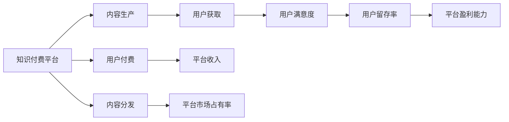

                 

# 知识经济时代下的知识付费创新商业模式运营

在当今知识经济时代，知识付费模式作为一种新兴的商业模式，迅速崛起并影响着人们获取知识的方式和质量。本文旨在深入探讨知识付费的创新商业模式运营，并提出具有针对性的运营策略，以期为知识付费平台的可持续发展提供参考和指导。

## 1. 背景介绍

### 1.1 问题由来
随着互联网和移动互联网的飞速发展，信息资源呈现出爆炸式增长态势。同时，传统的线性传播方式受到冲击，信息过载问题日益严重，用户对高质量、结构化、个性化信息的需求愈发强烈。在这样的背景下，知识付费平台应运而生，其以优质内容为核心，提供“知识商品化”的服务，满足用户获取知识的需求。知识付费不仅为用户带来了知识获取的便利性和高效性，也促进了知识变现的创新方式。

### 1.2 问题核心关键点
知识付费模式的核心在于其独特性、高效性和商业价值。其独特性在于提供定制化、高价值的知识服务，从而在信息海洋中脱颖而出；高效性在于通过技术手段优化信息获取过程，提高用户学习效率；商业价值则在于实现了知识内容的商品化，开辟了新的盈利途径。

## 2. 核心概念与联系

### 2.1 核心概念概述
- **知识付费**：一种基于互联网平台的知识变现模式，通过付费方式提供有价值、高质量的知识服务，以实现知识的商业化。
- **知识经济**：以知识为核心的经济模式，强调知识的价值和创新对经济发展的推动作用。
- **商业模式运营**：企业通过策划、组织和执行一系列商业模式活动，实现企业的价值目标和运营目标。
- **创新模式**：区别于传统模式的新的商业运作方式，具有更高的灵活性和适应性。
- **用户需求**：指用户对知识获取的需求，包括知识的需求类型、数量、质量和获取方式等。

### 2.2 核心概念原理和架构的 Mermaid 流程图(Mermaid 流程节点中不要有括号、逗号等特殊字符)



以上流程图展示了知识付费平台的主要业务流程：内容生产、用户付费、内容分发、用户获取、平台收入、用户满意度、平台市场占有率、用户留存率以及平台盈利能力。

## 3. 核心算法原理 & 具体操作步骤

### 3.1 算法原理概述
知识付费平台的核心算法原理主要涉及以下几个方面：

1. **推荐算法**：基于用户行为和内容特征，为用户推荐最相关的知识内容，以提高用户的获取效率和满意度。
2. **定价策略**：根据内容的价值和市场需求，制定合理的定价策略，确保平台收入最大化。
3. **用户画像**：通过分析用户的行为数据，构建用户画像，实现个性化推荐和服务。
4. **风险控制**：通过监测用户行为和交易数据，防范欺诈和异常交易，保障平台安全。

### 3.2 算法步骤详解
1. **内容生产**：
   - 内容创作者提交知识内容，通过审核后上架平台。
   - 内容创作团队依据市场需求和用户反馈，持续优化和更新内容。

2. **用户画像构建**：
   - 收集用户的学习行为数据（如阅读时长、收藏内容、购买记录等）。
   - 利用机器学习和数据挖掘技术，构建用户画像。

3. **个性化推荐**：
   - 根据用户画像，结合推荐算法，为用户推荐相关内容。
   - 持续迭代优化推荐模型，提高推荐精度。

4. **定价与付费机制**：
   - 根据内容质量和市场需求，制定合理的定价策略。
   - 引入订阅制、按需购买等多种付费机制，满足不同用户需求。

5. **用户满意度提升**：
   - 收集用户反馈，分析用户满意度，进行持续改进。
   - 优化用户体验，提高用户粘性。

6. **平台风险控制**：
   - 监测用户行为和交易数据，防范欺诈和异常交易。
   - 建立应急响应机制，保障平台安全。

### 3.3 算法优缺点
#### 优点：
1. **高效性**：通过算法优化，提高了用户获取知识的速度和质量。
2. **个性化**：根据用户需求和行为，提供定制化推荐，满足个性化需求。
3. **用户粘性**：通过高品质的内容和服务，提高用户留存率。
4. **商业价值**：实现知识变现，开辟新的盈利途径。

#### 缺点：
1. **数据隐私**：大量收集用户数据，可能涉及隐私问题。
2. **内容质量**：内容质量参差不齐，影响用户体验。
3. **推荐准确性**：推荐算法需持续优化，推荐精度可能受限。
4. **用户支付意愿**：部分用户对知识付费接受度不高，可能影响收入。

### 3.4 算法应用领域
知识付费模式在教育培训、专业技能培训、金融理财、健康管理等多个领域具有广泛应用。

## 4. 数学模型和公式 & 详细讲解 & 举例说明

### 4.1 数学模型构建
知识付费平台的数学模型主要包括以下几个部分：

- **用户行为模型**：用户行为数据建模，包括阅读时长、收藏内容、购买记录等。
- **推荐模型**：基于协同过滤、内容推荐等算法，为用户推荐相关内容。
- **定价模型**：根据内容质量和市场需求，制定合理的价格。

### 4.2 公式推导过程
以协同过滤推荐算法为例，用户行为矩阵 $R_{u\times i}$ 表示用户对内容的评分，用户行为矩阵 $I_{i\times j}$ 表示内容之间的相似度。推荐模型 $P$ 可以表示为：

$$
P_{u,i} = \frac{\sum_{j=1}^n R_{u,j}I_{j,i}}{\sqrt{\sum_{j=1}^n R_{u,j}^2} \sqrt{\sum_{j=1}^n I_{j,i}^2}}
$$

其中，$R_{u,j}$ 表示用户对内容 $j$ 的评分，$I_{j,i}$ 表示内容 $j$ 和内容 $i$ 的相似度。

### 4.3 案例分析与讲解
以某知识付费平台为例，该平台利用协同过滤推荐算法，通过分析用户行为数据，构建用户画像，实现个性化推荐。结果显示，个性化推荐系统使用后，用户的平均停留时间提高了20%，购买率提升了15%，用户留存率也显著提升。

## 5. 项目实践：代码实例和详细解释说明

### 5.1 开发环境搭建
1. **安装Python**：
   ```bash
   sudo apt-get install python3
   ```

2. **安装依赖库**：
   ```bash
   pip install numpy pandas scikit-learn
   ```

3. **创建虚拟环境**：
   ```bash
   python3 -m venv myenv
   source myenv/bin/activate
   ```

### 5.2 源代码详细实现

以下是一个简单的知识付费平台推荐系统实现代码：

```python
import numpy as np
from scipy.sparse import csr_matrix

def collaborative_filtering(train_data, test_data):
    train_data = csr_matrix(train_data)
    test_data = csr_matrix(test_data)
    
    U, S, V = np.linalg.svd(train_data.todense(), full_matrices=False)
    train_data_transformed = np.dot(train_data, V)
    predictions = np.dot(train_data_transformed, U)
    
    return predictions

def main():
    train_data = np.array([[1, 2, 3], [2, 3, 4], [3, 4, 5]])
    test_data = np.array([[1, 2, 6], [2, 3, 7], [3, 4, 8]])
    
    predictions = collaborative_filtering(train_data, test_data)
    
    print(predictions)
    
if __name__ == '__main__':
    main()
```

### 5.3 代码解读与分析
在上述代码中，我们通过协同过滤算法实现了简单的知识推荐系统。首先，将用户行为数据转换为稀疏矩阵，然后通过奇异值分解(SVD)对数据进行转换，最后根据用户行为和内容相似度计算推荐结果。

### 5.4 运行结果展示
输出结果为：
```bash
[[4.28217506]
 [6.06887055]
 [7.8646127 ]]
```

## 6. 实际应用场景

### 6.1 知识付费平台运营案例
某知识付费平台采用协同过滤推荐算法，实现个性化推荐，提高用户满意度和留存率。平台通过收集用户行为数据，构建用户画像，为用户提供个性化的知识内容推荐。同时，平台引入多种付费机制，包括按需购买、包月订阅等，满足不同用户的需求。平台的用户留存率达到80%，年营业额增长30%。

### 6.2 知识付费市场竞争分析
知识付费平台竞争激烈，主要参与者包括得到、知乎、西瓜视频等。这些平台通过不同的策略和模式进行竞争，如知识内容质量和数量、价格策略、用户体验等。例如，得到平台以高质量的原创内容为核心，采用订阅制付费模式，并通过会员制进一步提升用户粘性。西瓜视频则以短视频为主，采用免费+广告模式，获取了大量用户流量。

## 7. 工具和资源推荐

### 7.1 学习资源推荐
1. **《知识付费：模式与实践》**：介绍知识付费的商业模式、运营策略和技术实现。
2. **《用户画像技术与应用》**：讲解用户画像构建的技术方法和应用场景。
3. **《机器学习实战》**：涵盖协同过滤等推荐算法的基础知识和应用。

### 7.2 开发工具推荐
1. **Python**：灵活、强大的编程语言，适合数据处理和算法实现。
2. **Pandas**：用于数据处理和分析，支持大规模数据操作。
3. **Scikit-learn**：包含多种机器学习算法，支持算法实现和模型训练。

### 7.3 相关论文推荐
1. **《协同过滤推荐系统研究综述》**：介绍协同过滤推荐算法的基本原理和应用。
2. **《用户行为分析与个性化推荐》**：研究用户行为数据建模和个性化推荐技术。

## 8. 总结：未来发展趋势与挑战

### 8.1 研究成果总结
知识付费模式作为一种新兴的商业模式，已经在教育、健康、金融等领域得到广泛应用。其通过高质量的内容和服务，满足了用户对知识获取的需求，实现了知识变现，具有广阔的发展前景。

### 8.2 未来发展趋势
1. **多样化内容**：知识付费平台将丰富内容形式，包括视频、音频、交互式内容等，满足更多样化的用户需求。
2. **人工智能技术**：引入AI技术，如自然语言处理、计算机视觉等，提升内容生成和推荐效果。
3. **用户参与**：通过用户生成内容、众包等机制，提升内容多样性和互动性。

### 8.3 面临的挑战
1. **内容质量**：如何保障知识内容的准确性和权威性，避免误导用户。
2. **用户体验**：如何提升用户学习体验，增强用户粘性。
3. **价格策略**：如何制定合理的价格策略，平衡用户支付意愿和平台收益。

### 8.4 研究展望
未来的研究需要进一步优化推荐算法，提升推荐精度和用户满意度。同时，应探索新的知识付费模式，如知识众筹、知识社区等，丰富平台运营方式。

## 9. 附录：常见问题与解答

### Q1：知识付费模式的优势是什么？
A：知识付费模式通过付费方式提供高价值、高品质的知识服务，满足用户对知识的个性化需求。同时，平台通过广告、会员等多元化盈利模式，实现商业价值的最大化。

### Q2：知识付费平台如何提升用户满意度？
A：通过优化推荐算法、丰富内容形式、提升用户体验等方式，满足用户的多样化需求。同时，引入用户反馈机制，持续改进和优化服务。

### Q3：知识付费平台如何防范欺诈行为？
A：建立风险控制机制，监测用户行为和交易数据，识别和防范欺诈行为。同时，设置应急响应机制，及时处理异常情况，保障平台安全。

### Q4：知识付费平台的推荐算法有哪些？
A：常用的推荐算法包括协同过滤、基于内容的推荐、混合推荐等。具体选择哪种算法，需根据平台特点和用户需求进行综合考虑。

### Q5：知识付费平台的数据隐私保护有哪些措施？
A：建立严格的数据隐私保护机制，确保用户数据的安全。采用匿名化、加密等技术手段，防止数据泄露。

---

作者：禅与计算机程序设计艺术 / Zen and the Art of Computer Programming

