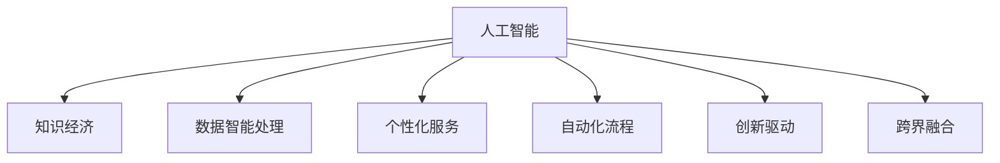
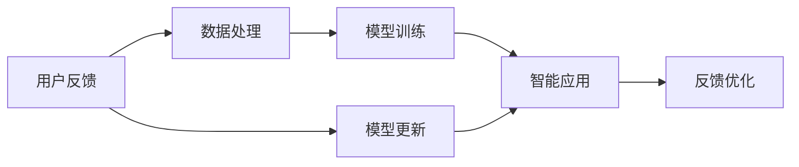

                 

# 知识经济的崛起：人工智能的催化作用

> 关键词：人工智能,知识经济,催化作用,智能技术,商业创新

## 1. 背景介绍

### 1.1 问题由来

在21世纪这个信息爆炸的时代，知识经济逐步成为全球经济发展的核心驱动力。这一转变与过去以工业生产为中心的经济模式大相径庭，它更加依赖于创新、智慧和技术。在此背景下，人工智能(AI)技术的崛起，为知识经济的蓬勃发展提供了强有力的催化作用。AI不仅能够快速分析海量数据、提升决策效率，还能开辟全新的应用场景，推动各行各业的数字化转型升级。

### 1.2 问题核心关键点

人工智能对知识经济的催化作用主要体现在以下几个方面：

1. **数据智能处理**：AI技术能够处理和分析海量数据，从中提取有价值的知识，为决策者提供科学依据。
2. **个性化服务**：利用深度学习等AI技术，可以根据用户行为和偏好提供高度个性化的产品和服务。
3. **自动化流程**：通过机器学习等AI技术，可以自动化处理重复性高、复杂度低的任务，释放人类劳动力。
4. **创新驱动**：AI技术不断推动技术创新和商业模式创新，催生新兴产业和市场需求。
5. **跨界融合**：AI技术能够跨越行业边界，与其他技术如物联网、大数据等深度融合，提升整体效率和价值。

## 2. 核心概念与联系

### 2.1 核心概念概述

为更好地理解人工智能如何催化知识经济，本节将介绍几个核心概念：

- **人工智能(AI)**：涉及机器学习、深度学习、自然语言处理等技术，使机器能够模拟人类的智能行为。
- **知识经济**：以知识和信息的生产、分配、使用和消费为核心，通过创新驱动经济增长的新型经济形态。
- **催化作用**：AI技术通过提供高效、精准、个性化的解决方案，推动知识经济的发展，促进产业升级和经济增长。

这些概念之间的逻辑关系可以通过以下Mermaid流程图来展示：



这个流程图展示了一个完整的因果链条：

1. 人工智能技术通过数据智能处理、个性化服务、自动化流程、创新驱动、跨界融合等多个维度，对知识经济产生了多方面的催化作用。
2. 数据智能处理使得信息处理效率大幅提升，个性化服务提高了用户体验，自动化流程解放了劳动力，创新驱动开辟了新市场，跨界融合则推动了产业融合与升级。

### 2.2 核心概念原理和架构的 Mermaid 流程图



此图展示了一个AI模型的基本架构和工作流程：

1. 从数据处理开始，对原始数据进行清洗、标注和预处理。
2. 模型训练阶段，利用机器学习算法训练得到智能模型。
3. 模型部署后，应用于实际业务场景，产生智能应用。
4. 通过用户反馈收集和模型更新，持续优化模型性能，实现自我迭代。

## 3. 核心算法原理 & 具体操作步骤
### 3.1 算法原理概述

人工智能对知识经济的催化作用，主要通过以下几个算法和步骤实现：

1. **深度学习算法**：通过构建多层神经网络，训练模型以识别和提取数据中的模式和规律，提升决策的科学性。
2. **强化学习算法**：通过奖励机制，让模型在特定环境中不断试错学习，优化决策策略，提高智能应用的适应性和鲁棒性。
3. **迁移学习**：通过在多个任务之间共享知识，减少数据需求，提升模型的泛化能力和迁移能力。
4. **知识图谱构建**：利用图结构化的知识库，进行语义理解和推理，支持更高级别的智能决策。

### 3.2 算法步骤详解

以下详细说明各个算法的具体步骤：

#### 3.2.1 深度学习算法步骤
1. **数据准备**：收集并清洗海量数据，确保数据质量。
2. **特征工程**：对数据进行特征提取和选择，构建输入向量。
3. **模型训练**：选择合适的深度学习模型，如卷积神经网络、循环神经网络等，使用梯度下降等优化算法进行模型训练。
4. **模型评估**：在验证集上评估模型性能，调整超参数。
5. **模型部署**：将训练好的模型部署到实际应用环境中，进行实时推理。

#### 3.2.2 强化学习算法步骤
1. **环境设定**：定义智能代理运行的环境和目标。
2. **策略选择**：确定智能代理的行为策略，如Q-learning、策略梯度等。
3. **行动执行**：智能代理根据策略在环境中执行动作，获取反馈。
4. **奖励机制**：根据智能代理的行为和环境状态，提供奖励或惩罚。
5. **策略更新**：根据奖励机制和动作执行结果，更新智能代理的行为策略，提升决策质量。

#### 3.2.3 迁移学习步骤
1. **预训练模型选择**：选择已有的大规模预训练模型，如BERT、GPT等。
2. **任务适配**：根据目标任务的特性，添加或微调模型的任务适配层，如分类器、解码器等。
3. **微调训练**：在目标任务的标注数据集上，使用少量标注样本进行微调训练，优化模型参数。
4. **模型验证**：在验证集上评估微调后的模型性能，调整模型参数。
5. **模型部署**：将微调好的模型部署到实际应用环境中，进行预测推理。

#### 3.2.4 知识图谱构建步骤
1. **知识采集**：收集各类领域的知识数据，如百科、新闻、文档等。
2. **知识标注**：对知识数据进行语义标注，构建实体关系图。
3. **图结构化**：利用图结构化的方式，组织和存储知识数据。
4. **语义推理**：构建知识推理引擎，进行语义理解和推理。
5. **应用整合**：将知识图谱与业务系统集成，提升决策支持的智能水平。

### 3.3 算法优缺点

人工智能催化知识经济的方法具有以下优点：

1. **数据利用率高**：通过深度学习、迁移学习等算法，能够高效利用和分析海量数据，提取有价值的知识。
2. **智能决策支持**：AI模型能够快速处理复杂决策问题，提升决策效率和准确性。
3. **个性化服务优化**：AI技术能够根据用户行为和偏好提供高度个性化的服务，提升用户体验。
4. **自动化流程提升**：通过自动化流程，释放大量劳动力，降低生产成本。

但同时，这些方法也存在一些缺点：

1. **数据质量要求高**：高质量的数据是AI模型有效性的前提，数据标注、清洗等工作成本较高。
2. **模型复杂度高**：深度学习等算法需要较大的计算资源和复杂的网络结构，训练和部署成本较高。
3. **解释性不足**：AI模型的决策过程往往难以解释，缺乏可解释性。
4. **依赖技术基础**：AI技术需要较强的技术储备，中小企业和传统行业可能面临技术壁垒。

## 4. 数学模型和公式 & 详细讲解  
### 4.1 数学模型构建

人工智能催化知识经济的数学模型构建，通常涉及以下几个关键步骤：

1. **数据集准备**：将原始数据集划分为训练集、验证集和测试集。
2. **模型选择**：选择合适的AI算法，如深度学习、强化学习等。
3. **模型训练**：定义损失函数，使用梯度下降等优化算法进行模型训练。
4. **模型评估**：在验证集上评估模型性能，调整超参数。
5. **模型部署**：将训练好的模型部署到实际应用环境中，进行实时推理。

### 4.2 公式推导过程

以深度学习中的卷积神经网络(CNN)为例，进行数学模型的详细推导。

卷积神经网络的基本架构包括卷积层、池化层和全连接层，具体推导过程如下：

$$
H(x) = W_1 \star h(x) + b_1 \\
h(x) = ReLU(W_2 \star H(x) + b_2) \\
y = Softmax(W_3 \star h(x) + b_3)
$$

其中，$W_1, W_2, W_3$ 为卷积核权重，$b_1, b_2, b_3$ 为偏置项，$ReLU$ 为激活函数，$Softmax$ 为输出函数。

### 4.3 案例分析与讲解

以下以深度学习在医疗影像分析中的应用为例，进行详细讲解：

#### 案例背景
在医疗影像分析中，传统方法依赖于医生手动标注和分析影像数据，效率低下且存在主观误差。通过引入深度学习技术，可以自动化处理大量医疗影像，提升诊断准确性。

#### 数据准备
1. **数据收集**：收集大量的医疗影像数据，如CT、MRI、X光片等。
2. **数据预处理**：对影像数据进行标准化、归一化等预处理，构建输入向量。
3. **数据标注**：手动标注影像数据，构建标注数据集。

#### 模型选择
1. **卷积神经网络**：选择适合的卷积神经网络模型，如U-Net、ResNet等。
2. **模型训练**：使用标注数据集进行模型训练，定义交叉熵损失函数。
3. **模型评估**：在验证集上评估模型性能，调整网络结构和超参数。
4. **模型部署**：将训练好的模型部署到实际医疗影像分析系统中，进行实时推理。

## 5. 项目实践：代码实例和详细解释说明
### 5.1 开发环境搭建

在项目实践过程中，开发环境搭建是至关重要的。以下是使用Python进行TensorFlow和Keras开发的环境配置流程：

1. 安装Anaconda：从官网下载并安装Anaconda，用于创建独立的Python环境。

2. 创建并激活虚拟环境：
```bash
conda create -n tf-env python=3.8 
conda activate tf-env
```

3. 安装TensorFlow：根据CUDA版本，从官网获取对应的安装命令。例如：
```bash
conda install tensorflow=2.5 
```

4. 安装Keras：
```bash
conda install keras=2.4.3
```

5. 安装各类工具包：
```bash
pip install numpy pandas scikit-learn matplotlib tqdm jupyter notebook ipython
```

完成上述步骤后，即可在`tf-env`环境中开始项目实践。

### 5.2 源代码详细实现

以下是使用TensorFlow和Keras进行医疗影像分类任务的代码实现：

```python
from tensorflow.keras.datasets import cifar10
from tensorflow.keras.models import Sequential
from tensorflow.keras.layers import Conv2D, MaxPooling2D, Flatten, Dense

# 加载数据集
(x_train, y_train), (x_test, y_test) = cifar10.load_data()

# 数据预处理
x_train = x_train / 255.0
x_test = x_test / 255.0

# 构建模型
model = Sequential()
model.add(Conv2D(32, (3, 3), activation='relu', input_shape=(32, 32, 3)))
model.add(MaxPooling2D((2, 2)))
model.add(Conv2D(64, (3, 3), activation='relu'))
model.add(MaxPooling2D((2, 2)))
model.add(Conv2D(64, (3, 3), activation='relu'))
model.add(Flatten())
model.add(Dense(64, activation='relu'))
model.add(Dense(10, activation='softmax'))

# 编译模型
model.compile(optimizer='adam', loss='categorical_crossentropy', metrics=['accuracy'])

# 训练模型
model.fit(x_train, y_train, epochs=10, batch_size=64, validation_data=(x_test, y_test))

# 评估模型
model.evaluate(x_test, y_test)
```

### 5.3 代码解读与分析

让我们再详细解读一下关键代码的实现细节：

**加载数据集**：
```python
from tensorflow.keras.datasets import cifar10
(x_train, y_train), (x_test, y_test) = cifar10.load_data()
```

**数据预处理**：
```python
x_train = x_train / 255.0
x_test = x_test / 255.0
```

**构建模型**：
```python
model = Sequential()
model.add(Conv2D(32, (3, 3), activation='relu', input_shape=(32, 32, 3)))
model.add(MaxPooling2D((2, 2)))
model.add(Conv2D(64, (3, 3), activation='relu'))
model.add(MaxPooling2D((2, 2)))
model.add(Conv2D(64, (3, 3), activation='relu'))
model.add(Flatten())
model.add(Dense(64, activation='relu'))
model.add(Dense(10, activation='softmax'))
```

**编译模型**：
```python
model.compile(optimizer='adam', loss='categorical_crossentropy', metrics=['accuracy'])
```

**训练模型**：
```python
model.fit(x_train, y_train, epochs=10, batch_size=64, validation_data=(x_test, y_test))
```

**评估模型**：
```python
model.evaluate(x_test, y_test)
```

通过上述代码实现，可以清楚地看到深度学习在医疗影像分类任务中的应用流程。从数据集加载、预处理、模型构建、训练到评估，每一步都有详细的实现过程和关键点。

## 6. 实际应用场景
### 6.1 智能客服系统

基于深度学习等AI技术，智能客服系统可以自动化处理客户咨询，提高响应速度和满意度。通过引入自然语言处理(NLP)、对话系统等技术，智能客服系统能够快速理解客户问题，提供准确的解答，减轻人工客服的工作负担。

### 6.2 金融舆情监测

在金融领域，利用深度学习等AI技术，可以对海量金融新闻、公告、社交媒体等文本数据进行实时监测和情感分析。通过构建情感分析模型，系统能够识别市场舆情变化，提前预警风险，辅助投资决策。

### 6.3 个性化推荐系统

推荐系统通过深度学习等AI技术，能够根据用户历史行为和偏好，推荐个性化商品或内容。利用协同过滤、内容推荐等算法，推荐系统能够实现高效、精准的个性化推荐，提升用户体验。

### 6.4 未来应用展望

未来，随着AI技术的不断进步，其在知识经济中的催化作用将更加明显。以下是几个未来发展趋势：

1. **AI技术集成**：AI技术将与其他技术如物联网、区块链等深度融合，形成跨界应用，提升整体效率。
2. **个性化服务深化**：通过更精准的数据分析和模型优化，AI技术将提供更加个性化、定制化的服务，满足用户多样化需求。
3. **智能制造推广**：AI技术将深入工业生产过程，实现智能制造、智能仓储等应用，提升生产效率和质量。
4. **智慧城市建设**：AI技术将应用于城市管理、交通调控、环境监测等环节，构建更智能、更高效的城市治理体系。
5. **人工智能伦理**：随着AI技术的广泛应用，如何保障数据安全、提升模型透明度、避免偏见等问题，将是未来研究的重点。

## 7. 工具和资源推荐
### 7.1 学习资源推荐

为了帮助开发者系统掌握AI技术对知识经济的催化作用，这里推荐一些优质的学习资源：

1. **《深度学习》课程**：由斯坦福大学开设，系统介绍深度学习原理和应用。
2. **《TensorFlow官方文档》**：TensorFlow官方提供的详细文档，涵盖模型构建、训练、部署等各个环节。
3. **《Keras官方文档》**：Keras官方提供的详细文档，涵盖模型构建、训练、部署等各个环节。
4. **《自然语言处理综述》**：介绍NLP领域的最新研究进展和技术应用，涵盖文本分类、情感分析、机器翻译等任务。
5. **《人工智能伦理》课程**：介绍AI技术在应用中的伦理问题，探讨如何保障数据安全和模型透明度。

### 7.2 开发工具推荐

高效的开发离不开优秀的工具支持。以下是几款用于AI技术开发和部署的常用工具：

1. **Jupyter Notebook**：免费的Jupyter Notebook环境，支持Python编程，方便实验和分享代码。
2. **TensorBoard**：TensorFlow配套的可视化工具，可实时监测模型训练状态，并提供丰富的图表呈现方式。
3. **Weights & Biases**：模型训练的实验跟踪工具，可以记录和可视化模型训练过程中的各项指标，方便对比和调优。
4. **PyTorch**：基于Python的开源深度学习框架，灵活动态的计算图，适合快速迭代研究。
5. **Keras**：基于Python的深度学习框架，提供高层次API，方便快速构建模型。

### 7.3 相关论文推荐

AI技术在知识经济中的催化作用源于学界的持续研究。以下是几篇奠基性的相关论文，推荐阅读：

1. **《深度学习》**：由Goodfellow等著，系统介绍深度学习原理和应用。
2. **《TensorFlow: A System for Large-Scale Machine Learning》**：介绍TensorFlow的架构和应用。
3. **《Keras: Deep Learning for Humans》**：介绍Keras的高级API和应用。
4. **《自然语言处理综述》**：介绍NLP领域的最新研究进展和技术应用，涵盖文本分类、情感分析、机器翻译等任务。
5. **《人工智能伦理》**：探讨AI技术在应用中的伦理问题，提出解决方案。

## 8. 总结：未来发展趋势与挑战
### 8.1 研究成果总结

本文对人工智能在知识经济中的催化作用进行了全面系统的介绍。首先阐述了AI技术对知识经济的催化作用，明确了其在数据智能处理、个性化服务、自动化流程、创新驱动、跨界融合等方面的独特价值。其次，从原理到实践，详细讲解了深度学习、强化学习、迁移学习等核心算法，以及数据准备、模型训练、模型评估等具体操作步骤。同时，本文还广泛探讨了AI技术在智能客服、金融舆情监测、个性化推荐等多个行业领域的应用前景，展示了AI技术在知识经济中的广阔应用潜力。

### 8.2 未来发展趋势

展望未来，AI技术在知识经济中的催化作用将呈现以下几个发展趋势：

1. **数据智能处理能力提升**：AI技术将更加高效地处理和分析海量数据，提取有价值的知识，支持决策智能化。
2. **个性化服务深度化**：通过更精准的数据分析和模型优化，AI技术将提供更加个性化、定制化的服务，提升用户体验。
3. **自动化流程优化**：AI技术将深入工业生产、城市管理等领域，实现智能制造、智能仓储、智慧城市等应用，提升整体效率。
4. **跨界融合深化**：AI技术将与其他技术如物联网、区块链等深度融合，形成跨界应用，提升整体效率。
5. **伦理和安全问题探讨**：随着AI技术的广泛应用，如何保障数据安全、提升模型透明度、避免偏见等问题，将是未来研究的重点。

### 8.3 面临的挑战

尽管AI技术在知识经济中的催化作用已经取得了显著成就，但在迈向更加智能化、普适化应用的过程中，它仍面临着诸多挑战：

1. **数据质量问题**：高质量的数据是AI模型有效性的前提，数据标注、清洗等工作成本较高。
2. **模型复杂度**：深度学习等算法需要较大的计算资源和复杂的网络结构，训练和部署成本较高。
3. **解释性不足**：AI模型的决策过程往往难以解释，缺乏可解释性。
4. **技术壁垒**：AI技术需要较强的技术储备，中小企业和传统行业可能面临技术壁垒。

### 8.4 研究展望

面对AI技术在知识经济中的催化作用所面临的挑战，未来的研究需要在以下几个方面寻求新的突破：

1. **数据高效利用**：探索无监督和半监督学习方法，降低数据标注成本，提高数据利用效率。
2. **模型轻量化**：开发更加参数高效的模型，减少计算资源消耗，提升部署效率。
3. **模型透明化**：引入可解释性方法，提升AI模型的透明度和可解释性，保障模型安全。
4. **跨界应用探索**：探索AI技术与物联网、区块链等技术的深度融合，提升整体效率。
5. **伦理与安全**：研究AI技术的伦理和安全问题，制定相应的规范和标准，保障数据安全和模型透明度。

这些研究方向和突破，将进一步推动AI技术在知识经济中的催化作用，为构建安全、可靠、可解释、可控的智能系统铺平道路。

## 9. 附录：常见问题与解答

**Q1：如何评估AI技术在知识经济中的催化作用？**

A: 评估AI技术在知识经济中的催化作用，可以从以下几个方面进行：

1. **数据利用效率**：通过统计分析AI模型在数据处理上的效率，评估其数据智能处理能力。
2. **个性化服务效果**：通过用户反馈和满意度调查，评估AI技术在个性化服务方面的表现。
3. **自动化流程效果**：通过生产效率和成本分析，评估AI技术在自动化流程中的作用。
4. **创新驱动能力**：通过市场应用和竞争力分析，评估AI技术在创新驱动方面的贡献。
5. **跨界融合效果**：通过跨界应用的成功案例，评估AI技术在跨界融合中的效果。

**Q2：如何提升AI模型的透明度和可解释性？**

A: 提升AI模型的透明度和可解释性，可以从以下几个方面进行：

1. **模型可解释性方法**：引入可解释性方法，如LIME、SHAP等，解释模型的决策过程。
2. **模型可视化技术**：利用可视化技术，展示模型特征和权重，帮助理解模型内部机制。
3. **模型透明化策略**：建立模型透明化策略，如数据公开、算法透明、结果可追溯等，增强模型可信度。
4. **模型审计机制**：建立模型审计机制，定期检查模型行为和性能，确保模型符合规范和标准。

**Q3：如何处理AI模型在实际应用中的偏见问题？**

A: 处理AI模型在实际应用中的偏见问题，可以从以下几个方面进行：

1. **数据多样性**：收集多样化的数据，避免数据偏见影响模型。
2. **模型公平性评估**：建立模型公平性评估指标，如偏差度量、差异性分析等，评估模型偏见。
3. **公平性修正**：采用公平性修正技术，如重采样、权重调整等，缓解模型偏见。
4. **用户反馈机制**：建立用户反馈机制，及时发现和纠正模型偏见。

通过上述措施，可以有效处理AI模型在实际应用中的偏见问题，提升模型公平性和可信度。

---

作者：禅与计算机程序设计艺术 / Zen and the Art of Computer Programming

