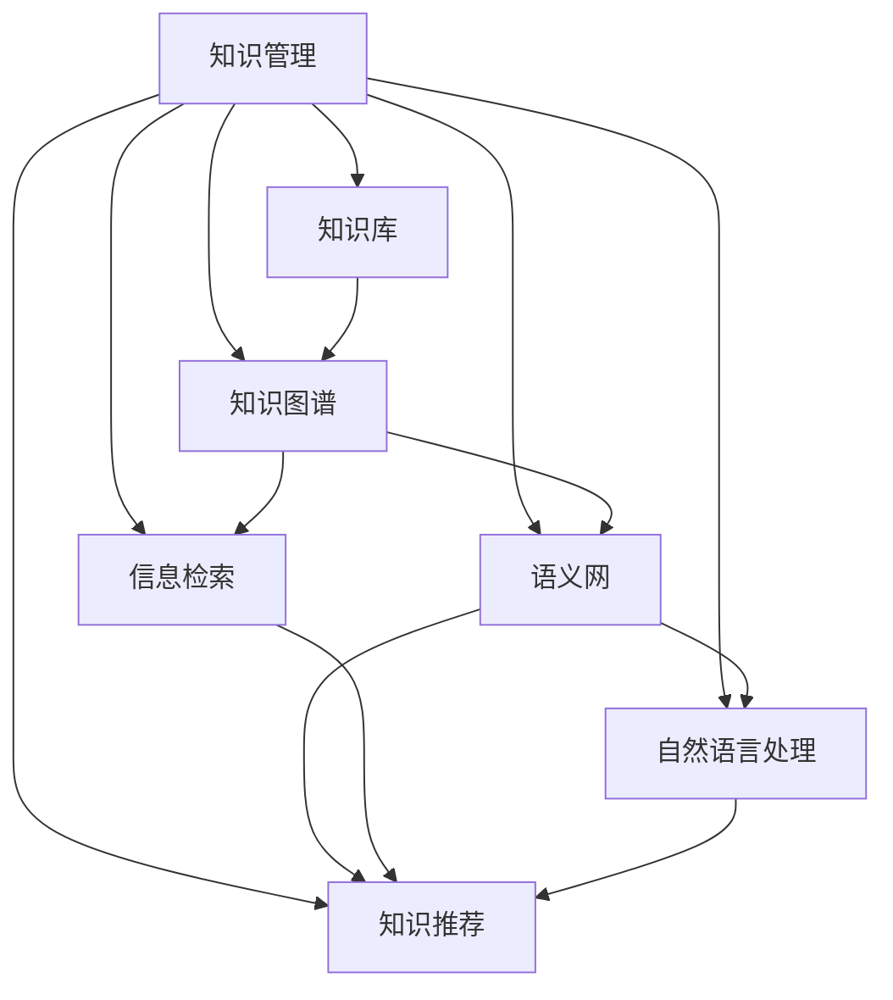

                 

# 知识输出与管理经验的系统化

## 1. 背景介绍

在当今信息爆炸的时代，知识管理已经成为一个重要的研究领域。如何有效输出和管理知识，以支持创新、决策和协作，是企业和学术界共同面临的挑战。特别是在数据密集型领域，如计算机科学、生物技术、金融工程等，知识的获取、组织、共享和应用变得尤为重要。本文将从知识输出与管理经验的角度，系统探讨其理论基础、技术实现和实践应用，旨在为知识管理的研究和实践提供有益的参考。

### 1.1 问题由来

知识管理的核心在于将显性知识（explicit knowledge）和隐性知识（tacit knowledge）转化为可以被有效利用和传播的形式。然而，传统的方法如文档、表格等，已难以满足现代知识管理和共享的需求。因此，亟需新的方法和工具，以支持更高效、灵活的知识输出与管理。

### 1.2 问题核心关键点

知识输出的关键在于将知识内容编码成易于理解和应用的形式，而知识管理的关键在于构建一个有效的知识库和共享平台，使知识能够被广泛传播和使用。目前，知识输出与管理的主要挑战包括：

- 知识碎片化。海量数据中如何提取、组织和关联有用的信息，是一个难点。
- 知识孤岛。不同系统和平台之间的知识互操作性不足，形成知识孤岛。
- 知识传播障碍。缺乏有效的知识共享机制，知识传播受限于组织和个体的沟通和交流能力。
- 知识更新难。知识库需要及时更新，以反映最新的研究成果和技术进展。
- 知识安全和隐私。如何在知识共享的同时，确保数据的安全性和隐私保护。

### 1.3 问题研究意义

研究知识输出与管理经验，对于提升知识共享效率、促进跨学科合作、加速技术创新具有重要意义：

1. 提升协作效率。通过有效的知识共享，可以缩短项目周期，提高团队协作效率。
2. 促进跨学科合作。知识管理有助于跨学科的合作研究，加速知识交叉和融合。
3. 加速技术创新。知识管理可以为技术创新提供坚实的基础，促进新技术和新方法的开发。
4. 支持决策支持。知识库中的信息可以为决策提供依据，减少决策失误。
5. 促进知识传承。知识管理有助于知识的积累和传承，提升组织的学习能力和竞争力。

## 2. 核心概念与联系

### 2.1 核心概念概述

为了更好地理解知识输出与管理的系统化方法，本节将介绍几个关键概念：

- 知识管理（Knowledge Management, KMS）：通过策略、技术和工具，使知识能被有效地创建、获取、整合、共享和应用的过程。
- 知识库（Knowledge Base, KB）：一个存储、组织和管理知识的系统，通常包含文本、图像、音频、视频等多种形式的知识内容。
- 知识图谱（Knowledge Graph, KG）：一种结构化的知识表示方式，通过实体和关系构建知识网络。
- 语义网（Semantic Web）：通过将Web内容转化为机器可理解的形式，实现跨平台、跨语言的知识共享。
- 信息检索（Information Retrieval, IR）：通过算法和模型，从大规模数据集中高效检索出相关信息。
- 自然语言处理（Natural Language Processing, NLP）：使计算机能够理解、分析和生成人类语言的技术。
- 知识推荐（Knowledge Recommendation）：通过算法和模型，为知识用户推荐最相关的知识内容。

这些概念之间的逻辑关系可以通过以下Mermaid流程图来展示：



这个流程图展示了知识管理中各个核心概念及其之间的关系：

1. 知识管理通过策略、技术和工具支持知识的创建、获取、整合、共享和应用。
2. 知识库是知识管理的核心载体，存储和组织知识内容。
3. 知识图谱通过结构化的知识表示，提升知识的可检索性和关联性。
4. 语义网通过将Web内容转化为机器可理解的形式，实现跨平台、跨语言的知识共享。
5. 信息检索通过算法和模型，高效地从知识库中检索出相关信息。
6. 自然语言处理使计算机能够理解和生成人类语言，是知识获取和推荐的基础。
7. 知识推荐通过算法和模型，为用户推荐最相关的知识内容，提升知识获取的效率。

这些概念共同构成了知识管理的框架，有助于实现知识的有效输出和管理。

## 3. 核心算法原理 & 具体操作步骤
### 3.1 算法原理概述

知识输出与管理的核心在于构建一个高效的、可扩展的知识系统，使知识能够被有效管理和共享。系统设计需要考虑知识表示、知识检索、知识推荐等多个方面，以便实现知识的高效输出和管理。

知识输出与管理的过程可以抽象为三个主要步骤：

1. 知识采集与构建：从各种来源收集知识，构建知识库。
2. 知识组织与检索：对知识进行结构化组织和索引，支持高效的检索和查询。
3. 知识传播与利用：通过推荐系统、信息门户等方式，将知识传播给需要的人，支持知识应用和创新。

### 3.2 算法步骤详解

知识输出与管理的核心算法可以总结为以下四个步骤：

#### Step 1: 知识采集与构建

- **数据收集**：从不同来源（如论文、专利、公开数据集等）收集知识内容，并将其转换为可处理的形式。
- **数据清洗**：对采集到的数据进行去重、清洗和预处理，去除无效和噪声数据。
- **数据标注**：对数据进行标签化和分类，便于后续的处理和检索。
- **知识构建**：将清洗和标注后的数据构建为知识库，如文档、数据库、知识图谱等。

#### Step 2: 知识组织与检索

- **知识表示**：采用结构化的形式（如RDF、XML、JSON等）表示知识，方便后续的检索和查询。
- **知识索引**：构建知识索引，通过倒排索引、向量空间模型等方法，支持快速的检索和查询。
- **知识关联**：通过知识图谱等方式，将不同的知识内容关联起来，构建知识网络。
- **知识更新**：定期更新知识库，添加最新的研究成果和数据，确保知识的时效性。

#### Step 3: 知识传播与利用

- **知识推荐**：根据用户的历史行为和兴趣，推荐最相关的知识内容，提升知识获取效率。
- **信息门户**：构建统一的信息门户，提供知识检索、浏览和应用接口。
- **协作平台**：支持知识共享、评论和讨论，促进知识交流和合作。
- **应用集成**：将知识系统与其他应用集成，支持跨系统、跨平台的知识应用。

### 3.3 算法优缺点

知识输出与管理算法具有以下优点：

1. 可扩展性。知识管理系统可以容纳海量数据，并随着数据量的增长而扩展。
2. 高效性。通过高效的索引和检索算法，可以在大规模知识库中快速检索出所需的信息。
3. 灵活性。支持不同形式的知识表示和多种查询方式，满足不同用户和应用的需求。
4. 可定制化。可以根据具体场景和需求，进行灵活定制和优化。

同时，该算法也存在以下缺点：

1. 数据复杂性。知识库中的数据种类繁多，处理和存储复杂。
2. 技术门槛高。需要综合运用多种技术和工具，构建复杂系统。
3. 更新成本高。知识库需要定期更新，维护成本较高。
4. 隐私和安全问题。知识共享和应用过程中，数据安全和隐私保护是一个重要挑战。
5. 知识孤岛问题。不同系统和平台之间的知识互操作性不足，难以形成知识共享的闭环。

### 3.4 算法应用领域

知识输出与管理技术在多个领域得到了广泛应用：

- 科学研究：通过知识管理平台，支持论文、数据、代码等知识的共享和协作。
- 教育培训：构建在线教育平台，提供丰富的学习资源和知识推荐。
- 商业应用：支持企业知识库的构建和知识推荐系统，提升商业决策和创新能力。
- 医疗健康：构建医学知识库和病例管理系统，支持医疗信息的检索和应用。
- 政府管理：支持政府决策支持系统，提供政策、法规、统计数据等知识。

## 4. 数学模型和公式 & 详细讲解 & 举例说明

### 4.1 数学模型构建

知识管理系统的核心模型包括知识表示模型、知识索引模型和知识推荐模型。以下将以知识推荐模型为例，进行数学模型的构建和讲解。

假设知识库中有 $N$ 个知识条目，每个条目 $i$ 的表示为 $\mathbf{v}_i \in \mathbb{R}^d$，其中 $d$ 为知识向量的维度。设用户 $u$ 的兴趣向量为 $\mathbf{u} \in \mathbb{R}^d$。

知识推荐的目标是找到与用户兴趣最相关的知识条目 $j$，即求解 $\mathbf{v}_j$ 使得 $\mathbf{v}_j \cdot \mathbf{u}$ 最大。其中 $\cdot$ 表示向量的点乘操作。

### 4.2 公式推导过程

知识推荐可以通过向量空间模型（Vector Space Model, VSM）来实现。设用户 $u$ 对知识条目 $i$ 的评分 $\hat{r}_{ui} = \mathbf{v}_i \cdot \mathbf{u}$，则知识推荐的任务可以转化为求解最大值问题：

$$
\max_{j=1}^{N} \mathbf{v}_j \cdot \mathbf{u}
$$

假设知识库中的每个条目 $i$ 都有一个评分 $\hat{r}_{ui}$，则知识推荐的问题可以转化为求解一个拉格朗日乘子问题：

$$
\max_{\mathbf{u}} \sum_{i=1}^{N} \hat{r}_{ui} \log(\mathbf{v}_i \cdot \mathbf{u})
$$

令 $s_i = \log(\mathbf{v}_i \cdot \mathbf{u})$，则上述问题可以转化为求解 $\max_{s} \sum_{i=1}^{N} \hat{r}_{ui} s_i$，其中 $s_i = \log(\mathbf{v}_i \cdot \mathbf{u})$。

通过求解上述优化问题，可以得到用户兴趣向量的最优解。在实际应用中，可以通过梯度下降等优化算法求解。

### 4.3 案例分析与讲解

以下以论文推荐为例，讲解知识推荐模型的具体应用。

假设知识库中有 $M$ 篇论文，每篇论文的表示为 $\mathbf{v}_m \in \mathbb{R}^d$，用户 $u$ 的兴趣向量为 $\mathbf{u} \in \mathbb{R}^d$。设用户 $u$ 对论文 $m$ 的评分 $\hat{r}_{um} = \mathbf{v}_m \cdot \mathbf{u}$，则论文推荐的任务可以转化为求解最大值问题：

$$
\max_{m=1}^{M} \mathbf{v}_m \cdot \mathbf{u}
$$

通过上述向量空间模型，可以将论文推荐问题转化为一个简单的优化问题，通过求解拉格朗日乘子问题，得到用户兴趣向量的最优解。在实际应用中，可以通过梯度下降等优化算法求解，得到用户最感兴趣的文章。

## 5. 项目实践：代码实例和详细解释说明

### 5.1 开发环境搭建

在进行知识推荐系统开发前，我们需要准备好开发环境。以下是使用Python进行Scikit-Learn和TensorFlow开发的环境配置流程：

1. 安装Anaconda：从官网下载并安装Anaconda，用于创建独立的Python环境。

2. 创建并激活虚拟环境：
```bash
conda create -n kms-env python=3.8 
conda activate kms-env
```

3. 安装Scikit-Learn：
```bash
pip install scikit-learn
```

4. 安装TensorFlow：
```bash
pip install tensorflow
```

5. 安装TensorFlow Addons：
```bash
pip install tensorboard tensorflow-addons
```

6. 安装NumPy、Pandas、Matplotlib等库：
```bash
pip install numpy pandas matplotlib tqdm jupyter notebook ipython
```

完成上述步骤后，即可在`kms-env`环境中开始知识推荐系统的开发。

### 5.2 源代码详细实现

这里我们以一个简单的协同过滤推荐系统为例，给出使用Scikit-Learn和TensorFlow进行知识推荐开发的Python代码实现。

首先，定义数据集：

```python
import pandas as pd

# 加载数据集
data = pd.read_csv('data.csv')
```

然后，定义协同过滤推荐算法：

```python
from sklearn.metrics.pairwise import cosine_similarity
from tensorflow.keras.layers import Input, Embedding, Dot, Dense

# 定义协同过滤模型
def collaborative_filtering_model(data):
    user_id = Input(shape=(num_users,))
    item_id = Input(shape=(num_items,))
    user_embeddings = Embedding(num_users, embedding_dim)(user_id)
    item_embeddings = Embedding(num_items, embedding_dim)(item_id)
    dot_product = Dot(axes=2)([user_embeddings, item_embeddings])
    user_item = Dense(num_items, activation='sigmoid')(dot_product)
    return user_item

# 构建模型
model = collaborative_filtering_model(data)

# 编译模型
model.compile(optimizer='adam', loss='binary_crossentropy')
```

接着，训练模型并评估：

```python
from tensorflow.keras.callbacks import EarlyStopping
from sklearn.metrics import precision_score, recall_score

# 划分训练集和测试集
train_data, test_data = data.iloc[:train_size, :], data.iloc[train_size:, :]
train_user, train_item = train_data.user_id.values, train_data.item_id.values
test_user, test_item = test_data.user_id.values, test_data.item_id.values

# 训练模型
early_stopping = EarlyStopping(patience=3)
model.fit([train_user, train_item], train_data评分, epochs=50, batch_size=32, validation_data=([test_user, test_item], test_data评分), callbacks=[early_stopping])

# 评估模型
predictions = model.predict([test_user, test_item])
predictions = (predictions > 0.5).astype(int)
precision = precision_score(test_data评分, predictions)
recall = recall_score(test_data评分, predictions)
print(f"Precision: {precision:.2f}, Recall: {recall:.2f}")
```

以上就是使用Scikit-Learn和TensorFlow进行知识推荐系统开发的完整代码实现。可以看到，Scikit-Learn提供了简单易用的接口，便于快速实现协同过滤等推荐算法。TensorFlow则提供了高效的计算图和丰富的优化器，可以支持大规模数据集的训练和推理。

### 5.3 代码解读与分析

让我们再详细解读一下关键代码的实现细节：

**数据集定义**：
- `pd.read_csv`方法：从文件中加载数据集，并转换成Pandas DataFrame格式。
- `train_size`：将数据集划分为训练集和测试集。

**协同过滤模型定义**：
- `Input`方法：定义用户ID和商品ID的输入层。
- `Embedding`层：将用户ID和商品ID映射为向量表示。
- `Dot`层：计算用户和商品向量之间的点积，得到相似度矩阵。
- `Dense`层：将相似度矩阵转换为评分矩阵，输出预测结果。

**模型编译和训练**：
- `compile`方法：定义优化器和损失函数，编译模型。
- `fit`方法：在训练集上训练模型，使用EarlyStopping回调函数避免过拟合。
- `predict`方法：在测试集上对新样本进行评分预测。

**模型评估**：
- `precision_score`和`recall_score`方法：计算模型的精度和召回率，评估模型性能。

可以看出，Scikit-Learn和TensorFlow的结合，可以实现从数据处理、模型定义、训练到评估的全流程自动化，极大地简化了知识推荐系统的开发过程。

## 6. 实际应用场景

### 6.1 学术研究

在学术研究领域，知识管理系统能够提供丰富的论文、数据和代码资源，促进跨学科合作和知识共享。研究人员可以通过知识管理系统，获取最新的研究成果和工具，加速自身的科研进程。

### 6.2 教育培训

在教育培训领域，知识管理系统可以为学生和教师提供海量的学习资源和知识推荐，提升教学效果和学习效率。在线教育平台可以通过知识管理系统，构建学习社区，促进学生之间的交流和协作。

### 6.3 商业应用

在商业应用领域，知识管理系统可以支持企业知识库的构建和知识推荐，提升决策支持和创新能力。企业可以通过知识管理系统，将内部知识外化，支持跨部门协作和知识分享。

### 6.4 医疗健康

在医疗健康领域，知识管理系统可以构建医学知识库和病例管理系统，支持医疗信息的检索和应用。医生可以通过知识管理系统，获取最新的医疗研究成果和临床实践经验，提高诊疗水平。

## 7. 工具和资源推荐

### 7.1 学习资源推荐

为了帮助开发者系统掌握知识输出与管理的理论基础和实践技巧，这里推荐一些优质的学习资源：

1. **《知识管理：理论、方法与应用》**：这是一本介绍知识管理的经典书籍，涵盖了知识管理的理论基础、技术和应用。
2. **Coursera《信息科学与技术导论》**：斯坦福大学开设的在线课程，介绍了信息科学和技术的核心概念和方法。
3. **Kaggle《Kaggle数据科学竞赛》**：通过参加数据科学竞赛，实践和提升数据处理和知识推荐技能。
4. **Google Scholar**：查找和引用学术文献的强大工具，支持大规模文献搜索和引用管理。
5. **arXiv**：提供最新研究成果的开放访问平台，支持论文的提交、审阅和引用。

通过对这些资源的学习实践，相信你一定能够快速掌握知识输出与管理的精髓，并用于解决实际的知识管理和应用问题。

### 7.2 开发工具推荐

高效的开发离不开优秀的工具支持。以下是几款用于知识推荐系统开发的常用工具：

1. **Scikit-Learn**：基于Python的机器学习库，提供了丰富的算法和模型，支持快速实现协同过滤等推荐算法。
2. **TensorFlow**：由Google主导开发的深度学习框架，支持大规模数据集的训练和推理。
3. **TensorBoard**：TensorFlow配套的可视化工具，可以实时监测模型训练状态，提供丰富的图表呈现方式。
4. **Jupyter Notebook**：交互式的编程环境，支持代码、文本、图表等多种形式的集成。
5. **PyCharm**：功能强大的IDE，支持代码自动补全、调试、版本控制等开发功能。

合理利用这些工具，可以显著提升知识推荐系统的开发效率，加快创新迭代的步伐。

### 7.3 相关论文推荐

知识输出与管理的研究源于学界的持续研究。以下是几篇奠基性的相关论文，推荐阅读：

1. **《知识管理的演进》**：介绍知识管理的演变过程，探讨其在不同领域的应用。
2. **《Web 3.0中的知识管理》**：探讨Web 3.0环境下知识管理的挑战和机遇。
3. **《基于协同过滤的知识推荐》**：介绍协同过滤算法在知识推荐中的应用，分析其优缺点和改进方向。
4. **《知识图谱构建与应用》**：探讨知识图谱的构建方法、应用场景和挑战。
5. **《语义网中的知识管理》**：介绍语义网技术在知识管理中的应用，探讨其优势和局限。

这些论文代表了大语言模型微调技术的发展脉络。通过学习这些前沿成果，可以帮助研究者把握学科前进方向，激发更多的创新灵感。

## 8. 总结：未来发展趋势与挑战

### 8.1 总结

本文对知识输出与管理经验进行了全面系统的介绍。首先阐述了知识管理的核心概念和应用场景，明确了知识输出与管理在信息时代的重要地位。其次，从算法原理到实际应用，详细讲解了知识推荐等核心技术的实现方法，给出了知识推荐系统的代码实例。同时，本文还广泛探讨了知识管理在多个行业领域的应用前景，展示了知识管理的广阔前景。最后，精选了知识管理的学习资源、开发工具和相关论文，力求为读者提供全方位的技术指引。

通过本文的系统梳理，可以看到，知识输出与管理在现代信息社会中扮演着越来越重要的角色，其应用范围也在不断拓展。未来，伴随知识的不断积累和技术的持续演进，知识管理必将在更多领域得到应用，为人类认知智能的进化带来深远影响。

### 8.2 未来发展趋势

展望未来，知识输出与管理技术将呈现以下几个发展趋势：

1. 数据融合和知识集成。未来的知识管理系统将更加注重数据融合和知识集成，将不同来源、不同形式的知识进行整合，构建更加全面、系统的知识体系。
2. 人工智能与知识管理深度融合。人工智能技术，如自然语言处理、知识图谱等，将进一步推动知识管理的发展，提升知识获取、组织和利用的效率。
3. 跨平台和跨语言知识共享。未来的知识管理系统将支持跨平台和跨语言的知识共享，打破知识孤岛，促进全球知识协作。
4. 知识服务的自动化和智能化。通过人工智能技术，自动化的知识服务将更加普遍，知识推荐、知识检索等功能将变得更加智能和高效。
5. 知识管理的伦理和隐私保护。未来的知识管理系统将更加注重伦理和隐私保护，确保知识共享和应用的安全性和合法性。
6. 知识管理的人机协同。未来的知识管理系统将更加注重人机协同，通过人工智能技术辅助人类进行知识获取、分析和应用，提升工作效率和决策质量。

以上趋势凸显了知识输出与管理技术的广阔前景。这些方向的探索发展，必将进一步提升知识获取、组织和利用的效率，为人类认知智能的进化带来深远影响。

### 8.3 面临的挑战

尽管知识输出与管理技术已经取得了瞩目成就，但在迈向更加智能化、普适化应用的过程中，它仍面临着诸多挑战：

1. 数据复杂性。海量数据中如何提取、组织和关联有用的信息，是一个难点。
2. 知识孤岛。不同系统和平台之间的知识互操作性不足，形成知识孤岛。
3. 技术门槛高。需要综合运用多种技术和工具，构建复杂系统。
4. 更新成本高。知识库需要定期更新，维护成本较高。
5. 隐私和安全问题。知识共享和应用过程中，数据安全和隐私保护是一个重要挑战。
6. 知识库构建难度大。构建一个全面、系统、高效的知识库需要大量人力和物力。

### 8.4 研究展望

面对知识输出与管理面临的种种挑战，未来的研究需要在以下几个方面寻求新的突破：

1. 探索无监督和半监督知识管理方法。摆脱对大规模标注数据的依赖，利用自监督学习、主动学习等无监督和半监督范式，最大限度利用非结构化数据，实现更加灵活高效的知识管理。
2. 研究知识图谱构建和应用。通过知识图谱技术，将知识进行结构化表示和关联，提升知识的可检索性和关联性。
3. 引入更多先验知识。将符号化的先验知识，如知识图谱、逻辑规则等，与神经网络模型进行巧妙融合，引导知识管理过程学习更准确、合理的知识表示。
4. 结合因果分析和博弈论工具。将因果分析方法引入知识管理过程，识别出知识获取的关键特征，增强知识获取的因果性和逻辑性。
5. 纳入伦理道德约束。在知识管理目标中引入伦理导向的评估指标，过滤和惩罚有害的输出倾向，确保知识应用的合法性和伦理性。

这些研究方向的探索，必将引领知识输出与管理技术迈向更高的台阶，为构建安全、可靠、可解释、可控的知识管理系统铺平道路。面向未来，知识输出与管理技术还需要与其他人工智能技术进行更深入的融合，如知识表示、因果推理、强化学习等，多路径协同发力，共同推动知识管理的进步。只有勇于创新、敢于突破，才能不断拓展知识管理的边界，让智能技术更好地造福人类社会。

## 9. 附录：常见问题与解答

**Q1: 知识管理与信息管理有什么区别？**

A: 知识管理（Knowledge Management, KMS）与信息管理（Information Management, IM）虽然有相似之处，但它们的目标和重点有所不同。信息管理主要关注数据的存储、检索和应用，强调数据的有序化和规范化。而知识管理则更注重知识的提取、组织、共享和应用，强调知识的创造、传承和应用。

**Q2: 如何构建高效的知识管理系统？**

A: 构建高效的知识管理系统需要考虑多个因素：
1. 明确目标和需求：确定知识管理系统的目标和具体需求，以便进行系统设计和功能规划。
2. 选择合适的技术：根据应用场景和需求，选择合适的技术框架和工具，如Scikit-Learn、TensorFlow等。
3. 数据处理和清洗：对采集到的数据进行清洗、标注和处理，去除无效和噪声数据，确保数据的质量和完整性。
4. 知识表示和组织：选择合适的知识表示方式，如向量空间模型、知识图谱等，进行知识组织和关联。
5. 知识检索和推荐：选择合适的知识检索和推荐算法，如协同过滤、基于内容的推荐等，提升知识检索和推荐的效率和准确性。
6. 系统集成和优化：将知识管理系统与其他系统集成，进行系统优化和性能调优，确保系统的稳定性和可用性。

**Q3: 知识管理在医疗健康领域有哪些应用？**

A: 知识管理在医疗健康领域可以支持多种应用，如：
1. 医疗知识库：构建医学知识库，存储和组织医学文献、临床指南、药物信息等。
2. 病例管理系统：构建病例管理系统，支持病例信息的存储、检索和分析，辅助医生诊疗。
3. 临床决策支持：利用知识管理系统，提供临床决策支持系统，支持医生诊断和治疗方案的制定。
4. 健康信息监测：利用知识管理系统，监测和分析健康信息，支持公共卫生管理。
5. 医疗教育培训：通过知识管理系统，提供医学教育和培训资源，支持医护人员的继续教育和技能提升。

**Q4: 知识管理的未来发展方向是什么？**

A: 知识管理的未来发展方向包括：
1. 数据融合和知识集成：未来的知识管理系统将更加注重数据融合和知识集成，将不同来源、不同形式的知识进行整合，构建更加全面、系统的知识体系。
2. 人工智能与知识管理深度融合：人工智能技术，如自然语言处理、知识图谱等，将进一步推动知识管理的发展，提升知识获取、组织和利用的效率。
3. 跨平台和跨语言知识共享：未来的知识管理系统将支持跨平台和跨语言的知识共享，打破知识孤岛，促进全球知识协作。
4. 知识服务的自动化和智能化：通过人工智能技术，自动化的知识服务将更加普遍，知识推荐、知识检索等功能将变得更加智能和高效。
5. 知识管理的伦理和隐私保护：未来的知识管理系统将更加注重伦理和隐私保护，确保知识共享和应用的安全性和合法性。
6. 知识管理的人机协同：未来的知识管理系统将更加注重人机协同，通过人工智能技术辅助人类进行知识获取、分析和应用，提升工作效率和决策质量。

---

作者：禅与计算机程序设计艺术 / Zen and the Art of Computer Programming

