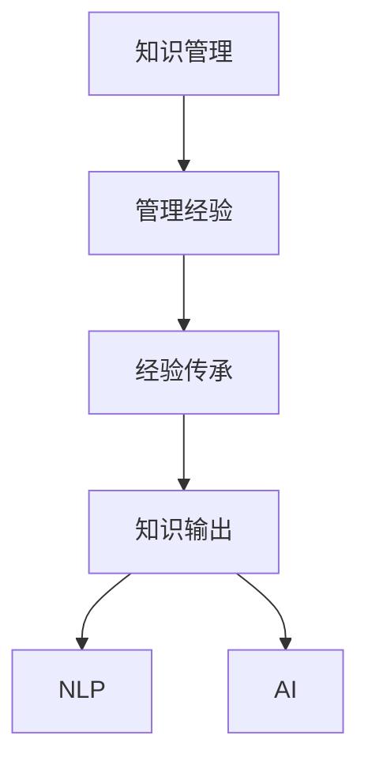

                 

# 知识输出促进管理经验传承

> 关键词：知识管理,管理经验,经验传承,知识输出,人工智能,自然语言处理(NLP)

## 1. 背景介绍

### 1.1 问题由来

在现代企业管理中，知识经验的积累和传承是一项极其重要的工作。良好的知识管理可以有效提升组织效率，增强竞争力，促进创新。然而，传统的知识管理模式存在诸多局限性：

- 文档资料分散，难以系统整理。组织内部的各类文档、记录、手册等分散在各个角落，缺乏有效的管理工具，查找困难。
- 员工流转频繁，经验流失严重。尤其是高层管理人员频繁调岗，其积累的经验难以有效传承，形成"经验壁垒"。
- 经验难以量化，传承效果不理想。经验类知识往往以模糊的描述形式存在，难以清晰传递和量化评估。
- 知识更新缓慢，难以适应变化。随着市场环境的变化，组织内部积累的知识无法及时更新，甚至形成"知识盲区"。

在数字化转型的浪潮中，通过技术手段将知识经验系统化、规范化、高效化管理，成为管理实践的重要需求。

### 1.2 问题核心关键点

在知识管理中，将知识经验传承至新员工是一项关键任务。良好的经验传承可以帮助新员工快速掌握工作技能，提升整体工作效率。这一过程的核心在于知识输出和积累。

经验传承的核心流程包括以下几个关键环节：
1. **知识输入**：由资深员工提供，涵盖日常工作中的具体任务、流程、规则等。
2. **知识输出**：通过各种形式将知识输入传递给新员工，帮助其快速适应工作环境。
3. **反馈机制**：定期收集新员工的反馈，了解知识输出效果，优化知识管理流程。
4. **迭代改进**：根据反馈结果，不断调整和优化知识输出策略，提升传承效果。

但现有的知识输出过程仍然存在诸多挑战：
- 知识输出缺乏系统化。资深员工往往无法系统全面地总结经验，导致知识输出零散，难以形成体系。
- 知识输出缺乏形式化。资深员工输出的往往是口头或非正式的文档，难以标准化和推广。
- 知识输出缺乏效率化。资深员工输出经验往往需要耗费大量时间，且效果不理想。

因此，需要一种高效、系统、规范的知识输出方法，帮助企业更好地进行经验传承。

## 2. 核心概念与联系

### 2.1 核心概念概述

为更好地理解知识输出促进管理经验传承的方法，本节将介绍几个密切相关的核心概念：

- 知识管理(Knowledge Management, KMS)：通过信息技术对组织内部的显性知识和隐性知识进行识别、获取、整合、存储、共享和应用的过程。旨在提升组织决策能力，增强竞争力。

- 管理经验：在长期的管理实践过程中积累的经验、方法和技巧，包括但不限于问题处理、决策制定、团队协作等。管理经验在企业的日常运营和战略决策中具有重要价值。

- 经验传承：将组织内部的管理经验通过各种方式传递给新员工，帮助其更快地适应岗位要求，提升整体工作绩效。

- 知识输出：将管理经验以系统化、规范化的形式传递给目标受众，如通过文档、培训、交流等方式。

- 自然语言处理(Natural Language Processing, NLP)：通过计算机技术处理和理解人类语言的技术，涉及文本分析、语音识别、机器翻译等。在知识输出中，NLP技术可以用于文本生成、语义理解、知识抽取等环节，提升知识输出的效果和效率。

- 人工智能(Artificial Intelligence, AI)：利用计算机技术和算法模拟人类智能活动的技术，包括机器学习、深度学习、强化学习等。在知识输出中，AI可以用于个性化推荐、智能问答、知识图谱构建等，提供高效的知识输出手段。

这些核心概念之间的逻辑关系可以通过以下Mermaid流程图来展示：



这个流程图展示了一个完整的经验传承过程，其中：

1. 知识管理是经验传承的基础，帮助组织识别和管理内部知识。
2. 经验传承是知识管理的最终目标，通过知识输出将经验传递给新员工。
3. 知识输出是经验传承的重要手段，需要结合NLP和AI技术，实现高效规范的输出。
4. NLP技术用于文本处理、知识抽取等环节，提升知识输出的准确性和规范性。
5. AI技术用于个性化推荐、智能问答等环节，提升知识输出的效率和互动性。

这些概念共同构成了知识输出促进管理经验传承的完整框架，帮助企业在知识管理和经验传承过程中取得更好的效果。

## 3. 核心算法原理 & 具体操作步骤
### 3.1 算法原理概述

基于知识输出促进管理经验传承的算法，旨在通过系统化的知识输出，提升组织内部的知识管理效果。其核心思想是：将资深员工的管理经验系统化、形式化、高效化，通过各种渠道传递给新员工，并不断优化知识输出流程。

该算法主要分为以下步骤：
1. **知识输入获取**：从资深员工处获取经验，通过结构化访谈、文档收集等方式进行知识输入。
2. **知识输出设计**：设计知识输出的形式和渠道，如文档、视频、音频、互动问答等。
3. **知识输出实施**：通过NLP和AI技术，实现高效的知识输出。
4. **知识输出反馈**：定期收集新员工的反馈，优化知识输出流程。

### 3.2 算法步骤详解

**Step 1: 知识输入获取**

- 设定访谈提纲：根据岗位需求，设计访谈提纲，涵盖工作职责、任务流程、经验教训等。
- 进行结构化访谈：由资深员工填写或访谈，获取经验信息。
- 文本整理归档：将获取的文本信息进行整理归档，生成知识库。

**Step 2: 知识输出设计**

- 选择输出形式：根据岗位特点和知识内容，选择适合的知识输出形式，如文档、视频、音频等。
- 设计知识模板：根据不同知识类型，设计相应的知识模板，提升知识输出的规范性。
- 确定输出渠道：选择合适的知识输出渠道，如内部培训、企业官网、知识管理系统等。

**Step 3: 知识输出实施**

- 使用NLP技术：利用NLP技术对知识库进行文本处理、语义分析、知识抽取等，生成适合的知识输出内容。
- 应用AI技术：利用AI技术进行个性化推荐、智能问答、知识图谱构建等，提升知识输出的互动性和效果。

**Step 4: 知识输出反馈**

- 设计反馈机制：定期收集新员工的反馈，了解知识输出效果。
- 优化输出策略：根据反馈结果，调整和优化知识输出流程和策略。

### 3.3 算法优缺点

基于知识输出促进管理经验传承的算法具有以下优点：
1. 系统化规范化：通过系统化的知识输出设计，提升知识输出的规范性和系统性。
2. 高效化互动化：结合NLP和AI技术，实现高效的知识输出和互动交流。
3. 实时化动态化：通过定期反馈和优化，实现实时化的知识更新和动态调整。

同时，该算法也存在以下局限性：
1. 对技术依赖较高：NLP和AI技术的深度应用，需要较高的技术门槛。
2. 知识输出门槛较高：设计知识模板和输出策略，需要资深员工和IT人员的协同工作。
3. 数据隐私风险：在知识输出的过程中，可能涉及敏感数据，需要严格的数据隐私保护措施。

尽管存在这些局限性，但通过合理设计和管理，仍然可以实现高效的知识输出和经验传承。

### 3.4 算法应用领域

基于知识输出促进管理经验传承的算法，在企业管理中的应用前景广泛，涵盖以下领域：

- 人力资源管理：通过系统化的知识输出，提升新员工对公司政策和流程的理解，加速员工融入。
- 业务流程管理：将业务流程管理的经验系统化，提升流程执行的规范性和效率。
- 产品开发管理：将产品开发管理的经验系统化，提升团队协作和产品质量。
- 客户关系管理：将客户关系管理的经验系统化，提升客户服务的质量和满意度。
- 知识驱动创新：将组织内部的知识进行系统化管理和传承，推动持续创新和知识共享。

以上领域只是基于知识输出促进管理经验传承的部分应用场景，实际应用中，可以根据组织特点和业务需求，进一步扩展和深化。

## 4. 数学模型和公式 & 详细讲解 & 举例说明
### 4.1 数学模型构建

本节将使用数学语言对基于知识输出促进管理经验传承的算法过程进行更加严格的刻画。

假设资深员工的经验为 $E$，新员工的知识库为 $K$，知识输出的形式为 $F$，知识输出的效果为 $P$。则知识输出过程的数学模型为：

$$
P = F(E, K)
$$

其中，$F$ 为知识输出的函数，输入为资深员工的经验 $E$ 和新员工的知识库 $K$，输出为知识输出的效果 $P$。

### 4.2 公式推导过程

根据知识输出的流程，可以将知识输出过程分为以下几个阶段：

1. **知识输入阶段**：通过结构化访谈或文档收集等方式，获取资深员工的经验 $E$。
2. **知识输出设计阶段**：选择适合的知识输出形式 $F_1$，设计知识模板 $T$，确定输出渠道 $C$。
3. **知识输出实施阶段**：使用NLP技术对知识库 $K$ 进行处理，生成知识输出内容 $G$，应用AI技术进行个性化推荐和智能问答。
4. **知识输出反馈阶段**：定期收集新员工反馈 $R$，优化知识输出策略。

通过上述步骤，最终的知识输出效果 $P$ 可以表示为：

$$
P = F_1(E, T) \times G(C) \times R
$$

其中：
- $F_1$ 为知识输出形式的设计函数，输入为资深员工的经验 $E$ 和知识模板 $T$。
- $G$ 为知识输出内容的生成函数，输入为知识库 $K$ 和输出渠道 $C$。
- $R$ 为知识输出的反馈函数，输入为知识输出的效果 $P$ 和新员工的反馈 $R$。

### 4.3 案例分析与讲解

假设某公司需要对新员工进行业务流程培训，具体流程如下：

**Step 1: 知识输入获取**

- 设计访谈提纲：包含业务流程、任务流程、经验教训等。
- 进行结构化访谈：资深员工填写或访谈，获取经验信息。
- 文本整理归档：将获取的文本信息进行整理归档，生成知识库。

**Step 2: 知识输出设计**

- 选择输出形式：文档、视频、音频等。
- 设计知识模板：详细描述业务流程、任务流程、操作规范等。
- 确定输出渠道：企业内部培训平台、知识管理系统等。

**Step 3: 知识输出实施**

- 使用NLP技术：利用NLP技术对知识库进行处理，生成知识输出内容。
- 应用AI技术：通过智能问答系统进行个性化推荐和互动交流。

**Step 4: 知识输出反馈**

- 设计反馈机制：定期收集新员工的反馈，了解知识输出效果。
- 优化输出策略：根据反馈结果，调整和优化知识输出流程和策略。

通过上述步骤，可以将资深员工的经验系统化、规范化、高效化，帮助新员工快速掌握业务流程，提升整体工作效率。

## 5. 项目实践：代码实例和详细解释说明
### 5.1 开发环境搭建

在进行知识输出实践前，我们需要准备好开发环境。以下是使用Python进行知识管理系统开发的环境配置流程：

1. 安装Anaconda：从官网下载并安装Anaconda，用于创建独立的Python环境。

2. 创建并激活虚拟环境：
```bash
conda create -n kms-env python=3.8 
conda activate kms-env
```

3. 安装必要的Python包：
```bash
pip install flask flask-sqlalchemy sqlalchemy
```

4. 创建数据库：
```bash
pip install flask-migrate
```

5. 创建知识管理系统API：
```bash
pip install flask-restful
```

完成上述步骤后，即可在`kms-env`环境中开始知识管理系统的开发。

### 5.2 源代码详细实现

这里我们以知识文档管理系统为例，给出使用Flask进行知识管理系统开发的Python代码实现。

首先，定义知识文档的模型：

```python
from flask_sqlalchemy import SQLAlchemy
from sqlalchemy import Column, Integer, String
from sqlalchemy.orm import relationship

db = SQLAlchemy()

class Document(db.Model):
    id = Column(Integer, primary_key=True)
    title = Column(String(255), unique=True)
    content = Column(String)
    author = Column(String(255))
    create_date = Column(String(255))
```

然后，定义知识文档的管理接口：

```python
from flask import Flask, request, jsonify
from flask_restful import Resource

app = Flask(__name__)
api = FlaskRestful.Api(app)

class Documents(Resource):
    def get(self):
        documents = Document.query.all()
        return jsonify([{'id': doc.id, 'title': doc.title, 'author': doc.author, 'create_date': doc.create_date} for doc in documents])

    def post(self):
        data = request.get_json()
        document = Document(title=data['title'], content=data['content'], author=data['author'], create_date=datetime.datetime.now().strftime('%Y-%m-%d %H:%M:%S'))
        db.session.add(document)
        db.session.commit()
        return jsonify({'message': 'Document created'})

api.add_resource(Documents, '/documents')
```

最后，启动服务：

```bash
flask run
```

以上就是一个简单的知识文档管理系统的Python代码实现。可以看到，通过Flask和SQLAlchemy，我们实现了知识文档的增删改查功能。

### 5.3 代码解读与分析

让我们再详细解读一下关键代码的实现细节：

**Document模型**：
- 定义了知识文档的基本属性：ID、标题、内容、作者、创建时间。
- 使用了SQLAlchemy的ORM框架，方便数据库的增删改查操作。

**Documents接口**：
- 实现了获取知识文档列表和创建新文档的接口。
- 通过Flask和Flask-RESTful，实现了RESTful风格的API接口，方便客户端调用。

**启动服务**：
- 使用Flask的`run`方法，启动Web服务，监听HTTP请求。

以上代码实现了基本的知识文档管理系统，可以根据需求进一步扩展和优化，如添加用户管理、权限控制、搜索过滤等功能。

## 6. 实际应用场景
### 6.1 知识驱动的人力资源管理

在人力资源管理中，通过知识输出可以快速传递和分享组织内部的人事政策、招聘流程、培训计划等知识。具体场景如下：

- 设计知识输出模板：包含岗位职责、考核标准、绩效评估等，帮助新员工快速了解岗位要求。
- 创建知识文档库：将各类人事政策、培训手册、招聘流程等知识文档存储在知识库中。
- 应用AI推荐系统：通过智能问答系统进行个性化推荐，提升新员工的适应效率。
- 定期收集反馈：定期收集新员工的反馈，优化知识输出策略。

### 6.2 知识驱动的业务流程管理

在业务流程管理中，通过知识输出可以快速传递和分享组织内部的流程规范、操作规范等知识。具体场景如下：

- 设计知识输出模板：包含业务流程、任务流程、操作规范等，帮助新员工快速掌握流程规范。
- 创建知识文档库：将各类流程规范、操作手册、技术文档等知识文档存储在知识库中。
- 应用NLP工具：通过NLP工具进行文本处理和知识抽取，生成知识输出内容。
- 定期收集反馈：定期收集新员工的反馈，优化知识输出策略。

### 6.3 知识驱动的产品开发管理

在产品开发管理中，通过知识输出可以快速传递和分享组织内部的产品规划、需求分析、技术实现等知识。具体场景如下：

- 设计知识输出模板：包含产品规划、需求规格、技术方案等，帮助新员工快速了解产品需求。
- 创建知识文档库：将各类产品文档、需求文档、技术方案等知识文档存储在知识库中。
- 应用AI推荐系统：通过智能问答系统进行个性化推荐，提升新员工的产品理解能力。
- 定期收集反馈：定期收集新员工的反馈，优化知识输出策略。

### 6.4 知识驱动的客户关系管理

在客户关系管理中，通过知识输出可以快速传递和分享组织内部的客户服务规范、客户沟通技巧等知识。具体场景如下：

- 设计知识输出模板：包含客户服务规范、沟通技巧、客户反馈处理等，帮助新员工快速了解客户服务流程。
- 创建知识文档库：将各类客户服务手册、沟通技巧文档、客户反馈处理手册等知识文档存储在知识库中。
- 应用NLP工具：通过NLP工具进行文本处理和知识抽取，生成知识输出内容。
- 定期收集反馈：定期收集新员工的反馈，优化知识输出策略。

## 7. 工具和资源推荐
### 7.1 学习资源推荐

为了帮助开发者系统掌握知识输出促进管理经验传承的理论基础和实践技巧，这里推荐一些优质的学习资源：

1. 《知识管理与组织学习》系列书籍：系统介绍知识管理的理论和实践方法，涵盖知识分类、知识获取、知识共享等环节。
2. 《企业知识管理系统建设与运营》课程：介绍企业知识管理系统的建设与运营流程，包括系统设计、知识文档管理、用户管理等。
3. 《人工智能驱动的知识管理》报告：深度剖析人工智能在知识管理中的应用，包括NLP、AI推荐系统等技术。
4. HuggingFace官方文档：包含大量预训练语言模型的实现，支持NLP技术在知识管理中的应用。
5. Weights & Biases：模型训练的实验跟踪工具，记录和可视化模型训练过程中的各项指标，方便调试和优化。

通过对这些资源的学习实践，相信你一定能够快速掌握知识输出促进管理经验传承的精髓，并用于解决实际的业务问题。

### 7.2 开发工具推荐

高效的开发离不开优秀的工具支持。以下是几款用于知识管理系统的常用工具：

1. Flask：基于Python的开源Web框架，灵活高效，适合快速迭代研究。

2. SQLAlchemy：Python的ORM框架，方便数据库的增删改查操作。

3. Flask-RESTful：Flask的扩展，方便实现RESTful风格的API接口，便于客户端调用。

4. Weights & Biases：模型训练的实验跟踪工具，记录和可视化模型训练过程中的各项指标，方便调试和优化。

5. TensorBoard：TensorFlow配套的可视化工具，实时监测模型训练状态，提供丰富的图表呈现方式。

6. Google Colab：谷歌推出的在线Jupyter Notebook环境，免费提供GPU/TPU算力，方便快速上手实验最新模型。

合理利用这些工具，可以显著提升知识管理系统的开发效率，加快创新迭代的步伐。

### 7.3 相关论文推荐

知识管理和大语言模型微调技术的发展源于学界的持续研究。以下是几篇奠基性的相关论文，推荐阅读：

1. "Knowledge Management: An Organizational Framework and its Proposed Implementation in Business"（Knowledge Management: An Organizational Framework and Its Proposed Implementation in Business）：介绍了知识管理的理论框架和实际应用方法。

2. "A Survey of Knowledge Management Systems"（A Survey of Knowledge Management Systems）：综述了各类知识管理系统的实现方法和应用场景。

3. "Knowledge Management for Organizational Success"（Knowledge Management for Organizational Success）：探讨了知识管理对组织成功的影响。

4. "Knowledge Management in Practice: A Review of Current Research and Trends"（Knowledge Management in Practice: A Review of Current Research and Trends）：总结了知识管理领域的最新研究和趋势。

5. "Artificial Intelligence and Knowledge Management"（Artificial Intelligence and Knowledge Management）：探讨了AI在知识管理中的应用，包括NLP、AI推荐系统等技术。

这些论文代表了大语言模型微调技术的发展脉络。通过学习这些前沿成果，可以帮助研究者把握学科前进方向，激发更多的创新灵感。

## 8. 总结：未来发展趋势与挑战
### 8.1 总结

本文对基于知识输出促进管理经验传承的算法进行了全面系统的介绍。首先阐述了知识管理和经验传承在企业管理中的重要性，明确了知识输出的核心流程和目标。其次，从原理到实践，详细讲解了知识输出设计的数学模型和具体步骤，给出了知识管理系统开发的完整代码实例。同时，本文还探讨了知识输出在人力资源管理、业务流程管理、产品开发管理等领域的实际应用，展示了知识输出技术的多样性和广泛性。

通过本文的系统梳理，可以看到，基于知识输出促进管理经验传承的方法，能够有效提升组织内部的知识管理效果，实现经验的高效传承和积累。未来，伴随着知识管理技术的持续演进，知识输出将在企业管理中发挥越来越重要的作用，促进组织的持续创新和发展。

### 8.2 未来发展趋势

展望未来，知识输出促进管理经验传承技术将呈现以下几个发展趋势：

1. 数据驱动：结合大数据技术，通过数据分析和挖掘，实现知识输出内容的精准化和个性化。
2. 智能优化：引入机器学习、深度学习等AI技术，优化知识输出的策略和效果。
3. 多模态融合：结合文本、图像、视频等多模态数据，提升知识输出的全面性和互动性。
4. 跨领域应用：将知识输出技术应用于更多行业和领域，提升各行业的信息共享和协作效率。
5. 知识自动化：引入自然语言处理、知识图谱等技术，自动化生成知识输出内容，提升知识输出的效率和质量。

这些趋势凸显了知识输出技术的广阔前景。这些方向的探索发展，必将进一步提升组织内部的知识管理效果，促进组织的持续创新和发展。

### 8.3 面临的挑战

尽管知识输出技术已经取得了一定的进展，但在迈向更加智能化、普适化应用的过程中，它仍面临着诸多挑战：

1. 数据质量瓶颈：知识输出的质量高度依赖于知识输入的质量，缺乏高质量的知识输入，知识输出的效果难以保证。
2. 技术实现复杂：知识输出技术需要结合多种技术和方法，技术实现复杂度较高。
3. 知识更新困难：知识输出内容需要及时更新，以保证与业务需求和技术进步同步。
4. 用户接受度问题：部分用户对知识输出方式的接受度较低，需要采用更灵活和多样化的知识输出形式。
5. 隐私和安全风险：知识输出过程中可能涉及敏感数据，需要严格的数据隐私保护措施。

尽管存在这些挑战，但通过合理设计和管理，仍然可以实现高效的知识输出和经验传承。

### 8.4 研究展望

面对知识输出面临的种种挑战，未来的研究需要在以下几个方面寻求新的突破：

1. 优化知识输入方法：引入大数据技术和自动化工具，提升知识输入的质量和效率。
2. 强化知识输出策略：结合机器学习和深度学习等AI技术，优化知识输出的策略和效果。
3. 丰富知识输出形式：结合文本、图像、视频等多模态数据，提升知识输出的全面性和互动性。
4. 拓展知识输出应用：将知识输出技术应用于更多行业和领域，提升各行业的信息共享和协作效率。
5. 提升知识输出效率：引入自然语言处理、知识图谱等技术，自动化生成知识输出内容，提升知识输出的效率和质量。

这些研究方向的探索，必将引领知识输出技术迈向更高的台阶，为组织内部的知识管理提供更高效、更智能、更灵活的解决方案。面向未来，知识输出技术还需要与其他AI技术进行更深入的融合，如知识图谱、因果推理、强化学习等，共同推动知识管理系统的进步。只有勇于创新、敢于突破，才能不断拓展知识输出的边界，让知识管理更好地服务于组织的发展。

## 9. 附录：常见问题与解答

**Q1：知识输出如何提升组织内部知识管理效果？**

A: 知识输出将组织内部的知识系统化、规范化、高效化，通过各种渠道传递给目标受众，帮助其快速适应和掌握知识。通过知识输出的反馈机制，不断优化知识管理流程，实现持续的知识更新和优化。

**Q2：知识输出过程中如何确保数据隐私？**

A: 在知识输出过程中，需要严格控制敏感数据的访问权限，采用加密、匿名化等技术手段保护数据隐私。同时，建立数据使用的合规性和审计机制，确保数据使用的合法性和安全性。

**Q3：知识输出如何实现个性化推荐？**

A: 利用NLP技术和知识图谱，对知识库进行文本处理和知识抽取，生成个性化推荐内容。同时，通过智能问答系统进行实时互动，根据用户反馈动态调整推荐策略。

**Q4：知识输出技术在人力资源管理中的应用场景有哪些？**

A: 知识输出在人力资源管理中的应用场景包括：
- 新员工入职培训：通过知识输出模板，帮助新员工快速掌握公司政策和流程。
- 岗位培训手册：提供详细的岗位职责、考核标准、绩效评估等知识输出内容。
- 员工手册：涵盖企业文化、福利政策、健康安全等知识输出内容。

**Q5：知识输出技术在业务流程管理中的应用场景有哪些？**

A: 知识输出在业务流程管理中的应用场景包括：
- 业务流程规范：提供详细的业务流程规范、操作规范等知识输出内容。
- 操作手册：涵盖各类操作手册、技术方案等知识输出内容。
- 流程优化建议：通过知识输出反馈机制，收集员工反馈，优化流程规范。

**Q6：知识输出技术在产品开发管理中的应用场景有哪些？**

A: 知识输出在产品开发管理中的应用场景包括：
- 产品规划：提供详细的项目规划、需求分析等知识输出内容。
- 技术方案：涵盖各类技术方案、架构设计等知识输出内容。
- 用户手册：涵盖产品操作手册、用户指南等知识输出内容。

**Q7：知识输出技术在客户关系管理中的应用场景有哪些？**

A: 知识输出在客户关系管理中的应用场景包括：
- 客户服务规范：提供详细的客户服务规范、沟通技巧等知识输出内容。
- 客户反馈处理：涵盖客户反馈处理流程、处理规范等知识输出内容。
- 客户沟通技巧：涵盖各类客户沟通技巧、销售技巧等知识输出内容。

**Q8：知识输出技术在知识图谱构建中的应用场景有哪些？**

A: 知识输出在知识图谱构建中的应用场景包括：
- 知识抽取：从文本、图像、视频等多模态数据中抽取结构化知识。
- 知识融合：将知识输出内容与外部知识库、规则库等专家知识结合，提升知识输出的全面性和准确性。
- 知识推理：利用知识图谱进行因果分析、逻辑推理等，增强知识输出的解释性和可控性。

通过这些问题和解答，我们可以看到，知识输出技术在企业管理中的广泛应用前景和重要价值，通过合理设计和优化，可以有效提升组织内部的知识管理效果，实现经验的高效传承和积累。

