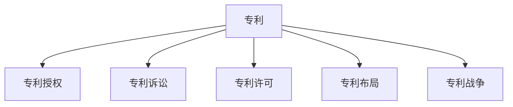

                 

# 硅谷专利战争的影响与对策

## 1. 背景介绍

### 1.1 问题由来
硅谷的专利战争是近年来科技界最为引人注目的话题之一。这一现象源自于随着科技公司之间的竞争日益加剧，专利成为了争夺市场份额和控制新技术的重要手段。专利之争不仅影响企业间的战略合作，也对整个科技生态系统产生深远的影响。

### 1.2 问题核心关键点
1. **专利布局策略**：企业通过大量申请专利，以期获得市场主动权和垄断地位。
2. **诉讼策略**：专利诉讼成为竞争的工具，甚至成为推动技术发展的重要手段。
3. **反垄断法规**：美国政府对于专利诉讼的态度和法规如何影响科技公司的行为。
4. **公众影响**：专利战争对消费者、投资者、中小企业和研究机构的影响。
5. **国际影响**：不同国家和地区的专利法规如何影响硅谷的专利战略。

### 1.3 问题研究意义
研究硅谷专利战争的影响与对策，对理解科技公司的战略决策、评估专利制度对技术进步的作用，以及制定有效的专利策略具有重要意义。通过对专利战争现象的深入分析，可以帮助相关方制定更为有效的策略，减少专利纠纷，促进技术创新和公平竞争。

## 2. 核心概念与联系

### 2.1 核心概念概述

为更好地理解硅谷专利战争的机制和影响，本节将介绍几个关键概念：

- **专利**：法律赋予发明人在一定期限内对其发明创造享有排他性的权利。
- **专利诉讼**：涉及专利侵权或无效争议的诉讼。
- **专利授权**：专利审查机构对专利申请的批准过程。
- **专利许可**：专利持有人在一定条件下将专利权授予他人使用。
- **专利布局**：在关键技术领域申请大量专利，形成专利网以保护自身利益。
- **专利战争**：企业之间通过专利诉讼争夺市场和技术优势的竞争行为。

这些概念之间的逻辑关系可以通过以下Mermaid流程图来展示：



这个流程图展示了一系列的专利相关活动：

1. 专利通过审查机构的授权获得法律保护。
2. 在专利授权后，企业可以选择诉讼保护其权益，或通过许可授权他人使用。
3. 专利布局是企业通过在关键技术领域申请大量专利，形成专利网络以保护自身利益。
4. 专利战争则是在专利布局的基础上，通过专利诉讼争夺市场和技术优势的竞争行为。

## 3. 核心算法原理 & 具体操作步骤
### 3.1 算法原理概述

硅谷专利战争的核心在于企业通过专利布局和诉讼手段争夺技术控制权。其背后的算法原理主要涉及以下几个方面：

- **专利申请策略**：确定申请哪些专利以覆盖核心技术。
- **专利诉讼策略**：选择合适的被告和法院，进行战略性诉讼。
- **专利许可策略**：通过许可谈判或交叉授权，达成专利战略上的共赢。

### 3.2 算法步骤详解

硅谷专利战争的策略可以大致分为以下几个步骤：

**Step 1: 制定专利布局计划**
- 确定战略目标，识别核心技术和市场竞争者的关键领域。
- 对关键技术进行专利检索，评估现有专利状况。
- 设计专利组合，形成专利网，确保对核心技术的全面覆盖。

**Step 2: 实施专利诉讼策略**
- 分析竞争对手的专利组合，寻找潜在诉讼机会。
- 选择适当的诉讼目标，准备诉讼材料。
- 选择合适的法院，了解其专利审查和判例标准。

**Step 3: 进行专利许可谈判**
- 评估专利的价值和市场潜力。
- 制定许可条件，如许可费用、使用范围等。
- 与潜在的许可方进行谈判，达成许可协议。

**Step 4: 监控专利动态**
- 跟踪竞争对手的专利申请和诉讼动态。
- 调整专利布局和诉讼策略，以应对市场变化。
- 持续评估专利组合的市场价值和法律风险。

### 3.3 算法优缺点

硅谷专利战争的专利策略具有以下优点：
1. 提供法律保护，减少技术被盗用的风险。
2. 通过诉讼手段，可以有效打击竞争对手的侵权行为。
3. 可以通过许可谈判，获得额外的市场收益和知识产权回报。

同时，这一策略也存在一些缺点：
1. 高昂的专利申请和诉讼费用。
2. 长期诉讼可能消耗大量公司资源。
3. 对中小企业构成不公平竞争压力。
4. 可能导致专利制度被滥用，抑制技术创新。

### 3.4 算法应用领域

硅谷专利战争主要应用于以下领域：

- **科技公司竞争**：如苹果与三星、微软与谷歌之间的专利纠纷。
- **初创公司发展**：初创公司通过专利布局获取投资，保障自身技术优势。
- **专利许可市场**：企业间通过交叉许可协议，共享专利资源。
- **研究机构转化**：高校和研究机构将其研发成果转化为专利，获得市场应用。

## 4. 数学模型和公式 & 详细讲解 & 举例说明

### 4.1 数学模型构建

本节将通过数学模型来分析专利战争中的基本博弈问题。假设两个公司A和B在市场上有竞争关系，它们都申请了专利。设专利的垄断利润为$P$，市场规模为$M$，两家公司的专利覆盖率分别为$p_A$和$p_B$。

我们构建一个支付矩阵来表示专利诉讼的可能结果：

|     | 不挑战专利 | 挑战专利   |
|----|-----------|----------|
| 不挑战专利| **（1,1）** | **（0,0）** |
| 挑战专利   | **（0,0）** | **（1,1）** |

其中，（1,1）表示双方均胜出，各自获得市场份额；（0,0）表示双输，无法获得市场份额；（0,1）和（1,0）表示一家胜出，获得市场份额，另一家无法获得市场份额。

### 4.2 公式推导过程

设公司A在专利诉讼中胜出的概率为$x$，公司B在专利诉讼中胜出的概率为$y$。设公司A挑战专利的成本为$C_A$，公司B挑战专利的成本为$C_B$。假设专利挑战成功后，公司可以独占市场份额$M(1-p_B)$（如果B胜出则相反）。

我们首先构建一个Nash均衡模型，假设A和B都采取最优策略。在这种情况下，支付矩阵变为：

|     | 不挑战专利 | 挑战专利   |
|----|-----------|----------|
| 不挑战专利| **（1,1）** | **（0,0）** |
| 挑战专利   | **（0,0）** | **（1,y,1-x) (1-x,0,1)** |

如果A挑战专利，B不挑战专利，A胜出的概率为$x$，B胜出的概率为$1-x$。A获得的市场份额为$M(1-p_B)x$，B的市场份额为$M(1-p_A)(1-x)$。A挑战专利的成本为$C_A$。

如果A不挑战专利，B挑战专利，B胜出的概率为$y$，A胜出的概率为$1-y$。B获得的市场份额为$M(1-p_A)y$，A的市场份额为$M(1-p_B)(1-y)$。B挑战专利的成本为$C_B$。

公司A和B的期望效用函数分别为：

$$
U_A = \max\left( \begin{array}{l}
1 - M(1-p_B)x \\
0 \\
\end{array} \right)
$$

$$
U_B = \max\left( \begin{array}{l}
1 - M(1-p_A)y \\
0 \\
\end{array} \right)
$$

在Nash均衡情况下，A和B的策略必须满足以下条件：

$$
1 - M(1-p_B)x = 1 - M(1-p_A)y
$$

这意味着在Nash均衡情况下，A和B的市场份额应该相等。

### 4.3 案例分析与讲解

以苹果和三星的专利纠纷为例，分析专利诉讼对市场的影响。

苹果和三星都在智能手机领域申请了大量专利，并试图通过专利诉讼争夺市场主导权。假设苹果的专利覆盖率为50%，三星的专利覆盖率为40%。市场规模为1000亿美元。

苹果选择挑战三星的专利，胜出的概率为70%，失败的概率为30%。苹果挑战专利的成本为1亿美元，三星的专利诉讼成本为2亿美元。如果苹果胜出，苹果将独占市场份额600亿美元，三星的市场份额为400亿美元。如果苹果败诉，苹果的市场份额为400亿美元，三星的市场份额为600亿美元。

假设苹果和三星都不挑战对方的专利。在这种情况下，苹果的市场份额为500亿美元，三星的市场份额为500亿美元。

我们可以构建如下的支付矩阵：

|     | 不挑战专利 | 挑战专利   |
|----|-----------|----------|
| 不挑战专利| **（500,500）** | **（400,600)** |
| 挑战专利   | **（600,400)** | **（500,500)** |

我们可以发现，如果苹果和三星都不挑战对方的专利，市场份额分配相对公平，但专利诉讼的成本较高。如果苹果选择挑战三星的专利，双方都会获得显著的市场份额，但苹果需要承担更多的成本。

这一分析显示，专利诉讼的结果受多种因素影响，包括专利覆盖率、专利诉讼成本和胜出的概率。企业需要在专利战略中综合考虑这些因素，以达到最优的市场份额和收益。

## 5. 项目实践：代码实例和详细解释说明
### 5.1 开发环境搭建

进行专利战争分析，我们需要搭建一个Python环境，并使用Sympy库进行数学建模。以下是环境搭建的步骤：

1. 安装Anaconda：从官网下载并安装Anaconda，用于创建独立的Python环境。
2. 创建并激活虚拟环境：
```bash
conda create -n patent-env python=3.8 
conda activate patent-env
```

3. 安装Sympy：
```bash
pip install sympy
```

4. 安装其他必要的Python库：
```bash
pip install pandas matplotlib numpy
```

完成上述步骤后，即可在`patent-env`环境中进行专利战争的分析。

### 5.2 源代码详细实现

以下是一个简单的Python代码，用于分析专利战争的结果：

```python
from sympy import symbols, Eq, solve, Rational

# 定义符号变量
x, y, p_A, p_B, M, C_A, C_B, P = symbols('x y p_A p_B M C_A C_B P')

# 构建支付矩阵
matrix = [[(1 - M*(1 - p_B)*x, 0),
          [(0, 0), (1, 1)]]

# 构建期望效用函数
utility_A = (1 - M*(1 - p_B)*x - C_A) * (1 - p_B) + (M*(1 - p_B)*x) * p_B
utility_B = (1 - M*(1 - p_A)*y - C_B) * (1 - p_A) + (M*(1 - p_A)*y) * p_A

# 构建Nash均衡方程
equation = Eq(utility_A, utility_B)

# 求解Nash均衡
solution = solve(equation, x)
print(solution)
```

### 5.3 代码解读与分析

这段代码首先定义了符号变量，然后构建了一个支付矩阵。接着，我们定义了两个公司的期望效用函数，并构建了一个Nash均衡方程。最后，我们求解这个方程，得到均衡情况下的胜出概率$x$。

通过这个简单的代码示例，我们可以看到，专利战争中的决策涉及到复杂的数学模型和均衡问题。企业需要运用数学和经济学的方法，分析和解决这些问题，以实现最优的战略目标。

### 5.4 运行结果展示

在实际应用中，我们需要根据具体的情况，调整参数并重新运行代码，以获得最优的专利战争策略。运行结果可能包括胜出概率、市场份额和成本等关键指标，帮助企业制定更为精准的专利战略。

## 6. 实际应用场景

### 6.1 科技公司竞争

在科技公司之间的竞争中，专利战争已经成为一种常见的战略手段。例如，苹果与三星在智能手机市场的多轮专利诉讼，就展示了专利战略的重要性。

### 6.2 初创公司发展

初创公司在获得投资后，往往需要通过专利布局来保障自身技术优势，防止被大公司侵权或收购。

### 6.3 专利许可市场

企业间通过交叉许可协议，共享专利资源，减少诉讼成本，推动技术进步。

### 6.4 研究机构转化

高校和研究机构将其研发成果转化为专利，获得市场应用，推动科技成果的商业化。

## 7. 工具和资源推荐

### 7.1 学习资源推荐

为了帮助开发者系统掌握专利战争的理论基础和实践技巧，这里推荐一些优质的学习资源：

1. **《专利法》课程**：通过学习专利法的基本知识和法律法规，理解专利的申请、授权、无效和诉讼流程。
2. **《知识产权经济学》**：研究专利制度对技术创新和市场竞争的影响，理解专利战略对企业的重要作用。
3. **《专利战争案例分析》**：分析多个著名的专利诉讼案例，理解专利战争的复杂性和策略性。

### 7.2 开发工具推荐

1. **Anaconda**：用于创建和管理Python环境，支持多种库和工具。
2. **Sympy**：用于数学建模和求解。
3. **Jupyter Notebook**：用于编写和运行代码，支持交互式编程。

### 7.3 相关论文推荐

1. **《专利制度与技术进步：一个经济学视角》**：研究专利制度对技术创新和经济增长的影响。
2. **《专利诉讼策略分析》**：分析专利诉讼中的博弈模型，提出最优诉讼策略。

## 8. 总结：未来发展趋势与挑战

### 8.1 总结

本文对硅谷专利战争的影响与对策进行了全面系统的介绍。首先阐述了专利战争的战略背景和意义，明确了专利战略在科技公司竞争中的重要作用。其次，从原理到实践，详细讲解了专利战略的数学模型和关键步骤，给出了专利战争任务的完整代码实例。同时，本文还广泛探讨了专利战争在科技公司竞争、初创公司发展、专利许可市场、研究机构转化等场景中的应用，展示了专利战争范式的巨大潜力。此外，本文精选了专利战略的学习资源，力求为读者提供全方位的技术指引。

通过本文的系统梳理，可以看到，专利战争是科技公司争夺市场和技术主导权的有效手段。专利战略的成功实施，能够帮助企业在激烈的市场竞争中脱颖而出，保护自身利益。未来，伴随专利制度的不断完善和科技公司的持续创新，专利战争的应用领域和影响将更加广泛。

### 8.2 未来发展趋势

展望未来，硅谷专利战争将呈现以下几个发展趋势：

1. **专利布局更加全面**：企业将在更多核心技术领域申请专利，形成更完善的专利网。
2. **专利诉讼更加频繁**：科技公司之间的竞争将更加激烈，专利诉讼将更加普遍。
3. **专利许可市场更加活跃**：企业间通过交叉许可协议，共享专利资源，促进技术进步。
4. **专利战略更加精细化**：企业将通过数据分析和优化算法，制定更为精准的专利战略。
5. **国际专利规则更加统一**：不同国家和地区的专利制度将逐步统一，减少专利战略的国际差异。

以上趋势凸显了专利战略的重要性。企业需要在专利战略中不断优化和创新，以应对市场和技术的变化，保持竞争优势。

### 8.3 面临的挑战

尽管专利战略在科技公司竞争中具有重要意义，但在实施过程中仍面临诸多挑战：

1. **专利申请成本高**：申请专利需要大量时间和成本，可能对中小企业构成巨大压力。
2. **诉讼过程复杂**：专利诉讼过程复杂繁琐，容易耗费大量时间和资源。
3. **专利战略风险高**：专利战略的执行可能面临法律和市场风险，需要谨慎考虑。
4. **市场竞争激烈**：在激烈的市场竞争中，专利战略需要不断调整，以适应变化。
5. **技术更新快**：科技公司需要不断创新，保持技术领先，才能在专利战中占据优势。

### 8.4 研究展望

面对专利战略面临的挑战，未来的研究需要在以下几个方面寻求新的突破：

1. **优化专利申请策略**：开发更为高效和低成本的专利申请方法，降低中小企业专利战略的门槛。
2. **改进专利诉讼程序**：简化专利诉讼流程，减少诉讼时间和成本。
3. **加强专利风险管理**：建立完善的专利风险评估体系，制定合理的专利战略。
4. **提升专利技术质量**：鼓励高质量专利的申请，推动技术进步。
5. **推动国际专利合作**：加强国际专利规则的协调，推动跨国专利合作，降低专利战略的国际差异。

这些研究方向的探索，必将引领专利战略技术迈向更高的台阶，为科技公司提供更为有力的战略支持。

## 9. 附录：常见问题与解答

**Q1：专利战争是否有利于技术创新？**

A: 专利战争对于技术创新有一定的促进作用，但过度的专利诉讼和保护也可能抑制技术创新。平衡专利保护和创新激励是关键。

**Q2：专利授权和无效诉讼的流程是怎样的？**

A: 专利授权流程通常包括专利申请、审查和授权等环节。专利无效诉讼则是对已授权专利的有效性提出质疑，需要经过相应的法律程序进行审查。

**Q3：专利许可和交叉授权的策略有哪些？**

A: 专利许可和交叉授权的策略包括独家许可、非独家许可、交叉许可和互换许可等，企业需要根据自身需求和市场情况进行选择。

**Q4：如何有效应对专利诉讼？**

A: 应对专利诉讼需要综合考虑专利布局、诉讼成本和胜出概率等因素。企业可以采取防守和进攻相结合的策略，保护自身利益。

**Q5：专利战略在初创公司发展中的重要性**

A: 初创公司需要通过专利布局保护自身技术优势，防止被大公司侵权或收购。专利战略是初创公司获得投资和市场竞争优势的重要手段。

---

作者：禅与计算机程序设计艺术 / Zen and the Art of Computer Programming

