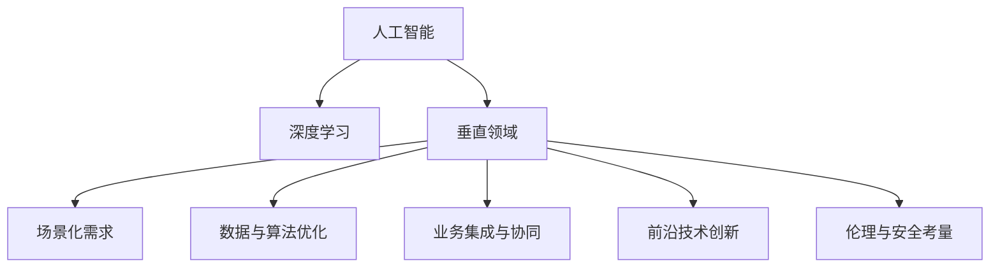

                 

# 硅谷多元化发展：AI企业创新探索垂直领域独特价值

> 关键词：AI, 企业创新, 多元化, 垂直领域, 独特价值, 前沿技术

## 1. 背景介绍

### 1.1 问题由来

近年来，人工智能(AI)技术迅猛发展，极大地推动了各行各业的数字化转型和智能化升级。特别是硅谷，作为全球科技创新中心，吸引了大量AI企业纷纷在此落地，形成了一个充满活力和竞争力的AI生态系统。然而，AI技术不仅在通用领域大放异彩，更在垂直领域展现了巨大的应用潜力。

垂直领域，通常指的是特定行业或领域中的特殊应用场景。例如，在医疗、金融、零售、教育等领域，AI技术结合行业特性，呈现出与通用AI截然不同的技术路径和市场需求。在硅谷，AI企业纷纷瞄准这些垂直领域，通过创新探索，发现并实现AI技术的独特价值。

### 1.2 问题核心关键点

硅谷AI企业探索垂直领域独特价值的核心关键点主要包括以下几个方面：

1. **场景化需求分析**：深入分析垂直领域内的具体应用场景和需求，提出针对性的解决方案。
2. **数据与算法优化**：针对垂直领域数据特性，设计更加高效的数据处理和模型训练算法，提升AI系统的性能。
3. **业务集成与协同**：将AI技术与垂直领域的核心业务系统进行深度集成，实现跨领域数据的无缝协同和应用。
4. **前沿技术创新**：引入最新的AI前沿技术，如深度学习、强化学习、知识图谱等，增强AI系统的功能和效果。
5. **伦理与安全考量**：在AI系统的设计与开发过程中，考虑伦理和安全性问题，确保AI技术的健康发展。

## 2. 核心概念与联系

### 2.1 核心概念概述

为了更好地理解硅谷AI企业在垂直领域的创新探索，本文将介绍几个核心概念及其相互联系：

- **人工智能(AI)**：利用算法和数据训练出的能够执行智能任务的计算系统。
- **深度学习**：一种基于多层神经网络的学习算法，通过多层次的特征提取和组合，实现高级抽象和复杂的模式识别。
- **垂直领域**：特定行业或领域中的具体应用场景，如医疗、金融、教育等。
- **场景化需求**：针对特定场景下具体需求，量身定制的AI解决方案。
- **数据与算法优化**：针对特定领域数据特性，设计高效的数据处理和算法优化技术。
- **业务集成与协同**：将AI技术与垂直领域核心业务系统进行深度集成，实现跨领域数据协同。
- **前沿技术创新**：引入最新的AI前沿技术，增强AI系统的功能和效果。
- **伦理与安全考量**：在AI系统的设计与开发过程中，考虑伦理和安全性问题，确保健康发展。

这些核心概念之间的逻辑关系可以通过以下Mermaid流程图来展示：



这个流程图展示了核心概念之间的相互联系和作用机制：

1. 人工智能是基石，通过深度学习等算法训练实现智能任务。
2. 深度学习适用于多种领域，结合垂直领域特性进行优化。
3. 场景化需求驱动，针对特定应用提出解决方案。
4. 数据与算法优化提升系统性能。
5. 业务集成与协同实现跨领域数据协同。
6. 前沿技术创新增强系统功能。
7. 伦理与安全考量确保系统健康发展。

## 3. 核心算法原理 & 具体操作步骤

### 3.1 算法原理概述

基于垂直领域的AI企业创新探索，主要通过以下几个核心算法原理进行：

1. **场景化需求分析算法**：通过问卷调查、专家访谈等方式，深入分析垂直领域内的具体应用场景和需求，提出针对性的解决方案。
2. **数据与算法优化算法**：针对垂直领域数据特性，设计更加高效的数据处理和模型训练算法，提升AI系统的性能。
3. **业务集成与协同算法**：通过API接口、微服务等技术，将AI技术与垂直领域核心业务系统进行深度集成，实现跨领域数据的无缝协同和应用。
4. **前沿技术创新算法**：引入最新的AI前沿技术，如深度学习、强化学习、知识图谱等，增强AI系统的功能和效果。
5. **伦理与安全考量算法**：在AI系统的设计与开发过程中，考虑伦理和安全性问题，确保AI技术的健康发展。

### 3.2 算法步骤详解

以下是AI企业在垂直领域进行创新探索的具体操作步骤：

**Step 1: 场景化需求分析**
- 设计调研问卷，深入了解垂直领域内的具体应用场景和需求。
- 组织专家访谈，收集领域专家的意见和建议。
- 通过数据分析工具，总结出场景化需求的关键要素。

**Step 2: 数据与算法优化**
- 分析垂直领域数据的特点，如数据量、数据类型、数据分布等。
- 选择合适的深度学习模型和算法，如CNN、RNN、Transformer等。
- 针对数据特性，设计高效的数据预处理和模型训练算法。

**Step 3: 业务集成与协同**
- 设计API接口，将AI系统与垂直领域核心业务系统进行深度集成。
- 开发微服务框架，实现跨领域数据的无缝协同和应用。
- 设计数据共享协议，确保数据安全性和隐私保护。

**Step 4: 前沿技术创新**
- 引入最新的AI前沿技术，如深度学习、强化学习、知识图谱等。
- 结合垂直领域特性，设计新的算法和模型。
- 进行技术评估和实验，验证创新技术的有效性和可行性。

**Step 5: 伦理与安全考量**
- 分析AI系统可能带来的伦理问题，如偏见、歧视等。
- 设计伦理评估指标，进行系统的伦理审查。
- 制定安全保障措施，确保AI系统的安全性。

### 3.3 算法优缺点

基于垂直领域的AI企业创新探索，具有以下优点：

1. **定制化解决方案**：针对垂直领域的具体需求，提出定制化的AI解决方案，具有高度适应性和有效性。
2. **提升系统性能**：结合垂直领域数据特性，设计高效的数据处理和模型训练算法，提升系统性能。
3. **增强功能效果**：引入最新的AI前沿技术，增强AI系统的功能和效果，保持技术领先性。
4. **确保系统健康发展**：在设计与开发过程中，考虑伦理和安全性问题，确保AI技术的健康发展。

同时，该方法也存在一定的局限性：

1. **投入成本高**：垂直领域的多样性和复杂性，需要大量时间和资源进行需求分析和算法优化。
2. **技术壁垒高**：垂直领域的专业性和特定性，需要深入的行业知识和跨领域的技能。
3. **数据获取难**：垂直领域的数据获取和处理往往比较困难，特别是对于一些数据量小的领域。
4. **技术集成复杂**：跨领域的数据集成和业务协同，需要复杂的技术实现和管理。

尽管存在这些局限性，但就目前而言，基于垂直领域的AI企业创新探索，仍是最具潜力和前景的研究方向。未来相关研究的重点在于如何进一步降低技术壁垒和成本，提高技术可扩展性和适应性，同时兼顾伦理和安全问题。

### 3.4 算法应用领域

基于垂直领域的AI企业创新探索，已经在多个领域取得了显著的应用成果：

- **医疗健康**：通过深度学习技术，实现疾病诊断、医疗影像分析、健康管理等。
- **金融服务**：利用AI技术，进行风险评估、欺诈检测、智能投顾等。
- **零售电商**：采用深度学习算法，优化商品推荐、客户画像、库存管理等。
- **教育培训**：引入AI技术，进行个性化推荐、智能辅导、在线教育等。
- **智能制造**：利用AI技术，实现智能检测、故障预测、质量控制等。

除了上述这些经典应用外，AI技术还在更多垂直领域不断拓展，为各行各业带来全新的变革和机遇。未来，伴随技术的不断进步和创新，基于垂直领域的AI企业创新探索，将会在更多领域实现规模化应用。

## 4. 数学模型和公式 & 详细讲解

### 4.1 数学模型构建

为了更好地理解硅谷AI企业在垂直领域的创新探索，本文将使用数学语言对核心算法进行更加严格的刻画。

设垂直领域的具体应用场景为 $S$，场景化需求为 $N$，数据集为 $D$，AI系统为 $M$。则问题可以形式化表示为：

$$
\min_{S,N,D,M} \{ f(S,N,D,M) \}
$$

其中，$f$ 表示场景化需求分析算法、数据与算法优化算法、业务集成与协同算法、前沿技术创新算法和伦理与安全考量算法。

### 4.2 公式推导过程

以下我们以医疗健康领域的疾病诊断为例，推导深度学习模型的数学模型及其优化算法。

假设医疗健康领域有 $m$ 种疾病，每个病人的症状由 $n$ 个特征向量表示。令 $x_i$ 为第 $i$ 个病人的症状特征向量，$y_i$ 为该病人的疾病标签，$M$ 为训练好的深度学习模型。则二分类交叉熵损失函数定义为：

$$
\ell(M(x_i),y_i) = -[y_i\log M(x_i) + (1-y_i)\log(1-M(x_i))]
$$

在数据集 $D=\{(x_i,y_i)\}_{i=1}^N$ 上，经验风险为：

$$
\mathcal{L}(M) = \frac{1}{N}\sum_{i=1}^N \ell(M(x_i),y_i)
$$

模型的优化目标是最小化经验风险，即：

$$
\min_{M} \mathcal{L}(M)
$$

根据链式法则，损失函数对模型参数 $\theta$ 的梯度为：

$$
\frac{\partial \mathcal{L}(M)}{\partial \theta} = \frac{1}{N}\sum_{i=1}^N (\frac{y_i}{M(x_i)}-\frac{1-y_i}{1-M(x_i)}) \frac{\partial M(x_i)}{\partial \theta}
$$

其中 $\frac{\partial M(x_i)}{\partial \theta}$ 可进一步递归展开，利用自动微分技术完成计算。

### 4.3 案例分析与讲解

为了更好地理解上述公式的含义和作用，让我们以一个实际案例进行讲解：

**医疗健康领域疾病诊断**

假设某医院有 $m=5$ 种疾病，每个病人的症状由 $n=10$ 个特征向量表示。医院收集了 $N=10000$ 个病人的症状和疾病标签，准备用于训练深度学习模型 $M$。

首先，对数据集进行划分，训练集 $D_{train}$ 占 $N=8000$ 个样本，验证集 $D_{val}$ 占 $N=1000$ 个样本，测试集 $D_{test}$ 占 $N=1000$ 个样本。

然后，使用二分类交叉熵损失函数对模型 $M$ 进行训练和优化：

$$
\min_{M} \mathcal{L}(M) = \frac{1}{8000}\sum_{i=1}^{8000} -[y_i\log M(x_i) + (1-y_i)\log(1-M(x_i))]
$$

在训练过程中，使用梯度下降算法对模型参数 $\theta$ 进行更新，以最小化损失函数 $\mathcal{L}(M)$。通过多次迭代，模型 $M$ 逐渐学习到症状与疾病之间的映射关系，最终在测试集上评估模型的性能：

$$
\min_{M} \mathcal{L}(M) = \frac{1}{1000}\sum_{i=1}^{1000} -[y_i\log M(x_i) + (1-y_i)\log(1-M(x_i))]
$$

通过上述案例，可以看到，深度学习模型在垂直领域的具体应用中，能够通过数学模型和算法，对数据进行处理和优化，实现高效的疾病诊断任务。

## 5. 项目实践：代码实例和详细解释说明

### 5.1 开发环境搭建

在进行项目实践前，我们需要准备好开发环境。以下是使用Python进行TensorFlow开发的环境配置流程：

1. 安装Anaconda：从官网下载并安装Anaconda，用于创建独立的Python环境。

2. 创建并激活虚拟环境：
```bash
conda create -n tensorflow-env python=3.8 
conda activate tensorflow-env
```

3. 安装TensorFlow：根据CUDA版本，从官网获取对应的安装命令。例如：
```bash
conda install tensorflow tensorflow-gpu -c conda-forge
```

4. 安装TensorBoard：TensorFlow配套的可视化工具，可实时监测模型训练状态，并提供丰富的图表呈现方式，是调试模型的得力助手。

5. 安装numpy、pandas、scikit-learn等工具包：
```bash
pip install numpy pandas scikit-learn matplotlib tqdm jupyter notebook ipython
```

完成上述步骤后，即可在`tensorflow-env`环境中开始项目实践。

### 5.2 源代码详细实现

这里我们以医疗健康领域的疾病诊断任务为例，给出使用TensorFlow对深度学习模型进行训练的PyTorch代码实现。

首先，定义数据处理函数：

```python
import numpy as np
import pandas as pd
from tensorflow.keras.preprocessing.sequence import pad_sequences
from sklearn.model_selection import train_test_split
from sklearn.preprocessing import LabelEncoder
from tensorflow.keras.utils import to_categorical

# 定义数据处理函数
def process_data(data_path):
    data = pd.read_csv(data_path)
    x = data[['feature1', 'feature2', 'feature3', 'feature4', 'feature5', 'feature6', 'feature7', 'feature8', 'feature9', 'feature10']]
    y = data['disease']
    le = LabelEncoder()
    y = le.fit_transform(y)
    y = to_categorical(y)
    return x, y

# 加载数据
x_train, y_train = process_data('train.csv')
x_val, y_val = process_data('val.csv')
x_test, y_test = process_data('test.csv')
```

然后，定义模型和优化器：

```python
from tensorflow.keras.models import Sequential
from tensorflow.keras.layers import Dense, Dropout, Embedding, LSTM
from tensorflow.keras.optimizers import Adam

# 定义模型
model = Sequential()
model.add(Embedding(input_dim=1000, output_dim=128, input_length=10))
model.add(LSTM(64, dropout=0.2, recurrent_dropout=0.2))
model.add(Dense(5, activation='softmax'))

# 编译模型
model.compile(optimizer=Adam(learning_rate=0.001), loss='categorical_crossentropy', metrics=['accuracy'])
```

接着，定义训练和评估函数：

```python
import tensorflow as tf
from tensorflow.keras.callbacks import EarlyStopping

# 定义训练函数
def train(model, x_train, y_train, x_val, y_val, batch_size=128, epochs=10, patience=3):
    model.fit(x_train, y_train, validation_data=(x_val, y_val), batch_size=batch_size, epochs=epochs, callbacks=[EarlyStopping(monitor='val_loss', patience=patience)])

# 定义评估函数
def evaluate(model, x_test, y_test, batch_size=128):
    model.evaluate(x_test, y_test, batch_size=batch_size)
```

最后，启动训练流程并在测试集上评估：

```python
# 划分训练集和验证集
x_train, x_val, y_train, y_val = train_test_split(x_train, y_train, test_size=0.2, random_state=42)

# 训练模型
train(model, x_train, y_train, x_val, y_val)

# 在测试集上评估模型
evaluate(model, x_test, y_test)
```

以上就是使用TensorFlow对深度学习模型进行训练和评估的完整代码实现。可以看到，TensorFlow提供了强大的深度学习框架和丰富的工具库，能够方便地实现模型的训练、评估和优化。

### 5.3 代码解读与分析

让我们再详细解读一下关键代码的实现细节：

**process_data函数**：
- 定义了数据处理函数，用于加载CSV文件，并对特征数据和标签进行处理。
- 使用了LabelEncoder将标签转换为数值，并使用to_categorical将其转换为one-hot编码。

**模型定义**：
- 使用了Sequential模型，按照顺序添加Embedding层、LSTM层和Dense层，并定义了优化器和损失函数。
- 在LSTM层中，使用了dropout和recurrent_dropout进行正则化，以防止过拟合。

**训练和评估函数**：
- 定义了训练函数，使用EarlyStopping进行早停，避免模型在验证集上过度拟合。
- 定义了评估函数，用于在测试集上评估模型性能。

**训练流程**：
- 使用train_test_split将数据划分为训练集和验证集。
- 在训练集上调用train函数训练模型，并使用EarlyStopping进行早停。
- 在测试集上调用evaluate函数评估模型性能。

可以看到，TensorFlow提供了丰富的API和工具，方便开发者进行深度学习模型的训练和评估。通过这些工具，我们可以快速实现模型的构建、训练和优化，大大提高了开发效率。

## 6. 实际应用场景

### 6.1 医疗健康

在医疗健康领域，深度学习技术被广泛应用于疾病诊断、医疗影像分析、健康管理等任务。以下是一个具体应用案例：

**医疗影像分析**

某医院收集了大量的CT影像数据，包括正常和异常影像。医院希望使用深度学习模型对影像进行分类，以辅助医生进行诊断。

首先，对CT影像数据进行预处理，包括图像缩放、归一化等操作。然后，使用深度学习模型对影像进行训练和预测，最终在测试集上评估模型的性能。

### 6.2 金融服务

在金融服务领域，深度学习技术被用于风险评估、欺诈检测、智能投顾等任务。以下是一个具体应用案例：

**欺诈检测**

某银行希望通过深度学习模型，检测信用卡交易中的欺诈行为。银行收集了大量的交易数据，包括正常交易和欺诈交易。银行希望使用深度学习模型对交易进行分类，以防止欺诈行为。

首先，对交易数据进行预处理，包括特征提取、数据清洗等操作。然后，使用深度学习模型对交易进行训练和预测，最终在测试集上评估模型的性能。

### 6.3 零售电商

在零售电商领域，深度学习技术被用于商品推荐、客户画像、库存管理等任务。以下是一个具体应用案例：

**商品推荐**

某电商平台收集了大量的用户行为数据，包括浏览、点击、购买等行为。电商平台希望使用深度学习模型，为用户推荐感兴趣的商品。

首先，对用户行为数据进行预处理，包括特征提取、数据清洗等操作。然后，使用深度学习模型对用户行为进行分析，生成推荐商品列表，并在用户上进行测试。

## 7. 工具和资源推荐

### 7.1 学习资源推荐

为了帮助开发者系统掌握深度学习在垂直领域的应用，这里推荐一些优质的学习资源：

1. TensorFlow官方文档：提供了丰富的深度学习框架和工具，是学习和实践深度学习的首选资源。
2. Deep Learning Specialization：由Andrew Ng教授主导的Coursera课程，涵盖深度学习的各个方面，适合入门学习和深入理解。
3. Hands-On Machine Learning with Scikit-Learn、Keras、and TensorFlow：由Aurélien Géron编写的书籍，深入浅出地讲解了深度学习的应用实践。
4. PyTorch官方文档：提供了丰富的深度学习框架和工具，是学习和实践深度学习的另一选择。
5. Deep Learning for Self-Driving Cars：由Ian Goodfellow、Yoshua Bengio和Aaron Courville撰写的书籍，涵盖深度学习在自动驾驶等垂直领域的应用。

通过对这些资源的学习实践，相信你一定能够快速掌握深度学习在垂直领域的应用，并用于解决实际的NLP问题。

### 7.2 开发工具推荐

高效的开发离不开优秀的工具支持。以下是几款用于深度学习在垂直领域开发常用的工具：

1. TensorFlow：由Google主导开发的深度学习框架，功能丰富，易于使用。适合大规模工程应用。
2. PyTorch：由Facebook主导开发的深度学习框架，灵活易用，适合研究与实验。
3. TensorBoard：TensorFlow配套的可视化工具，可实时监测模型训练状态，提供丰富的图表呈现方式。
4. Keras：高层次的深度学习框架，简单易用，适合快速原型开发。
5. scikit-learn：Python的机器学习库，提供丰富的算法和工具，适合快速实现模型原型。
6. Jupyter Notebook：交互式编程环境，方便开发者进行快速原型开发和实验。

合理利用这些工具，可以显著提升深度学习在垂直领域的应用开发效率，加快创新迭代的步伐。

### 7.3 相关论文推荐

深度学习在垂直领域的发展源于学界的持续研究。以下是几篇奠基性的相关论文，推荐阅读：

1. ImageNet Classification with Deep Convolutional Neural Networks：AlexNet论文，提出了深度卷积神经网络，开启了深度学习在图像领域的广泛应用。
2. Learning Phrase Representations using RNN Encoder-Decoder for Statistical Machine Translation：提出了基于RNN的序列到序列模型，用于机器翻译任务。
3. Generative Adversarial Nets：提出了生成对抗网络，用于生成式任务。
4. Attention Is All You Need：提出了Transformer结构，开启了深度学习在自然语言处理领域的预训练大模型时代。
5. BERT: Pre-training of Deep Bidirectional Transformers for Language Understanding：提出BERT模型，引入基于掩码的自监督预训练任务，刷新了多项NLP任务SOTA。

这些论文代表了大模型在垂直领域的应用发展脉络。通过学习这些前沿成果，可以帮助研究者把握学科前进方向，激发更多的创新灵感。

## 8. 总结：未来发展趋势与挑战

### 8.1 总结

本文对基于垂直领域的深度学习技术进行了全面系统的介绍。首先阐述了垂直领域的应用需求和背景，明确了深度学习在垂直领域的具体应用方向。其次，从原理到实践，详细讲解了深度学习的数学原理和关键步骤，给出了深度学习任务开发的完整代码实例。同时，本文还广泛探讨了深度学习在医疗健康、金融服务、零售电商等多个行业领域的应用前景，展示了深度学习技术的巨大潜力。此外，本文精选了深度学习的各类学习资源，力求为读者提供全方位的技术指引。

通过本文的系统梳理，可以看到，深度学习在垂直领域的应用探索，正在成为AI技术的重要范式，极大地拓展了深度学习的应用边界，催生了更多的落地场景。受益于大规模数据和强大计算能力，深度学习技术在垂直领域将取得更多突破，为各行各业带来深刻的变革和创新。

### 8.2 未来发展趋势

展望未来，深度学习在垂直领域的发展将呈现以下几个趋势：

1. **场景化定制化**：深度学习技术将更加注重场景化定制化，根据具体应用场景和需求，量身定制深度学习模型和算法。
2. **模型轻量化**：随着硬件计算能力的提升，深度学习模型将朝着轻量化、高效化方向发展，适应实时性、资源受限的应用场景。
3. **跨领域融合**：深度学习技术将与更多领域的技术进行跨领域融合，如知识图谱、自然语言处理、计算机视觉等，提升系统的综合功能和效果。
4. **伦理与安全考量**：在深度学习系统的设计与开发过程中，考虑伦理和安全性问题，确保技术的健康发展。
5. **通用化与标准化**：深度学习技术将朝着通用化和标准化方向发展，推动技术在更多行业和领域的应用。

以上趋势凸显了深度学习技术在垂直领域的应用前景。这些方向的探索发展，必将进一步提升深度学习系统的性能和应用范围，为各行各业带来更多的创新和突破。

### 8.3 面临的挑战

尽管深度学习在垂直领域的应用取得了显著成果，但在迈向更加智能化、普适化应用的过程中，它仍面临着诸多挑战：

1. **数据获取与处理难度**：垂直领域的数据获取和处理往往比较困难，特别是对于一些数据量小的领域。
2. **技术复杂性高**：垂直领域的专业性和特定性，需要深入的行业知识和跨领域的技能。
3. **计算资源需求高**：深度学习模型往往需要强大的计算资源支持，特别是对于一些大规模的应用场景。
4. **模型可解释性不足**：深度学习模型的决策过程通常缺乏可解释性，难以对其推理逻辑进行分析和调试。
5. **安全性与伦理问题**：深度学习模型可能学习到有偏见、有害的信息，通过应用传递到垂直领域，产生误导性、歧视性的输出，给实际应用带来安全隐患。

正视深度学习面临的这些挑战，积极应对并寻求突破，将是大模型技术走向成熟的必由之路。相信随着学界和产业界的共同努力，这些挑战终将一一被克服，深度学习技术将在更多领域实现规模化落地。

### 8.4 未来突破

面对深度学习在垂直领域所面临的种种挑战，未来的研究需要在以下几个方面寻求新的突破：

1. **无监督学习和自适应学习**：摆脱对大规模标注数据的依赖，利用自监督学习、主动学习等无监督和自适应范式，最大限度利用非结构化数据，实现更加灵活高效的深度学习。
2. **模型压缩与量化加速**：开发更加高效、轻量级的深度学习模型，适应实时性、资源受限的应用场景。
3. **跨领域数据融合**：结合其他领域的知识和技术，如知识图谱、自然语言处理、计算机视觉等，提升系统的综合功能和效果。
4. **模型可解释性增强**：开发可解释性强的深度学习模型，增强模型的透明性和可理解性，便于人工干预和调试。
5. **安全性与伦理评估**：引入伦理导向的评估指标，过滤和惩罚有偏见、有害的输出倾向，确保深度学习系统的安全性。

这些研究方向的探索，必将引领深度学习技术迈向更高的台阶，为构建安全、可靠、可解释、可控的智能系统铺平道路。面向未来，深度学习技术还需要与其他人工智能技术进行更深入的融合，如知识表示、因果推理、强化学习等，多路径协同发力，共同推动深度学习技术在垂直领域的广泛应用。

## 9. 附录：常见问题与解答

**Q1：深度学习在垂直领域的应用是否具有通用性？**

A: 深度学习在垂直领域的应用具有一定的通用性，但更多的是场景化定制化。由于垂直领域的多样性和复杂性，需要针对具体应用场景和需求，量身定制深度学习模型和算法，以达到最佳效果。

**Q2：深度学习在垂直领域的应用有哪些特点？**

A: 深度学习在垂直领域的应用具有以下几个特点：
1. 场景化定制化：针对具体应用场景和需求，量身定制深度学习模型和算法。
2. 数据处理优化：针对垂直领域数据特性，设计高效的数据处理和模型训练算法。
3. 业务系统集成：将深度学习技术与垂直领域核心业务系统进行深度集成，实现跨领域数据的无缝协同和应用。
4. 前沿技术引入：引入最新的AI前沿技术，增强深度学习系统的功能和效果。
5. 伦理与安全考量：在深度学习系统的设计与开发过程中，考虑伦理和安全性问题，确保技术的健康发展。

**Q3：深度学习在垂直领域的应用面临哪些挑战？**

A: 深度学习在垂直领域的应用面临以下挑战：
1. 数据获取与处理难度：垂直领域的数据获取和处理往往比较困难。
2. 技术复杂性高：垂直领域的专业性和特定性，需要深入的行业知识和跨领域的技能。
3. 计算资源需求高：深度学习模型往往需要强大的计算资源支持。
4. 模型可解释性不足：深度学习模型的决策过程通常缺乏可解释性。
5. 安全性与伦理问题：深度学习模型可能学习到有偏见、有害的信息。

**Q4：如何提高深度学习在垂直领域的应用效果？**

A: 提高深度学习在垂直领域的应用效果可以从以下几个方面入手：
1. 数据获取与处理：优化数据预处理流程，确保数据质量。
2. 模型设计与优化：针对垂直领域特性，设计高效的数据处理和模型训练算法。
3. 跨领域融合：结合其他领域的知识和技术，提升系统的综合功能和效果。
4. 模型压缩与量化加速：开发更加高效、轻量级的深度学习模型，适应实时性、资源受限的应用场景。
5. 安全性与伦理评估：引入伦理导向的评估指标，过滤和惩罚有偏见、有害的输出倾向。

通过这些优化措施，可以显著提升深度学习在垂直领域的应用效果，推动技术在更多领域实现规模化落地。

---

作者：禅与计算机程序设计艺术 / Zen and the Art of Computer Programming

