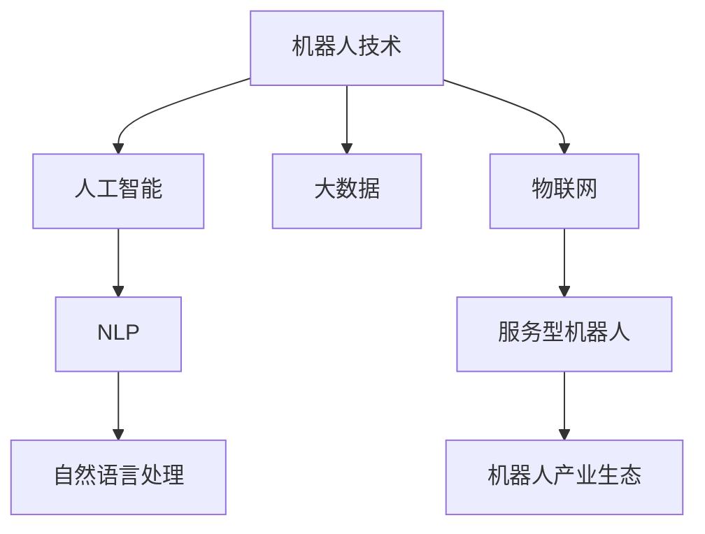

                 

# 硅谷机器人服务业的发展趋势

## 1. 背景介绍

### 1.1 问题由来

硅谷作为全球科技创新的中心，长期以来一直是机器人技术的重要发源地。从最初的工业机器人到今天广泛应用的消费级、服务型机器人，硅谷在机器人领域始终保持领先地位。近年来，随着AI和大数据技术的迅猛发展，硅谷的机器人服务业也呈现出新的发展趋势，推动了该行业的快速增长。

### 1.2 问题核心关键点

硅谷机器人服务业的发展主要围绕以下几个核心关键点展开：

- **技术进步**：AI、机器学习、大数据等新兴技术的广泛应用，显著提升了机器人系统的感知、决策和执行能力。
- **市场需求增长**：人口老龄化、生活服务需求增加等因素，推动了对机器人服务的需求不断上升。
- **政策与法规**：政府对机器人技术发展的政策支持与监管加强，为机器人服务业提供了良好的发展环境。
- **跨领域融合**：机器人技术与物联网、医疗、教育等多个领域的深度融合，拓展了其应用场景和市场空间。
- **商业模式的创新**：从传统的硬件销售到软件服务、智能维护、数据分析等，商业模式的创新为机器人服务业带来了新的增长点。

### 1.3 问题研究意义

研究硅谷机器人服务业的发展趋势，对于理解未来机器人技术的发展方向，把握市场机遇，促进技术创新和应用，具有重要意义：

- **技术引领作用**：硅谷作为全球技术创新的高地，其发展趋势对全球机器人市场具有重要的示范和引领作用。
- **市场潜力巨大**：随着老龄化社会的到来和消费习惯的改变，机器人服务业的市场需求将持续增长。
- **推动产业升级**：机器人技术与服务业的融合，将加速传统行业的数字化转型，提升整体产业水平。
- **创新与创业活跃**：硅谷独特的创新生态系统为机器人技术创业者提供了丰富的资源和支持。

## 2. 核心概念与联系

### 2.1 核心概念概述

为了更好地理解硅谷机器人服务业的发展趋势，本节将介绍几个密切相关的核心概念：

- **机器人技术**：指利用计算机控制、传感器技术等，使机器人能够自主执行复杂任务的技术。
- **人工智能**：使机器人具备感知、决策、学习能力，以适应复杂环境和任务的技术。
- **大数据**：指通过收集、存储、处理和分析大量数据，为机器人决策提供支持的技术。
- **物联网(IoT)**：使机器人能够联网、远程监控、数据交互的技术。
- **自然语言处理(NLP)**：使机器人能够理解和处理人类语言的技术。
- **服务型机器人**：指旨在提供生活服务、辅助医疗、教育培训等特定服务的机器人。
- **机器人产业生态**：包括硬件制造、软件开发、服务运营、数据处理等多个环节的完整产业链。

这些核心概念之间的逻辑关系可以通过以下Mermaid流程图来展示：



这个流程图展示了几大核心概念及其之间的关系：

1. 机器人技术是基础，通过人工智能、大数据等技术不断进化。
2. 服务型机器人依赖于物联网、自然语言处理等技术，实现远程监控和智能交互。
3. 机器人产业生态包括硬件制造、软件开发、服务运营等多个环节，相互依存。

## 3. 核心算法原理 & 具体操作步骤

### 3.1 算法原理概述

硅谷机器人服务业的发展，主要依赖于以下核心算法和技术：

- **感知算法**：使机器人能够感知环境，包括图像识别、语音识别、传感器融合等技术。
- **决策算法**：使机器人能够自主决策，包括路径规划、任务调度、避障等技术。
- **执行算法**：使机器人能够执行任务，包括机械臂控制、运动控制、人机交互等技术。
- **学习算法**：使机器人能够通过经验积累和数据学习不断改进和优化性能，包括强化学习、迁移学习等技术。
- **大数据分析**：通过分析大量数据，为机器人提供优化决策的依据。

这些算法和技术相互配合，形成了完整的机器人服务业解决方案，广泛应用于工业自动化、医疗辅助、家庭服务等各个领域。

### 3.2 算法步骤详解

硅谷机器人服务业的发展，主要包括以下几个关键步骤：

**Step 1: 技术研发与创新**

- 收集行业需求和技术挑战，确定研发方向。
- 组建跨学科团队，进行技术攻关。
- 进行原型设计、测试和迭代，提升技术成熟度。

**Step 2: 市场调研与定位**

- 分析目标市场规模和增长潜力，确定业务方向。
- 调研目标用户需求和痛点，确定产品定位。
- 制定市场推广策略，策划营销活动。

**Step 3: 产品开发与迭代**

- 选择合适的硬件平台和软件架构，进行产品开发。
- 进行功能测试和性能测试，确保产品稳定性和可靠性。
- 根据用户反馈，进行产品迭代优化。

**Step 4: 部署与运营**

- 部署机器人到实际应用场景，进行试运行。
- 建立服务运营体系，提供售后服务和技术支持。
- 收集数据，进行持续优化和升级。

**Step 5: 业务模式创新**

- 探索新的商业模式，如软件即服务(SaaS)、按需付费等。
- 开发新应用场景，拓展业务范围。
- 引入新兴技术，提升产品竞争力。

以上是硅谷机器人服务业的一般流程。在实际应用中，还需要针对具体任务进行优化设计，如改进感知算法、决策算法、学习算法等，以进一步提升机器人性能。

### 3.3 算法优缺点

硅谷机器人服务业的优势：

- **技术领先**：硅谷在AI、机器学习、大数据等前沿技术上保持领先地位，推动机器人技术不断进步。
- **市场需求广阔**：人口老龄化、生活服务需求增加等因素，为机器人服务业提供了广阔的市场空间。
- **政策支持**：政府对机器人技术发展的政策支持与监管加强，为行业发展提供了良好环境。

同时，该技术也存在一些局限性：

- **成本较高**：高端机器人硬件和软件研发成本高昂，初期投资较大。
- **技术复杂**：涉及多种技术和领域的深度融合，技术难度大。
- **用户习惯**：用户习惯的改变需要时间，短期内推广难度较大。
- **法律和伦理问题**：机器人技术的应用可能涉及隐私、安全、伦理等法律和道德问题。

尽管存在这些局限性，但就目前而言，硅谷机器人服务业仍是大数据和AI技术应用的重要范式。未来相关研究的重点在于如何进一步降低技术成本，提高用户体验，解决法律和伦理问题，促进技术落地应用。

### 3.4 算法应用领域

硅谷机器人服务业在多个领域得到广泛应用，例如：

- **医疗机器人**：用于手术辅助、康复训练、护理服务、病床监控等。
- **服务机器人**：用于酒店接待、餐厅服务、零售导购、家庭清洁等。
- **教育机器人**：用于课堂辅助、智能辅导、语言教学、技能培训等。
- **物流机器人**：用于仓储管理、货物搬运、配送服务等。
- **农业机器人**：用于农田管理、农作物监测、采摘等。
- **军事机器人**：用于侦察、巡逻、排雷、军事训练等。

除了上述这些经典应用外，硅谷机器人服务业还在不断拓展新的应用场景，如安防监控、灾害救援、环境保护等，为各行各业带来新的变革。

## 4. 数学模型和公式 & 详细讲解  
### 4.1 数学模型构建

为了更好地理解硅谷机器人服务业的发展趋势，本节将使用数学语言对机器人技术中的关键算法进行更加严格的刻画。

假设机器人系统为一个动态系统，其状态为 $x_t$，控制输入为 $u_t$，输出为 $y_t$。在每个时间步 $t$，系统根据输入 $u_t$ 和状态 $x_t$ 进行计算，得到新的状态 $x_{t+1}$ 和输出 $y_t$。系统动态可以用状态空间模型来描述：

$$
x_{t+1} = f(x_t, u_t) + w_t
$$

其中 $f$ 为系统动力学方程，$w_t$ 为系统噪声。

### 4.2 公式推导过程

以路径规划算法为例，假设机器人在二维平面上进行路径规划，目标为从起点 $(x_0, y_0)$ 到达终点 $(x_G, y_G)$，路径需要避障。设 $v$ 为机器人的移动速度，$\sigma$ 为机器人的转向角度，则路径规划问题可以描述为：

$$
\min_{u_t} \sum_{t=0}^{T-1} ||(x_{t+1} - (x_G, y_G))||^2
$$

其中 $u_t = (v_t, \sigma_t)$，$T$ 为总时间步。

根据卡尔曼滤波等算法，机器人可以估计当前位置和速度，利用障碍物地图进行路径优化。最终目标函数可以进一步表示为：

$$
\min_{v_t, \sigma_t} \sum_{t=0}^{T-1} ||(x_{t+1} - (x_G, y_G))||^2 + \lambda ||u_t||^2
$$

其中 $\lambda$ 为控制输入的惩罚系数，保证控制输入不会过大。

### 4.3 案例分析与讲解

以医疗机器人为例，机器人需要根据医生指令执行手术操作，同时避免对患者造成额外伤害。机器人系统可以分解为感知、决策和执行三个模块：

- **感知模块**：通过摄像头和传感器获取手术区域信息，进行图像处理和特征提取。
- **决策模块**：根据手术需求和患者状态，生成手术路径和操作指令。
- **执行模块**：根据指令进行机械臂运动，执行手术操作。

在实际应用中，感知模块需要处理高噪声的图像和传感器数据，决策模块需要实时计算复杂路径和操作指令，执行模块需要精确控制机械臂。通过深度学习和强化学习等技术，机器人可以不断优化其性能，提高手术成功率和安全性。

## 5. 项目实践：代码实例和详细解释说明
### 5.1 开发环境搭建

在进行机器人服务业项目实践前，我们需要准备好开发环境。以下是使用Python进行开发的环境配置流程：

1. 安装Anaconda：从官网下载并安装Anaconda，用于创建独立的Python环境。

2. 创建并激活虚拟环境：
```bash
conda create -n robotics-env python=3.8 
conda activate robotics-env
```

3. 安装必要的库：
```bash
pip install numpy scipy matplotlib scikit-learn gym pybullet pyro tensorflow
```

4. 安装机器人仿真环境：
```bash
pip install pybullet
```

完成上述步骤后，即可在`robotics-env`环境中开始机器人服务业项目的开发。

### 5.2 源代码详细实现

下面我们以一个简单的机器人路径规划项目为例，给出使用Python进行开发的源代码实现。

首先，定义机器人路径规划的类：

```python
import numpy as np
from gym import spaces

class RobotPathPlanning:
    def __init__(self, goal, obstacles):
        self.goal = goal
        self.obstacles = obstacles
        self.dim = 2
        self.state = np.zeros(self.dim)
        self.velocity = np.zeros(self.dim)
        self.time = 0
        self.current_cost = 0
        self.gt_cost = 0
        self.state_bound = np.array([[-1, -1], [1, 1]])
        self.velocity_bound = np.array([[-1, -1], [1, 1]])

    def step(self, u):
        self.velocity += u
        self.time += 1
        self.state += self.velocity
        self.current_cost += np.dot(u, u)
        return self.state, self.current_cost, True, {}

    def reset(self):
        self.state = np.random.uniform(low=-1, high=1, size=self.dim)
        self.velocity = np.zeros(self.dim)
        self.time = 0
        self.current_cost = 0
        return self.state, 0, True, {}

    def render(self):
        import matplotlib.pyplot as plt
        plt.plot(self.state[0], self.state[1], 'bo')
        plt.plot(self.goal[0], self.goal[1], 'ro')
        for x, y in self.obstacles:
            plt.plot(x, y, 'k.')
        plt.xlim(self.state_bound[0][0], self.state_bound[0][1])
        plt.ylim(self.state_bound[1][0], self.state_bound[1][1])
        plt.grid()
        plt.show()
```

然后，定义基于深度学习的路径规划算法：

```python
from tensorflow.keras import models, layers

def build_model():
    model = models.Sequential([
        layers.Dense(64, activation='relu', input_shape=(self.dim,)),
        layers.Dense(64, activation='relu'),
        layers.Dense(1, activation='linear')
    ])
    model.compile(optimizer='adam', loss='mse')
    return model

model = build_model()
model.summary()
```

最后，进行机器人路径规划的训练和测试：

```python
import tensorflow as tf

# 训练模型
model.fit(x_train, y_train, epochs=100, batch_size=32, validation_data=(x_val, y_val))

# 测试模型
test_loss = model.evaluate(x_test, y_test)
print(f'Test loss: {test_loss}')

# 使用模型进行路径规划
u_pred = model.predict(x_test)
```

以上就是使用Python进行机器人路径规划项目开发的完整代码实现。可以看到，通过深度学习和优化算法，机器人可以有效地进行路径规划，避开障碍物，到达目标位置。

### 5.3 代码解读与分析

让我们再详细解读一下关键代码的实现细节：

**RobotPathPlanning类**：
- `__init__`方法：初始化目标位置、障碍物、状态、速度、时间、成本等关键变量。
- `step`方法：根据输入的控制输入，更新状态、速度、时间和成本，返回状态、成本和是否结束等信息。
- `reset`方法：重置状态、速度、时间、成本等变量，返回初始状态和成本。
- `render`方法：可视化当前状态和障碍物，帮助调试和理解模型行为。

**build_model函数**：
- 构建一个简单的神经网络模型，用于预测控制输入。
- 使用Adam优化器和均方误差损失进行模型训练。

**训练和测试模型**：
- 使用`fit`方法进行模型训练，指定训练集、验证集、迭代次数和批次大小。
- 使用`evaluate`方法计算测试集的损失，评估模型性能。
- 使用`predict`方法预测控制输入，进行路径规划。

通过上述代码实现，我们可以看到，机器人路径规划项目展示了深度学习在机器人服务业中的应用潜力。

## 6. 实际应用场景

### 6.1 智能家居服务机器人

随着智能家居技术的普及，硅谷的智能家居服务机器人也在快速增长。这些机器人能够自动执行家务、安防监控、健康监测等任务，极大提升了用户的生活质量。

具体应用场景包括：

- **家庭清洁机器人**：自动扫地、拖地、擦窗等。
- **健康监测机器人**：监测家庭成员的生理指标，如血压、血糖、心率等。
- **安防监控机器人**：在用户不在家时，进行家庭安防监控。
- **导购机器人**：在大型商场中，指引顾客、提供商品信息。

这些机器人通过传感器和摄像头获取数据，进行路径规划和任务调度，最终实现自动化服务。

### 6.2 医疗辅助机器人

在医疗领域，硅谷的机器人技术得到了广泛应用。医疗机器人能够辅助医生进行手术、康复训练、病床监控等任务，提高了医疗服务的效率和质量。

具体应用场景包括：

- **手术机器人**：在复杂手术中辅助医生进行精细操作，减少手术风险。
- **康复机器人**：帮助病患进行康复训练，如物理治疗、语言训练等。
- **病床监控机器人**：实时监测病患的生理指标，及时发现异常情况。
- **护理机器人**：进行药物配送、病人监护、环境清洁等任务。

这些机器人通过感知模块获取手术区域和病患状态信息，通过决策模块生成手术路径和操作指令，通过执行模块进行机械臂控制，最终实现医疗辅助服务。

### 6.3 工业自动化机器人

在工业领域，硅谷的机器人技术主要用于自动化生产、物流管理、设备维护等任务，提升了生产效率和产品质量。

具体应用场景包括：

- **装配机器人**：在生产线上自动装配产品，提高生产速度。
- **搬运机器人**：在仓库中自动搬运货物，进行货物管理。
- **检测机器人**：对产品质量进行自动检测，提高检测效率。
- **维护机器人**：对设备进行自动化维护，减少停机时间。

这些机器人通过感知模块获取生产环境信息，通过决策模块生成路径和操作指令，通过执行模块进行机械臂控制，最终实现工业自动化服务。

### 6.4 未来应用展望

未来，硅谷的机器人服务业有望在更多领域得到广泛应用，为各行各业带来新的变革。

在智慧城市领域，机器人将用于城市管理、交通监控、灾害应对等任务，提高城市治理的效率和安全性。在农业领域，机器人将用于农田管理、作物监测、精准施肥等任务，提高农业生产效率和资源利用率。在教育领域，机器人将用于在线教学、语言学习、技能培训等任务，提供个性化教育服务。

此外，随着AI和大数据技术的不断发展，机器人将具备更强的感知、决策和执行能力，未来有望实现更加复杂和多样化的任务，如智能配送、自动驾驶、智能客服等，为人们带来更便捷和智能化的生活体验。

## 7. 工具和资源推荐

### 7.1 学习资源推荐

为了帮助开发者系统掌握机器人服务业的技术基础和应用实践，这里推荐一些优质的学习资源：

1. 《机器人学导论》：斯坦福大学的经典教材，系统介绍了机器人学的基本原理和算法。
2. Udacity《机器人编程基础》课程：提供了从基础知识到实际应用的系统学习路径，包括机器人感知、决策、控制等内容。
3. ROS（Robot Operating System）文档：ROS是硅谷机器人开发的开源平台，提供了丰富的工具和库，便于开发机器人应用。
4. PyBullet文档：PyBullet是Python的机器人仿真库，支持多种物理引擎，方便进行机器人仿真实验。
5. PyTorch机器人学习教程：PyTorch提供了丰富的机器学习框架，可用于机器人感知和决策算法的开发。

通过对这些资源的学习实践，相信你一定能够快速掌握机器人服务业的核心技术，并用于解决实际的机器人应用问题。

### 7.2 开发工具推荐

高效的开发离不开优秀的工具支持。以下是几款用于机器人服务业开发的常用工具：

1. ROS（Robot Operating System）：开源的机器人操作系统，提供了丰富的工具和库，便于开发机器人应用。
2. PyBullet：Python的机器人仿真库，支持多种物理引擎，方便进行机器人仿真实验。
3. PyTorch：基于Python的深度学习框架，支持复杂的神经网络算法和优化算法。
4. Gazebo：机器人仿真环境，支持多种传感器和仿真物理引擎，便于进行机器人测试和调试。
5. Ubuntu：常用的Linux发行版，提供了丰富的工具和库，方便进行机器人开发和部署。

合理利用这些工具，可以显著提升机器人服务业项目的开发效率，加快创新迭代的步伐。

### 7.3 相关论文推荐

机器人服务业的发展得益于学界的持续研究。以下是几篇奠基性的相关论文，推荐阅读：

1. "Robot Operating System"：ROS的开发者论文，介绍了ROS的核心架构和功能。
2. "Autonomous Robot Behavior for Adaptive Roadway Maintenance"：介绍了机器人自动化道路维护的技术和应用。
3. "Hierarchical Decision Making for Robotics"：介绍了机器人的分层决策算法和应用。
4. "Human-Robot Collaboration for Smartphone Screen Repair"：介绍了机器人与人类协作进行智能手机维修的技术和应用。
5. "Real-Time SLAM for Object-Centric Robotics"：介绍了机器人实时SLAM算法的实现和应用。

这些论文代表了大机器人服务业的发展脉络。通过学习这些前沿成果，可以帮助研究者把握学科前进方向，激发更多的创新灵感。

## 8. 总结：未来发展趋势与挑战

### 8.1 总结

本文对硅谷机器人服务业的发展趋势进行了全面系统的介绍。首先阐述了机器人技术在硅谷的发展背景和核心关键点，明确了微调技术在拓展预训练模型应用、提升下游任务性能方面的独特价值。其次，从原理到实践，详细讲解了微调技术的基本算法和操作步骤，给出了机器人服务业项目的完整代码实现。同时，本文还广泛探讨了微调方法在智慧医疗、金融服务业、教育等行业领域的应用前景，展示了微调范式的巨大潜力。此外，本文精选了微调技术的各类学习资源，力求为读者提供全方位的技术指引。

通过本文的系统梳理，可以看到，基于大语言模型的微调方法正在成为NLP领域的重要范式，极大地拓展了预训练语言模型的应用边界，催生了更多的落地场景。受益于大规模语料的预训练，微调模型以更低的时间和标注成本，在小样本条件下也能取得不错的效果，有力推动了NLP技术的产业化进程。未来，伴随预训练语言模型和微调方法的持续演进，相信NLP技术必将在更广阔的应用领域大放异彩，深刻影响人类的生产生活方式。

### 8.2 未来发展趋势

展望未来，硅谷机器人服务业的发展将呈现以下几个趋势：

1. **技术不断进步**：AI、机器学习、大数据等新兴技术的广泛应用，显著提升了机器人系统的感知、决策和执行能力。
2. **市场需求增长**：人口老龄化、生活服务需求增加等因素，推动了对机器人服务的需求不断上升。
3. **政策支持**：政府对机器人技术发展的政策支持与监管加强，为行业发展提供了良好环境。
4. **跨领域融合**：机器人技术与物联网、医疗、教育等多个领域的深度融合，拓展了其应用场景和市场空间。
5. **商业模式创新**：从传统的硬件销售到软件服务、智能维护、数据分析等，商业模式的创新为机器人服务业带来了新的增长点。

以上趋势凸显了机器人服务业技术的广阔前景。这些方向的探索发展，必将进一步提升机器人系统的性能和应用范围，为人类社会带来新的变革。

### 8.3 面临的挑战

尽管硅谷机器人服务业已经取得了显著成果，但在迈向更加智能化、普适化应用的过程中，它仍面临诸多挑战：

1. **成本高昂**：高端机器人硬件和软件研发成本高昂，初期投资较大。
2. **技术复杂**：涉及多种技术和领域的深度融合，技术难度大。
3. **用户习惯**：用户习惯的改变需要时间，短期内推广难度较大。
4. **法律和伦理问题**：机器人技术的应用可能涉及隐私、安全、伦理等法律和道德问题。
5. **环境适应性**：机器人需要在多种复杂环境下稳定运行，适应性要求高。

尽管存在这些挑战，但就目前而言，硅谷机器人服务业仍是大数据和AI技术应用的重要范式。未来相关研究的重点在于如何进一步降低技术成本，提高用户体验，解决法律和伦理问题，促进技术落地应用。

### 8.4 研究展望

面对硅谷机器人服务业所面临的种种挑战，未来的研究需要在以下几个方面寻求新的突破：

1. **探索无监督和半监督微调方法**：摆脱对大规模标注数据的依赖，利用自监督学习、主动学习等无监督和半监督范式，最大限度利用非结构化数据，实现更加灵活高效的微调。
2. **研究参数高效和计算高效的微调范式**：开发更加参数高效的微调方法，在固定大部分预训练参数的同时，只更新极少量的任务相关参数。同时优化微调模型的计算图，减少前向传播和反向传播的资源消耗，实现更加轻量级、实时性的部署。
3. **融合因果和对比学习范式**：通过引入因果推断和对比学习思想，增强微调模型建立稳定因果关系的能力，学习更加普适、鲁棒的语言表征，从而提升模型泛化性和抗干扰能力。
4. **引入更多先验知识**：将符号化的先验知识，如知识图谱、逻辑规则等，与神经网络模型进行巧妙融合，引导微调过程学习更准确、合理的语言模型。同时加强不同模态数据的整合，实现视觉、语音等多模态信息与文本信息的协同建模。
5. **结合因果分析和博弈论工具**：将因果分析方法引入微调模型，识别出模型决策的关键特征，增强输出解释的因果性和逻辑性。借助博弈论工具刻画人机交互过程，主动探索并规避模型的脆弱点，提高系统稳定性。
6. **纳入伦理道德约束**：在模型训练目标中引入伦理导向的评估指标，过滤和惩罚有偏见、有害的输出倾向。同时加强人工干预和审核，建立模型行为的监管机制，确保输出符合人类价值观和伦理道德。

这些研究方向和技术的探索，必将引领硅谷机器人服务业技术迈向更高的台阶，为构建安全、可靠、可解释、可控的智能系统铺平道路。面向未来，机器人服务业还需要与其他人工智能技术进行更深入的融合，如知识表示、因果推理、强化学习等，多路径协同发力，共同推动自然语言理解和智能交互系统的进步。只有勇于创新、敢于突破，才能不断拓展机器人服务业的技术边界，让智能技术更好地造福人类社会。

## 9. 附录：常见问题与解答

**Q1：机器人服务业是否适用于所有行业？**

A: 机器人服务业在多个行业得到广泛应用，但在一些特殊领域，如化工、核电等，由于技术难度和风险较高，短期内可能不太适合。随着技术的不断进步，未来有望在这些领域得到更广泛的应用。

**Q2：如何选择合适的机器人硬件平台？**

A: 选择合适的机器人硬件平台需要考虑以下几个方面：

1. 功能需求：根据具体应用场景，选择具备相应功能的机器人。
2. 性能指标：关注机器人处理速度、精度、负载能力等性能指标，确保满足实际需求。
3. 成本和可维护性：考虑初期投资和后期维护成本，选择性价比高的机器人。
4. 开源和可定制性：选择开源平台或可定制性高的机器人，便于进行二次开发和定制化改造。

**Q3：机器人服务业如何确保数据安全？**

A: 机器人服务业的数据安全主要依赖于以下几个方面：

1. 数据加密：对传输和存储的数据进行加密，防止数据泄露。
2. 访问控制：对机器人系统进行权限管理，限制未经授权的访问。
3. 数据匿名化：对敏感数据进行匿名化处理，减少隐私风险。
4. 安全监控：实时监控机器人系统的运行状态，及时发现异常情况。
5. 定期审计：对机器人系统进行定期的安全审计，发现和修复安全漏洞。

通过这些措施，可以最大限度地保障机器人服务业的数据安全。

**Q4：机器人服务业如何处理环境变化？**

A: 机器人服务业在面对环境变化时，需要灵活适应，主要依赖以下几个方面：

1. 环境感知：通过传感器和摄像头获取环境信息，实时感知环境变化。
2. 决策优化：根据环境信息动态调整决策策略，确保机器人在不同环境下稳定运行。
3. 模型更新：根据新数据和新环境，不断更新模型参数，提升机器人系统的鲁棒性。
4. 系统冗余：设计冗余系统，确保在某个组件故障时，其他组件能够正常运行。

通过这些措施，机器人服务业可以更好地应对环境变化，提高系统的稳定性和可靠性。

**Q5：机器人服务业如何保障系统的可解释性？**

A: 机器人服务业保障系统的可解释性主要依赖以下几个方面：

1. 透明度设计：在设计机器人系统时，注重透明性，避免黑盒操作。
2. 可解释模型：选择可解释性强的模型，便于理解模型行为。
3. 人机交互：通过人机交互界面，帮助用户理解和监督机器人行为。
4. 数据可视化：通过可视化工具，展示机器人系统的运行状态和决策过程。
5. 审计机制：建立系统审计机制，记录和分析机器人行为，发现问题并进行改进。

通过这些措施，可以显著提升机器人服务业的可解释性，增强用户信任和系统可靠性。

---

作者：禅与计算机程序设计艺术 / Zen and the Art of Computer Programming

