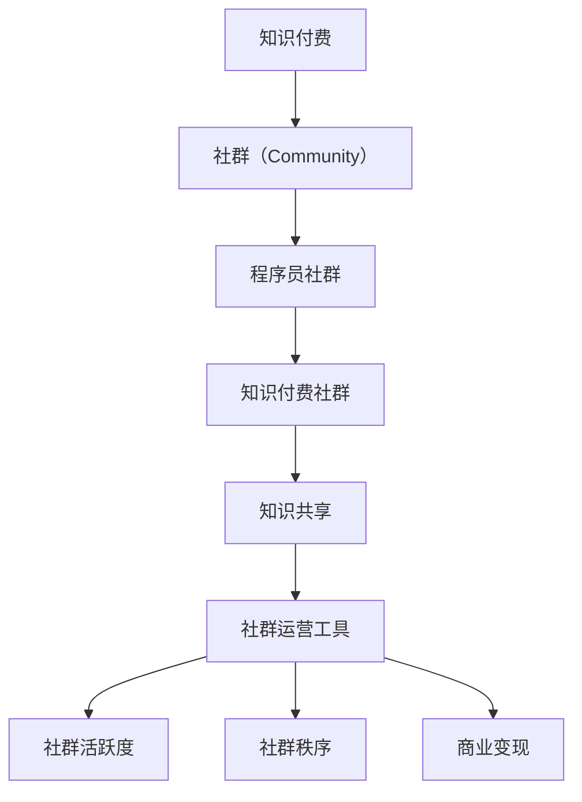

                 

# 社群运营工具：程序员打造知识付费社群必备

> 关键词：知识付费、社群运营、程序员社群、技术交流、在线学习平台

## 1. 背景介绍

### 1.1 问题由来

随着互联网的普及和技术的进步，知识付费逐渐成为了一种主流的学习方式。相比于传统的书籍、视频等学习资源，知识付费提供了一个更加灵活、互动和个性化的学习平台。而在众多知识付费平台中，社群（Community）成为了一个重要的组件。

程序员社群是一个典型的例子。编程语言、开发工具、编程技巧、行业动态等是程序员学习的重要内容，而社群可以提供实时交流、分享和互动的机会，使学习过程更加高效和有趣。因此，对于程序员而言，打造一个高效、活跃的程序员社群具有重要的意义。

### 1.2 问题核心关键点

在打造知识付费程序员社群的过程中，需要解决以下几个核心问题：

1. **如何吸引和保持成员活跃度**：如何让社群成员保持持续的参与和贡献？
2. **如何组织和维护社群秩序**：如何制定和执行社群规则，确保社区健康发展？
3. **如何提升社群的学习效率**：如何高效组织和传播知识，满足成员的学习需求？
4. **如何实现商业变现**：如何在保持社群健康发展的同时，实现商业盈利？

针对这些问题，本文将详细探讨社群运营工具的选择和应用，帮助程序员打造一个高效、活跃的知识付费程序员社群。

## 2. 核心概念与联系

### 2.1 核心概念概述

为了更好地理解知识付费程序员社群的运营工具，本节将介绍几个密切相关的核心概念：

1. **知识付费**：以内容为核心，通过付费方式获取知识的学习方式。知识付费平台如Coursera、Udemy、网易云课堂等，已经成为了学习的重要途径。
2. **社群（Community）**：由一群有共同兴趣或目标的人组成的在线或线下组织，通常通过社交媒体、论坛、博客等平台进行交流。
3. **程序员社群**：以程序员为核心的社群，通常涉及编程语言、开发工具、编程技巧、行业动态等话题。
4. **知识付费社群**：在知识付费平台上，围绕特定主题建立的社群，如技术交流、在线学习、问题解答等。
5. **知识共享**：成员间通过分享知识、解决问题、讨论技术等方式，促进知识传播和技能提升。
6. **社群运营工具**：用于帮助社群管理者维护社群秩序、提升社群活跃度、传播知识、实现商业变现等的工具和平台。

这些核心概念之间的逻辑关系可以通过以下Mermaid流程图来展示：



这个流程图展示了知识付费、社群、程序员社群、知识付费社群、知识共享和社群运营工具之间的关系：

1. 知识付费为社群提供了内容和交流的动机。
2. 程序员社群是知识付费社群的一种具体形式。
3. 知识共享是社群的核心活动，通过知识共享，成员之间相互学习，提升技能。
4. 社群运营工具则帮助社群管理者提升社群活跃度、维护社群秩序和实现商业变现。

这些概念共同构成了知识付费程序员社群的运营框架，使得知识共享和技能提升成为可能。

## 3. 核心算法原理 & 具体操作步骤

### 3.1 算法原理概述

知识付费程序员社群的运营，本质上是一个多目标优化问题。其主要目标包括：

1. **提升社群活跃度**：通过各种方式吸引成员参与讨论、分享和互动，保持社群的活力。
2. **维护社群秩序**：制定和执行社群规则，确保社群的健康发展。
3. **传播知识**：组织和传播高质量的知识内容，满足成员的学习需求。
4. **实现商业变现**：在保持社群健康发展的同时，实现商业盈利。

为了实现这些目标，社群运营者需要设计合理的算法和流程，以下是一些关键点：

1. **社群规则设计**：制定清晰的社群规则，并通过自动化工具执行。
2. **内容推荐算法**：设计个性化推荐算法，提升知识传播的效率。
3. **用户行为分析**：分析用户行为，优化社群运营策略。
4. **商业变现模式**：选择合适的商业变现模式，如付费会员、广告、知识市场等。

### 3.2 算法步骤详解

知识付费程序员社群的运营可以分为以下几个关键步骤：

**Step 1: 准备社群平台和工具**
- 选择合适的知识付费平台，如Coursera、Udemy、网易云课堂等。
- 选择合适的社群管理工具，如Discourse、Slack、微信、QQ群等。

**Step 2: 设计社群规则**
- 制定明确的社群规则，包括言论规范、行为准则等。
- 引入自动化工具，如社群管理插件，确保规则执行的一致性和公正性。

**Step 3: 设计内容传播策略**
- 选择合适的知识传播方式，如在线课程、专题讲座、技术博客、开源项目等。
- 设计个性化推荐算法，根据用户兴趣推荐相关内容。

**Step 4: 实现商业变现**
- 选择合适的商业变现模式，如付费会员、广告、知识市场等。
- 设计合理的收费策略，保证社群的健康发展和商业盈利。

**Step 5: 监测和优化**
- 定期监测社群活跃度、用户满意度等指标，进行数据分析。
- 根据分析结果，优化社群运营策略和算法。

### 3.3 算法优缺点

知识付费程序员社群的运营工具具有以下优点：

1. **提升学习效率**：通过个性化推荐和知识共享，提升学习效率和效果。
2. **激发学习动力**：通过社群互动和奖励机制，激发成员的学习动力。
3. **降低成本**：相比于传统的线下学习，知识付费社群的成本更低，规模更大。
4. **实现商业变现**：通过付费会员、广告、知识市场等商业变现模式，实现经济收益。

同时，这些工具也存在一些局限性：

1. **对技术要求高**：社群运营需要一定的技术支持，包括内容推荐算法、自动化工具等。
2. **用户管理难度大**：社群用户数量庞大，管理难度较大，需要耗费大量精力。
3. **市场竞争激烈**：知识付费市场竞争激烈，需要不断创新和优化运营策略。
4. **商业变现单一**：当前的商业变现模式较为单一，需要探索更多新的盈利渠道。

### 3.4 算法应用领域

知识付费程序员社群的运营工具在以下几个领域得到了广泛应用：

1. **在线教育**：知识付费平台如Coursera、Udemy、网易云课堂等，通过社群运营，提升用户参与度和满意度。
2. **开源社区**：如GitHub、Stack Overflow等，通过技术交流和知识共享，促进开发者之间的合作和贡献。
3. **企业培训**：企业通过知识付费社群，开展内部培训，提升员工技能和知识水平。
4. **技术博客和论坛**：如CSDN、博客园等，通过知识传播和互动，建立技术社群，吸引更多用户。
5. **线上线下活动**：通过线上线下活动，如黑客马拉松、技术沙龙等，促进社群成员之间的交流和合作。

## 4. 数学模型和公式 & 详细讲解  
### 4.1 数学模型构建

本节将使用数学语言对知识付费程序员社群的运营过程进行更加严格的刻画。

假设社群中有 $N$ 个成员，每个成员对内容的评分 $r_i$ 和活跃度 $a_i$，设内容 $c_j$ 的评分向量为 $R_j$，活跃度向量为 $A_j$。社群的总体评分和活跃度可以通过加权平均得到：

$$
R = \frac{\sum_{i=1}^N r_i A_i}{\sum_{i=1}^N A_i}, A = \frac{\sum_{i=1}^N r_i A_i}{\sum_{i=1}^N A_i}
$$

其中 $r_i$ 表示成员对内容的评分，$a_i$ 表示成员的活跃度。

社群的评分和活跃度可以通过成员对内容的评分和活跃度计算得到，设内容 $c_j$ 的评分向量为 $R_j$，活跃度向量为 $A_j$。社群的总体评分和活跃度可以通过加权平均得到：

$$
R = \frac{\sum_{i=1}^N r_i A_i}{\sum_{i=1}^N A_i}, A = \frac{\sum_{i=1}^N r_i A_i}{\sum_{i=1}^N A_i}
$$

其中 $r_i$ 表示成员对内容的评分，$a_i$ 表示成员的活跃度。

### 4.2 公式推导过程

以下我们以评分系统为例，推导个性化推荐算法的评分计算公式。

假设内容 $c_j$ 的评分向量为 $R_j$，活跃度向量为 $A_j$，成员 $i$ 对内容 $c_j$ 的评分和活跃度分别为 $r_{ij}$ 和 $a_{ij}$。成员 $i$ 对内容 $c_j$ 的综合评分可以表示为：

$$
s_{ij} = \frac{r_{ij} \cdot a_{ij}}{\sum_{k=1}^M r_{ik} \cdot a_{ik}}
$$

其中 $M$ 为内容数量。综合评分 $s_{ij}$ 可以衡量成员 $i$ 对内容 $c_j$ 的兴趣和活跃度。

为了计算每个成员的综合评分，需要遍历所有内容和成员，计算每个成员对所有内容的综合评分，最后选择综合评分最高的内容进行推荐。

### 4.3 案例分析与讲解

**案例分析**：假设一个程序员社群，有 100 名成员，每位成员每天对内容进行评分和活跃度记录。社群中有 50 篇技术文章，每篇技术文章每天的活跃度为 0.1，成员对每篇文章的评分如下：

| 文章编号 | 成员编号 | 评分 |
| --- | --- | --- |
| 1 | 1 | 5 |
| 1 | 2 | 3 |
| 2 | 1 | 4 |
| 2 | 2 | 5 |
| 3 | 1 | 2 |
| 3 | 2 | 1 |

假设成员 1 对内容 1 的评分和活跃度分别为 5 和 0.5，成员 2 对内容 1 的评分和活跃度分别为 3 和 0.3。内容 1 和内容 2 的综合评分和活跃度可以通过加权平均得到：

$$
R = \frac{5 \cdot 0.5 + 3 \cdot 0.3}{0.5 + 0.3} = 3.8, A = \frac{5 \cdot 0.5 + 3 \cdot 0.3}{0.5 + 0.3} = 0.4
$$

成员 1 对内容 1 的综合评分为：

$$
s_{11} = \frac{5 \cdot 0.5}{0.5 + 0.3} = 1.25
$$

成员 2 对内容 1 的综合评分为：

$$
s_{21} = \frac{3 \cdot 0.3}{0.5 + 0.3} = 0.6
$$

根据综合评分，推荐成员 1 对内容 1 的评分高于成员 2，因此推荐内容 1 给成员 1。

通过上述案例可以看出，个性化推荐算法可以根据成员对内容的评分和活跃度，计算出每个成员的综合评分，从而推荐最符合其兴趣的内容。

## 5. 项目实践：代码实例和详细解释说明
### 5.1 开发环境搭建

在进行社群运营工具的开发实践前，我们需要准备好开发环境。以下是使用Python进行Flask开发的环境配置流程：

1. 安装Anaconda：从官网下载并安装Anaconda，用于创建独立的Python环境。

2. 创建并激活虚拟环境：
```bash
conda create -n flask-env python=3.8 
conda activate flask-env
```

3. 安装Flask：
```bash
pip install flask
```

4. 安装必要的第三方库：
```bash
pip install flask-restful flask-cors
```

5. 安装数据库：
```bash
pip install sqlalchemy mysqlclient
```

6. 安装邮件服务：
```bash
pip install Flask-Mail
```

完成上述步骤后，即可在`flask-env`环境中开始开发实践。

### 5.2 源代码详细实现

下面我们以知识付费社群的评分系统为例，给出使用Flask进行开发的PyTorch代码实现。

首先，定义评分系统的数据库模型：

```python
from flask_sqlalchemy import SQLAlchemy
from flask import Flask
import os

app = Flask(__name__)
app.config['SQLALCHEMY_DATABASE_URI'] = os.environ.get('DATABASE_URL')
app.config['SQLALCHEMY_TRACK_MODIFICATIONS'] = False
db = SQLAlchemy(app)

class User(db.Model):
    id = db.Column(db.Integer, primary_key=True)
    name = db.Column(db.String(255), unique=True)
    email = db.Column(db.String(255), unique=True)
    score = db.Column(db.Float)

class Content(db.Model):
    id = db.Column(db.Integer, primary_key=True)
    title = db.Column(db.String(255))
    score = db.Column(db.Float)
    user_id = db.Column(db.Integer, db.ForeignKey('user.id'))
```

然后，定义评分系统的评分逻辑：

```python
from datetime import datetime

class RatingService:
    def __init__(self, session):
        self.session = session

    def get_content_score(self, content_id):
        content = Content.query.filter_by(id=content_id).first()
        if not content:
            return None
        return content.score

    def add_rating(self, user_id, content_id, score):
        user = User.query.filter_by(id=user_id).first()
        if not user:
            return None
        content = Content.query.filter_by(id=content_id).first()
        if not content:
            return None
        content.score += score
        user.score += score
        self.session.commit()
```

最后，定义评分系统的API接口：

```python
from flask_restful import Resource, Api

api = Api(app)

class ContentRating(Resource):
    def get(self, content_id):
        score = self.rating_service.get_content_score(content_id)
        if score is None:
            return {'message': 'Content not found'}, 404
        return {'score': score}

    def post(self, content_id):
        user_id = request.json.get('user_id')
        score = request.json.get('score')
        self.rating_service.add_rating(user_id, content_id, score)
        return {'message': 'Rating added'}, 201
```

### 5.3 代码解读与分析

让我们再详细解读一下关键代码的实现细节：

**User类**：
- `id`：用户ID。
- `name`：用户姓名。
- `email`：用户邮箱。
- `score`：用户评分总和。

**Content类**：
- `id`：内容ID。
- `title`：内容标题。
- `score`：内容评分总和。
- `user_id`：用户ID。

**RatingService类**：
- `get_content_score`方法：根据内容ID获取内容的评分。
- `add_rating`方法：根据用户ID和内容ID更新用户和内容的评分。

**ContentRating类**：
- `get`方法：根据内容ID获取内容的评分。
- `post`方法：根据用户ID和内容ID更新评分。

以上代码展示了使用Flask进行知识付费社群评分系统的开发流程。通过Flask，可以方便地实现API接口，调用评分服务，实现个性化推荐等功能。

## 6. 实际应用场景

### 6.1 智能推荐系统

智能推荐系统是知识付费社群运营的核心组件。通过个性化推荐算法，可以提升用户的学习效率和满意度，提高社群的活跃度。

智能推荐系统通常包括：

1. **内容推荐**：根据用户的历史评分和活跃度，推荐最符合用户兴趣的内容。
2. **用户推荐**：根据用户的兴趣和行为，推荐可能感兴趣的用户，促进社群互动。
3. **活动推荐**：根据用户的历史参与情况，推荐可能感兴趣的活动，提升社群参与度。

智能推荐系统可以通过Flask、TensorFlow、PyTorch等工具实现，并结合机器学习算法（如协同过滤、内容推荐算法、深度学习等）进行优化。

### 6.2 社群互动平台

社群互动平台是知识付费社群的重要组成部分。通过互动平台，成员可以实时交流、分享和讨论技术问题，提升社群的凝聚力和活跃度。

社群互动平台通常包括：

1. **讨论区**：成员可以发布问题、分享经验、讨论技术。
2. **问答区**：成员可以提问、回答问题、评估问题。
3. **技术交流区**：成员可以分享技术文章、开源项目、代码示例等。

社群互动平台可以通过Flask、React、Vue等工具实现，并结合社区管理和版本控制工具（如Discourse、Slack、GitHub等）进行优化。

### 6.3 在线学习平台

在线学习平台是知识付费社群的重要应用场景。通过在线学习平台，成员可以随时随地进行学习，提升技能和知识水平。

在线学习平台通常包括：

1. **课程**：提供各种编程语言、开发工具、编程技巧等的在线课程。
2. **教程**：提供各种技术文章、代码示例、开发工具的使用教程。
3. **社区**：提供技术交流、问题解答、学习经验分享等社区功能。

在线学习平台可以通过Flask、Django、TensorFlow等工具实现，并结合知识付费平台（如Coursera、Udemy、网易云课堂等）进行优化。

## 7. 工具和资源推荐
### 7.1 学习资源推荐

为了帮助开发者系统掌握知识付费程序员社群的运营理论基础和实践技巧，这里推荐一些优质的学习资源：

1. **《知识付费：从理论到实践》**：详细介绍知识付费的原理、模型和应用，提供了丰富的案例和实践指南。
2. **Coursera、Udemy、网易云课堂**：提供丰富的在线课程和资源，帮助开发者学习编程语言、开发工具、编程技巧等。
3. **Flask、TensorFlow、PyTorch**：提供强大的开发工具和库，帮助开发者实现个性化推荐、社群互动等。
4. **Flask-Mail、Flask-Cors**：提供邮件服务和跨域访问服务，帮助开发者实现社群互动、在线学习等功能。
5. **GitHub、Stack Overflow**：提供丰富的开源项目和技术讨论，帮助开发者学习和交流。

通过对这些资源的学习实践，相信你一定能够快速掌握知识付费程序员社群的运营技巧，并用于解决实际的NLP问题。

### 7.2 开发工具推荐

高效的开发离不开优秀的工具支持。以下是几款用于知识付费程序员社群开发常用的工具：

1. **Flask**：轻量级Web框架，易于上手，适合快速迭代研究。
2. **TensorFlow**：强大的深度学习框架，支持各种机器学习算法，适合复杂的推荐系统。
3. **PyTorch**：灵活的深度学习框架，适合快速原型开发和实验。
4. **Django**：全栈Web框架，适合大型项目开发。
5. **React、Vue**：现代前端框架，支持实时数据渲染和交互。
6. **Discourse、Slack、GitHub**：优秀的社区管理和版本控制工具，支持高效的社群互动和知识传播。

合理利用这些工具，可以显著提升知识付费程序员社群的开发效率，加快创新迭代的步伐。

### 7.3 相关论文推荐

知识付费程序员社群的运营技术的发展源于学界的持续研究。以下是几篇奠基性的相关论文，推荐阅读：

1. **《社区知识共享的社交网络分析》**：研究社交网络中的知识共享行为，提出知识传播模型。
2. **《基于协同过滤的推荐系统》**：介绍协同过滤算法，提升个性化推荐的效果。
3. **《深度学习在推荐系统中的应用》**：介绍深度学习算法在推荐系统中的应用，提升推荐精度。
4. **《基于内容推荐算法的研究》**：详细介绍内容推荐算法，提升知识传播的效率。
5. **《社区运营的理论与实践》**：探讨社区运营的理论和方法，提供实用的运营技巧。

这些论文代表了大语言模型微调技术的发展脉络。通过学习这些前沿成果，可以帮助研究者把握学科前进方向，激发更多的创新灵感。

## 8. 总结：未来发展趋势与挑战

### 8.1 总结

本文对知识付费程序员社群的运营工具进行了全面系统的介绍。首先阐述了知识付费和程序员社群的研究背景和意义，明确了社群运营在提升成员学习效率和满意度方面的独特价值。其次，从原理到实践，详细讲解了社群运营的数学模型和关键算法，给出了社群运营工具的代码实例。同时，本文还广泛探讨了智能推荐系统、社群互动平台、在线学习平台等多个实际应用场景，展示了社群运营范式的广泛应用。此外，本文精选了社群运营的各类学习资源，力求为读者提供全方位的技术指引。

通过本文的系统梳理，可以看到，知识付费程序员社群的运营工具正在成为知识付费领域的重要范式，极大地提升了成员的学习效率和满意度。未来的研究需要在以下几个方向继续深入：

### 8.2 未来发展趋势

展望未来，知识付费程序员社群的运营工具将呈现以下几个发展趋势：

1. **智能化程度提升**：通过机器学习和深度学习技术，实现更精准、个性化的推荐和互动。
2. **多模态融合**：结合文字、图片、视频等多种模态信息，提升知识传播的效率和效果。
3. **社区自动化管理**：通过自动化工具，实现社群的自动化管理和运营，减少人工干预。
4. **社交网络分析**：通过社交网络分析技术，提升社群互动和知识共享的效果。
5. **知识图谱应用**：结合知识图谱技术，提升内容的组织和传播效率。
6. **商业变现多样化**：除了付费会员和广告，还可以通过知识市场、内容付费等模式实现多样化的商业变现。

以上趋势凸显了知识付费程序员社群运营工具的广阔前景。这些方向的探索发展，必将进一步提升社群运营的智能化和自动化水平，促进知识的广泛传播和应用。

### 8.3 面临的挑战

尽管知识付费程序员社群的运营工具已经取得了瞩目成就，但在迈向更加智能化、自动化应用的过程中，它仍面临着诸多挑战：

1. **数据隐私和安全**：社群运营涉及大量用户数据，如何保护用户隐私和安全，是一个重要的挑战。
2. **内容质量控制**：社群运营需要确保内容的质量和准确性，避免虚假信息和误导性内容。
3. **用户多样性**：社群成员来自不同的背景和技能水平，如何满足不同用户的需求，是一个复杂的挑战。
4. **市场竞争**：知识付费市场竞争激烈，如何保持社群的独特性和吸引力，是一个持续的挑战。
5. **商业变现可持续性**：社群运营需要在保持健康发展的同时，实现商业盈利，这是一个长期而复杂的挑战。

### 8.4 研究展望

面对知识付费程序员社群运营工具所面临的种种挑战，未来的研究需要在以下几个方面寻求新的突破：

1. **知识图谱融合**：将知识图谱与社群运营相结合，提升内容的组织和传播效率。
2. **个性化推荐优化**：开发更加精准、个性化的推荐算法，提升用户的学习效率和满意度。
3. **社区自动化管理**：引入自动化工具，实现社群的自动化管理和运营，减少人工干预。
4. **社交网络分析**：结合社交网络分析技术，提升社群互动和知识共享的效果。
5. **多模态融合**：结合文字、图片、视频等多种模态信息，提升知识传播的效率和效果。
6. **隐私和安全保障**：加强隐私保护和安全保障，确保用户数据的安全和隐私。

这些研究方向将引领知识付费程序员社群运营工具迈向更高的台阶，为构建安全、可靠、智能的社群运营平台铺平道路。面向未来，知识付费程序员社群运营工具还需要与其他人工智能技术进行更深入的融合，如自然语言处理、机器学习、深度学习等，多路径协同发力，共同推动知识付费社群的发展和进步。只有勇于创新、敢于突破，才能不断拓展社群运营的边界，让知识付费技术更好地造福人类社会。

## 9. 附录：常见问题与解答

**Q1：知识付费社群运营需要哪些关键技术和工具？**

A: 知识付费社群运营需要以下关键技术和工具：
1. 在线课程平台，如Coursera、Udemy、网易云课堂等。
2. 社区管理工具，如Discourse、Slack、微信、QQ群等。
3. 个性化推荐算法，如协同过滤、内容推荐算法等。
4. 数据库管理系统，如SQLAlchemy等。
5. Web框架，如Flask、Django等。
6. 机器学习工具，如TensorFlow、PyTorch等。

这些技术和工具是知识付费社群运营的基础，能够提供强大的功能和支持，提升社群的运营效率和效果。

**Q2：如何设计个性化推荐算法？**

A: 个性化推荐算法的设计需要考虑以下几个关键因素：
1. 用户历史行为数据，如评分、浏览、互动等。
2. 内容特征，如标题、摘要、标签等。
3. 用户兴趣和偏好，如兴趣爱好、学习历史等。
4. 推荐策略，如协同过滤、内容推荐算法、深度学习等。

通过结合以上因素，可以使用协同过滤、内容推荐算法、深度学习等方法设计个性化推荐算法，提升推荐效果和用户满意度。

**Q3：社群运营中如何保持用户活跃度？**

A: 社群运营中保持用户活跃度需要考虑以下几个关键因素：
1. 提供高质量的内容，满足用户的学习需求。
2. 定期组织活动，如技术沙龙、黑客马拉松等，促进社群互动。
3. 引入激励机制，如奖励机制、排行榜等，激励用户参与。
4. 定期监测用户行为，优化社群运营策略。

通过结合以上因素，可以制定合理的社群运营策略，提升用户活跃度和满意度。

**Q4：社群运营中如何实现商业变现？**

A: 社群运营中实现商业变现需要考虑以下几个关键因素：
1. 选择合适的商业变现模式，如付费会员、广告、知识市场等。
2. 制定合理的收费策略，如按次收费、按月收费、按年收费等。
3. 提供优质的内容和服务，提升用户满意度，增加用户粘性。
4. 定期监测商业变现效果，优化运营策略。

通过结合以上因素，可以制定合理的商业变现策略，实现社群的健康发展和商业盈利。

---

作者：禅与计算机程序设计艺术 / Zen and the Art of Computer Programming

