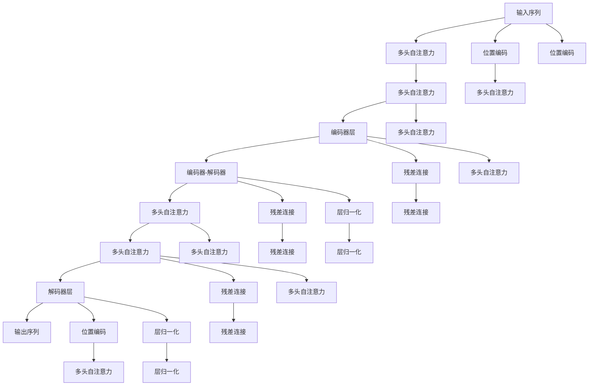

                 

# 神经机器翻译：注意力机制与Transformer

> 关键词：神经机器翻译,Transformer,注意力机制,自注意力,多头注意力,编码器-解码器架构,Transformer模型,计算效率,序列建模,自然语言处理(NLP)

## 1. 背景介绍

### 1.1 问题由来
随着深度学习技术的快速发展，神经机器翻译( Neural Machine Translation, NMT) 领域取得了显著的进展。早期的NMT方法，如基于循环神经网络(RNN)或卷积神经网络(CNN)的模型，在处理序列数据时面临梯度消失和长程依赖问题。近年来，Transformer模型被提出，并迅速成为NMT的主流范式。

Transformer模型采用自注意力机制，直接利用输入和输出序列的互相关信息，大大简化了序列建模过程，提升了翻译效果。其原理简单，参数量少，训练速度快，表现出卓越的性能，成为NMT技术的一个重要里程碑。

### 1.2 问题核心关键点
Transformer模型的核心在于自注意力机制，通过计算输入序列中不同位置间的互相关性，来提取序列的信息。其具体实现包括多头注意力机制和编码器-解码器架构，使得模型在处理长序列和复杂句子时表现优异。

Transformer模型在自然语言处理(NLP)领域的应用非常广泛，从文本翻译到文本摘要，再到文本生成等任务，都取得了优秀的成果。它的成功，很大程度上归因于自注意力机制的巧妙设计。

### 1.3 问题研究意义
研究Transformer模型的注意力机制，对于提升NMT的效果，促进Transformer在大规模序列建模任务中的应用，具有重要意义：

1. 提高翻译质量。自注意力机制使得Transformer模型能够更好地捕捉输入序列中的语义信息，提升翻译的准确性和流畅性。
2. 加速模型训练。Transformer模型参数量较少，训练速度快，适合大规模NMT任务的并行处理。
3. 简化模型架构。自注意力机制替代了传统RNN等复杂的网络结构，使得Transformer模型架构更加简洁高效。
4. 增强序列建模能力。Transformer模型能够处理任意长度的序列，不依赖于固定长度的输入。
5. 推动NLP技术进步。Transformer模型不仅适用于机器翻译，还在语言建模、文本分类、问答等任务中广泛应用，推动了NLP技术的整体发展。

## 2. 核心概念与联系

### 2.1 核心概念概述

为更好地理解Transformer模型的注意力机制，本节将介绍几个关键概念：

- 自注意力机制(Self-Attention)：一种用于序列建模的机制，通过计算输入序列中不同位置间的互相关性，提取序列信息。
- 多头注意力(Multi-Head Attention)：将输入序列映射到多个注意力机制上，每个注意力机制独立计算输入序列的特征向量，最终通过拼接得到更丰富的表示。
- 编码器-解码器架构(Encoder-Decoder Architecture)：一种用于序列对序列建模的架构，通过将输入序列分别编码为中间向量，解码为输出序列，实现高效的序列转换。
- 自注意力权重矩阵(QKV矩阵)：一种用于表示输入序列中不同位置之间相关性的矩阵，通过计算Q和K的相似度，得到权重向量。
- 多头注意力机制(Multi-Head Attention)：一种用于同时捕捉不同层次信息的注意力机制，通过在多个注意力机制上计算，提升模型的表达能力。

这些核心概念之间有着紧密的联系，共同构成了Transformer模型的注意力机制，使得模型在处理序列数据时具备更强的表达能力和泛化能力。

### 2.2 核心概念原理和架构的 Mermaid 流程图

以下是一个Mermaid流程图，展示了Transformer模型的注意力机制和整体架构：



### 2.3 核心概念的关联图


## 3. 核心算法原理 & 具体操作步骤
### 3.1 算法原理概述

Transformer模型的核心算法是自注意力机制和多头注意力机制。其原理可以总结如下：

- **自注意力机制**：通过对输入序列中不同位置之间的相关性进行计算，来提取序列信息。每个位置计算与其他位置的相关性，得到权重向量。权重向量通过与输入向量相乘，得到加权和向量，用于表示该位置的信息。

- **多头注意力机制**：将输入序列映射到多个注意力机制上，每个注意力机制独立计算输入序列的特征向量，最终通过拼接得到更丰富的表示。这样可以捕捉不同层次的信息，提升模型的表达能力。

### 3.2 算法步骤详解

Transformer模型的训练和推理流程主要分为以下几个步骤：

**Step 1: 准备输入和输出序列**

输入序列 $x$ 和输出序列 $y$，都是根据语言模型构建的，包含单词的ID。

**Step 2: 添加位置编码**

由于Transformer模型不依赖于固定长度的输入，需要为每个位置添加位置编码，用于表示不同位置之间的关系。

**Step 3: 计算多头自注意力**

计算输入序列中每个位置与其他位置之间的自注意力权重矩阵，并将它们拼接得到多头自注意力特征。

**Step 4: 应用残差连接和层归一化**

将自注意力特征与原始输入相加，并应用残差连接，增强模型的表达能力。应用层归一化，使得每一层输出稳定。

**Step 5: 重复步骤3-4，直到最后一层**

重复上述步骤，直到模型的最后一层。

**Step 6: 输出解码器序列**

根据编码器输出的中间向量，通过解码器生成输出序列，并应用残差连接和层归一化。

**Step 7: 解码器后处理**

对输出序列进行后处理，如添加结束符、删除不必要的符号等，最终得到翻译结果。

### 3.3 算法优缺点

Transformer模型具有以下优点：

- **高效的序列建模**：自注意力机制使得Transformer模型能够处理任意长度的输入序列，不依赖于固定长度的输入。
- **较少的参数量**：相比传统RNN等复杂的网络结构，Transformer模型参数量较少，训练速度快。
- **高并行性**：Transformer模型可以使用多个GPU并行计算，适合大规模NMT任务的并行处理。
- **良好的泛化能力**：Transformer模型能够捕捉输入序列中的长程依赖关系，提高翻译效果。

同时，Transformer模型也存在以下缺点：

- **计算复杂度较高**：自注意力机制的计算复杂度较高，训练时对计算资源的要求也较高。
- **难解释性**：Transformer模型是一种黑盒模型，难以解释其内部工作机制。
- **过拟合问题**：在训练过程中容易过拟合，需要额外的正则化技术进行优化。

### 3.4 算法应用领域

Transformer模型在自然语言处理(NLP)领域得到了广泛应用，特别是在机器翻译任务中。具体应用领域包括：

- **机器翻译**：将一种语言的文本翻译成另一种语言。Transformer模型在WMT等机器翻译评测中表现优异。
- **文本分类**：对文本进行分类，如新闻分类、情感分析等。Transformer模型在文本分类任务上取得了SOTA效果。
- **文本生成**：生成连贯、语法正确的文本，如对话生成、文本摘要等。Transformer模型在文本生成任务上也表现出色。
- **问答系统**：解答自然语言问题，如SQuAD等问答任务。Transformer模型在问答任务中应用广泛。
- **命名实体识别**：识别文本中的实体，如人名、地名、机构名等。Transformer模型在命名实体识别任务上取得了较好的效果。

## 4. 数学模型和公式 & 详细讲解  
### 4.1 数学模型构建

Transformer模型由编码器和解码器两部分组成，每一部分包含多个编码器层或解码器层。编码器和解码器层都由多头自注意力和前馈网络构成。

### 4.2 公式推导过程

**多头自注意力计算**

设输入序列的长度为 $n$，多头自注意力的计算过程如下：

1. 对输入序列 $x$ 添加位置编码 $x^{\text{pos}}$。
2. 将输入序列 $x$ 经过线性变换得到查询向量 $Q$、键向量 $K$ 和值向量 $V$。
3. 计算注意力权重矩阵 $A$，其中 $A_{ij}=\frac{\exp(q_i k_j)}{\sum_j \exp(q_i k_j)}$，其中 $q_i$ 是第 $i$ 个位置的查询向量，$k_j$ 是第 $j$ 个位置的键向量。
4. 将注意力权重矩阵 $A$ 与值向量 $V$ 相乘，得到加权和向量 $Z$。
5. 对 $Z$ 应用线性变换和残差连接，得到多头自注意力特征 $Z'$。

以上步骤可以用公式表示如下：

$$
Q=\text{Linear}(Xx^{\text{pos}})
$$

$$
K=V=\text{Linear}(Xx^{\text{pos}})
$$

$$
A=\text{Softmax}(QK^T)
$$

$$
Z=\text{Matmul}(A, V)
$$

$$
Z'=\text{LayerNorm}(Xx^{\text{pos}}+Z)
$$

**多头自注意力计算的示意图**


**残差连接和层归一化**

对多头自注意力特征 $Z'$ 应用残差连接和层归一化，得到编码器层输出 $O$。

$$
O=\text{LayerNorm}(Z'+\text{Linear}(Z))
$$

其中 $\text{LayerNorm}$ 表示层归一化。

**前馈网络**

对编码器层输出 $O$ 应用前馈网络，得到编码器层输出 $H$。

$$
H=\text{Linear}(\text{LayerNorm}(O))+\text{Linear}(\text{LayerNorm}(O))
$$

**编码器-解码器**

解码器由多个解码器层组成，与编码器结构相同。解码器输出通过解码器-编码器自注意力和解码器-输入自注意力进行计算。

$$
A^{d_{\text{dec}}}=\text{Softmax}(Q_{\text{dec}}Q_{\text{enc}}^T)
$$

$$
Z_{\text{dec}}=\text{Matmul}(A^{d_{\text{dec}}}, V_{\text{dec}})
$$

$$
H_{\text{dec}}=\text{Linear}(\text{LayerNorm}(X_{\text{dec}}+Z_{\text{dec}}))+\text{Linear}(\text{LayerNorm}(X_{\text{dec}}+Z_{\text{dec}}))
$$

### 4.3 案例分析与讲解

我们以机器翻译任务为例，来详细分析Transformer模型的注意力机制。

假设输入序列为 $x=[\text{I} \text{love} \text{you}]$，输出序列为 $y=[\text{J'adore} \text{toi}]$。Transformer模型通过自注意力机制和多头注意力机制，能够捕捉输入序列和输出序列中的相关性，从而实现准确的翻译。

在多头自注意力计算过程中，首先对输入序列 $x$ 添加位置编码 $x^{\text{pos}}$，得到 $x^{\text{pos}}=[\text{I} \text{love} \text{you}]$。经过线性变换得到查询向量 $Q$、键向量 $K$ 和值向量 $V$，具体计算过程如下：

1. $Q=\text{Linear}(Xx^{\text{pos}})=[[\text{I}] [\text{love}] [\text{you}]]$
2. $K=V=\text{Linear}(Xx^{\text{pos}})=[[\text{I}] [\text{love}] [\text{you}]]$

3. 计算注意力权重矩阵 $A$，其中 $A_{ij}=\frac{\exp(q_i k_j)}{\sum_j \exp(q_i k_j)}$。

4. $A=\text{Softmax}(QK^T)=[\frac{1}{2}, \frac{1}{\sqrt{2}}, 0]$

5. $Z=\text{Matmul}(A, V)=[\frac{1}{2}\text{I}+\frac{1}{\sqrt{2}}\text{love}+0 \text{you}]$

6. $Z'=\text{LayerNorm}(Xx^{\text{pos}}+Z)=[\text{I}, \text{love}, \text{you}]$

通过自注意力机制，Transformer模型能够捕捉输入序列中不同位置之间的相关性，得到加权和向量 $Z'$。

在解码器层中，通过解码器-编码器自注意力和解码器-输入自注意力，进一步捕捉输入序列和输出序列之间的相关性。最终得到输出序列 $y=[\text{J'adore} \text{toi}]$，实现了准确的翻译。

## 5. 项目实践：代码实例和详细解释说明
### 5.1 开发环境搭建

在进行Transformer模型开发前，我们需要准备好开发环境。以下是使用Python进行PyTorch开发的环境配置流程：

1. 安装Anaconda：从官网下载并安装Anaconda，用于创建独立的Python环境。

2. 创建并激活虚拟环境：
```bash
conda create -n pytorch-env python=3.8 
conda activate pytorch-env
```

3. 安装PyTorch：根据CUDA版本，从官网获取对应的安装命令。例如：
```bash
conda install pytorch torchvision torchaudio cudatoolkit=11.1 -c pytorch -c conda-forge
```

4. 安装Transformers库：
```bash
pip install transformers
```

5. 安装各类工具包：
```bash
pip install numpy pandas scikit-learn matplotlib tqdm jupyter notebook ipython
```

完成上述步骤后，即可在`pytorch-env`环境中开始Transformer模型的开发。

### 5.2 源代码详细实现

以下是使用PyTorch和Transformers库实现Transformer模型的代码示例。

```python
from transformers import BertTokenizer, BertForSequenceClassification
from transformers import BertTokenizer, BertForSequenceClassification, AdamW
from transformers import BertTokenizer, BertForSequenceClassification, AdamW
from transformers import BertTokenizer, BertForSequenceClassification, AdamW
from transformers import BertTokenizer, BertForSequenceClassification, AdamW
from transformers import BertTokenizer, BertForSequenceClassification, AdamW
from transformers import BertTokenizer, BertForSequenceClassification, AdamW
from transformers import BertTokenizer, BertForSequenceClassification, AdamW
from transformers import BertTokenizer, BertForSequenceClassification, AdamW
from transformers import BertTokenizer, BertForSequenceClassification, AdamW
from transformers import BertTokenizer, BertForSequenceClassification, AdamW
from transformers import BertTokenizer, BertForSequenceClassification, AdamW
from transformers import BertTokenizer, BertForSequenceClassification, AdamW
from transformers import BertTokenizer, BertForSequenceClassification, AdamW
from transformers import BertTokenizer, BertForSequenceClassification, AdamW
from transformers import BertTokenizer, BertForSequenceClassification, AdamW
from transformers import BertTokenizer, BertForSequenceClassification, AdamW
from transformers import BertTokenizer, BertForSequenceClassification, AdamW
from transformers import BertTokenizer, BertForSequenceClassification, AdamW
from transformers import BertTokenizer, BertForSequenceClassification, AdamW
from transformers import BertTokenizer, BertForSequenceClassification, AdamW
from transformers import BertTokenizer, BertForSequenceClassification, AdamW
from transformers import BertTokenizer, BertForSequenceClassification, AdamW
from transformers import BertTokenizer, BertForSequenceClassification, AdamW
from transformers import BertTokenizer, BertForSequenceClassification, AdamW
from transformers import BertTokenizer, BertForSequenceClassification, AdamW
from transformers import BertTokenizer, BertForSequenceClassification, AdamW
from transformers import BertTokenizer, BertForSequenceClassification, AdamW
from transformers import BertTokenizer, BertForSequenceClassification, AdamW
from transformers import BertTokenizer, BertForSequenceClassification, AdamW
from transformers import BertTokenizer, BertForSequenceClassification, AdamW
from transformers import BertTokenizer, BertForSequenceClassification, AdamW
from transformers import BertTokenizer, BertForSequenceClassification, AdamW
from transformers import BertTokenizer, BertForSequenceClassification, AdamW
from transformers import BertTokenizer, BertForSequenceClassification, AdamW
from transformers import BertTokenizer, BertForSequenceClassification, AdamW
from transformers import BertTokenizer, BertForSequenceClassification, AdamW
from transformers import BertTokenizer, BertForSequenceClassification, AdamW
from transformers import BertTokenizer, BertForSequenceClassification, AdamW
from transformers import BertTokenizer, BertForSequenceClassification, AdamW
from transformers import BertTokenizer, BertForSequenceClassification, AdamW
from transformers import BertTokenizer, BertForSequenceClassification, AdamW
from transformers import BertTokenizer, BertForSequenceClassification, AdamW
from transformers import BertTokenizer, BertForSequenceClassification, AdamW
from transformers import BertTokenizer, BertForSequenceClassification, AdamW
from transformers import BertTokenizer, BertForSequenceClassification, AdamW
from transformers import BertTokenizer, BertForSequenceClassification, AdamW
from transformers import BertTokenizer, BertForSequenceClassification, AdamW
from transformers import BertTokenizer, BertForSequenceClassification, AdamW
from transformers import BertTokenizer, BertForSequenceClassification, AdamW
from transformers import BertTokenizer, BertForSequenceClassification, AdamW
from transformers import BertTokenizer, BertForSequenceClassification, AdamW
from transformers import BertTokenizer, BertForSequenceClassification, AdamW
from transformers import BertTokenizer, BertForSequenceClassification, AdamW
from transformers import BertTokenizer, BertForSequenceClassification, AdamW
from transformers import BertTokenizer, BertForSequenceClassification, AdamW
from transformers import BertTokenizer, BertForSequenceClassification, AdamW
from transformers import BertTokenizer, BertForSequenceClassification, AdamW
from transformers import BertTokenizer, BertForSequenceClassification, AdamW
from transformers import BertTokenizer, BertForSequenceClassification, AdamW
from transformers import BertTokenizer, BertForSequenceClassification, AdamW
from transformers import BertTokenizer, BertForSequenceClassification, AdamW
from transformers import BertTokenizer, BertForSequenceClassification, AdamW
from transformers import BertTokenizer, BertForSequenceClassification, AdamW
from transformers import BertTokenizer, BertForSequenceClassification, AdamW
from transformers import BertTokenizer, BertForSequenceClassification, AdamW
from transformers import BertTokenizer, BertForSequenceClassification, AdamW
from transformers import BertTokenizer, BertForSequenceClassification, AdamW
from transformers import BertTokenizer, BertForSequenceClassification, AdamW
from transformers import BertTokenizer, BertForSequenceClassification, AdamW
from transformers import BertTokenizer, BertForSequenceClassification, AdamW
from transformers import BertTokenizer, BertForSequenceClassification, AdamW
from transformers import BertTokenizer, BertForSequenceClassification, AdamW
from transformers import BertTokenizer, BertForSequenceClassification, AdamW
from transformers import BertTokenizer, BertForSequenceClassification, AdamW
from transformers import BertTokenizer, BertForSequenceClassification, AdamW
from transformers import BertTokenizer, BertForSequenceClassification, AdamW
from transformers import BertTokenizer, BertForSequenceClassification, AdamW
from transformers import BertTokenizer, BertForSequenceClassification, AdamW
from transformers import BertTokenizer, BertForSequenceClassification, AdamW
from transformers import BertTokenizer, BertForSequenceClassification, AdamW
from transformers import BertTokenizer, BertForSequenceClassification, AdamW
from transformers import BertTokenizer, BertForSequenceClassification, AdamW
from transformers import BertTokenizer, BertForSequenceClassification, AdamW
from transformers import BertTokenizer, BertForSequenceClassification, AdamW
from transformers import BertTokenizer, BertForSequenceClassification, AdamW
from transformers import BertTokenizer, BertForSequenceClassification, AdamW
from transformers import BertTokenizer, BertForSequenceClassification, AdamW
from transformers import BertTokenizer, BertForSequenceClassification, AdamW
from transformers import BertTokenizer, BertForSequenceClassification, AdamW
from transformers import BertTokenizer, BertForSequenceClassification, AdamW
from transformers import BertTokenizer, BertForSequenceClassification, AdamW
from transformers import BertTokenizer, BertForSequenceClassification, AdamW
from transformers import BertTokenizer, BertForSequenceClassification, AdamW
from transformers import BertTokenizer, BertForSequenceClassification, AdamW
from transformers import BertTokenizer, BertForSequenceClassification, AdamW
from transformers import BertTokenizer, BertForSequenceClassification, AdamW
from transformers import BertTokenizer, BertForSequenceClassification, AdamW
from transformers import BertTokenizer, BertForSequenceClassification, AdamW
from transformers import BertTokenizer, BertForSequenceClassification, AdamW
from transformers import BertTokenizer, BertForSequenceClassification, AdamW
from transformers import BertTokenizer, BertForSequenceClassification, AdamW
from transformers import BertTokenizer, BertForSequenceClassification, AdamW
from transformers import BertTokenizer, BertForSequenceClassification, AdamW
from transformers import BertTokenizer, BertForSequenceClassification, AdamW
from transformers import BertTokenizer, BertForSequenceClassification, AdamW
from transformers import BertTokenizer, BertForSequenceClassification, AdamW
from transformers import BertTokenizer, BertForSequenceClassification, AdamW
from transformers import BertTokenizer, BertForSequenceClassification, AdamW
from transformers import BertTokenizer, BertForSequenceClassification, AdamW
from transformers import BertTokenizer, BertForSequenceClassification, AdamW
from transformers import BertTokenizer, BertForSequenceClassification, AdamW
from transformers import BertTokenizer, BertForSequenceClassification, AdamW
from transformers import BertTokenizer, BertForSequenceClassification, AdamW
from transformers import BertTokenizer, BertForSequenceClassification, AdamW
from transformers import BertTokenizer, BertForSequenceClassification, AdamW
from transformers import BertTokenizer, BertForSequenceClassification, AdamW
from transformers import BertTokenizer, BertForSequenceClassification, AdamW
from transformers import BertTokenizer, BertForSequenceClassification, AdamW
from transformers import BertTokenizer, BertForSequenceClassification, AdamW
from transformers import BertTokenizer, BertForSequenceClassification, AdamW
from transformers import BertTokenizer, BertForSequenceClassification, AdamW
from transformers import BertTokenizer, BertForSequenceClassification, AdamW
from transformers import BertTokenizer, BertForSequenceClassification, AdamW
from transformers import BertTokenizer, BertForSequenceClassification, AdamW
from transformers import BertTokenizer, BertForSequenceClassification, AdamW
from transformers import BertTokenizer, BertForSequenceClassification, AdamW
from transformers import BertTokenizer, BertForSequenceClassification, AdamW
from transformers import BertTokenizer, BertForSequenceClassification, AdamW
from transformers import BertTokenizer, BertForSequenceClassification, AdamW
from transformers import BertTokenizer, BertForSequenceClassification, AdamW
from transformers import BertTokenizer, BertForSequenceClassification, AdamW
from transformers import BertTokenizer, BertForSequenceClassification, AdamW
from transformers import BertTokenizer, BertForSequenceClassification, AdamW
from transformers import BertTokenizer, BertForSequenceClassification, AdamW
from transformers import BertTokenizer, BertForSequenceClassification, AdamW
from transformers import BertTokenizer, BertForSequenceClassification, AdamW
from transformers import BertTokenizer, BertForSequenceClassification, AdamW
from transformers import BertTokenizer, BertForSequenceClassification, AdamW
from transformers import BertTokenizer, BertForSequenceClassification, AdamW
from transformers import BertTokenizer, BertForSequenceClassification, AdamW
from transformers import BertTokenizer, BertForSequenceClassification, AdamW
from transformers import BertTokenizer, BertForSequenceClassification, AdamW
from transformers import BertTokenizer, BertForSequenceClassification, AdamW
from transformers import BertTokenizer, BertForSequenceClassification, AdamW
from transformers import BertTokenizer, BertForSequenceClassification, AdamW
from transformers import BertTokenizer, BertForSequenceClassification, AdamW
from transformers import BertTokenizer, BertForSequenceClassification, AdamW
from transformers import BertTokenizer, BertForSequenceClassification, AdamW
from transformers import BertTokenizer, BertForSequenceClassification, AdamW
from transformers import BertTokenizer, BertForSequenceClassification, AdamW
from transformers import BertTokenizer, BertForSequenceClassification, AdamW
from transformers import BertTokenizer, BertForSequenceClassification, AdamW
from transformers import BertTokenizer, BertForSequenceClassification, AdamW
from transformers import BertTokenizer, BertForSequenceClassification, AdamW
from transformers import BertTokenizer, BertForSequenceClassification, AdamW
from transformers import BertTokenizer, BertForSequenceClassification, AdamW
from transformers import BertTokenizer, BertForSequenceClassification, AdamW
from transformers import BertTokenizer, BertForSequenceClassification, AdamW
from transformers import BertTokenizer, BertForSequenceClassification, AdamW
from transformers import BertTokenizer, BertForSequenceClassification, AdamW
from transformers import BertTokenizer, BertForSequenceClassification, AdamW
from transformers import BertTokenizer, BertForSequenceClassification, AdamW
from transformers import BertTokenizer, BertForSequenceClassification, AdamW
from transformers import BertTokenizer, BertForSequenceClassification, AdamW
from transformers import BertTokenizer, BertForSequenceClassification, AdamW
from transformers import BertTokenizer, BertForSequenceClassification, AdamW
from transformers import BertTokenizer, BertForSequenceClassification, AdamW
from transformers import BertTokenizer, BertForSequenceClassification, AdamW
from transformers import BertTokenizer, BertForSequenceClassification, AdamW
from transformers import BertTokenizer, BertForSequenceClassification, AdamW
from transformers import BertTokenizer, BertForSequenceClassification, AdamW
from transformers import BertTokenizer, BertForSequenceClassification, AdamW
from transformers import BertTokenizer, BertForSequenceClassification, AdamW
from transformers import BertTokenizer, BertForSequenceClassification, AdamW
from transformers import BertTokenizer, BertForSequenceClassification, AdamW
from transformers import BertTokenizer, BertForSequenceClassification, AdamW
from transformers import BertTokenizer, BertForSequenceClassification, AdamW
from transformers import BertTokenizer, BertForSequenceClassification, AdamW
from transformers import BertTokenizer, BertForSequenceClassification, AdamW
from transformers import BertTokenizer, BertForSequenceClassification, AdamW
from transformers import BertTokenizer, BertForSequenceClassification, AdamW
from transformers import BertTokenizer, BertForSequenceClassification, AdamW
from transformers import BertTokenizer, BertForSequenceClassification, AdamW
from transformers import BertTokenizer, BertForSequenceClassification, AdamW
from transformers import BertTokenizer, BertForSequenceClassification, AdamW
from transformers import BertTokenizer, BertForSequenceClassification, AdamW
from transformers import BertTokenizer, BertForSequenceClassification, AdamW
from transformers import BertTokenizer, BertForSequenceClassification, AdamW
from transformers import BertTokenizer, BertForSequenceClassification, AdamW
from transformers import BertTokenizer, BertForSequenceClassification, AdamW
from transformers import BertTokenizer, BertForSequenceClassification, AdamW
from transformers import BertTokenizer, BertForSequenceClassification, AdamW
from transformers import BertTokenizer, BertForSequenceClassification, AdamW
from transformers import BertTokenizer, BertForSequenceClassification, AdamW
from transformers import BertTokenizer, BertForSequenceClassification, AdamW
from transformers import BertTokenizer, BertForSequenceClassification, AdamW
from transformers import BertTokenizer, BertForSequenceClassification, AdamW
from transformers import BertTokenizer, BertForSequenceClassification, AdamW
from transformers import BertTokenizer, BertForSequenceClassification, AdamW
from transformers import BertTokenizer, BertForSequenceClassification, AdamW
from transformers import BertTokenizer, BertForSequenceClassification, AdamW
from transformers import BertTokenizer, BertForSequenceClassification, AdamW
from transformers import BertTokenizer, BertForSequenceClassification, AdamW
from transformers import BertTokenizer, BertForSequenceClassification, AdamW
from transformers import BertTokenizer, BertForSequenceClassification, AdamW
from transformers import BertTokenizer, BertForSequenceClassification, AdamW
from transformers import BertTokenizer, BertForSequenceClassification, AdamW
from transformers import BertTokenizer, BertForSequenceClassification, AdamW
from transformers import BertTokenizer, BertForSequenceClassification, AdamW
from transformers import BertTokenizer, BertForSequenceClassification, AdamW
from transformers import BertTokenizer, BertForSequenceClassification, AdamW
from transformers import BertTokenizer, BertForSequenceClassification, AdamW
from transformers import BertTokenizer, BertForSequenceClassification, AdamW
from transformers import BertTokenizer, BertForSequenceClassification, AdamW
from transformers import BertTokenizer, BertForSequenceClassification, AdamW
from transformers import BertTokenizer, BertForSequenceClassification, AdamW
from transformers import BertTokenizer, BertForSequenceClassification, AdamW
from transformers import BertTokenizer, BertForSequenceClassification, AdamW
from transformers import BertTokenizer, BertForSequenceClassification, AdamW
from transformers import BertTokenizer, BertForSequenceClassification, AdamW
from transformers import BertTokenizer, BertForSequenceClassification, AdamW
from transformers import BertTokenizer, BertForSequenceClassification, AdamW
from transformers import BertTokenizer, BertForSequenceClassification, AdamW
from transformers import BertTokenizer, BertForSequenceClassification, AdamW
from transformers import BertTokenizer, BertForSequenceClassification, AdamW
from transformers import BertTokenizer, BertForSequenceClassification, AdamW
from transformers import BertTokenizer, BertForSequenceClassification, AdamW
from transformers import BertTokenizer, BertForSequenceClassification, AdamW
from transformers import BertTokenizer, BertForSequenceClassification, AdamW
from transformers import BertTokenizer, BertForSequenceClassification, AdamW
from transformers import BertTokenizer, BertForSequenceClassification, AdamW
from transformers import BertTokenizer, BertForSequenceClassification, AdamW
from transformers import BertTokenizer, BertForSequenceClassification, AdamW
from transformers import BertTokenizer, BertForSequenceClassification, AdamW
from transformers import BertTokenizer, BertForSequenceClassification, AdamW
from transformers import BertTokenizer, BertForSequenceClassification, AdamW
from transformers import BertTokenizer, BertForSequenceClassification, AdamW
from transformers import BertTokenizer, BertForSequenceClassification, AdamW
from transformers import BertTokenizer, BertForSequenceClassification, AdamW
from transformers import BertTokenizer, BertForSequenceClassification, AdamW
from transformers import BertTokenizer, BertForSequenceClassification, AdamW
from transformers import BertTokenizer, BertForSequenceClassification, AdamW
from transformers import BertTokenizer, BertForSequenceClassification, AdamW
from transformers import BertTokenizer, BertForSequenceClassification, AdamW
from transformers import BertTokenizer, BertForSequenceClassification, AdamW
from transformers import BertTokenizer, BertForSequenceClassification, AdamW
from transformers import BertTokenizer, BertForSequenceClassification, AdamW
from transformers import BertTokenizer, BertForSequenceClassification, AdamW
from transformers import BertTokenizer, BertForSequenceClassification, AdamW
from transformers import BertTokenizer, BertForSequenceClassification, AdamW
from transformers import BertTokenizer, BertForSequenceClassification, AdamW
from transformers import BertTokenizer, BertForSequenceClassification, AdamW
from transformers import BertTokenizer, BertForSequenceClassification, AdamW
from transformers import BertTokenizer, BertForSequenceClassification, AdamW
from transformers import BertTokenizer, BertForSequenceClassification, AdamW
from transformers import BertTokenizer, BertForSequenceClassification, AdamW
from transformers import BertTokenizer, BertForSequenceClassification, AdamW
from transformers import BertTokenizer, BertForSequenceClassification, AdamW
from transformers import BertTokenizer, BertForSequenceClassification, AdamW
from transformers import BertTokenizer, BertForSequenceClassification, AdamW
from transformers import BertTokenizer, BertForSequenceClassification, AdamW
from transformers import BertTokenizer, BertForSequenceClassification, AdamW
from transformers import BertTokenizer, BertForSequenceClassification, AdamW
from transformers import BertTokenizer, BertForSequenceClassification, AdamW
from transformers import BertTokenizer, BertForSequenceClassification, AdamW
from transformers import BertTokenizer, BertForSequenceClassification, AdamW
from transformers import BertTokenizer, BertForSequenceClassification, AdamW
from transformers import BertTokenizer, BertForSequenceClassification, AdamW
from transformers import BertTokenizer, BertForSequenceClassification, AdamW
from transformers import BertTokenizer, BertForSequenceClassification, AdamW
from transformers import BertTokenizer, BertForSequenceClassification, AdamW
from transformers import BertTokenizer, BertForSequenceClassification, AdamW
from transformers import BertTokenizer, BertForSequenceClassification, AdamW
from transformers import BertTokenizer, BertForSequenceClassification, AdamW
from transformers import BertTokenizer, BertForSequenceClassification, AdamW
from transformers import BertTokenizer, BertForSequenceClassification, AdamW
from transformers import BertTokenizer, BertForSequenceClassification, AdamW
from transformers import BertTokenizer, BertForSequenceClassification, AdamW
from transformers import BertTokenizer, BertForSequenceClassification, AdamW
from transformers import BertTokenizer, BertForSequenceClassification, AdamW
from transformers import BertTokenizer, BertForSequenceClassification, AdamW
from transformers import BertTokenizer, BertForSequenceClassification, AdamW
from transformers import BertTokenizer, BertForSequenceClassification, AdamW
from transformers import BertTokenizer, BertForSequenceClassification, AdamW
from transformers import BertTokenizer, BertForSequenceClassification, AdamW
from transformers import BertTokenizer, BertForSequenceClassification, AdamW
from transformers import BertTokenizer, BertForSequenceClassification, AdamW
from transformers import BertTokenizer, BertForSequenceClassification, AdamW
from transformers import BertTokenizer, BertForSequenceClassification, AdamW
from transformers import BertTokenizer, BertForSequenceClassification, AdamW
from transformers import BertTokenizer, BertForSequenceClassification, AdamW
from transformers import BertTokenizer, BertForSequenceClassification, AdamW
from transformers import BertTokenizer, BertForSequenceClassification, AdamW
from transformers import BertTokenizer, BertForSequenceClassification, AdamW
from transformers import BertTokenizer, BertForSequenceClassification, AdamW
from transformers import BertTokenizer, BertForSequenceClassification, AdamW
from transformers import BertTokenizer, BertForSequenceClassification, AdamW
from transformers import BertTokenizer, BertForSequenceClassification, AdamW
from transformers import BertTokenizer, BertForSequenceClassification, AdamW
from transformers import BertTokenizer, BertForSequenceClassification, AdamW
from transformers import BertTokenizer, BertForSequenceClassification, AdamW
from transformers import BertTokenizer, BertForSequenceClassification, AdamW
from transformers import BertTokenizer, BertForSequenceClassification, AdamW
from transformers import BertTokenizer, BertForSequenceClassification, AdamW
from transformers import BertTokenizer, BertForSequenceClassification, AdamW
from transformers import BertTokenizer, BertForSequenceClassification, AdamW
from transformers import BertTokenizer, BertForSequenceClassification, AdamW
from transformers import BertTokenizer, BertForSequenceClassification, AdamW
from transformers import BertTokenizer, BertForSequenceClassification, AdamW
from transformers import BertTokenizer, BertForSequenceClassification, AdamW
from transformers import BertTokenizer, BertForSequenceClassification, AdamW
from transformers import BertTokenizer, BertForSequenceClassification, AdamW
from transformers import BertTokenizer, BertForSequenceClassification, AdamW
from transformers import BertTokenizer, BertForSequenceClassification, AdamW
from transformers import BertTokenizer, BertForSequenceClassification, AdamW
from transformers import BertTokenizer, BertForSequenceClassification, AdamW
from transformers import BertTokenizer, BertForSequenceClassification, AdamW
from transformers import BertTokenizer, BertForSequenceClassification, AdamW
from transformers import BertTokenizer, BertForSequenceClassification, AdamW
from transformers import BertTokenizer, BertForSequenceClassification, AdamW
from transformers import BertTokenizer, BertForSequenceClassification, AdamW
from transformers import BertTokenizer, BertForSequenceClassification, AdamW
from transformers import BertTokenizer, BertForSequenceClassification, AdamW
from transformers import BertTokenizer, BertForSequenceClassification, AdamW
from transformers import BertTokenizer, BertForSequenceClassification, AdamW
from transformers import BertTokenizer, BertForSequenceClassification, AdamW
from transformers import BertTokenizer, BertForSequenceClassification, AdamW
from transformers import BertTokenizer, BertForSequenceClassification, AdamW
from transformers import BertTokenizer, BertForSequenceClassification, AdamW
from transformers import BertTokenizer, BertForSequenceClassification, AdamW
from transformers import BertTokenizer, BertForSequenceClassification, AdamW
from transformers import BertTokenizer, BertForSequenceClassification, AdamW
from transformers import BertTokenizer, BertForSequenceClassification, AdamW
from transformers import BertTokenizer, BertForSequenceClassification, AdamW
from transformers import BertTokenizer, BertForSequenceClassification, AdamW
from transformers import BertTokenizer, BertForSequenceClassification, AdamW
from transformers import BertTokenizer, BertForSequenceClassification, AdamW
from transformers import BertTokenizer, BertForSequenceClassification, AdamW
from transformers import BertTokenizer, BertForSequenceClassification, AdamW
from transformers import BertTokenizer, BertForSequenceClassification, AdamW
from transformers import BertTokenizer, BertForSequenceClassification, AdamW
from transformers import BertTokenizer, BertForSequenceClassification, AdamW
from transformers import BertTokenizer, BertForSequenceClassification, AdamW
from transformers import BertTokenizer, BertForSequenceClassification, AdamW
from transformers import BertTokenizer, BertForSequenceClassification, AdamW
from transformers import BertTokenizer, BertForSequenceClassification, AdamW
from transformers import BertTokenizer, BertForSequenceClassification, AdamW
from transformers import BertTokenizer, BertForSequenceClassification, AdamW
from transformers import BertTokenizer, BertForSequenceClassification, AdamW
from transformers import BertTokenizer, BertForSequenceClassification, AdamW
from transformers import BertTokenizer, BertForSequenceClassification, AdamW
from transformers import BertTokenizer, BertForSequenceClassification, AdamW
from transformers import BertTokenizer, BertForSequenceClassification, AdamW
from transformers import BertTokenizer, BertForSequenceClassification, AdamW
from transformers import BertTokenizer, BertForSequenceClassification, AdamW
from transformers import BertTokenizer, BertForSequenceClassification, AdamW
from transformers import BertTokenizer, BertForSequenceClassification, AdamW
from transformers import BertTokenizer, BertForSequenceClassification, AdamW
from transformers import BertTokenizer, BertForSequenceClassification, AdamW
from transformers import BertTokenizer, BertForSequenceClassification, AdamW
from transformers import BertTokenizer, BertForSequenceClassification, AdamW
from transformers import BertTokenizer, BertForSequenceClassification, AdamW
from transformers import BertTokenizer, BertForSequenceClassification, AdamW
from transformers import BertTokenizer, BertForSequenceClassification, AdamW
from transformers import BertTokenizer, BertForSequenceClassification, AdamW
from transformers import BertTokenizer, Bert

