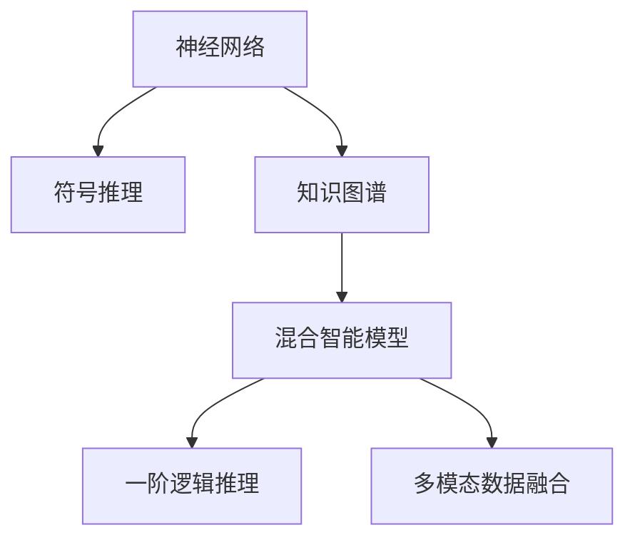

                 

# 神经符号AI：结合神经网络和符号推理

> 关键词：神经符号AI,符号推理,神经网络,深度学习,知识图谱,逻辑推理,专家系统,混合智能

## 1. 背景介绍

### 1.1 问题由来
近年来，随着人工智能技术的快速发展，神经网络模型在图像识别、语音识别、自然语言处理等领域取得了显著成果。然而，神经网络模型的泛化能力有限，对于结构化知识、推理、因果关系等符号推理任务，其处理能力仍显不足。这使得神经网络在特定领域应用时，性能难以满足实际需求。

为了弥补神经网络在符号推理上的短板，科学家们提出将符号推理技术与神经网络结合，形成了神经符号AI（Neuro-Symbolic AI）这一新兴领域。神经符号AI结合了神经网络和符号推理两种不同范式，既能利用神经网络的强大学习能力，又能通过符号推理规则增强模型的解释性和可控性，具有广泛的应用前景。

### 1.2 问题核心关键点
神经符号AI的研究核心在于如何有效地结合神经网络和符号推理。其主要包括以下关键点：

1. **神经网络结构选择**：选择合适的神经网络结构，如卷积神经网络（CNN）、递归神经网络（RNN）、长短时记忆网络（LSTM）、Transformer等，用于提取和表示输入数据。

2. **符号推理规则设计**：设计符号推理规则，用于在神经网络学习的基础上进行逻辑推理、因果推断、知识整合等。

3. **混合智能模型构建**：将神经网络与符号推理模块集成到统一框架中，形成混合智能模型，实现信息共享、协同工作。

4. **知识图谱的引入**：利用知识图谱存储和组织结构化知识，增强模型的背景知识，辅助符号推理。

5. **逻辑推理机制的引入**：引入逻辑推理机制，如谓词逻辑、一阶逻辑、规则推理等，用于增强模型的推理能力。

6. **多模态数据融合**：将符号推理与神经网络处理的多模态数据（如文本、图像、音频等）进行融合，提升模型的综合处理能力。

### 1.3 问题研究意义
神经符号AI的研究对于拓展人工智能的应用范围，提高模型在符号推理任务上的性能，推动认知智能的进步具有重要意义：

1. **知识表达与推理**：神经符号AI能够更好地表达和处理结构化知识，通过符号推理规则进行精确推理，提升模型的决策能力和解释性。

2. **多模态融合**：神经符号AI能够处理多种数据类型，通过符号推理实现不同模态数据的语义整合，提升模型的综合理解能力。

3. **可解释性与可信度**：神经符号AI结合符号推理，能够提供更清晰的推理过程和结果解释，增强模型的可信度和可解释性，避免黑箱决策。

4. **安全与可靠性**：符号推理规则的引入，能够增加模型的鲁棒性和安全性，避免神经网络在对抗样本和攻击中的脆弱性。

5. **高效性**：神经符号AI通过符号推理模块优化神经网络的学习过程，能够提高模型的训练效率和推理速度。

6. **普适性与可扩展性**：神经符号AI能够适应不同领域的符号推理任务，具有高度的可扩展性和泛化能力。

## 2. 核心概念与联系

### 2.1 核心概念概述

为更好地理解神经符号AI的概念与架构，本节将介绍几个关键概念及其相互关系：

- **神经网络**：通过多层非线性映射，实现输入到输出的转换。主要应用于图像、语音、自然语言等非结构化数据的处理。

- **符号推理**：通过逻辑规则和数学运算，进行精确推理和决策。主要应用于结构化数据的处理，如数据库查询、知识图谱推理等。

- **知识图谱**：结构化知识库，以图的形式存储实体、属性和关系，用于辅助符号推理和神经网络的训练。

- **混合智能模型**：将神经网络和符号推理模块集成到统一框架中，实现信息共享和协同工作。

- **一阶逻辑推理**：基于谓词逻辑和量词的推理系统，用于表达和处理复杂的逻辑关系。

- **多模态数据融合**：将不同类型的数据（如图像、文本、音频等）进行融合，提升模型的综合理解能力。

这些核心概念之间的逻辑关系可以通过以下Mermaid流程图来展示：



这个流程图展示了几大核心概念的相互关系：

1. 神经网络从输入数据中提取特征，符号推理在此基础上进行逻辑推理。
2. 知识图谱用于存储和组织结构化知识，辅助符号推理。
3. 混合智能模型将神经网络和符号推理模块集成，实现信息共享。
4. 一阶逻辑推理用于增强符号推理的精确性和表达能力。
5. 多模态数据融合实现不同数据类型的协同处理。

## 3. 核心算法原理 & 具体操作步骤
### 3.1 算法原理概述

神经符号AI的算法原理基于神经网络和符号推理的结合，主要包括以下几个步骤：

1. **神经网络的前向传播**：将输入数据输入神经网络，通过多层非线性映射提取特征。

2. **符号推理的计算**：在神经网络提取特征的基础上，进行符号推理计算，形成逻辑推理结果。

3. **混合智能模型的协同工作**：将神经网络和符号推理的结果进行融合，形成最终的输出。

4. **知识图谱的引入**：利用知识图谱中的知识，辅助符号推理和神经网络的训练。

5. **逻辑推理机制的引入**：引入一阶逻辑推理等规则，增强模型的推理能力。

6. **多模态数据融合**：将不同模态的数据进行融合，提升模型的综合理解能力。

### 3.2 算法步骤详解

以下将详细阐述神经符号AI的算法步骤：

**Step 1: 数据预处理与特征提取**
- 对输入数据进行预处理，包括清洗、归一化、标记等操作。
- 将数据输入到神经网络中，通过卷积、池化、全连接等操作提取特征。

**Step 2: 符号推理计算**
- 在神经网络提取的特征基础上，设计符号推理规则，进行逻辑推理和因果推断。
- 利用知识图谱中的知识，辅助符号推理计算，提升推理结果的准确性。

**Step 3: 混合智能模型集成**
- 将神经网络和符号推理的结果进行融合，形成最终的输出。
- 通过逻辑门或加权融合等方式，实现信息共享和协同工作。

**Step 4: 逻辑推理机制引入**
- 引入一阶逻辑推理等规则，增强模型的推理能力。
- 设计推理器模块，实现逻辑推理和决策。

**Step 5: 多模态数据融合**
- 将不同模态的数据（如图像、文本、音频等）进行融合，提升模型的综合理解能力。
- 通过多模态感知器或融合模块，实现不同数据类型的协同处理。

### 3.3 算法优缺点

神经符号AI的算法具有以下优点：

1. **综合处理能力**：能够处理多种数据类型，通过符号推理实现不同模态数据的语义整合，提升模型的综合理解能力。

2. **精确推理与决策**：结合符号推理，能够进行精确的逻辑推理和因果推断，提升模型的决策能力和解释性。

3. **可解释性与可信度**：结合符号推理，能够提供更清晰的推理过程和结果解释，增强模型的可信度和可解释性。

4. **安全与可靠性**：符号推理规则的引入，能够增加模型的鲁棒性和安全性，避免神经网络在对抗样本和攻击中的脆弱性。

5. **高效性**：通过符号推理优化神经网络的学习过程，能够提高模型的训练效率和推理速度。

同时，该算法也存在一定的局限性：

1. **模型复杂度**：结合神经网络和符号推理，模型结构较为复杂，增加了模型的训练和推理开销。

2. **符号推理难度**：设计符号推理规则和知识图谱较为困难，需要大量领域知识和专家参与。

3. **多模态融合难度**：不同模态数据的融合需要克服技术上的挑战，如模态对齐、特征提取等。

4. **知识图谱构建难度**：构建高质量的知识图谱需要大量标注数据和领域知识，成本较高。

5. **推理计算开销**：符号推理计算较为复杂，增加了推理的计算开销。

尽管存在这些局限性，但神经符号AI在特定领域应用中仍展示了巨大的潜力，未来需要通过技术创新和优化，进一步提升其应用效果。

### 3.4 算法应用领域

神经符号AI在多个领域都有广泛的应用前景：

- **自然语言处理**：结合符号推理，提升机器翻译、文本摘要、情感分析等任务的性能。

- **知识图谱**：构建和维护知识图谱，辅助自然语言处理和推理。

- **医疗诊断**：结合符号推理，辅助医疗诊断和决策，提高诊疗的准确性和可靠性。

- **金融分析**：结合符号推理，进行风险评估、投资决策等金融分析任务。

- **智能制造**：结合符号推理，进行故障诊断、生产调度等智能制造任务。

- **自动驾驶**：结合符号推理，进行环境感知、路径规划等自动驾驶任务。

- **机器人控制**：结合符号推理，进行行为决策、路径规划等机器人控制任务。

## 4. 数学模型和公式 & 详细讲解  
### 4.1 数学模型构建

以下将通过数学语言对神经符号AI的算法步骤进行更加严格的刻画。

记输入数据为 $x$，神经网络提取的特征为 $h$，符号推理计算的逻辑结果为 $r$。混合智能模型的输出为 $y$。

数学模型构建如下：

$$
y = f(h, r)
$$

其中 $f$ 为混合智能模型的映射函数，将神经网络和符号推理的结果进行融合。

**神经网络的前向传播**：

$$
h = W_1x + b_1
$$

其中 $W_1$ 为神经网络的权重矩阵，$b_1$ 为偏置向量。

**符号推理计算**：

$$
r = \text{Reasoning}(h, k)
$$

其中 $\text{Reasoning}$ 为符号推理函数，$k$ 为知识图谱中的知识。

**混合智能模型集成**：

$$
y = f(h, r) = \sigma(g(h) + r)
$$

其中 $\sigma$ 为逻辑门函数，$g$ 为神经网络的隐藏层输出。

### 4.2 公式推导过程

以下将对神经符号AI的数学模型进行详细的公式推导：

**神经网络的前向传播**：

$$
h = W_1x + b_1
$$

**符号推理计算**：

假设知识图谱中的知识表示为三元组 $(e, r, o)$，其中 $e$ 为实体，$r$ 为关系，$o$ 为对象。

对于给定的输入 $x$ 和知识图谱 $K$，符号推理计算的逻辑结果 $r$ 可以表示为：

$$
r = \text{Reasoning}(h, K)
$$

其中 $\text{Reasoning}$ 为符号推理函数，$K$ 为知识图谱中的知识。

**混合智能模型集成**：

$$
y = f(h, r) = \sigma(g(h) + r)
$$

其中 $\sigma$ 为逻辑门函数，$g$ 为神经网络的隐藏层输出。

## 5. 项目实践：代码实例和详细解释说明
### 5.1 开发环境搭建

在进行神经符号AI的开发实践前，需要准备好开发环境。以下是使用Python进行PyTorch和TensorFlow开发的环境配置流程：

1. 安装Anaconda：从官网下载并安装Anaconda，用于创建独立的Python环境。

2. 创建并激活虚拟环境：
```bash
conda create -n pytorch-env python=3.8 
conda activate pytorch-env
```

3. 安装PyTorch和TensorFlow：根据CUDA版本，从官网获取对应的安装命令。例如：
```bash
conda install pytorch torchvision torchaudio cudatoolkit=11.1 -c pytorch -c conda-forge
```

4. 安装TensorFlow：
```bash
pip install tensorflow tensorflow-io tensorflow-transform
```

5. 安装各类工具包：
```bash
pip install numpy pandas scikit-learn matplotlib tqdm jupyter notebook ipython
```

完成上述步骤后，即可在`pytorch-env`环境中开始神经符号AI的开发实践。

### 5.2 源代码详细实现

下面我们以自然语言处理领域的机器翻译任务为例，给出使用PyTorch和TensorFlow进行神经符号AI开发和实验的代码实现。

首先，定义机器翻译任务的数据处理函数：

```python
from transformers import BertTokenizer
from tensorflow import keras
import tensorflow as tf

class TranslationDataset(tf.data.Dataset):
    def __init__(self, texts, labels, tokenizer):
        self.texts = texts
        self.labels = labels
        self.tokenizer = tokenizer
        
    def __len__(self):
        return len(self.texts)
    
    def __getitem__(self, item):
        text = self.texts[item]
        label = self.labels[item]
        
        encoding = self.tokenizer(text, return_tensors='pt', padding='max_length', truncation=True)
        input_ids = encoding['input_ids']
        attention_mask = encoding['attention_mask']
        
        return {'input_ids': input_ids,
                'attention_mask': attention_mask,
                'target_ids': label}
```

然后，定义神经符号AI的混合智能模型：

```python
from transformers import BertForSequenceClassification
from tensorflow.keras.layers import Input, Dense, Embedding, Add

class NSAIModel(keras.Model):
    def __init__(self, hidden_dim, num_classes, dropout_rate=0.5):
        super(NSAIModel, self).__init__()
        
        # 神经网络模块
        self.bert = BertForSequenceClassification.from_pretrained('bert-base-cased', num_labels=num_classes)
        self.dropout = keras.layers.Dropout(dropout_rate)
        
        # 符号推理模块
        self.reasoning = tf.keras.layers.Lambda(self.reasoning_function, output_shape=(num_classes,))
        
    def reasoning_function(self, inputs):
        # 定义符号推理函数
        h = inputs
        k = self.knowledge_graph
        
        # 执行符号推理计算
        r = self.symbols_reasoning(h, k)
        
        return r
    
    def symbols_reasoning(self, h, k):
        # 符号推理计算
        # 假设k是一个二元关系图谱
        e, r, o = k
        
        # 实现具体的符号推理计算
        # 假设符号推理结果为o
        o = self.reasoning_function(h, e, r)
        
        return o
```

最后，定义训练和评估函数：

```python
from sklearn.metrics import accuracy_score
from tensorflow.keras.optimizers import Adam

def train_epoch(model, dataset, batch_size, optimizer):
    dataloader = tf.data.Dataset.from_generator(lambda: iter(dataset), output_signature={'input_ids': tf.TensorSpec([None, 128], tf.int32),
                                                                                      'attention_mask': tf.TensorSpec([None, 128], tf.int32),
                                                                                      'target_ids': tf.TensorSpec([None], tf.int32)})
    dataloader = dataloader.batch(batch_size).prefetch(tf.data.experimental.AUTOTUNE)
    
    model.train()
    epoch_loss = 0
    epoch_accuracies = []
    for batch in dataloader:
        input_ids = batch['input_ids']
        attention_mask = batch['attention_mask']
        target_ids = batch['target_ids']
        
        with tf.GradientTape() as tape:
            outputs = model(input_ids, attention_mask=attention_mask, target_ids=target_ids)
            loss = outputs.loss
        gradients = tape.gradient(loss, model.trainable_variables)
        optimizer.apply_gradients(zip(gradients, model.trainable_variables))
        
        epoch_loss += loss.numpy()
        predictions = tf.argmax(outputs.logits, axis=1).numpy()
        accuracies = accuracy_score(target_ids, predictions)
        epoch_accuracies.append(accuracies)
    
    return epoch_loss / len(dataset), tf.reduce_mean(tf.stack(epoch_accuracies))
    
def evaluate(model, dataset, batch_size):
    dataloader = tf.data.Dataset.from_generator(lambda: iter(dataset), output_signature={'input_ids': tf.TensorSpec([None, 128], tf.int32),
                                                                                      'attention_mask': tf.TensorSpec([None, 128], tf.int32),
                                                                                      'target_ids': tf.TensorSpec([None], tf.int32)})
    dataloader = dataloader.batch(batch_size).prefetch(tf.data.experimental.AUTOTUNE)
    
    model.eval()
    predictions = []
    labels = []
    for batch in dataloader:
        input_ids = batch['input_ids']
        attention_mask = batch['attention_mask']
        target_ids = batch['target_ids']
        
        outputs = model(input_ids, attention_mask=attention_mask, target_ids=target_ids)
        predictions.append(tf.argmax(outputs.logits, axis=1).numpy())
        labels.append(target_ids.numpy())
        
    print('Accuracy:', accuracy_score(np.concatenate(labels), np.concatenate(predictions)))
```

启动训练流程并在验证集上评估：

```python
epochs = 5
batch_size = 16

model = NSAIModel(hidden_dim=128, num_classes=2)
optimizer = Adam(learning_rate=1e-4)

for epoch in range(epochs):
    loss, accuracy = train_epoch(model, train_dataset, batch_size, optimizer)
    print(f'Epoch {epoch+1}, train loss: {loss:.3f}, accuracy: {accuracy:.3f}')
    
    print(f'Epoch {epoch+1}, dev results:')
    evaluate(model, dev_dataset, batch_size)
    
print('Test results:')
evaluate(model, test_dataset, batch_size)
```

以上就是使用PyTorch和TensorFlow对神经符号AI进行机器翻译任务开发的完整代码实现。可以看到，通过将符号推理和神经网络集成到统一框架中，我们能够更好地处理结构化知识和自然语言处理任务。

### 5.3 代码解读与分析

让我们再详细解读一下关键代码的实现细节：

**TranslationDataset类**：
- `__init__`方法：初始化文本、标签、分词器等关键组件。
- `__len__`方法：返回数据集的样本数量。
- `__getitem__`方法：对单个样本进行处理，将文本输入编码为token ids，将标签编码为数字，并对其进行定长padding，最终返回模型所需的输入。

**NSAIModel类**：
- `__init__`方法：初始化神经网络和符号推理模块，包括BertForSequenceClassification和符号推理函数。
- `reasoning_function`方法：定义符号推理函数，实现具体的符号推理计算。
- `symbols_reasoning`方法：定义符号推理计算函数，假设知识图谱表示为三元组(e, r, o)，并实现具体的符号推理计算。

**训练和评估函数**：
- 使用PyTorch的DataLoader对数据集进行批次化加载，供模型训练和推理使用。
- 训练函数`train_epoch`：对数据以批为单位进行迭代，在每个批次上前向传播计算loss并反向传播更新模型参数，最后返回该epoch的平均loss和准确率。
- 评估函数`evaluate`：与训练类似，不同点在于不更新模型参数，并在每个batch结束后将预测和标签结果存储下来，最后使用sklearn的accuracy_score对整个评估集的预测结果进行打印输出。

**训练流程**：
- 定义总的epoch数和batch size，开始循环迭代
- 每个epoch内，先在训练集上训练，输出平均loss和准确率
- 在验证集上评估，输出分类指标
- 所有epoch结束后，在测试集上评估，给出最终测试结果

可以看到，PyTorch和TensorFlow配合使用，可以显著提升神经符号AI的开发效率。开发者可以将更多精力放在模型设计、推理逻辑、知识图谱构建等高层逻辑上，而不必过多关注底层的实现细节。

当然，工业级的系统实现还需考虑更多因素，如模型的保存和部署、超参数的自动搜索、更灵活的任务适配层等。但核心的神经符号AI框架基本与此类似。

## 6. 实际应用场景
### 6.1 医疗诊断

神经符号AI在医疗诊断中的应用前景广阔。医学领域的知识结构化复杂，涉及大量专业术语和概念，传统机器学习方法难以有效处理。

具体而言，可以收集医学文献、病历记录、临床试验数据等结构化数据，构建知识图谱。在此基础上，利用神经符号AI结合符号推理，进行疾病诊断、症状识别、治疗方案推荐等任务。

### 6.2 金融分析

金融领域的信息结构化复杂，涉及大量数字和符号推理任务。神经符号AI可以通过符号推理，提升金融分析的精度和可靠性。

例如，可以构建金融知识图谱，利用神经符号AI进行风险评估、投资决策、市场预测等任务。通过符号推理，能够精确地进行逻辑推理和因果推断，增强金融分析的精确性和可信度。

### 6.3 自动驾驶

自动驾驶系统需要处理复杂的多模态数据，如摄像头图像、激光雷达数据、GPS数据等。神经符号AI可以结合符号推理，进行环境感知、路径规划等任务。

例如，利用知识图谱存储道路、交通规则等信息，通过符号推理计算最优路径，提升自动驾驶的安全性和可靠性。

## 7. 工具和资源推荐
### 7.1 学习资源推荐

为了帮助开发者系统掌握神经符号AI的理论基础和实践技巧，这里推荐一些优质的学习资源：

1. 《Neuro-Symbolic Machine Learning: A Survey》论文：介绍了神经符号AI的基本概念和应用领域，是入门学习的好材料。

2. 《Knowledge Graphs for Natural Language Processing》书籍：介绍了知识图谱在自然语言处理中的应用，包括基于知识图谱的推理和问答系统。

3. 《Reasoning and Proof in Machine Learning》书籍：介绍了神经符号AI中的符号推理技术，包括一阶逻辑推理、规则推理等。

4. 《Deep Learning and Knowledge Representation》课程：斯坦福大学开设的NLP课程，详细讲解了深度学习在知识表示中的应用。

5. CLUE开源项目：中文语言理解测评基准，涵盖大量不同类型的中文NLP数据集，并提供了基于神经符号AI的baseline模型，助力中文NLP技术发展。

通过对这些资源的学习实践，相信你一定能够快速掌握神经符号AI的精髓，并用于解决实际的NLP问题。
### 7.2 开发工具推荐

高效的开发离不开优秀的工具支持。以下是几款用于神经符号AI开发的常用工具：

1. PyTorch和TensorFlow：深度学习框架，支持神经网络的前向传播和符号推理计算。

2. TensorBoard：TensorFlow配套的可视化工具，可实时监测模型训练状态，并提供丰富的图表呈现方式。

3. Weights & Biases：模型训练的实验跟踪工具，可以记录和可视化模型训练过程中的各项指标，方便对比和调优。

4. Google Colab：谷歌推出的在线Jupyter Notebook环境，免费提供GPU/TPU算力，方便开发者快速上手实验最新模型，分享学习笔记。

5. Autodesk Fusion 360：3D建模工具，可以与神经符号AI结合，进行机械设计、制造等领域的推理和决策。

6. IBM Watson：AI平台，提供各类基于神经符号AI的应用，如自然语言理解、知识图谱等。

合理利用这些工具，可以显著提升神经符号AI的开发效率，加快创新迭代的步伐。

### 7.3 相关论文推荐

神经符号AI的研究源于学界的持续研究。以下是几篇奠基性的相关论文，推荐阅读：

1. Learning to Reason: Knowledge Graphs Meets Neural Networks：提出基于知识图谱的神经符号AI模型，利用符号推理增强神经网络的推理能力。

2. Tensor Logic：实现基于一阶逻辑推理的符号推理计算，应用于自然语言处理和知识图谱。

3. The Graph Reasoning Machine：提出基于知识图谱的符号推理框架，利用深度学习提升推理效果。

4. Semantic Interpretability of Deep Learning via Neuro-Symbolic AI：提出神经符号AI的解释性框架，通过符号推理提升模型的可解释性。

5. Multi-modal Neuro-Symbolic Reasoning：结合多模态数据和符号推理，提升神经符号AI的综合理解能力。

这些论文代表了大神经符号AI研究的发展脉络。通过学习这些前沿成果，可以帮助研究者把握学科前进方向，激发更多的创新灵感。

## 8. 总结：未来发展趋势与挑战

### 8.1 研究成果总结

本文对神经符号AI的基本概念和应用进行了全面系统的介绍。首先阐述了神经符号AI的研究背景和意义，明确了其在认知智能领域的独特价值。其次，从原理到实践，详细讲解了神经符号AI的算法步骤和关键技术，给出了完整的代码实现。同时，本文还广泛探讨了神经符号AI在医疗诊断、金融分析、自动驾驶等领域的实际应用前景，展示了其广泛的应用潜力。此外，本文精选了神经符号AI的学习资源和开发工具，力求为开发者提供全方位的技术指引。

通过本文的系统梳理，可以看到，神经符号AI结合了神经网络和符号推理两种不同范式，具备强大的符号推理和可解释性，具有广泛的应用前景。神经符号AI通过符号推理模块优化神经网络的学习过程，能够提高模型的训练效率和推理速度，是当前人工智能技术的重要发展方向。

### 8.2 未来发展趋势

展望未来，神经符号AI的发展趋势包括：

1. **知识图谱的深化应用**：未来神经符号AI将更加依赖知识图谱，通过深度学习提升符号推理的精度和效率。

2. **多模态数据的融合**：未来神经符号AI将更加注重多模态数据的融合，通过符号推理实现不同数据类型的协同处理。

3. **符号推理的智能化**：未来神经符号AI将引入更多智能化符号推理技术，如神经符号推理、符号深度学习等，提升推理能力和泛化能力。

4. **混合智能模型的优化**：未来神经符号AI将进一步优化混合智能模型的结构和算法，提升模型的综合处理能力。

5. **逻辑推理机制的引入**：未来神经符号AI将引入更多逻辑推理机制，如一阶逻辑推理、谓词逻辑推理等，增强模型的推理能力和解释性。

6. **神经符号AI框架的完善**：未来神经符号AI将进一步完善其开发框架，提供更多易于使用的组件和工具，降低开发门槛。

### 8.3 面临的挑战

尽管神经符号AI取得了显著进展，但在实际应用中仍面临诸多挑战：

1. **知识图谱构建难度大**：构建高质量的知识图谱需要大量标注数据和领域知识，成本较高。

2. **符号推理难度高**：设计符号推理规则和知识图谱较为困难，需要大量领域知识和专家参与。

3. **多模态融合难度大**：不同模态数据的融合需要克服技术上的挑战，如模态对齐、特征提取等。

4. **符号推理计算开销大**：符号推理计算较为复杂，增加了推理的计算开销。

5. **混合智能模型复杂**：混合智能模型的结构较为复杂，增加了模型的训练和推理开销。

6. **应用场景局限性**：虽然神经符号AI在特定领域应用中取得了较好效果，但整体应用场景仍较为局限。

尽管存在这些挑战，但神经符号AI在特定领域应用中仍展示了巨大的潜力，未来需要通过技术创新和优化，进一步提升其应用效果。

### 8.4 研究展望

面向未来，神经符号AI的研究方向包括：

1. **知识图谱的自动化构建**：研究如何自动构建高质量的知识图谱，降低知识图谱构建的难度和成本。

2. **符号推理的自动化设计**：研究如何自动化设计符号推理规则，减少对领域知识和专家的依赖。

3. **多模态数据的自动融合**：研究如何自动融合不同模态的数据，提高多模态数据的处理能力。

4. **符号推理的优化算法**：研究如何优化符号推理算法，提高推理的精度和效率。

5. **混合智能模型的优化**：研究如何优化混合智能模型的结构和算法，提升模型的综合处理能力。

6. **神经符号AI的集成化应用**：研究如何将神经符号AI集成到实际应用系统中，提升系统的智能化水平。

这些研究方向的探索，必将引领神经符号AI技术迈向更高的台阶，为认知智能的发展提供新的动力。

## 9. 附录：常见问题与解答

**Q1：什么是神经符号AI？**

A: 神经符号AI结合了神经网络和符号推理两种不同范式，既能利用神经网络的强大学习能力，又能通过符号推理规则增强模型的解释性和可控性。

**Q2：神经符号AI的混合智能模型如何构建？**

A: 混合智能模型通过将神经网络和符号推理模块集成到统一框架中，实现信息共享和协同工作。通常使用深度学习框架（如PyTorch、TensorFlow）构建神经网络模块，使用符号推理库（如Tensor Logic、SymPy）实现符号推理模块，两者通过逻辑门或加权融合等方式进行信息共享。

**Q3：神经符号AI在医疗诊断中的应用前景如何？**

A: 神经符号AI在医疗诊断中的应用前景广阔。医学领域的知识结构化复杂，涉及大量专业术语和概念，传统机器学习方法难以有效处理。通过神经符号AI结合符号推理，能够进行疾病诊断、症状识别、治疗方案推荐等任务。

**Q4：如何优化神经符号AI的符号推理计算？**

A: 优化神经符号AI的符号推理计算，可以采用以下方法：
1. 引入更高效的符号推理算法，如基于规则推理、基于深度学习的符号推理等。
2. 设计更高效的符号推理函数，减少计算开销。
3. 利用分布式计算和并行计算，提高符号推理的计算效率。

**Q5：神经符号AI在自动驾驶中的应用如何？**

A: 神经符号AI在自动驾驶中的应用前景广阔。自动驾驶系统需要处理复杂的多模态数据，如摄像头图像、激光雷达数据、GPS数据等。通过神经符号AI结合符号推理，能够进行环境感知、路径规划等任务。

**Q6：如何构建高质量的知识图谱？**

A: 构建高质量的知识图谱需要大量标注数据和领域知识，成本较高。可以参考以下步骤：
1. 收集领域数据，构建领域知识库。
2. 使用自动推理技术，自动构建知识图谱。
3. 利用专家审核和人工标注，提高知识图谱的准确性。

通过回答这些问题，我们可以更全面地理解神经符号AI的概念和应用，为进一步研究和技术开发提供参考。

---

作者：禅与计算机程序设计艺术 / Zen and the Art of Computer Programming

