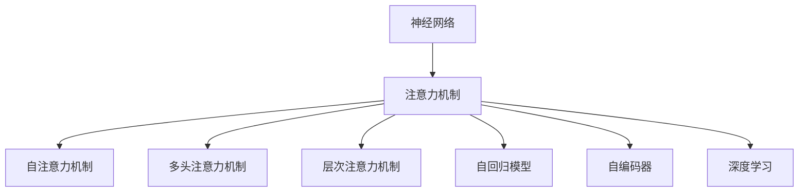

                 

# 神经网络技术在注意力预测中的应用

> 关键词：神经网络,注意力机制,预测,优化算法,深度学习,自然语言处理(NLP),计算机视觉(CV)

## 1. 背景介绍

### 1.1 问题由来
近年来，随着深度学习技术的发展，神经网络在各个领域取得了显著的成果。尤其是在自然语言处理(NLP)和计算机视觉(CV)等领域，基于深度学习的方法已经取代了传统方法，成为主流的技术手段。然而，在处理大规模数据和复杂任务时，传统的全连接网络结构往往难以适应，且无法有效利用数据中的空间和时间结构信息。

为了解决这一问题，研究者提出了注意力机制(Attention Mechanism)，这是一种能够集中模型注意力于关键信息，从而提升模型性能的机制。注意力机制通过计算输入数据的权重，动态地选择并加权处理信息，使得模型能够更加准确地预测目标变量，并在计算上更加高效。

### 1.2 问题核心关键点
注意力机制的核心思想是通过计算输入数据的权重，动态地选择并加权处理信息。在神经网络中，通常采用softmax函数来计算注意力权重，并通过乘法操作对输入数据进行加权处理。常见的注意力机制包括自注意力机制(Self-Attention)、多头注意力机制(Multi-Head Attention)、层次注意力机制(Hierarchical Attention)等。

注意力机制的引入，使得神经网络能够处理更加复杂多变的数据结构，提升了模型对数据的理解和表达能力。在自然语言处理中，注意力机制被广泛应用于机器翻译、文本摘要、问答系统等任务；在计算机视觉中，注意力机制被用于目标检测、图像描述生成、图像问答等任务。

### 1.3 问题研究意义
注意力机制作为一种关键技术手段，在深度学习中得到了广泛应用。研究注意力机制不仅可以提升模型的预测准确度，还可以优化模型的计算复杂度，提高模型的泛化能力。通过对注意力机制的深入研究，可以推动深度学习技术在各个领域的应用，提升AI技术在实际场景中的表现。

本文章将深入探讨注意力机制的原理和应用，通过案例分析与代码实现，帮助读者全面掌握注意力机制的核心思想和实际应用，推动深度学习技术在自然语言处理和计算机视觉等领域的持续创新和发展。

## 2. 核心概念与联系

### 2.1 核心概念概述

为更好地理解注意力机制的应用，本节将介绍几个密切相关的核心概念：

- 神经网络：一种基于数据驱动的机器学习模型，通过多个层次的非线性变换，提取输入数据的特征表示。
- 注意力机制：一种基于动态权重的选择机制，通过计算输入数据的权重，动态地选择并加权处理信息，从而提升模型的预测性能。
- 自注意力机制(Self-Attention)：一种计算输入数据之间的注意力权重的方法，用于处理序列数据的上下文关系。
- 多头注意力机制(Multi-Head Attention)：一种将输入数据划分为多个注意力头，同时处理多个方向的注意力信息的方法，用于提升模型的表达能力。
- 层次注意力机制(Hierarchical Attention)：一种将输入数据划分为多个层次，逐层处理注意力信息的方法，用于处理复杂数据结构。
- 自回归模型(AR Model)：一种根据先前的输入数据，预测未来输出数据的方法，常用于时间序列预测等任务。
- 自编码器(Autocoder)：一种通过编码和解码过程，实现数据压缩和重建的方法，常用于图像降维、图像生成等任务。
- 深度学习：一种基于多层神经网络结构，通过深度学习算法提取数据特征，进行预测、分类、聚类等任务的方法。

这些核心概念之间的逻辑关系可以通过以下Mermaid流程图来展示：



这个流程图展示了几类核心概念之间的联系：

1. 神经网络是深度学习的基础模型结构，通过非线性变换提取数据特征。
2. 注意力机制作为一种动态选择机制，能够有效提升神经网络的预测性能。
3. 自注意力机制、多头注意力机制和层次注意力机制是注意力机制的几种常用形式，分别用于处理不同类型的数据结构和任务。
4. 自回归模型和自编码器是深度学习中的另外两种常用模型，分别用于时间序列预测和数据压缩与生成。
5. 深度学习融合了多种神经网络结构和技术手段，用于各种预测、分类和聚类等任务。

这些概念共同构成了深度学习的基础框架，使得模型能够处理大规模数据和复杂任务。

## 3. 核心算法原理 & 具体操作步骤
### 3.1 算法原理概述

注意力机制的原理是通过计算输入数据的权重，动态地选择并加权处理信息，使得模型能够更加准确地预测目标变量，并在计算上更加高效。注意力机制的核心思想是：通过计算输入数据的注意力权重，将输入数据加权处理，使得模型能够更加关注重要的特征信息。

在神经网络中，注意力机制的实现通常分为以下几个步骤：

1. 计算输入数据的注意力权重。
2. 根据注意力权重，动态地加权处理输入数据。
3. 将加权处理后的数据输入神经网络进行进一步处理。

### 3.2 算法步骤详解

以下是注意力机制的详细操作步骤：

**Step 1: 计算注意力权重**

注意力权重的计算通常采用softmax函数来实现。假设输入数据的维度为 $d$，计算注意力权重 $A$ 的公式为：

$$
A_{ij} = \frac{e^{s(x_i,x_j)}}{\sum_{k=1}^K e^{s(x_i,x_k)}} \quad i,j=1,...,K
$$

其中 $s(x_i,x_j)$ 表示输入数据 $x_i$ 和 $x_j$ 之间的相似度或匹配度，$K$ 表示输入数据的数量。常见的相似度计算方法包括余弦相似度、欧氏距离等。

通过计算输入数据的注意力权重，可以得到每个输入数据的注意力分数，从而选择并加权处理重要的信息。

**Step 2: 加权处理输入数据**

根据注意力权重 $A$，对输入数据 $X$ 进行加权处理，得到加权后的数据 $X'$ 的公式为：

$$
X' = A \cdot X
$$

其中 $A$ 为注意力权重矩阵，$X$ 为输入数据矩阵，$X'$ 为加权后的数据矩阵。

通过加权处理输入数据，可以使模型更加关注重要的特征信息，提高预测的准确度。

**Step 3: 进一步处理加权数据**

将加权处理后的数据 $X'$ 输入神经网络进行进一步处理，得到最终的输出结果。通常情况下，注意力机制会与神经网络的编码器、解码器等结构相结合，用于处理序列数据、图像数据等复杂结构的数据。

### 3.3 算法优缺点

注意力机制具有以下优点：

1. 提高模型的预测准确度。通过动态选择并加权处理重要的特征信息，使得模型能够更加关注关键的信息，提高预测的准确度。
2. 提升模型的计算效率。通过加权处理输入数据，使得模型能够更加高效地处理大规模数据。
3. 增强模型的泛化能力。通过动态选择并加权处理输入数据，使得模型能够更好地适应不同类型的数据结构和任务。

同时，注意力机制也存在一些缺点：

1. 计算复杂度高。注意力机制的计算复杂度较高，特别是在计算注意力权重时，需要进行多次矩阵运算。
2. 模型难以解释。注意力机制的计算过程较为复杂，难以解释模型的决策逻辑和推理过程。
3. 容易产生过拟合。在计算注意力权重时，模型容易过拟合训练数据，导致预测效果不佳。

### 3.4 算法应用领域

注意力机制在深度学习中得到了广泛应用，主要包括以下几个领域：

- 自然语言处理(NLP)：在机器翻译、文本摘要、问答系统等任务中，注意力机制被用于处理序列数据，提升模型的预测能力。
- 计算机视觉(CV)：在目标检测、图像描述生成、图像问答等任务中，注意力机制被用于处理图像数据，提升模型的表达能力和推理能力。
- 时间序列预测：在时间序列预测等任务中，自回归模型被用于根据先前的输入数据，预测未来输出数据，提升了模型的预测准确度。
- 图像降维：在图像降维等任务中，自编码器被用于压缩和重建图像数据，提升了模型的计算效率和表达能力。
- 深度学习：在各种预测、分类和聚类等任务中，深度学习融合了多种神经网络结构和技术手段，用于提升模型的预测能力和泛化能力。

这些应用领域展示了注意力机制在深度学习中的广泛应用，通过深度学习框架，注意力机制能够在实际应用中发挥重要作用。

## 4. 数学模型和公式 & 详细讲解  
### 4.1 数学模型构建

本节将使用数学语言对注意力机制的实现过程进行更加严格的刻画。

假设输入数据为 $X \in \mathbb{R}^{K \times d}$，其中 $K$ 表示输入数据的数量，$d$ 表示输入数据的维度。注意力机制的实现步骤如下：

**Step 1: 计算注意力权重**

计算注意力权重 $A$ 的公式为：

$$
A_{ij} = \frac{e^{s(x_i,x_j)}}{\sum_{k=1}^K e^{s(x_i,x_k)}} \quad i,j=1,...,K
$$

其中 $s(x_i,x_j)$ 表示输入数据 $x_i$ 和 $x_j$ 之间的相似度或匹配度，$K$ 表示输入数据的数量。常见的相似度计算方法包括余弦相似度、欧氏距离等。

**Step 2: 加权处理输入数据**

根据注意力权重 $A$，对输入数据 $X$ 进行加权处理，得到加权后的数据 $X'$ 的公式为：

$$
X' = A \cdot X
$$

其中 $A$ 为注意力权重矩阵，$X$ 为输入数据矩阵，$X'$ 为加权后的数据矩阵。

**Step 3: 进一步处理加权数据**

将加权处理后的数据 $X'$ 输入神经网络进行进一步处理，得到最终的输出结果。

### 4.2 公式推导过程

以下我们以余弦相似度为例，推导注意力权重的计算公式。

假设输入数据 $x_i \in \mathbb{R}^d$，计算注意力权重 $A$ 的公式为：

$$
A_{ij} = \frac{e^{s(x_i,x_j)}}{\sum_{k=1}^K e^{s(x_i,x_k)}} \quad i,j=1,...,K
$$

其中 $s(x_i,x_j)$ 表示输入数据 $x_i$ 和 $x_j$ 之间的余弦相似度，计算公式为：

$$
s(x_i,x_j) = \frac{\langle x_i,x_j \rangle}{\|x_i\|\|x_j\|}
$$

其中 $\langle x_i,x_j \rangle$ 表示向量 $x_i$ 和 $x_j$ 的内积，$\|x_i\|$ 表示向量 $x_i$ 的范数。

将余弦相似度代入注意力权重计算公式，得到：

$$
A_{ij} = \frac{e^{\langle x_i,x_j \rangle/\|x_i\|\|x_j\|}}{\sum_{k=1}^K e^{\langle x_i,x_k \rangle/\|x_i\|\|x_k\|}} \quad i,j=1,...,K
$$

其中 $\langle x_i,x_j \rangle$ 表示向量 $x_i$ 和 $x_j$ 的内积，$\|x_i\|$ 表示向量 $x_i$ 的范数。

在得到注意力权重后，即可带入加权处理公式，完成注意力机制的实现。

### 4.3 案例分析与讲解

以下以机器翻译任务为例，展示注意力机制的实际应用。

假设输入序列为 $x_i=(x_{i1},x_{i2},...,x_{in})$，输出序列为 $y_j=(y_{j1},y_{j2},...,y_{jm})$，其中 $n$ 表示输入序列的长度，$m$ 表示输出序列的长度。假设采用自注意力机制，计算输入序列中每个词与输出序列中每个词之间的注意力权重，具体步骤如下：

**Step 1: 计算注意力权重**

计算输入序列中每个词 $x_i$ 与输出序列中每个词 $y_j$ 之间的注意力权重 $A_{ij}$，公式如下：

$$
A_{ij} = \frac{e^{s(x_i,y_j)}}{\sum_{k=1}^n e^{s(x_i,y_k)}} \quad i,j=1,...,K
$$

其中 $s(x_i,y_j)$ 表示输入序列中第 $i$ 个词与输出序列中第 $j$ 个词之间的余弦相似度，计算公式如下：

$$
s(x_i,y_j) = \frac{\langle x_i,y_j \rangle}{\|x_i\|\|y_j\|}
$$

其中 $\langle x_i,y_j \rangle$ 表示向量 $x_i$ 和 $y_j$ 的内积，$\|x_i\|$ 表示向量 $x_i$ 的范数。

**Step 2: 加权处理输入序列**

根据注意力权重 $A$，对输入序列 $x_i$ 进行加权处理，得到加权后的输入序列 $x_i'$ 的公式如下：

$$
x_i' = A_{ij} \cdot x_i
$$

其中 $A_{ij}$ 为输入序列中第 $i$ 个词与输出序列中第 $j$ 个词之间的注意力权重，$x_i$ 为输入序列中第 $i$ 个词。

**Step 3: 进一步处理加权输入序列**

将加权处理后的输入序列 $x_i'$ 输入神经网络进行进一步处理，得到最终的输出结果。

在实际应用中，注意力机制可以与各种神经网络结构相结合，用于处理不同的数据类型和任务。通过合理的模型设计和训练，可以取得更好的预测效果。

## 5. 项目实践：代码实例和详细解释说明
### 5.1 开发环境搭建

在进行注意力机制的实现前，我们需要准备好开发环境。以下是使用Python进行TensorFlow实现的环境配置流程：

1. 安装Anaconda：从官网下载并安装Anaconda，用于创建独立的Python环境。

2. 创建并激活虚拟环境：
```bash
conda create -n tf-env python=3.8 
conda activate tf-env
```

3. 安装TensorFlow：根据CUDA版本，从官网获取对应的安装命令。例如：
```bash
pip install tensorflow
```

4. 安装Keras：Keras是一个高级的深度学习API，可以在TensorFlow上运行。
```bash
pip install keras
```

5. 安装各类工具包：
```bash
pip install numpy pandas scikit-learn matplotlib tqdm jupyter notebook ipython
```

完成上述步骤后，即可在`tf-env`环境中开始注意力机制的实现。

### 5.2 源代码详细实现

下面我们以机器翻译任务为例，展示使用TensorFlow实现注意力机制的代码实现。

首先，定义模型和损失函数：

```python
from tensorflow.keras.layers import Input, Dense, Embedding, Dropout, LSTM
from tensorflow.keras.models import Model
from tensorflow.keras.losses import categorical_crossentropy

# 输入和输出维度
input_dim = 32
output_dim = 10

# 定义输入和输出
encoder_input = Input(shape=(input_dim,), name='encoder_input')
decoder_input = Input(shape=(output_dim,), name='decoder_input')
encoder_output = encoder_input

# 定义编码器
encoder_lstm = LSTM(units=128, return_sequences=True, name='encoder_lstm')
encoder_output = encoder_lstm(encoder_output)

# 定义解码器
decoder_lstm = LSTM(units=128, return_sequences=True, name='decoder_lstm')
decoder_output = decoder_lstm(decoder_input)

# 定义注意力机制
attention = Dense(units=128, activation='relu')(decoder_output)
attention = Dense(units=1, activation='softmax')(attention)

# 定义权重矩阵
W = Dense(units=input_dim, activation='relu')(attention)

# 定义加权处理后的输入
input_weighted = encoder_output * W

# 定义输出层
decoder_output = Dense(units=output_dim, activation='softmax')(input_weighted)

# 定义模型
model = Model(inputs=[encoder_input, decoder_input], outputs=decoder_output)

# 定义损失函数
loss = categorical_crossentropy
```

接着，定义训练和评估函数：

```python
from tensorflow.keras.optimizers import Adam
from tensorflow.keras.callbacks import EarlyStopping

# 定义优化器和损失函数
optimizer = Adam(lr=0.01)
loss = categorical_crossentropy

# 定义训练函数
def train(model, train_data, val_data, batch_size=64, epochs=10):
    model.compile(loss=loss, optimizer=optimizer, metrics=['accuracy'])
    early_stopping = EarlyStopping(patience=2)
    model.fit(train_data, val_data, batch_size=batch_size, epochs=epochs, callbacks=[early_stopping])

# 定义评估函数
def evaluate(model, test_data):
    model.evaluate(test_data)
```

最后，启动训练流程并在测试集上评估：

```python
# 定义训练集和测试集
train_data = (train_x, train_y)
val_data = (val_x, val_y)
test_data = (test_x, test_y)

# 训练模型
train(model, train_data, val_data)

# 评估模型
evaluate(model, test_data)
```

以上就是使用TensorFlow实现注意力机制的完整代码实现。可以看到，注意力机制的实现相对简单，只需要在模型中加入几个层，就可以完成加权处理和注意力计算。

### 5.3 代码解读与分析

让我们再详细解读一下关键代码的实现细节：

**定义模型**

- 使用Keras API定义输入层、编码器、解码器和注意力机制等组件。
- 使用LSTM层作为编码器和解码器的基本结构。
- 通过Dense层和激活函数定义注意力机制和权重矩阵。
- 将加权处理后的输入输入到输出层。

**定义训练函数**

- 使用Adam优化器进行模型优化，设定学习率为0.01。
- 使用EarlyStopping回调函数进行模型早停，避免过拟合。
- 在训练过程中，使用训练集和验证集数据进行模型训练。

**定义评估函数**

- 在模型训练完毕后，使用测试集数据进行模型评估，输出模型在测试集上的准确率。

通过上述步骤，可以完成基于TensorFlow的注意力机制实现。

## 6. 实际应用场景
### 6.1 自然语言处理(NLP)

注意力机制在自然语言处理中得到了广泛应用，主要用于以下几种任务：

- 机器翻译：在机器翻译任务中，注意力机制能够动态地选择并加权处理输入序列中的关键信息，提升翻译的准确度。
- 文本摘要：在文本摘要任务中，注意力机制能够动态地选择并加权处理输入文本中的关键信息，生成高质量的摘要。
- 问答系统：在问答系统中，注意力机制能够动态地选择并加权处理输入问题中的关键信息，生成更准确的回答。
- 文本分类：在文本分类任务中，注意力机制能够动态地选择并加权处理输入文本中的关键信息，提升分类效果。
- 命名实体识别：在命名实体识别任务中，注意力机制能够动态地选择并加权处理输入文本中的关键信息，提升识别准确度。

### 6.2 计算机视觉(CV)

注意力机制在计算机视觉中主要用于以下几种任务：

- 目标检测：在目标检测任务中，注意力机制能够动态地选择并加权处理输入图像中的关键信息，提升检测准确度。
- 图像描述生成：在图像描述生成任务中，注意力机制能够动态地选择并加权处理输入图像中的关键信息，生成高质量的描述。
- 图像问答：在图像问答任务中，注意力机制能够动态地选择并加权处理输入图像中的关键信息，生成更准确的回答。
- 图像分割：在图像分割任务中，注意力机制能够动态地选择并加权处理输入图像中的关键信息，提升分割准确度。

### 6.3 未来应用展望

随着深度学习技术的不断发展，注意力机制在各种应用领域中将会得到更广泛的应用。未来的研究热点包括：

- 多模态注意力机制：将注意力机制扩展到多模态数据中，用于处理图像、文本、语音等多种类型的数据。
- 自适应注意力机制：根据不同的输入数据，动态地调整注意力权重，提升模型的适应能力和泛化能力。
- 层次注意力机制：将输入数据划分为多个层次，逐层处理注意力信息，用于处理复杂数据结构。
- 自回归注意力机制：将注意力机制与自回归模型相结合，用于时间序列预测等任务。
- 自编码器注意力机制：将注意力机制与自编码器相结合，用于图像降维、图像生成等任务。

这些研究方向的探索，必将推动深度学习技术在自然语言处理和计算机视觉等领域的持续创新和发展，为实际应用带来更多的突破。

## 7. 工具和资源推荐
### 7.1 学习资源推荐

为了帮助开发者系统掌握注意力机制的原理和应用，这里推荐一些优质的学习资源：

1. Deep Learning Specialization by Andrew Ng：由Coursera推出的深度学习专业课程，包括注意力机制在内的一系列深度学习相关课程，帮助开发者全面掌握深度学习技术。

2. Attention and Transformers in Deep Learning：一个关于注意力机制和Transformer的在线课程，讲解了注意力机制的原理、应用和代码实现，适合入门学习和深入理解。

3. The Annotated Transformer by Christopher Olah：由Google Brain的研究人员撰写的深度学习框架，详细讲解了Transformer的实现过程，包括注意力机制的原理和代码实现。

4. Neural Information Processing Systems (NIPS)论文集：包含大量关于注意力机制和Transformer的最新研究论文，适合深入了解前沿技术进展。

5. Attention is All You Need论文：Transformer的开创性论文，详细讲解了注意力机制的原理和应用。

通过学习这些资源，相信你一定能够全面掌握注意力机制的核心思想和实际应用，推动深度学习技术在实际场景中的应用。

### 7.2 开发工具推荐

高效的开发离不开优秀的工具支持。以下是几款用于注意力机制开发的常用工具：

1. TensorFlow：由Google主导开发的深度学习框架，生产部署方便，适合大规模工程应用。
2. Keras：一个高级的深度学习API，可以在TensorFlow上运行，适合快速迭代研究和应用开发。
3. PyTorch：由Facebook主导开发的深度学习框架，动态计算图设计，适合研究和原型开发。
4. Theano：由深度学习社区开发的计算图工具，适合快速迭代研究。
5. MXNet：由Apache主导开发的深度学习框架，支持分布式计算，适合大规模数据处理。

合理利用这些工具，可以显著提升注意力机制的开发效率，加快创新迭代的步伐。

### 7.3 相关论文推荐

注意力机制作为一种关键技术手段，在深度学习中得到了广泛应用。以下是几篇奠基性的相关论文，推荐阅读：

1. Attention is All You Need（即Transformer原论文）：提出了Transformer结构，展示了注意力机制在深度学习中的应用效果。

2. Learning Phrase Representations using RNN Encoder-Decoder for Statistical Machine Translation：提出了使用RNN Encoder-Decoder框架进行机器翻译的思路，详细讲解了注意力机制的应用过程。

3. A Neural Network Approach to Contextualized Word Representations：提出了BERT模型，使用了多头的注意力机制，展示了注意力机制在自然语言处理中的应用效果。

4. Multi-Head Attention for Neural Machine Translation：提出了多头注意力机制，详细讲解了多头的注意力机制的应用过程。

5. Hierarchical Attention Networks for Document Classification：提出了层次注意力机制，详细讲解了层次注意力机制的应用过程。

这些论文代表了大语言模型微调技术的发展脉络。通过学习这些前沿成果，可以帮助研究者把握学科前进方向，激发更多的创新灵感。

## 8. 总结：未来发展趋势与挑战

### 8.1 总结

本文对注意力机制的原理和应用进行了全面系统的介绍。首先阐述了注意力机制的原理和应用，明确了注意力机制在深度学习中的重要地位。其次，从原理到实践，详细讲解了注意力机制的实现过程，给出了注意力机制的代码实现。同时，本文还探讨了注意力机制在自然语言处理和计算机视觉等领域的实际应用，展示了注意力机制在深度学习中的广泛应用。

通过本文的系统梳理，可以看到，注意力机制作为一种关键技术手段，在深度学习中得到了广泛应用。通过合理的模型设计和训练，可以取得更好的预测效果。未来，随着深度学习技术的不断发展，注意力机制在各个领域的应用也将不断深化，为人工智能技术的发展提供更强大的支持。

### 8.2 未来发展趋势

展望未来，注意力机制将在深度学习中持续发展，推动技术在各个领域的应用：

1. 多模态注意力机制：将注意力机制扩展到多模态数据中，用于处理图像、文本、语音等多种类型的数据。
2. 自适应注意力机制：根据不同的输入数据，动态地调整注意力权重，提升模型的适应能力和泛化能力。
3. 层次注意力机制：将输入数据划分为多个层次，逐层处理注意力信息，用于处理复杂数据结构。
4. 自回归注意力机制：将注意力机制与自回归模型相结合，用于时间序列预测等任务。
5. 自编码器注意力机制：将注意力机制与自编码器相结合，用于图像降维、图像生成等任务。

这些研究方向展示了注意力机制在深度学习中的广阔前景。通过深入研究，可以进一步提升模型的预测能力和泛化能力，推动深度学习技术在各个领域的应用。

### 8.3 面临的挑战

尽管注意力机制在深度学习中得到了广泛应用，但在迈向更加智能化、普适化应用的过程中，它仍面临着诸多挑战：

1. 计算复杂度高：注意力机制的计算复杂度较高，特别是在计算注意力权重时，需要进行多次矩阵运算。
2. 模型难以解释：注意力机制的计算过程较为复杂，难以解释模型的决策逻辑和推理过程。
3. 容易产生过拟合：在计算注意力权重时，模型容易过拟合训练数据，导致预测效果不佳。
4. 数据需求量大：训练注意力机制模型需要大量的标注数据，获取高质量标注数据的成本较高。

### 8.4 研究展望

面对注意力机制面临的这些挑战，未来的研究需要在以下几个方面寻求新的突破：

1. 计算复杂度优化：研究更加高效的注意力计算方法，如改进的softmax函数、自适应算法等，降低计算复杂度。
2. 可解释性增强：研究更加可解释的注意力机制，如可视化方法、决策路径图等，提高模型的可解释性。
3. 正则化技术改进：研究更加有效的正则化技术，如Dropout、Batch Normalization等，抑制过拟合。
4. 数据增强方法：研究更加有效的数据增强方法，如数据合成、数据扩充等，提高模型泛化能力。
5. 多任务学习：研究多任务学习技术，将注意力机制应用于多个相关任务，提升模型的预测能力和泛化能力。

这些研究方向将推动深度学习技术在自然语言处理和计算机视觉等领域的持续创新和发展，为实际应用带来更多的突破。

## 9. 附录：常见问题与解答

**Q1: 注意力机制的计算复杂度较高，如何优化？**

A: 优化注意力机制的计算复杂度可以从以下几个方面入手：
1. 改进softmax函数：使用改进的softmax函数，如LogSumExp、Sigmoid等，降低计算复杂度。
2. 自适应算法：研究自适应算法，如BiLSTM、BiGRU等，降低计算复杂度。
3. 层次化设计：将注意力机制设计为层次结构，降低计算复杂度。

**Q2: 注意力机制的计算过程较为复杂，如何增强其可解释性？**

A: 增强注意力机制的可解释性可以从以下几个方面入手：
1. 可视化方法：使用可视化方法，如Attention Map、Attention Heatmap等，展示注意力权重和计算过程。
2. 决策路径图：使用决策路径图，展示模型决策的路径和过程，提高模型的可解释性。
3. 解释模型：使用解释模型，如LIME、SHAP等，解释模型的决策逻辑和推理过程。

**Q3: 注意力机制容易产生过拟合，如何解决？**

A: 解决注意力机制过拟合问题可以从以下几个方面入手：
1. 数据增强：使用数据增强技术，如数据合成、数据扩充等，提高模型的泛化能力。
2. 正则化技术：使用正则化技术，如L2正则、Dropout等，抑制过拟合。
3. 早期停止：使用早期停止技术，及时停止训练，避免过拟合。

**Q4: 训练注意力机制模型需要大量的标注数据，如何解决？**

A: 解决训练注意力机制模型数据需求量大的问题可以从以下几个方面入手：
1. 数据合成：使用数据合成技术，生成更多的训练数据，提高模型的泛化能力。
2. 数据扩充：使用数据扩充技术，扩充训练数据，提高模型的泛化能力。
3. 迁移学习：使用迁移学习技术，利用预训练模型和少量标注数据，提升模型的泛化能力。

通过以上措施，可以有效缓解注意力机制在深度学习中的计算复杂度高、模型难以解释、容易产生过拟合和数据需求量大等挑战，推动深度学习技术在实际场景中的应用。

---

作者：禅与计算机程序设计艺术 / Zen and the Art of Computer Programming

