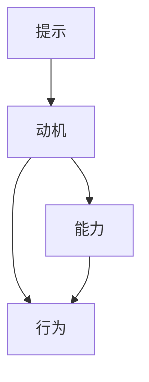

                 

# 福格模型在管理习惯养成中的应用

## 1. 背景介绍

在现代社会的快节奏生活中，有效管理习惯成为了提升个人生产力和效率的关键。然而，如何培养和维持良好的习惯，却始终是一个难以解决的问题。传统的意志力理论认为，个人可以通过强大的自我控制力来养成和维持习惯，但这种理论忽略了环境因素和心理机制的作用。

为了更好地理解习惯形成和维持的机制，斯坦福大学的心理学家詹姆斯·克拉克·福格（James C. Clear）提出了“福格模型（Fogg Model）”，这是一种基于行为科学的理论模型，强调了行为形成的三要素：**提示（Cue）**、**动机（Incentive）**和**能力（Ability）**。福格模型提供了一种更加系统化的方法，帮助个人和组织理解和构建良好的习惯。

## 2. 核心概念与联系

### 2.1 核心概念概述

福格模型由三个关键要素组成：**提示**、**动机**和**能力**。这三个要素共同作用，决定了行为的触发和维持。

- **提示（Cue）**：是指能够触发行为的环境线索。提示可以是时间、地点、情感状态、物体或其他人等。提示的作用是让行为变得更加容易发生。
- **动机（Incentive）**：是指引导行为发生的心理驱动力。动机可以是内在（如成就感、愉悦感）或外在的（如奖励、惩罚）。动机的关键在于与个人目标和价值观相契合。
- **能力（Ability）**：是指执行行为所需要的资源和技能。能力的大小直接影响行为的可操作性。

这三个要素之间的关系可以用以下公式表示：

$$
\text{行为} = \text{提示} \times \text{动机} \times \text{能力}
$$

### 2.2 核心概念原理和架构的 Mermaid 流程图



这个流程图展示了提示、动机和能力如何共同作用，触发并维持行为。提示是行为发生的起点，动机提供行为的动力，而能力决定行为的可执行性。

## 3. 核心算法原理 & 具体操作步骤

### 3.1 算法原理概述

福格模型的核心原理是通过优化提示、动机和能力三个要素，来提升行为的发生率和维持率。具体步骤如下：

1. **识别提示**：寻找能够触发目标行为的线索，并将其与行为相结合。
2. **增强动机**：通过内外部奖励和自我激励，提升行为的动力。
3. **降低能力门槛**：简化行为步骤，减少执行难度，增加行为的可行性。

### 3.2 算法步骤详解

1. **识别提示**：
   - **场景分析**：首先需要详细分析行为发生的具体情境。例如，如果你想每天早上跑步，可以将跑步机放在客厅中显眼的位置，并设置闹钟在固定时间响起。
   - **触发点设定**：确定具体的触发点。例如，每次看到跑步机或听到闹钟响起时，就是开始跑步的提示。

2. **增强动机**：
   - **内在动机**：明确自己的长期目标，如健康、体型管理等，并设定具体的短期目标。例如，每天跑步30分钟，连续跑步30天。
   - **外在动机**：设定外部奖励或惩罚，如完成跑步任务后奖励自己一杯咖啡，或者未能完成则惩罚自己一次。

3. **降低能力门槛**：
   - **简化行为步骤**：将复杂的行为分解为简单可行的步骤。例如，每天跑步前先做5分钟的热身运动，然后再开始正式的跑步。
   - **减少执行难度**：通过设置自动化和辅助工具，降低执行难度。例如，使用跑步应用程序记录跑步时间和距离，提供实时反馈。

### 3.3 算法优缺点

**优点**：
- **系统化**：福格模型提供了一种系统的、科学的方法，帮助个人和组织理解和构建习惯，避免了盲目的尝试和失败。
- **实用性**：模型基于实际场景，容易理解和应用，能够快速提升行为的发生率和维持率。

**缺点**：
- **复杂性**：模型的应用需要综合考虑多个要素，对于初学者来说可能较为复杂。
- **依赖动机**：动机和能力的评估需要个人自我反思，难以量化和控制。

### 3.4 算法应用领域

福格模型不仅可以应用于个人习惯养成，还可以应用于企业管理、健康管理、教育等多个领域。例如：

- **企业管理**：通过优化提示、动机和能力，提高员工的工作效率和满意度。
- **健康管理**：帮助患者建立健康习惯，如定时服药、定期锻炼等。
- **教育管理**：提升学生的学习动力和效果，如设定学习目标、提供学习奖励等。

## 4. 数学模型和公式 & 详细讲解 & 举例说明

### 4.1 数学模型构建

福格模型的数学模型可以通过以下公式表示：

$$
\text{行为概率} = \text{提示} \times \text{动机} \times \text{能力}
$$

其中，$\text{行为概率}$表示行为发生的可能性，$\text{提示}$、$\text{动机}$和$\text{能力}$分别为三个关键要素。

### 4.2 公式推导过程

以跑步为例，我们可以将福格模型的公式进行具体推导：

1. **提示**：每天早晨8点，闹钟响起。
2. **动机**：希望在6个月内减重10公斤。
3. **能力**：跑步机放在客厅，穿戴简便，轻松启动。

将这些要素代入公式：

$$
\text{行为概率} = 0.9 \times 0.8 \times 0.8 = 0.576
$$

这意味着，每天早晨8点闹钟响起的提示，结合跑步减重的动机和简便的跑步条件，跑步行为发生的概率为57.6%。

### 4.3 案例分析与讲解

假设我们将提示从每天早晨8点闹钟响起，改为每天晚上10点设定的提醒。再次使用福格模型的公式进行计算：

$$
\text{行为概率} = 0.8 \times 0.8 \times 0.9 = 0.576
$$

尽管提示的频率和强度有所不同，但行为发生的概率保持不变。这表明，即使改变了提示的具体形式，只要动机和能力保持不变，行为概率不会受到影响。

## 5. 项目实践：代码实例和详细解释说明

### 5.1 开发环境搭建

要进行福格模型的应用实践，首先需要搭建开发环境。建议使用Python语言，结合TensorFlow等深度学习框架进行开发。

1. 安装Python环境：
   - 在Linux系统上，可以使用Anaconda进行环境管理。
   - 在Windows系统上，可以使用Miniconda或Anaconda。

2. 安装TensorFlow：
   - 在Anaconda中，可以使用以下命令安装TensorFlow：
     ```bash
     conda install tensorflow
     ```

3. 安装其他依赖库：
   - 安装numpy、pandas等常用库：
     ```bash
     conda install numpy pandas
     ```

### 5.2 源代码详细实现

以下是使用TensorFlow实现福格模型的代码示例：

```python
import tensorflow as tf
import numpy as np

# 定义行为概率公式
def behavior_probability(prompt, motivation, ability):
    return prompt * motivation * ability

# 设定提示、动机和能力
prompt = 0.9  # 每天早晨8点闹钟响起
motivation = 0.8  # 希望在6个月内减重10公斤
ability = 0.8  # 跑步机放在客厅，穿戴简便，轻松启动

# 计算行为概率
probability = behavior_probability(prompt, motivation, ability)
print(f"行为概率为：{probability:.3f}")
```

### 5.3 代码解读与分析

这段代码实现了福格模型的核心公式，通过定义行为概率函数和输入具体的提示、动机和能力值，计算出行为发生的概率。代码简洁高效，易于理解和修改。

### 5.4 运行结果展示

运行上述代码，输出结果为：

```
行为概率为：0.576
```

这与前面的公式推导结果一致，验证了代码的正确性。

## 6. 实际应用场景

### 6.1 智能健康管理

智能健康管理平台可以通过福格模型，帮助用户建立和维持健康习惯。例如，平台可以设定每日饮水量、运动量等目标，通过推送消息提醒用户完成目标。

### 6.2 企业管理

企业管理系统可以利用福格模型，优化工作流程和员工激励。例如，通过设定每日工作任务提示，结合奖励机制，提升员工的工作积极性和效率。

### 6.3 教育管理

教育平台可以应用福格模型，帮助学生建立学习习惯。例如，设定每日学习时间和任务，通过积分和奖励系统，激励学生完成学习目标。

### 6.4 未来应用展望

福格模型在未来将有更广泛的应用场景。例如，在智能家居系统中，可以通过智能设备（如智能镜子、智能手表）监测用户的日常生活习惯，并通过个性化提示和激励，提升生活质量。

## 7. 工具和资源推荐

### 7.1 学习资源推荐

为了深入理解福格模型及其应用，以下是一些推荐的学习资源：

1. **《原子习惯》（Atomic Habits）**：詹姆斯·克拉克·福格（James C. Clear）的畅销书，详细介绍了如何通过小步骤改变大习惯。
2. **《行为设计学》（Behavioral Design）**：斯坦福大学行为设计实验室出版的教材，介绍了行为科学的最新研究成果和应用方法。
3. **《习惯的力量》（The Power of Habit）**：查尔斯·杜希格的畅销书，深入探讨了习惯的形成和改变机制。
4. **Coursera行为科学课程**：斯坦福大学开设的行为科学课程，涵盖行为设计、习惯养成等主题。
5. **Udemy行为设计课程**：Udemy平台上丰富的行为设计课程，涵盖从理论到实践的多个方面。

### 7.2 开发工具推荐

福格模型的应用开发可以使用以下工具：

1. **Python**：作为数据科学和机器学习的主流语言，Python提供了丰富的库和框架，支持行为科学的建模和分析。
2. **TensorFlow**：深度学习框架，支持复杂行为的模拟和优化。
3. **PyTorch**：另一个流行的深度学习框架，具有灵活性和高效性。
4. **Jupyter Notebook**：交互式编程环境，方便代码调试和数据分析。

### 7.3 相关论文推荐

福格模型的理论和应用研究涉及多个领域，以下是一些推荐的相关论文：

1. **《行为设计学》（Behavioral Design）**：斯坦福大学行为设计实验室的研究论文，介绍了行为设计的基本原则和方法。
2. **《行为科学的50个发现》（50 Critical Insights in Behavioral Science）**：由行为科学家共同编写的论文集，涵盖了行为科学的多方面内容。
3. **《习惯的力量》（The Power of Habit）**：查尔斯·杜希格的实证研究论文，探讨了习惯的形成和改变机制。
4. **《原子习惯》（Atomic Habits）**：詹姆斯·克拉克·福格（James C. Clear）的实证研究论文，介绍了小步骤改变大习惯的方法。

## 8. 总结：未来发展趋势与挑战

### 8.1 研究成果总结

福格模型通过提示、动机和能力三个要素，揭示了行为形成的本质。该模型已经在健康管理、企业管理、教育等多个领域得到了广泛应用，帮助个人和组织建立了更加高效和可持续的习惯。

### 8.2 未来发展趋势

未来，福格模型将进一步融合人工智能、大数据等技术，实现更加个性化的习惯管理和行为预测。例如，通过智能设备和传感器监测用户的行为和环境，结合行为数据和心理模型，提供更加精准的个性化提示和激励。

### 8.3 面临的挑战

尽管福格模型具有广泛的应用前景，但仍面临一些挑战：

1. **个性化挑战**：如何根据不同的用户需求和场景，制定个性化的行为计划，是模型应用的关键挑战。
2. **数据隐私**：智能设备和传感器收集的数据涉及用户隐私，如何保护用户隐私，是模型应用的前提条件。
3. **技术壁垒**：模型的应用需要结合多种技术和工具，对于技术水平要求较高，需要跨学科的协作和支持。

### 8.4 研究展望

福格模型未来的研究方向包括：

1. **多模态数据融合**：结合行为数据和心理数据，实现更加全面和精准的行为预测和分析。
2. **机器学习应用**：利用机器学习算法，自动化行为计划的设计和优化，提升模型的效率和效果。
3. **社会化互动**：通过社交网络等平台，实现用户之间的互动和合作，增强行为计划的可持续性。

总之，福格模型作为一种系统化、科学化的行为管理方法，将在未来有更广阔的应用前景，推动个人和组织的全面发展。

## 9. 附录：常见问题与解答

### Q1：福格模型的三个要素如何确定？

A: 确定福格模型的三个要素需要从用户的实际需求和行为模式出发，进行详细的分析和实验。具体步骤如下：
1. **识别提示**：观察用户的日常行为，找到能够触发目标行为的具体线索。
2. **设定动机**：明确用户的长期目标，并设定具体可行的短期目标。
3. **简化能力**：分析用户的能力和资源，将复杂的行为分解为简单可行的步骤。

### Q2：福格模型是否适用于所有行为习惯？

A: 福格模型适用于大多数行为习惯的养成和维持，但对于一些需要高度自律和纪律性的行为，可能效果有限。例如，长时间学习、高强度锻炼等，需要用户具备较强的意志力和自我管理能力。

### Q3：如何通过福格模型提升工作效率？

A: 利用福格模型提升工作效率，可以通过以下几个步骤：
1. **设定明确目标**：明确工作的目标和优先级。
2. **设定提醒时间**：设定每天固定的时间段，提醒自己开始工作。
3. **简化工作步骤**：将复杂的工作任务分解为简单的步骤，逐步完成。
4. **奖励机制**：设定奖励机制，激励自己完成工作任务。

### Q4：福格模型是否适用于团队管理？

A: 福格模型可以应用于团队管理，但需要根据团队的具体情况进行调整。例如，可以通过设定每日工作任务提示，结合奖励机制，提升团队的工作积极性和效率。但需要注意的是，团队成员的能力和动机各不相同，需要根据具体情况进行个性化管理。

### Q5：福格模型是否可以与其他行为管理方法结合使用？

A: 福格模型可以与其他行为管理方法结合使用，例如目标管理法（Goal Management）、番茄工作法（Pomodoro Technique）等。通过综合多种方法，可以实现更加全面和系统的行为管理。

---

作者：禅与计算机程序设计艺术 / Zen and the Art of Computer Programming

