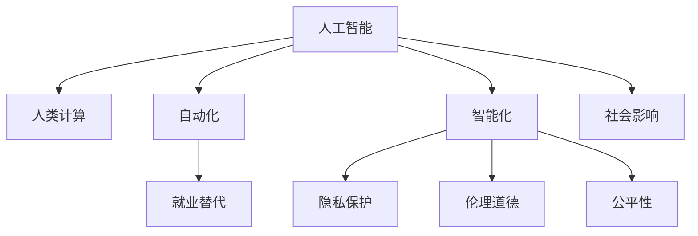

                 

# 科技与社会：人类计算的双重影响

## 1. 背景介绍

### 1.1 问题由来
进入21世纪以来，人工智能（AI）技术迅猛发展，以深度学习、自然语言处理（NLP）为代表的人类计算领域取得了瞩目的突破。计算机程序在处理大规模数据、完成复杂计算任务、实现高精度预测等方面，展现了无与伦比的优势。然而，这种技术进步也引发了关于人类与计算的深层次讨论，科技与社会的互动关系进入新的阶段。本文将探讨人类计算对科技发展、社会变革的双重影响，以期为科技进步和社会发展的协调共进提供新的视角。

### 1.2 问题核心关键点
人类计算的双重影响，一方面体现在其技术革新对经济、教育、医疗、交通等社会各个领域的深刻改变，另一方面也引发了关于就业、隐私、伦理、公平等社会问题。本文将聚焦于以下核心关键点：

1. **计算技术对社会变革的推动作用**：探讨AI在自动化、智能化转型中的角色。
2. **计算技术引发的社会问题**：分析AI带来的就业、隐私、伦理、公平等挑战。
3. **社会对计算技术的反作用**：研究社会因素如何影响AI技术的发展与应用。

### 1.3 问题研究意义
研究人类计算对科技与社会双重影响的机制，对于理解AI技术在现实世界的应用，制定科学合理的政策法规，促进社会和谐发展，具有重要意义：

1. **技术推动**：理解AI如何通过提高效率、优化决策等方式推动社会进步。
2. **问题应对**：认识AI对就业、隐私等问题的影响，并探索解决方案。
3. **政策制定**：基于研究结果，制定促进技术发展、保障社会公正的政策。
4. **社会共识**：构建技术与社会共融的共识，促进AI技术的健康发展。

## 2. 核心概念与联系

### 2.1 核心概念概述

为更好地理解人类计算对科技与社会的影响，本节将介绍几个核心概念及其相互联系：

- **人工智能（AI）**：指通过算法和计算模型，使计算机系统能够完成人类智能任务的领域，包括机器学习、深度学习、自然语言处理等。
- **人类计算**：指利用计算机程序和算法，实现人类认知和决策能力的延伸和扩展，涵盖计算数学、人工智能、大数据分析等方向。
- **自动化**：指通过计算机程序和机器学习，实现任务自动化、智能化，减少人工干预的过程。
- **智能化**：指计算机系统能够理解和执行复杂的认知任务，如语言理解、决策支持等。
- **就业替代**：指AI技术导致的部分岗位被自动化和智能化系统取代的现象。
- **隐私保护**：指在AI应用中，如何保护个人数据和隐私不受侵害。
- **伦理道德**：指AI技术应用中，需遵循的道德规范和伦理原则。
- **公平性**：指AI系统在处理决策时，避免偏见和歧视，实现公正对待。

这些概念之间的联系可以通过以下Mermaid流程图来展示：



这个流程图展示了人工智能与人类计算之间的联系及其对社会的影响。人工智能通过自动化和智能化推动了人类计算的发展，同时对就业、隐私、伦理、公平等社会问题产生了深远影响。社会因素也反过来影响着人工智能技术的发展与应用。

## 3. 核心算法原理 & 具体操作步骤

### 3.1 算法原理概述

人类计算的核心算法原理基于计算机程序和算法模型。以深度学习为例，通过神经网络模型，将大规模数据转换为复杂特征表示，实现对输入数据的高级处理和分析。具体算法步骤如下：

1. **数据预处理**：清洗、标注、分批次处理输入数据。
2. **模型训练**：利用反向传播算法更新神经网络权重，最小化损失函数。
3. **模型验证与测试**：在验证集和测试集上评估模型性能，防止过拟合。
4. **模型部署与优化**：将训练好的模型部署到实际应用中，并进行性能调优。

### 3.2 算法步骤详解

以下以深度学习中的卷积神经网络（CNN）为例，详细讲解基于人类计算的算法步骤：

**Step 1: 数据预处理**
- 收集并清洗数据，去除噪声和异常值。
- 对图像数据进行归一化和数据增强处理。
- 将数据划分为训练集、验证集和测试集。

**Step 2: 模型训练**
- 选择合适的损失函数，如交叉熵损失。
- 设置合适的优化器，如随机梯度下降（SGD）或Adam。
- 设置合适的学习率、批大小、迭代轮数等超参数。
- 使用反向传播算法更新模型参数。

**Step 3: 模型验证与测试**
- 在验证集上评估模型性能，如准确率、精确率、召回率等指标。
- 使用交叉验证方法，确保模型泛化能力。

**Step 4: 模型部署与优化**
- 将训练好的模型保存，并导出为可部署的格式。
- 在实际应用中，优化模型性能，如调整超参数、增加数据增强等。

### 3.3 算法优缺点

人类计算的核心算法具有以下优点：
1. 处理大规模数据能力强，可以处理海量数据，提升模型精度。
2. 算法的可解释性，通过分析算法步骤，可以理解模型的决策过程。
3. 模型易于调整和优化，通过修改超参数或增加数据增强，可以提升模型性能。

但同时也存在以下缺点：
1. 高计算资源需求，大规模数据处理需要高性能计算设备。
2. 模型训练时间较长，复杂的模型需要长时间训练。
3. 数据依赖性强，模型依赖于高质量标注数据。

### 3.4 算法应用领域

人类计算的核心算法在多个领域得到了广泛应用，例如：

- **医疗影像分析**：利用深度学习算法，自动分析医学影像，辅助医生诊断。
- **金融风险预测**：通过机器学习算法，预测市场走势，管理投资风险。
- **自然语言处理**：利用自然语言处理技术，实现语音识别、文本翻译、智能问答等应用。
- **自动驾驶**：通过计算机视觉和深度学习算法，实现自动驾驶汽车的安全行驶。

这些应用领域展示了人类计算的广泛应用，也为未来技术的发展提供了更多可能性。

## 4. 数学模型和公式 & 详细讲解 & 举例说明

### 4.1 数学模型构建

深度学习模型的核心在于神经网络结构，以卷积神经网络（CNN）为例，其数学模型构建如下：

设输入样本 $x$ 为 $m \times n \times c$ 的张量，卷积层 $C$ 包含 $k \times k$ 的卷积核 $w$ 和 $d$ 个特征图 $h$。卷积层输出的特征图 $o$ 为 $h' \times w \times d'$。则卷积操作的数学表达式为：

$$ o = \sigma(\sum_{k=0}^{c-1} \sum_{d=0}^{d'-1} \sum_{h=0}^{h'-1} \sum_{w=0}^{w-1} w_{h,k,d} x_{h,w,k} * h_{d} + b_{d} + c) $$

其中 $\sigma$ 为激活函数，$*$ 为卷积运算，$b$ 为偏置项，$c$ 为卷积层常数。

### 4.2 公式推导过程

以卷积神经网络（CNN）为例，其前向传播和反向传播的公式推导如下：

**前向传播公式**：
- 卷积层：$o = \sigma(\sum_{k=0}^{c-1} \sum_{d=0}^{d'-1} \sum_{h=0}^{h'-1} \sum_{w=0}^{w-1} w_{h,k,d} x_{h,w,k} * h_{d} + b_{d} + c)$
- 池化层：$o' = \max(o)$
- 全连接层：$y = \sigma(\sum_{i=0}^{n-1} w_i o_i + b_i)$

**反向传播公式**：
- 损失函数：$L = \frac{1}{N} \sum_{i=1}^N (y_i - t_i)^2$
- 卷积层梯度：$\frac{\partial L}{\partial w_{h,k,d}} = \sum_{i=1}^N (o_i * x_{i,h,w} * \frac{\partial L}{\partial o_i})$
- 全连接层梯度：$\frac{\partial L}{\partial w_i} = \sum_{i=1}^N (y_i * \frac{\partial L}{\partial o_i})$

通过以上公式，可以高效地计算出模型的梯度，进行反向传播更新参数。

### 4.3 案例分析与讲解

以图像分类为例，分析CNN在分类任务中的应用。首先，将图像数据转换为张量形式，通过卷积层提取图像特征，再通过池化层降低维度。最后，通过全连接层将特征映射为类别得分，经过softmax激活函数后，输出每个类别的概率分布。在训练过程中，通过反向传播更新卷积核和偏置项，最小化损失函数，实现对图像的分类。

## 5. 项目实践：代码实例和详细解释说明

### 5.1 开发环境搭建

在进行深度学习项目开发前，需要搭建合适的开发环境。以下是使用Python进行深度学习开发的典型环境配置流程：

1. 安装Anaconda：从官网下载并安装Anaconda，用于创建独立的Python环境。

2. 创建并激活虚拟环境：
```bash
conda create -n deep-learning python=3.8 
conda activate deep-learning
```

3. 安装深度学习库：
```bash
conda install pytorch torchvision torchtext cudatoolkit=11.1 -c pytorch -c conda-forge
```

4. 安装TensorBoard：
```bash
pip install tensorboard
```

5. 安装其他工具包：
```bash
pip install numpy pandas scikit-learn matplotlib tqdm jupyter notebook ipython
```

完成上述步骤后，即可在`deep-learning`环境中进行深度学习开发。

### 5.2 源代码详细实现

以下以图像分类任务为例，给出使用PyTorch进行CNN模型开发的PyTorch代码实现：

```python
import torch
import torch.nn as nn
import torch.optim as optim
import torchvision
import torchvision.transforms as transforms

# 数据加载器
train_loader = torchvision.datasets.CIFAR10(root='data', train=True, download=True, transform=transforms.ToTensor())
test_loader = torchvision.datasets.CIFAR10(root='data', train=False, download=True, transform=transforms.ToTensor())

# 模型定义
class CNN(nn.Module):
    def __init__(self):
        super(CNN, self).__init__()
        self.conv1 = nn.Conv2d(3, 6, 5)
        self.pool = nn.MaxPool2d(2, 2)
        self.conv2 = nn.Conv2d(6, 16, 5)
        self.fc1 = nn.Linear(16*5*5, 120)
        self.fc2 = nn.Linear(120, 84)
        self.fc3 = nn.Linear(84, 10)

    def forward(self, x):
        x = self.pool(nn.functional.relu(self.conv1(x)))
        x = self.pool(nn.functional.relu(self.conv2(x)))
        x = x.view(-1, 16*5*5)
        x = nn.functional.relu(self.fc1(x))
        x = nn.functional.relu(self.fc2(x))
        x = self.fc3(x)
        return x

# 模型训练
model = CNN()
criterion = nn.CrossEntropyLoss()
optimizer = optim.SGD(model.parameters(), lr=0.001, momentum=0.9)
num_epochs = 10

for epoch in range(num_epochs):
    for i, (images, labels) in enumerate(train_loader):
        images = images.unsqueeze(1)
        optimizer.zero_grad()
        outputs = model(images)
        loss = criterion(outputs, labels)
        loss.backward()
        optimizer.step()
        if i % 100 == 99:
            print('Epoch [%d/%d], Step [%d/%d], Loss: %.4f'
                % (epoch + 1, num_epochs, i + 1, len(train_loader), loss.item()))

# 模型测试
correct = 0
total = 0
with torch.no_grad():
    for images, labels in test_loader:
        images = images.unsqueeze(1)
        outputs = model(images)
        _, predicted = torch.max(outputs.data, 1)
        total += labels.size(0)
        correct += (predicted == labels).sum().item()

print('Accuracy of the network on the 10000 test images: %d %%' % (
    100 * correct / total))
```

以上就是使用PyTorch进行CNN模型开发的完整代码实现。可以看到，通过定义卷积层、池化层和全连接层，可以实现对图像数据的深度学习处理。

### 5.3 代码解读与分析

让我们再详细解读一下关键代码的实现细节：

**数据加载器**：
- 使用`torchvision.datasets.CIFAR10`加载CIFAR-10数据集。
- `transforms.ToTensor()`将图像数据转换为张量形式。

**模型定义**：
- 定义`CNN`类，继承自`nn.Module`，包含卷积层、池化层和全连接层。
- `nn.Conv2d`定义卷积层，`nn.MaxPool2d`定义池化层，`nn.Linear`定义全连接层。
- `nn.functional.relu`和`nn.functional.max`作为激活函数和池化函数。

**模型训练**：
- 定义`model`，设置损失函数`criterion`为交叉熵损失，优化器`optimizer`为随机梯度下降（SGD）。
- 循环遍历训练数据，前向传播计算输出，反向传播计算梯度并更新参数。
- 每100步输出一次训练损失。

**模型测试**：
- 在测试集上计算模型准确率，通过`torch.max`函数找到预测结果，`labels`和`predicted`进行比较，计算准确率。

## 6. 实际应用场景

### 6.1 医疗影像分析

在医疗领域，深度学习被广泛应用于医学影像的自动分析。通过预训练模型和微调，可以有效提高诊断的准确性和效率。例如，利用卷积神经网络（CNN）模型，对肺部X光片进行自动分析，识别肺结节，辅助医生进行早期诊断和治疗决策。

### 6.2 金融风险预测

金融领域对风险预测有着严格的要求。通过深度学习模型，可以分析大量历史数据，预测市场走势，评估投资风险。例如，利用循环神经网络（RNN）模型，对股票价格进行时间序列预测，帮助投资者制定投资策略。

### 6.3 自然语言处理

自然语言处理技术在文本分析、机器翻译、情感分析等领域有着广泛应用。通过预训练语言模型和微调，可以提升模型的语言理解能力，实现更精准的文本分析和生成。例如，利用Transformer模型，对大规模文本数据进行预训练，然后在特定任务上进行微调，实现高效的文本分类和生成。

### 6.4 自动驾驶

自动驾驶技术依赖于计算机视觉和深度学习算法，实现对复杂道路环境的理解和决策。通过卷积神经网络（CNN）和循环神经网络（RNN）的结合，可以实现对图像和视频数据的高级处理，辅助自动驾驶汽车的行驶。

## 7. 工具和资源推荐

### 7.1 学习资源推荐

为了帮助开发者系统掌握深度学习技术，这里推荐一些优质的学习资源：

1. 《深度学习》（Ian Goodfellow著）：深度学习的经典教材，涵盖深度学习的基础理论、算法实现和应用实例。
2. CS231n《卷积神经网络》课程：斯坦福大学开设的深度学习课程，有Lecture视频和配套作业，全面介绍CNN模型和应用。
3. CS224n《自然语言处理》课程：斯坦福大学开设的自然语言处理课程，涵盖NLP的多种算法和应用，适合深度学习进阶学习。
4. TensorFlow官网和文档：提供丰富的深度学习模型和应用示例，是深度学习入门的必备资料。
5. PyTorch官网和文档：提供先进的深度学习框架和工具，适合深度学习研究和开发。

通过这些资源的学习实践，相信你一定能够快速掌握深度学习的精髓，并用于解决实际的AI问题。

### 7.2 开发工具推荐

高效的开发离不开优秀的工具支持。以下是几款用于深度学习开发的常用工具：

1. PyTorch：基于Python的开源深度学习框架，灵活动态的计算图，适合快速迭代研究。
2. TensorFlow：由Google主导开发的开源深度学习框架，生产部署方便，适合大规模工程应用。
3. TensorBoard：TensorFlow配套的可视化工具，可实时监测模型训练状态，并提供丰富的图表呈现方式。
4. Weights & Biases：模型训练的实验跟踪工具，可以记录和可视化模型训练过程中的各项指标，方便对比和调优。
5. Jupyter Notebook：用于编写和执行Python代码的在线笔记本环境，支持代码实时调试和展示。

合理利用这些工具，可以显著提升深度学习开发的效率，加快创新迭代的步伐。

### 7.3 相关论文推荐

深度学习技术的发展源于学界的持续研究。以下是几篇奠基性的相关论文，推荐阅读：

1. AlexNet: ImageNet Classification with Deep Convolutional Neural Networks（2012）：提出卷积神经网络（CNN）模型，开创了深度学习在图像识别领域的先河。
2. LeNet: Convolutional Neural Networks for Handwritten Digit Recognition（1998）：介绍LeNet模型，为深度学习在计算机视觉领域的应用奠定基础。
3. ResNet: Deep Residual Learning for Image Recognition（2015）：提出残差网络（ResNet），解决深度网络训练中的梯度消失问题，提升了模型的深度和精度。
4. Transformer: Attention is All You Need（2017）：提出Transformer模型，改进了循环神经网络的性能，成为NLP领域的经典模型。

这些论文代表了大规模深度学习技术的发展脉络。通过学习这些前沿成果，可以帮助研究者把握学科前进方向，激发更多的创新灵感。

## 8. 总结：未来发展趋势与挑战

### 8.1 总结

本文对人类计算对科技与社会双重影响进行了全面系统的介绍。首先，探讨了计算技术对社会变革的推动作用，包括自动化和智能化转型。其次，分析了计算技术引发的就业、隐私、伦理、公平等社会问题。最后，研究了社会对计算技术的反作用，探讨了科技与社会共融的路径。

通过本文的系统梳理，可以看到，计算技术在推动社会进步的同时，也带来了深远的社会影响。未来，科技进步和社会发展的协调共进，需要更多科技与社会研究的支持，促进人类计算的可持续健康发展。

### 8.2 未来发展趋势

展望未来，人类计算的发展趋势如下：

1. **计算能力提升**：计算设备的性能将不断提升，深度学习模型将更加复杂和强大。
2. **跨领域应用**：计算技术将应用于更多领域，如医疗、金融、制造等，提升各个领域的智能化水平。
3. **伦理与社会治理**：计算技术的伦理和社会影响将受到更多关注，制定相应的规范和政策。
4. **人机协同**：计算技术将与人类智慧紧密结合，实现人机协同的智能化系统。

### 8.3 面临的挑战

尽管人类计算技术在各个领域取得了显著成就，但在迈向更加智能化、普适化应用的过程中，仍面临诸多挑战：

1. **数据隐私与安全**：大规模数据处理对隐私保护提出了更高要求，如何保障数据安全，防止数据滥用，是亟待解决的问题。
2. **公平性与偏见**：深度学习模型可能存在偏见，影响公平性。如何消除模型偏见，确保公平性，是一个重要挑战。
3. **技术复杂性与易用性**：计算技术越来越复杂，如何使其更易用，对普通用户更友好，是未来技术发展的关键。
4. **资源消耗与环境影响**：大规模计算任务的资源消耗和环境影响不可忽视，如何实现绿色计算，是社会和企业的共同责任。

### 8.4 研究展望

面对人类计算面临的挑战，未来的研究需要在以下几个方面寻求新的突破：

1. **数据隐私保护**：开发更加安全的数据存储和传输技术，保障用户隐私。
2. **公平性算法**：研究消除模型偏见的方法，提升模型的公平性。
3. **易用性改进**：简化计算技术的接口，使普通用户更容易使用。
4. **绿色计算**：探索高效能、低功耗的计算技术，实现绿色计算。

这些研究方向将推动计算技术的可持续发展，促进计算技术与社会的和谐共融。面向未来，计算技术的健康发展需要更多科技与社会研究的合作，共同探索人类计算的美好未来。

## 9. 附录：常见问题与解答

**Q1：什么是人类计算？**

A: 人类计算是指利用计算机程序和算法，实现人类认知和决策能力的延伸和扩展，涵盖计算数学、人工智能、大数据分析等方向。

**Q2：人类计算对社会有哪些影响？**

A: 人类计算通过自动化和智能化，推动了经济、医疗、教育等多个领域的发展，但同时也带来了就业替代、隐私保护、伦理道德、公平性等社会问题。

**Q3：如何应对计算技术引发的社会问题？**

A: 应对计算技术引发的社会问题，需要制定相应的政策法规，确保技术应用的公平性、安全性。同时，加强技术伦理研究，构建科技与社会共融的共识。

**Q4：未来人类计算的发展趋势是什么？**

A: 未来人类计算的发展趋势包括计算能力提升、跨领域应用、伦理与社会治理、人机协同等方向。但同时，也面临着数据隐私、公平性、易用性、环境影响等挑战。

**Q5：如何实现绿色计算？**

A: 实现绿色计算需要开发高效能、低功耗的计算技术，优化数据中心能耗，探索可再生能源等方法，以实现可持续发展。

---

作者：禅与计算机程序设计艺术 / Zen and the Art of Computer Programming

