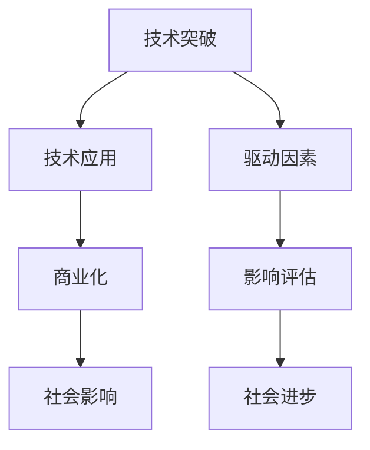

                 

# 科技创新：社会进步的阶梯

## 1. 背景介绍

### 1.1 问题由来

在当今快速发展的时代，科技创新的浪潮正在席卷全球。从互联网到人工智能，从生物技术到新能源，技术的不断进步深刻地影响着社会生活的方方面面。科技创新不仅改变了人们的工作方式，还促进了经济结构的调整，甚至引领了政治格局的变迁。然而，随着技术复杂性的增加，社会对科技创新的理解也变得更加模糊。科技创新真的如此高深莫测，遥不可及吗？本文将深入探讨科技创新的本质，以及其对社会进步的深远影响。

### 1.2 问题核心关键点

科技创新是推动社会进步的阶梯。科技创新不仅指的是技术突破本身，更包括技术应用、商业化、社会影响等综合过程。技术突破是科技创新的核心，而技术应用则是科技成果转化为实际效益的关键。商业化则是将技术应用推向市场的商业运作过程，社会影响则是最终的检验标准。

本文将重点关注以下几个方面：

- 技术突破的机制和驱动因素
- 技术应用的途径和商业模式
- 科技创新对社会进步的深远影响
- 科技创新的未来趋势和挑战

## 2. 核心概念与联系

### 2.1 核心概念概述

为更好地理解科技创新的本质，本节将介绍几个密切相关的核心概念：

- **技术突破**：指在某一领域实现重大技术进步的过程，通常伴随着原理性的新发现或新的工程技术。
- **技术应用**：将技术突破应用于实际问题的解决，形成新的产品和服务的创造过程。
- **商业化**：将技术应用推向市场的过程，包括技术转让、企业孵化、投融资等环节。
- **社会影响**：技术应用对社会结构、生活方式、就业环境等方面的影响。
- **驱动因素**：包括市场需求、政策导向、资本投入、科学研究等推动技术发展的关键力量。
- **影响评估**：对技术创新对社会各方面影响进行全面评估，以确定其对社会进步的贡献。

这些概念之间的逻辑关系可以通过以下Mermaid流程图来展示：



这个流程图展示的技术创新的核心概念及其之间的关系：

1. 技术突破在驱动因素的推动下实现。
2. 技术突破通过技术应用转化为实际效益。
3. 技术应用通过商业化进入市场。
4. 商业化过程中形成的社会影响接受影响评估。
5. 技术创新的最终目标是推动社会进步。

## 3. 核心算法原理 & 具体操作步骤
### 3.1 算法原理概述

科技创新涉及多个领域和环节，其算法原理复杂多样。本文将以技术突破为切入点，探讨技术创新的核心算法原理。

技术突破通常涉及科学研究和技术开发的结合。在科学研究中，通过对现有知识进行深度挖掘和综合创新，产生新的理论或模型。这些新理论和模型随后被应用于技术开发，形成新的技术解决方案。技术开发过程包括实验室验证、原型设计和工程化实施等环节。

技术应用则涉及将技术解决方案应用于实际问题解决的过程。这一过程通常包括需求分析、设计实现、测试优化等环节。商业化过程则进一步涉及市场推广、客户反馈、产品迭代等环节。

### 3.2 算法步骤详解

#### 3.2.1 技术突破阶段

**Step 1: 科学研究**：

- 收集现有知识和技术资料，进行文献综述和背景调研。
- 确定研究目标和问题，制定研究计划。
- 组织跨学科团队，进行理论推导和实验验证。

**Step 2: 技术开发**：

- 将研究成果转化为技术原型，进行实验室测试和优化。
- 通过工程化实施，形成最终的技术产品或解决方案。

#### 3.2.2 技术应用阶段

**Step 1: 需求分析**：

- 收集用户需求和市场反馈，进行问题建模和需求分析。
- 确定技术解决方案的应用场景和边界条件。

**Step 2: 设计实现**：

- 设计技术解决方案的架构和功能模块。
- 进行原型设计和代码实现，确保技术方案的可操作性和可靠性。

**Step 3: 测试优化**：

- 进行系统测试和性能评估，发现和解决潜在问题。
- 优化技术解决方案，提升用户体验和系统效率。

#### 3.2.3 商业化阶段

**Step 1: 市场推广**：

- 制定市场推广策略和方案，进行品牌建设和用户教育。
- 通过渠道营销、公关活动等方式扩大市场覆盖和用户认知。

**Step 2: 客户反馈**：

- 收集用户反馈和市场数据，进行需求分析和用户画像。
- 根据反馈不断优化产品和解决方案，提升用户满意度和市场竞争力。

**Step 3: 产品迭代**：

- 进行产品迭代和功能升级，保持市场领先地位。
- 持续进行技术创新和市场探索，发现新的增长点。

### 3.3 算法优缺点

**优点**：

1. **系统性**：科技创新过程涉及多个环节和学科，通过系统化的方法能够全面推进技术突破和应用。
2. **灵活性**：根据市场需求和技术发展，调整研究方向和商业策略，适应市场变化。
3. **持续性**：科技创新是一个长期过程，通过持续投入和迭代，不断提高技术水平和市场竞争力。

**缺点**：

1. **高成本**：技术研发和市场推广需要大量的资金和时间投入。
2. **高风险**：技术突破和市场应用存在不确定性，可能面临失败的风险。
3. **复杂性**：涉及多个环节和学科，需要跨学科合作和协同创新。

## 4. 数学模型和公式 & 详细讲解  
### 4.1 数学模型构建

本文将以技术突破为例，探讨其数学模型构建和公式推导过程。

假设技术突破涉及的变量为 $X$，驱动因素为 $F$，技术应用效果为 $Y$。则技术突破的数学模型可以表示为：

$$
Y = f(X, F)
$$

其中 $f$ 表示技术突破的函数关系，$X$ 和 $F$ 分别为自变量和因变量。

### 4.2 公式推导过程

**Step 1: 确定研究目标和问题**

假设研究目标是解决某一领域的问题 $Q$，则有：

$$
Q = X_{\text{question}}
$$

**Step 2: 收集数据和资料**

收集现有技术资料 $D_{\text{data}}$ 和研究数据 $D_{\text{study}}$，进行数据清洗和预处理：

$$
D_{\text{data}} = \{ d_{\text{data}}^i \}_{i=1}^N
$$
$$
D_{\text{study}} = \{ d_{\text{study}}^j \}_{j=1}^M
$$

**Step 3: 建立数学模型**

根据研究目标和问题，建立数学模型 $M$：

$$
M = \{ m_{\text{model}}^k \}_{k=1}^K
$$

**Step 4: 训练和验证模型**

使用训练数据 $D_{\text{train}}$ 训练模型，使用验证数据 $D_{\text{validate}}$ 验证模型性能：

$$
M^* = \mathop{\arg\min}_{M} \mathcal{L}(D_{\text{train}}, M)
$$
$$
\mathcal{L}(D_{\text{validate}}, M^*) = \frac{1}{N} \sum_{i=1}^N \| y_i - M(x_i) \|^2
$$

**Step 5: 应用和优化模型**

将训练好的模型 $M^*$ 应用于实际问题 $Q$，进行效果评估和优化：

$$
\text{Effect}(Q, M^*) = \frac{1}{N} \sum_{i=1}^N \text{score}(Q_i, M^*(x_i))
$$

### 4.3 案例分析与讲解

以深度学习技术为例，分析其技术突破和应用的全过程。

**Step 1: 科学研究**：

- 收集深度学习领域的研究论文和专利，进行文献综述。
- 确定研究目标和问题，如提高图像识别精度。
- 组织跨学科团队，进行算法推导和实验验证。

**Step 2: 技术开发**：

- 将研究成果转化为技术原型，如卷积神经网络。
- 进行实验室测试和优化，提升模型性能。
- 通过工程化实施，形成最终的技术产品或解决方案。

**Step 3: 技术应用**：

- 收集图像识别任务需求和数据，进行问题建模。
- 设计卷积神经网络架构，进行原型设计和代码实现。
- 进行系统测试和性能评估，发现和解决潜在问题。
- 优化网络结构和参数，提升识别精度。

**Step 4: 商业化**：

- 制定市场推广策略和方案，进行品牌建设和用户教育。
- 通过渠道营销、公关活动等方式扩大市场覆盖和用户认知。
- 收集用户反馈和市场数据，进行需求分析和用户画像。
- 根据反馈不断优化产品和解决方案，提升用户满意度和市场竞争力。

## 5. 项目实践：代码实例和详细解释说明
### 5.1 开发环境搭建

在进行技术突破和应用的实践前，我们需要准备好开发环境。以下是使用Python进行深度学习开发的环境配置流程：

1. 安装Anaconda：从官网下载并安装Anaconda，用于创建独立的Python环境。

2. 创建并激活虚拟环境：
```bash
conda create -n deep_learning_env python=3.8 
conda activate deep_learning_env
```

3. 安装深度学习框架：
```bash
conda install torch torchvision torchaudio 
```

4. 安装TensorFlow：
```bash
conda install tensorflow
```

5. 安装PyTorch：
```bash
conda install pytorch torchvision torchaudio
```

完成上述步骤后，即可在`deep_learning_env`环境中开始深度学习项目实践。

### 5.2 源代码详细实现

这里我们以卷积神经网络（CNN）为例，给出使用PyTorch进行图像识别任务开发的全过程。

首先，定义数据处理函数：

```python
import torch
from torchvision import transforms, datasets

# 定义数据预处理函数
transform = transforms.Compose([
    transforms.ToTensor(),
    transforms.Normalize([0.5], [0.5])
])
```

然后，定义模型和损失函数：

```python
from torch.nn import Conv2d, MaxPool2d, Linear, ReLU

class CNNModel(torch.nn.Module):
    def __init__(self):
        super(CNNModel, self).__init__()
        self.conv1 = Conv2d(3, 64, kernel_size=3, padding=1)
        self.pool1 = MaxPool2d(2, 2)
        self.conv2 = Conv2d(64, 128, kernel_size=3, padding=1)
        self.pool2 = MaxPool2d(2, 2)
        self.fc = Linear(128*8*8, 10)
        self.relu = ReLU()

    def forward(self, x):
        x = self.conv1(x)
        x = self.relu(x)
        x = self.pool1(x)
        x = self.conv2(x)
        x = self.relu(x)
        x = self.pool2(x)
        x = x.view(-1, 128*8*8)
        x = self.fc(x)
        return x

# 定义损失函数
criterion = torch.nn.CrossEntropyLoss()
```

接着，定义训练和评估函数：

```python
from torch.optim import SGD

def train_epoch(model, train_loader, optimizer):
    model.train()
    train_loss = 0
    for data, target in train_loader:
        optimizer.zero_grad()
        output = model(data)
        loss = criterion(output, target)
        train_loss += loss.item()
        loss.backward()
        optimizer.step()
    return train_loss / len(train_loader)

def evaluate(model, test_loader):
    model.eval()
    test_loss = 0
    correct = 0
    with torch.no_grad():
        for data, target in test_loader:
            output = model(data)
            test_loss += criterion(output, target).item()
            pred = output.argmax(dim=1, keepdim=True)
            correct += pred.eq(target.view_as(pred)).sum().item()
    return test_loss / len(test_loader), correct / len(test_loader.dataset)
```

最后，启动训练流程并在测试集上评估：

```python
from torch.utils.data import DataLoader

# 加载训练集和测试集数据
train_dataset = datasets.CIFAR10(root='./data', train=True, download=True, transform=transform)
test_dataset = datasets.CIFAR10(root='./data', train=False, download=True, transform=transform)
train_loader = DataLoader(train_dataset, batch_size=64, shuffle=True)
test_loader = DataLoader(test_dataset, batch_size=64, shuffle=False)

# 初始化模型和优化器
model = CNNModel()
optimizer = SGD(model.parameters(), lr=0.01, momentum=0.9)

# 训练模型
epochs = 10
for epoch in range(epochs):
    train_loss = train_epoch(model, train_loader, optimizer)
    test_loss, accuracy = evaluate(model, test_loader)
    print(f"Epoch {epoch+1}, train loss: {train_loss:.4f}, test loss: {test_loss:.4f}, accuracy: {accuracy:.4f}")
```

以上就是使用PyTorch进行图像识别任务开发的完整代码实现。可以看到，深度学习项目开发通常需要定义数据处理函数、模型和损失函数、训练和评估函数等多个组件，并通过系统化的流程逐步推进。

### 5.3 代码解读与分析

让我们再详细解读一下关键代码的实现细节：

**CNNModel类**：
- `__init__`方法：初始化卷积神经网络模型的组件，包括卷积层、池化层、全连接层和激活函数。
- `forward`方法：定义前向传播过程，从输入数据经过多层卷积和池化，最终输出预测结果。

**train_epoch函数**：
- 在训练过程中，定义了模型训练的基本流程，包括前向传播、损失计算、反向传播、参数更新等步骤。

**evaluate函数**：
- 在评估过程中，定义了模型评估的基本流程，包括前向传播、损失计算、精度计算等步骤。

**训练流程**：
- 通过循环迭代训练过程，在每个epoch内更新模型参数，同时在验证集上评估模型性能。

## 6. 实际应用场景

### 6.1 智慧医疗

深度学习在智慧医疗领域的应用，已经显著提升了疾病的诊断和治疗水平。通过深度学习模型对医学影像、电子病历、基因数据等大量医疗数据进行学习，能够快速准确地诊断疾病、制定治疗方案，甚至预测疾病发展趋势。

例如，深度学习模型可以通过分析医学影像数据，识别出肿瘤、病变等异常情况，辅助医生进行更精准的诊断。在药物研发方面，深度学习模型可以预测药物分子的活性、毒性等属性，加速新药的开发进程。

### 6.2 智能交通

智能交通系统是深度学习应用的另一个重要领域。通过深度学习模型，可以实现交通流量预测、事故预防、智能调度等功能。

例如，深度学习模型可以对实时交通数据进行分析和预测，优化交通信号灯控制，减少交通拥堵和事故发生。在自动驾驶领域，深度学习模型可以通过图像识别、路径规划等技术，实现车辆的自主导航和避障。

### 6.3 金融科技

金融科技领域深度学习的应用，已经大大提升了金融机构的运营效率和风险管理能力。通过深度学习模型对市场数据、交易数据等进行分析，可以实时监控市场动态，预测价格波动，进行风险预警。

例如，深度学习模型可以通过分析历史交易数据，预测股票价格走势，为投资者提供决策支持。在金融风控方面，深度学习模型可以识别异常交易行为，防止欺诈和洗钱等非法活动。

### 6.4 未来应用展望

随着深度学习技术的不断进步，其在各个领域的应用前景将更加广阔。未来，深度学习将在更多场景中发挥重要作用，推动社会的进步和发展。

在智慧医疗领域，深度学习将结合大数据、云计算等技术，构建更为智能化的医疗体系，提高医疗服务的质量和效率。

在智能交通领域，深度学习将与物联网、5G等技术结合，构建更为智能化的交通系统，提升城市的运行效率和安全性。

在金融科技领域，深度学习将与区块链、人工智能等技术结合，构建更为智能化的金融系统，提升金融服务的普惠性和便捷性。

此外，深度学习在教育、媒体、安防等领域的应用也将不断拓展，为社会带来更深远的影响。

## 7. 工具和资源推荐
### 7.1 学习资源推荐

为了帮助开发者系统掌握深度学习的理论基础和实践技巧，这里推荐一些优质的学习资源：

1. 《深度学习》（Deep Learning）书籍：Ian Goodfellow等人著作，全面介绍了深度学习的基本概念和算法原理。
2. 《动手学深度学习》（Dive into Deep Learning）：李沐等人著作，提供大量代码示例和实践案例，适合动手学习。
3. 《神经网络与深度学习》（Neural Networks and Deep Learning）：Michael Nielsen著作，以通俗易懂的方式介绍了深度学习的基本原理和应用。
4. CS231n《卷积神经网络》课程：斯坦福大学开设的深度学习课程，涵盖卷积神经网络、池化、激活函数等核心内容。
5. DeepLearning.AI深度学习系列课程：Andrew Ng等人主讲的深度学习课程，涵盖深度学习基础、卷积神经网络、生成对抗网络等内容。

通过对这些资源的学习实践，相信你一定能够快速掌握深度学习的精髓，并用于解决实际的工程问题。

### 7.2 开发工具推荐

高效的开发离不开优秀的工具支持。以下是几款用于深度学习开发的常用工具：

1. PyTorch：基于Python的开源深度学习框架，灵活动态的计算图，适合快速迭代研究。
2. TensorFlow：由Google主导开发的开源深度学习框架，生产部署方便，适合大规模工程应用。
3. Keras：高层次的深度学习框架，易于上手，适合快速原型开发。
4. Jupyter Notebook：交互式编程环境，支持多种语言，适合进行深度学习项目开发。
5. TensorBoard：TensorFlow配套的可视化工具，可实时监测模型训练状态，并提供丰富的图表呈现方式。

合理利用这些工具，可以显著提升深度学习项目开发效率，加快创新迭代的步伐。

### 7.3 相关论文推荐

深度学习的发展源于学界的持续研究。以下是几篇奠基性的相关论文，推荐阅读：

1. AlexNet：2012年ImageNet大规模视觉识别竞赛的冠军模型，开创了深度学习在计算机视觉领域的应用。
2. ResNet：深度残差网络，解决了深度神经网络训练过程中梯度消失的问题，显著提升了深度学习模型的训练深度。
3. InceptionNet：一种多层次、多分支的网络结构，通过并行计算提高了深度学习模型的效率。
4. YOLO：一种基于卷积神经网络的实时目标检测系统，具有高效、准确的特点。
5. GANs：生成对抗网络，通过两个对抗模型之间的竞争学习，生成高质量的伪造数据。

这些论文代表了大规模深度学习模型的发展脉络。通过学习这些前沿成果，可以帮助研究者把握学科前进方向，激发更多的创新灵感。

## 8. 总结：未来发展趋势与挑战

### 8.1 研究成果总结

本文对深度学习的技术突破、应用和未来发展进行了全面系统的介绍。首先探讨了深度学习的基本原理和数学模型构建过程，然后详细讲解了深度学习项目的开发流程，最后介绍了深度学习在多个领域的应用前景。

通过本文的系统梳理，可以看到，深度学习已经深入到社会生活的方方面面，极大地推动了社会的进步和发展。未来，深度学习将与其他前沿技术，如人工智能、物联网、5G等，进一步融合发展，共同构建更为智能化的未来社会。

### 8.2 未来发展趋势

展望未来，深度学习的发展趋势将呈现以下几个方向：

1. 技术不断突破：深度学习将继续在多个领域实现新的突破，推动科学研究和工程应用的发展。
2. 应用不断拓展：深度学习将在更多领域得到应用，提升各个行业的效率和竞争力。
3. 跨学科融合：深度学习将与其他学科和技术结合，构建更为智能化的综合系统。
4. 伦理和安全问题：深度学习应用中面临的伦理和安全问题将得到更多关注，研究和解决这些问题是未来的重要课题。
5. 算法透明性和可解释性：深度学习算法的透明性和可解释性将成为研究热点，提高算法的可信任度和可控性。

### 8.3 面临的挑战

尽管深度学习技术已经取得了瞩目成就，但在迈向更加智能化、普适化应用的过程中，它仍面临诸多挑战：

1. 数据稀缺和标注成本：深度学习模型需要大量的标注数据进行训练，但获取高质量标注数据的成本较高。
2. 模型复杂性和资源消耗：深度学习模型参数量大，计算复杂度高，对硬件资源要求较高。
3. 模型泛化性和鲁棒性：深度学习模型在不同场景下表现不稳定，容易过拟合，泛化性不足。
4. 模型可解释性和可控性：深度学习模型通常是"黑盒"系统，难以解释其内部工作机制和决策逻辑。
5. 模型公平性和透明性：深度学习模型在应用过程中可能存在偏见和歧视，导致不公平待遇。

### 8.4 研究展望

面对深度学习面临的挑战，未来的研究需要在以下几个方面寻求新的突破：

1. 提高模型泛化性和鲁棒性：通过引入正则化技术、对抗训练等方法，提高深度学习模型的泛化能力和鲁棒性。
2. 降低模型复杂性和资源消耗：通过模型压缩、稀疏化等方法，减小深度学习模型的计算复杂度和资源消耗。
3. 提升模型可解释性和可控性：通过可解释模型、公平性分析等方法，提升深度学习模型的透明性和可控性。
4. 解决模型公平性和透明性问题：通过算法透明性、公平性分析等方法，解决深度学习模型在应用过程中可能存在的偏见和歧视问题。
5. 探索无监督学习和半监督学习：通过无监督学习、半监督学习等方法，减少深度学习模型对标注数据的依赖，提高模型的泛化能力。

这些研究方向将推动深度学习技术的不断发展，为构建智能化的未来社会提供坚实基础。

## 9. 附录：常见问题与解答

**Q1: 深度学习是否适用于所有领域？**

A: 深度学习已经广泛应用在计算机视觉、自然语言处理、语音识别、推荐系统等多个领域，并且在不断拓展新的应用场景。然而，深度学习并不是万能的，对于一些需要精确逻辑推理和数学建模的任务，如金融预测、电路设计等，深度学习可能不是最佳选择。

**Q2: 深度学习模型是否总是过拟合？**

A: 深度学习模型存在过拟合的风险，但并非总是如此。通过正则化技术、对抗训练等方法，可以显著降低过拟合风险，提高模型的泛化能力。此外，合理选择模型结构和数据分布，也可以减少过拟合风险。

**Q3: 深度学习模型是否易于解释？**

A: 深度学习模型通常是"黑盒"系统，难以解释其内部工作机制和决策逻辑。为了解决这一问题，研究者正在探索可解释模型的设计和公平性分析方法，提升深度学习模型的透明性和可控性。

**Q4: 深度学习模型是否存在偏见和歧视？**

A: 深度学习模型可能存在偏见和歧视，导致不公平待遇。为了解决这一问题，研究者正在探索公平性分析、透明性模型等方法，提高深度学习模型的公平性和透明性。

**Q5: 深度学习是否容易过拟合？**

A: 深度学习模型存在过拟合的风险，但并非总是如此。通过正则化技术、对抗训练等方法，可以显著降低过拟合风险，提高模型的泛化能力。此外，合理选择模型结构和数据分布，也可以减少过拟合风险。

---

作者：禅与计算机程序设计艺术 / Zen and the Art of Computer Programming

