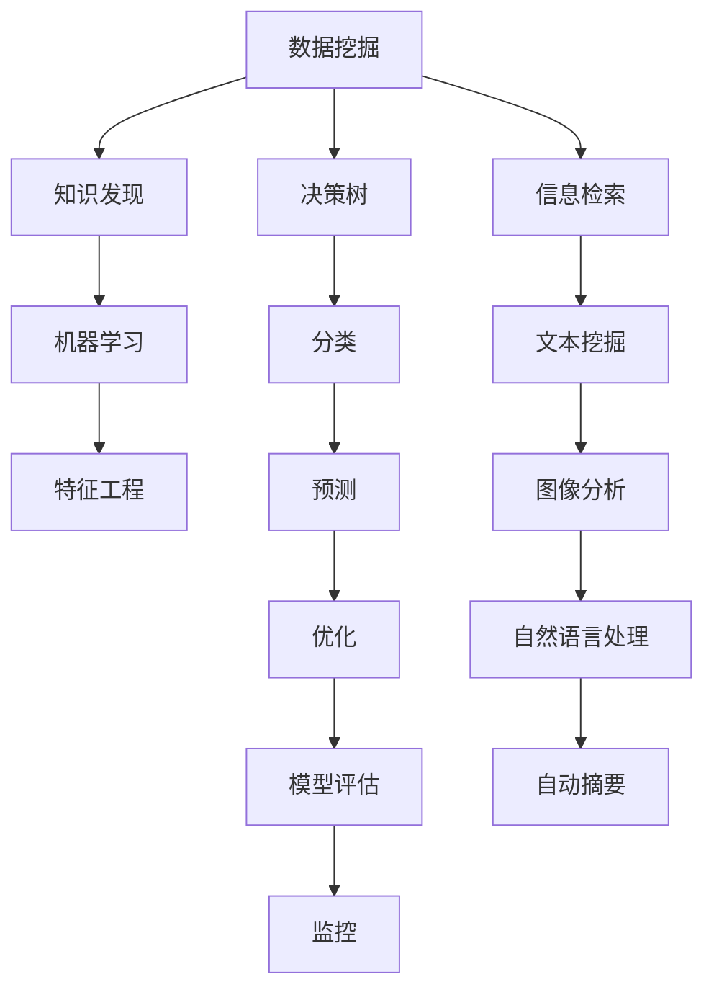

                 

# 程序员利用知识发现引擎提高决策能力的途径

> 关键词：知识发现引擎,决策树,信息检索,机器学习,特征工程

## 1. 背景介绍

在当今的信息时代，数据和信息充斥着我们的生活和工作，然而，数据本身并没有太多的价值，只有当我们利用算法和工具从数据中挖掘出有用的信息时，数据才能转变成有价值的知识。这也就是为什么知识发现（Knowledge Discovery）在数据科学和人工智能领域如此重要。程序员利用知识发现引擎，可以大幅提升决策能力，更好地理解和分析数据，从而在项目开发和产品设计中做出更加明智的决策。

### 1.1 问题由来

在实际编程中，我们经常需要从大量数据中找出关键信息，帮助我们在选择、预测和优化时做出正确的决策。传统的SQL查询、数据可视化等方式虽然有效，但存在明显的局限性，如查询效率低、结果解释性差、难以处理非结构化数据等。知识发现引擎（Knowledge Discovery Engine）的提出，为解决这些问题提供了新的方法，能够自动从数据中提取有用信息，并且以图表、报告等形式呈现，使程序员更加直观地理解数据。

### 1.2 问题核心关键点

知识发现引擎的核心在于数据挖掘和知识提取。其原理是通过对数据的分析、比较和统计，发现隐藏在数据背后的模式、规律和关联，从而帮助程序员提升决策能力。其核心关键点包括：

- 数据处理：对原始数据进行清洗、去重、归一化等预处理，保证数据的质量。
- 数据挖掘：利用机器学习、统计学等方法从数据中提取模式和规律。
- 知识提取：将挖掘出的模式和规律转换成对程序员有用的知识，如决策树、关联规则等。

## 2. 核心概念与联系

### 2.1 核心概念概述

为了更好地理解知识发现引擎的工作原理，本节将介绍几个密切相关的核心概念：

- 数据挖掘（Data Mining）：从大量数据中提取出有用信息和模式的过程。
- 知识发现（Knowledge Discovery）：通过数据挖掘，将数据转换成对决策有用的知识。
- 决策树（Decision Tree）：一种基于树形结构的分类和预测模型。
- 信息检索（Information Retrieval）：从大量文本、图像等非结构化数据中检索出相关信息。
- 机器学习（Machine Learning）：使机器能够从数据中学习规律和模式的技术。

这些核心概念之间的逻辑关系可以通过以下Mermaid流程图来展示：



这个流程图展示的知识发现引擎的核心概念及其之间的关系：

1. 数据挖掘是知识发现的起点，其核心任务是发现数据中的模式和规律。
2. 机器学习与特征工程是实现数据挖掘的主要手段。
3. 决策树和信息检索是知识发现的主要模型，用于分类、预测和检索。
4. 分类和预测模型通过对数据进行分类和预测，提取有用的知识。
5. 自动摘要和模型评估通过对知识进行提炼和评估，帮助程序员更好地理解数据。

## 3. 核心算法原理 & 具体操作步骤

### 3.1 算法原理概述

知识发现引擎的工作原理主要包括数据预处理、特征工程、模型训练和结果评估四个步骤。其核心算法原理是机器学习和统计学，通过学习数据中的模式和规律，发现隐藏在数据背后的有用信息。

**数据预处理**：对原始数据进行清洗、去重、归一化等预处理，保证数据的质量。

**特征工程**：对数据进行特征选择和特征提取，将原始数据转换成更有用的特征表示。

**模型训练**：利用机器学习算法训练分类、预测或回归模型，学习数据中的模式和规律。

**结果评估**：对训练好的模型进行评估，验证其准确性和泛化能力。

### 3.2 算法步骤详解

知识发现引擎的具体操作步骤如下：

**Step 1: 数据准备**
- 收集数据集，包括结构化数据和非结构化数据。
- 对数据进行预处理，包括去重、归一化、缺失值处理等。
- 将数据转换成可供机器学习模型使用的格式，如CSV、JSON等。

**Step 2: 特征工程**
- 对数据进行特征选择，如选择最相关的特征。
- 对特征进行提取和转换，如计算平均值、标准差、相关性等。
- 对数据进行编码，如将文本数据转换成数值型数据。

**Step 3: 模型训练**
- 选择合适的机器学习算法，如决策树、随机森林、支持向量机等。
- 训练模型，调整超参数以优化模型性能。
- 对模型进行交叉验证，评估模型泛化能力。

**Step 4: 结果评估**
- 对训练好的模型进行测试，评估模型准确率和召回率。
- 绘制混淆矩阵、ROC曲线等评估指标。
- 根据评估结果调整模型，提升性能。

### 3.3 算法优缺点

知识发现引擎具有以下优点：

- 自动化：数据挖掘和特征工程等步骤可以自动化完成，减少人工干预。
- 高效性：可以快速从大量数据中提取有用信息，提升决策效率。
- 可解释性：结果以图表、报告等形式呈现，易于理解。

同时，该方法也存在一些缺点：

- 对数据质量依赖大：数据质量差会导致挖掘出的信息失真。
- 算法复杂：需要掌握机器学习、统计学等知识。
- 结果解释性差：有些算法生成的结果难以理解。

### 3.4 算法应用领域

知识发现引擎已经在多个领域得到了应用，例如：

- 金融风控：通过分析客户交易数据，预测违约风险。
- 医疗诊断：通过分析患者病历数据，诊断疾病。
- 市场营销：通过分析客户行为数据，预测购买意向。
- 供应链管理：通过分析供应商和客户数据，优化供应链。
- 社交网络分析：通过分析用户互动数据，发现潜在关系。

## 4. 数学模型和公式 & 详细讲解 & 举例说明

### 4.1 数学模型构建

本节将使用数学语言对知识发现引擎的工作原理进行更加严格的刻画。

设数据集为 $D=\{(x_i, y_i)\}_{i=1}^N$，其中 $x_i$ 为输入特征，$y_i$ 为输出标签。

定义模型 $f: \mathcal{X} \rightarrow \mathcal{Y}$，其中 $\mathcal{X}$ 为输入特征空间，$\mathcal{Y}$ 为输出标签空间。

知识发现引擎的数学模型为：

$$
\min_{f} \frac{1}{N} \sum_{i=1}^N \ell(f(x_i), y_i) + \lambda R(f)
$$

其中 $\ell$ 为损失函数，$R$ 为正则函数，$\lambda$ 为正则化系数。

### 4.2 公式推导过程

以下我们以决策树为例，推导其训练和预测过程的数学公式。

假设数据集 $D$ 包含 $N$ 个样本，每个样本有 $d$ 个特征。决策树的训练过程可以表示为：

1. 选择最佳划分特征 $x_k$ 和划分阈值 $\theta_k$。
2. 根据 $x_k$ 和 $\theta_k$ 将数据集划分为 $C_1$ 和 $C_2$ 两个子集。
3. 对 $C_1$ 和 $C_2$ 递归进行步骤1和步骤2，直到满足停止条件。

设决策树节点 $t$ 的输出为 $f_t(x)$，节点 $t$ 的误差为 $L_t$，则决策树的预测过程为：

$$
f_{tree}(x) = \min_{t \in T} \{ f_t(x) \mid f_t(x) \neq f_{tree}(x) \}
$$

其中 $T$ 为决策树的节点集。

### 4.3 案例分析与讲解

以金融风控为例，分析知识发现引擎的应用。

**Step 1: 数据准备**
- 收集客户交易数据，包括交易金额、时间、地点等信息。
- 对数据进行清洗、去重、归一化等预处理。

**Step 2: 特征工程**
- 选择与违约风险相关的特征，如交易金额、时间间隔等。
- 对特征进行编码，如将文本数据转换成数值型数据。

**Step 3: 模型训练**
- 选择决策树算法，如CART。
- 训练决策树，调整超参数以优化模型性能。

**Step 4: 结果评估**
- 对训练好的决策树进行测试，评估模型准确率和召回率。
- 绘制混淆矩阵、ROC曲线等评估指标。

最终，利用训练好的决策树模型对新客户进行风险评估，从而提高风控效果。

## 5. 项目实践：代码实例和详细解释说明

### 5.1 开发环境搭建

在进行知识发现引擎的实践前，我们需要准备好开发环境。以下是使用Python进行Scikit-learn开发的环境配置流程：

1. 安装Anaconda：从官网下载并安装Anaconda，用于创建独立的Python环境。

2. 创建并激活虚拟环境：
```bash
conda create -n sklearn-env python=3.8 
conda activate sklearn-env
```

3. 安装Scikit-learn：
```bash
pip install scikit-learn
```

4. 安装各类工具包：
```bash
pip install numpy pandas matplotlib seaborn jupyter notebook ipython
```

完成上述步骤后，即可在`sklearn-env`环境中开始知识发现引擎的实践。

### 5.2 源代码详细实现

这里以金融风控数据为例，给出使用Scikit-learn构建决策树的完整代码实现。

```python
from sklearn.datasets import load_boston
from sklearn.model_selection import train_test_split
from sklearn.ensemble import DecisionTreeClassifier
from sklearn.metrics import accuracy_score
from sklearn.model_selection import cross_val_score
import pandas as pd
import matplotlib.pyplot as plt

# 加载数据
data = load_boston()
X = pd.DataFrame(data.data, columns=data.feature_names)
y = pd.Series(data.target, name='target')

# 数据分割
X_train, X_test, y_train, y_test = train_test_split(X, y, test_size=0.2, random_state=42)

# 训练模型
clf = DecisionTreeClassifier(max_depth=3)
clf.fit(X_train, y_train)

# 测试模型
y_pred = clf.predict(X_test)
accuracy = accuracy_score(y_test, y_pred)
print(f"Accuracy: {accuracy:.2f}")

# 交叉验证
scores = cross_val_score(clf, X, y, cv=5)
print(f"Cross-validation scores: {scores}")
```

以上代码实现了使用Scikit-learn构建决策树模型的过程，包括数据加载、预处理、模型训练和评估。

### 5.3 代码解读与分析

让我们再详细解读一下关键代码的实现细节：

**load_boston函数**：
- 用于加载波士顿房价数据集，包含506个样本和13个特征。

**train_test_split函数**：
- 将数据集划分为训练集和测试集，比例为80%:20%，并设置随机种子以保证可复现。

**DecisionTreeClassifier类**：
- 用于创建决策树分类器，指定最大深度为3。

**accuracy_score函数**：
- 计算预测结果与真实标签的准确率。

**cross_val_score函数**：
- 对模型进行交叉验证，计算5折交叉验证的平均分数。

**训练流程**：
- 加载波士顿房价数据集，进行数据预处理。
- 使用train_test_split函数划分训练集和测试集。
- 创建决策树分类器，并使用fit方法训练模型。
- 使用predict方法对测试集进行预测，并计算准确率。
- 使用cross_val_score函数进行交叉验证，评估模型泛化能力。

**测试流程**：
- 在测试集上对模型进行评估，打印出准确率和交叉验证分数。

可以看到，Scikit-learn使得知识发现引擎的代码实现变得简洁高效。开发者可以将更多精力放在数据处理、模型改进等高层逻辑上，而不必过多关注底层的实现细节。

当然，工业级的系统实现还需考虑更多因素，如模型的保存和部署、超参数的自动搜索、更灵活的任务适配层等。但核心的知识发现引擎范式基本与此类似。

## 6. 实际应用场景

### 6.1 金融风控

金融风控是知识发现引擎的重要应用领域之一。传统风控依赖人工审核和规则匹配，耗时长、成本高。而知识发现引擎可以通过分析客户行为数据，预测违约风险，提高风控效率和效果。

在具体实现中，知识发现引擎可以在客户交易数据上挖掘出高风险特征，如异常交易、频繁变更银行等，并结合外部数据（如社交网络信息、公共记录等）进行综合评估，从而对客户进行分级，实现精准风控。

### 6.2 医疗诊断

医疗诊断也是知识发现引擎的重要应用场景。传统诊断依赖专家经验和历史数据，难以普及。而知识发现引擎可以通过分析病历数据，挖掘出疾病征兆，帮助医生进行初步诊断。

在具体实现中，知识发现引擎可以在病历数据中提取特征，如症状描述、检测结果等，并结合先验知识（如疾病数据库）进行分类预测，从而提高诊断准确率。

### 6.3 市场营销

市场营销领域也存在大量数据需要挖掘。传统方法依赖人工分析，效率低、效果差。而知识发现引擎可以通过分析客户行为数据，预测购买意向，优化营销策略。

在具体实现中，知识发现引擎可以在客户行为数据中挖掘出潜在客户，并结合外部数据（如社交网络信息、购买记录等）进行综合分析，从而制定个性化营销方案，提升营销效果。

### 6.4 供应链管理

供应链管理也需要对大量数据进行分析和挖掘。传统方法依赖人工分析，难以实时调整策略。而知识发现引擎可以通过分析供应商和客户数据，优化供应链管理。

在具体实现中，知识发现引擎可以在供应商和客户数据中挖掘出关键特征，如供货周期、库存量等，并结合实时数据（如天气、物流信息等）进行综合评估，从而优化供应链策略，提高效率和稳定性。

## 7. 工具和资源推荐

### 7.1 学习资源推荐

为了帮助开发者系统掌握知识发现引擎的理论基础和实践技巧，这里推荐一些优质的学习资源：

1. 《Python数据科学手册》系列博文：由数据科学大师撰写，深入浅出地介绍了数据科学的基本概念和实现方法，涵盖机器学习、数据挖掘、特征工程等主题。

2. 《机器学习实战》书籍：由机器学习专家撰写，介绍了多种机器学习算法及其应用场景，适合实战练习。

3. 《Scikit-learn用户指南》文档：Scikit-learn官方文档，提供了丰富的算法介绍、样例代码和实践指南，是学习的必备资料。

4. Coursera《数据科学与机器学习》课程：由斯坦福大学和哈佛大学等名校开设，涵盖数据科学和机器学习的基本知识，有Lecture视频和配套作业，适合系统学习。

5. Kaggle竞赛平台：全球最大的数据科学竞赛平台，提供了大量数据集和实际应用场景，是实战练习的好去处。

通过对这些资源的学习实践，相信你一定能够快速掌握知识发现引擎的精髓，并用于解决实际的NLP问题。

### 7.2 开发工具推荐

高效的开发离不开优秀的工具支持。以下是几款用于知识发现引擎开发的常用工具：

1. Jupyter Notebook：免费的在线交互式编程环境，支持代码块的实时执行和结果展示。

2. Scikit-learn：基于Python的数据科学库，提供丰富的机器学习算法和数据预处理功能，易于上手。

3. Weights & Biases：模型训练的实验跟踪工具，可以记录和可视化模型训练过程中的各项指标，方便对比和调优。

4. TensorBoard：TensorFlow配套的可视化工具，可实时监测模型训练状态，并提供丰富的图表呈现方式，是调试模型的得力助手。

5. Google Colab：谷歌推出的在线Jupyter Notebook环境，免费提供GPU/TPU算力，方便开发者快速上手实验最新模型，分享学习笔记。

合理利用这些工具，可以显著提升知识发现引擎的开发效率，加快创新迭代的步伐。

### 7.3 相关论文推荐

知识发现引擎的发展源于学界的持续研究。以下是几篇奠基性的相关论文，推荐阅读：

1. "A Survey of Data Mining Techniques" by C.F. Weston：一篇综述性论文，总结了数据挖掘的主要方法，包括分类、聚类、关联规则等。

2. "Decision Trees and Random Forests" by L. Breiman：介绍了决策树和随机森林的基本概念和实现方法，是机器学习领域的重要基础。

3. "Knowledge Discovery and Data Mining" by A. U. Roy：一本经典教材，系统介绍了数据挖掘和知识发现的理论基础和实际应用。

4. "Feature Engineering for High-Quality Data Mining" by G. Almeida：介绍了特征选择和特征工程的方法，是数据科学中的重要话题。

这些论文代表了大数据发现引擎的发展脉络。通过学习这些前沿成果，可以帮助研究者把握学科前进方向，激发更多的创新灵感。

## 8. 总结：未来发展趋势与挑战

### 8.1 总结

本文对知识发现引擎的理论基础和实践方法进行了全面系统的介绍。首先阐述了知识发现引擎的核心概念和工作原理，明确了其在数据科学和人工智能领域的重要地位。其次，从原理到实践，详细讲解了知识发现引擎的数学模型和操作步骤，给出了具体的代码实例。同时，本文还广泛探讨了知识发现引擎在金融风控、医疗诊断、市场营销等多个领域的应用前景，展示了知识发现引擎的巨大潜力。此外，本文精选了知识发现引擎的各类学习资源，力求为读者提供全方位的技术指引。

通过本文的系统梳理，可以看到，知识发现引擎是数据科学和人工智能领域的重要工具，能够大幅提升决策效率和效果。未来，伴随数据规模的持续增长和算法技术的不断进步，知识发现引擎必将在更多领域得到广泛应用，为各行各业带来深刻变革。

### 8.2 未来发展趋势

展望未来，知识发现引擎将呈现以下几个发展趋势：

1. 算法多样化：未来的知识发现引擎将融合多种算法，如决策树、神经网络、贝叶斯网络等，提升模型的准确性和泛化能力。

2. 实时化：知识发现引擎需要支持实时数据流处理，快速响应新的数据变化，提升决策的时效性。

3. 自动化：未来的知识发现引擎将进一步自动化，无需人工干预，自动从数据中挖掘出有用信息。

4. 可解释性：知识发现引擎需要增强结果的可解释性，方便用户理解和使用。

5. 多模态数据融合：知识发现引擎将支持多模态数据的融合，提升对复杂数据的处理能力。

6. 智能决策支持：未来的知识发现引擎将与专家系统、自然语言处理等技术结合，提供智能决策支持。

以上趋势凸显了知识发现引擎的发展前景，这些方向的探索发展，必将进一步提升数据挖掘和知识发现的效率，推动数据科学和人工智能技术的应用落地。

### 8.3 面临的挑战

尽管知识发现引擎已经取得了瞩目成就，但在迈向更加智能化、普适化应用的过程中，它仍面临诸多挑战：

1. 对数据质量依赖大：数据质量差会导致挖掘出的信息失真，影响决策效果。

2. 算法复杂：知识发现引擎需要掌握机器学习、统计学等知识，有一定学习门槛。

3. 结果解释性差：有些算法生成的结果难以理解，需要进一步解释。

4. 实时性不足：传统的知识发现引擎在处理大规模数据流时，可能存在延迟。

5. 多模态数据处理难度大：多模态数据的融合需要复杂的技术手段。

6. 智能决策支持不足：知识发现引擎需要与专家系统、自然语言处理等技术结合，才能真正实现智能决策支持。

7. 数据隐私和安全：知识发现引擎需要保护用户数据隐私和安全，防止数据泄露和滥用。

这些挑战需要我们在算法、技术和应用层面不断突破和创新，才能使知识发现引擎在更广泛的应用场景中发挥更大作用。

### 8.4 研究展望

面对知识发现引擎所面临的诸多挑战，未来的研究需要在以下几个方面寻求新的突破：

1. 数据预处理技术：开发更高效、更准确的数据预处理算法，提升数据质量。

2. 智能算法：研究更加智能、高效的算法，提升知识发现引擎的准确性和实时性。

3. 自动化技术：开发自动化知识发现引擎，减少人工干预，提高效率。

4. 多模态数据融合技术：研究多模态数据的融合算法，提升知识发现引擎对复杂数据的处理能力。

5. 智能决策支持技术：结合专家系统和自然语言处理技术，提升知识发现引擎的智能决策支持能力。

6. 数据隐私和安全技术：研究数据隐私和安全保护技术，防止数据泄露和滥用。

这些研究方向需要跨学科、跨领域的协同合作，才能使知识发现引擎在实际应用中发挥更大的价值。相信随着技术的不断进步，知识发现引擎必将在更广泛的应用场景中发挥更大的作用，为各行各业带来深刻的变革。

## 9. 附录：常见问题与解答

**Q1：知识发现引擎是否适用于所有数据类型？**

A: 知识发现引擎主要适用于结构化数据，如表格、时间序列等。对于非结构化数据，如文本、图像等，可以结合信息检索、自然语言处理等技术进行预处理。对于多模态数据，如文本+图像，可以采用深度学习模型进行融合。

**Q2：如何选择合适的特征？**

A: 特征选择是知识发现引擎的关键步骤，一般可以使用相关性分析、卡方检验、信息增益等方法进行选择。对于高维数据，可以使用特征降维方法，如PCA、LDA等，提高特征的代表性。

**Q3：知识发现引擎在实际应用中需要注意哪些问题？**

A: 在实际应用中，知识发现引擎需要考虑以下问题：

1. 数据预处理：对原始数据进行清洗、去重、归一化等预处理，保证数据的质量。
2. 特征工程：对数据进行特征选择和特征提取，将原始数据转换成更有用的特征表示。
3. 模型训练：选择合适的机器学习算法，训练模型，调整超参数以优化模型性能。
4. 结果评估：对训练好的模型进行评估，验证其准确性和泛化能力。

**Q4：知识发现引擎如何与自然语言处理结合？**

A: 知识发现引擎可以与自然语言处理技术结合，实现对文本数据的分析和挖掘。具体步骤包括：

1. 文本预处理：对文本进行清洗、分词、词性标注等预处理。
2. 特征提取：对文本进行向量化，提取文本特征。
3. 模型训练：训练机器学习模型，学习文本中的模式和规律。
4. 结果评估：对训练好的模型进行评估，验证其准确性和泛化能力。

最终，知识发现引擎可以输出对文本的分类、情感分析、实体识别等结果，帮助解决实际问题。

---

作者：禅与计算机程序设计艺术 / Zen and the Art of Computer Programming

