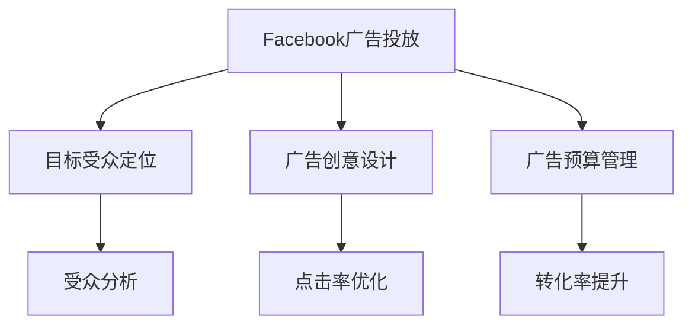

                 

# 程序员如何利用Facebook广告投放知识产品

在数字化时代，程序员如何高效利用Facebook广告投放产品，精准营销推广自己的知识产品，成为许多开发者的重要课题。本文将深入探讨Facebook广告投放的核心概念与原理，并提供实用的操作技巧和实战案例，帮助程序员更高效地运用这些知识产品，最大化自己的收益。

## 1. 背景介绍

Facebook广告投放（Facebook Advertising）是Facebook提供的一种在线广告投放服务，允许广告主根据特定的目标受众群体，投放定制化的广告内容。通过精准的定位和定向，广告主可以最大化广告效果，获得更多的用户流量和转化率。

在Facebook广告投放中，知识产品（如技术博客、编程课程、开发工具等）的推广，尤其受到程序员的青睐。良好的广告投放策略不仅可以帮助程序员扩大知识产品的受众范围，提升知名度，还能带来更多的商业机会和收益。

## 2. 核心概念与联系

### 2.1 核心概念概述

为更好地理解Facebook广告投放，本文将介绍几个关键概念：

- **Facebook广告投放**：通过Facebook平台，广告主可以定向推送广告内容，根据目标受众的特点进行广告创意和投放策略的优化，以实现最佳广告效果。
- **目标受众定位**：通过Facebook的广告定向工具，广告主可以根据用户的兴趣、行为、人口统计信息等进行精准定位，确保广告内容对目标受众具有最大的吸引力。
- **广告创意设计**：广告创意包括图像、视频、文字等元素，设计良好的广告创意能够吸引用户的注意力，提高广告点击率和转化率。
- **广告预算管理**：合理分配广告预算，可以最大化广告投放效果。常见的预算管理策略包括每日预算、总预算和竞价（如自动出价、手动出价）等。

这些概念之间的逻辑关系可以通过以下Mermaid流程图来展示：



这个流程图展示了大语言模型的核心概念及其之间的关系：

1. 广告投放从目标受众定位开始，利用Facebook的广告定向工具对受众进行精准划分。
2. 广告创意设计直接影响广告的吸引力和点击率，设计良好的广告能够获得更多用户点击。
3. 广告预算管理根据实际投放效果进行动态调整，确保广告投放成本和效果之间的最佳平衡。
4. 点击率和转化率是衡量广告效果的重要指标，通过优化广告创意和预算管理，可以提高广告的总体效果。

## 3. 核心算法原理 & 具体操作步骤

### 3.1 算法原理概述

Facebook广告投放的核心算法主要基于机器学习和数据挖掘技术，通过分析用户数据，预测不同广告创意对不同受众群体的效果，从而实现更精准的广告投放。以下是广告投放的主要算法原理：

1. **点击率预测**：通过分析历史广告数据，预测不同广告创意的点击率。点击率高的广告将获得更多的展示机会，以最大化广告效果。
2. **转化率优化**：在点击率预测的基础上，进一步优化广告创意，提升转化率。广告主可以根据实际业务目标，调整广告内容，提高用户转化率。
3. **受众定向**：根据用户的行为数据、兴趣标签和人口统计信息等，进行受众定向，确保广告内容对目标受众具有最大的吸引力。
4. **广告预算分配**：通过实时分析广告效果，动态调整广告预算，确保广告投放的性价比最大化。

### 3.2 算法步骤详解

基于Facebook广告投放的算法原理，本文将详细介绍广告投放的具体操作步骤：

1. **创建广告账户**：在Facebook广告管理平台上创建新的广告账户，并绑定目标受众数据。
2. **选择广告类型**：根据知识产品的特点，选择合适的广告类型，如图像广告、视频广告、轮播广告等。
3. **设计广告创意**：制作吸引人的广告创意，包括图像、视频、文字等元素，确保创意与知识产品内容高度相关。
4. **设定广告预算**：根据广告主预算和投放目标，设定每日预算、总预算和竞价策略，合理分配广告预算。
5. **受众定向设置**：使用Facebook的广告定向工具，根据用户兴趣、行为和人口统计信息等进行受众定向。
6. **投放测试与优化**：进行广告投放测试，根据点击率和转化率等指标调整广告创意和受众定向策略，持续优化广告效果。

### 3.3 算法优缺点

Facebook广告投放的优点在于：

- **精准定位**：通过精准的受众定向，确保广告内容对目标受众具有最大的吸引力。
- **效果可控**：广告主可以根据实际效果进行动态调整，确保广告投放的性价比最大化。
- **灵活性高**：支持多种广告类型和创意设计，满足不同知识产品的推广需求。

然而，Facebook广告投放也存在一些局限性：

- **数据隐私问题**：广告主需要获取和处理用户数据，涉及隐私保护问题，需遵守相关法律法规。
- **广告投放成本**：高竞争的互联网广告市场可能导致广告成本上升，需合理管理预算。
- **算法依赖**：算法优化效果受用户数据和广告创意质量影响较大，需持续优化广告策略。

### 3.4 算法应用领域

Facebook广告投放的应用领域非常广泛，包括：

- **编程课程推广**：面向程序员和开发人员，推广各类编程课程，提升课程知名度和报名率。
- **技术博客和社区运营**：推广技术博客和开发者社区，吸引更多开发者关注和参与，提高社区活跃度。
- **开发工具和框架推广**：推广各种开发工具和框架，提升其在开发者中的知名度和接受度。
- **开源项目和代码贡献**：推广开源项目和代码贡献活动，吸引开发者参与，提升项目的知名度和影响力。

## 4. 数学模型和公式 & 详细讲解 & 举例说明

### 4.1 数学模型构建

在Facebook广告投放中，常用的数学模型包括点击率预测模型、转化率预测模型和受众定向模型等。以点击率预测模型为例，其基本数学模型如下：

$$
P(Click|Ad)=\frac{P(Click|Ad,A)}{P(Click|A)}
$$

其中，$P(Click|Ad)$表示用户点击广告的概率，$P(Click|Ad,A)$表示用户点击广告且属于目标受众的概率，$P(Click|A)$表示用户点击广告的概率。

### 4.2 公式推导过程

点击率预测模型的推导基于贝叶斯公式，通过分析用户的历史行为数据，预测不同广告创意对不同受众群体的效果。具体推导过程如下：

1. 用户点击广告的概率 $P(Click|A)$ 可表示为：

$$
P(Click|A) = \sum_{i=1}^n P(Click|A_i)P(A_i)
$$

其中，$P(A_i)$表示用户属于第$i$个受众群体的概率。

2. 用户点击广告且属于目标受众的概率 $P(Click|Ad,A)$ 可表示为：

$$
P(Click|Ad,A) = \sum_{j=1}^m P(Click|Ad,A_j)P(A_j)
$$

其中，$P(A_j)$表示用户属于第$j$个广告创意且属于目标受众的概率。

3. 用户点击广告的概率 $P(Click|Ad)$ 可表示为：

$$
P(Click|Ad) = \frac{\sum_{i=1}^n P(Click|A_i)P(A_i) \sum_{j=1}^m P(Click|Ad,A_j)P(A_j)}{\sum_{i=1}^n P(A_i) \sum_{j=1}^m P(A_j)}
$$

通过上述推导，广告投放算法可以根据历史数据，预测不同广告创意对不同受众群体的效果，从而进行精准的广告投放。

### 4.3 案例分析与讲解

假设某编程课程推广活动需要在Facebook上进行广告投放，广告创意包含一个吸引人的课程海报和一个简短介绍。投放的受众群体包括正在学习编程的大学生和职业程序员。

1. **受众定向**：
   - 用户兴趣标签：计算机科学、软件开发、编程语言等
   - 用户行为数据：浏览过编程课程网站、购买过编程书籍、参加过编程社区活动等
   - 人口统计信息：年龄、性别、地区等

2. **广告创意设计**：
   - 课程海报：展示课程亮点、师资力量、学员反馈等
   - 简短介绍：介绍课程内容、学习方式、预期收益等

3. **广告预算管理**：
   - 每日预算：设定每日广告投放预算，如$1000
   - 总预算：设定总广告投放预算，如$10000
   - 竞价策略：使用自动出价策略，根据广告效果自动调整出价，确保广告投放效果

4. **投放测试与优化**：
   - 投放初期，随机选择部分受众进行广告投放，根据点击率和转化率等指标调整广告创意和受众定向策略
   - 优化广告创意：根据实际效果，调整海报和简短介绍的内容，提高广告点击率
   - 调整受众定向：根据实际效果，调整受众定向的兴趣标签和行为数据，提高广告的精准度

通过上述操作，广告主可以根据实际效果不断优化广告投放策略，提升广告的点击率和转化率，最大化广告投放效果。

## 5. 项目实践：代码实例和详细解释说明

### 5.1 开发环境搭建

在开始广告投放之前，需要搭建广告投放的开发环境，以下是步骤：

1. **创建广告账户**：在Facebook广告管理平台上创建新的广告账户，并绑定目标受众数据。
2. **安装广告投放工具**：安装Facebook广告管理平台提供的广告投放工具，如Facebook Ads Manager。
3. **配置广告预算**：根据实际投放预算，配置每日预算、总预算和竞价策略。
4. **准备广告创意**：设计吸引人的广告创意，包括图像、视频、文字等元素。

### 5.2 源代码详细实现

以下是使用Python编写的Facebook广告投放代码示例：

```python
from FacebookAdsLib import FacebookAdsLib

# 创建广告账户对象
account = FacebookAdsLib(ad_set_name='programming_course', access_token='your_access_token')
account.init(ad_set_name='programming_course')

# 选择广告类型
ad_type = 'IMAGE'

# 设计广告创意
ad_images = ['path/to/image1.jpg', 'path/to/image2.jpg']
ad_text = '免费参加编程课程，提升技能！'

# 设定广告预算
daily_budget = 1000
total_budget = 10000
outbid = 0.1

# 受众定向设置
interests = ['computer_science', 'software_development', 'programming_language']
activities = ['visited_programming_course_website', 'bought_programming_book', 'participated_programming_community']

# 创建广告
ad = account.create_ad(ad_type=ad_type, ad_images=ad_images, ad_text=ad_text, daily_budget=daily_budget, total_budget=total_budget, outbid=outbid)

# 广告投放测试与优化
ad_id = ad['id']
# 根据广告效果调整广告创意和受众定向策略
# 持续优化广告投放效果
```

### 5.3 代码解读与分析

上述代码示例展示了如何使用Python和Facebook Ads Manager进行广告投放。具体步骤如下：

1. **创建广告账户对象**：使用FacebookAdsLib库，创建广告账户对象，并初始化广告集。
2. **选择广告类型**：选择图像广告类型，用于展示课程海报。
3. **设计广告创意**：准备课程海报图像和简短介绍文本。
4. **设定广告预算**：配置每日预算、总预算和自动出价策略。
5. **受众定向设置**：根据用户兴趣和行为数据，设置受众定向。
6. **创建广告**：调用API创建广告，并获取广告ID。
7. **广告投放测试与优化**：根据广告效果，持续优化广告创意和受众定向策略。

## 6. 实际应用场景

### 6.1 智能推荐系统

在智能推荐系统中，Facebook广告投放可以用于推广编程课程、技术博客、开发工具等知识产品。通过精准定位，推荐系统可以根据用户的历史行为和兴趣，推送相关广告，提高用户点击率和转化率。

### 6.2 在线教育平台

在线教育平台可以通过Facebook广告投放，推广各类编程课程、编程项目、在线讲座等。精准的受众定向和广告创意设计，可以有效吸引用户关注和参与，提升平台的用户活跃度和课程报名率。

### 6.3 开发者社区和开源项目

开发者社区和开源项目可以通过Facebook广告投放，推广社区活动、开源项目、代码贡献活动等。精准的受众定向和动态的广告预算管理，可以有效提升社区影响力和开源项目的知名度。

### 6.4 未来应用展望

未来，Facebook广告投放将在更多场景中得到应用，为开发者提供更高效的知识产品推广手段。

在智慧城市治理中，广告投放可以用于推广智慧城市应用的开发、测试和部署，提升城市管理的智能化水平。

在智能制造领域，广告投放可以用于推广工业4.0技术、智能制造工具等，推动制造业的数字化转型。

在智能农业领域，广告投放可以用于推广智能农业技术、农机设备等，提升农业生产的智能化水平。

## 7. 工具和资源推荐

### 7.1 学习资源推荐

为了帮助开发者更好地掌握Facebook广告投放技术，以下是一些优质的学习资源：

1. **Facebook官方文档**：Facebook Ads Manager提供详细的广告投放教程和API文档，是广告主学习Facebook广告投放的必备资源。
2. **Facebook Ads Manager Academy**：Facebook提供的免费培训课程，涵盖广告投放的各个方面，包括广告创意设计、受众定向、预算管理等。
3. **《Facebook广告投放实战指南》书籍**：一本介绍Facebook广告投放原理和实践的书籍，适合初学者和中级开发者阅读。

### 7.2 开发工具推荐

以下是几款用于Facebook广告投放开发的常用工具：

1. **Facebook Ads Manager**：Facebook提供的广告投放管理平台，支持广告创意设计、受众定向、预算管理等操作。
2. **Facebook Ads Manager API**：Facebook提供的广告投放API，支持广告投放的自动化和程序化操作。
3. **Python Ads Manager Library**：Facebook Ads Manager提供的Python库，方便开发者使用Python进行广告投放操作。

### 7.3 相关论文推荐

以下是几篇关于Facebook广告投放的相关论文，推荐阅读：

1. **《Facebook广告投放的优化研究》**：介绍Facebook广告投放的优化算法和策略，帮助广告主最大化广告投放效果。
2. **《基于用户兴趣的Facebook广告投放研究》**：分析用户兴趣对广告效果的影响，指导广告主进行精准受众定向。
3. **《Facebook广告投放中的预算管理策略》**：探讨不同预算管理策略对广告效果的影响，帮助广告主合理分配广告预算。

## 8. 总结：未来发展趋势与挑战

### 8.1 总结

本文详细介绍了Facebook广告投放的核心概念与原理，提供了实用的操作技巧和实战案例，帮助程序员更好地运用Facebook广告投放知识产品，提升知识产品的推广效果。通过本文的系统梳理，可以看到，Facebook广告投放为程序员提供了一种高效、精准的知识产品推广手段，极大地提高了开发者在互联网领域的影响力和收益。

### 8.2 未来发展趋势

未来，Facebook广告投放将继续发展，呈现出以下趋势：

1. **精准定位的提升**：通过更先进的算法和数据分析技术，实现更精准的受众定向，提升广告投放效果。
2. **自动化程度提高**：广告投放过程将更加自动化，广告主可以更轻松地进行广告创意设计和投放策略优化。
3. **跨平台整合**：广告投放将跨平台整合，实现Facebook和其他社交媒体平台的联动，提升广告的覆盖面和效果。
4. **新广告形式出现**：随着广告技术的发展，将出现更多新型广告形式，如增强现实广告、互动广告等，提升用户体验。
5. **数据隐私保护加强**：随着数据隐私保护的重视，广告投放将更加注重用户隐私保护，提升广告投放的合法性和可持续性。

### 8.3 面临的挑战

尽管Facebook广告投放已经取得了显著成效，但在迈向更加智能化、普适化应用的过程中，仍面临一些挑战：

1. **数据隐私问题**：广告投放涉及大量用户数据的收集和处理，需遵守相关法律法规，确保用户隐私保护。
2. **算法依赖**：广告投放效果受用户数据和广告创意质量影响较大，需持续优化广告策略。
3. **竞争激烈**：互联网广告市场竞争激烈，广告主需合理管理预算，提高广告投放的性价比。
4. **用户多样性**：不同用户群体对广告的接受度不同，需针对不同受众设计不同的广告策略。
5. **广告效果监测**：需建立有效的广告效果监测机制，实时评估广告投放效果，持续优化广告策略。

### 8.4 研究展望

未来，Facebook广告投放技术将在以下几个方面进行深入研究：

1. **个性化推荐算法**：通过用户数据和行为分析，实现更精准的广告推荐，提升广告效果。
2. **跨领域广告投放**：将广告投放技术应用于更多领域，如医疗、教育、金融等，提升不同领域的广告投放效果。
3. **动态广告创意生成**：利用AI技术自动生成广告创意，提升广告创意的设计效率和质量。
4. **社交媒体整合**：将广告投放技术应用于更多社交媒体平台，实现跨平台广告投放和联动。
5. **广告效果评估**：建立更加全面和科学的广告效果评估体系，帮助广告主优化广告策略，提升广告投放效果。

通过不断探索和创新，Facebook广告投放技术将不断提升广告主的推广效果，为知识产品的推广提供更高效、更精准的手段。

