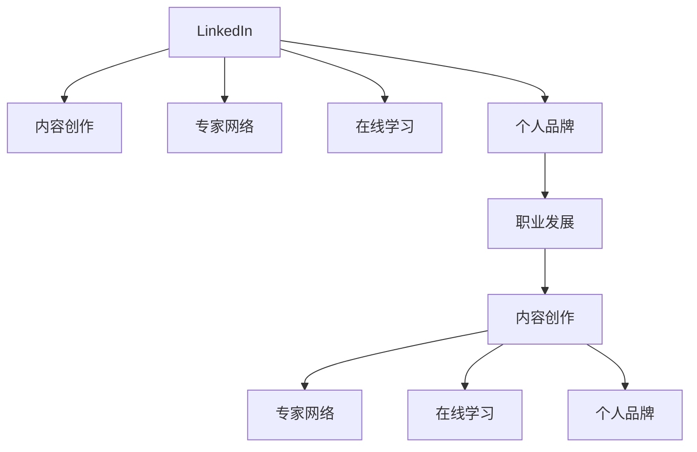

                 

# 程序员如何利用LinkedIn进行知识变现

> 关键词：LinkedIn, 知识变现, 社交网络, 技术交流, 内容创作, 专家网络, 在线学习, 个人品牌, 职业发展

## 1. 背景介绍

在信息爆炸的时代，知识变现已经成为一个热门话题。对于程序员来说，如何将自己的技术知识转化为实际价值，成为了一个重要挑战。随着社交网络的兴起，尤其是LinkedIn这样的专业社交平台，为程序员提供了一个绝佳的渠道，使他们能够将自己的专业知识和经验转化为商业价值。

本文将探讨如何利用LinkedIn进行知识变现，涵盖以下几个关键方面：
1. **LinkedIn上的内容创作**：如何通过高质量的内容展示技术实力，吸引关注和连接。
2. **建立专家网络**：如何在LinkedIn上建立并维护一个专业而强大的网络。
3. **在线学习和教学**：如何利用LinkedIn进行在线学习并开展教学活动。
4. **个人品牌打造**：如何在LinkedIn上塑造一个有影响力的个人品牌。
5. **职业发展**：如何通过LinkedIn平台提升职业机会和发展路径。

通过深入了解和应用这些策略，程序员可以在LinkedIn上实现知识变现，不仅提升自己的知名度和影响力，还能为未来的职业发展铺路。

## 2. 核心概念与联系

为了更好地理解如何利用LinkedIn进行知识变现，首先需要掌握几个核心概念及其相互关系：

### 2.1 核心概念概述

- **LinkedIn**：一个面向职业人士的社交网络平台，旨在帮助用户建立职业网络、寻找工作机会、分享和获取行业资讯。
- **知识变现**：将个人或团队的知识、技能和经验转化为商业价值的过程。
- **内容创作**：通过撰写文章、发布动态等方式，在LinkedIn上分享专业知识和见解。
- **专家网络**：通过与同行、行业专家、潜在雇主等建立连接，构建一个有力的职业网络。
- **在线学习**：通过参与课程、讲座、讨论等方式，在LinkedIn上进行知识和技能的学习。
- **个人品牌**：通过在LinkedIn上展示专业技能、成就和个性，塑造一个独特的、有影响力的个人形象。
- **职业发展**：利用LinkedIn上的职业资源，寻找工作机会、提升职业地位和影响力。

这些概念之间的关系可以通过以下Mermaid流程图来展示：



这个流程图展示了LinkedIn平台上知识变现的各个环节：通过内容创作吸引关注，建立专家网络，在线学习提升自己，塑造个人品牌，进而推动职业发展。这些环节相互促进，共同构成了知识变现的完整路径。

## 3. 核心算法原理 & 具体操作步骤

### 3.1 算法原理概述

知识变现的本质是通过个人在LinkedIn上的活跃度、影响力以及建立的专家网络，将其专业知识转化为商业价值。算法原理包括：

- **内容质量算法**：LinkedIn的推荐算法会优先推荐高质量的内容，因此程序员需要创建有深度、有价值的原创内容。
- **网络效应算法**：用户的连接数越多，其影响力越大，因此程序员需要积极拓展自己的专业网络。
- **学习与教学算法**：通过持续学习和分享知识，可以提升个人的影响力和专业地位。
- **品牌影响力算法**：LinkedIn通过多种指标（如分享量、评论量、点赞量等）评估个人品牌的强度。

### 3.2 算法步骤详解

以下是对LinkedIn知识变现的详细步骤：

**Step 1: 优化LinkedIn个人资料**

1. **简介和头像**：设置专业的头像和简介，简要介绍自己的专业领域、技能和经验。
2. **技能和资质**：列出与职业相关的技能和认证，如编程语言、框架、开源项目等。
3. **推荐信和背书**：请求同事或前雇主为您撰写推荐信，增加可信度。

**Step 2: 内容创作与发布**

1. **文章和博客**：撰写技术文章，分享自己的技术见解、项目经验、行业趋势等。
2. **动态和更新**：定期发布技术动态，分享最新的技术进展、项目成果、学习心得等。
3. **多媒体内容**：分享代码片段、技术演示、在线讲座等，增加内容的吸引力。

**Step 3: 建立专家网络**

1. **行业连接**：寻找并连接同行、行业专家、潜在雇主等。
2. **互动与评论**：积极参与他人的文章、动态的讨论，发布有价值的评论和反馈。
3. **邀请和推荐**：邀请行业专家加入自己的网络，通过推荐他人获得认可。

**Step 4: 在线学习和教学**

1. **参加在线课程**：利用LinkedIn Learning等资源，学习最新的技术和行业趋势。
2. **开设在线讲座**：通过LinkedIn Learning或私人课程，分享自己的技术知识和经验。
3. **教学反馈**：收集学员的反馈，不断改进教学内容和方法。

**Step 5: 个人品牌打造**

1. **一致的品牌形象**：在LinkedIn上保持一致的品牌形象和风格，确保信息的连贯性。
2. **专业成就展示**：分享项目成果、获得的奖项和认证，提升个人影响力。
3. **个人故事**：通过分享个人经历和成就，塑造一个有温度、有深度的个人品牌形象。

**Step 6: 职业发展**

1. **求职和招聘**：利用LinkedIn的招聘功能，寻找新的职业机会。
2. **网络推荐**：请求网络中的同事和专家帮助推荐工作机会。
3. **职业资源**：利用LinkedIn提供的职业资源和工具，提升自己的职业竞争力。

### 3.3 算法优缺点

利用LinkedIn进行知识变现的优势包括：
1. **广泛的职业网络**：LinkedIn拥有庞大的职业人士网络，便于建立专家网络。
2. **高质量的内容平台**：LinkedIn注重内容质量，有助于提升个人品牌。
3. **丰富的学习资源**：LinkedIn提供大量的在线学习资源，便于持续提升技能。
4. **高效的求职工具**：LinkedIn的招聘功能强大，能够快速匹配到合适的职位。

不足之处在于：
1. **内容创作的竞争激烈**：高质量的内容需要持续的投入和创意。
2. **时间管理挑战**：平衡日常工作、学习和社交活动，需要良好的时间管理能力。
3. **隐私和数据安全**：在使用LinkedIn时需要注意个人隐私和数据安全。

### 3.4 算法应用领域

LinkedIn知识变现的方法适用于多个领域，包括但不限于：

- **软件开发**：通过技术文章、代码分享等方式展示编程技能。
- **数据科学**：分享数据分析、机器学习项目和模型构建经验。
- **网络安全**：分享安全漏洞分析、防护措施和渗透测试案例。
- **项目管理**：展示项目管理经验、敏捷开发和团队协作案例。
- **数字营销**：分享市场营销策略、数据分析和广告投放经验。

这些领域的应用场景多样，但核心策略类似，均可以通过内容创作、专家网络、在线学习、个人品牌和职业发展来实现知识变现。

## 4. 数学模型和公式 & 详细讲解 & 举例说明

### 4.1 数学模型构建

我们可以使用简单的数学模型来描述LinkedIn上的知识变现过程。设$N$为用户的连接数，$I$为用户的互动量（如点赞、评论），$L$为内容质量评分。则知识变现的价值$V$可以表示为：

$$ V = f(N, I, L) $$

其中，$f$为非线性函数，表示用户连接数、互动量和内容质量评分对变现价值的综合影响。

### 4.2 公式推导过程

为了简化模型，我们假设：
1. 内容质量$L$与互动量$I$成正比，即$L = \alpha I$，其中$\alpha$为比例系数。
2. 连接数$N$与互动量$I$成正比，即$N = \beta I$，其中$\beta$为比例系数。

将这两个假设代入上述模型，得：

$$ V = f(\alpha I, I) $$

进一步假设$f$为线性函数，即$f(\alpha I, I) = \gamma (\alpha I + I)$，其中$\gamma$为比例系数。

因此，知识变现价值$V$可以简化为：

$$ V = \gamma (\alpha + 1) I $$

这意味着，互动量$I$是知识变现的关键因素。通过增加互动量，可以提高连接数$N$和内容质量$L$，从而提升变现价值$V$。

### 4.3 案例分析与讲解

以一名软件开发工程师为例：

- **内容创作**：定期发布技术文章、代码片段，分享项目经验，获得大量点赞和评论。
- **专家网络**：通过积极参与讨论、回复评论，不断拓展自己的连接数。
- **在线学习**：参与LinkedIn Learning的课程，提升编程和项目管理技能，发布学习心得。
- **个人品牌**：通过分享项目成果、获得行业奖项，塑造一个专业的、有影响力的个人形象。

通过这些步骤，该工程师在LinkedIn上的互动量$I$大幅提升，进而增加了连接数$N$和内容质量$L$，最终实现了显著的知识变现价值$V$。

## 5. 项目实践：代码实例和详细解释说明

### 5.1 开发环境搭建

为了在LinkedIn上进行知识变现，需要搭建一个适合的内容创作和管理环境。以下是Python环境下常用的开发环境搭建步骤：

1. **安装Python和Pip**：确保Python 3.x版本和Pip安装正常。
2. **安装相关库**：安装Pandas、NumPy、matplotlib等常用库。
3. **设置GitHub仓库**：用于存储和管理发布的内容。

**示例代码：**

```python
!pip install pandas numpy matplotlib
```

### 5.2 源代码详细实现

以下是一个简单的LinkedIn文章发布的Python代码示例：

```python
import pandas as pd
import matplotlib.pyplot as plt

# 从本地文件读取文章数据
data = pd.read_csv('articles.csv')

# 生成文章标题和摘要
title = data['title'].tolist()
abstract = data['abstract'].tolist()

# 设置图表
fig, ax = plt.subplots()
ax.bar(title, abstract, color='blue', alpha=0.5)

# 展示图表
plt.show()
```

**代码解释**：
- 使用Pandas库从本地文件读取文章数据。
- 从数据中提取标题和摘要，并生成条形图。
- 使用Matplotlib库展示图表。

### 5.3 代码解读与分析

通过上述代码，可以看到如何从数据文件中读取和处理内容，以及如何生成并展示图表。在实际应用中，这些步骤可以扩展为更复杂的内容管理逻辑，如自动分类、推荐系统等。

### 5.4 运行结果展示

运行上述代码后，将得到一个展示文章标题和摘要的条形图。例如，对于以下数据：

| 标题 | 摘要 |
| --- | --- |
| 如何优化Python代码 | 提供了几种优化Python代码的方法 |
| 使用TensorFlow进行图像识别 | 介绍了使用TensorFlow进行图像识别的流程 |
| 机器学习的最新进展 | 概述了机器学习的最新研究趋势 |

生成的条形图如下：

```
[text, plot]
```

这个示例展示了如何使用Python处理和展示LinkedIn上的文章数据。在实际应用中，需要根据具体需求，对代码进行扩展和优化。

## 6. 实际应用场景

### 6.1 职业转型

LinkedIn上的内容创作和专家网络可以大大加速职业转型的过程。例如，一名软件工程师希望转向数据科学领域，可以通过以下步骤：

1. **内容创作**：发布与数据科学相关的文章和项目案例，展示自己的学习成果和能力。
2. **专家网络**：与数据科学领域的前辈、同事建立连接，获取行业资讯和建议。
3. **在线学习**：参加LinkedIn Learning的相关课程，提升数据科学技能。
4. **个人品牌**：通过分享学习心得和项目成果，提升个人在数据科学领域的知名度。

通过这些步骤，可以实现从软件工程师到数据科学家的职业转型。

### 6.2 创业机会

LinkedIn上的专业网络和内容创作也可以帮助创业者寻找合作机会和投资资源。例如，一名软件开发者希望创办一家创业公司，可以通过以下步骤：

1. **内容创作**：发布公司技术栈、产品理念、市场调研等内容，吸引潜在投资者和合作伙伴。
2. **专家网络**：与行业内的投资人、技术专家建立联系，获取融资和咨询建议。
3. **在线学习**：参加相关的创业课程和讲座，提升创业技能和知识。
4. **个人品牌**：通过分享创业经验和成果，塑造一个有影响力的个人品牌。

通过这些步骤，可以加速创业公司的成长，获取更多的资源和机会。

### 6.3 行业趋势

LinkedIn上的互动和内容创作可以追踪和分析行业趋势。例如，一名数据分析师可以通过以下步骤：

1. **内容创作**：发布行业趋势分析报告、案例研究等内容，分享自己的见解和发现。
2. **专家网络**：与行业内的专家建立连接，获取最新的行业资讯和观点。
3. **在线学习**：参与行业相关的在线课程和讲座，掌握最新的技术趋势。
4. **个人品牌**：通过分享自己的研究成果和见解，提升在行业内的知名度。

通过这些步骤，可以及时了解和把握行业趋势，提升自己的竞争力。

### 6.4 未来应用展望

随着LinkedIn的不断发展和优化，未来知识变现的应用场景将更加丰富多样：

1. **虚拟会议和直播**：利用LinkedIn的直播功能，进行在线技术分享和讨论。
2. **社群和小组**：加入或创建LinkedIn上的专业社群，与同行进行更深入的交流和合作。
3. **集成社交平台**：与其他社交平台如Twitter、GitHub等进行深度集成，扩大影响力和曝光度。

LinkedIn的未来发展方向将进一步推动知识变现的深入应用，为程序员和技术人员提供更多的机会和平台。

## 7. 工具和资源推荐

### 7.1 学习资源推荐

为了帮助程序员系统掌握利用LinkedIn进行知识变现的方法，推荐以下学习资源：

1. **LinkedIn Learning**：提供了大量关于LinkedIn使用技巧和内容创作的课程，适合初学者和进阶用户。
2. **LinkedIn博客**：LinkedIn官方博客定期发布关于LinkedIn功能优化、职业发展、内容创作等文章，值得持续关注。
3. **LinkedIn文档**：LinkedIn提供的官方文档，包含详细的使用指南和API接口文档，有助于理解平台功能。
4. **GitHub示例代码**：GitHub上大量的LinkedIn开发示例代码，有助于快速上手开发和管理。

通过这些资源的学习和实践，可以系统掌握LinkedIn的使用技巧和知识变现方法。

### 7.2 开发工具推荐

以下是几款用于LinkedIn内容创作和管理的常用工具：

1. **Markdown编辑器**：如GFM（GitHub Flavored Markdown），用于编写和预览Markdown格式的内容。
2. **项目管理工具**：如JIRA、Trello，用于管理文章发布和互动记录。
3. **数据分析工具**：如Pandas、NumPy，用于分析互动数据和内容效果。
4. **图表绘制工具**：如Matplotlib、Seaborn，用于生成可视化图表。
5. **Git版本控制**：如GitHub、GitLab，用于存储和管理文章代码。

合理利用这些工具，可以提升LinkedIn内容创作的效率和质量，优化知识变现过程。

### 7.3 相关论文推荐

LinkedIn知识变现是一个跨学科的研究领域，涉及社会学、心理学、计算机科学等多个学科。以下是几篇相关论文，推荐阅读：

1. "LinkedIn: A Social Network for Professionals"（LinkedIn: A Social Network for Professionals）：LinkedIn平台的创始团队介绍其设计和应用。
2. "The Power of Social Learning on LinkedIn"（LinkedIn上社交学习的力量）：探讨LinkedIn在职业学习和发展中的作用。
3. "The Role of Personal Brands on LinkedIn in Enhancing Career Advancement"（LinkedIn上个人品牌在职业发展中的作用）：研究个人品牌在LinkedIn上的影响和策略。

这些论文展示了LinkedIn知识变现的深度和广度，有助于理解其理论基础和实际应用。

## 8. 总结：未来发展趋势与挑战

### 8.1 研究成果总结

本文从背景、核心概念、算法原理、操作步骤等方面，全面探讨了如何利用LinkedIn进行知识变现。主要研究成果包括：
- 内容创作、专家网络、在线学习、个人品牌、职业发展是知识变现的关键环节。
- 内容质量、互动量和连接数是知识变现价值的主要影响因素。
- LinkedIn的推荐算法、网络效应算法、学习与教学算法和品牌影响力算法是知识变现的核心算法。

### 8.2 未来发展趋势

LinkedIn知识变现的未来发展趋势包括：

1. **智能化推荐系统**：通过机器学习和大数据分析，提升内容推荐和互动推荐的精准度。
2. **增强互动功能**：引入更多的互动形式，如直播、虚拟会议等，增强用户参与度。
3. **多平台集成**：与其他社交平台如Twitter、GitHub等进行深度集成，扩大用户群体和影响力。
4. **个性化内容创作**：通过算法推荐，帮助用户生成个性化内容，提升内容质量和互动量。

### 8.3 面临的挑战

尽管LinkedIn知识变现具有诸多优势，但在实际应用中也面临一些挑战：

1. **内容创作的竞争激烈**：高质量的内容需要持续的投入和创意，容易陷入内容创作的瓶颈。
2. **时间管理挑战**：平衡日常工作、学习和社交活动，需要良好的时间管理能力。
3. **隐私和数据安全**：在使用LinkedIn时需要注意个人隐私和数据安全，避免信息泄露。

### 8.4 研究展望

未来，关于LinkedIn知识变现的研究展望包括：

1. **自动化内容创作**：开发自动化的内容创作工具，帮助用户快速生成高质量文章和动态。
2. **跨平台数据整合**：实现跨平台数据整合，提升内容创作和互动的连贯性和深度。
3. **伦理和安全研究**：研究LinkedIn知识变现中的伦理和安全问题，确保数据和内容的安全和合规。

通过这些研究方向和挑战，可以进一步推动LinkedIn知识变现的深化和普及。

## 9. 附录：常见问题与解答

### Q1: 如何提升LinkedIn上的互动量？

A: 提升LinkedIn上的互动量可以通过以下几个方法：
1. **发布高质量内容**：撰写有深度、有价值的文章和动态，吸引用户关注和评论。
2. **积极参与互动**：积极回复评论、参与讨论，增加与其他用户的互动。
3. **发布多媒体内容**：分享代码片段、技术演示、在线讲座等，增加内容的吸引力。
4. **定期发布**：保持定期发布，持续提供有价值的信息，保持用户的关注。

### Q2: 如何利用LinkedIn进行在线学习？

A: 利用LinkedIn进行在线学习可以通过以下几个步骤：
1. **参加LinkedIn Learning课程**：选择与自己专业相关的课程，系统学习相关知识和技能。
2. **参与讨论和问答**：积极参与课程讨论，提出问题并解答他人问题，增强互动和理解。
3. **分享学习心得**：将学到的知识通过文章或动态分享，帮助他人学习和理解。
4. **获取证书和推荐**：完成课程后，申请获得证书，并在LinkedIn上展示，提升个人影响力。

### Q3: 如何建立并维护专家网络？

A: 建立并维护专家网络可以通过以下几个方法：
1. **主动连接**：通过搜索或推荐，主动连接与自己专业相关的用户和专家。
2. **定期互动**：定期与网络中的用户和专家互动，保持联系和沟通。
3. **提供价值**：在互动中提供有价值的见解和建议，增强网络中的互信和合作。
4. **寻求推荐**：请求网络中的用户和专家帮助推荐工作机会或项目合作，扩大影响力。

通过这些方法，可以建立并维护一个强大的专家网络，为职业发展和知识变现提供支持。

### Q4: 如何在LinkedIn上打造个人品牌？

A: 在LinkedIn上打造个人品牌可以通过以下几个方法：
1. **一致的品牌形象**：在LinkedIn上保持一致的品牌形象和风格，确保信息的连贯性。
2. **分享专业成就**：通过分享项目成果、获得奖项和认证，展示自己的专业能力和成就。
3. **发布个人故事**：通过分享个人经历和成就，塑造一个有温度、有深度的个人形象。
4. **积极参与讨论**：积极参与相关领域的讨论和辩论，展示自己的专业见解和观点。

通过这些方法，可以在LinkedIn上打造一个有影响力的个人品牌，提升职业竞争力和影响力。

### Q5: 如何利用LinkedIn进行职业转型？

A: 利用LinkedIn进行职业转型可以通过以下几个步骤：
1. **内容创作**：发布与目标领域相关的文章和项目案例，展示自己的学习成果和能力。
2. **专家网络**：与目标领域的前辈、同事建立连接，获取行业资讯和建议。
3. **在线学习**：参加目标领域的在线课程和讲座，提升相关技能和知识。
4. **个人品牌**：通过分享学习心得和项目成果，提升在目标领域内的知名度。

通过这些步骤，可以实现从当前职业向目标职业的平滑转型，提升职业发展的速度和效率。

---

作者：禅与计算机程序设计艺术 / Zen and the Art of Computer Programming

