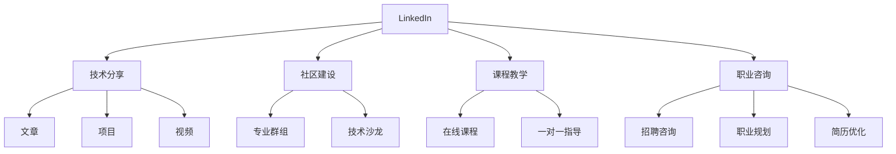

                 

# 程序员如何利用LinkedIn进行知识变现

> 关键词：LinkedIn, 知识变现, 编程, 技术分享, 社区建设, 职业发展

## 1. 背景介绍

### 1.1 问题由来
随着信息技术的发展，全球化加速，技术专家和程序员在职业发展道路上拥有越来越多的选择。LinkedIn作为全球最大的职业社交平台之一，提供了丰富的资源，帮助专业人士建立人脉、拓展机会和变现知识。

在传统的职业发展路径中，技术专家和程序员往往依赖于工作经验和技术积累进行薪资增长和职业提升。然而，技术的迭代更新和知识获取的速度越来越快，个人在职业生涯中要不断学习、适应并创新，才能保持竞争力。

LinkedIn以其庞大的用户群体和丰富的功能，为技术专家和程序员提供了一个新的知识变现途径：通过技术分享、社区建设、课程教学和职业咨询等方式，将自己的知识和经验转化为经济收益。

### 1.2 问题核心关键点
本文将深入探讨程序员如何利用LinkedIn进行知识变现，分析不同变现方式的优缺点，并提出具体的实践建议。本文的核心内容包括以下几点：

- 技术分享和专业知识的变现：包括发布文章、分享项目、制作视频等形式。
- 社区建设和活动的变现：包括创建和参与专业群组、组织技术沙龙等。
- 课程教学和在线辅导的变现：包括开设线上课程、提供一对一指导等。
- 职业咨询和招聘服务的变现：包括提供招聘咨询、职业规划等服务。

本文旨在为程序员提供一个全面的视角，介绍在LinkedIn上进行知识变现的多种可能性和策略。

## 2. 核心概念与联系

### 2.1 核心概念概述

为了更清晰地理解如何利用LinkedIn进行知识变现，本节将介绍几个关键概念及其之间的联系：

- **LinkedIn**：全球最大的职业社交平台，聚集了各行各业的专业人士，提供了丰富的职业资源。
- **知识变现**：将个人的专业知识、技能和经验转化为经济收入的过程。
- **技术分享**：通过文章、项目、视频等形式，分享技术经验和见解。
- **社区建设**：创建或参与专业群组，组织技术交流活动，建立专业网络。
- **课程教学**：开设在线课程，传授编程技能和专业知识。
- **职业咨询**：提供招聘咨询、职业规划、简历优化等服务。

这些概念通过以下Mermaid流程图来展示：



这个流程图展示了LinkedIn平台上知识变现的各个关键环节及其相互关系：

1. LinkedIn作为平台，提供了分享、建设、教学和咨询的基础。
2. 技术分享包括文章、项目和视频，能直接与广大用户接触。
3. 社区建设包括专业群组和技术沙龙，有助于建立和扩展职业网络。
4. 课程教学包括在线课程和个人指导，提供系统化和个性化的学习体验。
5. 职业咨询包括招聘、规划和简历优化，直接服务于用户的职业发展。

这些概念之间的联系在于，它们共同构成了LinkedIn上知识变现的生态系统，使得技术专家和程序员能够有效利用平台资源，实现个人价值的最大化。

## 3. 核心算法原理 & 具体操作步骤

### 3.1 算法原理概述

利用LinkedIn进行知识变现，主要涉及以下几个步骤：

1. **内容创作**：在LinkedIn上发布高质量的技术文章、分享个人项目、制作技术视频等，展示专业技能和知识。
2. **社区参与**：创建或加入专业群组，积极参与技术交流和讨论，建立专业网络。
3. **课程开发**：开设在线课程，系统传授编程技能和专业知识，提供有价值的教育服务。
4. **职业服务**：提供职业咨询、招聘咨询、简历优化等专业服务，帮助他人提升职业竞争力。

### 3.2 算法步骤详解

以下详细介绍每个步骤的具体操作：

**Step 1: 内容创作**

1. **文章发布**：撰写高质量的技术文章，分享技术见解和经验。使用Markdown格式编写文章，便于排版和格式调整。
2. **项目分享**：分享个人项目和技术实现，展示技术能力和创新成果。
3. **视频制作**：制作技术讲解或案例分析视频，以视觉形式传递技术知识。

**Step 2: 社区参与**

1. **创建群组**：创建专业领域的技术群组，邀请业内专家和爱好者加入。
2. **参与讨论**：积极参与群组内的技术讨论，分享知识和经验，解答问题。
3. **组织活动**：定期组织技术沙龙、线上会议等活动，促进成员间的互动和交流。

**Step 3: 课程开发**

1. **课程设计**：设计系统的课程结构，涵盖从基础到高级的内容。
2. **内容制作**：录制视频课程、编写详细讲义和习题。
3. **平台发布**：将课程上传至LinkedIn Learning或第三方平台，提供课程购买和观看功能。

**Step 4: 职业服务**

1. **职业咨询**：提供个性化的职业规划咨询，帮助用户提升职业竞争力。
2. **招聘咨询**：为求职者提供招聘信息、求职技巧和面试指导。
3. **简历优化**：提供专业的简历优化建议，提升求职成功率。

### 3.3 算法优缺点

利用LinkedIn进行知识变现具有以下优点：

- **广泛接触**：通过文章、项目和视频等形式，直接与广大用户接触，展示专业能力。
- **网络扩展**：参与专业群组和活动，建立和扩展职业网络，获得更多职业机会。
- **收入多元**：通过文章阅读、课程购买、一对一辅导等多种方式实现收入变现。
- **知识共享**：分享知识和技术经验，提升自身影响力和行业地位。

同时，这种变现方式也存在一些缺点：

- **时间投入**：内容创作和社区参与需要大量时间，可能影响日常工作。
- **竞争激烈**：LinkedIn上专业内容丰富，需要保持高质量和新颖性以吸引用户。
- **平台依赖**：过度依赖LinkedIn平台，可能限制变现渠道和用户群体。

### 3.4 算法应用领域

利用LinkedIn进行知识变现的应用领域非常广泛，适用于多种职业背景和技术水平的专家和程序员：

- **开发者**：通过技术分享和项目展示，提升个人品牌和专业影响力。
- **技术讲师**：开设在线课程，系统传授编程技能，成为知识付费的重要渠道。
- **技术顾问**：提供职业咨询和招聘服务，帮助用户提升职业发展和就业机会。
- **自由职业者**：通过技术文章、项目和视频变现，实现自由职业的灵活性和收入多样化。

## 4. 数学模型和公式 & 详细讲解 & 举例说明（备注：数学公式请使用latex格式，latex嵌入文中独立段落使用 $$，段落内使用 $)
### 4.1 数学模型构建

在利用LinkedIn进行知识变现的过程中，我们可以建立一个简单的数学模型来表示收益和成本的关系。

设 $R$ 为总收入，$C$ 为总成本，$n$ 为内容创作次数，$p$ 为每次内容创作带来的平均收益，$t$ 为每次社区参与的平均时间成本，$w$ 为每次课程开发的平均费用，$s$ 为每次职业咨询的平均费用。

则总收入 $R$ 和总成本 $C$ 分别为：

$$
R = np + ts + ws
$$

$$
C = t(n) + w + s
$$

其中 $n$ 代表内容创作的次数，$t$ 代表每次社区参与的平均时间成本，$w$ 代表每次课程开发的平均费用，$s$ 为每次职业咨询的平均费用。

### 4.2 公式推导过程

推导收入和成本的关系如下：

1. **内容创作收益**：每次内容创作带来的平均收益为 $p$，假设内容创作的次数为 $n$，则内容创作总收益为 $np$。
2. **社区参与成本**：每次社区参与的平均时间为 $t$，假设社区参与的次数为 $n$，则社区参与的总成本为 $nt$。
3. **课程开发成本**：每次课程开发的平均费用为 $w$，假设课程开发的次数为 $n$，则课程开发的总成本为 $nw$。
4. **职业咨询成本**：每次职业咨询的平均费用为 $s$，假设职业咨询的次数为 $n$，则职业咨询的总成本为 $ns$。

将这些成本和收益整合到公式中，即可得到总收入和总成本的表达式：

$$
R = np + ts + ws
$$

$$
C = nt + nw + ns
$$

进一步化简，得到净收益 $P$ 的表达式：

$$
P = R - C = np + ts + ws - (nt + nw + ns)
$$

化简后得：

$$
P = np + ts + ws - (n+1)(t+w+s)
$$

从这个公式可以看出，净收益 $P$ 受到内容创作次数 $n$、每次内容创作带来的平均收益 $p$、每次社区参与的平均时间成本 $t$、每次课程开发的平均费用 $w$、每次职业咨询的平均费用 $s$ 等多种因素的影响。

### 4.3 案例分析与讲解

假设某技术专家每月发布一篇高质量技术文章，每次发布带来的收益为 $500，社区参与每次花费2小时，课程开发每次花费1000元，职业咨询每次花费500元。则他每月的内容创作收益为 $500，社区参与成本为 $2 \times 4 = 8，课程开发成本为 $1000，职业咨询成本为 $500。每月净收益计算如下：

$$
P = 500 + 8 + 1000 - (4+1+1) \times (2+1000+500)
$$

$$
P = 500 + 8 + 1000 - 6 \times 1508
$$

$$
P = 1508 - 9048
$$

$$
P = -7540
$$

显然，这种变现方式存在较大亏损。因此，技术专家应平衡内容创作、社区参与和课程开发等多种变现渠道，以实现最优净收益。

## 5. 项目实践：代码实例和详细解释说明

### 5.1 开发环境搭建

为了更好地利用LinkedIn进行知识变现，首先需要搭建开发环境。以下是具体步骤：

1. **安装Python**：确保已安装Python环境，推荐使用Python 3.8及以上版本。
2. **安装LinkedIn SDK**：在LinkedIn开发者平台上创建应用，并获取API密钥和密钥文件。按照官方文档安装SDK。
3. **配置环境**：使用pip安装LinkedIn SDK和相关依赖库。

```bash
pip install linkedin-sdk
pip install requests
```

完成上述步骤后，即可在本地搭建LinkedIn API开发环境。

### 5.2 源代码详细实现

以下是一个简单的LinkedIn文章发布的Python代码示例：

```python
from linkedin import LinkedInClient

# 初始化LinkedInClient
client = LinkedInClient(api_key='API_KEY', secret_key='API_SECRET')

# 发布文章
def post_article(article_title, article_content):
    article = {
        'text': article_content,
        'title': article_title,
        'headline': article_title,
        'content_abstract': article_content,
        'secondary_content_abstract': None,
        'primary_content_format': 'text',
        'secondary_content_format': None,
        'visibility': 'COMPANY'
    }
    response = client article.api.publishPost(
        article=article,
        access_token='TOKEN'
    )
    print('文章发布成功！')

# 调用示例
post_article('技术文章标题', '这是一篇关于Python编程的介绍文章。')
```

### 5.3 代码解读与分析

**LinkedInClient**：
- 封装了LinkedIn API的常用方法，方便开发者调用。

**post_article函数**：
- 接收文章标题和内容作为输入，生成并发布一篇技术文章。
- 设置文章的可见性和格式，确保文章发布成功。

**API调用**：
- 使用API密钥和访问令牌，调用LinkedIn API发布文章。

该示例代码演示了如何使用Python和LinkedIn SDK发布一篇技术文章。开发者可以根据需要，调用其他API方法，如更新文章、获取文章列表等，实现更丰富的功能。

### 5.4 运行结果展示

成功发布文章后，将在LinkedIn上展示，并通过API获取文章的访问链接和统计数据。

```python
print('文章发布成功！')
print('访问链接：https://www.linkedin.com/company/article-id')
```

## 6. 实际应用场景

### 6.1 开发者社区

在LinkedIn上，开发者可以创建和参与各种编程社区和技术群组，分享代码、交流经验、解决技术问题。通过社区活动，开发者不仅可以提升自身技术水平，还能建立广泛的专业网络，获取职业机会。

### 6.2 技术讲师

技术讲师可以利用LinkedIn开设在线课程，系统讲解编程语言、框架和工具。通过课程教学，讲师可以获得丰厚的经济回报，同时提升个人品牌和影响力。

### 6.3 职业咨询

职业咨询师可以通过LinkedIn提供个性化的职业规划和就业指导服务，帮助求职者提升竞争力，获得高薪职位。职业咨询师可以根据咨询效果和用户反馈，提升服务质量和满意度，实现收入增长。

## 7. 工具和资源推荐

### 7.1 学习资源推荐

为了更好地掌握利用LinkedIn进行知识变现的方法，以下是一些推荐的学习资源：

1. **LinkedIn Learning**：LinkedIn官方提供的在线课程平台，涵盖各种技术和职业发展课程，帮助开发者提升技能和知识。
2. **LinkedIn Career Guide**：LinkedIn提供的职业发展指南，涵盖简历优化、面试技巧、职业规划等内容。
3. **LinkedIn Developer Documentation**：LinkedIn开发者文档，提供API的详细说明和使用方法，帮助开发者快速上手。

### 7.2 开发工具推荐

利用LinkedIn进行知识变现需要多种工具的支持，以下是一些推荐的工具：

1. **Python**：用于开发LinkedIn文章和API调用，支持丰富的第三方库和框架。
2. **LinkedIn SDK**：官方提供的SDK，方便开发者调用LinkedIn API。
3. **GitHub**：托管和分享技术项目和代码，帮助开发者建立专业形象。

### 7.3 相关论文推荐

为了深入理解LinkedIn知识变现的理论基础和实践方法，以下是几篇推荐的相关论文：

1. **Social Media and Job Search**：探讨社交媒体对求职和职业发展的影响，揭示LinkedIn在职业社交中的重要性。
2. **Online Learning and Career Development**：分析在线课程和职业发展的关系，强调知识分享和社区建设的重要性。
3. **LinkedIn Analysis of Professional Networking**：通过大数据分析，揭示LinkedIn上的专业网络结构和社会资本。

## 8. 总结：未来发展趋势与挑战

### 8.1 总结

本文深入探讨了程序员如何利用LinkedIn进行知识变现，分析了不同变现方式的优缺点，并给出了具体的实践建议。LinkedIn作为一个强大的职业社交平台，提供了丰富的资源和工具，帮助程序员在职业生涯中不断提升自身价值。通过技术分享、社区建设、课程教学和职业咨询等多种方式，程序员可以在LinkedIn上实现知识变现，进一步推动职业发展和技术创新。

### 8.2 未来发展趋势

展望未来，LinkedIn上的知识变现将呈现以下几个发展趋势：

1. **内容多样化**：除了文章和技术项目外，视频、直播等新兴内容形式将逐渐成为主要变现方式。
2. **社区互动性增强**：社区建设和互动活动将更加活跃，形成更加紧密的专业网络。
3. **课程系统化**：在线课程将更加系统和完善，涵盖更多技术和职业发展内容。
4. **职业服务智能化**：通过AI技术优化职业咨询和招聘服务，提升服务质量和效率。

### 8.3 面临的挑战

尽管利用LinkedIn进行知识变现具有广泛的应用前景，但也面临一些挑战：

1. **内容质量控制**：保持高质量和新颖性的内容创作，需要大量时间和精力。
2. **用户获取难度**：获取和维护高质量的用户群体，需要不断优化内容和互动方式。
3. **平台规则变化**：LinkedIn平台的政策和规则可能发生变化，影响变现效果。
4. **时间管理**：平衡日常工作与知识变现活动，需要合理的时间管理。

### 8.4 研究展望

未来，LinkedIn上的知识变现将继续发展和深化，技术专家和程序员将通过更多元化的方式实现个人价值。我们期待看到更多的创新和突破，推动LinkedIn社区的繁荣和职业社交的发展。

## 9. 附录：常见问题与解答

**Q1：如何创建和参与专业群组？**

A: 创建和参与专业群组的步骤如下：
1. 登录LinkedIn，进入“Network”菜单，选择“Groups”。
2. 点击“Create a Group”按钮，填写群组名称、简介和成员资格。
3. 设置群组规则和权限，邀请其他成员加入。
4. 积极参与群组讨论，分享知识和经验。

**Q2：如何开设在线课程？**

A: 开设在线课程的步骤如下：
1. 登录LinkedIn Learning，进入“Create a Course”页面。
2. 填写课程名称、简介和课程大纲。
3. 录制视频、编写讲义和习题，上传至平台。
4. 设置课程价格和推广方式，发布课程。

**Q3：如何提供职业咨询和招聘服务？**

A: 提供职业咨询和招聘服务的步骤如下：
1. 在LinkedIn上发布职业咨询和招聘服务广告。
2. 建立个人资料，展示专业背景和能力。
3. 与求职者进行一对一咨询和沟通，提供个性化建议。
4. 根据求职者的反馈和效果，不断优化服务质量。

**Q4：如何优化文章发布效果？**

A: 优化文章发布效果的方法如下：
1. 选择合适的主题和标题，吸引用户点击。
2. 撰写高质量的正文，详细讲解技术问题和解决方案。
3. 使用多媒体形式，如代码片段、图表等，丰富内容展示。
4. 发布后积极互动，回应用户评论和反馈。

**Q5：如何提高社区互动性？**

A: 提高社区互动性的方法如下：
1. 定期发布高质量的内容，引发讨论。
2. 参与群组内的讨论，积极回应其他成员的问题。
3. 组织技术沙龙、线上会议等活动，增加成员互动。
4. 建立明确的社区规则和激励机制，鼓励成员参与。

---

作者：禅与计算机程序设计艺术 / Zen and the Art of Computer Programming

