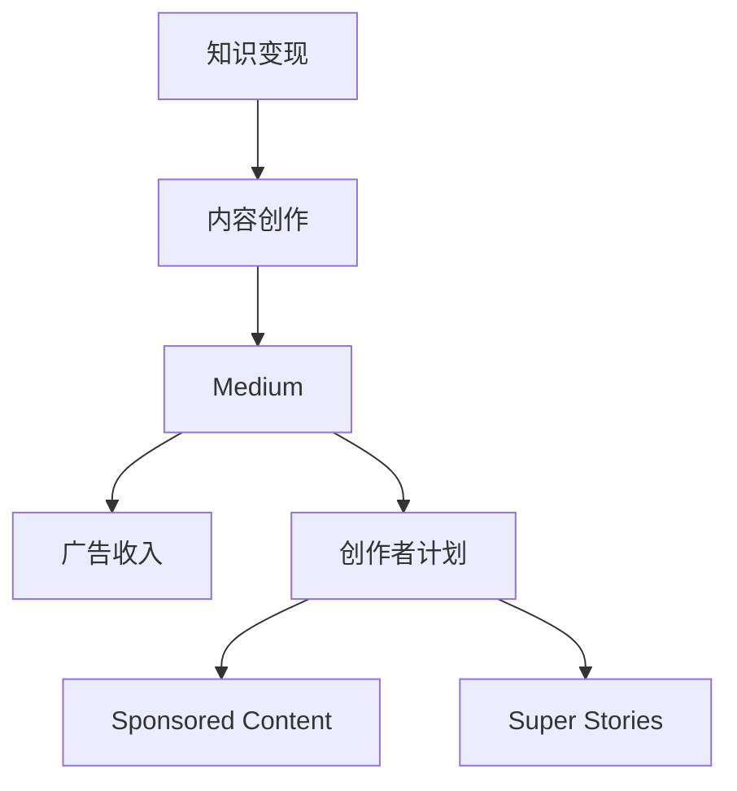

                 

# 程序员如何利用Medium进行知识变现

## 1. 背景介绍

随着互联网和数字技术的迅猛发展，内容创作者在各行各业中都呈现出爆发式增长的趋势。程序员作为科技行业的核心力量，不仅需要深入掌握技术细节，还需要具备创新和分享的能力。而在众多内容平台上，Medium无疑是最受欢迎的技术博客平台之一，它不仅为用户提供了一个展示自己技术能力和专业知识的舞台，还为程序员提供了一个变现的渠道。

Medium以其简单易用的内容发布和阅读体验、丰富多样的内容主题、广泛的读者群体以及灵活的收入模式，吸引了全球无数程序员和科技从业者。本文将详细探讨程序员如何利用Medium进行知识变现，包括如何写作、提高阅读量、获得广告收入、加入创作者计划以及通过Sponsored Content（赞助内容）和Super Stories（长文故事）等方式实现更高效的变现。

## 2. 核心概念与联系

### 2.1 核心概念概述

在探讨如何利用Medium进行知识变现之前，我们先来了解几个核心概念及其相互联系：

- **知识变现**：指通过分享自己的专业知识和经验，获取货币或其他形式的回报。
- **Medium**：一个广泛使用的在线内容平台，提供了一个简单、灵活、易于访问的平台，用于创建和分享技术、商业、设计等各类内容的博客。
- **内容创作**：撰写有价值、有深度的文章，以吸引目标读者群体，并促使他们采取行动，如阅读、分享、购买等。
- **广告收入**：通过广告展示在文章中，为平台创造收益，并间接为创作者提供收入。
- **创作者计划**：Medium提供的一项计划，允许创作者以不同的支付模型获取收入，如Sponsored Content和Super Stories。
- **Sponsored Content**：创作者可以将其文章标记为赞助内容，读者可以看到广告赞助商的标志，创作者可以按每千次展示收费。
- **Super Stories**：Medium上的一类长篇文章，通常超过2000字，创作者可以获得每千次阅读的固定费用。

这些概念之间的逻辑关系可以通过以下Mermaid流程图来展示：

这个流程图展示了知识变现的过程：首先，通过内容创作产生有价值的知识，然后将知识发布到Medium平台，利用平台的广告收入和创作者计划等方式实现变现。创作者计划包括了Sponsored Content和Super Stories两种高级收入模式。

## 3. 核心算法原理 & 具体操作步骤
### 3.1 算法原理概述

知识变现的过程基于平台提供的多样化收入模式和创作者的精心策划与执行。以下是基于知识变现的核心算法原理：

1. **内容创作算法**：
   - 吸引读者注意：文章标题应具有吸引力，副标题和段落应清晰明了，内容有深度，同时配合良好的排版和视觉设计。
   - 优化阅读体验：确保文章的加载速度快，阅读流畅，使用户能够快速理解内容。

2. **广告收入算法**：
   - 精准定向广告：根据读者的兴趣和行为进行广告定向，提高广告的相关性和点击率。
   - 提高点击率：通过优化文章内容，增加广告曝光率，促使读者点击广告。

3. **创作者计划算法**：
   - 选择合适的收入模式：根据内容类型和受众特点，选择Sponsored Content或Super Stories。
   - 最大化收入：根据平台规则和用户反馈，不断优化内容质量，吸引更多读者，提高收入。

### 3.2 算法步骤详解

知识变现的算法步骤包括以下几个关键环节：

1. **选择平台**：
   - 确定目标受众和变现目标。
   - 选择适合的平台，如Medium，并注册账号。

2. **内容创作**：
   - 选择主题：选择技术深度高、受众感兴趣的领域。
   - 写作规划：制定详细写作计划，如内容大纲、写作时间表。
   - 撰写文章：确保内容准确、清晰、有深度，使用户受益。

3. **发布文章**：
   - 选择发布时间：根据目标受众的活跃时间选择发布时间。
   - 添加元数据：如标题、副标题、标签、图片等。
   - 调整格式：优化排版和视觉设计，确保良好的阅读体验。

4. **利用广告收入**：
   - 插入广告：选择合适的广告类型和位置，确保不影响用户体验。
   - 调整广告设置：根据广告效果，调整广告定向和预算。

5. **创作者计划**：
   - 加入创作者计划：根据创作者计划要求提交申请，并通过审核。
   - 选择收入模式：根据创作者计划选项，选择Sponsored Content或Super Stories。
   - 优化内容：根据反馈调整内容策略，提高收入。

### 3.3 算法优缺点

利用Medium进行知识变现的优势在于：
1. 高曝光率：Medium拥有庞大的读者群体，能够快速提升内容影响力。
2. 多样收入模式：除了广告收入，还有创作者计划和Sponsored Content等多样化收入渠道。
3. 易于操作：Medium平台操作简单，内容创作门槛较低。

但这种变现方式也存在一些局限性：
1. 收入不稳定：广告收入和创作者计划收入受市场和用户行为影响较大。
2. 平台依赖性：创作者对平台依赖程度高，平台政策变动可能影响收入。
3. 竞争激烈：优质内容创作者众多，竞争激烈，提高曝光难度大。

### 3.4 算法应用领域

利用Medium进行知识变现，主要应用于以下领域：

1. **技术分享**：分享最新的技术发展、编程技巧、项目实战经验等，吸引技术爱好者。
2. **教程和培训**：提供系统化的技术教程、编程语言教程、在线课程等，帮助用户学习提升。
3. **职业发展**：分享职业规划、面试技巧、软技能提升等，帮助读者职业发展。
4. **行业洞察**：分享行业动态、市场分析、数据报告等，帮助读者了解行业趋势。

## 4. 数学模型和公式 & 详细讲解 & 举例说明
### 4.1 数学模型构建

知识变现的数学模型涉及内容创作、广告收入和创作者计划三个部分。以下是一个简化的数学模型：

- **内容创作模型**：
  - 阅读量（$R$）：$R=f(\text{标题质量}, \text{内容深度}, \text{发布时间}, \text{广告曝光})$
  - 点击率（$C$）：$C=f(\text{标题吸引力}, \text{内容相关性}, \text{用户行为})$

- **广告收入模型**：
  - 每千次展示收入（$I$）：$I=k \times (C \times R)$
  - 广告点击收入（$C'$）：$C'=k' \times (C \times R)$

- **创作者计划模型**：
  - 每千次阅读收入（$S$）：$S=m \times (R)$
  - 每千次展示收入（$I'$）：$I'=n \times (C \times R)$

### 4.2 公式推导过程

以创作者计划中的Super Stories为例，公式推导过程如下：

假设每千次展示收费为$k'$，每千次阅读收入为$m$，点击率为$C'$，那么每千次展示收入为：
$$
I' = k' \times C' \times R = k' \times (C' \times R)
$$

由于点击率$C'$可以表示为：
$$
C' = k'' \times (C \times R)
$$

将$C'$代入$I'$的公式中：
$$
I' = k' \times k'' \times (C \times R) \times R = k' \times k'' \times R^2
$$

因此，Super Stories每千次展示收入为：
$$
I' = m \times R
$$

这里需要注意的是，实际情况下，$k'$和$k''$会根据平台规则和广告定向策略进行调整，创作者需要根据实际效果调整广告预算和定向策略。

### 4.3 案例分析与讲解

假设一位程序员在Medium上发布了一篇关于Python高级编程技巧的文章，该文章在发布后的第一个小时内阅读量为5000次，点击率为10%。平台每千次展示收入为2美元，每千次阅读收入为5美元。

根据以上公式，该文章的展示收入为：
$$
I' = 2 \times 5000 \times 10\% = 100
$$

广告点击收入为：
$$
C' = 2 \times 5000 \times 10\% = 100
$$

因此，该文章的总收入为：
$$
I' + C' = 100 + 100 = 200
$$

如果该文章被标记为Super Stories，那么总收入为：
$$
S = 5 \times 5000 = 25000
$$

综上所述，通过使用Medium进行知识变现，程序员不仅可以获得直接的广告收入，还可以享受创作者计划提供的更高收入。

## 5. 项目实践：代码实例和详细解释说明
### 5.1 开发环境搭建

1. 安装Medium编辑器：Medium提供了一个简单易用的编辑器，方便用户撰写和管理内容。
2. 注册并登录Medium账户：访问Medium官网，注册新账户或登录已有账户。
3. 设置个人账户信息：完善个人资料，包括头像、自我介绍、联系方式等。

### 5.2 源代码详细实现

由于Medium平台主要是内容创作和发布，并不涉及编程实现，因此没有具体的代码实例。以下是一篇关于如何撰写高质量技术文章的步骤：

1. **选择主题**：选择一个有深度、有价值的技术主题，如最新技术趋势、编程技巧、项目实战经验等。
2. **写作规划**：制定详细写作计划，如内容大纲、写作时间表、目标受众分析等。
3. **撰写文章**：确保内容准确、清晰、有深度，使用用户易于理解的语言。
4. **添加元数据**：如标题、副标题、标签、图片等，增加文章的可读性和吸引力。
5. **调整格式**：优化排版和视觉设计，确保良好的阅读体验。
6. **发布文章**：选择合适的发布时间，提交文章进行审核，等待平台发布。

### 5.3 代码解读与分析

由于Medium平台主要是内容创作和发布，并不涉及编程实现，因此没有具体的代码实例。以下是对 Medium 编辑器使用的一些常见问题解答：

**Q1: 如何创建一篇文章？**

A: 在Medium编辑器中，点击“Write”按钮，输入文章标题和副标题，开始撰写正文。在撰写过程中，可以使用Markdown语法进行排版和格式设置。

**Q2: 如何添加图片和代码块？**

A: Medium编辑器支持直接上传图片和代码块。将图片上传到编辑器中的图片上传功能，代码块可以通过“Insert Code”功能来添加，并使用GitHub或Gist等代码托管服务进行展示。

**Q3: 如何设置文章排版？**

A: Medium编辑器支持Markdown语法，通过使用Markdown格式可以对文章进行加粗、斜体、粗体、代码高亮等排版设置。

### 5.4 运行结果展示

一篇高质量的文章发布后，可以通过Medium社区的读者反馈和互动情况来评估其效果。可以通过文章阅读量、评论数、点赞数等指标来衡量文章的影响力和受欢迎程度。

## 6. 实际应用场景

利用Medium进行知识变现的应用场景包括：

1. **技术博客**：创建个人技术博客，分享最新技术进展、编程技巧、项目实战经验等，吸引技术爱好者。
2. **教程和培训**：提供系统化的技术教程、编程语言教程、在线课程等，帮助用户学习提升。
3. **职业发展**：分享职业规划、面试技巧、软技能提升等，帮助读者职业发展。
4. **行业洞察**：分享行业动态、市场分析、数据报告等，帮助读者了解行业趋势。

## 7. 工具和资源推荐
### 7.1 学习资源推荐

为了帮助程序员更好地利用Medium进行知识变现，以下是一些推荐的资源：

1. **Medium官方教程**：Medium提供了丰富的官方教程，涵盖从写作到发布、收入模式等各个环节的内容。
2. **Medium博客订阅**：订阅Medium博客，关注优秀的技术博主和领域专家，获取最新技术资讯和行业动态。
3. **写作课程**：参加在线写作课程，提升写作技能和内容质量。
4. **创作者计划**：加入Medium创作者计划，获取专属资源和优惠，了解平台规则和最新变化。

### 7.2 开发工具推荐

由于Medium主要是内容创作和发布平台，并不涉及编程实现，因此没有具体的开发工具推荐。但以下是一些辅助写作和排版工具：

1. **Markdown编辑器**：如Typora、GFM Editor等，帮助用户更快速地撰写和排版文章。
2. **代码托管服务**：如GitHub、Gist等，方便程序员管理和展示代码。

### 7.3 相关论文推荐

为了深入了解知识变现的理论基础和实践方法，以下是一些推荐的论文：

1. **内容推荐算法研究**：如《信息过滤与推荐系统》，深入研究推荐算法原理和应用。
2. **广告定向算法**：如《广告定向和受众分析》，研究如何提高广告定向精度和点击率。
3. **创作者激励机制**：如《平台激励机制研究》，分析创作者计划的激励机制和应用效果。

## 8. 总结：未来发展趋势与挑战
### 8.1 研究成果总结

利用Medium进行知识变现的方法在实践中取得了显著成效，为程序员提供了更多的职业发展机会和收入来源。通过精心创作高质量内容，利用平台多样化收入模式，创作者可以实现快速变现。

### 8.2 未来发展趋势

未来，利用Medium进行知识变现的趋势可能包括：

1. **多平台内容同步**：创作者可以将内容同步到多个平台，增加曝光率和收入来源。
2. **内容聚合和内容订阅**：创作者可以通过内容聚合和订阅功能，将相似主题的内容组合在一起，提高内容质量和用户黏性。
3. **社区互动和社交网络**：利用Medium的社交功能，创作者可以与读者进行互动，建立更紧密的联系，增加用户忠诚度。

### 8.3 面临的挑战

利用Medium进行知识变现也面临一些挑战：

1. **内容竞争**：优质内容创作者众多，如何突破竞争，吸引更多读者，提升内容影响力，是创作者面临的重大挑战。
2. **平台政策变化**：Medium平台政策的变化可能影响创作者的收益和内容发布，创作者需要密切关注平台动态，及时调整策略。
3. **内容质量控制**：创作者需要不断提升内容质量和深度，确保内容具有独特性和价值性，避免同质化。

### 8.4 研究展望

未来，如何利用Medium进行知识变现的研究将聚焦于以下几个方面：

1. **内容创新**：开发更多创新内容形式，如互动内容、视频内容、直播等，提升内容吸引力。
2. **社交网络优化**：利用社交网络功能，提高创作者与读者之间的互动和参与度，增强用户黏性。
3. **多模态内容融合**：结合文本、图片、视频等多种形式的内容，提升内容丰富性和多样性。

## 9. 附录：常见问题与解答

**Q1: 如何提高文章的阅读量？**

A: 提高文章的阅读量可以从多个方面入手，包括：
1. 优化标题：使用有吸引力的标题，并适当使用关键词。
2. 高质量内容：确保内容准确、清晰、有深度，提供实际价值。
3. 视觉设计：使用良好的排版和视觉设计，提升阅读体验。
4. 社交网络：利用社交网络推广文章，增加曝光率。

**Q2: 如何选择合适的创作者计划？**

A: 创作者可以根据内容类型和受众特点，选择合适的创作者计划。一般来说，如果内容需要更详细的展示和更高的收入，可以选择Super Stories。如果需要快速变现，可以选择Sponsored Content。

**Q3: 如何避免过度依赖平台？**

A: 创作者应该不断提升自己的内容质量和深度，建立个人品牌和影响力，减少对平台的依赖。同时，可以在其他平台同步发布内容，扩大读者群体和曝光率。

---

作者：禅与计算机程序设计艺术 / Zen and the Art of Computer Programming

