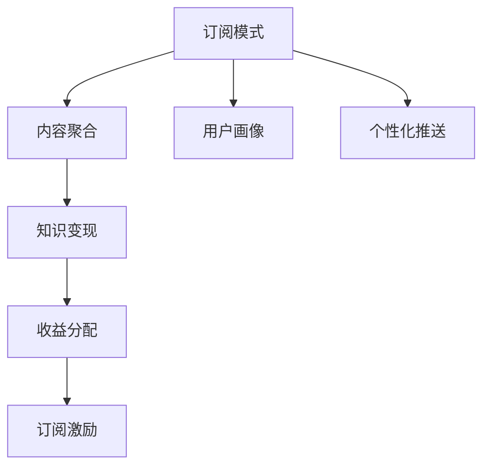

                 

# 程序员如何利用Newsletter进行知识变现

## 1. 背景介绍

在信息技术飞速发展的今天，知识的价值愈发显现，程序员通过学习不断精进自我，以适应日新月异的技术环境。而如何将这些知识变现，不仅为自己带来经济收益，也为技术的传播和交流提供了更多平台。其中，新闻通讯（Newsletter）作为一种信息传递手段，以其高效、精准、个性化的特点，为程序员提供了一个极佳的知识变现途径。

### 1.1 问题由来

互联网时代，信息过载成为了一个普遍现象。程序员面对众多技术博客、论坛、视频教程等，难以从中找到有价值的资源。而个人博客、技术社区发布的信息，由于其随意性，往往难以精准传达特定知识和经验。这种矛盾，催生了新闻通讯（Newsletter）的兴起。

### 1.2 问题核心关键点

新闻通讯利用订阅模式，将用户关注的技术信息进行整理和筛选，通过定期的、有结构的、个性化的信息推送，帮助用户更高效地获取相关知识。这种方式不仅节省了用户筛选信息的时间，也提高了内容的精准度，使得知识变现更加直接有效。

通过新闻通讯，程序员可以：
1. **精准推送：** 获取与自己技术栈和兴趣相符的技术动态。
2. **知识聚合：** 将零散的知识进行系统整理，形成结构化的学习材料。
3. **互动交流：** 通过社区互动，提升技术水平，建立网络效应。
4. **变现变现：** 在提供价值内容的同时，利用订阅费、广告费等方式实现收益。

### 1.3 问题研究意义

新闻通讯作为一种新兴的知识变现方式，具有以下几方面的研究意义：

1. **优化信息获取：** 利用技术手段，提升用户对信息的筛选和处理效率，节省时间成本。
2. **提升技术分享：** 通过系统化的内容推送，提升技术分享的质量和传播效率。
3. **构建知识网络：** 通过社区互动，构建学习者之间的知识网络，增强学习效能。
4. **实现经济价值：** 通过付费订阅、广告合作等方式，实现知识和经济价值的良性循环。

## 2. 核心概念与联系

### 2.1 核心概念概述

为更好地理解新闻通讯的知识变现机制，本节将介绍几个关键概念：

- **新闻通讯（Newsletter）**：定期向订阅用户推送结构化技术信息，帮助用户高效获取知识和经验。
- **订阅模式（Subscription Model）**：用户为获取特定内容支付订阅费，享受内容推送服务。
- **内容聚合（Content Aggregation）**：从多渠道收集信息，并进行系统化的筛选和整合。
- **知识变现（Knowledge Monetization）**：通过提供有价值的内容，实现订阅费、广告费等经济收益。

这些概念之间存在紧密的联系：
- **订阅模式**：为内容聚合和知识变现提供了付费基础。
- **内容聚合**：为订阅用户提供高质量的、系统化的技术信息。
- **知识变现**：是订阅模式和经济价值循环的关键目标。

### 2.2 核心概念原理和架构的 Mermaid 流程图



### 2.3 核心概念间的关系

**订阅模式**：
- 用户支付订阅费，获取内容推送服务。
- 订阅费用主要用于内容聚合和知识变现。

**内容聚合**：
- 通过爬虫、API等方式，从多渠道收集技术动态、技术博客、代码示例等信息。
- 对收集的信息进行筛选、整理、分类，形成结构化的推送内容。

**知识变现**：
- 通过广告、赞助、付费订阅等方式获取收益。
- 利用收益继续支持内容聚合，形成良性循环。

## 3. 核心算法原理 & 具体操作步骤

### 3.1 算法原理概述

新闻通讯的知识变现，本质上是通过内容聚合和订阅模式，实现高质量内容的持续推送和付费服务。其核心算法包括以下几个方面：

1. **订阅管理**：用户管理、订阅费设定、收费策略设计等。
2. **内容推荐**：通过算法推荐，将内容推送给用户，提升用户满意度。
3. **个性化推送**：根据用户画像，推送个性化内容，提升用户粘性。
4. **流量变现**：通过广告、赞助等形式，实现内容流量变现。

### 3.2 算法步骤详解

#### 3.2.1 订阅管理

1. **用户注册**：用户填写基本信息，完成注册。
2. **订阅设置**：用户选择订阅计划，设定订阅周期和费用。
3. **订阅支付**：用户完成支付，获得订阅权限。
4. **订阅管理**：提供取消订阅、查看订阅记录等服务。

#### 3.2.2 内容推荐

1. **内容采集**：通过爬虫、API等方式，从多渠道收集技术信息。
2. **内容筛选**：根据内容质量、相关性、时效性等标准，对收集到的信息进行筛选。
3. **内容分类**：对筛选后的内容进行分类，如技术动态、代码示例、实战教程等。
4. **内容发布**：将分类后的内容发布到新闻通讯中，供用户查看。

#### 3.2.3 个性化推送

1. **用户画像构建**：收集用户行为数据、阅读偏好、技术栈等，构建用户画像。
2. **个性化模型训练**：基于用户画像，训练个性化推荐模型。
3. **内容推送**：根据用户画像和个性化模型，推荐相关内容，并推送给用户。
4. **反馈收集**：收集用户对推送内容的反馈，优化个性化模型。

#### 3.2.4 流量变现

1. **广告展示**：在新闻通讯中插入广告，提升流量。
2. **赞助合作**：与技术公司、产品厂商等进行合作，提升内容质量。
3. **付费内容**：部分内容设置为付费，通过付费订阅实现流量变现。
4. **社区打赏**：建立社区互动机制，用户可以通过打赏支持创作者。

### 3.3 算法优缺点

新闻通讯的知识变现算法具有以下优点：

1. **高效精准**：通过订阅模式和个性化推送，提供精准的技术信息，提升用户满意度。
2. **系统化管理**：通过内容聚合和自动化管理，实现内容的高效生产和分发。
3. **持续变现**：通过多种变现手段，实现内容变现的持续性和稳定性。

同时，也存在一些缺点：

1. **用户获取难度高**：用户获取需要持续运营和推广，初期投入较高。
2. **内容质量依赖**：内容质量直接影响用户订阅意愿，内容质量控制难度较大。
3. **用户粘性不足**：订阅用户流失率高，需要不断提升内容质量和服务体验。

### 3.4 算法应用领域

新闻通讯的知识变现算法主要应用于以下领域：

1. **技术博客**：博客作者通过新闻通讯推送高质量技术文章，吸引付费订阅用户。
2. **开源社区**：开源项目维护者通过新闻通讯分享项目动态和代码示例，提升项目影响力。
3. **技术培训**：培训机构通过新闻通讯推送培训课程和实战案例，吸引学员订阅。
4. **创业公司**：创业公司通过新闻通讯推广产品和品牌，提升用户认知度。
5. **技术媒体**：媒体公司通过新闻通讯推送技术热点和深度分析，获取订阅用户。

## 4. 数学模型和公式 & 详细讲解 & 举例说明

### 4.1 数学模型构建

新闻通讯的知识变现算法涉及多个子模型，其中主要包括用户画像模型、个性化推荐模型和流量变现模型。以下将以一个简单的个性化推荐模型为例，进行详细讲解。

#### 4.1.1 用户画像模型

用户画像模型主要描述用户的技术兴趣、行为特征等，通过收集用户行为数据、阅读偏好等，构建用户画像向量 $\boldsymbol{u} = [u_1, u_2, ..., u_n]$。

#### 4.1.2 个性化推荐模型

个性化推荐模型通过计算用户画像向量 $\boldsymbol{u}$ 与内容向量 $\boldsymbol{v}$ 的相似度，推荐与用户兴趣匹配度高的内容。

假设内容向量为 $\boldsymbol{v} = [v_1, v_2, ..., v_m]$，相似度计算公式为：

$$
similarity(\boldsymbol{u}, \boldsymbol{v}) = \frac{\boldsymbol{u} \cdot \boldsymbol{v}}{\|\boldsymbol{u}\|\|\boldsymbol{v}\|}
$$

其中 $\boldsymbol{u} \cdot \boldsymbol{v}$ 为向量点乘，$\|\boldsymbol{u}\|$ 和 $\|\boldsymbol{v}\|$ 分别为向量的模长。

#### 4.1.3 流量变现模型

流量变现模型主要通过广告收入和付费订阅收入计算新闻通讯的整体收益。假设每个广告点击带来的收入为 $c$，每个付费订阅用户带来的收入为 $p$，则总收益 $R$ 为：

$$
R = \sum_{i=1}^{n} c \cdot \text{点击率}_i + \sum_{j=1}^{m} p \cdot \text{付费率}_j
$$

其中 $\text{点击率}_i$ 为广告 $i$ 的点击率，$\text{付费率}_j$ 为内容 $j$ 的付费率。

### 4.2 公式推导过程

#### 4.2.1 用户画像模型

用户画像向量 $\boldsymbol{u}$ 由用户行为数据、阅读偏好等构建，其中行为数据包括用户访问时间、阅读深度等，阅读偏好包括用户关注的技术方向、博客作者等。

假设行为数据为 $X$，阅读偏好为 $Y$，则用户画像向量 $\boldsymbol{u}$ 为：

$$
\boldsymbol{u} = \begin{bmatrix}
\boldsymbol{X} \\
\boldsymbol{Y}
\end{bmatrix}
$$

#### 4.2.2 个性化推荐模型

假设内容向量 $\boldsymbol{v}$ 由内容标题、摘要、标签等构建，则相似度计算公式为：

$$
similarity(\boldsymbol{u}, \boldsymbol{v}) = \frac{\boldsymbol{u} \cdot \boldsymbol{v}}{\|\boldsymbol{u}\|\|\boldsymbol{v}\|}
$$

其中 $\boldsymbol{u} \cdot \boldsymbol{v}$ 为向量点乘，$\|\boldsymbol{u}\|$ 和 $\|\boldsymbol{v}\|$ 分别为向量的模长。

#### 4.2.3 流量变现模型

假设每个广告点击带来的收入为 $c$，每个付费订阅用户带来的收入为 $p$，总点击次数为 $C$，付费用户数量为 $P$，则总收益 $R$ 为：

$$
R = c \cdot \frac{C}{N} + p \cdot \frac{P}{M}
$$

其中 $N$ 为总点击次数，$M$ 为总付费用户数量。

### 4.3 案例分析与讲解

假设有一个技术博客，利用新闻通讯推送高质量技术文章，进行知识变现。博客作者通过爬虫采集技术博客、代码示例等内容，并对其进行筛选、分类和整合。

1. **用户画像构建**：博客作者通过用户行为数据、阅读偏好等，构建用户画像向量 $\boldsymbol{u}$。
2. **个性化推荐模型训练**：博客作者训练个性化推荐模型，计算用户画像向量 $\boldsymbol{u}$ 与内容向量 $\boldsymbol{v}$ 的相似度，推荐相关内容。
3. **内容发布和付费**：博客作者将推荐内容发布到新闻通讯中，部分内容设置为付费，通过订阅费实现流量变现。
4. **广告展示**：博客作者在新闻通讯中插入广告，提升流量和广告收入。

## 5. 项目实践：代码实例和详细解释说明

### 5.1 开发环境搭建

在进行新闻通讯开发前，我们需要准备好开发环境。以下是使用Python进行Flask开发的环境配置流程：

1. 安装Anaconda：从官网下载并安装Anaconda，用于创建独立的Python环境。

2. 创建并激活虚拟环境：
```bash
conda create -n newsletter-env python=3.8 
conda activate newsletter-env
```

3. 安装Flask：
```bash
pip install flask
```

4. 安装其他常用工具包：
```bash
pip install numpy pandas scikit-learn flask-wtf pyyaml
```

完成上述步骤后，即可在`newsletter-env`环境中开始新闻通讯的开发实践。

### 5.2 源代码详细实现

下面是使用Flask框架开发一个简单的新闻通讯系统的代码实现：

```python
from flask import Flask, render_template, request, redirect, url_for
from flask_sqlalchemy import SQLAlchemy
from flask_wtf import FlaskForm
from wtforms import StringField, SubmitField, TextAreaField
from wtforms.validators import DataRequired

app = Flask(__name__)
app.config['SQLALCHEMY_DATABASE_URI'] = 'sqlite:///newsletter.db'
db = SQLAlchemy(app)

class User(db.Model):
    id = db.Column(db.Integer, primary_key=True)
    name = db.Column(db.String(50), nullable=False)
    email = db.Column(db.String(120), unique=True, nullable=False)
    subscription = db.Column(db.Boolean, default=False)

class Subscription(db.Model):
    id = db.Column(db.Integer, primary_key=True)
    user_id = db.Column(db.Integer, db.ForeignKey('user.id'), nullable=False)
    plan = db.Column(db.String(20), nullable=False)

class Content(db.Model):
    id = db.Column(db.Integer, primary_key=True)
    title = db.Column(db.String(100), nullable=False)
    content = db.Column(db.Text, nullable=False)
    tags = db.Column(db.String(50), nullable=False)
    publish_date = db.Column(db.DateTime, nullable=False)

@app.route('/')
def index():
    users = User.query.all()
    return render_template('index.html', users=users)

@app.route('/subscribe', methods=['GET', 'POST'])
def subscribe():
    form = SubscriptionForm()
    if form.validate_on_submit():
        user = User.query.filter_by(email=form.email.data).first()
        if user:
            user.subscription = form.plan.data
            db.session.commit()
            return redirect(url_for('index'))
        else:
            user = User(name=form.name.data, email=form.email.data)
            db.session.add(user)
            db.session.commit()
            user.subscription = form.plan.data
            db.session.commit()
            return redirect(url_for('index'))
    return render_template('subscribe.html', form=form)

class ContentForm(FlaskForm):
    title = StringField('Title', validators=[DataRequired()])
    content = TextAreaField('Content', validators=[DataRequired()])
    tags = StringField('Tags', validators=[DataRequired()])
    submit = SubmitField('Submit')

@app.route('/content', methods=['GET', 'POST'])
def content():
    form = ContentForm()
    if form.validate_on_submit():
        content = Content(title=form.title.data, content=form.content.data, tags=form.tags.data)
        db.session.add(content)
        db.session.commit()
        return redirect(url_for('index'))
    return render_template('content.html', form=form)

if __name__ == '__main__':
    app.run(debug=True)
```

这个简单的Flask应用实现了基本的用户管理、订阅管理、内容发布等功能。接下来，我们将逐步优化和扩展这些功能，以实现更加完善的新闻通讯系统。

### 5.3 代码解读与分析

让我们再详细解读一下关键代码的实现细节：

**User类**：
- 定义了用户的基本信息，包括ID、姓名、邮箱和订阅状态。

**Subscription类**：
- 定义了用户的订阅计划，包括ID、用户ID和订阅计划名称。

**Content类**：
- 定义了新闻通讯的内容，包括ID、标题、内容、标签和发布日期。

**index路由**：
- 获取所有用户信息，并展示在页面上。

**subscribe路由**：
- 实现用户订阅功能，如果用户已经存在，更新订阅状态；如果用户不存在，新增用户并设置订阅状态。

**content路由**：
- 实现内容发布功能，如果用户已订阅，允许发布内容；如果用户未订阅，提示用户先订阅。

**ContentForm类**：
- 定义了内容发布的表单，包括标题、内容和标签。

这些代码实现了新闻通讯系统的主要功能，包括用户管理、订阅管理和内容发布。通过进一步优化和扩展，可以实现更多高级功能，如内容推荐、个性化推送、流量变现等。

## 6. 实际应用场景

### 6.1 智能客服系统

基于新闻通讯的知识变现，智能客服系统可以通过向用户推送高质量的客服手册、常见问题解答等内容，帮助用户快速解决常见问题。智能客服系统可以利用订阅费和广告费实现盈利，并通过用户反馈持续优化内容质量。

### 6.2 在线教育平台

在线教育平台可以利用新闻通讯推送高质量的课程内容和实战案例，提升用户的学习效果和满意度。平台可以通过订阅费、广告费和课程购买等多种方式实现变现。

### 6.3 技术博客和社区

技术博客和社区可以利用新闻通讯推送高质量的技术文章、代码示例和社区动态，吸引用户订阅。通过订阅费和广告费实现盈利，提升平台的影响力和内容质量。

### 6.4 未来应用展望

随着技术的发展，新闻通讯的知识变现将变得更加多样化和智能化。未来的新闻通讯可以：

1. **多模态内容推送**：结合文本、图片、视频等多模态内容，提升用户体验。
2. **个性化推荐系统**：利用深度学习算法，实现更精准的内容推荐。
3. **智能广告投放**：利用大数据和机器学习，实现智能广告投放，提高广告效果。
4. **社交互动**：加入社交功能，提升用户粘性和社区互动效果。
5. **区块链技术**：利用区块链技术，确保内容发布和付费的透明性和安全性。

这些创新将使得新闻通讯的知识变现更加高效、智能和可靠，为用户带来更好的体验和价值。

## 7. 工具和资源推荐

### 7.1 学习资源推荐

为了帮助开发者系统掌握新闻通讯的知识变现理论基础和实践技巧，这里推荐一些优质的学习资源：

1. **《深入理解新闻通讯》系列博文**：由技术博客作者撰写，深入浅出地介绍了新闻通讯的理论基础和实践技巧，适合技术爱好者和开发者阅读。
2. **《新闻通讯开发实战》课程**：由在线教育平台提供，涵盖新闻通讯的各个方面，包括开发环境搭建、前端设计、后端开发等。
3. **《新闻通讯实战》书籍**：深度讲解新闻通讯的开发、运营和变现各个环节，适合有一定技术基础的开发者阅读。

通过对这些资源的学习实践，相信你一定能够快速掌握新闻通讯的知识变现机制，并用于解决实际的开发问题。

### 7.2 开发工具推荐

高效的开发离不开优秀的工具支持。以下是几款用于新闻通讯开发的工具：

1. **Flask**：Python的轻量级Web框架，易于上手，支持快速开发和部署。
2. **SQLAlchemy**：Python的ORM框架，支持多种数据库，方便进行数据管理。
3. **WTForms**：Python的表单处理库，支持多种表单验证方式。
4. **Flask-WTF**：Flask和WTForms的结合，方便进行表单处理和验证。
5. **Jupyter Notebook**：数据处理和模型验证的理想工具，支持代码、文本和图表的结合展示。

这些工具可以显著提升新闻通讯开发的效率，使开发者能够更专注于业务逻辑和用户体验的设计。

### 7.3 相关论文推荐

新闻通讯的知识变现技术源于学界的持续研究。以下是几篇奠基性的相关论文，推荐阅读：

1. **《新闻通讯的开发和运营》**：详细介绍了新闻通讯的开发流程和运营策略，为新闻通讯的成功提供了理论支持。
2. **《新闻通讯的用户留存与变现》**：探讨了新闻通讯的用户留存和变现策略，为内容运营提供了实践指导。
3. **《新闻通讯的个性化推荐系统》**：介绍了基于深度学习的新闻通讯个性化推荐系统，为新闻通讯的内容推荐提供了技术支持。

这些论文代表了大新闻通讯知识变现技术的发展脉络。通过学习这些前沿成果，可以帮助研究者把握学科前进方向，激发更多的创新灵感。

## 8. 总结：未来发展趋势与挑战

### 8.1 研究成果总结

本文对新闻通讯的知识变现机制进行了全面系统的介绍。首先阐述了新闻通讯的技术背景和应用价值，明确了新闻通讯在知识变现中的独特作用。其次，从原理到实践，详细讲解了新闻通讯的知识变现算法，包括订阅管理、内容推荐、个性化推送和流量变现等方面，给出了新闻通讯开发的全流程代码实现。同时，本文还广泛探讨了新闻通讯在智能客服、在线教育、技术博客等多个行业领域的应用前景，展示了新闻通讯的知识变现潜力。最后，本文精选了新闻通讯的知识变现技术的学习资源，力求为读者提供全方位的技术指引。

### 8.2 未来发展趋势

展望未来，新闻通讯的知识变现技术将呈现以下几个发展趋势：

1. **技术融合**：与大数据、人工智能等技术深度融合，提升新闻通讯的智能化和个性化水平。
2. **多元化内容**：结合多模态内容，提供更加丰富、多样的阅读体验。
3. **社区互动**：加入社交功能，提升用户粘性和社区互动效果。
4. **智能广告**：利用大数据和机器学习，实现智能广告投放，提高广告效果。
5. **区块链技术**：利用区块链技术，确保内容发布和付费的透明性和安全性。

这些趋势将使得新闻通讯的知识变现更加高效、智能和可靠，为用户带来更好的体验和价值。

### 8.3 面临的挑战

尽管新闻通讯的知识变现技术已经取得了一定成果，但在迈向更加智能化、普适化应用的过程中，仍面临诸多挑战：

1. **内容质量控制**：内容质量直接影响用户订阅意愿，内容质量控制难度较大。
2. **用户获取难度高**：用户获取需要持续运营和推广，初期投入较高。
3. **用户粘性不足**：订阅用户流失率高，需要不断提升内容质量和服务体验。
4. **广告效果不确定**：广告投放效果难以预测，需要持续优化和调整。

### 8.4 研究展望

面对新闻通讯知识变现面临的挑战，未来的研究需要在以下几个方面寻求新的突破：

1. **内容质量优化**：通过算法和人工审核，提升内容质量，增强用户订阅意愿。
2. **用户获取策略**：利用社交媒体、搜索引擎优化等手段，提升用户获取效率。
3. **用户留存策略**：通过个性化推送、社区互动等手段，提升用户粘性。
4. **智能广告投放**：利用大数据和机器学习，实现智能广告投放，提高广告效果。

这些研究方向将进一步推动新闻通讯的知识变现技术，使其在更广阔的领域得到应用。

## 9. 附录：常见问题与解答

**Q1：新闻通讯如何确保内容质量？**

A: 内容质量是新闻通讯的核心，确保内容质量需要从多个方面入手：
1. **内容筛选**：通过人工审核、算法筛选等方式，确保内容质量。
2. **社区互动**：通过用户反馈，及时发现和修正错误内容。
3. **专家评审**：邀请行业专家对内容进行评审，提升内容权威性。

**Q2：如何提升用户订阅意愿？**

A: 提升用户订阅意愿需要从多个方面入手：
1. **内容质量**：提供高质量、有价值的内容，吸引用户订阅。
2. **个性化推送**：根据用户画像，推送个性化内容，提升用户满意度。
3. **用户互动**：通过社区互动、问答等形式，增强用户粘性。
4. **广告推荐**：通过个性化广告，提升用户订阅意愿。

**Q3：新闻通讯的流量变现如何实现？**

A: 新闻通讯的流量变现主要通过广告和付费订阅实现：
1. **广告变现**：在新闻通讯中插入广告，提升流量。
2. **付费订阅**：部分内容设置为付费，通过订阅费实现流量变现。
3. **社区打赏**：建立社区互动机制，用户可以通过打赏支持创作者。

这些变现手段需要合理搭配，形成良性循环，实现新闻通讯的可持续发展。

**Q4：如何优化用户获取和留存策略？**

A: 优化用户获取和留存策略需要从多个方面入手：
1. **多渠道推广**：通过社交媒体、搜索引擎优化等手段，提升用户获取效率。
2. **个性化推荐**：根据用户画像，推送个性化内容，提升用户满意度。
3. **社区互动**：通过社区互动、问答等形式，增强用户粘性。
4. **智能广告**：利用大数据和机器学习，实现智能广告投放，提高广告效果。

这些策略需要持续优化和调整，才能达到最佳效果。

---

作者：禅与计算机程序设计艺术 / Zen and the Art of Computer Programming

