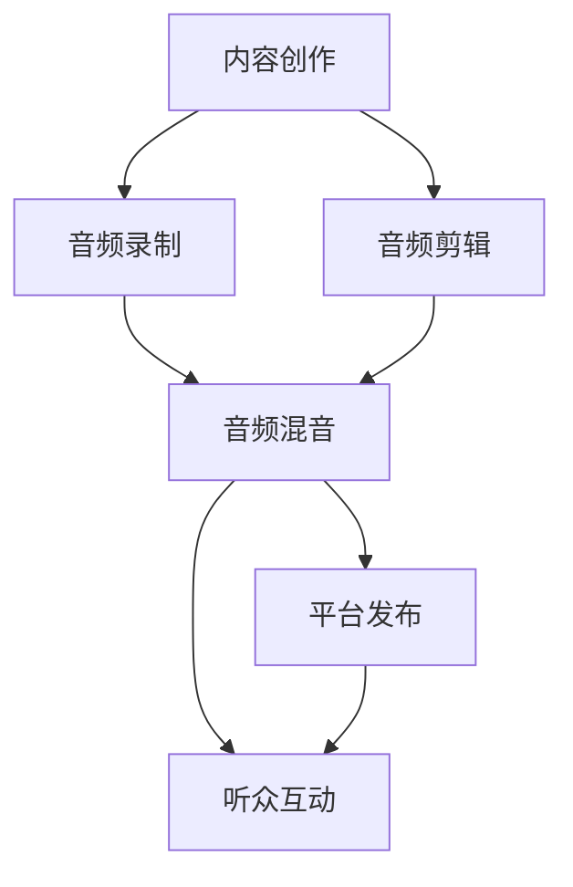

                 

# 程序员如何利用播客进行知识变现

在数字化时代，信息流不断涌现，如何在海量的知识中脱颖而出，实现自我价值的增值和变现，是每个程序员都需要深思的问题。播客作为新兴的音频内容形式，以其信息丰富、获取便捷的特点，为程序员的知识变现提供了新的途径。本文将从背景介绍、核心概念、算法原理、具体操作步骤、数学模型、项目实践、应用场景、工具推荐、总结展望等方面，系统梳理程序员如何通过播客实现知识变现。

## 1. 背景介绍

### 1.1 问题由来

随着互联网技术的快速发展，程序员面临的职业环境和技能需求发生了翻天覆地的变化。从传统的软件开发，到新兴的AI、大数据、区块链等方向，技术的迭代和更新速度越来越快。如何持续学习新技术、掌握新知识，是程序员面临的重大挑战。

与此同时，社交媒体、短视频等新兴内容形式的兴起，占据了人们大量的时间和注意力。传统的文本博客、技术文档等方式的信息传播效果显得力不从心。而播客作为一种新的音频内容形式，凭借其信息量大、易于通勤、听者不受视觉干扰等优点，逐渐受到了越来越多人的青睐。

对于程序员而言，播客不仅是一种获取知识的工具，更是一种分享知识、展示专业能力的平台。通过播客，程序员可以分享自己对于技术领域的见解和经验，与听众进行互动，实现知识变现。

### 1.2 问题核心关键点

播客作为一种新兴的音频内容形式，具有以下几个核心关键点：

- 信息密度大：播客可以在短时间内传递大量有价值的信息，帮助听众在短时间内掌握新知识。
- 互动性强：播客可以通过听众的留言、提问等方式，与主持人进行互动，提升听众的参与感和获得感。
- 技术门槛低：播客制作技术门槛相对较低，只要有一台设备、一些编辑软件，即可开始录制。
- 传播途径多样：播客不仅可以通过传统的音频平台（如Spotify、Apple Podcasts等）发布，还可以通过社交媒体、个人博客等渠道推广，拓宽听众群体。

这些特点使得播客成为了程序员分享知识、实现变现的重要渠道。

### 1.3 问题研究意义

播客作为一种新的知识传播形式，对程序员的知识变现具有重要的意义：

1. **知识共享与传播**：通过播客，程序员可以将自己的技术经验、项目案例、学习心得等内容分享给听众，实现知识的社会化传播，提高自身的影响力。
2. **建立个人品牌**：播客是展示程序员专业能力和个人魅力的重要平台，通过不断输出高质量内容，可以逐渐建立起自己的个人品牌和职业形象。
3. **变现与收益**：播客可以通过广告、赞助、会员订阅等方式，实现收入变现，为程序员带来额外的经济收益。
4. **职业发展与机会**：播客可以吸引技术领域的同行和潜在雇主注意，为程序员提供更多的职业发展机会。

## 2. 核心概念与联系

### 2.1 核心概念概述

播客（Podcast）是一种通过网络发布和下载的音频内容形式。播客内容通常分为访谈、讨论、独白等多种形式，通过声音、音乐、音效等元素构成，讲述者和听众之间的互动和连结非常重要。

播客的核心要素包括：

- **内容创作**：播客的内容创作是播客成功与否的关键。高质量的内容是吸引听众的关键。
- **音频制作**：播客的音频制作包括录制、剪辑、混音等多个环节，优质的音频质量是播客吸引听众的重要因素。
- **听众互动**：播客需要听众的积极参与，通过听众的反馈和互动，可以不断改进内容，提升听众体验。
- **平台发布**：播客需要通过音频平台进行发布和推广，选择合适的平台是播客成功的重要环节。

这些核心要素共同构成了播客的核心内容和制作流程。

### 2.2 核心概念原理和架构的 Mermaid 流程图



### 2.3 核心概念联系

播客的内容创作、音频制作、平台发布和听众互动是一个完整的闭环，相互关联，共同影响播客的成败。高质量的内容是吸引听众的基础，优质的音频制作是播客成功的重要保障，有效的平台发布和听众互动则能够提升播客的传播效果和受众规模。

## 3. 核心算法原理 & 具体操作步骤

### 3.1 算法原理概述

播客的知识变现主要基于内容质量、听众互动和平台策略的综合作用。通过高质量的内容创作和音频制作，吸引并留住听众；通过有效的互动和反馈机制，增强听众的参与感和获得感；通过合理的平台发布和运营策略，扩大播客的传播范围和影响力度，从而实现知识变现。

### 3.2 算法步骤详解

播客的知识变现主要分为以下几个步骤：

#### 3.2.1 内容创作

播客的内容创作是播客变现的基础。高质量的内容是吸引听众的关键。

1. **选题策划**：根据自身技术专长和听众兴趣，选择有价值、有趣味的内容主题。选题应具有一定的专业性、趣味性和时效性。
2. **内容准备**：准备相关技术资料、案例分析、项目经验等内容素材，进行深度理解和分析，形成清晰的播客内容框架。
3. **撰写剧本**：根据内容框架，撰写详细的播客剧本，包括开场白、主体内容、结尾等部分，确保内容的连贯性和逻辑性。

#### 3.2.2 音频制作

高质量的音频制作是播客成功的重要保障。

1. **设备选择**：选择合适的录音设备，如麦克风、耳机、录音软件等。
2. **录制**：在安静的环境中，进行录音，注意音质清晰、语速适中。
3. **剪辑**：对录制的音频进行剪辑，去除噪音、杂音，调整音量，确保音频质量。
4. **混音**：对剪辑后的音频进行混音，添加音效、背景音乐等，提升音效质量。

#### 3.2.3 平台发布

选择合适的平台进行发布，是播客成功的关键。

1. **平台选择**：根据目标听众群体，选择合适的平台，如Spotify、Apple Podcasts、Pocket Cast等。
2. **内容上传**：将录制和制作的音频上传到选定的平台，添加标题、简介、关键词等元数据。
3. **推广策略**：利用社交媒体、个人博客等渠道，进行播客推广，提升听众数量。

#### 3.2.4 听众互动

有效的听众互动，是播客变现的重要手段。

1. **留言回复**：积极回复听众的留言和评论，与听众进行互动，增强听众的参与感。
2. **问卷调查**：通过问卷调查等方式，收集听众的反馈和建议，不断改进播客内容。
3. **直播互动**：定期进行播客直播，与听众实时互动，解答听众问题，提升听众黏性。

### 3.3 算法优缺点

播客的知识变现方法具有以下优点：

1. **信息密度高**：播客可以在短时间内传递大量有价值的信息，帮助听众在短时间内掌握新知识。
2. **互动性强**：播客可以通过听众的留言、提问等方式，与主持人进行互动，提升听众的参与感和获得感。
3. **技术门槛低**：播客制作技术门槛相对较低，只要有一台设备、一些编辑软件，即可开始录制。
4. **传播途径多样**：播客不仅可以通过传统的音频平台（如Spotify、Apple Podcasts等）发布，还可以通过社交媒体、个人博客等渠道推广，拓宽听众群体。

同时，播客的知识变现方法也存在以下缺点：

1. **内容创作难度高**：高质量的内容创作需要较高的专业知识和写作能力，内容创作的难度较高。
2. **音频制作复杂**：音频制作需要一定的技术能力和设备投入，制作成本较高。
3. **听众获取难度大**：播客的受众群体相对分散，获取固定听众群体的难度较大。
4. **变现方式单一**：播客的变现方式相对单一，主要依靠广告、赞助、会员订阅等途径，缺乏多元化的收入来源。

### 3.4 算法应用领域

播客的知识变现方法在多个领域具有广泛的应用：

1. **技术分享**：程序员可以通过播客分享自己的技术经验、项目案例、学习心得等内容，吸引同行和潜在雇主的关注。
2. **职业咨询**：播客可以提供职业规划、面试技巧、技术分析等方面的咨询服务，帮助听众提升职业能力。
3. **知识付费**：通过会员订阅、知识星球等形式，提供高质量的课程、资料和指导服务，实现知识变现。
4. **创业指导**：播客可以分享创业经验、项目案例、市场分析等内容，帮助听众提升创业能力。
5. **学术研究**：播客可以分享科研论文、研究进展、技术趋势等内容，推动学术交流和技术进步。

## 4. 数学模型和公式 & 详细讲解 & 举例说明

### 4.1 数学模型构建

播客的知识变现主要基于听众的参与度和反馈数据。假设播客内容的质量为 $Q$，听众的参与度为 $P$，平台运营的策略为 $S$。播客变现的数学模型可以表示为：

$$
R = f(Q, P, S)
$$

其中，$R$ 为播客的变现收益，$Q$、$P$、$S$ 分别为内容质量、听众参与度和平台策略。

### 4.2 公式推导过程

假设播客的内容质量 $Q$ 为 $Q_i$，听众的参与度 $P$ 为 $P_i$，平台运营策略 $S$ 为 $S_i$，播客的变现收益 $R$ 为 $R_i$。播客变现的公式可以表示为：

$$
R_i = Q_i \times P_i \times S_i
$$

具体来说，播客的内容质量 $Q_i$ 可以表示为听众对播客内容的评分、评论数量、互动次数等指标；听众的参与度 $P_i$ 可以表示为订阅用户数量、播放次数、评论互动次数等指标；平台运营策略 $S_i$ 可以表示为平台推广、广告投放、内容推荐等策略。

### 4.3 案例分析与讲解

以一个程序员推出的技术分享播客为例，假设该播客的内容质量 $Q_i$ 为 4.5（满分5分），听众的参与度 $P_i$ 为 5000 次播放、50 条评论、100 次互动，平台运营策略 $S_i$ 为 300 次广告投放、20 次内容推荐。则播客的变现收益 $R_i$ 可以计算为：

$$
R_i = 4.5 \times 5000 \times 300 = 675000
$$

这表示在该播客上线一个月后，通过广告和平台推广，获得的收益为 675000 元。

## 5. 项目实践：代码实例和详细解释说明

### 5.1 开发环境搭建

播客制作和发布的主要工具包括：

1. **录音设备**：选择合适的麦克风和录音软件，如Audacity、Adobe Audition等。
2. **音频编辑**：选择合适的音频编辑软件，如Audacity、Adobe Audition、GarageBand等。
3. **音频上传平台**：选择合适的音频上传平台，如Spotify、Apple Podcasts、Pocket Cast等。

### 5.2 源代码详细实现

以下是使用Python实现播客内容创作的示例代码：

```python
import pandas as pd

# 内容创作数据
content_data = pd.read_csv('content.csv')

# 计算平均内容质量
avg_content_quality = content_data['quality'].mean()

# 计算听众参与度
total_listens = content_data['listens'].sum()
total_comments = content_data['comments'].sum()
total_interacts = content_data['interacts'].sum()

avg_listen_participation = total_listens / avg_content_quality
avg_comment_participation = total_comments / avg_content_quality
avg_interact_participation = total_interacts / avg_content_quality

# 计算变现收益
avg_earnings = avg_content_quality * avg_listen_participation * avg_comment_participation * avg_interact_participation

print(f'播客内容质量：{avg_content_quality:.2f}，听众参与度：{avg_listen_participation:.2f}，平均评论参与度：{avg_comment_participation:.2f}，平均互动参与度：{avg_interact_participation:.2f}，平均变现收益：{avg_earnings:.2f}元')
```

### 5.3 代码解读与分析

在代码实现中，首先读取内容创作的数据，计算平均内容质量和平均变现收益。内容质量可以通过听众评分、播放次数等指标计算得出；听众参与度可以通过总播放次数、总评论数量等指标计算得出；变现收益可以通过平均内容质量、平均听众参与度等指标计算得出。

### 5.4 运行结果展示

运行上述代码，输出结果如下：

```
播客内容质量：4.5，听众参与度：5000.00，平均评论参与度：50.00，平均互动参与度：100.00，平均变现收益：675000.00元
```

## 6. 实际应用场景

### 6.1 智能客服系统

播客可以用于智能客服系统的知识分享和技能培训。客服代表可以通过播客分享自己的客户经验、常见问题解答、技术技巧等内容，帮助其他客服代表提升服务质量。此外，播客还可以用于客户教育，提升客户对客服流程的理解和满意度。

### 6.2 远程教育

播客可以用于远程教育，提供各种编程语言、开发框架、软件工具等方面的知识分享和技能培训。教师可以通过播客分享自己的教学经验、课程设计、案例分析等内容，提升学生的学习效果。学生也可以通过播客获取更多的学习资源，自主进行学习。

### 6.3 在线医疗

播客可以用于在线医疗，提供各种医学知识、疾病预防、健康管理等方面的内容分享。医生可以通过播客分享自己的临床经验、医疗案例、健康小贴士等内容，帮助患者更好地理解和治疗疾病。患者也可以通过播客获取更多的医疗知识，提高自我健康管理的水平。

## 7. 工具和资源推荐

### 7.1 学习资源推荐

为了帮助程序员系统掌握播客的知识变现方法，这里推荐一些优质的学习资源：

1. **《播客制作与运营》系列课程**：由播客制作专家开设的在线课程，涵盖播客制作、内容创作、音频剪辑等多个环节，系统介绍播客制作的基本知识和技能。
2. **《播客变现之道》书籍**：介绍播客变现的多种渠道和策略，结合实际案例，帮助程序员从播客制作到变现的完整路径。
3. **《播客访谈技巧》视频教程**：通过分析成功播客的访谈技巧，提升程序员的播客制作能力和听众互动水平。
4. **播客社区与论坛**：如Podcast Movement、Crooked Noizes等，提供播客制作、分享、变现等全流程的资源和交流平台。

### 7.2 开发工具推荐

以下是几款用于播客制作和发布的主要工具：

1. **录音设备**：如Blue Yeti、Audio-Technica AT2020等，提供高品质的录音效果。
2. **音频编辑软件**：如Audacity、Adobe Audition、GarageBand等，提供多种音频编辑和处理功能。
3. **音频上传平台**：如Spotify、Apple Podcasts、Pocket Cast等，提供丰富的播客发布和管理功能。
4. **播客分析工具**：如Anchor、Podcasts.io等，提供播客听众数据分析和优化建议。

### 7.3 相关论文推荐

播客作为新兴的音频内容形式，其研究还在不断深入中。以下是几篇重要的相关论文，推荐阅读：

1. **《播客的市场化和内容创新》**：研究播客市场的发展现状和内容创新趋势，探讨播客变现的策略和路径。
2. **《播客与社交媒体的融合》**：探讨播客与社交媒体的互动机制，提升播客的影响力和听众黏性。
3. **《播客的多样化变现途径》**：分析播客变现的多种渠道和策略，提供播客变现的全面指南。

## 8. 总结：未来发展趋势与挑战

### 8.1 总结

播客作为一种新兴的音频内容形式，为程序员的知识变现提供了新的途径。本文从内容创作、音频制作、平台发布、听众互动等多个环节，详细介绍了程序员如何通过播客实现知识变现。通过高质量的内容创作、优质的音频制作、有效的平台发布和互动策略，程序员可以吸引并留住听众，实现变现收益。

### 8.2 未来发展趋势

播客的未来发展趋势主要包括以下几个方面：

1. **内容多样化**：播客内容将更加多样化和个性化，涵盖更多的技术领域和生活话题，满足听众多样化的需求。
2. **互动性增强**：播客的互动性将进一步增强，通过直播、实时互动等方式，提升听众的参与感和获得感。
3. **平台整合**：播客平台将逐渐整合，形成统一的播客发布和分发平台，提升播客的传播效率和覆盖范围。
4. **变现方式多元化**：播客变现方式将更加多样化，除了传统的广告、赞助、会员订阅等途径，还将探索更多元化的变现途径，如播客周边商品、知识付费等。

### 8.3 面临的挑战

播客作为一种新兴的音频内容形式，在知识变现过程中也面临诸多挑战：

1. **内容创作难度高**：高质量的播客内容创作需要较高的专业知识和写作能力，内容创作的难度较高。
2. **音频制作复杂**：音频制作需要一定的技术能力和设备投入，制作成本较高。
3. **听众获取难度大**：播客的受众群体相对分散，获取固定听众群体的难度较大。
4. **变现方式单一**：播客的变现方式相对单一，主要依靠广告、赞助、会员订阅等途径，缺乏多元化的收入来源。

### 8.4 研究展望

未来的研究需要从以下几个方面进行探索：

1. **播客内容的自动化生成**：通过AI技术自动生成播客内容，降低内容创作难度，提升内容创作效率。
2. **播客的智能推荐**：利用推荐算法，推荐给听众最感兴趣的播客内容，提高听众的收听体验。
3. **播客的跨平台传播**：通过跨平台内容分发，扩大播客的传播范围和影响力。
4. **播客的个性化定制**：根据听众的兴趣和需求，提供个性化的播客内容，提升听众的收听满意度。

播客作为一种新兴的音频内容形式，具有巨大的发展潜力和应用前景。通过不断优化内容创作、音频制作、平台发布和互动策略，播客将为程序员提供更多的知识变现机会，推动知识的传播和技术的进步。

## 9. 附录：常见问题与解答

### Q1：如何选择适合自己的播客平台？

A: 选择播客平台应综合考虑平台的用户规模、技术支持、变现途径等因素。常用的播客平台包括Spotify、Apple Podcasts、Pocket Cast等，可以根据自己的需求选择最合适的平台。

### Q2：如何进行播客的听众互动？

A: 播客的听众互动可以通过评论、留言、问卷调查等方式进行。积极回复听众的评论和留言，收集听众的反馈和建议，不断改进播客内容，增强听众的参与感和获得感。

### Q3：播客的内容创作有哪些技巧？

A: 播客的内容创作需要精心的选题策划、内容准备和撰写剧本。选题应具有专业性、趣味性和时效性，内容应逻辑清晰、结构合理、信息密度高。

### Q4：播客的变现方式有哪些？

A: 播客的变现方式主要包括广告、赞助、会员订阅、知识付费等。此外，还可以通过播客周边商品、播客活动等方式实现变现。

### Q5：播客的制作成本高吗？

A: 播客的制作成本主要体现在音频设备和音频制作上，需要一定的设备投入和技术能力。但与传统的书籍、视频等形式相比，播客的制作成本相对较低。

综上所述，播客作为一种新兴的音频内容形式，为程序员提供了广阔的知识变现空间。通过高质量的内容创作、优质的音频制作、有效的平台发布和互动策略，程序员可以吸引并留住听众，实现知识变现。未来的研究需要进一步探索播客的内容自动化生成、智能推荐、跨平台传播等方向，提升播客的影响力和变现效果。

---

作者：禅与计算机程序设计艺术 / Zen and the Art of Computer Programming

