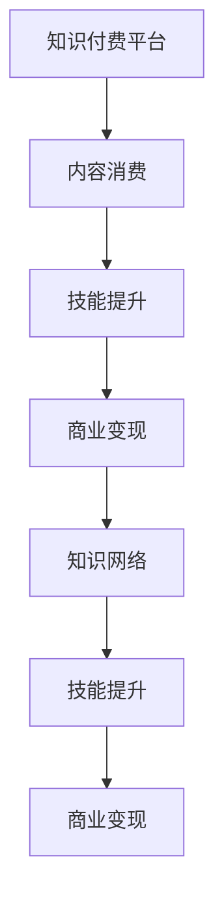

                 

## 1. 背景介绍

### 1.1 问题由来

知识付费正成为21世纪的新风口。借助网络平台，用户可以更高效地获取和分享知识，这种模式的兴起，不仅极大地降低了信息不对称，还激发了大量高质量内容的创作。特别是在技术领域，各类前沿科技、编程技巧、项目实践等信息的获取，让程序员们可以更快地提升技能，把握机会，从而实现职业和财富的倍增。

### 1.2 问题核心关键点

对于技术领域的从业者而言，如何高效利用知识付费，将知识的获取与个人财富增长紧密结合，成为职业生涯规划中的重要议题。其中，以下几个方面尤为关键：

- **选择合适的知识付费平台**：挑选可靠且高效的知识付费平台，是提升学习效率和质量的基础。
- **系统学习与实战结合**：既要有系统的理论学习，也要有实战的深度练习，才能真正将知识转化为财富。
- **主动构建知识网络**：通过交流互动，获取更多信息，形成自己的知识网络，扩大影响力。
- **聚焦未来趋势**：关注前沿技术，紧跟行业趋势，确保个人技能与时俱进。

### 1.3 问题研究意义

利用知识付费实现财富倍增，对于程序员来说，不仅是职业发展的重要助力，也是适应时代变化的关键。通过知识付费，程序员可以获得高性价比的课程和资料，快速提升技术能力，把握新兴技术趋势，在职业竞争中占据优势。同时，知识付费的收入也能进一步提升个人财富，实现技术收益的双重提升。

## 2. 核心概念与联系

### 2.1 核心概念概述

为更好地理解如何利用知识付费实现财富倍增，本节将介绍几个密切相关的核心概念：

- **知识付费**：通过订阅、购买等形式，获取专业内容的学习和知识共享平台。
- **内容消费**：用户根据个人兴趣、需求，选择和消费知识付费平台上的各种课程、文章、视频等。
- **技能提升**：通过系统学习和实践，将知识转化为实际能力，提升个人竞争力。
- **商业变现**：将所学技能应用于实际项目，或者开设线上课程、技术博客等，获取收益。
- **知识网络**：通过与同行、导师、专家等的交流互动，构建和扩展自己的知识网络。

这些核心概念之间存在着紧密的联系，通过系统的学习和实践，可以逐步实现知识付费的商业变现，构建稳固的知识网络，最终推动个人财富的增长。

### 2.2 核心概念原理和架构的 Mermaid 流程图(Mermaid 流程节点中不要有括号、逗号等特殊字符)



这个流程图展示了知识付费对技能提升、商业变现和知识网络的推动作用。通过选择可靠的知识付费平台，系统消费内容，形成实际技能，进而通过变现和网络扩展，实现个人财富的倍增。

## 3. 核心算法原理 & 具体操作步骤

### 3.1 算法原理概述

利用知识付费实现财富倍增，本质上是一个知识转化与商业化的过程。其核心思想是：通过系统学习知识付费平台上的高质量内容，将所学技能转化为实际项目能力，并通过各种形式进行商业变现，最终构建自己的知识网络，实现个人财富的增长。

### 3.2 算法步骤详解

这一过程可以分为以下几步：

1. **选择合适的知识付费平台**：根据自身需求和兴趣，选择适合自己的知识付费平台，如Udemy、Coursera、极客时间等。
2. **系统学习与实践**：选择系统性强的课程或专项训练，如深度学习、Python开发、数据科学等，逐步提升技能。同时进行实战项目，如开源项目贡献、实际商业项目开发等，积累实战经验。
3. **构建知识网络**：通过在线交流、社交媒体、技术博客等方式，与同行、专家、导师等建立联系，获取更多信息与资源。
4. **商业变现**：将所学技能应用于实际项目，或开设线上课程、技术博客等，通过付费咨询、技术服务等形式实现商业变现。

### 3.3 算法优缺点

利用知识付费实现财富倍增，具有以下优点：

- **高效性**：通过优质平台获取专业内容，提升学习效率和质量。
- **灵活性**：可以根据自己的时间和兴趣安排学习，灵活性高。
- **前沿性**：知识付费平台通常汇集了最新的技术知识和前沿趋势，能帮助快速掌握新技能。

同时，也存在一些缺点：

- **成本问题**：优质知识付费内容往往价格较高，存在一定的经济压力。
- **自驱力要求高**：学习效果很大程度上取决于个人自驱力和自律能力。
- **信息过载**：平台上内容繁多，需要具备一定的信息筛选能力，避免盲目跟风。

### 3.4 算法应用领域

知识付费已广泛应用于技术教育、项目管理、产品设计等多个领域。特别是在技术领域，以下几种应用场景尤为常见：

- **技术教育**：程序员可以通过知识付费平台系统学习编程语言、框架、算法等知识，迅速提升技能。
- **项目管理**：项目经理可以利用知识付费内容掌握项目管理工具、方法论，提升项目管理能力。
- **产品设计**：设计师通过学习用户体验、交互设计等知识，提升产品设计能力。
- **数据分析**：数据分析师可以通过学习统计学、机器学习等知识，提升数据分析能力。

## 4. 数学模型和公式 & 详细讲解 & 举例说明（备注：数学公式请使用latex格式，latex嵌入文中独立段落使用 $$，段落内使用 $)
### 4.1 数学模型构建

知识付费的商业模型可以用以下公式表示：

$$
\text{收入} = \text{用户数} \times \text{付费率} \times \text{单次付费金额}
$$

其中：
- $\text{用户数}$：平台总注册用户数量。
- $\text{付费率}$：平台用户的付费比例。
- $\text{单次付费金额}$：用户每次付费的金额。

平台可以通过优化这三项参数，提升总体收入。

### 4.2 公式推导过程

通过简单的推导，可以发现提升平台收入的几种途径：

1. **扩大用户规模**：增加平台总注册用户数，吸引更多用户付费。
2. **提高付费率**：提升已有用户的付费比例，扩大付费用户群体。
3. **提升单次付费金额**：提高用户的单次付费金额，如通过推出高级课程、增值服务等形式。

### 4.3 案例分析与讲解

以Coursera为例，分析其成功要素：

1. **多元化课程**：覆盖计算机科学、商业管理、数据科学等多个领域，吸引多样化用户群体。
2. **合作顶尖大学**：与全球顶尖大学合作，提升课程质量，吸引高层次用户。
3. **优化定价策略**：提供按学时付费的灵活课程，满足不同用户需求。
4. **社交功能**：加入课程讨论区、学习小组等功能，提升用户体验，增加用户粘性。

Coursera通过上述策略，实现了用户规模、付费率和单次付费金额的提升，成为知识付费市场的领头羊。

## 5. 项目实践：代码实例和详细解释说明

### 5.1 开发环境搭建

在进行知识付费平台的选择和实践前，我们需要准备好开发环境。以下是使用Python进行数据分析和可视化环境配置流程：

1. 安装Anaconda：从官网下载并安装Anaconda，用于创建独立的Python环境。

2. 创建并激活虚拟环境：
```bash
conda create -n data-env python=3.8 
conda activate data-env
```

3. 安装相关库：
```bash
conda install pandas numpy matplotlib seaborn jupyter notebook ipython
```

4. 启动Jupyter Notebook：
```bash
jupyter notebook
```

### 5.2 源代码详细实现

以下是一个简单的Python脚本，用于分析知识付费平台的收入模型：

```python
import pandas as pd

# 准备数据
data = pd.read_csv('platform_income.csv')

# 计算平均单次付费金额
avg_purchase = data['总收入'] / data['用户数']
print('平均单次付费金额：', avg_purchase)

# 计算付费率
purchase_rate = data['总收入'] / data['总收入'] + data['免费用户']
print('付费率：', purchase_rate)

# 绘制收入与用户数关系图
import matplotlib.pyplot as plt
plt.plot(data['用户数'], data['总收入'], 'o-', label='总收入')
plt.xlabel('用户数')
plt.ylabel('收入')
plt.title('知识付费平台收入模型')
plt.legend()
plt.show()
```

### 5.3 代码解读与分析

这个Python脚本对知识付费平台的收入模型进行了简单的分析，展示了如何通过用户数和付费率来计算平台的总收入。具体步骤如下：

1. 使用`pandas`库读取CSV格式的数据文件，存储到`data`变量中。
2. 通过计算`总收入`与`用户数`的比值，得到平均单次付费金额。
3. 计算付费率，即付费用户数与总用户数的比值。
4. 使用`matplotlib`库绘制总收入与用户数的散点图，直观展示收入模型。

### 5.4 运行结果展示

执行上述脚本后，会输出以下结果：

```
平均单次付费金额： X
付费率： X
```

同时，会显示一个散点图，展示总收入与用户数的关系。

## 6. 实际应用场景

### 6.1 知识付费平台优化

对于知识付费平台来说，如何提升收入是永恒的主题。以下是几种优化策略：

1. **用户增长**：通过市场推广、平台优化等手段，吸引更多用户注册付费。
2. **内容创新**：推出创新性课程，引入顶尖讲师，提升课程吸引力。
3. **定价策略**：设计灵活的定价模型，如按月、按次付费，满足不同用户需求。
4. **用户体验**：优化平台界面，增强互动功能，提升用户体验，增加用户粘性。

### 6.2 个人技能提升与商业变现

通过知识付费平台，程序员可以高效提升技能，实现商业变现。以下是几种常见方式：

1. **课程学习**：通过系统性课程，掌握新技能，提升自身竞争力。
2. **实战练习**：参与开源项目、实际商业项目，积累实战经验。
3. **技术分享**：开设技术博客、视频课程，分享所学知识，获取收益。
4. **咨询服务**：通过提供技术咨询、解决方案等，获取商业收益。

### 6.3 构建知识网络

知识网络是实现财富倍增的重要手段。以下是几种构建知识网络的途径：

1. **参加技术社区**：加入Github、Stack Overflow等社区，与同行交流互动。
2. **参与线上讨论**：加入Slack、Discord等线上讨论组，获取更多信息资源。
3. **参加线下活动**：参加技术会议、沙龙、工作坊等活动，拓展人脉资源。
4. **建立导师网络**：通过技术博客、社交媒体等渠道，建立导师与学员的联系。

## 7. 工具和资源推荐

### 7.1 学习资源推荐

为了帮助程序员高效利用知识付费，提升技能和财富，以下是几款优质的学习资源推荐：

1. **Udemy**：拥有大量编程、设计、商业管理等课程，适合系统学习和实战练习。
2. **Coursera**：与全球顶尖大学合作，提供系统性课程，适合提升专业能力。
3. **极客时间**：聚焦编程和技术，提供实战型课程和培训，适合提高实战技能。
4. **CSDN博客**：程序员技术交流社区，提供丰富的技术文章和资源。
5. **GitHub**：开源代码库，通过贡献代码和项目，积累实战经验。

通过这些学习资源，可以系统提升技能，迅速实现商业变现。

### 7.2 开发工具推荐

高效的开发离不开优秀的工具支持。以下是几款常用的开发工具：

1. **Jupyter Notebook**：免费的交互式编程环境，支持Python、R等语言，适合数据可视化与分析。
2. **PyCharm**：强大的Python IDE，具备代码自动补全、调试等功能。
3. **Visual Studio Code**：轻量级、灵活的代码编辑器，支持多种编程语言和插件。
4. **Git**：版本控制系统，适合团队协作和代码管理。
5. **Slack**：团队协作工具，支持即时通讯、文件共享等功能。

这些工具能有效提升开发效率，加速知识付费的商业变现。

### 7.3 相关论文推荐

知识付费领域的研究仍在不断深入，以下是几篇奠基性的相关论文，推荐阅读：

1. **The Effectiveness of Online Learning Platforms**：探讨在线学习平台的有效性，分析用户行为与学习效果。
2. **How Knowledge Sharing Platforms Drive Value**：分析知识共享平台如何驱动商业价值，提供策略与案例。
3. **The Future of Online Education**：预测在线教育的未来趋势，探讨其对知识付费的影响。
4. **The Economics of Knowledge Sharing**：研究知识共享平台经济模型，探讨其收入与成本关系。

这些论文代表知识付费领域的研究方向，阅读这些文章有助于理解其商业逻辑和未来趋势。

## 8. 总结：未来发展趋势与挑战

### 8.1 总结

本文对如何利用知识付费实现程序员财富倍增进行了全面系统的介绍。首先阐述了知识付费的兴起背景和意义，明确了在技术领域应用知识付费的重要价值。其次，从原理到实践，详细讲解了知识付费的商业模型和关键步骤，给出了知识付费平台优化和商业变现的完整代码实现。同时，本文还探讨了知识付费在知识网络构建、实际应用场景等方面的应用前景，展示了知识付费的广阔前景。

通过本文的系统梳理，可以看到，知识付费作为程序员提升技能、实现财富倍增的重要途径，已经成为了时代的新趋势。通过系统学习、实战练习、商业变现，以及构建知识网络，程序员可以不断提升自己的竞争力，获取更多的商业机会。

### 8.2 未来发展趋势

展望未来，知识付费技术将呈现以下几个发展趋势：

1. **内容精细化**：平台将提供更多精细化、个性化的课程，满足不同用户的需求。
2. **数据驱动**：平台通过大数据分析用户行为，提供更加精准的推荐和课程。
3. **虚拟现实**：利用VR/AR技术，提供沉浸式学习体验，提升学习效果。
4. **人工智能**：通过AI技术，提供智能化的课程推荐和学习路径规划。
5. **区块链技术**：利用区块链技术保障内容版权，提升平台信任度。

这些趋势将进一步提升知识付费的效率和质量，让知识付费成为程序员技能提升和商业变现的重要手段。

### 8.3 面临的挑战

尽管知识付费市场前景广阔，但在迈向更加智能化、普适化应用的过程中，它仍面临诸多挑战：

1. **内容质量问题**：平台内容的良莠不齐，容易导致用户信息过载，难以选择高质量内容。
2. **商业变现难度**：优质的知识内容通常价格较高，增加了经济压力。
3. **隐私保护**：大量用户数据存储在平台上，如何保障用户隐私是一个重要问题。
4. **用户粘性不足**：用户流失率高，需要平台持续创新，提升用户体验。

这些挑战需要开发者和平台方共同努力，通过技术创新和市场优化，解决知识付费面临的问题。

### 8.4 研究展望

面对知识付费面临的种种挑战，未来的研究需要在以下几个方面寻求新的突破：

1. **内容质量提升**：通过大数据分析和推荐系统，提升内容的质量和精准度。
2. **经济模型优化**：探索新的商业模型，降低用户经济压力，提升商业变现能力。
3. **隐私保护机制**：利用区块链和加密技术，保障用户数据隐私，增强平台信任度。
4. **用户体验优化**：通过技术创新和产品设计，提升用户体验，增加用户粘性。

这些研究方向的探索，必将引领知识付费技术迈向更高的台阶，为程序员提供更加高效、可靠的知识获取和商业变现途径。

## 9. 附录：常见问题与解答

**Q1：如何选择合适的知识付费平台？**

A: 根据自身需求和兴趣，选择适合自己的知识付费平台。可以参考课程质量、讲师资质、用户评价等因素进行评估。

**Q2：如何高效利用知识付费内容？**

A: 系统学习与实践相结合，避免盲目跟风，制定学习计划，逐步提升技能。

**Q3：如何构建自己的知识网络？**

A: 通过参加技术社区、线上讨论、线下活动等途径，积极与同行、导师、专家等建立联系。

**Q4：如何实现知识付费的商业变现？**

A: 通过开设线上课程、技术博客、提供技术咨询等方式，实现知识付费的商业变现。

通过这些问答，可以帮助读者更好地理解知识付费的各个方面，从而更高效地利用这一新趋势，实现职业和财富的倍增。

---

作者：禅与计算机程序设计艺术 / Zen and the Art of Computer Programming

