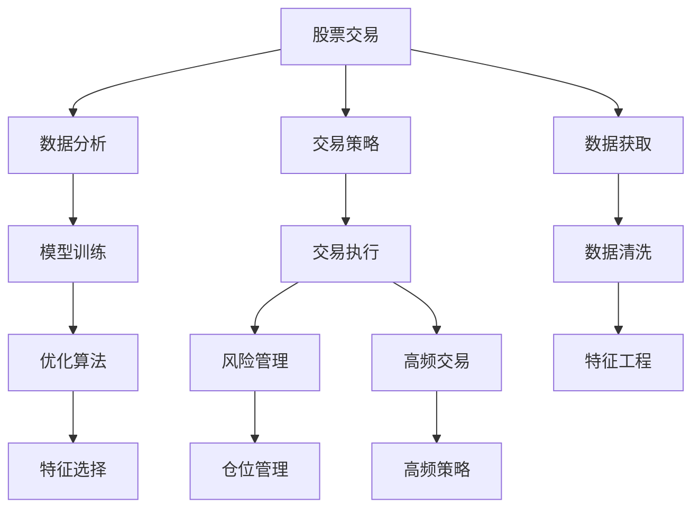

                 

# 程序员如何处理股票和期权

> 关键词：股票交易, 期权交易, 量化策略, 风险管理, 金融模型, 高频率交易

## 1. 背景介绍

股票和期权作为金融市场中的基本交易工具，受到了越来越多程序员和投资者的关注。在传统金融领域，这些工具通常由专业的分析师和交易员操作，而随着量化交易的兴起，越来越多的程序员和数据科学家开始利用计算机程序进行股票和期权交易，并取得了显著的成绩。

### 1.1 传统金融交易的局限性
传统金融交易的主要局限性在于：
- 信息不对称：普通投资者无法获得专业的分析报告和交易建议，导致投资决策的偏差。
- 交易成本高：高昂的手续费和佣金，增加了交易成本，降低了收益。
- 风险控制不足：缺乏系统化的风险管理手段，容易在市场波动中遭受重大损失。

### 1.2 量化交易的优势
量化交易则克服了上述缺点，主要优势包括：
- 数据驱动：通过大数据分析和机器学习算法，建立预测模型，做出更加科学的投资决策。
- 自动化交易：高频率和高精度自动执行交易，降低人为错误和延迟影响。
- 风险管理：应用数学和统计模型，实现系统化的风险控制和仓位管理。

## 2. 核心概念与联系

### 2.1 核心概念概述
- **股票交易**：买入和卖出股票以期获取利润的交易行为。
- **期权交易**：一种衍生品，赋予交易者以固定价格买入或卖出标的资产的权利。
- **量化交易**：利用计算机程序和算法进行交易，优化交易策略和风险管理。
- **风险管理**：通过数学模型和统计手段，控制交易风险，避免重大损失。
- **高频率交易**：高频次、小批量的交易策略，追求微小但稳定的收益。
- **金融模型**：如蒙特卡洛模拟、随机过程等，用于预测金融市场行为。

这些核心概念之间存在密切联系。量化交易通常涉及多种金融模型的应用，而风险管理和高频率交易则是量化交易的重要组成部分。

### 2.2 核心概念原理和架构的 Mermaid 流程图



这个流程图展示了量化交易的基本流程。首先通过数据获取和清洗，进行特征工程和模型训练，然后根据交易策略进行交易执行，并在交易执行中应用风险管理和仓位管理，最后采用高频交易策略优化收益。

## 3. 核心算法原理 & 具体操作步骤

### 3.1 算法原理概述

量化交易的核心算法原理主要涉及以下几个方面：

- **数据预处理**：清洗和处理原始数据，提取关键特征。
- **模型训练**：使用机器学习算法，训练交易策略。
- **交易执行**：根据模型预测结果，自动下达交易指令。
- **风险管理**：计算交易风险，进行仓位控制。
- **高频交易**：利用高频交易算法，提高交易效率。

这些算法之间相互依赖，形成一个完整的交易系统。

### 3.2 算法步骤详解

量化交易的主要步骤包括：

1. **数据获取和预处理**：
   - 通过API接口或数据服务商获取股票和期权的历史价格、交易量、新闻、公司财报等信息。
   - 进行数据清洗和特征工程，提取关键指标，如股价波动率、成交量等。

2. **模型训练和优化**：
   - 使用机器学习算法，训练交易策略模型，如回归、分类、决策树等。
   - 应用特征选择和降维技术，优化模型性能。

3. **交易策略设计**：
   - 根据模型预测结果，设计交易策略，如趋势跟踪、均值回归、套利策略等。
   - 确定入场和出场时机，设置止损和止盈条件。

4. **交易执行和回测**：
   - 根据交易策略，自动下达交易指令。
   - 进行历史回测，评估策略的有效性和风险。

5. **风险管理和仓位控制**：
   - 应用数学模型，计算交易的风险敞口和波动率。
   - 根据风险评估结果，进行仓位管理，控制仓位大小。

6. **高频交易策略**：
   - 采用高频交易算法，如基于信号的策略、套利策略等。
   - 实时监控市场动态，进行高频交易。

### 3.3 算法优缺点

**优点**：
- 数据驱动：大数据分析和机器学习算法提供了强大的决策支持。
- 自动化执行：减少人为错误，提高交易效率。
- 系统化风险管理：通过数学模型控制交易风险。

**缺点**：
- 算法复杂度高：需要较高的数学和编程技能。
- 高计算需求：大量的数据处理和模型训练需要高性能计算资源。
- 模型过拟合风险：过度拟合训练数据，导致模型在新数据上表现不佳。

### 3.4 算法应用领域

量化交易算法广泛应用于以下领域：

- **股票交易**：基于技术分析或基本面分析，进行买入或卖出决策。
- **期权交易**：利用期权定价模型，进行套期保值或投机交易。
- **高频率交易**：通过高频交易策略，追求微小但稳定的收益。
- **金融衍生品交易**：应用复杂的金融模型，进行套利交易。

## 4. 数学模型和公式 & 详细讲解 & 举例说明

### 4.1 数学模型构建

量化交易涉及多种数学模型，主要包括：

- **回归模型**：用于预测股价变化。
- **分类模型**：用于判断市场趋势。
- **蒙特卡洛模拟**：用于模拟金融市场行为。
- **随机过程**：用于建模股价波动。

### 4.2 公式推导过程

以回归模型为例，其基本公式为：

$$ y = \beta_0 + \beta_1x_1 + \beta_2x_2 + \cdots + \beta_nx_n + \epsilon $$

其中 $y$ 为因变量（股价），$x_1, x_2, \cdots, x_n$ 为自变量（成交量、市值、财务指标等），$\beta_0, \beta_1, \beta_2, \cdots, \beta_n$ 为回归系数，$\epsilon$ 为误差项。

### 4.3 案例分析与讲解

假设我们想预测某只股票在明天的收盘价 $y$，可以根据其成交量 $x_1$、市值 $x_2$、财务指标 $x_3$ 等自变量，建立线性回归模型。通过训练数据集，可以求解出 $\beta_0, \beta_1, \beta_2, \beta_3$，从而预测明天的收盘价。

## 5. 项目实践：代码实例和详细解释说明

### 5.1 开发环境搭建

量化交易的开发环境搭建主要包括以下步骤：

1. 安装Python环境：使用Anaconda或Miniconda，安装Python 3.x版本。
2. 安装依赖包：安装Pandas、NumPy、Scikit-learn、TensorFlow等常用库。
3. 搭建回测环境：使用QuantConnect等平台，搭建历史回测环境。

### 5.2 源代码详细实现

以下是一个简单的量化交易策略代码示例，用于买入和卖出股票：

```python
import pandas as pd
import numpy as np
from sklearn.linear_model import LinearRegression

# 加载历史数据
data = pd.read_csv('stock_data.csv')

# 定义交易策略函数
def trading_strategy(data):
    # 获取股价、成交量等数据
    prices = data['close']
    volumes = data['volume']
    
    # 构建回归模型
    model = LinearRegression()
    model.fit(prices.values.reshape(-1, 1), volumes)
    
    # 预测未来股价变化
    predictions = model.predict(prices[-1].reshape(1, 1))
    
    # 根据预测结果决定是否买入或卖出
    if predictions > 0:
        return 'Buy'
    else:
        return 'Sell'

# 进行交易回测
results = pd.DataFrame()
results['date'] = data['date']
results['strategy'] = data.apply(trading_strategy, axis=1)

# 输出结果
print(results)
```

### 5.3 代码解读与分析

上述代码实现了一个简单的线性回归策略。首先加载历史数据，然后定义一个 `trading_strategy` 函数，根据股价和成交量构建线性回归模型，预测未来股价变化，最后根据预测结果决定买入或卖出。

### 5.4 运行结果展示

运行代码后，可以得到一个包含日期和交易策略的结果表。如果预测结果为正，则策略为 "Buy"，否则为 "Sell"。

## 6. 实际应用场景

### 6.1 股票交易

量化交易在股票交易中的应用主要体现在以下几个方面：

- **买入和卖出决策**：基于技术分析和基本面分析，建立量化交易策略，优化买卖时机。
- **风险管理**：应用数学模型，计算风险敞口，进行仓位控制。
- **套利策略**：通过多市场、多品种之间的套利，获取稳定收益。

### 6.2 期权交易

期权交易策略主要包括以下几种：

- **期权定价**：利用期权定价模型，计算期权价值。
- **套期保值**：通过期权对冲，降低市场波动风险。
- **期权投机**：利用期权波动特性，进行投机交易。

### 6.3 高频率交易

高频率交易策略主要涉及以下几种：

- **基于信号的策略**：利用高频数据，构建信号模型，进行高频交易。
- **套利策略**：通过多个市场之间的价格差异，进行套利交易。

### 6.4 未来应用展望

量化交易技术在金融市场的应用前景广阔，未来可能出现以下趋势：

- **人工智能的融入**：深度学习和强化学习等技术，将进一步提升量化交易模型的准确性和稳定性。
- **大数据的利用**：通过大数据分析，挖掘更多有价值的信息，提高交易决策的科学性。
- **智能算法的设计**：应用智能算法，实现自适应交易策略，动态调整仓位。

## 7. 工具和资源推荐

### 7.1 学习资源推荐

- **《量化投资：人工智能与金融工程》**：介绍量化投资的基本概念和常用技术，适合入门学习。
- **Coursera的量化交易课程**：提供系统化的量化交易学习路径，涵盖数据处理、模型构建、策略设计等多个方面。
- **《Python编程：量化交易实战》**：通过具体案例，详细讲解量化交易的实现步骤和注意事项。

### 7.2 开发工具推荐

- **QuantConnect**：一个面向Python量化交易的开发平台，提供了丰富的历史回测工具和交易策略库。
- **Alpaca Trading API**：一个简单易用的API接口，用于进行高频交易。
- **Zipline**：一个Python回测框架，支持多种量化交易策略的开发和测试。

### 7.3 相关论文推荐

- **《金融量化投资：理论与实战》**：系统介绍量化投资的理论与实践，涵盖股票、期权、高频交易等多个领域。
- **《机器学习在量化交易中的应用》**：详细探讨机器学习算法在量化交易中的应用，如回归、分类、深度学习等。
- **《人工智能在量化交易中的应用》**：讨论人工智能技术在量化交易中的应用，如强化学习、自然语言处理等。

## 8. 总结：未来发展趋势与挑战

### 8.1 研究成果总结

量化交易技术在金融市场中取得了显著成果，但仍面临诸多挑战：

- 数据质量和准确性：数据获取和清洗是量化交易的核心环节，数据的准确性和完整性直接影响模型性能。
- 算法复杂性和稳定性：复杂的量化策略需要较高的编程和数学技能，模型的不稳定性也需深入研究。
- 模型泛化能力：如何在不同市场、不同时间段内保持模型的高效性，是一个重要的研究方向。

### 8.2 未来发展趋势

未来量化交易技术的发展趋势包括：

- 自动化和智能化：更多的智能算法和人工智能技术，提升交易效率和决策质量。
- 多资产和跨市场交易：通过多市场、多资产的协同操作，优化投资组合。
- 大数据分析：利用大数据分析，挖掘更多有价值的信息，增强交易决策的科学性。

### 8.3 面临的挑战

量化交易技术在发展过程中也面临以下挑战：

- 算法复杂度：高频率交易和大数据处理对算法的复杂度提出了更高要求。
- 系统风险管理：复杂的交易策略增加了系统的风险暴露，需要更有效的风险管理手段。
- 交易成本：高频交易带来的高频次交易费用，增加了交易成本。

### 8.4 研究展望

未来的研究方向包括：

- 探索新的量化交易策略：结合大数据分析和人工智能技术，设计更加高效和稳定的交易策略。
- 应用区块链技术：利用区块链的去中心化和透明性，提高交易系统的安全性和稳定性。
- 发展机器学习算法：引入深度学习、强化学习等算法，优化交易决策和风险管理。

## 9. 附录：常见问题与解答

**Q1：量化交易算法的核心是什么？**

A: 量化交易的核心在于数据驱动和自动化交易。通过大数据分析和机器学习算法，建立预测模型，然后利用计算机程序自动执行交易，实现科学决策和高效交易。

**Q2：量化交易和传统交易的主要区别是什么？**

A: 量化交易主要依赖数据和算法，而传统交易更多依赖人工经验和主观判断。量化交易通过大数据分析和模型训练，进行科学的交易决策，避免了人为错误和情绪影响，提高了交易效率和稳定性。

**Q3：量化交易的优点和缺点是什么？**

A: 优点包括数据驱动、自动化交易、系统化风险管理等。缺点则包括算法复杂度高、高计算需求、模型过拟合风险等。

**Q4：量化交易在实际应用中需要注意哪些问题？**

A: 量化交易在实际应用中需要注意数据质量、算法稳定性、系统风险管理、交易成本等问题。

**Q5：量化交易的未来发展趋势是什么？**

A: 未来的发展趋势包括自动化和智能化、多资产和跨市场交易、大数据分析等。

---

作者：禅与计算机程序设计艺术 / Zen and the Art of Computer Programming

