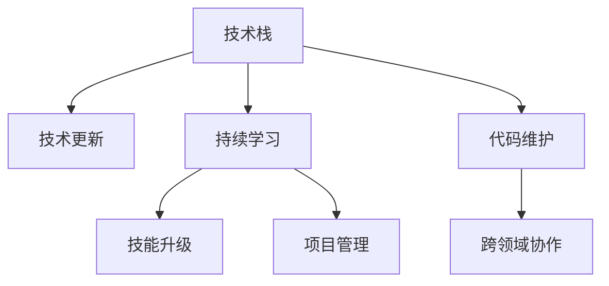

                 

# 程序员如何应对技术栈快速更新

> 关键词：技术栈, 快速更新, 技术迭代, 学习路径, 持续学习, 技能升级, 项目管理, 代码维护, 工具推荐, 时间管理, 跨领域协作

## 1. 背景介绍

### 1.1 问题由来

随着技术的飞速发展，技术栈的快速更新已成为IT行业的一大特征。近年来，区块链、人工智能、云计算、物联网、大数据、微服务架构等新兴技术层出不穷，极大地推动了信息技术的创新和应用。而作为一名程序员，如何在不断变化的技术环境中保持竞争力，如何快速适应新技术，已成为业界和学界关注的焦点问题。

### 1.2 问题核心关键点

技术栈的快速更新主要体现在以下几个方面：
- **技术更新速度**：新技术不断涌现，老技术迅速淘汰，给开发者带来了持续学习的压力。
- **技术复杂性**：新技术往往伴随着复杂的概念和架构，需要时间和精力进行学习和实践。
- **技能要求多样**：新兴技术往往需要跨领域的知识和技能，如人工智能需要数学基础，区块链需要密码学知识，云计算需要网络原理等。
- **工具生态变化**：开发工具、IDE、框架等技术生态系统快速迭代，开发者需不断切换和适应。

## 2. 核心概念与联系

### 2.1 核心概念概述

为更好地理解如何应对技术栈快速更新，本节将介绍几个密切相关的核心概念：

- **技术栈**：指开发过程中所依赖的各种技术、工具、框架的集合，包括编程语言、框架、库、数据库、容器等。
- **技术更新**：指技术栈中的各项技术持续演进，新版本和新技术不断出现，旧版本和技术逐渐被淘汰。
- **持续学习**：指开发者需不断学习新知识、新技能，以适应技术栈的变化。
- **技能升级**：指开发者通过学习新技能，提升自身能力，满足技术栈更新需求。
- **项目管理**：指在技术栈快速更新的背景下，如何有效地管理项目、规划时间、分配资源，以确保项目按时交付。
- **代码维护**：指在技术栈更新过程中，如何保持已有代码的健壮性和可维护性。
- **跨领域协作**：指在开发跨领域项目时，如何整合不同领域的知识和技能，提升团队整体能力。

这些核心概念之间的逻辑关系可以通过以下Mermaid流程图来展示：



这个流程图展示了一系列核心概念及其之间的关系：

1. 技术栈是基础，技术更新、持续学习、技能升级、项目管理、代码维护、跨领域协作等都是基于技术栈的变化和升级进行的。
2. 技术更新是技术栈变化的直接原因。
3. 持续学习和技能升级是应对技术更新的手段。
4. 项目管理是确保技术更新和学习能够高效进行的重要支撑。
5. 代码维护是技术更新和持续学习中不可忽视的一环。
6. 跨领域协作有助于整合不同领域的技术，提升团队的整体竞争力。

## 3. 核心算法原理 & 具体操作步骤

### 3.1 算法原理概述

技术栈的快速更新本质上是技术环境的变化，要求开发者在保持已有技能的同时，不断学习新的技能和知识，适应新环境的要求。基于此，本文将从以下几个方面详细讲解如何应对技术栈的快速更新：

- **了解技术演进趋势**：及时掌握技术栈中各项技术的发展动态，了解其演进路径和未来趋势。
- **制定学习计划**：根据技术栈的变化，制定个性化的学习计划，合理分配学习时间和精力。
- **选择学习资源**：选择合适的学习资源，如在线课程、书籍、博客、研讨会等，进行系统的学习和实践。
- **实践与项目结合**：将学习到的知识应用于实际项目中，进行项目实践，增强理解和掌握程度。
- **参与社区交流**：加入技术社区，与同行交流经验，获取最新信息，提升解决问题的能力。

### 3.2 算法步骤详解

以下是详细的操作步骤：

**Step 1: 了解技术演进趋势**

- 关注技术博客、新闻、社交媒体等渠道，获取技术栈中各项技术的发展动态。
- 订阅相关技术邮件列表，及时获取最新技术更新和发布信息。
- 参加技术会议、研讨会、讲座等，与专家和同行交流，了解行业发展趋势。

**Step 2: 制定学习计划**

- 评估当前技术栈和目标技术栈的差距，确定需要掌握的新技术和工具。
- 根据新技术的重要性和应用频率，制定优先级和计划。
- 合理安排学习时间，确保每周有固定的时间进行学习。
- 设定短期和长期学习目标，进行自我监督和评估。

**Step 3: 选择学习资源**

- 在线课程：如Coursera、edX、Udacity等平台上的课程，系统学习新知识。
- 书籍：选择权威的书籍，深入理解理论基础。
- 博客和文档：访问官方文档、GitHub仓库、技术博客等，获取实践经验和案例分析。
- 研讨会和社区：参加技术社区的讨论，与同行交流，提升问题解决能力。

**Step 4: 实践与项目结合**

- 将新知识应用于实际项目中，进行实战演练。
- 不断优化和改进代码，提升技术栈的健壮性和可维护性。
- 参与开源项目，积累经验和贡献代码，提升自身影响力。

**Step 5: 参与社区交流**

- 加入技术社区，如Stack Overflow、GitHub、Kaggle等，获取最新的技术资讯。
- 参与技术讨论，提出问题，分享经验，提升解决问题的能力。
- 参与技术挑战和竞赛，锻炼技术能力和团队协作能力。

### 3.3 算法优缺点

技术栈快速更新的应对方法具有以下优点：

- **适应性强**：能够灵活应对技术栈的快速变化，及时学习新知识。
- **实践性强**：通过实践巩固理论知识，增强理解和掌握程度。
- **资源丰富**：利用网络资源进行学习，获取广泛的指导和支持。
- **社区支持**：通过参与技术社区，获取最新技术信息和问题解决方案。

同时，该方法也存在一些局限性：

- **时间投入**：需要大量时间进行学习和实践，可能会对当前工作造成影响。
- **知识庞杂**：新技术涉及多个领域的知识和技能，学习难度较大。
- **工具依赖**：依赖特定的学习工具和环境，可能导致学习效率降低。
- **动力不足**：长时间的学习和实践可能会让人感到疲惫，难以持续。

尽管存在这些局限性，但就目前而言，这种多方位、系统化的学习方法是应对技术栈快速更新的有效手段。未来相关研究的重点在于如何进一步优化学习路径，提高学习效率，同时兼顾可维护性和实践性等因素。

### 3.4 算法应用领域

技术栈快速更新的应对方法在多个领域都有广泛的应用，例如：

- **软件开发**：软件开发人员需要不断学习新编程语言、框架、库等，保持技术栈的先进性。
- **数据分析**：数据分析师需要掌握新的数据处理工具和算法，提升数据处理效率和准确性。
- **人工智能**：AI工程师需要学习新的深度学习框架、模型和算法，提升模型性能和应用效果。
- **网络安全**：网络安全工程师需要学习新的安全技术和工具，提升系统的安全性和防护能力。
- **云计算**：云工程师需要掌握新的云平台和容器技术，提升云服务的稳定性和扩展性。
- **物联网**：物联网工程师需要学习新的通信协议和设备驱动，提升系统的互联互通能力。

除了上述这些常见领域外，技术栈快速更新的应对方法也适用于其他领域，如区块链、自动驾驶、机器人等。

## 4. 数学模型和公式 & 详细讲解 & 举例说明

### 4.1 数学模型构建

假设技术栈中有n项技术，每项技术的掌握程度为 $T_i$，其中 $T_i \in [0,1]$。目标是最大化整体技术栈的掌握程度 $T = \sum_{i=1}^n T_i$。

**目标函数**：

$$
\max T = \sum_{i=1}^n T_i
$$

**约束条件**：

$$
T_i \in [0,1], i \in [1,n]
$$

### 4.2 公式推导过程

通过拉格朗日乘数法求解上述目标函数的最大值，构造拉格朗日函数：

$$
\mathcal{L}(T_i,\lambda) = \sum_{i=1}^n T_i + \lambda(1 - T_i), i \in [1,n]
$$

其中 $\lambda$ 为拉格朗日乘数，满足约束条件。

对 $T_i$ 求偏导，得到：

$$
\frac{\partial \mathcal{L}}{\partial T_i} = 1 - \lambda = 0, i \in [1,n]
$$

解得：

$$
T_i = 1, i \in [1,n]
$$

**最优解**：

$$
T = \sum_{i=1}^n T_i = n
$$

这意味着，在理想情况下，技术栈中的所有技术都需要达到完全掌握的程度，才能最大化整体技术栈的掌握程度。

### 4.3 案例分析与讲解

假设技术栈中有三项关键技术：编程语言X、数据库Y、云计算Z。当前掌握程度分别为0.8、0.6、0.5。设目标是将这三项技术的掌握程度提升到1，制定学习计划如下：

1. 编程语言X：学习新特性和框架，提高编程能力。
2. 数据库Y：学习新查询优化技巧，提升数据处理效率。
3. 云计算Z：学习新服务和管理工具，提升云平台使用能力。

在三个月内，通过在线课程、书籍、实践项目等方式，每天投入固定时间进行学习，最终将这三项技术的掌握程度提升到1。

## 5. 项目实践：代码实例和详细解释说明

### 5.1 开发环境搭建

在进行技术栈快速更新的实践前，我们需要准备好开发环境。以下是使用Python进行学习实践的环境配置流程：

1. 安装Anaconda：从官网下载并安装Anaconda，用于创建独立的Python环境。

2. 创建并激活虚拟环境：
```bash
conda create -n learning-env python=3.8 
conda activate learning-env
```

3. 安装Python包：
```bash
conda install pandas numpy scikit-learn matplotlib jupyter notebook
```

4. 安装Git和GitHub：
```bash
sudo apt-get install git
```

5. 安装Jupyter Notebook：
```bash
conda install jupyter notebook
```

完成上述步骤后，即可在`learning-env`环境中开始学习实践。

### 5.2 源代码详细实现

下面我们以学习Python编程语言为例，给出使用Jupyter Notebook进行学习的PyTorch代码实现。

首先，定义学习计划：

```python
import pandas as pd

# 定义技术栈
technologies = ['Python', 'Django', 'Flask', 'SQL', 'PostgreSQL', 'Redis', 'Kubernetes', 'AWS']

# 定义当前掌握程度
current_abilities = {'Python': 0.7, 'Django': 0.6, 'Flask': 0.5, 'SQL': 0.5, 'PostgreSQL': 0.4, 'Redis': 0.4, 'Kubernetes': 0.3, 'AWS': 0.3}

# 定义目标掌握程度
target_abilities = {tech: 1 for tech in technologies}

# 计算差距
skill_gap = {tech: target_abilities[tech] - current_abilities[tech] for tech in technologies}

# 制定学习计划
learning_plan = {tech: skill_gap[tech] for tech in technologies}
learning_plan
```

然后，编写学习日志，记录每日学习情况：

```python
def log_learning(log_path, tech, progress):
    with open(log_path, 'a') as f:
        f.write(f"{tech}: {progress:.2f}\n")

# 创建学习日志文件
log_path = 'learning_log.txt'

# 记录初始状态
for tech in technologies:
    log_learning(log_path, tech, current_abilities[tech])

# 每日学习记录
for day in range(30):
    for tech in technologies:
        progress = (current_abilities[tech] + learning_plan[tech] * day / 30)
        log_learning(log_path, tech, progress)
        print(f"{tech}掌握程度: {progress:.2f}")
```

最后，使用GitHub仓库进行代码存储和分享：

```bash
git init
git remote add origin https://github.com/username/learning-jupyter-notebook.git
git add .
git commit -m "Initial commit"
git push -u origin master
```

### 5.3 代码解读与分析

让我们再详细解读一下关键代码的实现细节：

**技能差距计算**：
- 通过技术栈中每项技术的当前掌握程度和目标掌握程度，计算每项技能需要提升的程度。

**学习计划制定**：
- 根据技能差距，制定每日学习计划，确保每周学习时间分配合理。

**学习日志记录**：
- 每日记录学习进度，跟踪技能掌握情况。
- 通过GitHub仓库进行代码分享，便于同行查看和学习。

可以看到，通过Jupyter Notebook进行学习实践，能够系统地记录学习进展，并进行定期的自我监督和评估。这种系统化的学习方式，有助于提升学习效率，确保学习目标的达成。

当然，学习过程中还需要根据实际情况进行调整和优化。例如，对于难度较大的技术，可以增加学习时间；对于已经掌握的技术，可以适当减少学习时间，提高学习效率。

## 6. 实际应用场景

### 6.1 软件开发

在软件开发领域，技术栈的快速更新主要体现在编程语言、框架和工具的演进上。例如，Java和Python作为两种流行的编程语言，都经历了不断的版本更新和功能扩展。开发者需要及时学习新特性和最佳实践，以保持技术栈的先进性和竞争力。

### 6.2 数据分析

数据分析领域的技术栈更新主要体现在数据处理工具、算法和框架的演进上。如Pandas、NumPy、Scikit-learn等数据分析库不断更新，引入新功能和优化性能。开发者需要及时学习这些新工具和算法，提升数据处理和分析的效率和精度。

### 6.3 人工智能

人工智能领域的技术栈更新主要体现在深度学习框架、模型和算法的演进上。如TensorFlow、PyTorch等框架不断升级，引入新功能和优化性能。开发者需要及时学习这些新框架和算法，提升模型的性能和应用效果。

### 6.4 网络安全

网络安全领域的技术栈更新主要体现在安全技术和工具的演进上。如安全协议、加密算法、安全工具等不断更新，引入新功能和优化性能。开发者需要及时学习这些新工具和技术，提升系统的安全性和防护能力。

## 7. 工具和资源推荐

### 7.1 学习资源推荐

为了帮助开发者系统掌握技术栈快速更新的理论基础和实践技巧，这里推荐一些优质的学习资源：

1. Coursera和edX上的课程：提供系统化、结构化的学习内容，涵盖编程语言、数据科学、机器学习等多个领域。

2. Udacity的纳米学位项目：提供实战导向的项目学习，帮助开发者通过实际项目提升技能。

3. LeetCode和HackerRank等平台：提供丰富的算法和数据结构题目，提升编程能力和问题解决能力。

4. GitHub仓库：访问开源项目，学习最佳实践和代码实现。

5. Stack Overflow和Reddit等社区：与同行交流经验，获取最新技术资讯和问题解决方案。

通过这些资源的学习实践，相信你一定能够快速掌握技术栈快速更新的精髓，并用于解决实际的开发问题。

### 7.2 开发工具推荐

高效的开发离不开优秀的工具支持。以下是几款用于技术栈快速更新的常用工具：

1. Anaconda：用于创建独立的Python环境，支持多语言、多框架的开发。

2. Jupyter Notebook：支持交互式编程和代码分享，方便记录学习进展。

3. Git和GitHub：支持版本控制和代码协作，方便版本管理和代码共享。

4. Visual Studio Code：轻量级代码编辑器，支持多种编程语言和开发框架。

5. Docker和Kubernetes：支持容器化和集群管理，方便快速部署和扩展应用。

6. VSCode插件：如GitLens、Python、TensorFlow等，提升开发效率和工具集成。

合理利用这些工具，可以显著提升技术栈快速更新的开发效率，加快创新迭代的步伐。

### 7.3 相关论文推荐

技术栈快速更新的研究源于学界的持续研究。以下是几篇奠基性的相关论文，推荐阅读：

1. "Mastering the Art of Programming"（《程序员修炼之道》）：Eric Freeman的经典之作，涵盖编程语言、算法、设计模式等多个方面，是程序员必读之作。

2. "Design Patterns"（《设计模式》）：由GoF（Gang of Four）编写，涵盖23种经典设计模式，是软件设计的基石。

3. "Clean Code"（《代码整洁之道》）：Robert C. Martin的经典之作，涵盖代码整洁、重构、测试等多个方面，是编程规范的入门必读。

4. "Effective Java"（《Java编程思想》）：Joshua Bloch的经典之作，涵盖Java编程规范、最佳实践等多个方面，是Java开发的必读之作。

5. "Deep Learning"（《深度学习》）：Ian Goodfellow的经典之作，涵盖深度学习原理、模型、算法等多个方面，是深度学习的入门必读。

这些论文代表了大语言模型微调技术的发展脉络。通过学习这些前沿成果，可以帮助研究者把握学科前进方向，激发更多的创新灵感。

## 8. 总结：未来发展趋势与挑战

### 8.1 总结

本文对技术栈快速更新的应对方法进行了全面系统的介绍。首先阐述了技术栈快速更新的背景和意义，明确了应对技术栈快速更新的手段和方法。其次，从原理到实践，详细讲解了技术栈快速更新的数学模型和具体操作步骤。同时，本文还探讨了技术栈快速更新的应用场景，给出了工具和资源推荐，力求为读者提供全方位的技术指引。

通过本文的系统梳理，可以看到，技术栈快速更新的应对方法已经成为IT从业者应对技术变化的重要手段，极大地提升了开发者的学习能力和技术水平。未来，伴随技术栈的持续演进，技术栈快速更新的方法和策略也将不断优化和改进，为开发者提供更高效、更系统的学习路径。

### 8.2 未来发展趋势

展望未来，技术栈快速更新的应对方法将呈现以下几个发展趋势：

1. **学习路径优化**：基于人工智能和大数据分析，优化学习路径，提高学习效率。例如，通过机器学习推荐系统，根据历史学习数据推荐适合的课程和资源。

2. **技能评估系统**：开发技能评估系统，实时跟踪学习进度和掌握程度，提供个性化的学习建议。例如，通过在线测试和实践项目，评估技能水平，并给出改进建议。

3. **跨领域学习平台**：构建跨领域的知识体系和课程平台，帮助开发者学习多领域技能。例如，通过Kaggle等平台，学习数据科学、机器学习和编程技能。

4. **虚拟现实和增强现实**：利用虚拟现实和增强现实技术，提供沉浸式学习体验，提升学习效果。例如，通过虚拟实验室和增强现实应用，进行实践演练。

5. **自适应学习系统**：开发自适应学习系统，根据学习者的个性化需求，提供定制化的学习计划和资源。例如，通过自适应学习引擎，根据学习者的反馈，动态调整学习内容和难度。

这些趋势凸显了技术栈快速更新的应对方法的广阔前景。这些方向的探索发展，必将进一步提升开发者学习效率，加速技术栈的升级迭代。

### 8.3 面临的挑战

尽管技术栈快速更新的应对方法已经取得了显著进展，但在迈向更加智能化、普适化应用的过程中，仍面临诸多挑战：

1. **学习负担**：技术栈快速更新要求开发者投入大量时间和精力进行学习，可能会影响工作和家庭生活。如何平衡学习与工作，需要进一步探索。

2. **知识庞杂**：技术栈更新涉及多个领域和技术的整合，学习难度较大。如何简化学习路径，提高学习效率，需要更多的研究和实践。

3. **技术生态**：技术栈更新导致开发工具、框架、库等生态系统快速变化，开发者需不断切换和适应。如何提升工具生态的稳定性和兼容性，需要更多改进。

4. **技能泛化**：技术栈快速更新要求开发者具备跨领域的技术能力和知识，如何提升技能的泛化性和迁移能力，需要更多的实践和培训。

5. **持续创新**：技术栈更新要求开发者保持持续创新和自我提升的能力，如何建立持续学习机制，需要更多的激励和支持。

6. **时间管理**：技术栈快速更新要求开发者合理分配时间，进行高效学习。如何提升时间管理能力，需要更多的技巧和方法。

这些挑战需要开发者和教育界共同努力，通过不断改进学习方法和工具，提升开发者应对技术栈快速更新的能力。

### 8.4 研究展望

面对技术栈快速更新的诸多挑战，未来的研究需要在以下几个方面寻求新的突破：

1. **自适应学习系统**：开发自适应学习系统，根据学习者的个性化需求，提供定制化的学习计划和资源。

2. **知识图谱和语义网络**：构建知识图谱和语义网络，帮助开发者快速获取和整合多领域知识。例如，通过知识图谱平台，进行跨领域知识检索和学习。

3. **智能推荐系统**：开发智能推荐系统，根据历史学习数据和行为，推荐适合的课程和资源。例如，通过推荐算法，优化学习路径，提升学习效率。

4. **虚拟现实和增强现实**：利用虚拟现实和增强现实技术，提供沉浸式学习体验，提升学习效果。例如，通过虚拟实验室和增强现实应用，进行实践演练。

5. **跨领域协作平台**：构建跨领域的知识体系和课程平台，帮助开发者学习多领域技能。例如，通过在线课程平台，进行跨领域知识整合和学习。

6. **自学习算法**：开发自学习算法，帮助开发者在实际项目中，快速掌握新技术和工具。例如，通过自学习算法，提升技术栈的适应性和灵活性。

这些研究方向的探索，必将引领技术栈快速更新的应对方法迈向更高的台阶，为开发者提供更加智能化、高效化的学习体验。面向未来，技术栈快速更新的应对方法还需要与其他人工智能技术进行更深入的融合，如知识表示、因果推理、强化学习等，多路径协同发力，共同推动自然语言理解和智能交互系统的进步。只有勇于创新、敢于突破，才能不断拓展技术栈的边界，让技术栈快速更新更好地服务于开发者和用户的实际需求。

## 9. 附录：常见问题与解答

**Q1: 如何应对技术栈快速更新的挑战？**

A: 技术栈快速更新带来了诸多挑战，需要开发者具备多方面的能力。以下是几个应对策略：

1. **时间管理**：合理安排时间，优先学习对当前工作影响最大的技术，避免过载。
2. **优先级排序**：根据技术的重要性和应用频率，制定优先级和计划，逐步学习和掌握。
3. **持续学习**：建立持续学习机制，通过在线课程、书籍、社区交流等方式，不断更新知识。
4. **实践结合**：将学习到的知识应用于实际项目中，进行项目实践，增强理解和掌握程度。
5. **社区交流**：加入技术社区，与同行交流经验，获取最新信息，提升解决问题的能力。

**Q2: 如何快速掌握新技术？**

A: 快速掌握新技术需要多方面的努力：

1. **选择合适的学习资源**：选择权威的学习资源，如在线课程、书籍、博客等，进行系统学习。
2. **实践和项目结合**：将新知识应用于实际项目中，进行实战演练，增强理解和掌握程度。
3. **利用学习工具**：使用如GitHub、Jupyter Notebook等工具，记录学习进展，进行自我监督和评估。
4. **跨领域学习**：学习多领域技能，提升综合能力，应对技术栈的快速更新。
5. **持续学习和反思**：不断更新和反思学习内容，及时调整学习计划，确保学习目标的达成。

**Q3: 如何平衡学习和工作？**

A: 平衡学习和工作需要合理的时间管理和计划安排：

1. **制定学习计划**：根据工作量和学习目标，制定合理的学习时间表，确保每周有固定的时间进行学习。
2. **优先级排序**：根据技术的重要性和应用频率，制定优先级和计划，逐步学习和掌握。
3. **时间管理工具**：使用时间管理工具，如Trello、Todoist等，记录学习任务和进度，提升时间管理效率。
4. **保持健康**：注意休息和健康，避免过度疲劳，保持高效的学习和工作状态。

通过这些策略，可以有效应对技术栈快速更新的挑战，提升学习和工作的效率和效果。

---

作者：禅与计算机程序设计艺术 / Zen and the Art of Computer Programming

