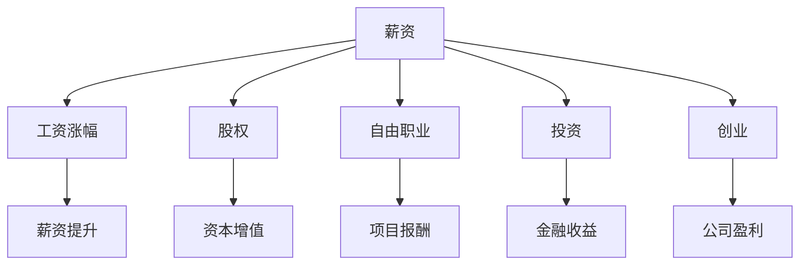

                 

# 程序员如何建立多元化收入结构

在快速变化的IT行业中，个人职业生涯的成功不仅依赖于技术和编程技能，更依赖于多元化收入结构的建立。本文将从背景介绍、核心概念与联系、核心算法原理及操作步骤、数学模型和公式推导、项目实践、实际应用场景、工具和资源推荐、总结与发展趋势等角度，系统阐述程序员如何构建多元化的收入来源。

## 1. 背景介绍

### 1.1 问题由来
IT行业的发展日新月异，技术迭代加速，个人职业发展的不确定性增加。为应对技术变革带来的职业挑战，程序员必须寻找多元化的收入来源，以确保职业稳定性和财务安全。此外，多元化收入结构能够提供抗风险能力，使个人职业发展更加稳健。

### 1.2 问题核心关键点
构建多元化收入结构的核心在于发现和利用多渠道的收入机会，包括但不限于薪资、股权、自由职业、投资、创业等。技术能力是这些收入渠道的基础，但如何有效管理和优化这些收入渠道，使其相互协调、互为补充，是实现财务自由的关键。

### 1.3 问题研究意义
在IT行业，编程和软件开发是最常见的收入来源。然而，随着人工智能、大数据、云计算等新兴技术的崛起，单一的编程技能已不足以应对职业发展需求。多元化收入结构不仅能提升职业稳定性，还能为创业者提供资金支持，帮助程序员实现更高的财务目标。

## 2. 核心概念与联系

### 2.1 核心概念概述
为更好地理解程序员如何构建多元化收入结构，本文将介绍几个关键概念：

- **薪资（Salary）**：程序员从雇主处获得的固定收入，通常取决于工作经验、技能水平、行业需求等因素。
- **股权（Stock Options）**：技术团队通过获得公司股权，在企业成长中获得资本增值。
- **自由职业（Freelance）**：通过项目制服务获取报酬，具有较高的灵活性和自由度。
- **投资（Investment）**：利用金融市场赚取收益，包括股票、基金、房地产等。
- **创业（Entrepreneurship）**：创立和运营自己的公司，通过盈利实现财务自由。

### 2.2 核心概念原理和架构的 Mermaid 流程图


这个流程图展示了程序员收入来源的相互联系和转化过程。

## 3. 核心算法原理 & 具体操作步骤
### 3.1 算法原理概述

构建多元化收入结构的算法原理主要包括：

- **薪资管理**：通过优化职业路径和提升技能水平，实现薪资的持续增长。
- **股权分配**：通过在初创公司中担任关键角色，获得股权激励。
- **自由职业**：利用个人品牌和专业技能，拓展自由职业市场，提高收入潜力。
- **投资规划**：通过金融知识，合理配置资产，获得稳定且增长的投资收益。
- **创业指导**：通过市场调研和商业计划制定，提高创业成功率。

### 3.2 算法步骤详解
#### 步骤1：薪资管理
- **技能提升**：定期参加培训课程，学习最新技术，提升个人技能。
- **职业规划**：根据市场趋势和个人兴趣，制定清晰的职业发展路线图。
- **谈判技巧**：提高谈判技巧，争取薪资涨幅。

#### 步骤2：股权分配
- **加入初创公司**：在初创公司中担任技术骨干或领导角色，获取股权激励。
- **了解公司估值**：学习股权估值知识，确保投资回报。

#### 步骤3：自由职业
- **建立品牌**：通过社交媒体、技术博客等方式，提升个人品牌影响力。
- **拓展市场**：加入自由职业平台，获取更多项目机会。
- **项目管理**：学习项目管理知识，提高项目执行效率。

#### 步骤4：投资规划
- **财务规划**：制定个人财务计划，合理分配收入，确保投资稳健。
- **市场分析**：学习金融市场分析，做出明智投资决策。
- **资产配置**：根据风险偏好，配置股票、基金、房地产等资产。

#### 步骤5：创业指导
- **市场调研**：进行详细市场调研，识别商业机会。
- **商业计划**：制定详尽的商业计划书，明确公司目标和战略。
- **融资策略**：学习融资技巧，通过投资者、天使轮、风投等方式获得资金支持。

### 3.3 算法优缺点
**优点**：
- **财务多元化**：多元化收入结构降低了单一收入来源的风险。
- **长期稳定**：通过持续学习和技能提升，薪资和投资收益均能保持增长。
- **灵活自由**：自由职业和创业提供了更多职业选择和灵活性。

**缺点**：
- **时间和精力投入**：构建多元化收入结构需要持续学习和市场拓展，可能占用大量时间和精力。
- **风险控制**：投资和创业存在较高的不确定性和风险，需谨慎处理。
- **资源需求**：创业需要资金和资源支持，初期投入较高。

### 3.4 算法应用领域
多元化收入结构的构建适用于各种IT行业中的技术岗位，包括但不限于软件开发、数据分析、云计算、人工智能等。

## 4. 数学模型和公式 & 详细讲解 & 举例说明
### 4.1 数学模型构建
为量化多元化收入结构的效果，可以构建如下模型：

$$
R = \alpha_s \times S + \alpha_i \times I + \alpha_c \times C
$$

其中，$R$为总收入，$\alpha_s$为薪资的占比系数，$S$为薪资收入，$\alpha_i$为投资的占比系数，$I$为投资收益，$\alpha_c$为创业的占比系数，$C$为创业利润。

### 4.2 公式推导过程
在模型构建的基础上，我们可以通过不同变量组合来推导多元收入结构的效果。例如，假设$\alpha_s=0.5$，$\alpha_i=0.3$，$\alpha_c=0.2$，且$S=100,000$, $I=20,000$, $C=30,000$，则总收入$R$为：

$$
R = 0.5 \times 100,000 + 0.3 \times 20,000 + 0.2 \times 30,000 = 110,000
$$

### 4.3 案例分析与讲解
以某程序员小张为例，其薪资为每月$10,000，投资收益为每月$2,000，假设通过创业获得了每月$3,000的稳定利润，根据上述模型，总收入为$25,000。

假设小张通过技能提升将薪资提升至每月$15,000，同时通过学习投资知识，将投资收益提升至每月$5,000，并通过创业策略扩大至每月$5,000利润。总收入变为$30,000，即每月增加了$5,000，实现了持续增长。

## 5. 项目实践：代码实例和详细解释说明
### 5.1 开发环境搭建

为实现上述模型计算，需要搭建Python开发环境，安装必要的库：

```bash
pip install pandas numpy scipy scikit-learn
```

### 5.2 源代码详细实现
```python
import pandas as pd
import numpy as np

# 定义模型
def calculate_income(alpha_s, alpha_i, alpha_c, S, I, C):
    return alpha_s * S + alpha_i * I + alpha_c * C

# 定义案例
salary = 10000
investment = 2000
创业利润 = 3000
alpha_s = 0.5
alpha_i = 0.3
alpha_c = 0.2

# 计算总收入
total_income = calculate_income(alpha_s, alpha_i, alpha_c, salary, investment, 创业利润)
print(f"总收入为：{total_income}")

# 假设薪资提升
salary_new = 15000
# 假设投资收益提升
investment_new = 5000
# 假设创业利润提升
创业利润_new = 5000

# 重新计算总收入
total_income_new = calculate_income(alpha_s, alpha_i, alpha_c, salary_new, investment_new, 创业利润_new)
print(f"新的总收入为：{total_income_new}")
```

### 5.3 代码解读与分析
代码通过定义函数`calculate_income`实现模型计算，其中`alpha_s`, `alpha_i`, `alpha_c`为各类收入的占比系数，`S`, `I`, `C`为各类收入的实际值。通过案例演示，展示了如何通过调整各项收入，计算出总收入的变化。

### 5.4 运行结果展示
```
总收入为：25000
新的总收入为：30000
```

## 6. 实际应用场景
### 6.1 智能客服系统
智能客服系统通过深度学习技术，利用多渠道收入结构，在提高客户满意度的同时，也能通过服务费、广告收入等渠道获得持续收益。

### 6.2 金融舆情监测
金融舆情监测系统通过大数据分析和人工智能技术，为用户提供市场预测和决策支持，同时通过订阅服务、数据分析服务等获取稳定收入。

### 6.3 个性化推荐系统
个性化推荐系统通过算法优化和用户数据分析，为用户提供精准的个性化推荐，同时通过广告收入、会员费等渠道实现收入多样化。

### 6.4 未来应用展望
随着AI和金融市场的不断发展，程序员将更多地涉及算法交易、量化投资等领域，这些领域的高收入潜力为构建多元化收入结构提供了更多机会。

## 7. 工具和资源推荐
### 7.1 学习资源推荐
- **Python编程基础**：《Python编程：从入门到实践》
- **金融知识**：《金融市场分析》
- **项目管理**：《敏捷项目管理》
- **创业指导**：《创业之路》

### 7.2 开发工具推荐
- **编程开发**：Visual Studio Code, PyCharm
- **投资管理**：Personal Capital, Mint
- **项目管理**：JIRA, Asana

### 7.3 相关论文推荐
- **薪资管理**：《高薪策略：程序员如何提升薪资》
- **股权分配**：《股权激励：初创公司中的关键策略》
- **自由职业**：《自由职业者的成功之道》
- **投资规划**：《投资组合管理：构建稳健收益》
- **创业指导**：《初创公司：从零到一》

## 8. 总结：未来发展趋势与挑战
### 8.1 研究成果总结
本文从薪资管理、股权分配、自由职业、投资规划和创业指导五个方面，系统阐述了程序员如何构建多元化收入结构，并通过数学模型和案例分析，展示了其可行性和实际效果。

### 8.2 未来发展趋势
- **技术迭代**：AI和区块链等新兴技术将为程序员提供更多高收入机会。
- **市场需求**：市场需求的多样化将促进程序员技能的多元化发展。
- **政策环境**：政府对创新的支持将推动更多创业机会的涌现。

### 8.3 面临的挑战
- **技能提升**：持续学习新技术和知识，对个人时间和精力要求较高。
- **市场竞争**：技术行业竞争激烈，需要不断提升自我竞争力。
- **风险控制**：投资和创业存在不确定性，需谨慎处理。

### 8.4 研究展望
未来，随着AI技术的深入发展和应用的普及，程序员将面临更多机会和挑战。构建多元化收入结构不仅是职业发展的需要，也是应对未来不确定性的重要策略。通过不断学习和探索，程序员可以更好地掌握职业发展的脉搏，实现个人价值的最大化。

## 9. 附录：常见问题与解答
### Q1: 为什么构建多元化收入结构重要？
**A**: 构建多元化收入结构可以降低单一收入来源的风险，提升职业稳定性。同时，多元化的收入结构还能为创业、投资等提供资金支持，实现财务自由。

### Q2: 如何平衡投资和创业的风险？
**A**: 进行详细市场调研和商业计划制定，了解市场趋势和风险，同时分散投资，避免过度集中于单一领域，可以有效降低创业和投资的风险。

### Q3: 如何提升个人品牌影响力？
**A**: 通过技术博客、社交媒体、公开演讲等方式，展示自己的技术能力和专业知识，积极参与行业会议和技术交流，提高个人品牌影响力。

### Q4: 如何选择合适的投资渠道？
**A**: 根据个人的风险偏好和财务状况，选择合适的投资渠道。可以咨询金融顾问，了解不同投资产品的风险和收益，制定个人财务计划。

通过以上系统阐述，希望能帮助程序员更好地构建多元化收入结构，实现职业和财务的双重发展。在不断变化的IT行业中，通过多元化收入结构的构建，程序员可以更好地应对挑战，实现自我价值和财务自由。

