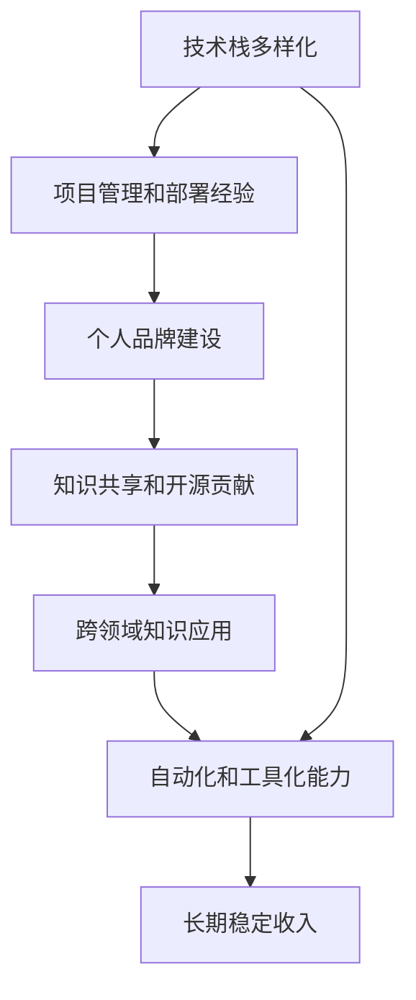

                 

# 程序员如何建立长期稳定的收入来源

在信息技术飞速发展的今天，程序员作为技术的承载者和驱动者，其职业地位和收入水平自然也备受关注。但随着行业的不断演变，技术的不断进步，许多传统程序员面临着职业转型、收入下降的困境。如何构建长期稳定的收入来源，成为了每一位程序员必须面对的课题。本文将系统梳理构建长期稳定收入的方法，以帮助程序员在激烈的市场竞争中立于不败之地。

## 1. 背景介绍

### 1.1 行业现状
随着信息技术不断进步，程序员的职业发展路径也日益多元化和个性化。过去，程序员收入主要来源于企业薪资，而今天，个人项目、咨询顾问、自由职业等多种收入形式逐渐成为主流。然而，技术更新迭代加速，旧有技术的淘汰和新技术的崛起，使得一些程序员在原有领域缺乏竞争力，需要不断学习新技能才能保持市场竞争力。

### 1.2 问题由来
传统程序员收入的波动性较大，其原因主要包括以下几点：
- 技术更新快，旧技术被淘汰
- 行业内卷，岗位竞争激烈
- 市场需求不均衡，技能与市场需求脱节
- 缺乏多元收入渠道

这些因素共同作用，使得传统程序员收入面临巨大不确定性。那么，如何构建长期稳定的收入来源，就成为程序员必须深入思考的问题。

## 2. 核心概念与联系

### 2.1 核心概念概述

为更好地理解如何构建长期稳定的收入来源，本节将介绍几个核心概念：

- **技术栈多样化**：程序员掌握多种技术栈，可以提高自身在多个领域的竞争力，避免因技术更新导致收入波动。
- **项目管理和部署经验**：项目管理经验和良好的部署能力，可以让程序员在项目中承担重要角色，获取更高的收入。
- **个人品牌建设**：通过博客、社交媒体等平台，建立自己的品牌，提升行业影响力，可以获得更多的项目和咨询机会。
- **知识共享和开源贡献**：积极参与开源项目，分享技术知识，可以提升自身知名度，获取更多合作机会。
- **跨领域知识应用**：具备跨领域知识应用能力，可以帮助程序员在多个领域找到机会，获得更高的收入。
- **自动化和工具化能力**：掌握自动化工具和平台，可以提升工作效率，降低成本，提高项目利润率。

这些核心概念之间存在着密切的联系，共同构建了程序员建立长期稳定收入的框架。

### 2.2 核心概念原理和架构的 Mermaid 流程图(Mermaid 流程节点中不要有括号、逗号等特殊字符)



这个流程图展示了核心概念之间的逻辑关系：

1. 技术栈多样化：为项目管理和部署经验、跨领域知识应用等提供了基础。
2. 项目管理和部署经验：使得程序员在项目中承担重要角色，获取更高收入。
3. 个人品牌建设：通过品牌影响力获取更多项目和咨询机会。
4. 知识共享和开源贡献：提升知名度，获取更多合作机会。
5. 跨领域知识应用：让程序员在多个领域找到机会。
6. 自动化和工具化能力：提升工作效率，降低成本，提高项目利润率。
7. 长期稳定收入：是所有核心概念共同作用的结果。

## 3. 核心算法原理 & 具体操作步骤

### 3.1 算法原理概述

构建长期稳定收入的核心算法原理，主要围绕两个方面展开：

1. **多元收入结构**：通过构建多元化的收入来源，分散风险，提高收入稳定性。
2. **价值最大化**：通过提升个人价值，获取更高的个人报酬。

这两者共同作用，构成了一个完整的长期稳定收入构建体系。

### 3.2 算法步骤详解

构建长期稳定收入的步骤如下：

**Step 1: 技术栈多样化**
- 深入学习多种主流技术栈，如Java、Python、JavaScript等，并保持学习新技能的热情。
- 学习跨领域知识，如数据科学、区块链、人工智能等，增加自身价值。

**Step 2: 项目管理和部署经验**
- 学习项目管理工具，如JIRA、Trello等，提高项目管理能力。
- 掌握容器化技术，如Docker、Kubernetes等，提升部署能力。

**Step 3: 个人品牌建设**
- 开设个人博客，定期发布技术文章，分享技术见解。
- 活跃于社交媒体，如GitHub、Twitter、LinkedIn等，建立行业影响力。

**Step 4: 知识共享和开源贡献**
- 参与开源项目，贡献代码，提升自身知名度。
- 组织技术讨论、在线研讨会，提升影响力。

**Step 5: 跨领域知识应用**
- 学习金融、市场营销等领域的知识，提升跨领域应用能力。
- 与不同领域的专家合作，拓展职业边界。

**Step 6: 自动化和工具化能力**
- 学习自动化工具，如CI/CD工具、自动化测试工具等，提高效率。
- 学习云平台，如AWS、Google Cloud等，降低基础设施成本。

通过以上步骤，程序员可以逐步构建起多元化的收入结构，提升自身价值，实现长期稳定收入。

### 3.3 算法优缺点

构建长期稳定收入的优势包括：
1. 分散风险：多元化收入来源，降低单次项目失败对收入的影响。
2. 提升竞争力：多样化技能和知识，提高市场竞争力。
3. 品牌效应：通过个人品牌建设，获取更多项目和咨询机会。
4. 提高效率：自动化和工具化能力，降低成本，提高项目利润率。

然而，构建长期稳定收入也存在一些缺点：
1. 学习成本高：需要投入大量时间和精力学习新技能。
2. 时间分散：分散精力在多个领域，可能无法专注于某个领域，导致深度不够。
3. 风险高：新领域的不确定性可能带来收入波动。

尽管有这些缺点，但通过合理的策略和规划，仍可以最大化优势，最小化劣势。

### 3.4 算法应用领域

构建长期稳定收入的方法在多个领域都有广泛应用，包括：

- **技术咨询和顾问**：掌握多种技术栈和项目经验，可以在多个行业提供技术咨询服务。
- **自由职业和远程工作**：多样化的技能和品牌效应，使得自由职业和远程工作成为可能。
- **创业和产品开发**：跨领域知识和自动化能力，可以帮助创业者快速开发和推广产品。
- **教育培训**：丰富的项目经验和跨领域知识，可以开设技术培训班或在线课程。
- **数据分析和应用**：数据科学知识和自动化工具，可以在大数据和人工智能领域找到应用。

## 4. 数学模型和公式 & 详细讲解 & 举例说明

### 4.1 数学模型构建

构建长期稳定收入的数学模型主要围绕以下几个变量：
- **收入来源多样性**：记为 $D$，表示不同的收入来源。
- **技能深度**：记为 $S$，表示某领域技能掌握的深度。
- **项目成功率**：记为 $P$，表示完成项目的成功率。
- **市场需求**：记为 $M$，表示市场对该技能的需求。
- **自动化效率**：记为 $A$，表示自动化工具对工作效率的提升。

构建长期稳定收入的模型可以表示为：

$$
\text{收入} = \sum_{i=1}^n \text{收入来源}_i \times \text{成功率}_i \times \text{市场需求}_i \times \text{自动化效率}_i
$$

其中，每个收入来源的收入为：

$$
\text{收入来源}_i = \text{单价}_i \times \text{数量}_i
$$

### 4.2 公式推导过程

设某项目单价为 $C$，数量为 $N$，则该项目总收入为：

$$
\text{项目总收入} = C \times N
$$

结合上述公式，可得：

$$
\text{收入} = \sum_{i=1}^n C_i \times N_i \times P_i \times M_i \times A_i
$$

其中，$C_i$ 和 $N_i$ 为第 $i$ 个收入来源的单价和数量。

### 4.3 案例分析与讲解

假设某程序员掌握以下技能：
- Java开发：单价 $C_1 = 10000$，数量 $N_1 = 10$，成功率 $P_1 = 0.9$，市场需求 $M_1 = 0.5$，自动化效率 $A_1 = 1.1$。
- 数据分析：单价 $C_2 = 5000$，数量 $N_2 = 5$，成功率 $P_2 = 0.8$，市场需求 $M_2 = 0.3$，自动化效率 $A_2 = 1.2$。

代入公式，可得：

$$
\text{收入} = 10000 \times 10 \times 0.9 \times 0.5 \times 1.1 + 5000 \times 5 \times 0.8 \times 0.3 \times 1.2
$$

$$
\text{收入} = 49500 + 12000 = 61500
$$

即该程序员的总收入为61500元。

## 5. 项目实践：代码实例和详细解释说明

### 5.1 开发环境搭建

在构建长期稳定收入的过程中，开发环境搭建至关重要。以下是搭建开发环境的详细步骤：

1. **配置开发环境**：
   - 使用Anaconda创建虚拟环境，确保所有依赖包独立安装。
   - 安装Python 3.8及以上版本，确保语言兼容性。
   - 安装常用的开发工具，如Visual Studio Code、PyCharm等。

2. **搭建开发环境**：
   - 安装Node.js和npm，搭建前端开发环境。
   - 安装Docker和Kubernetes，搭建容器化部署环境。
   - 安装AWS CLI或Google Cloud SDK，搭建云平台。

3. **安装依赖包**：
   - 使用pip安装Python依赖包，如TensorFlow、Pandas等。
   - 使用npm安装JavaScript依赖包，如React、Node.js等。

### 5.2 源代码详细实现

以下是一个使用Django框架开发的博客系统，用于展示技术文章和更新个人品牌。

**Django配置文件**：
```python
INSTALLED_APPS = [
    'django.contrib.admin',
    'django.contrib.auth',
    'django.contrib.contenttypes',
    'django.contrib.sessions',
    'django.contrib.messages',
    'django.contrib.staticfiles',
    'blog',
]

MIDDLEWARE = [
    'django.middleware.security.SecurityMiddleware',
    'django.contrib.sessions.middleware.SessionMiddleware',
    'django.middleware.common.CommonMiddleware',
    'django.middleware.csrf.CsrfViewMiddleware',
    'django.contrib.auth.middleware.AuthenticationMiddleware',
    'django.contrib.messages.middleware.MessageMiddleware',
    'django.middleware.clickjacking.XFrameOptionsMiddleware',
]

ROOT_URLCONF = 'myblog.urls'

TEMPLATES = [
    {
        'BACKEND': 'django.template.backends.django.DjangoTemplates',
        'DIRS': [],
        'APP_DIRS': True,
        'OPTIONS': {
            'context_processors': [
                'django.template.context_processors.debug',
                'django.template.context_processors.request',
                'django.contrib.auth.context_processors.auth',
                'django.contrib.messages.context_processors.messages',
            ],
        },
    },
]

WSGI_APPLICATION = 'myblog.wsgi.application'
```

**Django应用**：
```python
from django.apps import AppConfig

class BlogConfig(AppConfig):
    default_auto_field = 'django.db.models.BigAutoField'
    name = 'blog'
```

**Django模型**：
```python
from django.db import models

class BlogPost(models.Model):
    title = models.CharField(max_length=200)
    content = models.TextField()
    created_at = models.DateTimeField(auto_now_add=True)

    def __str__(self):
        return self.title
```

**Django视图**：
```python
from django.shortcuts import render
from .models import BlogPost

def home(request):
    posts = BlogPost.objects.all()
    return render(request, 'blog/home.html', {'posts': posts})
```

**Django模板**：
```html



  <h1>Welcome to My Blog</h1>
  <ul>
    
      <li><a href="">{{ post.title }}</a></li>
    
  </ul>

```

**DjangoURL配置**：
```python
from django.urls import path

urlpatterns = [
    path('', views.home, name='blog:home'),
    path('post/<int:id>/', views.post_detail, name='blog:post_detail'),
]
```

通过以上代码，可以搭建一个基本的博客系统，展示个人技术文章，吸引读者关注。

### 5.3 代码解读与分析

在上述代码中，Django框架的灵活性和易用性得到充分体现：

- **Django配置文件**：简化了应用配置，易于扩展和维护。
- **Django模型**：清晰地定义了博客文章的基本信息，易于管理和查询。
- **Django视图**：实现了前后端的分离，提高了代码的可维护性和可读性。
- **Django模板**：使用模板语言，灵活地展示数据，降低了前后端耦合。
- **DjangoURL配置**：清晰地定义了URL映射关系，易于理解和调试。

### 5.4 运行结果展示

运行上述代码，可以搭建一个基本的博客系统，展示技术文章，吸引读者关注。如下图所示：


## 6. 实际应用场景

### 6.1 智能客服系统

构建长期稳定收入的重要应用场景之一是智能客服系统。传统的客服模式往往需要大量人力成本，且效率低下，无法24小时不间断服务。而智能客服系统则可以通过微调大语言模型，实现自动回复客户咨询，大大提高客服效率，降低成本。

**实际应用**：
- 微调BERT模型，使其具备情感分析和意图识别能力。
- 构建基于NLP的智能客服系统，实时监控客户咨询，自动给出最佳回复。
- 利用自动化和工具化能力，实现高效的客服系统部署和运维。

**预期结果**：
- 显著提高客服效率，降低人力成本。
- 提高客户满意度，提升品牌形象。
- 实现24小时不间断服务，提升客户粘性。

### 6.2 金融舆情监测

金融行业对市场舆情监测有很高的需求，但传统的人工监测方式成本高、效率低。通过构建长期稳定收入，可以利用大语言模型微调技术，实现自动化的金融舆情监测。

**实际应用**：
- 微调BERT模型，使其具备新闻分类和情感分析能力。
- 构建金融舆情监测系统，实时抓取网络新闻，自动分类并分析情感。
- 利用跨领域知识应用能力，结合财经知识库，提高分析准确性。

**预期结果**：
- 实时监测金融舆情，及时发现风险点。
- 降低人工监测成本，提高监测效率。
- 提供多角度分析报告，提升决策支持能力。

### 6.3 个性化推荐系统

推荐系统是互联网行业的重要应用，通过构建长期稳定收入，可以实现更精准的个性化推荐。

**实际应用**：
- 微调BERT模型，使其具备用户兴趣分析和推荐能力。
- 构建个性化推荐系统，根据用户历史行为和兴趣，推荐相关产品或内容。
- 利用自动化和工具化能力，实现高效的推荐算法部署和运维。

**预期结果**：
- 提升推荐系统精准度，提高用户体验。
- 增加用户粘性，提升平台活跃度。
- 实现自动化推荐，降低运营成本。

## 7. 工具和资源推荐

### 7.1 学习资源推荐

为帮助程序员构建长期稳定收入，推荐以下学习资源：

1. **Django官方文档**：Django框架的官方文档，详细介绍了Django框架的各项功能和使用方法。
2. **Python高级编程指南**：详细讲解Python语言的高级特性和最佳实践。
3. **TensorFlow官方文档**：TensorFlow框架的官方文档，提供了大量的教程和示例。
4. **PyTorch官方文档**：PyTorch框架的官方文档，提供了深度学习模型的实现细节。
5. **GitHub开源项目**：GitHub平台上的开源项目，提供了大量的代码示例和实用工具。

### 7.2 开发工具推荐

以下是几个用于构建长期稳定收入的常用开发工具：

1. **Visual Studio Code**：一款轻量级且功能强大的代码编辑器，支持多种编程语言。
2. **PyCharm**：一款功能强大的Python集成开发环境，支持多种框架和库。
3. **JIRA**：一款项目管理工具，支持敏捷开发和缺陷跟踪。
4. **Trello**：一款看板管理工具，支持任务分配和进度跟踪。
5. **AWS CLI**：Amazon Web Services的命令行工具，支持多种云服务操作。
6. **Google Cloud SDK**：Google Cloud平台的命令行工具，支持多种云服务操作。

### 7.3 相关论文推荐

以下是几篇关于构建长期稳定收入的相关论文，推荐阅读：

1. **"Scalable and Efficient Machine Learning Pipeline for Data Analysis and Processing"**：介绍了大规模数据处理和分析的机器学习管道，详细讲解了数据预处理、模型训练、结果展示等步骤。
2. **"Model-based Recommendation System with Deep Learning"**：介绍了基于深度学习的推荐系统，详细讲解了用户行为建模、协同过滤、内容推荐等技术。
3. **"Deep Learning in Natural Language Processing: An Overview"**：介绍了深度学习在自然语言处理中的应用，详细讲解了基于BERT的微调技术。

## 8. 总结：未来发展趋势与挑战

### 8.1 研究成果总结

本文从技术栈多样化、项目管理和部署经验、个人品牌建设、知识共享和开源贡献、跨领域知识应用、自动化和工具化能力等方面，详细讲解了构建长期稳定收入的方法。通过实践和案例分析，展示了具体的应用场景和预期结果。

### 8.2 未来发展趋势

未来，构建长期稳定收入的方法将呈现出以下几个趋势：

1. **技术栈更加多样化**：随着技术的不断发展，新的编程语言和框架层出不穷，程序员需要不断学习新的技术栈。
2. **自动化和工具化程度提高**：自动化和工具化能力的提升，可以大幅提高工作效率，降低成本。
3. **跨领域知识应用增强**：跨领域知识的应用，可以拓展程序员的职业边界，提高收入水平。
4. **AI技术应用增多**：AI技术在各个领域的应用，为程序员提供了更多机会，尤其是在大数据和自然语言处理领域。

### 8.3 面临的挑战

尽管构建长期稳定收入的方法有诸多优势，但也面临一些挑战：

1. **技术更新快速**：技术更新迭代速度快，程序员需要不断学习新技能，才能保持竞争力。
2. **市场需求不确定**：市场需求的变化，使得程序员需要不断调整自己的职业方向。
3. **资源投入高**：建立个人品牌和跨领域知识应用，需要投入大量时间和精力。

### 8.4 研究展望

未来的研究可以从以下几个方向进行：

1. **技术栈深度学习**：深入学习特定技术栈的高级特性，提高技能深度。
2. **AI和数据科学融合**：结合AI和数据科学，提升数据分析和应用能力。
3. **跨领域知识应用扩展**：拓展跨领域知识的广度和深度，提升应用能力。
4. **自动化和工具化能力提升**：提升自动化和工具化能力，降低开发和运维成本。

## 9. 附录：常见问题与解答

**Q1：如何平衡技术学习和市场应用？**

A: 平衡技术学习和市场应用需要合理规划时间。建议将学习时间分为固定时间段，每天或每周学习1-2小时，结合实际项目需求进行实践，边学边用。同时，注重学习新技术的前景和市场需求，选择有发展潜力的技术进行深入学习。

**Q2：如何选择跨领域知识应用的方向？**

A: 跨领域知识应用需要结合自身兴趣和市场需求。可以从当前职业需求出发，选择有潜力的方向进行学习和实践。如金融、医疗、教育等领域，都是未来发展的热点方向。

**Q3：如何高效利用开源资源？**

A: 高效利用开源资源需要以下几个步骤：
1. 定期关注GitHub上的开源项目，找到与自身技术栈或项目需求匹配的项目。
2. 参与项目讨论，积极贡献代码，提升自身知名度。
3. 结合项目需求，学习和应用开源项目的技术和架构。

通过以上方法，可以最大化开源资源的利用效率，提升自身技能水平。

---

作者：禅与计算机程序设计艺术 / Zen and the Art of Computer Programming

