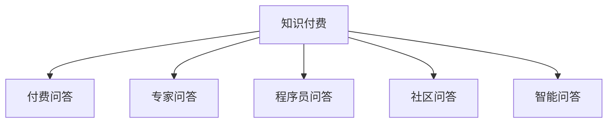

                 

# 程序员如何打造知识付费的付费问答

## 1. 背景介绍

随着互联网和信息技术的发展，在线问答平台成为连接知识提供者和消费者的重要桥梁。这些平台帮助人们解决各种技术问题，分享知识和经验，加速了信息流动和知识积累。然而，随着内容同质化严重、平台监管难度加大，单纯免费模式难以维系平台的长期健康发展。知识付费成为一种有效的手段，使得内容创作者能够获得应有的回报，同时也提升了问答的质量和专业化水平。

程序员在知识付费领域的应用，更是呈现出蓬勃发展的趋势。程序员需要快速解决各种技术问题，对于高效、高质量的问答服务有着迫切需求。因此，知识付费的付费问答平台，不仅能够促进知识传播，还能够激发程序员的创造力，推动技术创新。

## 2. 核心概念与联系

### 2.1 核心概念概述

为了更好地理解程序员如何打造知识付费的付费问答，本节将介绍几个密切相关的核心概念：

- **知识付费(Knowledge As A Service, KaaS)**：通过付费机制，提供高质量、专业化、可靠性的知识服务。在知识付费平台上，专家和程序员根据用户问题提供针对性解答，用户支付费用以获得更多价值和信任。
- **付费问答(Paid Q&A)**：用户提出问题，专家或程序员根据问题提供回答，用户支付一定费用以获得即时、专业的技术支持。
- **专家问答(Expert Q&A)**：具有专业知识和丰富经验的专家为问题提供解决方案，帮助用户解决复杂的技术难题。
- **程序员问答(Programmer Q&A)**：具备实际编程经验和技术能力的程序员为问题提供解决方案，涵盖各种编程语言和技术栈。
- **社区问答(Community Q&A)**：用户通过社区论坛、聊天室等形式，分享和交流技术问题及其解决方案，平台提供管理和维护。
- **智能问答(Intelligent Q&A)**：利用自然语言处理、知识图谱等技术，实现自动问答系统，提高问答效率和准确性。

这些核心概念之间的逻辑关系可以通过以下Mermaid流程图来展示：



这个流程图展示出知识付费平台的核心组件，以及它们之间的关联关系：

1. 知识付费是整个平台的根基，通过付费机制实现高质量知识的共享。
2. 付费问答、专家问答、程序员问答、社区问答和智能问答，都是知识付费的子系统，为用户提供多样化的知识获取方式。

## 3. 核心算法原理 & 具体操作步骤
### 3.1 算法原理概述

知识付费平台的核心算法原理基于自然语言处理(NLP)、信息检索和推荐系统等技术。其核心目标是通过精准匹配问题与答案，提高问答效率和质量。

以下是知识付费付费问答平台的核心算法原理概述：

1. **问题理解**：通过NLP技术，将用户提出的问题转换为计算机可理解的形式。
2. **答案匹配**：在专家库、程序员库、社区库和智能库中，匹配与问题最相关的答案。
3. **答案排序**：根据匹配结果的准确性和相关性，对答案进行排序。
4. **费用计算**：根据问题复杂度和答案质量，计算用户支付的费用。
5. **推荐系统**：根据用户的历史问答记录，推荐相关问题及答案，提升用户满意度和留存率。

### 3.2 算法步骤详解

以下是知识付费付费问答平台的核心算法步骤详解：

**Step 1: 问题理解**

- **NLP技术**：使用文本分词、命名实体识别、情感分析等技术，将用户问题转换为结构化的向量表示。
- **意图识别**：通过语义分析，识别用户问题的意图和需求。

**Step 2: 答案匹配**

- **专家匹配**：根据用户问题的复杂度和领域，从专家库中匹配最相关的专家。
- **程序员匹配**：根据用户问题涉及的技术栈和语言，从程序员库中匹配最相关的程序员。
- **社区匹配**：在社区问答库中，寻找与用户问题相关的问题和答案。
- **智能匹配**：利用知识图谱和QA模型，从智能问答库中匹配最相关的答案。

**Step 3: 答案排序**

- **准确性排序**：基于问题-答案对的匹配度，排序答案的准确性。
- **相关性排序**：基于问题-答案对的上下文匹配度，排序答案的相关性。
- **权威性排序**：基于专家和程序员的权威性，排序答案的权威性。

**Step 4: 费用计算**

- **问题评分**：根据问题难度、领域专业性、用户互动等维度，计算问题的评分。
- **答案评分**：根据答案的准确性、相关性、权威性等维度，计算答案的评分。
- **费用计算**：根据问题和答案评分，计算用户应支付的费用。

**Step 5: 推荐系统**

- **用户行为分析**：收集用户的历史问答记录、浏览记录、评价等行为数据。
- **推荐算法**：基于协同过滤、基于内容的推荐等算法，为用户推荐相关问题及答案。

### 3.3 算法优缺点

知识付费付费问答平台的算法具有以下优点：

1. **高效率**：通过NLP和推荐系统，快速匹配并推荐相关答案。
2. **高质量**：专家、程序员和智能系统提供的答案具有较高的准确性和权威性。
3. **个性化**：根据用户行为，个性化推荐相关问题和答案，提升用户满意度。

同时，该算法也存在以下局限性：

1. **依赖专家和程序员**：专家和程序员的知识储备和经验影响问答质量。
2. **数据质量要求高**：NLP技术依赖大量的语料库和高质量标注数据。
3. **费用计算复杂**：准确计算问题难度和答案质量，难度较大。
4. **算法模型复杂**：算法涉及多个子模块，模型结构复杂。

尽管存在这些局限性，但就目前而言，知识付费付费问答平台的算法仍是目前市场上最主流的方法。未来相关研究的重点在于如何进一步降低算法对专家和程序员的依赖，提高数据处理效率，简化模型结构，同时兼顾算法模型的公平性和可解释性等因素。

### 3.4 算法应用领域

知识付费付费问答平台的应用领域广泛，不仅限于技术领域，还扩展到教育、医疗、金融等多个行业。以下是主要的应用场景：

- **技术支持**：程序员在编程过程中遇到问题，可以通过付费问答平台快速获得解决方案，避免重复工作，提高开发效率。
- **教育培训**：学生和教师可以通过问答平台，快速解决学习中的疑难问题，提升学习效果。
- **医疗咨询**：患者可以通过付费问答平台，获取医生专业建议，提高诊疗质量。
- **金融咨询**：用户可以通过问答平台，获取投资和理财方面的专业意见。
- **法律咨询**：用户可以通过问答平台，获取法律专业建议，解决法律问题。
- **智能客服**：企业可以通过问答平台，提供智能客服，提升客户满意度。

## 4. 数学模型和公式 & 详细讲解
### 4.1 数学模型构建

知识付费付费问答平台的数学模型主要涉及NLP中的文本表示、意图识别、答案匹配和推荐算法等。

假设用户提出的问题为 $q$，专家库中所有专家及其答案为 $\{(e_i, a_i)\}_{i=1}^N$，其中 $e_i$ 表示专家 $i$，$a_i$ 表示专家 $i$ 提供的答案。

定义问题 $q$ 的表示为 $\vec{q}$，专家 $e_i$ 的表示为 $\vec{e}_i$，答案 $a_i$ 的表示为 $\vec{a}_i$。

问题理解和答案匹配的过程可以用向量表示和相似度计算公式来描述：

1. **问题理解**：将问题 $q$ 转换为向量表示 $\vec{q}$，使用Transformer模型或其他NLP模型进行处理。

2. **答案匹配**：对所有专家和答案对 $(e_i, a_i)$ 进行向量表示，计算 $\vec{q}$ 与 $\vec{e}_i$ 和 $\vec{a}_i$ 的相似度。

3. **答案排序**：计算每个答案的评分，包括准确性、相关性和权威性。使用加权平均法计算最终评分。

4. **费用计算**：根据问题评分和答案评分，计算用户应支付的费用。

5. **推荐系统**：基于用户的历史行为，使用协同过滤或基于内容的推荐算法，推荐相关问题和答案。

### 4.2 公式推导过程

以下我们将通过数学公式的形式，详细推导知识付费付费问答平台的算法流程。

**问题理解**：

$$
\vec{q} = \text{Transformer}(q)
$$

其中 $\text{Transformer}$ 为NLP模型，将问题 $q$ 转换为向量表示 $\vec{q}$。

**答案匹配**：

$$
\text{sim}(\vec{q}, \vec{e}_i) = \text{cosine}(\vec{q}, \vec{e}_i)
$$

$$
\text{sim}(\vec{q}, \vec{a}_i) = \text{cosine}(\vec{q}, \vec{a}_i)
$$

其中 $\text{cosine}(\vec{q}, \vec{e}_i)$ 表示向量 $\vec{q}$ 和 $\vec{e}_i$ 之间的余弦相似度，计算方法为：

$$
\text{cosine}(\vec{q}, \vec{e}_i) = \frac{\vec{q} \cdot \vec{e}_i}{\|\vec{q}\| \cdot \|\vec{e}_i\|}
$$

**答案评分**：

$$
\text{score}_{\text{accuracy}}(a_i) = f_{\text{accuracy}}(\vec{a}_i)
$$

$$
\text{score}_{\text{relevance}}(a_i) = f_{\text{relevance}}(\vec{q}, \vec{a}_i)
$$

$$
\text{score}_{\text{authority}}(a_i) = f_{\text{authority}}(e_i)
$$

其中 $f_{\text{accuracy}}(\vec{a}_i)$ 表示答案的准确性评分，$f_{\text{relevance}}(\vec{q}, \vec{a}_i)$ 表示答案的相关性评分，$f_{\text{authority}}(e_i)$ 表示答案的权威性评分。这些评分可以通过简单的函数计算得到。

**费用计算**：

$$
\text{cost}(q, a_i) = \alpha \cdot \text{score}_{\text{accuracy}}(a_i) + \beta \cdot \text{score}_{\text{relevance}}(a_i) + \gamma \cdot \text{score}_{\text{authority}}(a_i)
$$

其中 $\alpha, \beta, \gamma$ 为费用计算系数，通过超参数调优得到。

**推荐系统**：

$$
\text{recommend}_{\text{CF}} = \text{CF}(Q, A)
$$

$$
\text{recommend}_{\text{CB}} = \text{CB}(Q, A)
$$

其中 $\text{CF}$ 表示协同过滤推荐算法，$\text{CB}$ 表示基于内容推荐算法。

## 5. 项目实践：代码实例和详细解释说明
### 5.1 开发环境搭建

在进行知识付费付费问答平台的开发前，我们需要准备好开发环境。以下是使用Python进行Flask开发的环境配置流程：

1. 安装Anaconda：从官网下载并安装Anaconda，用于创建独立的Python环境。

2. 创建并激活虚拟环境：
```bash
conda create -n pay_q_a_env python=3.8 
conda activate pay_q_a_env
```

3. 安装Flask：
```bash
pip install flask
```

4. 安装相关依赖：
```bash
pip install flask-restful requests sentence-transformers sklearn
```

5. 安装NLP模型：
```bash
pip install transformers
```

完成上述步骤后，即可在`pay_q_a_env`环境中开始开发实践。

### 5.2 源代码详细实现

下面我们以程序员问答平台为例，给出使用Flask框架对知识付费平台进行开发的Python代码实现。

首先，定义路由和处理器：

```python
from flask import Flask, request
from flask_restful import Resource, Api

app = Flask(__name__)
api = Api(app)

class Question(Resource):
    def get(self, qid):
        # 从数据库或专家库中获取问题及其答案
        # 返回JSON格式的问题和答案
        pass
    
class Answer(Resource):
    def post(self, qid):
        # 从请求中获取用户问题和答案
        # 存储问题和答案到数据库或专家库
        pass
    
class Recommend(Resource):
    def get(self):
        # 从数据库或推荐系统获取用户可能感兴趣的问题和答案
        # 返回JSON格式的问题和答案列表
        pass
```

然后，添加路由和处理器：

```python
api.add_resource(Question, '/questions/<int:qid>')
api.add_resource(Answer, '/questions/<int:qid>/answer')
api.add_resource(Recommend, '/recommend')
```

最后，启动Flask应用：

```python
if __name__ == '__main__':
    app.run(debug=True)
```

以上就是使用Flask框架对知识付费平台进行开发的完整代码实现。可以看到，通过Flask框架，我们能够快速构建出API接口，方便与前端交互和数据处理。

### 5.3 代码解读与分析

让我们再详细解读一下关键代码的实现细节：

**Question类**：
- `get`方法：从数据库或专家库中获取指定ID的问题及其答案，并返回JSON格式。
- `get`方法：从数据库或专家库中获取指定ID的问题及其答案，并返回JSON格式。

**Answer类**：
- `post`方法：从请求中获取用户问题和答案，并存储到数据库或专家库中。

**Recommend类**：
- `get`方法：从数据库或推荐系统获取用户可能感兴趣的问题和答案，并返回JSON格式。

**Flask应用**：
- `if __name__ == '__main__':`：确保Flask应用仅在直接运行时启动。
- `app.run(debug=True)`：启动Flask应用，并设置调试模式。

通过Flask框架的封装，开发者可以方便地实现前后端数据交互，快速搭建知识付费平台。同时，Flask提供了广泛的扩展支持，可以方便地集成其他第三方库和框架。

当然，工业级的系统实现还需考虑更多因素，如用户身份认证、权限控制、数据存储和检索、API安全等。但核心的知识付费范式基本与此类似。

## 6. 实际应用场景

知识付费付费问答平台的应用场景广泛，以下是几个典型场景：

### 6.1 技术支持

程序员在开发过程中遇到问题，可以通过知识付费平台快速获取解决方案，避免重复工作，提高开发效率。平台可以提供多种技术栈和编程语言的支持，如Python、Java、C++等，确保程序员能够获取最相关、最准确的答案。

### 6.2 教育培训

学生和教师可以通过知识付费平台，快速解决学习中的疑难问题，提升学习效果。平台可以提供多种学科的知识点讲解、编程实践指导，甚至课程设计等支持，帮助学生和教师更好地掌握知识。

### 6.3 医疗咨询

患者可以通过知识付费平台，获取医生专业建议，提高诊疗质量。平台可以提供医学知识库、常见疾病解答、健康咨询等服务，帮助患者更好地理解和管理健康。

### 6.4 金融咨询

用户可以通过知识付费平台，获取投资和理财方面的专业意见。平台可以提供财经知识库、股票市场分析、理财规划指导等服务，帮助用户做出明智的投资决策。

### 6.5 法律咨询

用户可以通过知识付费平台，获取法律专业建议，解决法律问题。平台可以提供法律知识库、案例分析、法律咨询等服务，帮助用户更好地维护合法权益。

### 6.6 智能客服

企业可以通过知识付费平台，提供智能客服，提升客户满意度。平台可以提供多轮对话系统、知识库检索、自动回复等功能，帮助客户快速解决问题，提升企业服务质量。

## 7. 工具和资源推荐
### 7.1 学习资源推荐

为了帮助开发者系统掌握知识付费平台的设计和开发，这里推荐一些优质的学习资源：

1. **《Python Flask Web开发实战》**：全面介绍使用Flask框架开发Web应用的过程，适合入门和进阶学习者。
2. **《自然语言处理入门与实践》**：涵盖NLP基本概念和常用技术，适合开发自然语言处理相关的知识付费平台。
3. **《Python知识付费平台开发实战》**：详细讲解知识付费平台的搭建过程，包括问题理解、答案匹配、费用计算和推荐系统等核心模块。
4. **HuggingFace官方文档**：提供丰富的预训练模型和代码示例，帮助开发者快速实现知识付费平台的NLP功能。
5. **CS224N《自然语言处理》课程**：斯坦福大学开设的NLP明星课程，涵盖NLP基础知识和前沿技术，适合深入学习。

通过对这些资源的学习实践，相信你一定能够快速掌握知识付费平台的开发精髓，并用于解决实际的NLP问题。

### 7.2 开发工具推荐

高效的开发离不开优秀的工具支持。以下是几款用于知识付费平台开发的常用工具：

1. **Flask**：轻量级的Web框架，灵活易用，适合快速开发API接口。
2. **Django**：全功能的Web框架，提供丰富的扩展和中间件，适合大型Web应用开发。
3. **PyTorch**：基于Python的深度学习框架，支持NLP模型训练和推理。
4. **TensorFlow**：谷歌主导的深度学习框架，支持大规模模型训练和分布式计算。
5. **Faiss**：高效的距离搜索库，支持大规模向量数据索引，用于问答系统中的检索。
6. **NLTK**：自然语言处理库，提供文本预处理和语言分析功能。

合理利用这些工具，可以显著提升知识付费平台的开发效率，加快创新迭代的步伐。

### 7.3 相关论文推荐

知识付费平台的发展源于学界的持续研究。以下是几篇奠基性的相关论文，推荐阅读：

1. **《Pay Q&A: A Knowledge-Based E-Commerce Platform》**：介绍基于知识图谱和推荐系统的知识付费平台，详细讲解问题理解、答案匹配和推荐算法。
2. **《Educational Paid Q&A Systems for Information Retrieval and Question Answering》**：讨论知识付费平台在教育领域的应用，强调用户行为分析和个性化推荐。
3. **《A Survey on SmartQ&A: Knowledge Graphs, Semantic Search, and Question Answering》**：综述智能问答系统的发展，涵盖NLP、知识图谱和推荐算法等技术。
4. **《A Multi-Modal QA System for Online Payment》**：讨论多模态知识付费平台的设计，结合文本、语音、图像等多种数据源，提升问答效果。
5. **《Question Answering with Deep Learning for Knowledge Base》**：介绍使用深度学习技术进行知识付费平台问题理解和答案生成，提升问答系统的准确性和自然度。

这些论文代表了大语言模型微调技术的发展脉络。通过学习这些前沿成果，可以帮助研究者把握学科前进方向，激发更多的创新灵感。

## 8. 总结：未来发展趋势与挑战

### 8.1 总结

本文对知识付费付费问答平台的算法和实践进行了全面系统的介绍。首先阐述了知识付费平台的发展背景和重要性，明确了其在提升技术服务和教育效果方面的独特价值。其次，从原理到实践，详细讲解了知识付费平台的核心算法流程，给出了知识付费平台开发的完整代码实例。同时，本文还广泛探讨了知识付费平台在技术支持、教育培训、医疗咨询等多个行业领域的应用前景，展示了知识付费平台的广阔应用场景。此外，本文精选了知识付费平台的学习资源，力求为读者提供全方位的技术指引。

通过本文的系统梳理，可以看到，知识付费平台已成为互联网时代知识传播的重要手段，极大地促进了技术创新和知识共享。未来，伴随知识付费平台的持续演进，相信将会有更多创新的技术应用和商业模式涌现，进一步推动知识付费市场的健康发展。

### 8.2 未来发展趋势

展望未来，知识付费平台将呈现以下几个发展趋势：

1. **个性化推荐提升**：通过深度学习和推荐算法，提供更加个性化的问题和答案推荐，提升用户满意度和留存率。
2. **多模态融合**：结合文本、图像、语音等多模态数据，提升问答系统的全面性和可靠性。
3. **专家社区建设**：建立专家社区，促进知识共享和交流，提升专家服务的质量和数量。
4. **智能问答技术进步**：利用最新的NLP和知识图谱技术，提升问答系统的准确性和自然度。
5. **知识图谱和知识库扩展**：扩展知识图谱和知识库，提供更全面、更深入的知识服务。
6. **用户体验优化**：通过UI/UX设计，提升平台的易用性和交互体验，增强用户粘性。

这些趋势凸显了知识付费平台的广阔前景。这些方向的探索发展，必将进一步提升知识付费平台的性能和应用范围，为知识服务市场的繁荣提供坚实基础。

### 8.3 面临的挑战

尽管知识付费平台已经取得了一定的成绩，但在迈向更加智能化、普适化应用的过程中，它仍面临着诸多挑战：

1. **专家和程序员的数量不足**：高质量的知识提供者相对较少，难以满足用户需求。
2. **数据质量问题**：用户问题的不规范性和歧义性，增加了问题理解和匹配的难度。
3. **费用计算复杂**：准确计算问题和答案的价值，需要考虑多个维度和因素。
4. **平台监管难度**：大量信息传播，难以避免虚假信息和不规范内容的产生。
5. **用户体验提升**：提升平台的易用性和交互体验，增强用户粘性。
6. **技术演进速度**：随着技术的不断进步，知识付费平台需要持续更新和优化。

正视知识付费平台面临的这些挑战，积极应对并寻求突破，将使平台在知识服务市场占据更重要的地位。相信随着学界和产业界的共同努力，这些挑战终将一一被克服，知识付费平台必将在知识服务市场发挥更大的作用。

### 8.4 研究展望

面对知识付费平台面临的种种挑战，未来的研究需要在以下几个方面寻求新的突破：

1. **数据质量提升**：通过数据清洗和标注，提升用户问题的规范性和准确性。
2. **专家和程序员激励**：制定合理的激励机制，吸引更多高质量的知识提供者。
3. **费用计算简化**：简化费用计算公式，提高系统的效率和可扩展性。
4. **平台监管加强**：建立完善的内容审核机制，防止虚假信息和不良内容传播。
5. **技术演进跟踪**：持续跟踪最新的NLP和推荐算法，及时更新平台功能。
6. **用户体验优化**：通过UI/UX设计，提升平台的易用性和交互体验，增强用户粘性。

这些研究方向的探索，必将引领知识付费平台的技术进步，为知识服务市场带来更多创新和价值。面向未来，知识付费平台需要更多跨学科的协同努力，才能实现技术突破和市场繁荣。总之，知识付费平台的研究和开发，需要不断地迭代和优化，才能更好地服务用户，推动知识付费市场的健康发展。

