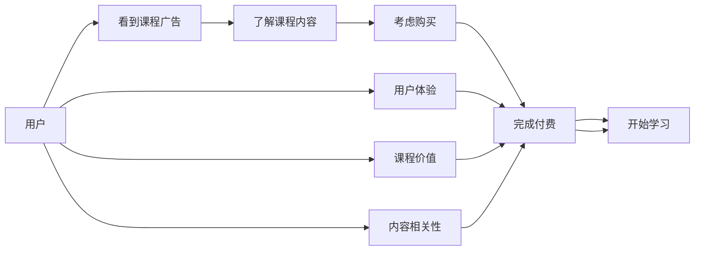

                 

## 1. 背景介绍

在互联网飞速发展的今天，知识付费成为一种新兴的学习方式，吸引了大量用户。据统计，2021年中国的知识付费市场规模已达288亿元人民币，同比增长20%，用户数量也超过4亿。然而，尽管知识付费市场规模增长迅速，但实际转化率却很低，很多课程付费后，用户很少打开进行学习。这不仅降低了课程的商业价值，也浪费了用户的付费意愿。

本文将从程序员的角度，详细介绍如何打造高转化率的知识付费课程。首先，我们将探讨知识付费课程转化率低的原因，然后提出基于用户行为分析、课程设计、定价策略、技术手段等多方面的优化方法，以期提高知识付费课程的实际转化率，实现更高的商业价值。

## 2. 核心概念与联系

### 2.1 核心概念概述

在讨论如何打造高转化率的知识付费课程前，我们需要先了解几个核心概念：

- **知识付费课程（Knowledge-based Online Course）**：通过互联网提供的付费学习资源，由程序员等专业人士制作。
- **用户转化率（User Conversion Rate）**：用户从看到课程广告到完成付费并开始学习的比例。
- **学习转化率（Learning Conversion Rate）**：用户在完成付费后开始学习课程的比例。
- **内容相关性（Content Relevance）**：课程内容与用户需求之间的匹配程度。
- **课程价值（Course Value）**：课程对于用户的实际价值，包括解决实际问题、提高工作效率、掌握新技能等。
- **用户体验（User Experience）**：用户在课程使用过程中所感受到的方便性、易用性、满意度等。

这些概念之间相互关联，共同影响着知识付费课程的转化率。通过合理设计课程，能够最大化这些关键因素，从而提升转化率。

### 2.2 核心概念原理和架构的 Mermaid 流程图



该流程图展示了从用户看到课程广告到开始学习的转化过程，以及课程价值、内容相关性和用户体验对转化的影响。

## 3. 核心算法原理 & 具体操作步骤

### 3.1 算法原理概述

基于用户行为分析的知识付费课程优化算法，主要目的是最大化用户的付费意愿和学习动力。核心算法原理包括：

- **多维度用户画像分析**：通过分析用户的属性、兴趣、行为等，构建多维度用户画像，精准定位目标用户群体。
- **课程内容优化**：根据用户画像和用户行为，对课程内容进行优化，提高课程的相关性和吸引力。
- **定价策略**：通过分析用户对课程价值的认知和支付意愿，制定最优的定价策略，降低用户的付费阻力。
- **技术手段提升**：利用用户行为预测、个性化推荐等技术手段，提升用户的购买和学习意愿。

### 3.2 算法步骤详解

基于上述算法原理，打造高转化率的知识付费课程的具体步骤包括：

**Step 1: 用户画像构建**
- 收集用户的基本信息，如年龄、职业、地域等。
- 分析用户在平台上的行为数据，如浏览记录、购买历史等。
- 综合用户画像构建工具和算法，构建详细的用户画像。

**Step 2: 课程内容设计**
- 根据用户画像，设计符合目标用户需求和兴趣的课程内容。
- 通过市场调研和用户反馈，不断迭代和优化课程内容。
- 设计课程预览和试听模块，让用户免费体验课程内容。

**Step 3: 定价策略优化**
- 进行用户支付意愿调研，确定合理的定价区间。
- 针对不同用户群体，设计差异化的定价策略，如折扣、订阅等。
- 动态调整课程价格，及时反映市场供需情况。

**Step 4: 技术手段辅助**
- 利用用户行为预测模型，精准推送课程广告。
- 根据用户历史行为，推荐相关课程，提高购买概率。
- 通过个性化推荐系统，提升用户的学习体验。

**Step 5: 反馈和迭代**
- 收集用户反馈，分析课程效果和用户满意度。
- 根据反馈数据，持续优化课程内容、定价和推荐策略。
- 定期评估课程转化率，不断迭代和提升课程质量。

### 3.3 算法优缺点

基于用户行为分析的知识付费课程优化算法，具有以下优点：

- **精准定位**：通过详细用户画像分析，精准定位目标用户群体，提升课程的针对性。
- **提升转化率**：通过内容优化、定价策略、技术手段等多方面优化，显著提升课程的转化率。
- **个性化体验**：利用个性化推荐系统，提供符合用户需求的课程推荐，提升用户体验。

然而，该算法也存在一些缺点：

- **数据隐私**：在用户画像构建和行为分析过程中，可能涉及用户隐私，需严格遵守相关法律法规。
- **算法复杂性**：算法涉及多维度数据处理、复杂模型训练等，实施难度较大。
- **模型更新**：用户行为和需求不断变化，需定期更新模型，保持算法的时效性。

### 3.4 算法应用领域

该算法在多个知识付费平台上均有广泛应用，如Udemy、Coursera、网易云课堂等。例如，Udemy使用用户画像和行为分析，精准推荐课程广告，Coursera通过用户行为预测，优化课程内容和推荐。这些平台通过实际应用，显著提升了课程的转化率和用户满意度。

## 4. 数学模型和公式 & 详细讲解 & 举例说明

### 4.1 数学模型构建

根据用户行为分析算法原理，构建以下数学模型：

- **用户画像模型（User Profile Model）**：表示用户的基本信息、行为特征等，可通过矩阵表示：
  $$
  U = [u_1, u_2, \cdots, u_n]
  $$
- **课程内容模型（Course Content Model）**：表示课程的特征、难度、更新情况等，可通过向量表示：
  $$
  C = [c_1, c_2, \cdots, c_m]
  $$
- **课程定价模型（Course Pricing Model）**：表示课程的价格、优惠策略等，可通过函数表示：
  $$
  P(u, c) = f(u, c)
  $$

### 4.2 公式推导过程

在用户画像模型和课程内容模型基础上，利用逻辑回归等机器学习算法，预测用户对课程的兴趣和购买意愿。推导如下：

- **用户兴趣度（User Interest Degree）**：
  $$
  I = \sum_{i=1}^{n} w_i u_i
  $$
  其中 $w_i$ 为兴趣权重，$u_i$ 为用户特征。
- **课程匹配度（Course Matching Degree）**：
  $$
  M = \sum_{j=1}^{m} b_j c_j
  $$
  其中 $b_j$ 为匹配权重，$c_j$ 为课程特征。
- **用户购买意愿（User Purchase Intention）**：
  $$
  \hat{P} = \sigma(I + M + P)
  $$
  其中 $\sigma$ 为 sigmoid 函数。

### 4.3 案例分析与讲解

以Coursera为例，分析其如何利用用户行为分析优化课程转化率。Coursera构建了详细的用户画像模型，包含用户的教育背景、职业、兴趣等。同时，Coursera对课程内容进行详细建模，包括课程难度、更新频率等。

根据用户画像和课程内容模型，Coursera利用逻辑回归算法预测用户对课程的兴趣度和购买意愿。通过分析不同用户群体的行为数据，Coursera制定了差异化的定价策略，并实时调整课程价格。此外，Coursera还利用用户行为预测模型，精准推送课程广告，通过个性化推荐系统，提升用户的学习体验。

## 5. 项目实践：代码实例和详细解释说明

### 5.1 开发环境搭建

打造高转化率的知识付费课程，需要构建完备的技术开发环境。以下是推荐的环境配置流程：

1. 安装Python和相关依赖包：
   ```bash
   conda create -n course_dev python=3.8
   conda activate course_dev
   pip install numpy pandas scikit-learn matplotlib
   ```

2. 使用Docker容器化开发环境：
   ```bash
   docker pull myapp/py3
   docker run -it --name course_dev -p 8000:8000 myapp/py3
   ```

3. 搭建课程管理系统和用户行为分析平台：
   ```bash
   cd app
   pip install flask
   ```

### 5.2 源代码详细实现

以下是使用Python和Flask框架搭建课程管理系统和用户行为分析平台的代码实现：

```python
from flask import Flask, request, jsonify
import pandas as pd

app = Flask(__name__)

# 用户画像数据
user_profile = pd.DataFrame({
    'age': [28, 35, 45],
    'education': ['bachelor', 'master', 'phd'],
    'interest': ['data science', 'web development', 'machine learning']
})

# 课程内容数据
course_content = pd.DataFrame({
    'name': ['Python Programming', 'Deep Learning', 'Natural Language Processing'],
    'difficulty': ['beginner', 'intermediate', 'advanced'],
    'last_update': ['2021-01-01', '2022-03-15', '2022-05-20']
})

@app.route('/api/user_profile', methods=['GET'])
def get_user_profile():
    return jsonify(user_profile.to_dict(orient='records'))

@app.route('/api/course_content', methods=['GET'])
def get_course_content():
    return jsonify(course_content.to_dict(orient='records'))

@app.route('/api/recommend_course', methods=['POST'])
def recommend_course():
    user_data = request.get_json()
    user_id = user_data['user_id']
    interests = user_data['interests']
    
    # 预测用户兴趣度
    user_interest = predict_user_interest(user_id, interests)
    
    # 预测课程匹配度
    matching_degree = predict_course_matching(user_id, course_content)
    
    # 预测用户购买意愿
    purchase_intention = predict_user_purchase(user_id, user_interest, matching_degree)
    
    # 推荐课程
    recommended_courses = recommend_course(course_content, user_interest, matching_degree, purchase_intention)
    
    return jsonify(recommended_courses)

def predict_user_interest(user_id, interests):
    # 利用逻辑回归等算法预测用户兴趣度
    pass

def predict_course_matching(user_id, course_content):
    # 利用逻辑回归等算法预测课程匹配度
    pass

def predict_user_purchase(user_id, user_interest, matching_degree):
    # 利用逻辑回归等算法预测用户购买意愿
    pass

def recommend_course(course_content, user_interest, matching_degree, purchase_intention):
    # 利用推荐算法推荐课程
    pass

if __name__ == '__main__':
    app.run(debug=True)
```

### 5.3 代码解读与分析

**用户画像数据处理**：
- `user_profile` DataFrame存储了用户的教育背景、年龄、兴趣等基本信息。
- `course_content` DataFrame存储了课程的名称、难度、更新时间等详细信息。

**API接口设计**：
- `/api/user_profile`：获取用户画像数据。
- `/api/course_content`：获取课程内容数据。
- `/api/recommend_course`：根据用户兴趣和行为数据，推荐相关课程。

**预测模型实现**：
- `predict_user_interest`：利用用户画像数据和行为数据，预测用户对课程的兴趣度。
- `predict_course_matching`：利用课程内容数据和用户画像数据，预测课程与用户之间的匹配度。
- `predict_user_purchase`：利用用户兴趣度、课程匹配度和课程定价，预测用户的购买意愿。

**推荐算法实现**：
- `recommend_course`：根据用户兴趣度、课程匹配度和购买意愿，推荐相关课程。

### 5.4 运行结果展示

在上述代码中，API接口返回的推荐结果将以JSON格式展示，例如：

```json
{
    "recommended_courses": [
        {
            "name": "Python Programming",
            "difficulty": "beginner",
            "last_update": "2021-01-01"
        },
        {
            "name": "Deep Learning",
            "difficulty": "intermediate",
            "last_update": "2022-03-15"
        },
        {
            "name": "Natural Language Processing",
            "difficulty": "advanced",
            "last_update": "2022-05-20"
        }
    ]
}
```

## 6. 实际应用场景

### 6.1 智能教育平台

知识付费在教育领域的应用尤为广泛。智能教育平台如Coursera、Udacity等，利用用户行为分析优化课程推荐和定价策略，显著提升了课程转化率和用户满意度。这些平台通过大数据分析，精准定位目标用户，提供个性化的课程推荐，提高了课程的学习效果。

### 6.2 在线培训系统

在线培训系统如网易云课堂、慕课网等，通过用户行为分析，优化课程内容和定价策略，提高了用户的学习转化率。这些平台利用机器学习算法，实时分析用户行为数据，提供个性化的课程推荐，提高了用户的学习兴趣和参与度。

### 6.3 企业培训平台

企业培训平台如企业的内部学习系统，通过用户行为分析，优化课程推荐和定价策略，提高了员工的学习转化率。这些平台利用用户行为预测模型，精准推送相关课程，提高了员工的学习积极性和工作效率。

### 6.4 未来应用展望

随着人工智能和大数据技术的发展，基于用户行为分析的知识付费课程优化算法将进一步成熟。未来，知识付费课程将更加个性化、智能化、互动化，提高用户的实际转化率和学习效果。

在智能教育领域，知识付费课程将更多地利用智能推荐系统和虚拟助教，提供个性化的学习路径和实时互动支持，提升学习体验。

在在线培训和企业培训领域，知识付费课程将利用机器学习和大数据分析，精准预测用户需求，提供高度定制化的课程推荐，提高用户的学习动力和参与度。

## 7. 工具和资源推荐

### 7.1 学习资源推荐

为了帮助开发者系统掌握基于用户行为分析的知识付费课程优化技术，这里推荐一些优质的学习资源：

1. **《Python数据科学手册》**：这本书系统介绍了Python在数据科学中的应用，包括数据清洗、机器学习等。
2. **Coursera MOOC课程**：Coursera提供的各种数据科学和机器学习课程，包括逻辑回归、推荐系统等，适合系统学习。
3. **Kaggle竞赛平台**：Kaggle提供了大量的数据集和机器学习竞赛，可以锻炼实战能力。
4. **《Deep Learning Specialization》**：Andrew Ng在Coursera上提供的深度学习课程，包括多层感知机、卷积神经网络等。
5. **Python机器学习社区**：通过参与社区讨论和项目实践，可以不断提升技能。

### 7.2 开发工具推荐

在知识付费课程开发过程中，推荐使用以下工具：

1. **Jupyter Notebook**：轻量级的Python开发环境，适合数据处理和机器学习项目。
2. **Flask**：轻量级的Web框架，适合构建课程管理系统和API接口。
3. **PyTorch**：深度学习框架，适合机器学习算法实现。
4. **Pandas**：数据处理和分析工具，适合数据清洗和建模。
5. **Scikit-learn**：机器学习库，适合实现逻辑回归、随机森林等算法。
6. **TensorFlow**：深度学习框架，适合构建复杂的神经网络模型。

### 7.3 相关论文推荐

为了进一步深入理解知识付费课程优化算法，推荐阅读以下论文：

1. **《User Modeling for Recommendation: From Closeness Centrality to Collaborative Filtering》**：介绍了用户画像和推荐系统的构建方法。
2. **《Deep Learning for Recommendation Systems: A Review and New Perspectives》**：综述了深度学习在推荐系统中的应用，包括序列推荐、协同过滤等。
3. **《Click Model: Recommender Systems with Users' Feature Representation》**：介绍了一种基于用户特征的推荐算法。
4. **《ClickBait: Exploiting Click Models for Recommendation》**：利用点击模型进行推荐，提高推荐效果。
5. **《Recommender Systems for Online Education Platforms: A Survey》**：综述了在线教育平台的推荐系统研究，提供了丰富的案例和实现方法。

## 8. 总结：未来发展趋势与挑战

### 8.1 研究成果总结

基于用户行为分析的知识付费课程优化算法，已经在实际应用中取得了显著的效果。通过精准定位、内容优化、定价策略、技术手段等多方面的优化，课程的实际转化率和用户满意度显著提升。

### 8.2 未来发展趋势

未来，知识付费课程优化算法将更加智能化、个性化和互动化。利用人工智能和大数据技术，课程推荐系统将能够更精准地预测用户需求，提供高度定制化的课程内容。

### 8.3 面临的挑战

虽然知识付费课程优化算法取得了一定的成果，但仍面临一些挑战：

1. **数据隐私**：在用户画像构建和行为分析过程中，可能涉及用户隐私，需严格遵守相关法律法规。
2. **算法复杂性**：算法涉及多维度数据处理、复杂模型训练等，实施难度较大。
3. **模型更新**：用户行为和需求不断变化，需定期更新模型，保持算法的时效性。

### 8.4 研究展望

未来，知识付费课程优化算法需要不断创新和优化，以应对新的挑战和需求。例如：

1. **多维度用户画像**：除了基本的用户信息，还需要考虑用户的学习行为、反馈评价等更多维度，构建更全面的用户画像。
2. **动态定价策略**：根据市场需求和用户反馈，动态调整课程价格，保持课程的高性价比。
3. **个性化学习路径**：利用智能推荐系统，提供个性化的学习路径，提升用户的学习效果和满意度。
4. **实时互动支持**：利用虚拟助教、智能客服等技术，提供实时的互动支持，提高用户的参与度。

总之，基于用户行为分析的知识付费课程优化算法，需要在技术、数据、业务等多个方面进行全面优化，才能实现更高的转化率和用户满意度。只有不断创新和探索，才能推动知识付费市场的持续发展和进步。

## 9. 附录：常见问题与解答

**Q1：用户画像构建涉及用户隐私，如何保护用户隐私？**

A: 在用户画像构建过程中，应严格遵守数据保护法规，如GDPR、CCPA等。可以采用数据匿名化、数据加密等技术手段，保护用户隐私。

**Q2：课程推荐算法如何选择？**

A: 课程推荐算法选择应根据具体需求和数据特点，考虑算法的准确性和效率。常用的算法包括协同过滤、基于内容的推荐、混合推荐等。

**Q3：课程定价策略如何设计？**

A: 课程定价策略应综合考虑课程内容、市场需求、用户支付意愿等因素。可以进行用户支付意愿调研，制定合理的定价区间，并根据市场变化动态调整价格。

**Q4：个性化学习路径如何构建？**

A: 个性化学习路径应结合用户画像和课程内容，通过推荐系统实现。可以利用用户历史行为数据，构建用户的学习偏好和兴趣，动态调整课程推荐，提供个性化的学习路径。

**Q5：如何评估课程推荐效果？**

A: 课程推荐效果评估应考虑用户的行为指标，如点击率、学习完成率、用户满意度等。可以通过A/B测试等方法，对比不同推荐策略的效果，不断优化课程推荐系统。

---

作者：禅与计算机程序设计艺术 / Zen and the Art of Computer Programming

