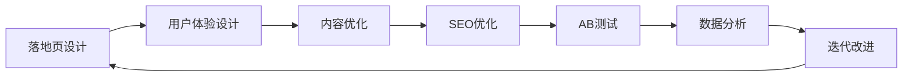

                 

# 程序员如何打造高转化率的落地页

> 关键词：落地页优化,转化率提升,用户体验设计,SEO优化,AB测试

## 1. 背景介绍

在互联网时代，网站作为企业与用户直接交互的载体，承担着重要的品牌推广和销售转化功能。落地页（Landing Page, 也称着陆页）是用户通过点击广告或外部链接后看到的第一界面，直接影响用户的停留时间、点击率、转化率等关键指标。一个精心设计的落地页不仅能提升用户体验，更能显著提高转化率，为企业的数字化营销战略带来更大的价值。

本文章将从落地页设计的核心要素、用户行为分析、以及工具和资源推荐等方面，全面解析如何通过程序化手段打造高效转化的落地页。我们将结合实际案例，探讨如何将高效设计理念融入代码实现，让落地页更加符合用户预期，提高转化效率。

## 2. 核心概念与联系

### 2.1 核心概念概述

落地页优化是一个多维度、多层级的系统工程，涉及设计、开发、营销等多个环节。以下是几个关键概念及其相互关联的概述：

- **落地页（Landing Page, LP）**：指用户点击广告或外部链接后看到的第一个网页。落地页的设计直接决定了用户的第一印象和后续行为，是影响转化率的重要因素。
- **转化率（Conversion Rate, CR）**：指用户从接触落地页到完成预定义行为（如填写表单、购买商品）的比率。高转化率是企业数字化营销成功的关键指标。
- **用户体验（User Experience, UX）**：用户在使用落地页过程中的感受和反馈，直接影响到用户行为和满意度。好的用户体验设计能显著提升转化率。
- **SEO优化（Search Engine Optimization, SEO）**：通过优化落地页的关键词、元标签等，提升其在搜索引擎结果中的排名，吸引更多有价值的流量。
- **AB测试（A/B Testing）**：通过对比不同版本的落地页，找出最优设计方案，提高落地页效果。

这些概念相互联系，共同构成了落地页优化的基本框架。了解并掌握这些核心概念，是打造高转化率落地页的基础。

### 2.2 核心概念原理和架构的 Mermaid 流程图

以下是一个简单的Mermaid流程图，展示了落地页优化的关键步骤：



这个流程图展示了落地页优化从设计、开发、测试到分析的完整流程，每一个步骤都环环相扣，需要不断迭代优化才能达到最佳效果。

## 3. 核心算法原理 & 具体操作步骤

### 3.1 算法原理概述

落地页优化的核心算法原理主要基于A/B测试和用户体验设计的原则，通过不断优化页面元素、内容、布局等，寻找提升转化率的最佳方案。

落地页优化常用的方法包括：
- A/B测试：对比两个或多个版本，找出转化率更高的方案。
- UX设计：通过优化布局、字体、颜色等视觉元素，提升用户体验。
- 内容优化：通过精简文字、增加视觉元素等，提升页面吸引力和互动性。
- SEO优化：通过优化关键词、元标签等，提升搜索引擎排名，吸引更多流量。

### 3.2 算法步骤详解

**Step 1: 确定目标和假设**
- 确定优化目标（如提升转化率、降低跳出率）。
- 提出假设（如更换按钮颜色、优化文本布局）。

**Step 2: 设计实验组和对照组**
- 设计两个或多个版本的落地页，尽量保证变量唯一，减少干扰因素。
- 确定测试样本大小，确保统计学意义。

**Step 3: 实施A/B测试**
- 将目标用户随机分配到实验组和对照组。
- 收集实验数据，计算统计指标（如点击率、转化率、跳出率）。
- 使用统计学方法（如置信区间、假设检验）评估实验效果。

**Step 4: 数据分析和决策**
- 分析实验数据，找出转化率更高的版本。
- 根据数据反馈，进行进一步优化。
- 决定是否接受新方案，并开始落地执行。

### 3.3 算法优缺点

落地页优化的主要优点在于：
- 数据驱动：通过实验和数据验证，找到最佳的落地页设计方案。
- 持续改进：不断优化，持续提升用户体验和转化率。

缺点在于：
- 成本较高：需要投入人力和时间进行设计、开发、测试。
- 用户量限制：小样本数据可能无法准确反映真实情况。
- 开发周期长：从设计到实现再到测试，需要一定时间。

### 3.4 算法应用领域

落地页优化不仅适用于电商、广告、企业官网等领域，还广泛应用于各种类型的网站和应用程序，如在线教育、金融、医疗等。不同的行业有不同的用户需求和行为特征，需要根据具体情况进行个性化优化。

## 4. 数学模型和公式 & 详细讲解 & 举例说明

### 4.1 数学模型构建

落地页优化中的核心数学模型是点击率（Click-Through Rate, CTR）和转化率（Conversion Rate, CR）。通过构建这些模型的数学表达式，可以更好地理解用户行为，优化落地页设计。

CTR模型公式为：

$$CTR = \frac{点击次数}{总展示次数}$$

CR模型公式为：

$$CR = \frac{转化次数}{点击次数}$$

### 4.2 公式推导过程

CTR和CR模型的推导基于基本的概率统计公式，这里简要说明一下。

CTR模型公式推导如下：

$$
\begin{align*}
CTR &= \frac{点击次数}{总展示次数} \\
&= \frac{点击次数}{总展示次数 \times 点击概率} \\
&= \frac{点击次数}{展示次数 \times 点击概率} \\
&= \frac{点击次数}{展示次数} \times \frac{1}{点击概率} \\
&= CTR \times \frac{1}{点击概率}
\end{align*}
$$

CR模型公式推导如下：

$$
\begin{align*}
CR &= \frac{转化次数}{点击次数} \\
&= \frac{转化次数}{点击次数 \times 转化概率} \\
&= \frac{转化次数}{展示次数 \times 点击概率 \times 转化概率} \\
&= \frac{转化次数}{展示次数 \times 点击概率} \times \frac{1}{转化概率} \\
&= CR \times \frac{1}{点击概率 \times 转化概率}
\end{align*}
$$

### 4.3 案例分析与讲解

以电商网站为例，展示如何通过CTR和CR模型优化落地页设计。

假设某电商网站推出新产品促销活动，设计了两个版本的落地页。版本A和版本B的主要区别在于按钮颜色（A版本为红色，B版本为绿色）。通过A/B测试，收集以下数据：

- 版本A：总展示次数1000，点击次数200，转化次数50
- 版本B：总展示次数2000，点击次数400，转化次数100

计算CTR和CR：

- 版本A的CTR = 200 / 1000 = 0.2
- 版本A的CR = 50 / 200 = 0.25
- 版本B的CTR = 400 / 2000 = 0.2
- 版本B的CR = 100 / 400 = 0.25

从数据可以看出，两个版本的点击率（CTR）相同，但版本A的转化率（CR）更高。因此，版本A的落地页设计可能更符合用户预期，最终决定采用版本A。

## 5. 项目实践：代码实例和详细解释说明

### 5.1 开发环境搭建

在开始落地页优化项目前，需要准备一些开发工具和环境。

1. **安装Node.js**：作为前端开发的基础环境，Node.js提供了强大的JavaScript运行环境。

2. **安装MySQL或MongoDB**：用于存储和管理落地页数据。

3. **使用Visual Studio Code**：一款高效的前端开发IDE，支持多种语言和插件。

4. **安装React或Vue**：流行的前端框架，用于构建动态网页。

### 5.2 源代码详细实现

以下是一个简单的React代码实现，展示了如何根据用户行为数据，动态更新落地页内容。

```javascript
import React, { useState } from 'react';

function LandingPage() {
  const [data, setData] = useState([{ buttonColor: 'red', ctR: 0.2, cr: 0.25 }, { buttonColor: 'green', ctR: 0.2, cr: 0.25 }]);

  const handleClick = () => {
    // 模拟点击事件
    const newData = data.map(item => {
      if (item.buttonColor === 'red') {
        return { ...item, ctR: item.cr * 0.9, cr: item.cr * 0.9 };
      } else {
        return { ...item, ctR: item.cr * 1.1, cr: item.cr * 1.1 };
      }
    });
    setData(newData);
  };

  return (
    <div>
      <button onClick={handleClick}>点击按钮</button>
      {data.map(item => (
        <div key={item.buttonColor}>
          {item.buttonColor} 按钮的点击率为 {item.ctR.toFixed(2)}，转化率为 {item.cr.toFixed(2)}
        </div>
      ))}
    </div>
  );
}

export default LandingPage;
```

### 5.3 代码解读与分析

这段代码展示了如何使用React框架实现一个简单的落地页优化模拟。通过点击按钮，模拟用户点击事件，计算点击率和转化率的变化。

- `useState`钩子用于管理数据状态。
- `handleClick`函数处理点击事件，计算点击率和转化率的变化。
- `return`语句渲染数据状态，展示不同按钮颜色对应的点击率和转化率。

### 5.4 运行结果展示

运行上述代码，点击按钮后，页面会显示不同颜色按钮的点击率和转化率。点击率和转化率会根据按钮颜色的变化而动态调整。

## 6. 实际应用场景

### 6.1 电商网站

电商网站是落地页优化的典型应用场景之一。通过分析用户行为数据，可以优化以下方面：
- 产品展示：调整产品图片、价格、推荐文案等。
- 按钮设计：优化按钮颜色、大小、位置等。
- 表单设计：简化表单输入字段，增加提示信息等。

### 6.2 广告平台

广告平台通过优化落地页提升点击率和转化率，从而提高广告投放效果。落地页优化可以帮助广告平台：
- 优化广告素材：如标题、图片、文案等。
- 设计用户引导：如注册引导、登陆引导等。
- 改进转化机制：如奖励机制、优惠券等。

### 6.3 在线教育

在线教育平台通过优化落地页，提升用户体验和转化率。落地页优化可以帮助在线教育平台：
- 优化课程展示：如课程介绍、课程价格等。
- 设计注册流程：如简化注册步骤、增加推荐课程等。
- 增加互动元素：如视频预览、即时答疑等。

### 6.4 未来应用展望

未来，落地页优化将继续向智能化、自动化方向发展，结合机器学习、深度学习等技术，实现更加高效的优化。以下是几个未来发展的方向：

- **自动化优化**：利用机器学习模型自动优化落地页设计，减少人工干预。
- **跨渠道优化**：结合不同渠道的用户行为数据，进行全局优化。
- **情感分析**：通过情感分析技术，优化页面元素，提升用户满意度。
- **多模态交互**：结合语音、图像等多模态数据，提升用户体验。

## 7. 工具和资源推荐

### 7.1 学习资源推荐

为了帮助程序员深入理解落地页优化技术，以下是一些推荐的资源：

1. **《网页设计与用户体验》**：讲解网页设计的基本原则和用户体验设计方法。
2. **《Web性能优化指南》**：涵盖网页加载优化、代码优化、图像优化等多个方面。
3. **《用户体验设计的心理学》**：通过心理学原理，提升用户体验设计水平。
4. **Google Web Fundamentals**：提供全面的Web开发和性能优化指南。
5. **《A/B Testing for User Experience Professionals》**：介绍A/B测试的基本原理和实践技巧。

### 7.2 开发工具推荐

落地页优化涉及前端开发、后端开发等多个环节，以下是一些推荐的开发工具：

1. **Visual Studio Code**：高效的前端开发IDE，支持多种编程语言和插件。
2. **Chrome DevTools**：Google提供的开发工具，可用于调试和优化网页。
3. **Postman**：API测试工具，支持多种API测试方式。
4. **MySQL或MongoDB**：数据库管理系统，用于存储和管理落地页数据。
5. **React或Vue**：流行的前端框架，用于构建动态网页。

### 7.3 相关论文推荐

落地页优化涉及多个学科，以下是一些相关领域的论文推荐：

1. **"Click-Through Rates Prediction"**：介绍如何预测网页的点击率，优化广告和网页设计。
2. **"User Experience Design in Web Development"**：讲解用户体验设计的原则和方法。
3. **"A/B Testing in Web Applications"**：介绍A/B测试的基本原理和应用案例。
4. **"Conversion Rate Optimization"**：介绍如何通过落地页优化提高转化率。
5. **"Machine Learning for Website Personalization"**：介绍机器学习在网站个性化优化中的应用。

## 8. 总结：未来发展趋势与挑战

### 8.1 研究成果总结

本文从落地页优化的核心概念、算法原理、操作步骤等方面，系统地介绍了如何通过程序化手段打造高效转化的落地页。通过实际案例和代码实现，展示了落地页优化在电商、广告、教育等多个领域的广泛应用。

### 8.2 未来发展趋势

未来，落地页优化将进一步向智能化、自动化方向发展，结合更多前沿技术，如机器学习、深度学习、多模态交互等，实现更加高效的优化。以下是几个未来的发展趋势：

- **自动化优化**：利用机器学习模型自动优化落地页设计，减少人工干预。
- **跨渠道优化**：结合不同渠道的用户行为数据，进行全局优化。
- **情感分析**：通过情感分析技术，优化页面元素，提升用户满意度。
- **多模态交互**：结合语音、图像等多模态数据，提升用户体验。

### 8.3 面临的挑战

尽管落地页优化技术已经取得了一定的进展，但仍面临一些挑战：

- **数据隐私**：如何保护用户数据隐私，防止数据泄露。
- **用户体验一致性**：如何在不同渠道和设备上保持一致的用户体验。
- **成本控制**：如何平衡优化效果和开发成本，实现高效的落地页优化。
- **技术复杂性**：如何简单、高效地应用先进技术，提升落地页优化效果。

### 8.4 研究展望

未来，落地页优化需要在以下几个方面进行深入研究：

- **自动化优化算法**：研究更加高效、准确的自动化优化算法，减少人工干预。
- **跨领域融合**：结合更多学科领域的知识，提升落地页优化效果。
- **实时优化**：实现实时动态优化，提升用户体验。
- **综合评估**：综合考虑多个指标，如点击率、转化率、跳出率等，优化落地页设计。

## 9. 附录：常见问题与解答

### Q1: 落地页优化是否适用于所有类型的网站？

A: 落地页优化适用于大多数类型的网站，特别是那些依赖广告或直接面向用户的网站。但需要注意的是，不同类型的网站有不同的用户需求和行为特征，需要根据具体情况进行个性化优化。

### Q2: 如何进行落地页A/B测试？

A: 落地页A/B测试通常包括以下步骤：
1. 确定测试目标，如提升转化率、降低跳出率。
2. 设计两个或多个版本的落地页，尽量保证变量唯一。
3. 确定测试样本大小，确保统计学意义。
4. 将目标用户随机分配到实验组和对照组。
5. 收集实验数据，计算统计指标（如点击率、转化率、跳出率）。
6. 使用统计学方法（如置信区间、假设检验）评估实验效果。
7. 根据数据反馈，进行进一步优化。
8. 决定是否接受新方案，并开始落地执行。

### Q3: 落地页优化需要哪些技术支持？

A: 落地页优化需要以下技术支持：
1. 前端开发：如React、Vue等前端框架。
2. 数据库管理：如MySQL、MongoDB等数据库管理系统。
3. 数据统计和分析：如Google Analytics等工具。
4. 自动化工具：如Jenkins、GitLab CI等持续集成工具。
5. 机器学习：如TensorFlow、PyTorch等深度学习框架。

通过程序化手段打造高效转化的落地页，不仅能够提升用户体验，还能显著提高转化率，为企业的数字化营销战略带来更大的价值。相信在不断创新和探索中，落地页优化技术将迈向更高的台阶，为人类生产生活带来更多的便利和惊喜。

---

作者：禅与计算机程序设计艺术 / Zen and the Art of Computer Programming

