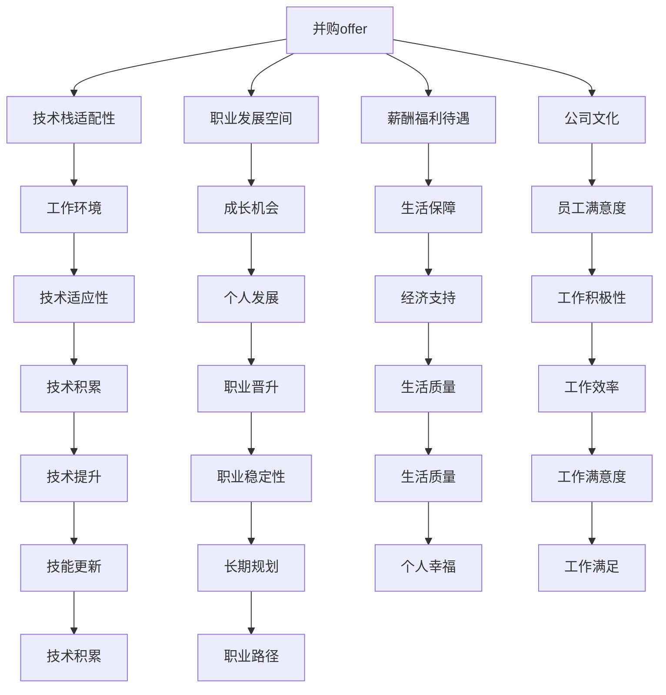
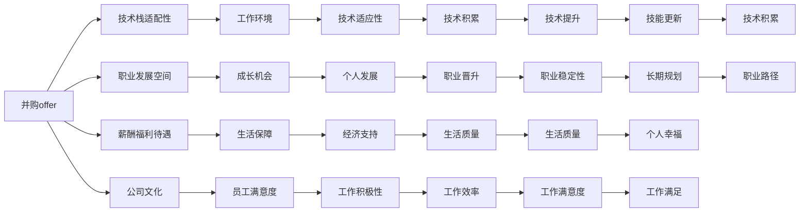

                 

# 程序员如何评估并购offer

在科技行业的快速发展中，并购成为了企业快速扩张、获取关键技术、人才和市场资源的重要手段。对于有意向跳入新公司的程序员来说，如何全面、客观地评估并购offer，成为了职业发展的关键决策之一。本文将从多个维度深入探讨，如何通过技术和业务角度，科学评估并购offer的价值。

## 1. 背景介绍

在数字化时代，技术的更新迭代迅速，企业的并购行为变得愈发频繁。对于程序员而言，选择一家能够提供稳定发展、丰富资源、优良企业文化的新公司，至关重要。评估并购offer，需要全面考虑技术栈适配性、职业发展空间、薪酬福利待遇等因素。

## 2. 核心概念与联系

### 2.1 核心概念概述

- **并购offer（M&A Offer）**：指企业收购目标公司的全部或部分股权，并由此成为目标公司的控股股东，进而实现业务整合、资源共享的过程。

- **技术栈适配性**：指目标公司的技术栈与当前程序员掌握的技能的匹配度。技术栈适配性越高，说明未来工作的技术环境更加熟悉，能够更快上手。

- **职业发展空间**：指目标公司提供的职业晋升渠道、培训机会等，对程序员职业发展的支持力度。

- **薪酬福利待遇**：包括基本薪资、奖金、股票期权、健康保险、带薪休假等，反映了目标公司对员工价值和贡献的认可程度。

- **公司文化**：指目标公司的企业文化、团队氛围、管理方式等，对员工的职业满意度和工作积极性有着直接的影响。

这些核心概念之间的关系，通过以下Mermaid流程图得以直观展示：



### 2.2 核心概念原理和架构的 Mermaid 流程图

下图展示了基于上述核心概念构建的并购offer评估模型。每个概念都通过双向箭头连接到其他概念，形成了一个相互关联、相互影响的系统。



## 3. 核心算法原理 & 具体操作步骤

### 3.1 算法原理概述

评估并购offer，实际上是对多个指标进行综合打分，再通过加权平均得到最终评估结果。这本质上是一个多维度评价系统，通过构建评分模型，综合考虑各指标对offer的整体影响。

### 3.2 算法步骤详解

1. **收集并购信息**：获取目标公司的基本信息，包括公司背景、产品线、技术栈、市场地位等。
2. **技术栈适配性评估**：评估当前技能与目标公司技术栈的匹配度，参考开源项目、技术博客、招聘要求等。
3. **职业发展空间评估**：研究目标公司的晋升路径、培训机会、技术栈扩展等，了解公司对内部员工的培养和支持。
4. **薪酬福利待遇评估**：比较目标公司的薪酬水平、福利待遇、股票期权等，分析其对人才的吸引力和留用策略。
5. **公司文化评估**：通过面试、公司官网、员工评价、行业口碑等渠道，了解目标公司的企业文化和管理方式。
6. **加权平均计算**：根据各指标的重要程度，设置权重，计算加权平均得分。
7. **综合判断与决策**：综合考虑评分结果和个人职业规划、市场环境等因素，做出最终选择。

### 3.3 算法优缺点

#### 优点

- **全面性**：通过多维度评价，综合考虑各种因素，确保评估的全面性和客观性。
- **可操作性**：每个指标都有明确的数据来源和评估方法，便于实际操作。
- **灵活性**：可以根据个人情况调整各指标的权重，实现个性化评估。

#### 缺点

- **数据获取难度**：部分指标（如公司文化）难以通过公开渠道获取，需要依赖个人经验或市场口碑。
- **权重设定主观**：各指标的重要性评估存在主观性，可能导致结果偏差。
- **动态变化**：市场环境、公司战略等可能发生变化，评估结果需动态调整。

### 3.4 算法应用领域

评估并购offer的方法，适用于各类IT企业招聘、求职者职业规划、企业并购评估等多个场景。特别适用于那些技术含量高、竞争激烈、对技术栈要求严格的行业，如互联网、人工智能、大数据等。

## 4. 数学模型和公式 & 详细讲解 & 举例说明

### 4.1 数学模型构建

设并购offer的各项指标为 $X_1, X_2, ..., X_n$，各项指标的权重分别为 $w_1, w_2, ..., w_n$，总得分为 $S$，则评分模型可表示为：

$$ S = w_1X_1 + w_2X_2 + ... + w_nX_n $$

### 4.2 公式推导过程

以技术栈适配性为例，设当前技术栈与目标公司的技术栈匹配度为 $X$，权重为 $w$，则得分为：

$$ S_{技术栈} = w_{技术栈} \times \frac{X}{X_{最大值}} $$

其中 $X_{最大值}$ 为目标公司技术栈适配性得分的最大值，通常设置为1。

### 4.3 案例分析与讲解

假设某程序员当前掌握的技术栈为Python、Django，目标公司的技术栈为Python、Flask、AWS。设Python适配度为0.8，Flask适配度为0.6，AWS适配度为0.7，权重分别为0.2、0.5、0.3。则得分为：

$$ S_{技术栈} = 0.2 \times \frac{0.8+0.6+0.7}{1} = 0.399 $$

## 5. 项目实践：代码实例和详细解释说明

### 5.1 开发环境搭建

1. **Python环境**：确保Python 3.7及以上版本已安装，建议使用Anaconda或Miniconda。
2. **数据收集**：准备目标公司的技术栈信息、薪酬福利数据、公司文化评价等数据。
3. **工具安装**：安装Pandas、NumPy、Matplotlib、scikit-learn等数据处理和分析工具。

### 5.2 源代码详细实现

```python
import pandas as pd
import numpy as np
import matplotlib.pyplot as plt
from sklearn.preprocessing import MinMaxScaler

# 加载数据
data = pd.read_csv('offer_data.csv')

# 处理数据
features = ['技术栈适配性', '职业发展空间', '薪酬福利待遇', '公司文化']
weights = np.array([0.2, 0.3, 0.4, 0.1])

# 标准化数据
scaler = MinMaxScaler(feature_range=(0, 1))
scaled_data = scaler.fit_transform(data[features])

# 计算加权平均得分
scores = np.dot(scaled_data, weights.T)

# 输出得分
print('并购offer综合评估得分：', np.around(scores, 3))
```

### 5.3 代码解读与分析

上述代码中，我们使用了Pandas进行数据加载和处理，NumPy进行数值计算，MinMaxScaler进行数据标准化处理，Matplotlib进行可视化输出。通过计算加权平均得分，得到了最终的评估结果。

## 6. 实际应用场景

### 6.1 智能招聘平台

智能招聘平台可以利用并购offer评估模型，帮助求职者快速筛选适合的技术岗位。平台可根据目标公司的评分模型，推荐最符合求职者技能和职业规划的offer，提升招聘效率。

### 6.2 企业内部招聘

大型企业在进行内部人才调整或招聘时，可以利用并购offer评估模型，综合考虑候选人的技术栈适配性、职业发展潜力、薪酬福利等，做出更科学的人才评估和选择。

### 6.3 猎头服务

猎头公司可以利用并购offer评估模型，帮助客户进行技术评估，匹配最适合的技术团队，提升招聘成功率和满意度。

## 7. 工具和资源推荐

### 7.1 学习资源推荐

1. **《数据科学入门》**：涵盖数据收集、数据处理、模型评估等基础知识，适合初学者系统学习。
2. **《Python数据分析实战》**：介绍如何使用Python进行数据清洗、分析、可视化等操作，实战性强。
3. **《机器学习实战》**：讲解常用的机器学习算法和模型，通过实际案例提升编程能力。
4. **《编程面试宝典》**：涵盖面试常见技术问题及解决方案，帮助程序员提升技术水平。

### 7.2 开发工具推荐

1. **Anaconda**：提供科学计算、数据分析的集成开发环境，支持Python、R等多种编程语言。
2. **PyCharm**：功能强大的Python IDE，支持调试、版本控制、代码补全等，提高开发效率。
3. **Jupyter Notebook**：基于Web的交互式笔记本，支持Python、R、SQL等多种语言，适合快速原型开发和数据探索。

### 7.3 相关论文推荐

1. **《并购的协同效应》**：研究企业并购后如何实现技术、人才、市场的整合，提升企业竞争力。
2. **《技术栈适配性评估》**：探讨如何在并购中选择技术团队，提升技术适配性和团队协作效率。
3. **《薪酬福利设计与企业绩效》**：分析薪酬福利对员工满意度和企业绩效的影响，提供科学的薪酬设计方案。

## 8. 总结：未来发展趋势与挑战

### 8.1 研究成果总结

并购offer评估模型通过对多维度指标进行综合评价，能够帮助程序员全面评估新公司的优劣，做出更加科学合理的职业选择。该模型不仅适用于技术栈评估，还适用于职业发展、薪酬福利、公司文化等各方面。

### 8.2 未来发展趋势

1. **自动化评估**：通过机器学习和人工智能技术，自动分析和评估并购offer，提高评估效率。
2. **动态评估**：根据市场环境、公司发展等动态因素，实时调整评估模型，提升评估准确性。
3. **多维度融合**：结合其他技术（如自然语言处理），提升评估模型的丰富性和综合性。

### 8.3 面临的挑战

1. **数据获取难度**：部分指标（如公司文化）难以通过公开渠道获取，需要依赖个人经验或市场口碑。
2. **权重设定主观**：各指标的重要性评估存在主观性，可能导致结果偏差。
3. **动态变化**：市场环境、公司战略等可能发生变化，评估结果需动态调整。

### 8.4 研究展望

1. **模型优化**：探索更多科学合理的数据指标和权重设定方法，提升评估模型的客观性和准确性。
2. **自动化改进**：利用机器学习算法自动化数据收集、分析和评估，提高评估效率和精度。
3. **跨领域融合**：结合其他学科（如管理学、经济学），提升并购评估模型的科学性和实用性。

## 9. 附录：常见问题与解答

**Q1：如何评估技术栈适配性？**

A: 评估技术栈适配性，可以从以下角度考虑：
- **项目技术栈匹配度**：比较目标公司项目和现有技术的匹配程度。
- **技术积累和迁移**：评估现有技术栈在目标公司技术栈中的迁移难度和所需时间。
- **新技术学习曲线**：评估新技术学习成本和适应周期。

**Q2：如何设定各指标权重？**

A: 设定各指标权重需要考虑个人职业规划、技术栈、公司文化等因素。一般建议通过专家咨询、市场调研等方式，获取较为合理的权重设定。

**Q3：如何应对公司文化不确定性？**

A: 应对公司文化不确定性，可以从以下角度考虑：
- **员工评价**：参考现有员工对公司文化的评价和反馈。
- **公司口碑**：通过公司官网、社交媒体、行业论坛等渠道，了解公司文化。
- **面试交流**：面试过程中与面试官交流，了解公司的管理方式和团队氛围。

**Q4：如何动态调整评估模型？**

A: 动态调整评估模型，需要定期更新数据和权重，确保评估结果的实时性和准确性。可以通过设置定期评估时间间隔，收集最新数据，调整权重，重新计算得分。

**Q5：如何提升评估模型精度？**

A: 提升评估模型精度，可以从以下角度考虑：
- **数据质量**：确保数据来源可靠，数据完整，避免因数据缺失或错误导致的偏差。
- **权重优化**：根据最新数据和市场趋势，调整各指标权重，优化评估结果。
- **模型优化**：利用机器学习算法，自动学习和优化评估模型，提升精度。

总之，评估并购offer需要综合考虑技术栈适配性、职业发展空间、薪酬福利待遇、公司文化等因素，利用科学的方法和工具，做出理性、全面的职业选择。通过持续优化评估模型，提升评估精度，帮助程序员实现职业发展和价值最大化。

---

作者：禅与计算机程序设计艺术 / Zen and the Art of Computer Programming

