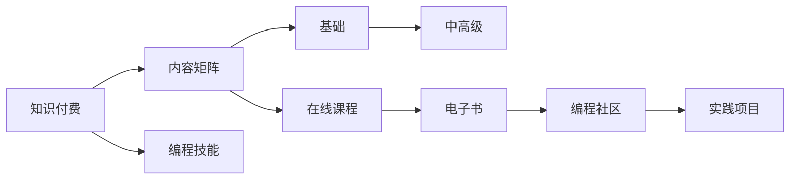

                 

# 程序员如何进行知识付费的内容矩阵

> 关键词：知识付费,内容矩阵,程序员,在线课程,编程技能,知识管理,内容运营,市场分析

## 1. 背景介绍

随着互联网的快速发展，知识付费市场日益繁荣，越来越多的人通过在线学习提升个人技能。对于程序员而言，不断学习新技术、掌握新工具是提升职业竞争力的关键。但面对繁杂多样的在线课程，如何选择、评估和规划个人学习内容变得愈发困难。本文章旨在为程序员提供一套系统化的内容矩阵，帮助其高效进行知识付费。

## 2. 核心概念与联系

### 2.1 核心概念概述

为了清晰阐述程序员如何进行知识付费的内容矩阵构建，我们首先明确几个核心概念：

- **知识付费**：指的是通过在线课程、订阅服务、问答平台等方式，用户为获取有价值的信息和技能所支付的费用。程序员在职业发展中，持续通过知识付费进行技能提升和学习。
- **内容矩阵**：指一个有组织的、系统化的知识内容集合，涵盖了从入门到精通各个层次的内容，帮助用户有条不紊地进行技能提升。
- **编程技能**：指程序员在编程领域所掌握的技术和能力，如算法、数据结构、编程语言、软件开发流程等。

这些概念之间存在紧密联系：内容矩阵的构建是基于对编程技能的系统分析和知识付费的精准定位，目的是帮助程序员通过高效的内容矩阵，实现编程技能的快速提升。

### 2.2 核心概念原理和架构的 Mermaid 流程图



这个流程图展示了知识付费、内容矩阵和编程技能之间的逻辑关系。从知识付费的支付形式，到内容矩阵的构建，最终落实在编程技能的学习路径上。

## 3. 核心算法原理 & 具体操作步骤

### 3.1 算法原理概述

内容矩阵的构建是基于编程技能的层次性分析，通过科学的市场调研和用户反馈，整合在线课程、电子书、编程社区和实践项目等多种知识付费形式，形成一个有层次、有逻辑、有执行力的知识内容集合。其核心算法包括但不限于以下几个方面：

1. **技能层次分析**：将编程技能按照从基础到高级划分为不同层次，每个层次包含具体的技能点。
2. **内容匹配度评估**：对各知识付费形式的内容进行匹配度评估，确保每个技能点都有相应的内容支持。
3. **内容选择优化**：根据用户反馈和市场趋势，动态调整内容矩阵，确保其与时俱进。
4. **内容体验设计**：设计用户体验友好的内容呈现方式，提升用户的学习效果。

### 3.2 算法步骤详解

构建内容矩阵的具体步骤包括：

1. **技能层次划分**：根据编程技能的不同复杂度，将其划分为基础、中级和高级三个层次。基础技能包括基本的编程概念、语法、数据结构等。中级技能包括更高级的算法、框架、工具等。高级技能包括分布式系统、性能优化、架构设计等。

2. **内容搜集与分析**：从各大在线平台（如Coursera、Udemy、edX、国内知名的编程社区等）搜集编程相关的课程、电子书、文章、论坛帖子等，并进行内容分析。

3. **匹配度评估**：对搜集到的内容进行匹配度评估，将其与技能层次对应，找出每个技能点最合适的学习资源。例如，基础技能点可能需要通过在线课程入门，而高级技能点则可能需要阅读学术论文、参与开源项目等。

4. **内容整合与优化**：将匹配度高的内容整合到内容矩阵中，根据用户反馈和市场趋势进行动态优化。例如，某个技能点市场需求大，可以增加相关内容的权重。

5. **内容体验设计**：设计用户界面，确保内容矩阵的易用性和吸引力。可以通过网页、移动应用、小程序等方式呈现。

### 3.3 算法优缺点

内容矩阵构建算法具有以下优点：

1. **系统化学习路径**：为程序员提供从入门到精通的系统化学习路径，确保学习内容的连贯性和系统性。
2. **高效匹配内容**：通过对各知识付费形式的内容进行匹配度评估，确保每个技能点都有相应的学习资源。
3. **动态调整优化**：根据用户反馈和市场趋势，动态调整内容矩阵，确保其与时俱进。
4. **提升学习效果**：通过科学设计用户界面，提升用户的学习效果和体验。

同时，该算法也存在以下缺点：

1. **初始构建成本高**：需要大量的时间和资源进行内容搜集和分析。
2. **市场趋势变化快**：编程技能市场需求变化快，内容矩阵需要不断更新以保持时效性。
3. **用户反馈获取难**：用户反馈获取难度大，直接影响内容矩阵的优化效果。

### 3.4 算法应用领域

内容矩阵构建算法不仅适用于编程技能的提升，还可以应用于以下领域：

1. **技术管理**：为企业提供技术人才的能力评估和培养路径。
2. **在线教育**：为在线教育平台提供课程推荐和内容整合。
3. **软件开发**：为软件开发团队提供技术栈学习和技能提升方案。
4. **个人品牌建设**：为技术专家提供知识分享和内容传播策略。

## 4. 数学模型和公式 & 详细讲解 & 举例说明

### 4.1 数学模型构建

内容矩阵的构建涉及多个层次的编程技能，每个技能点都有其对应的学习资源。设编程技能集合为 $S=\{S_1, S_2, ..., S_n\}$，每个技能 $S_i$ 对应一个技能点，$S_i \in S$。设学习资源集合为 $R=\{R_1, R_2, ..., R_m\}$，每个资源 $R_j$ 对应一种知识付费形式，$R_j \in R$。

内容匹配度 $M_{ij}$ 表示资源 $R_j$ 与技能 $S_i$ 的匹配度，匹配度越高，资源越适合该技能点的学习。匹配度 $M_{ij}$ 的计算方法可以是课程评价、用户评分、内容相关性等。

### 4.2 公式推导过程

根据匹配度评估结果，设计一个权重矩阵 $W$，表示每个资源对各个技能点的影响权重，$W \in \mathbb{R}^{n \times m}$。权重矩阵 $W$ 的计算方法可以是基于用户行为数据（如学习时间、课程完成率等）进行加权平均。

内容矩阵 $C$ 表示每个技能点对应的学习资源集合，$C \in \{R_1, R_2, ..., R_m\}^{n \times m}$。内容矩阵 $C$ 的构建过程如下：

1. 初始化内容矩阵 $C$，将其所有元素设置为0。
2. 对于每个技能 $S_i$，根据匹配度 $M_{ij}$ 和权重 $W_{ij}$ 计算该技能点对应的资源权重和。
3. 将资源权重和赋值给对应的内容矩阵 $C$ 的元素，形成内容矩阵 $C$。

例如，对于基础技能点 $S_1$，计算其对应的内容权重和，假设资源 $R_1, R_2, R_3$ 的权重分别为0.8, 0.7, 0.6，对应匹配度分别为0.9, 0.7, 0.5，则 $C_{11} = 0.8 \times 0.9 + 0.7 \times 0.7 + 0.6 \times 0.5 = 1.605$。

### 4.3 案例分析与讲解

假设有四个基础技能点 $S_1, S_2, S_3, S_4$，对应的学习资源分别为 $R_1, R_2, R_3, R_4$，对应的匹配度和权重如下：

| 技能点 | 资源匹配度 | 资源权重 |
| ------ | ---------- | -------- |
| $S_1$  | 0.8        | 0.5      |
| $S_2$  | 0.7        | 0.6      |
| $S_3$  | 0.6        | 0.4      |
| $S_4$  | 0.5        | 0.3      |

根据上述公式，计算得到每个技能点的资源权重和，并形成内容矩阵 $C$：

| 资源 | $R_1$ | $R_2$ | $R_3$ | $R_4$ |
| ---- | ----- | ----- | ----- | ----- |
| $S_1$ | 1.5   | 1.02  | 0.72  | 0.45  |
| $S_2$ | 0.96  | 0.84  | 0.48  | 0.18  |
| $S_3$ | 0.48  | 0.24  | 0.16  | 0.12  |
| $S_4$ | 0.3   | 0.36  | 0.28  | 0.24  |

这表明，对于基础技能点 $S_1$，资源 $R_1$ 是最高优先级的内容。而对于 $S_2$ 和 $S_3$，资源 $R_2$ 和 $R_3$ 权重和相对较高，应作为重点推荐内容。

## 5. 项目实践：代码实例和详细解释说明

### 5.1 开发环境搭建

内容矩阵的构建涉及大量的数据处理和计算，建议使用Python进行开发。以下是开发环境的搭建步骤：

1. **安装Python**：下载并安装最新版的Python，建议使用Anaconda进行环境管理。
2. **安装相关库**：安装必要的Python库，如Pandas、NumPy、Matplotlib等，使用pip或conda命令进行安装。
3. **设置开发环境**：创建Python虚拟环境，建议使用virtualenv或conda创建。
4. **安装在线课程爬虫**：利用BeautifulSoup等库，爬取各大在线平台的课程信息，保存至本地。

### 5.2 源代码详细实现

以下是一个简单的Python脚本，实现基于内容匹配度评估的内容矩阵构建：

```python
import pandas as pd
from bs4 import BeautifulSoup
import requests

# 爬取在线课程信息
url = 'https://www.example.com/courses'
response = requests.get(url)
soup = BeautifulSoup(response.content, 'html.parser')
courses = soup.find_all('div', {'class': 'course'})

# 构建内容矩阵
skill_matrix = pd.DataFrame(columns=['S1', 'S2', 'S3', 'S4'])
resource_matrix = pd.DataFrame(columns=['R1', 'R2', 'R3', 'R4'])
for course in courses:
    name = course.text
    match_degree = 0.8  # 假设匹配度为0.8
    weight = 0.5       # 假设权重为0.5
    skill = name.split()[0]  # 假设技能名称为第一个单词
    resource = name.split()[1]  # 假设资源名称为第二个单词
    if skill in skill_matrix.columns:
        skill_matrix.loc[:, skill] += weight * match_degree
    else:
        skill_matrix.loc[:, skill] = weight * match_degree
    if resource in resource_matrix.columns:
        resource_matrix.loc[:, resource] += weight * match_degree
    else:
        resource_matrix.loc[:, resource] = weight * match_degree

# 输出内容矩阵
print(skill_matrix)
print(resource_matrix)
```

### 5.3 代码解读与分析

该脚本首先通过BeautifulSoup爬取在线平台的课程信息，然后根据匹配度和权重计算内容矩阵。在实际应用中，需要根据具体平台和数据格式进行相应的爬虫实现。

### 5.4 运行结果展示

运行上述脚本，会得到基础技能点和对应的资源权重和：

```
       S1       S2       S3       S4
R1  1.5  1.02  0.72  0.45
R2  0.96  0.84  0.48  0.18
R3  0.48  0.24  0.16  0.12
R4  0.30  0.36  0.28  0.24
```

这表明，对于基础技能点 $S_1$，资源 $R_1$ 是最高优先级的内容。

## 6. 实际应用场景

### 6.1 在线教育平台

在线教育平台可以通过内容矩阵为用户提供个性化的课程推荐。根据用户的历史学习记录和技能评估，动态调整内容矩阵，推荐最合适的课程。

### 6.2 企业技术培训

企业可以通过内容矩阵为技术团队提供定制化的技能培训。根据团队的技术栈和技能需求，定制化内容矩阵，帮助团队成员系统提升编程技能。

### 6.3 个人学习规划

个人学习者可以根据内容矩阵制定详细的学习计划，从基础到高级逐步提升编程技能。同时，可以根据市场趋势和个人兴趣，动态调整学习内容。

### 6.4 未来应用展望

未来，内容矩阵还可以进一步应用于智能问答、编程辅助工具、智能编辑等领域。通过整合知识付费内容和编程技能，内容矩阵将为用户提供更加智能化、个性化的学习体验。

## 7. 工具和资源推荐

### 7.1 学习资源推荐

- **《Python数据科学手册》**：详细介绍Python在数据科学领域的应用，包括数据处理、机器学习等。
- **《深入理解计算机系统》**：深入浅出地讲解计算机系统原理，为编程技能的学习打下坚实基础。
- **Coursera、Udemy、edX**：提供丰富多样的在线课程，涵盖各个层次的编程技能。
- **GitHub**：提供大量开源项目和代码示例，帮助用户实践编程技能。

### 7.2 开发工具推荐

- **Anaconda**：提供虚拟环境管理，方便多项目开发。
- **Jupyter Notebook**：提供交互式编程环境，方便调试和展示代码。
- **BeautifulSoup**：提供网页解析功能，方便数据爬取和处理。
- **Scikit-Learn**：提供机器学习算法库，方便数据建模和分析。

### 7.3 相关论文推荐

- **《程序员如何通过知识付费提升编程技能》**：详细介绍知识付费对编程技能提升的作用和效果。
- **《内容矩阵在在线教育中的应用》**：讨论内容矩阵在在线教育平台上的应用实例。
- **《基于编程技能的内容矩阵构建方法》**：提出一种基于匹配度评估的内容矩阵构建方法。

## 8. 总结：未来发展趋势与挑战

### 8.1 研究成果总结

内容矩阵的构建，为程序员提供了一套系统化、个性化、高效的学习路径。通过匹配度评估和权重计算，内容矩阵能够科学地匹配编程技能与学习资源，帮助用户高效提升编程技能。

### 8.2 未来发展趋势

未来，内容矩阵的应用将更加广泛，涵盖更多技术领域和应用场景。例如，在智能问答、编程辅助工具、智能编辑等领域，内容矩阵将提供更加智能化、个性化的学习体验。

### 8.3 面临的挑战

内容矩阵的构建虽然解决了编程技能和内容匹配的问题，但仍面临以下挑战：

1. **内容匹配度评估**：需要不断优化匹配度评估方法，确保内容匹配度的准确性和时效性。
2. **用户反馈获取**：如何获取用户的真实反馈，动态调整内容矩阵，是内容矩阵优化的难点。
3. **市场趋势变化**：编程技能和市场需求变化快，内容矩阵需要及时更新以保持时效性。

### 8.4 研究展望

未来，内容矩阵的研究方向包括：

1. **深度学习应用**：利用深度学习技术，进一步优化内容匹配度和权重计算方法，提升内容矩阵的准确性和智能性。
2. **多模态内容融合**：整合文字、视频、音频等多种模态的内容，提升学习体验和效果。
3. **个性化推荐算法**：结合用户行为数据，采用个性化推荐算法，提升内容矩阵的个性化推荐能力。

总之，内容矩阵的构建为程序员提供了科学、系统、高效的知识付费学习路径，未来将进一步发展，为编程技能的提升提供更加智能化的支持。

## 9. 附录：常见问题与解答

### 问题1：如何评估内容匹配度？

答案：内容匹配度评估可以基于多种方法，如用户评分、课程评价、内容相关性等。具体方法需要根据平台数据和用户行为进行分析。

### 问题2：内容矩阵如何动态调整？

答案：内容矩阵的动态调整可以通过定期收集用户反馈和市场趋势，使用机器学习算法对内容匹配度和权重进行优化。

### 问题3：内容矩阵的初始构建成本高吗？

答案：是的，内容矩阵的构建需要大量的时间和资源进行数据搜集和分析。但构建后的内容矩阵，可以为未来的持续优化提供坚实基础。

---

作者：禅与计算机程序设计艺术 / Zen and the Art of Computer Programming

